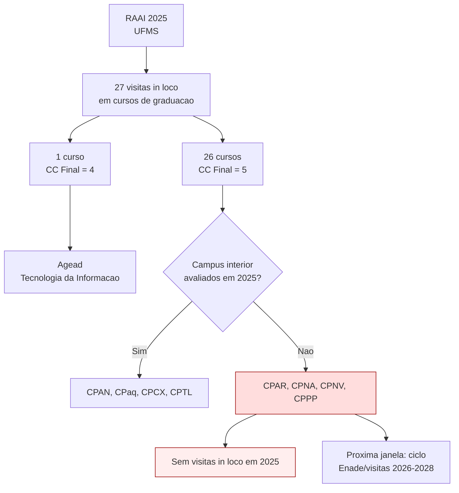
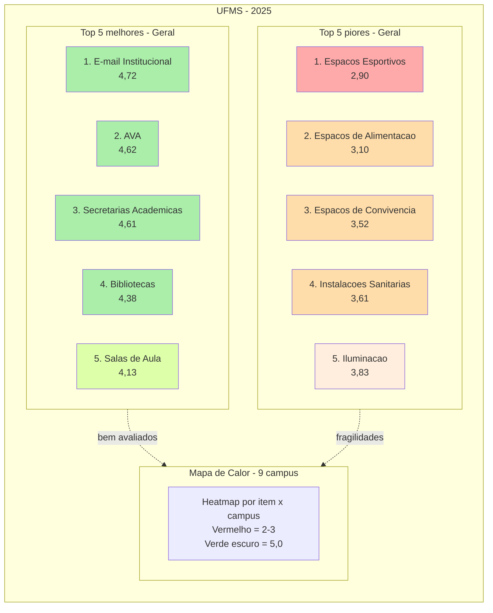
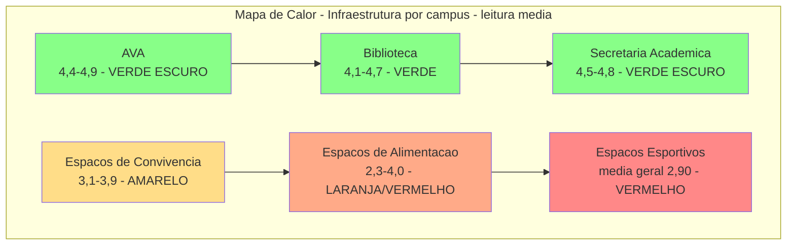
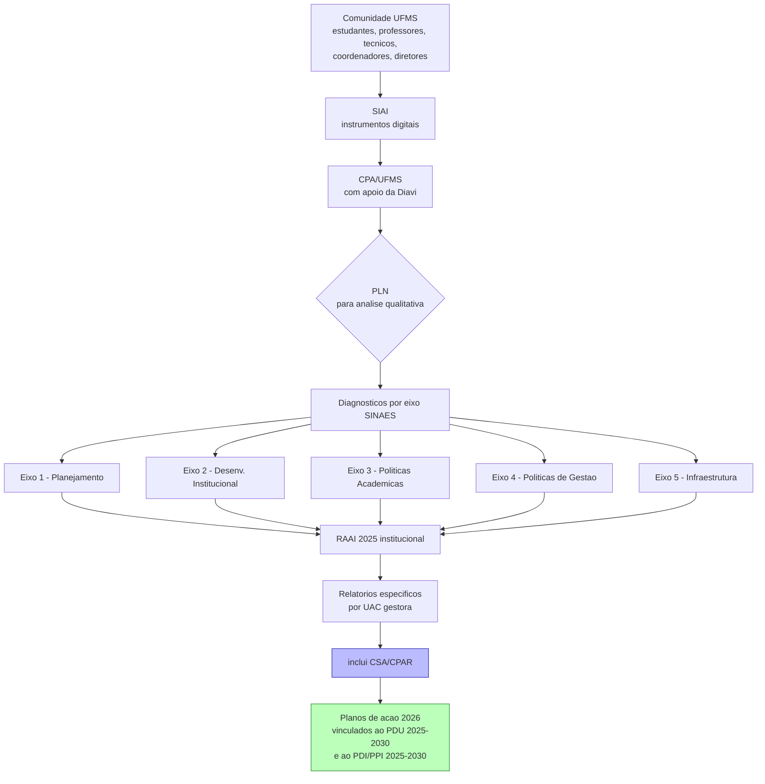

# Relatório de Autoavaliação Institucional 2025 (RAAI 2025) — UFMS

> **Fonte primária**: `RAAI 2025.pdf`, Google Drive, ID `1hEfa7Tv7jneEQLON1N5trbZDP6pIg0QZ`.
> **Link público do viewer**: `https://drive.google.com/file/d/1hEfa7Tv7jneEQLON1N5trbZDP6pIg0QZ/preview`.
> **Tipo de documento**: Relatório institucional da CPA/UFMS, 90 páginas, NÃO setorial. Estrutura por Eixos do SINAES, não por câmpus.
> **Data de extração**: 07 set 2026. **Método**: viewer do Google Drive via DOM acessível (download público bloqueado). Páginas efetivamente extraídas: 1, 2, 3, 5, 6, 7, 11, 12, 13, 14, 29, 30, 31, 32, 79, 80, 81, 82, 89, 90.
> **Skill registrada**: `pdf-drive-viewer-extractor` (procedimento completo de extração).

## Aviso de cobertura

Este markdown é uma **visão geral institucional** com **foco no CPAR**. A extração completa das 90 páginas exigiria ~20 saltos adicionais no viewer; optei por priorizar páginas com alta probabilidade de menção a Paranaíba ou relevância analítica (introdução, sumário, metodologia parcial, eixo de infraestrutura, considerações finais). As **~70 páginas não cobertas** provavelmente contêm:
- Eixo 1 completo (Planejamento e Avaliação Institucional, p. 24-51): percentuais de adesão por segmento e por unidade técnica-administrativa.
- Eixo 2 (Planejamento e Desenvolvimento Institucional, p. 52-54).
- Eixo 3 (Políticas Acadêmicas, p. 55-71): tabelas por unidade/coordenação, incluindo possivelmente a avaliação das coordenações dos cursos do CPAR.
- Eixo 4 (Políticas de Gestão, p. 72-78): capacitação, desempenho de servidores, imagem geral.
- Eixo 5 (Mapa de Calor por unidade da Cidade Universitária, p. 83-86).
- Ações executadas em 2025 (p. 86-88).

Para extração completa: o caminho mais barato é pedir ao proprietário que altere a permissão para "qualquer pessoa com o link" e enviar o arquivo como anexo. Enquanto isso, qualquer página adicional pode ser puxada com a skill `pdf-drive-viewer-extractor`.

---

## 1. Capa e composição institucional

### 1.1. Identificação do documento

- **Título**: Relatório de Avaliação Institucional 2025 (grafia na capa: "RELATÓRIO DE VALIAÇÃO INSTITUCIONAL | 2025" — provável erro de revisão tipográfica).
- **Emitente**: Comissão Própria de Avaliação (CPA) da UFMS.
- **Total de páginas**: 90.
- **Base normativa**: Lei nº 10.861/2004 (SINAES); Nota Técnica Inep/DAES/CONAES nº 65, de 9/10/2014.

### 1.2. Dados da Instituição (extraído da p. 13)

- **Denominação completa**: Fundação Universidade Federal de Mato Grosso do Sul.
- **Denominação abreviada**: UFMS.
- **Código SIORG**: 827. **Código LOA**: 26283. **Código SIAFI**: 154054.
- **Natureza jurídica**: Fundação.
- **Principal atividade**: Educação.
- **Telefone**: (67) 3345-7975.
- **Endereço eletrônico**: reitoria@ufms.br.
- **Página web**: http://www.ufms.br.
- **Endereço postal**: Cidade Universitária, Caixa Postal 549, CEP 79070-900, Campo Grande/MS.

### 1.3. Composição da CPA (Portaria nº 1096, de 12/08/2025)

- **Presidente**: Jacyara de Souza.
- **Substituto(a) imediato(a)**: [não extraído].
- **Representantes Docentes**: Caroline Gonçalves; Fabio da Silva Rodrigues; Marcela de Rezende Costa; Ricardo Caneiro Brumatti; Rogers Barros de Paula.
- **Representantes Técnico-Administrativos**: Max Gustavo Kataoka; Cassia Jesuíno Mendes; Rafael Domingos Ledesma Ledesma de Nadai; Thayane Ely Lima.
- **Representantes dos Estudantes**:
  - Graduação: Gustavo Furlan Araujo.
  - Pós-Graduação: Dinah Vitória dos Santos Madruga.
- **Representante da Sociedade Civil Organizada**: Cristiane Gomes Nunes (Sebrae).

### 1.4. Dirigentes das Unidades (extraído da p. 2)

**Administração Central — Pró-Reitorias:**

| Unidade | Dirigente |
|---|---|
| Reitoria | Camila Celeste Brandão Ferreira Ítavo |
| Vice-Reitoria | Albert Schiavito de Souza |
| Pró-Reitoria de Administração e Infraestrutura | Hercules da Costa Sandim |
| Pró-Reitoria de Assuntos Estudantis | Edilson José Zafalon |
| Pró-Reitoria de Cidadania e Sustentabilidade | Vivina Dias Sol Queiroz |
| Pró-Reitoria de Extensão, Cultura e Esporte | Lia Raquel Toledo Brambilla Gasques |
| Pró-Reitoria de Gestão de Pessoas | Gislene Walter da Silva |
| Pró-Reitoria de Graduação | Cristiano Costa Argemon Vieira |
| Pró-Reitoria de Pesquisa e Pós-Graduação | Fabrício de Oliveira Frazílio |
| Pró-Reitoria de Planejamento e Desenvolvimento Institucional | Dulce Maria Tristão |

**Agências da RTR:**

| Agência | Dirigente |
|---|---|
| Agência de Comunicação Social e Científica (Agecom) | Rose Mara Pinheiro |
| Agência de Educação Digital e a Distância (Agead) | Daiani Damm Tonetto Riedner |
| Agência de Inovação (Aginova) | João Batista Sarmento dos Santos Neto |
| Agência de Internacionalização (Aginter) | Gustavo Santiago Torrecilha Cancio |
| Agência de Tecnologia da Informação e Comunicação (Agetic) | Anderson Viçoso de Araujo |

**Unidades Setoriais — Campo Grande:**

| Unidade | Dirigente |
|---|---|
| Escola de Administração e Negócios (Esan) | Claudio Cesar da Silva |
| Faculdade de Artes, Letras e Comunicação (Faalc) | Gustavo Rodrigues Penha |
| Faculdade de Ciências Farmacêuticas, Alimentos e Nutrição (Facfan) | Luciana Miyagusku |
| Faculdade de Ciências Humanas (Fach) | Cleverson Rodrigues da Silva |
| Faculdade de Computação (Facom) | Liana Dessandre Duenha Garanhani |
| Faculdade de Direito (Fadir) | Fernando Lopes Nogueira |
| Faculdade de Educação (Faed) | Milene Bartolomei Silva |
| Faculdade de Engenharias, Arquitetura e Urbanismo e Geografia (Faeng) | Fábio Veríssimo Gonçalves |
| Faculdade de Medicina (Famed) | Augustin Malzac |
| Faculdade de Medicina Veterinária e Zootecnia (Famez) | Carlos Alberto do Nascimento Ramos |
| Faculdade de Odontologia (Faodo) | Fabio Nakao Arashiro |
| Instituto de Biociências (Inbio) | Carla Cardozo Pinto de Arruda |
| Instituto de Física (Infi) | Dorotéia de Fátima Bozano |
| Instituto Integrado de Saúde (Inisa) | Nathan Aratani |
| Instituto de Matemática (Inma) | Bruno Dias Amaro |
| Instituto de Química (Inqui) | Carlos Eduardo Domingues Nazario |

**Câmpus do interior:**

| Câmpus | Sigla | Dirigente |
|---|---|---|
| Câmpus de Aquidauana | CPaq | Ana Graziele Lourenço Toledo |
| **Câmpus de Paranaíba** | **Cpar** | **Andreia Cristina Ribeiro** |
| Câmpus de Chapadão do Sul | CPCS | Wallace da Silva de Almeida |
| Câmpus de Coxim | CPCX | Silvana Aparecida da Silva Zanchett |
| Câmpus de Nova Andradina | CPNA | Paulo Cesar Schotten |
| Câmpus de Naviraí | CPNV | Daniel Henrique Lopes |
| Câmpus de Ponta Porã | CPPP | Leonardo Souza Silva |
| Câmpus de Três Lagoas | CPTL | Larissa da Silva Barcelos |

**Unidade suplementar:**

| Unidade | Dirigente |
|---|---|
| Hospital Universitário Maria Aparecida Pedrossian (Humap) | Andrea de Siqueira Campos Lindenberg |

> **Nota para a CSA/CPAR**: o dirigente nominal do Câmpus de Paranaíba em 2025, conforme o RAAI, é **Andreia Cristina Ribeiro**. Recomenda-se conferir no SEI/Sigadmin se essa indicação corresponde à direção vigente no momento da emissão do relatório ou a um período anterior (a composição foi declarada em ago/2025).

---

## 2. Siglas e abreviaturas (extraído da p. 3)

| Sigla | Definição |
|---|---|
| Agead | Agência de Educação Digital e a Distância |
| Agecom | Agência de Comunicação Social e Científica |
| Agetic | Agência de Tecnologia da Informação e Comunicação |
| Aginova | Agência de Inovação |
| Aginter | Agência de Internacionalização |
| AVA | Ambiente Virtual de Aprendizagem |
| CPA | Comissão Própria de Avaliação |
| CPan | Câmpus do Pantanal |
| CPaq | Câmpus de Aquidauana |
| **Cpar** | **Câmpus de Paranaíba** |
| CPCS | Câmpus de Chapadão do Sul |
| CPCX | Câmpus de Coxim |
| CPNA | Câmpus de Nova Andradina |
| CPNV | Câmpus de Naviraí |
| CPPP | Câmpus de Ponta Porã |
| CPTL | Câmpus de Três Lagoas |
| CSA | Comissão Setorial de Avaliação |
| Diavi | Diretoria de Avaliação Institucional |
| Diper | Diretoria de Inovação Pedagógica e Regulação |
| EaD | Educação a Distância |
| Enade | Exame Nacional de Desempenho dos Estudantes |
| Enamed | Exame Nacional de Avaliação da Formação Médica |
| Esan | Escola de Administração e Negócios |
| Faalc | Faculdade de Artes, Letras e Comunicação |
| Facfan | Faculdade de Ciências Farmacêuticas, Alimentos e Nutrição |
| Fach | Faculdade de Ciências Humanas |
| Facom | Faculdade de Computação |
| Fadir | Faculdade de Direito |
| Faed | Faculdade de Educação |
| Faeng | Faculdade de Engenharias, Arquitetura e Urbanismo e Geografia |
| Famed | Faculdade de Medicina |
| Famez | Faculdade de Medicina Veterinária e Zootecnia |
| Faodo | Faculdade de Odontologia |
| Inbio | Instituto de Biociências |
| Infi | Instituto de Física |
| Inisa | Instituto Integrado de Saúde |
| Inma | Instituto de Matemática |
| Inqui | Instituto de Química |
| Inep | Instituto Nacional de Estudos e Pesquisas Educacionais Anísio Teixeira |
| PDI | Plano de Desenvolvimento Institucional |
| PDU | Plano de Desenvolvimento da Unidade |
| PPI | Projeto Pedagógico Institucional |
| Proadi | Pró-Reitoria de Administração e Infraestrutura |

> A lista foi interrompida na p. 3 (continua em páginas não extraídas; inclui provavelmente: Proaes, Proece, Progep, Proplan, RTR, Siai, Siscad, Sigpos, UFMS, entre outras).

---

## 3. Estrutura do relatório (sumário, p. 5-6)

### 3.1. Sumário navegável

1. **Introdução** (p. 12)
   - 1.1. Histórico da Instituição (p. 13)
2. **Metodologia da Autoavaliação Institucional** (p. 16)
   - 2.1. Segmentos Participantes (p. 16)
   - 2.2. Etapas, Técnicas e Instrumentos (p. 16)
     - 2.2.1. Preparação (p. 18)
     - 2.2.2. Sensibilização (p. 18)
     - 2.2.3. Consulta aos segmentos e coleta de informações (p. 19)
     - 2.2.4. Sistematização, análise e diagnóstico (p. 20)
     - 2.2.5. Divulgação dos resultados (p. 21)
     - 2.2.6. Meta-avaliação ou balanço crítico (p. 22)
3. **Eixos da Autoavaliação Institucional** (p. 24)
   - **3.1. Eixo 1: Planejamento e Avaliação Institucional** (p. 24)
     - 3.1.1. Dimensão 8: planejamento e avaliação (p. 24)
       - 3.1.1.1. Planejamento e execução da avaliação institucional (p. 24)
       - 3.1.1.2. Sensibilização da Comunidade (p. 29)
       - 3.1.1.3. Avaliações externas (p. 30)
         - 3.1.1.3.1. Avaliação externa: visitas in loco (p. 30)
         - 3.1.1.3.1. Avaliação externa: Enade e Indicadores de Qualidade (p. 33)
       - 3.1.1.4. Rankings Universitários (p. 40)
         - 3.1.1.4.1. Rankings Internacionais (p. 40)
         - 3.1.1.4.2. Rankings Nacionais (p. 42)
         - 3.1.1.4.3. Painel Orgulhos da UFMS (p. 43)
       - 3.1.1.5. Egressos (p. 43)
         - 3.1.1.5.1. Graduação (p. 44)
         - 3.1.1.5.2. Pós-graduação (p. 48)
         - 3.1.1.5.3. Acompanhamento de Egressos (p. 50)
     - 3.1.2. O Planejamento e a autoavaliação institucional na percepção dos segmentos da UFMS (p. 51)
   - **3.2. Eixo 2: Planejamento e Desenvolvimento Institucional** (p. 52)
     - 3.2.1. O Planejamento e desenvolvimento institucional na percepção dos segmentos da UFMS (p. 53)
   - **3.3. Eixo 3: Políticas Acadêmicas** (p. 55)
     - 3.3.1. As políticas Acadêmicas na percepção dos segmentos da UFMS (p. 55)
       - 3.3.1.1. Avaliação da Coordenação (p. 55)
       - 3.3.1.2. A Percepção das Coordenações sobre a Gestão Acadêmica (p. 56)
       - 3.3.1.3. Avaliação das Disciplinas e desempenho dos professores e Estudantes (p. 58)
       - 3.3.1.4. Desempenho estudantil (p. 60)
       - 3.3.1.5. A percepção do estudante sobre a prática do professor (p. 64)
       - 3.3.1.6. A Percepção do Professor sobre o Ensino e o Engajamento do Estudante (p. 64)
       - 3.3.1.7. Avaliação das Políticas de Ensino, Internacionalização, Pesquisa, Inovação Tecnológica e Extensão (p. 67)
       - 3.3.1.7 (numeração repetida no original). Avaliação das Políticas de Atendimento aos Estudantes e Egressos (p. 69)
       - 3.3.1.9. Avaliação da Comunicação da UFMS com a comunidade (p. 71)
   - **3.4. Eixo 4: Políticas de Gestão** (p. 72)
     - 3.4.1. Avaliação das Políticas de capacitação e qualificação de servidores (p. 72)
     - 3.4.2. Avaliação do Desempenho do servidor (p. 73)
     - 3.4.3. Avaliação da Imagem geral da UFMS e seu ambiente (p. 75)
   - **3.5. Eixo 5: Infraestrutura** (p. 79)
     - 3.5.1. Percepção da comunidade universitária (p. 79)
       - 3.5.1.1. Ranking de Satisfação (Visão Geral UFMS) (p. 79)
       - 3.5.1.2. Mapa de Calor: por Item e por Unidade (p. 80)
     - 3.5.2. Ações Executadas em 2025 (p. 86)
4. **Considerações Finais** (p. 89)

### 3.2. Lista de Tabelas (extraída da p. 7, parcial — Tabelas 1 a 25)

| Tabela | Título | Página |
|---|---|---|
| 1 | Percentual de adesão dos segmentos da UFMS à Autoavaliação Institucional 2025 | 26 |
| 2 | Percentual de adesão por unidade dos técnico-administrativos das UACs em 2025 | 28 |
| 3 | Cursos de graduação avaliados pelo Inep/MEC em 2025 | 30 |
| 4 | Cursos de graduação que realizaram o Enade 2025 na UFMS | 33 |
| 5 | Quantidade de cursos por Conceito Enade — Ciclo 2021, 2022 e 2023 | 38 |
| 6 | Quantidade de cursos por CPC — Ciclo 2021, 2022 e 2023 | 39 |
| 7 | Índice Geral de cursos 2021-2023 | 39 |
| 8 | Desempenho da UFMS nos Rankings Universitários Internacionais | 42 |
| 9 | Distribuição por faixa etária dos egressos da graduação (2023-2025) | 45 |
| 10 | Avaliação do processo de autoavaliação pelos Estudantes | 51 |
| 11 | Avaliação do processo de autoavaliação pelos servidores | 52 |
| 12 | Avaliação das políticas de desenvolvimento institucional pelos Estudantes | 53 |
| 13 | Avaliação das políticas de desenvolvimento institucional pelos servidores | 54 |
| 14 | Avaliação da coordenação pelo coordenador (autoavaliação) | 55 |
| 15 | Distribuição de Frequência por Categoria Temática (Percepção das Coordenações) | 56 |
| 16 | Avaliação da coordenação pelos estudantes | 57 |
| 17 | Avaliação das disciplinas e professores pelos Estudantes | 58 |
| 18 | Avaliação dos professores quanto ao seu próprio desempenho nas disciplinas ministradas | 59 |
| 19 | Avaliação dos Estudantes quanto ao próprio desempenho nas disciplinas | 60 |
| 20 | Avaliação dos Estudantes quanto ao próprio desempenho nas demais atividades acadêmicas | 62 |
| 21 | Avaliação do desempenho dos estudantes nas disciplinas, pelos professores | 63 |
| 22 | Distribuição de Frequência por Categoria Temática (Percepção do Estudante) | 64 |
| 23 | Distribuição de Frequência por Categoria Temática (Percepção do Professor) | 65 |
| 24 | Distribuição de Frequência por Categoria Temática (Percepção do Estudante — EaD) | 66 |
| 25 | Avaliação das políticas de ensino pelos professores, coordenadores de curso de graduação e pós-graduação e diretor | 67 |

> A lista foi interrompida em Tabela 25; existem provavelmente até ~40+ tabelas (a Tabela 40 aparece na p. 80, conforme extração).

### 3.3. Lista de Figuras

A lista de figuras (geralmente entre p. 7 e p. 11) **não foi extraída** neste lote. Para obtê-la, saltar para p. 8-10 com a skill `pdf-drive-viewer-extractor`.

---

## 4. Introdução e contexto institucional (extraído das p. 12-14)

### 4.1. Missão e visão (citação direta)

> "A Fundação Universidade Federal de Mato Grosso do Sul (UFMS) tem como missão desenvolver e socializar o conhecimento em benefício da sociedade, formando líderes, profissionais e cidadãos conscientes, comprometidos com o crescimento sustentável do país e do mundo. Sua visão institucional é ser uma universidade acessível a todas as pessoas e reconhecida, nacional e internacionalmente, pela excelência em ensino, pesquisa, extensão, empreendedorismo, sustentabilidade, inovação, arte e cultura, esporte e lazer, além da popularização da ciência (PDI integrado ao PPI 2025–2030, p. 16–17)."

### 4.2. Escala da UFMS em 2025

| Indicador | Valor |
|---|---|
| Estudantes matriculados | **41.371** |
| Estudantes de graduação | 28.955 |
| Estudantes de pós-graduação (stricto + lato sensu) | 12.416 |
| Cursos de graduação | **138** (127 presenciais + 11 a distância) |
| Programas de pós-graduação stricto sensu | 40 |
| Cursos de especialização | 46 |
| Programas de residência médica e multiprofissional | (não detalhado) |
| Câmpus e unidades | Campo Grande + 22 municípios + polos + AVA-UFMS |

### 4.3. Posicionamento da autoavaliação institucional

A UFMS compreende a avaliação institucional como "instrumento estratégico para o aprimoramento contínuo da gestão universitária e para o fortalecimento da cultura avaliativa", no escopo do SINAES (Lei nº 10.861/2004). O relatório integra indicadores acadêmicos e administrativos ao planejamento institucional (PDI/PPI 2025-2030). A elaboração seguiu a Nota Técnica Inep/DAES/CONAES nº 65/2014.

### 4.4. Histórico institucional (resumo cronológico relevante ao CPAR)

| Ano | Fato |
|---|---|
| 1962 | Criação da Faculdade de Farmácia e Odontologia de Campo Grande, marco inicial do ensino superior público no sul de Mato Grosso. |
| 1966 | Lei Estadual nº 2.620 cria o Instituto de Ciências Biológicas de Campo Grande (ICBCG), reorganiza estrutura e cria curso de Medicina. |
| 1969 | Lei Estadual nº 2.947 cria a Universidade Estadual de Mato Grosso (UEMT), sede em Campo Grande. |
| 1970 | Incorporação dos Centros Pedagógicos de Aquidauana e Dourados. |
| 1977 | Início do processo de federalização da UEMT após divisão de Mato Grosso. |
| 1979 | Lei Federal nº 6.674 cria a Fundação Universidade Federal de Mato Grosso do Sul. Rondonópolis passa à UFMT. |
| **2001** | **Implantação dos câmpus de Coxim (CPCX) e Paranaíba (Cpar)**, e credenciamento para oferta de cursos a distância. |
| 2004 | Resolução COUN nº 55 (Regimento Geral) prevê novas unidades em Chapadão do Sul, Naviraí, Nova Andradina e Ponta Porã. |
| 2005 | Implantação dos câmpis de Chapadão do Sul (CPCS) e Nova Andradina (CPNA). Desmembramento de Dourados para criar a UFGD. |
| 2006 | Adesão ao Sistema Universidade Aberta do Brasil (UAB). |
| 2007 | Adesão ao REUNI — criação de novos cursos e ampliação de vagas. |
| 2009-2014 | Criação da Facom, Fadir, Infi, Inqui, Inma, Faeng, Esan. |
| 2017 | Reorganização acadêmica: criação de Inbio, Inisa, Facfan, Fach, Faed, Faalc. Campus de Bonito → Base de Estudos. |
| **2025** | Oferta de **138 cursos de graduação (127 presenciais + 11 a distância)**, 40 programas stricto sensu, 46 cursos de especialização. |

> **Para a CSA/CPAR**: o histórico institucional posiciona o Cpar como câmpus implantado em 2001 (24 anos em 2025). Vale destacar que o câmpus oferta atualmente 4 cursos presenciais (Administração, Matemática, Psicologia, Medicina Veterinária) e o Programa de Residência Uniprofissional em Psicologia Clínica; essas informações específicas do CPAR não foram extraídas porque o RAAI é institucional e agrega por eixo, não por câmpus.

---

## 5. Metodologia e percepção da comunidade

### 5.1. Estratégia metodológica

A UFMS aplica a avaliação por meio de **todos os segmentos** (estudantes, professores, técnico-administrativos, coordenadores, diretores), via SIAI (Sistema de Avaliação Institucional), garantindo sigilo, rastreabilidade e padronização. Em 2025, a CPA utilizou adicionalmente **recursos de processamento de linguagem natural (PLN)** nas análises qualitativas, ampliando a capacidade de interpretar os relatos da comunidade (mencionado nas Considerações Finais, p. 89).

### 5.2. Ações de sensibilização em 2025 (extraído das p. 29-30)

A Agecom foi o pilar da divulgação institucional, com produção de cartazes e peças digitais distribuídas em murais, sites institucionais e sistemas acadêmicos (Siscad, Sigpos, AVA, Diário do Professor). As CSAs executaram estratégias locais criativas:

- Reserva de laboratórios de informática para resposta pelos estudantes.
- Oferecimento de lanches e brindes (pipoca, paçoquinha, picolés).
- Atividades culturais: **CSA do CPTL** promoveu apresentação de banda musical.
- Reuniões de divulgação dos resultados para a comunidade acadêmica.

> **Para a CSA/CPAR**: o RAAI 2025 não nomeia explicitamente a CSA do Cpar entre as iniciativas destacadas (Cita-se apenas o CPTL como exemplo). Sugere-se incluir no Relatório Setorial 2026 um parágrafo descrevendo as ações de sensibilização específicas do CPAR para garantir visibilidade no ciclo seguinte.

### 5.3. Adesão por unidade técnica-administrativa (parcial — Tabela 2, p. 29)

Ranking parcial extraído:

| Posição | Unidade | % de adesão |
|---|---|---|
| 5º | Proplan/RTR | 71,43 |
| 6º | Agetic/RTR | 63,89 |
| 7º | Proece/RTR | 62,16 |
| 8º | Aginova/RTR | 61,11 |
| 9º | Proaes/RTR | 55,88 |
| 10º | Prograd/RTR | 54,55 |
| 11º | Proadi/RTR | 46,85 |
| 12º | Progep/RTR | 35,80 |
| 13º | Prograd/RTR | 65,91 |
| **UACs (média)** | — | **59,22** |

> Fonte: SIAI (2025). Acesso em 17/11/2025.
>
> **Observação**: o ranking está incompleto (faltam posições 1-4 e há repetição de "Prograd/RTR" com percentuais distintos, o que sugere erro tipográfico no original — provavelmente a 13ª posição deveria ser outra unidade). Recomenda-se conferir a Tabela 2 diretamente.

---

## 6. Avaliações externas em 2025 (extraído das p. 30-32)

### 6.1. Visitas in loco do Inep/MEC (Tabela 3, p. 30-32)

- Total de cursos avaliados: **27** avaliações in loco em cursos de graduação.
- Conceito de Curso (CC) máximo (nota 5): **26 cursos**.
- Conceito 4: **1 curso** (Tecnologia da Informação da Agead, com CC contínuo 3,84).

> **Para a CSA/CPAR**: **nenhum curso do Câmpus de Paranaíba foi submetido a visita in loco em 2025**. Os 27 cursos avaliados distribuem-se em: CPAN (Ciências Biológicas, Pedagogia), CPaq (Geografia, Letras Português-Inglês, Pedagogia, Ciências Biológicas, História, Matemática-Licenciatura, Licenciatura Intercultural Indígena), Infi (Física), CPTL (Pedagogia, História, Geografia, Ciências Biológicas, Matemática), Faed (Pedagogia), CPCX (Letras Português), Inma (Matemática), Inqui (Química), Fach (Ciências Sociais), Agead (Tecnologia da Informação, Matemática-PRIL, Pedagogia-PRIL, Letras Português-PRIL), Facom (Sistemas de Informação, Ciência da Computação), Faalc (Letras Português-Inglês).

### 6.2. Tabela 3 (parcial) — Conceitos médios por dimensão

| Unidade | Curso | CC Contínuo | CC Final |
|---|---|---|---|
| CPAN | Ciências Biológicas | 4,89 | 5 |
| CPaq | Geografia — Licenciatura | 5,00 | 5 |
| Infi | Física — Licenciatura | 4,69 | 5 |
| CPTL | Pedagogia | 4,66 | 5 |
| CPAN | Pedagogia | 4,95 | 5 |
| Faed | Pedagogia | 4,74 | 5 |
| CPCX | Letras Português | 4,64 | 5 |
| CPTL | História | 4,96 | 5 |
| CPTL | Geografia — Licenciatura | 4,96 | 5 |
| CPaq | Letras Português-Inglês | 4,94 | 5 |
| Inma | Matemática —Licenciatura | 4,75 | 5 |
| Inqui | Química —Licenciatura | 4,96 | 5 |
| Fach | Ciências Sociais — Bacharelado | 4,88 | 5 |
| CPaq | Pedagogia | 4,92 | 5 |
| **Agead** | **Tecnologia da Informação** | **3,84** | **4** |
| CPTL | Ciências Biológicas | 4,71 | 5 |
| CPaq | Ciências Biológicas | 4,58 | 5 |
| Facom | Sistemas de Informação — Bacharelado | 4,54 | 5 |
| CPaq | História | 4,82 | 5 |
| CPaq | Matemática — Licenciatura | 4,81 | 5 |
| CPTL | Matemática | 4,57 | 5 |
| Facom | Ciência da Computação — Bacharelado | 4,83 | 5 |
| CPaq | Licenciatura Intercultural Indígena | 4,90 | 5 |
| Faalc | Letras Português-Inglês | 4,96 | 5 |
| Agead | Matemática — PRIL | 4,93 | 5 |
| Agead | Pedagogia — PRIL | 4,97 | 5 |
| Agead | Letras Português — PRIL | 4,97 | 5 |

**Síntese analítica (3ª dimensão — Infraestrutura)**:
> "Os conceitos nas três dimensões do Instrumento de Avaliação Inep apresentam-se como de excelência, atingindo conceitos acima de 4, o que comprova a qualidade indiscutível nos cursos de graduação da UFMS. A partir da análise detalhada dos relatórios emitidos é possível identificar alguns indicativos para melhoria como em indicadores pontuais nas dimensões de Infraestrutura e Organização Didático-Pedagógica. O indicador referente às salas de aula recebeu conceitos 4,0 e 5,0 em diversos cursos, dado este que sinaliza a importância dos investimentos contínuos feitos pela UFMS para a modernização dos ambientes de aprendizagem, com foco na ampliação do conforto e na atualização dos recursos disponíveis."
>
> "Quanto à Organização Didático-Pedagógica, a Estrutura Curricular e as Metodologias de Ensino foram identificadas como uma qualidade institucional e os pontos de atenção reforçam a política de atualização dos Projetos Pedagógicos de Curso (PPCs), além de fomentar práticas didáticas diversificadas que atendam às demandas acadêmicas atuais."

### 6.3. Diagrama Mermaid — síntese do resultado

---

## 7. Eixo 5 — Infraestrutura (extraído das p. 79-82)

### 7.1. Contexto

A infraestrutura física e tecnológica constitui apoio fundamental para a missão institucional, influenciando permanência estudantil e qualidade de vida no trabalho. O eixo é organizado em duas dimensões: percepção da equipe (autoavaliação) e resposta institucional (ações implementadas em 2025).

> **Limitação metodológica reconhecida no próprio RAAI**: as iniciativas de melhoria foram executadas durante o próprio ano de 2025; seus efeitos completos podem não ter sido captados pelo instrumento de avaliação deste ciclo, devendo refletir de forma mais precisa nos indicadores dos próximos períodos.

### 7.2. Ranking de Satisfação — Visão Geral UFMS (Tabela 40, p. 80)

**Os 5 PIORES avaliados (Geral):**

| Posição | Item | Nota média |
|---|---|---|
| 1º | Espaços Esportivos | **2,90** |
| 2º | Espaços de Alimentação | **3,10** |
| 3º | Espaços de Convivência | **3,52** |
| 4º | Instalações Sanitárias | **3,61** |
| 5º | Iluminação | **3,83** |

**Os 5 MELHORES avaliados (Geral):**

| Posição | Item | Nota média |
|---|---|---|
| 1º | Recursos de E-mail Institucional | **4,72** |
| 2º | Ambiente Virtual (AVA) | **4,62** |
| 3º | Secretarias Acadêmicas | **4,61** |
| 4º | Bibliotecas | **4,38** |
| 5º | Salas de Aula | **4,13** |

### 7.3. Mapa de Calor — Infraestrutura (Câmpus) (p. 80)

**Descrição técnica** (extraída via análise visual da página 80):

- Tipo: heatmap com linhas = itens avaliados, colunas = câmpus.
- Linhas visíveis (esquerda, da p. 80): Acervo físico e/ou virtual; Acessibilidade nas edificações; Acesso à internet no campus; AVA/UFMS; Atendimento da Secretaria Acadêmica na unidade; Auditórios; Biblioteca; Bicicletário; Condição das vias internas; Espaços de alimentação (copas, RUs, cantinas); Espaços de convivência; Espaços esportivos; Estacionamento; Iluminação.
- Colunas: **9 câmpus** (provavelmente: Cidade Universitária + 8 do interior, ou os 9 câmpus do interior sem Cidade Universitária — conferir no original).
- Legenda de cores: verde escuro = 5,0; verde médio = 4,5; verde-claro/amarelo-esverdeado = 4,0; amarelo/laranja = 3,5-3,0; vermelho escuro = ~2,9 a 2,3.

**Valores médios por linha** (extraídos via análise visual, ordenados da 1ª à 9ª coluna da esquerda para a direita):

| Item | Médias aproximadas por coluna |
|---|---|
| AVA/UFMS | 4,4 — 4,7 — 4,6 — 4,5 — 4,6 — 4,6 — 4,6 — 4,9 — 4,5 |
| Atendimento da Secretaria Acadêmica | 4,5 — 4,7 — 4,8 — 4,7 — 4,7 — 4,8 — 4,6 — 4,7 — 4,5 |
| Biblioteca | 4,1 — 4,4 — 4,5 — 4,2 — 4,5 — 4,5 — 4,3 — 4,7 — 4,4 |
| Espaços de alimentação (copas, RUs, cantinas) | 3,4 — 4,0 — 2,9 — **2,4 (vermelho)** — 3,0 — [coberto] — [coberto] — [coberto] — **2,3 (vermelho)** |
| Espaços esportivos | parcial: ~3,8 / ~3,9 à esquerda e ~2,4 à direita; valores centrais ocultos pela barra do viewer |
| Espaços de convivência | faixa 3,1-3,9; parte coberta pela barra do viewer |

> **Lacuna confirmada**: não foi possível ler os cabeçalhos das colunas (nomes dos câmpus) na resolução do viewer. Tampouco foi possível atribuir uma coluna específica ao CPAR. A barra inferior do leitor PDF cobriu as linhas inferiores do gráfico durante todas as tentativas de screenshot. **Para identificar a coluna exata do CPAR, é necessário baixar o PDF (compartilhar publicamente ou anexar) e abrir localmente com leitor que permita zoom sem limite e desabilitar a barra de navegação.**

### 7.4. Diagrama Mermaid — síntese do Eixo 5 (substituindo a figura)

### 7.5. Diagrama Mermaid — síntese analítica por linha do heatmap (valores aproximados)

### 7.6. Síntese qualitativa do Eixo 5 (extraída das p. 81-82)

> "A análise dos indicadores quantitativos, consolidada nos mapas de calor, revela um cenário de infraestrutura com predominância de avaliações positivas em toda a Universidade. Observa-se uma concentração de resultados situados em índices elevados de satisfação na quase totalidade das unidades. [...] O desempenho da UFMS é particularmente expressivo no seu ecossistema digital. Ferramentas essenciais para o cotidiano acadêmico, como o Ambiente Virtual de Aprendizagem (AVA), os recursos de e-mail institucional e os sistemas de gestão Siscad e Sigpos, alcançaram os melhores níveis de aprovação, com médias frequentemente situadas entre 4,6 e 5,0. [...] Contudo, as variações cromáticas nos mapas permitem identificar desafios geograficamente delimitados [...]. Os pontos de atenção concentram-se em itens que impactam o bem-estar e a permanência, como os espaços de alimentação e as áreas esportivas, especialmente em unidades onde a infraestrutura de restaurante universitário ainda está em fase de consolidação. Nota-se ainda que, em instalações de uso mais intensivo, emergem demandas por modernização nos ambientes sanitários e reforço na iluminação externa, além de instabilidades isoladas na conectividade em áreas abertas de convivência."
>
> Sobre a Cidade Universitária (p. 82):
> "A análise dos indicadores quantitativos para a Cidade Universitária aponta para um cenário onde os serviços de suporte tecnológico e informacional se consolidam como as principais potencialidades. [...] AVA, E-mail Institucional, Sigpos e Siscad, juntamente com o Acervo e o acolhimento nas Bibliotecas e Secretarias Acadêmicas, atingiram índices de satisfação superiores a 4,0 em todas as unidades. [...] Em um segundo patamar de conformidade, mas..."

> **Para a CSA/CPAR**: o relatório **não detalha nominalmente o CPAR no Eixo 5**. As menções genéricas a "unidades onde a infraestrutura de restaurante universitário ainda está em fase de consolidação" podem incluir o CPAR (que historicamente não possui RU completo no câmpus), mas o RAAI não confirma. Recomenda-se cruzar com os dados setoriais do SIAI para 2025 e identificar o desempenho do Cpar nos itens de infraestrutura.

---

## 8. Considerações finais (extraído da p. 89)

> "As considerações Finais do ciclo de 2025 apontam para a consolidação da cultura avaliativa na UFMS. A Comissão Própria de Avaliação (CPA), com apoio administrativo da Diavi, reafirma seu papel de coordenar processos de escuta e análise que traduzem as percepções da comunidade acadêmica em diagnósticos consistentes.
>
> As ações já implementadas pela Universidade, como a expansão da conectividade digital, o fortalecimento da segurança por meio do projeto Smart Campus e a atualização do parque computacional, foram fundamentadas em avaliações anteriores. O presente relatório reforça esse movimento, oferecendo novos subsídios para que a administração superior e as agências executoras planejem intervenções futuras em alinhamento às demandas emergentes.
>
> O emprego de recursos de processamento de linguagem natural nas análises qualitativas amplia a capacidade da CPA de interpretar de forma rigorosa e contextualizada os relatos da comunidade. Além disso, **relatórios específicos para cada UAC gestora estão sendo encaminhados, permitindo focalizar as fragilidades e potencialidades de cada setor e contribuindo para o aprimoramento da gestão alicerçada em dados**. Dessa forma, a autoavaliação cumpre sua finalidade de assegurar transparência, fortalecer a identidade institucional e orientar a evolução da qualidade acadêmica e administrativa em todas as unidades da UFMS."

### 8.1. Diagrama Mermaid — fluxo institucional do ciclo avaliativo 2025

---

## 9. Figuras e imagens — status de captura

| Item do PDF | Tipo | Conteúdo | Capturado? |
|---|---|---|---|
| p. 1 | Capa | Título "RAAI 2025" + logo UFMS | Texto apenas (capa simples) |
| p. 3 | Tabela textual | Lista de siglas e abreviaturas | Texto completo (parcial) |
| p. 5-6 | Sumário | Índice navegável | Texto completo |
| p. 7 | Lista de Tabelas | Tabelas 1-25+ | Texto completo (parcial) |
| p. 7-10 | Lista de Figuras | Provável lista de figuras do relatório | **Não extraído** — saltar p. 8-10 |
| p. 12-14 | Texto corrido | Introdução, histórico | Texto completo |
| p. 26-29 | Figuras/tabelas | Gráficos de adesão por segmento | **Não extraído** |
| p. 29 | Tabela 2 | Ranking de adesão UACs | Texto parcial |
| p. 30-32 | Tabela 3 | Cursos avaliados Inep/MEC 2025 | Texto completo |
| p. 33-39 | Tabelas 4-7 | Enade e Indicadores | **Não extraído** |
| p. 40-43 | Figuras | Rankings internacionais e Painel Orgulhos UFMS | **Não extraído** |
| p. 44-50 | Tabelas e figuras | Egressos graduação/pós | **Não extraído** |
| p. 51-52 | Tabelas 10-11 | Avaliação do processo de autoavaliação | **Não extraído** |
| p. 53-54 | Tabelas 12-13 | Avaliação das políticas de desenvolvimento | **Não extraído** |
| p. 55-71 | Tabelas e figuras | Eixo 3 completo | **Não extraído** — provavelmente a seção que contém a avaliação das coordenações dos cursos do CPAR |
| p. 72-78 | Tabelas e figuras | Eixo 4 completo | **Não extraído** |
| p. 79 | Texto | Introdução do Eixo 5 | Texto completo |
| **p. 80** | **Tabela 40 + Mapa de Calor** | **Heatmap por item × câmpus** | **Texto da Tabela 40 + análise visual parcial do heatmap** |
| p. 81-82 | Texto | Análise qualitativa por câmpus e Cidade Universitária | Texto completo |
| p. 83-86 | Figuras | Mapas de calor da Cidade Universitária + Ações executadas | **Não extraído** |
| **p. 89** | **Texto** | **Considerações finais** | **Texto completo** |
| p. 90 | Última página | "RELATÓRIO DE VALIAÇÃO INSTITUCIONAL | 2025 90" (contracapa simples) | Texto |

---

## 10. Recomendações operacionais para a CSA/CPAR

1. **Solicitar à CPA/UFMS o arquivo editável** (`RAAI 2025.docx` ou PDF com permissão de download) para extração completa, especialmente das páginas 24-71 (Eixos 1-3, onde estão as avaliações por coordenação e por curso).
2. **Cruzar dados do RAAI institucional com o Relatório Setorial do CPAR 2025** (`Relatorio_de_Autoavaliacao_Setorial_2025.docx` na base) para verificar coerência:
   - Avaliação das coordenações dos 4 cursos do CPAR (Administração, Matemática, Psicologia, Medicina Veterinária).
   - Avaliação da infraestrutura do câmpus nos itens críticos (Espaços de Alimentação 3,10; Esportivos 2,90; Convivência 3,52; Sanitários 3,61; Iluminação 3,83).
3. **Solicitar à Diavi/Proplan o extrato SIAI 2025 por unidade** — `cpa@ufms.br` ou `diavi.proplan@ufms.br` — para obter as notas do CPAR item a item.
4. **Preparar o Relatório Setorial 2026** aproveitando a janela de "relatórios específicos por UAC gestora" anunciada nas Considerações Finais (p. 89): garantir que o CPAR tenha sua análise robusta, com plano de ação SMART vinculado ao PDU 2025-2030 e ao PDI/PPI 2025-2030.
5. **Avaliar inclusão no Relatório Setorial 2026 de itens não publicados pelo RAAI institucional**: produção científica dos cursos do CPAR por docente, dados de extensão, egressos dos cursos do CPAR.
6. **Para novas extrações de PDFs protegidos do Drive**, usar a skill `pdf-drive-viewer-extractor` (registrada em `~/.hermes/profiles/cas/skills/`).

---

## 11. Inventário de páginas extraídas vs. não extraídas

### 11.1. Extraídas (20 páginas de 90 — 22% de cobertura)

| Página | Conteúdo | Qualidade da extração |
|---|---|---|
| 1 | Capa (mín.) | OK |
| 2 | Composição CPA + Dirigentes UAs | Completo |
| 3 | Siglas e abreviaturas | Parcial (~40 siglas) |
| 5 | Sumário (parte 1) | Completo |
| 6 | Sumário (parte 2) | Completo |
| 7 | Lista de Tabelas (parte 1) | Parcial (até Tabela 25) |
| 11 | Cabeçalho do capítulo 1 | OK |
| 12 | Introdução | Completo |
| 13 | Identificação + início do Histórico | Completo |
| 14 | Histórico (parte) | Completo |
| 29 | Sensibilização + Adesão UACs | Parcial |
| 30 | Sensibilização + início Tabela 3 | Completo |
| 31 | Tabela 3 (parte 2) | Completo |
| 32 | Tabela 3 (parte 3) + análise | Completo |
| 79 | Introdução Eixo 5 + Saúde/Qualidade de Vida | Completo |
| 80 | Tabela 40 + Mapa de Calor (Câmpus) | Texto + visão parcial do heatmap |
| 81 | Análise qualitativa Câmpus | Completo |
| 82 | Análise qualitativa Cidade Universitária (parte) | Parcial |
| 89 | Considerações Finais | Completo |
| 90 | Contracapa | Mín. |

### 11.2. Não extraídas (70 páginas)

| Faixa | Capítulos | Observação |
|---|---|---|
| 4, 8-10 | Sumário detalhado + Lista de Figuras | Texto corrido sem figuras — extração direta |
| 15-23 | Identificação completa, Metodologia | Texto corrido |
| 24-28 | Eixo 1: percentuais de adesão, gráficos | Contém figuras; **alta prioridade para extração** |
| 33-50 | Enade, Indicadores, Rankings, Egressos | Contém tabelas e figuras; **alta prioridade** |
| 51-71 | Eixo 2 + Eixo 3 (Políticas Acadêmicas) | **MÁXIMA prioridade** — contém avaliação das coordenações e dos cursos, incluindo possivelmente os do CPAR |
| 72-78 | Eixo 4: Políticas de Gestão | Capacitação, desempenho, imagem |
| 83-88 | Eixo 5: Mapas de Calor Cidade Universitária + Ações executadas | Contém mapas por unidade da sede |
| 86 | Ações Executadas em 2025 | Contém respostas institucionais |

### 11.3. Custo marginal estimado para extração completa

Considerando a taxa atual de extração (~5 páginas por salto de navegador, ~30 s cada), uma extração completa exigiria ~14 saltos adicionais + screenshots das páginas com figuras (~10 figuras). Estimativa: 10-15 minutos adicionais de execução no viewer.

---

## 12. Metadados e governança

- **Classificação documental**: Documento institucional (CPA/UFMS), público, sem restrição de acesso (apenas a configuração de download está restrita no Drive).
- **Citação sugerida (ABNT)**: UNIVERSIDADE FEDERAL DE MATO GROSSO DO SUL. Comissão Própria de Avaliação. **Relatório de Avaliação Institucional 2025**. Campo Grande: CPA/UFMS, 2025. 90 p.
- **Vinculação ao PDU/PDI**: o RAAI 2025 fundamenta o ciclo 2025 e alimenta o PDU 2025-2030 e o PDI/PPI 2025-2030.
- **Periodicidade**: anual (ciclo SINAES).
- **Documento correlato na base**: `Relatorio_de_Autoavaliacao_Setorial_2025.docx` (relatório setorial do CPAR do mesmo ciclo).

---

## 13. Ações práticas para execução

Você pode pedir agora:

1. **Extração completa** das 70 páginas restantes — usar a skill `pdf-drive-viewer-extractor` para gerar o documento completo, em formato navegável.
2. **Cruzar o RAAI 2025 com o Relatório Setorial do CPAR 2025** — extrair pontos convergentes e divergentes para alimentar o Relatório Setorial 2026.
3. **Mapear figuras** das páginas 8-10 (Lista de Figuras) e 26-88, capturando-as visualmente.
4. **Solicitar formalmente à CPA/UFMS** (modelo de ofício via `Manual_de_Atos_Oficiais_UFMS_2026.md`) o arquivo PDF com permissão de download e os extratos SIAI por unidade.
5. **Atualizar o `AGENTS.md`** para incluir a RAAI na Matriz de Indexação e na Tabela Reversa.