# FONTE PRIMÁRIA ESTRUTURADA — Autoavaliação Setorial 2014 do CPAR/UFMS

> **Arquivo fonte**: `Relatorio_CSA_CPAR_2014.pdf` (cópia de trabalho em `workspace/fontes_pdfs/`).
> **Origem pública**: `https://seavi.ufms.br/files/2015/12/RelatorioCPA_CPAR_2014.pdf` (sem bloqueio de download).
> **Documento**: AUTOAVALIAÇÃO SETORIAL CPAR, ano em destaque 2014 na capa, Abril de 2015, Câmpus de Paranaíba (CPAR/UFMS). Metadados internos do PDF: título Autoavaliação Setorial CPAR, autor Edson Norberto Caceres, assunto Ano de referência: 2011, criador Microsoft Word 2010, criação 30/04/2015. 61 páginas de PDF correspondentes a 57 páginas impressas numeradas (deslocamento de 4 páginas: impressa = PDF menos 4).
> **Método de conversão**: download direto + extração de texto por página (pymupdf, 102.375 caracteres, `workspace/fonte2014_texto.txt`) + renderização das páginas com gráficos em PNG (`workspace/fontes_imgs/fonte2014/`) + leitura por visão de cada página com figura para confirmação de títulos, tipos, categorias, percentuais impressos e parágrafos de análise.
> **Data da conversão**: 09 set 2026. **Cobertura**: integral do texto (páginas PDF 1 a 61), 1 tabela numerada, 66 gráficos com percentuais transcritos por visão a partir dos rótulos impressos nas barras (Gráficos discentes 1 a 53 por curso) e médias lidas por visão (Gráficos 54 a 66 de coordenadores e técnicos).
> **Relação com a série analítica**: este arquivo é a fonte primária estruturada; o arquivo analítico `RSA_2014_CPAR.md` permanece preservado e tem função diferente.
> **Convenção de imagens**: os Gráficos 1 a 53 são colunas verticais agrupadas por curso (Administração azul, Matemática vermelho, Psicologia verde), com eixo Y percentual e rótulo numérico impresso sobre cada barra; cada figura recebe bloco de contexto (número, título verbatim, página, tipo, escala, categorias, valores por curso) + diagrama mermaid agrupado das três séries + texto fiel de análise. Os Gráficos 54 a 57 (coordenadores) e 58 a 66 (técnicos) são barras horizontais empilhadas de 100 por cento com média entre parênteses no eixo Y e eixo X de 0 a 100 com marcas em 0, 25, 50, 75 e 100; cada figura recebe bloco de contexto + diagrama mermaid das médias. Nenhum valor foi estimado. A Figura 00 é a capa, com descrição em português sem mermaid.

## Sumário do documento fonte

1 INTRODUÇÃO (p. impressa 1): 1.1 Identificação (denominação, endereço); 1.2 Histórico; 1.3 Cursos de Graduação Oferecidos; 1.4 Organização; 1.5 Potencialidades e Fragilidades da Unidade. 2 AVALIAÇÃO DE CURSOS DE GRADUAÇÃO (p. 5): 2.1 Administração; 2.2 Matemática; 2.3 Psicologia. 3 PESQUISA E PÓS-GRADUAÇÃO (p. 12): 3.1 Pós-graduação; 3.2 Pesquisa. 4 EXTENSÃO E APOIO AO ESTUDANTE (p. 14). 5 AVALIAÇÃO DA COMUNIDADE UNIVERSITÁRIA (p. 16): 5.1 Avaliação discente (5.1.1 Curso, Gráficos 1 a 9; 5.1.2 Coordenação, Gráficos 10 a 12; 5.1.3 Disciplinas, Gráficos 13 a 16; 5.1.4 Desempenho discente, Gráficos 17 a 19; 5.1.5 Desempenho docente, Gráficos 20 a 26; 5.1.6 Pesquisa e extensão, Gráficos 27 a 30; 5.1.7 Infraestrutura física, Gráficos 31 a 41; 5.1.8 Responsabilidade social, Gráficos 42 a 43; 5.1.9 Comunicação com a sociedade, Gráficos 44 a 47; 5.1.10 Organização e gestão, Gráficos 48 a 51; 5.1.11 Políticas de atendimento, Gráficos 52 a 53); 5.2 Avaliação de docentes; 5.3 Avaliação de coordenadores (Gráficos 54 a 57); 5.4 Avaliação por técnico-administrativos (Gráficos 58 a 66). 6 CONSIDERAÇÕES FINAIS (p. 56 a 57).

## Lista de Tabelas do documento

Tabela 1: Relação de discentes do CPAR participantes do processo de avaliação institucional da UFMS em 2014 (p. impressa 16). É a única tabela numerada do documento; indicadores de cursos aparecem como texto corrido, sem numeração.

## Lista de Gráficos do documento

Gráficos 1 a 9: curso pelos discentes (p. 17 a 22). Gráficos 10 a 12: coordenação pelos discentes (p. 23 a 24). Gráficos 13 a 16: disciplinas pelos discentes (p. 25 a 27). Gráficos 17 a 19: autoavaliação discente (p. 28). Gráficos 20 a 26: desempenho docente pelos discentes (p. 29 a 31, com o Gráfico 20 em Sim/Não e o Gráfico 25 em Sim/Não/Não observado). Gráficos 27 a 30: pesquisa e extensão pelos discentes (p. 32 a 33). Gráficos 31 a 41: infraestrutura pelos discentes (p. 33 a 37). Gráficos 42 a 43: responsabilidade social pelos discentes (p. 38). Gráficos 44 a 47: comunicação pelos discentes (p. 39 a 41). Gráficos 48 a 51: organização e gestão pelos discentes (p. 42 a 43). Gráficos 52 a 53: atendimento aos discentes (p. 44 a 45). Gráfico 54: organização e gestão pelos coordenadores (p. 46). Gráfico 55: infraestrutura pelos coordenadores (p. 47). Gráficos 56 e 57: questões gerais e autoavaliação pelos coordenadores (p. 48 a 49). Gráfico 58: missão e PDI pelos técnicos (p. 49). Gráficos 59 e 60: políticas institucionais e responsabilidade social pelos técnicos (p. 50). Gráfico 61: comunicação pelos técnicos (p. 51). Gráfico 62: políticas de pessoal pelos técnicos (p. 52). Gráfico 63: organização e gestão pelos técnicos (p. 53). Gráfico 64: infraestrutura pelos técnicos (p. 54). Gráfico 65: avaliação institucional pelos técnicos (p. 55). Gráfico 66: sustentabilidade financeira pelos técnicos (p. 56).

---

## 1. Rosto, capa e composição (páginas PDF 1 a 2)

Página PDF 1: capa com o ano 2014 em destaque no canto superior direito sobre faixa verde, faixa azul central com AUTOAVALIAÇÃO SETORIAL CPAR, logotipo da UFMS ao centro-direita (quadrado preto com torre estilizada branca sobre base elíptica e sigla UFMS em preto) e Abril de 2015 na base (ver Apêndice, FIG-00). Página PDF 2: COMISSÃO SETORIAL CPA/CPAR, composição indicada pela Instrução de Serviço n. 32, de 25 de março de 2015. Docentes: Jeferson Camargo Taborda, Juliana Aparecida Matias Zechi, Tatiane Silva Tavares Maia. Técnico-administrativos: Fabíola Cristina de Freitas, Leonardo Chaves de Carvalho, Keila Patricia Gonzalez. Discente: Bruno Diego Alcantara Cardozo. DIRIGENTE: Andréia Cristina Ribeiro.

## 2. Introdução (página impressa 1 a 4, transcrição fiel condensada)

Identificação: Universidade Federal de Mato Grosso do Sul / Campus de Paranaíba, sigla CPAR, município de Paranaíba, Mato Grosso do Sul, região Centro-Oeste. Endereço: Av. Pedro Pedrossian, n. 725, Bairro Universitário, Paranaíba, MS, CEP 79500-000. Telefones (67) 3669-0100 e (67) 3669-0101. E-mail cpar@ufms.br. Histórico: criação para o desenvolvimento social, ambiental, cultural, científico e profissional de Paranaíba e região. Em 26 de fevereiro de 1999 o Conselho Diretor emite a Resolução CD n. 8/2000 alterando o Estatuto com o nome do Câmpus de Paranaíba entre os órgãos da administração setorial. Em 24 de maio de 2000 o Conselho Universitário aprova pela Resolução Coun n. 18 o Regimento Geral com o Câmpus de Paranaíba. Pela Resolução Coun n. 10, de 03 de maio de 2001, foram criados Administração, Matemática e Psicologia, com Vestibular de Inverno 2001. Processo n. 23104.005016/2001-35 e Convênio de Cooperação Mútua UFMS/Prefeitura de Paranaíba celebrado em 5 de agosto de 2001, por cinco anos, para apoio financeiro. Funcionamento inicial no Educandário Santa Clara (PREVÊ-Objetivo); em agosto de 2003 mudança para a Escola Municipal Maria Luíza Corrêa Machado; em agosto de 2005 parte do Colégio Educacional Valmir Lopes Cançado; em 11 de janeiro de 2006 início da construção do prédio definitivo em terreno doado pela Prefeitura, com atividades desde o segundo semestre de 2007. Cursos oferecidos: o texto diz quatro cursos e lista três, defeito preservado (Administração Bacharelado, Matemática Licenciatura, Psicologia Bacharelado). Organização: deliberação pedagógica pelo Colegiado de Curso e pela Direção de Campus; docentes lotados no Gabinete da Direção. Potencialidades e fragilidades: no ensino, a condição socioeconômica discente pesa, com ingressantes de lugares afastados via SiSU, exigindo acolhimento pela assistência estudantil e por esporte, cultura e lazer que a cidade não oferece; não há local para reunir todos os acadêmicos de um curso nem para eventos de abrangência maior que local, faltando anfiteatro maior; a localização sem transporte público nem escolar e com trechos sem iluminação desmotiva quem não tem carro. Na pesquisa, faltam isolamento acústico, redução de carga horária para pesquisa, apoio financeiro a eventos e há preocupação com doutoramento e linhas de pesquisa. Na extensão, havia desmotivação, com resgate em curso pela PREAE, comissão local e direção. Potencialidades: corpo técnico eficiente e qualificado; grupos de estudo; participação em eventos com trabalhos; projetos de ensino, pesquisa e extensão; contato próximo direção-coordenadores. Medidas: apoio contínuo a capacitação e pós; ampliação do espaço físico e completude do quadro docente para linhas de pesquisa e pós lato e stricto sensu; divulgação das frentes de ensino, extensão e pesquisa; espaço de convivência, esporte, cultura e lazer para permanência e taxa de sucesso. Ações de 2014: novos técnico-administrativos quase completando o quadro, entre eles intérprete de Libras e psicóloga, e docentes efetivos em vagas novas; início da obra de biblioteca e salas de professores; NDEs atualizando os PPCs.

## 3. Curso de Administração (páginas impressas 5 a 6)

Bacharelado noturno, 50 vagas anuais no inverno. Indicadores 2014: 52 ingressantes (4 IDI portador de diploma, 36 IVS SiSU, 5 IL1, 5 IL2, IL3 SiSU tipo L3); 19 evadidos (1 EJU jubilação, 1 ESA solicitada, 1 ETI transferência interna, 1 ETU transferência para outra IES, 14 EDE desistência, 1 ESA solicitada, com ESA repetida no original, defeito preservado); 22 formandos. Maior reprovação: Contabilidade Geral (17 de 41), Matemática Aplicada à Administração (21 de 47), Teorias da Administração e das Organizações II (15 de 47), Mercado de Capitais (18 de 39) e Filosofia (18 de 48). Corpo docente: o texto diz sete efetivos e lista oito nomes, defeito preservado (Me. Carlos Rodrigues da Silva, Me. Dalton de Sousa, Dr. Fabrício Simplício Maia, Me. Geraldino Carneiro de Araújo, Dr. Juliana Aparecida Matias Zechi, Me. Marco Antonio Costa da Silva, Me. Tatiane Silva Tavares Maia e Dr. Wesley Ricardo de Souza Freitas), com colaboração de docentes dos demais cursos (Dr. Marina Cardoso de Oliveira, Me. Elton Gean de Araújo e Dr. Júlio César de Souza); três professores afastados por nove meses como doutorandos do DINTER UFMS/UNINOVE. Potencialidades: futura titulação doutoral de todos os vinculados; mais projetos de pesquisa e extensão; suporte a Ciências Contábeis; acervo novo e atualizado; envolvimento de docentes, técnicos e direção. Fragilidades: evasão e taxa de sucesso; muitas chamadas para completar vagas; interesse em concluir no Câmpus; contratação em contabilidade e economia; infraestrutura (internet aberta, convivência, esporte). Externa: sem avaliação em 2014; ENADE em 2015. PPC: carga total de 3.604 para 3.014 horas e disciplinas de 68 horas de 50 minutos para 51 horas de 60 minutos, mantidas as disciplinas. Outras: Empresa Júnior ativa em 2014; extensão PROEXT/2014 com cooperativa de reciclagem e educação ambiental em escolas; resumos e artigos publicados.

## 4. Curso de Matemática (páginas impressas 6 a 8)

Licenciatura noturna, 40 vagas anuais no verão, presencial, grade única. Indicadores 2014: 40 ingressantes, 02 formandos, evasão de 50 por cento por não matrícula e 4 transferências; formandos dos últimos quatro anos em pequeno número, a maioria em pós-graduação pública ou redes de ensino. Maior reprovação: 2014_1 Fundamentos de Álgebra e Aritmética (73,7 por cento, atribuída à evasão na disciplina e no primeiro semestre); 2014_2 Educação Etnomatemática optativa (90 por cento). Corpo docente: doutores Andréia Cristina Ribeiro (afastada na direção), Antônio Pádua Machado, Sabrina Helena Bonfim, Tatiana Bertoldi Carlos; mestres Elton Gean Araújo (doutorando), Tiago Donda Rodrigues (doutorando), Wendhel Raffa Coimbra (afastado para doutorado); substitutos Adriana Barbosa Oliveira Marrega (especialista) e Raildo Santos de Lima (mestre). Potencialidades: corpo jovem focado no curso; PIBID com inserção nas redes; acompanhamento para pós com estudos orientados; monitorias voluntárias e bolsistas, PIBIC, 21 bolsistas PIBID em dois subprojetos e permanência; VIII Semana da Matemática anual organizada pelos alunos. Fragilidade: evasão, questão nacional nas exatas, combatida com monitoria, nivelamento e exercícios. PPC: alteração no item 5 Currículo. Outras: formação para semipresencial com oferta satisfatória; orientação para ensino, pesquisa, extensão, permanência e monitoria; participação em eventos científicos locais, regionais e nacionais.

## 5. Curso de Psicologia (páginas impressas 9 a 12)

Bacharelado, até 2014.2 curso de inverno, com mudança para verão implantada em 2015.1 após intensos trabalhos, motivada pela baixa procura do inverno no SiSU; em 2015.1 dez alunos se matricularam na primeira chamada, o que nunca ocorrera desde 2010.2. Indicadores 2014: 20 ingressantes; 25 formandos (20 em 2014.1 e 5 em 2014.2); 32 evasões (13 trancamentos, 13 afastamentos por ausência de renovação, 6 exclusões solicitadas); 6 retornos em 2015 por contato da secretaria e coordenação. Reprovação: não informada pela coordenação. Corpo docente: 13 docentes (06 mestres, 02 doutorandos e 07 doutores, com sobreposição no original). Potencialidades: três docentes de mestres a doutores e um concluindo; sete novos docentes (04 doutores e 03 mestres, 05 reposições e 02 por ampliação em compartilhamento); comprometimento docente; fortalecimento de áreas antes sem efetivos (biológicas e sociais) com materiais de acessibilidade recebidos (régua com lupa, teclado e calculadora com sons, mouse adaptado, cadeira de rodas, placas em libras e baile, grafia do original). Fragilidades: quadro limitado com instabilidade ante afastamentos e licenças; sem condições para aprimoramentos do PPC e novas obrigatórias; optativas quase sempre as mesmas; irregularidade ante a diretriz do MEC sobre licenciatura por falta de condições e liderança da PREG; interdisciplinaridade travada sem cursos de saúde para parcerias como PET Saúde; sem garantia de substitutos para doutoramento; deficiências de base dos ingressantes com monitorias reduzidas e voluntárias. Ações em 2015: risco de segunda crise, com comissão de colegiado de março de 2015, licença-maternidade no segundo semestre de 2015, negativa de substituto para doutoramento e dificuldade de atrair substitutos. Externa: sem avaliação em 2014. PPC: reorganização para hora de 60 minutos, com ampliação de estágios e TCC I e II.

## 6. Pesquisa e pós-graduação (páginas impressas 12 a 13)

Pós-graduação: sem programas no CPAR. Pesquisa: 4 projetos (Comportamento do consumidor e hábitos alimentares, de Fabricio Simplício Maia; Convivência respeitosa e clima escolar, de Juliana Aparecida Matias Zechi; História da loucura pelo materialismo histórico-dialético, de Bruno Peixoto Carvalho; Reforçamento positivo versus negativo, de Vinicius Santos Ferreira) e 3 iniciações científicas no cadastro da PROPP (Wallef Januário Pereira da Silva, Matemática, orientado por Andreia Cristina Ribeiro, em Aplicando as ferramentas de contagem, UFMS, agosto/2013 a julho/2014, e em Álgebra e teoria dos números aplicada a códigos lineares corretores de erros, UFMS, agosto/2014 a julho/2015; Weslei Maique Oliveira Lopes, Administração, orientado por Wesley Ricardo de Souza Freitas, em Marketing Ambiental na produção científica nacional, CNPq, agosto/2014 a julho/2015).

## 7. Extensão e apoio ao estudante (páginas impressas 14 a 15)

Apoio estudantil via PREAE: em 2014, 90 acadêmicos com auxílio alimentação, 62 com bolsa permanência, 2 auxílios emergenciais e 08 ações de incentivo à participação em eventos (IPEV). Extensão Ext/2014: Poesia e Literatura com crianças e adolescentes da rede pública (Alexandre Pito Giannoni) e Jiu-Jitsu e integração social (Fabrício Simplício Maia). Paext/2014: Acompanhamento da Gestão da Produção da COOREPA Recicla Paranaíba (Geraldino Carneiro Araújo); Habilidades sociais educativas parentais (Juliano Setsuo Violin Kanamota); Gestão de Novos Empreendimentos GNE 2014 (Geraldino Carneiro de Araújo). PBEXT/2014: Profissionalização da cooperativa junto ao Conselho Administrativo da Coorepa (Gabriel Sgrignoli Mello); Autogestão da COOREPA pelo empoderamento dos cooperados (Bruno Diego Alcantara Cardozo); Conscientização da população e capacitação da produção da COOREPA (Paulo Ricardo Pires); Capacitação da produção e conscientização (Leandro Gonçalves Araújo); Intervenção na produção (Letícia Ferreira Xavier); Habilidades sociais parentais, dois projetos (Taís Borges dos Santos e Isabela Campoli Medeiros).

## 8. Avaliação da comunidade universitária (páginas impressas 16 a 56)

Avaliação discente via SISCAD de 09 de junho a 20 de julho de 2014, com conceitos MUITO BOM, BOM, REGULAR, RUIM, MUITO RUIM e NÃO SE APLICA OU NÃO OBSERVADO, além de questões abertas cujos textos ficam no SISCAD de cada docente e não são reproduzidos. Participaram 99 dos 436 matriculados. Tabela 1, Relação de discentes participantes, p. impressa 16, fonte texto do relatório: 0901 Administração com 192 matriculados, 39 respondentes e 20,31 por cento; 0902 Matemática com 1 matriculado e nenhum respondente; 0904 Matemática com 92 matriculados, 33 respondentes e 35,82 por cento; 0903 Psicologia com 151 matriculados, 27 respondentes e 17,88 por cento; total com 436 matriculados, 99 respondentes e 22,70 por cento. Divulgação por e-mail e em sala por coordenadores e comissão; participação menor que em 2013 (131). Avaliação de curso em nove questões (5.1.1); coordenação em disponibilidade, divulgação e orientação (5.1.2); disciplinas com livre manifestação sem reprodução de textos individuais (5.1.3); autoavaliação discente em participação, pontualidade, permanência e assimilação (5.1.4); desempenho docente agregado por disciplina e docente (5.1.5); pesquisa e extensão em quatro questões (5.1.6); infraestrutura física (5.1.7); responsabilidade social (5.1.8); comunicação em quatro questões (5.1.9); organização e gestão em quatro questões (5.1.10); atendimento em duas questões (5.1.11). Avaliação de docentes (5.2) com oito blocos e 39 questões sobre responsabilidade social, organização e gestão, unidade setorial, direção, condições de oferta, coordenação, pesquisa e extensão e próprio desempenho; apenas um docente participou, adesão praticamente 0 por cento por falha de comunicação na transição da presidência e de membros, com pedido repassado só aos coordenadores; sem tópico separado, com dados diluídos em outras seções. Avaliação de coordenadores (5.3) com onze questões sobre organização e gestão, infraestrutura e geral; Psicologia não respondeu, com análise em Adm e Mat. Avaliação de técnico-administrativos (5.4), primeira em 2015 referente a 2014, com nove blocos e 52 questões; 14 efetivos e 5 respondentes (35,7 por cento).

## 9. Considerações finais (páginas impressas 56 a 57, transcrição fiel condensada)

Realidade parcial pela baixa adesão de docentes, discentes e técnicos. Discentes abaixo de 2013 apesar da divulgação da CPA anterior; plano de intensificar divulgação e conscientização. Docentes com falha de comunicação na transição, com divulgação só entre coordenadores; plano de participação efetiva da comissão e esclarecimentos constantes. Necessidade de sensibilização de toda a comunidade e de calendário oficial, sem coletas concentradas em início e fim de semestre. Avanços ante a anterior: novos técnicos (Libras e psicólogo); docentes efetivos em vagas novas; obra de biblioteca e salas de professores; Psi de inverno para verão a partir de 2015. Sugestões da direção: fóruns em todos os setores da administração; equipe permanente da CPAC com psicólogo e assistente social em todos os câmpus; ações conjuntas das pró-reitorias com coordenadores e diretores; força tarefa com o Governo Federal pela permanência estudantil e fixação de docentes e técnicos no interior; moradia, cultura, lazer e esporte para todos os câmpus. Conclusão: Câmpus pequeno com alta rotatividade, mas com número significativo de doutores e perspectiva de 100 por cento de doutores no efetivo em três anos. Nota 1 registra que em março de 2015, pela Instrução de Serviço n. 76, houve recomposição da comissão com saída da presidente e entrada de três membros.

## 10. Referências

Seção de referências ausente no documento original (lacuna declarada: o relatório termina nas considerações finais, sem lista de referências).

---

## 11. Apêndice de figuras: contexto das imagens e tradução dos dados visuais

Padrão dos Gráficos 1 a 53: colunas verticais agrupadas por curso (Administração azul, Matemática vermelho, Psicologia verde), eixo Y percentual, rótulo numérico impresso sobre cada barra, eixo X com as categorias de resposta. O mermaid agrupa as três séries na ordem Administração, Matemática e Psicologia. Padrão dos Gráficos 54 a 66: barras horizontais empilhadas de 100 por cento com média entre parênteses no eixo Y e eixo X de 0 a 100 com marcas em 0, 25, 50, 75 e 100; o mermaid traduz as médias. Nenhum valor estimado. A Figura 00 é a capa, com descrição em português sem mermaid.

### FIG-00. Capa (página PDF 1)

Capa com o ano 2014 em destaque no canto superior direito sobre faixa verde, faixa azul central com AUTOAVALIAÇÃO SETORIAL CPAR, logotipo da UFMS ao centro-direita e Abril de 2015 na base. Descrição em português, sem mermaid e sem valores.

### FIG-01. Gráfico 1, Conhecimento do Projeto Pedagógico de Curso (p. impressa 17)

Título verbatim: Gráfico 1 – Conhecimento do Projeto Pedagógico de Curso. Tipo: colunas verticais agrupadas por curso, eixo Y percentual, eixo X com Sim / Não. Valores impressos: Administração 85% / 15%; Matemática 88% / 12%; Psicologia 53% / 47%. Texto fiel: A maioria diz ter conhecimento do PPC; destaque ao site do CPAR de 2014 com os PPCs.

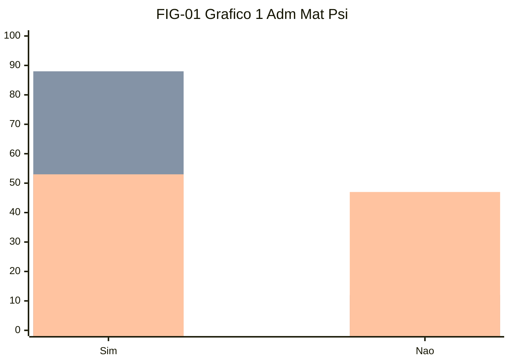
```mermaid
xychart-beta
    title "FIG-01 Grafico 1 Adm Mat Psi"
    x-axis [Sim,Nao]
    y-axis 0 --> 100
    bar [85,15]
    bar [88,12]
    bar [53,47]
```

### FIG-02. Gráfico 2, Adequação às exigências da sociedade e do perfil profissional desejado (p. impressa 17)

Título verbatim: Gráfico 2 – Adequação às exigências da sociedade e do perfil profissional desejado. Tipo: colunas verticais agrupadas por curso, eixo Y percentual, eixo X com Muito Bom / Bom / Regular / Ruim / Muito Ruim / Não se aplica ou não observado. Valores impressos: Administração 11% / 59% / 19% / 4% / 0% / 7%; Matemática 24% / 53% / 18% / 0% / 0% / 6%; Psicologia 7% / 53% / 20% / 0% / 20% / 0%. Texto fiel: Maioria BOM acima de 50 por cento nos três cursos; restante entre REGULAR cerca de 20 por cento e MUITO BOM; cursos qualificam para o mercado. Defeito preservado: Psicologia com 20 por cento em MUITO RUIM no rótulo da figura.

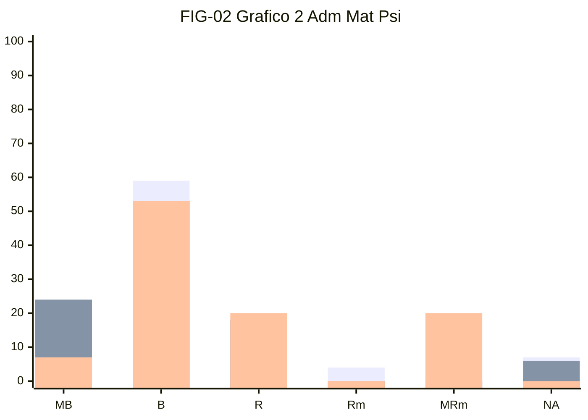
```mermaid
xychart-beta
    title "FIG-02 Grafico 2 Adm Mat Psi"
    x-axis [MB,B,R,Rm,MRm,NA]
    y-axis 0 --> 100
    bar [11,59,19,4,0,7]
    bar [24,53,18,0,0,6]
    bar [7,53,20,0,20,0]
```

### FIG-03. Gráfico 3, Matriz curricular (duração, disciplinas, flexibilidade) (p. impressa 18)

Título verbatim: Gráfico 3 – Matriz curricular (duração, disciplinas, flexibilidade). Tipo: colunas verticais agrupadas por curso, eixo Y percentual, eixo X com Muito Bom / Bom / Regular / Ruim / Muito Ruim / Não se aplica ou não observado. Valores impressos: Administração 11% / 63% / 22% / 0% / 4% / 0%; Matemática 18% / 53% / 29% / 0% / 0% / 0%; Psicologia 13% / 47% / 13% / 20% / 7% / 0%. Texto fiel: Maioria BOA (63 Adm, 53 Mat, 47 Psi); em 2014 os três cursos adequaram matrizes à Resolução 400/2013 (hora de 50 para 60 minutos), com vigência em 2014.2 para Psi e Adm e em 2015.1 para Mat; reflexos só na próxima avaliação.

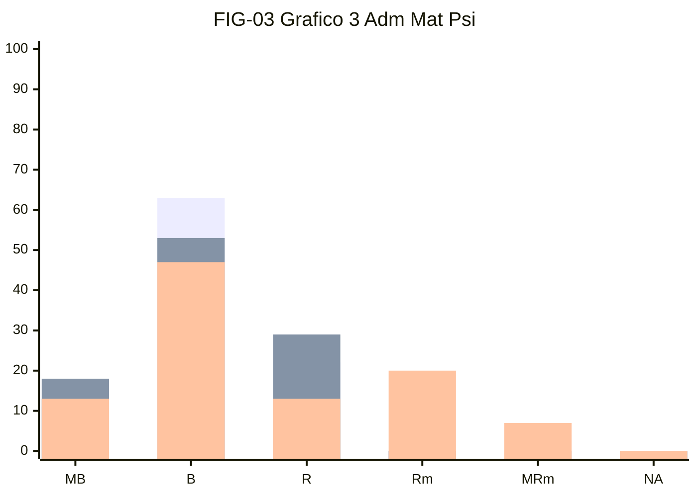
```mermaid
xychart-beta
    title "FIG-03 Grafico 3 Adm Mat Psi"
    x-axis [MB,B,R,Rm,MRm,NA]
    y-axis 0 --> 100
    bar [11,63,22,0,4,0]
    bar [18,53,29,0,0,0]
    bar [13,47,13,20,7,0]
```

### FIG-04. Gráfico 4, Atuação/qualidade do professor (p. impressa 18)

Título verbatim: Gráfico 4 – Atuação/qualidade do professor. Tipo: colunas verticais agrupadas por curso, eixo Y percentual, eixo X com Muito Bom / Bom / Regular / Ruim / Muito Ruim / Não se aplica ou não observado. Valores impressos: Administração 19% / 63% / 19% / 0% / 0% / 0%; Matemática 24% / 65% / 12% / 0% / 0% / 0%; Psicologia 7% / 53% / 20% / 7% / 13% / 0%. Texto fiel: Maioria BOM acima de 50 por cento; 23,61 por cento MUITO BOM e cerca de 22 por cento REGULAR no total; queda ante 2013 (13,79 por cento regular), atribuída ao afastamento de 4 docentes da Administração para doutoramento; um contratado sem renovação para 2015 por baixo desempenho didático.

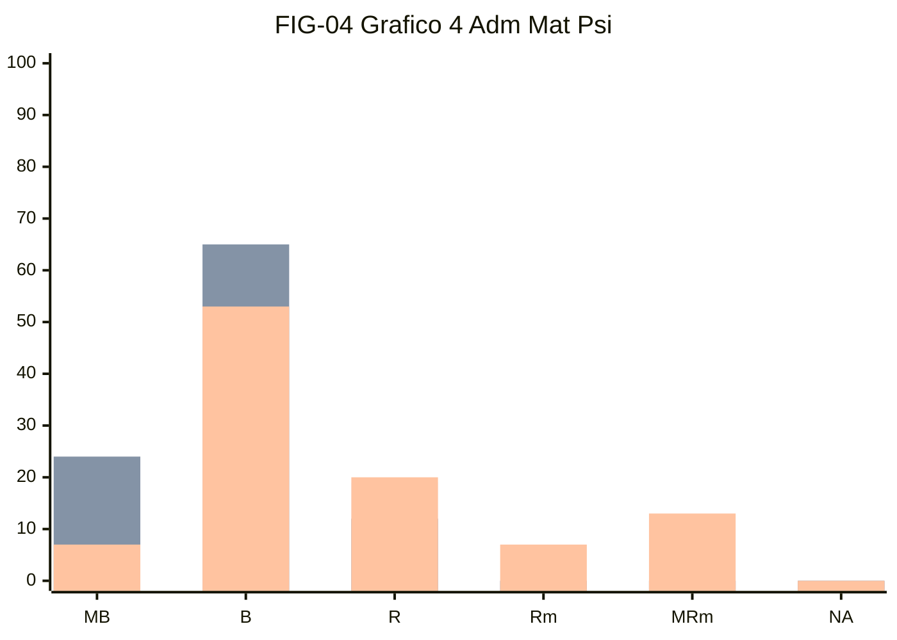
```mermaid
xychart-beta
    title "FIG-04 Grafico 4 Adm Mat Psi"
    x-axis [MB,B,R,Rm,MRm,NA]
    y-axis 0 --> 100
    bar [19,63,19,0,0,0]
    bar [24,65,12,0,0,0]
    bar [7,53,20,7,13,0]
```

### FIG-05. Gráfico 5, Estágio obrigatório (normas, orientação e supervisão) (p. impressa 19)

Título verbatim: Gráfico 5 – Estágio obrigatório (normas, orientação e supervisão). Tipo: colunas verticais agrupadas por curso, eixo Y percentual, eixo X com Muito Bom / Bom / Regular / Ruim / Muito Ruim / Não se aplica ou não observado. Valores impressos: Administração 19% / 30% / 15% / 4% / 0% / 33%; Matemática 12% / 29% / 12% / 0% / 0% / 47%; Psicologia 0% / 13% / 7% / 7% / 7% / 67%. Texto fiel: NÃO SE APLICA expressivo (33 Adm, 47 Mat, 67 Psi), cerca de 53 por cento não fazem a atividade; entre os que fazem, 19,78 por cento MUITO BOM; BOM em 30 Adm, 29 Mat e 13 Psi; REGULAR em 11 por cento.

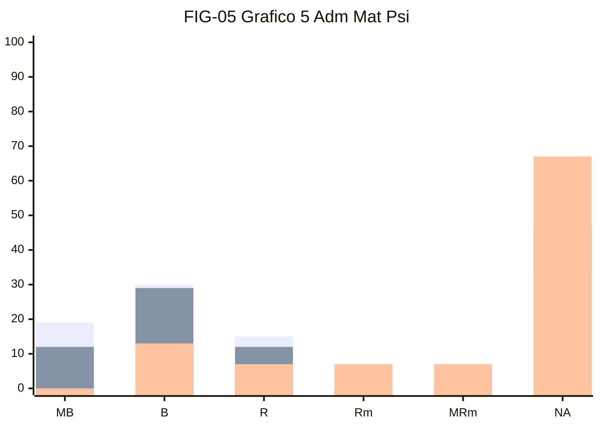
```mermaid
xychart-beta
    title "FIG-05 Grafico 5 Adm Mat Psi"
    x-axis [MB,B,R,Rm,MRm,NA]
    y-axis 0 --> 100
    bar [19,30,15,4,0,33]
    bar [12,29,12,0,0,47]
    bar [0,13,7,7,7,67]
```

### FIG-06. Gráfico 6, Oferecimento de Atividades Complementares e orientação para o cumprimento destas (p. impressa 20)

Título verbatim: Gráfico 6 – Oferecimento de Atividades Complementares e orientação para o cumprimento destas. Tipo: colunas verticais agrupadas por curso, eixo Y percentual, eixo X com Muito Bom / Bom / Regular / Ruim / Muito Ruim / Não se aplica ou não observado. Valores impressos: Administração 11% / 22% / 37% / 11% / 7% / 11%; Matemática 29% / 53% / 13% / 0% / 0% / 6%; Psicologia 7% / 13% / 27% / 27% / 27% / 0%. Texto fiel: MUITO BOM em 11 Adm, 29 Mat e 7 Psi; BOM em 30,66 por cento no total; REGULAR em 29,66 por cento; necessidade de mais ações no próprio Câmpus. Defeito preservado: texto troca os valores de BOM entre Mat e Adm.

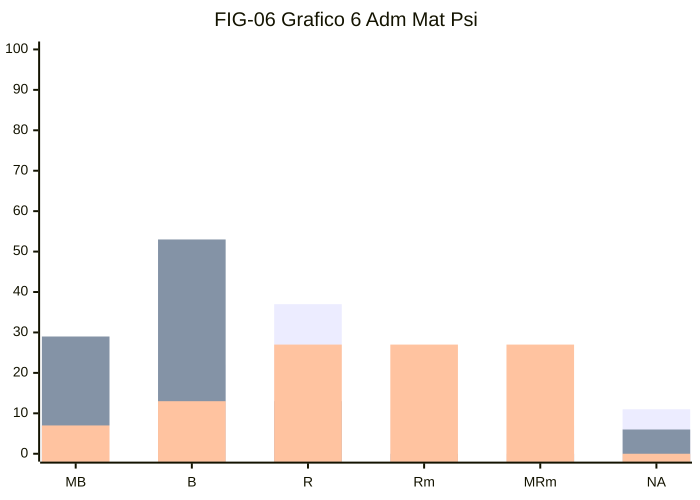
```mermaid
xychart-beta
    title "FIG-06 Grafico 6 Adm Mat Psi"
    x-axis [MB,B,R,Rm,MRm,NA]
    y-axis 0 --> 100
    bar [11,22,37,11,7,11]
    bar [29,53,13,0,0,6]
    bar [7,13,27,27,27,0]
```

### FIG-07. Gráfico 7, Trabalho de Conclusão de Curso normas, orientação e cronograma (p. impressa 20)

Título verbatim: Gráfico 7 – Trabalho de Conclusão de Curso normas, orientação e cronograma. Tipo: colunas verticais agrupadas por curso, eixo Y percentual, eixo X com Muito Bom / Bom / Regular / Ruim / Muito Ruim / Não se aplica ou não observado. Valores impressos: Administração 19% / 30% / 15% / 4% / 0% / 33%; Matemática 12% / 29% / 12% / 0% / 0% / 47%; Psicologia 0% / 13% / 7% / 7% / 7% / 67%. Texto fiel: NÃO SE APLICA em 53,42 por cento (iniciais ou Matemática, sem TCC obrigatório); entre os que avaliaram, 20,78 por cento BOM e 12,31 por cento REGULAR; regulamentos de Adm e Psi revisados em 2014 e publicados no site.

```mermaid
xychart-beta
    title "FIG-07 Grafico 7 Adm Mat Psi"
    x-axis [MB,B,R,Rm,MRm,NA]
    y-axis 0 --> 100
    bar [19,30,15,4,0,33]
    bar [12,29,12,0,0,47]
    bar [0,13,7,7,7,67]
```

### FIG-08. Gráfico 8, Sistema Acadêmico (SISCAD) (p. impressa 21)

Título verbatim: Gráfico 8 – Sistema Acadêmico (SISCAD). Tipo: colunas verticais agrupadas por curso, eixo Y percentual, eixo X com Muito Bom / Bom / Regular / Ruim / Muito Ruim / Não se aplica ou não observado. Valores impressos: Administração 33% / 56% / 11% / 0% / 0% / 0%; Matemática 59% / 35% / 6% / 0% / 0% / 0%; Psicologia 33% / 53% / 13% / 0% / 0% / 0%. Texto fiel: BOM em 58,8 por cento, MUITO BOM em 29,90 por cento e REGULAR em 13 por cento; maior nota média do bloco curso (4,04); ressalva de que o SISCAD depende de alimentação pelos docentes nos prazos.

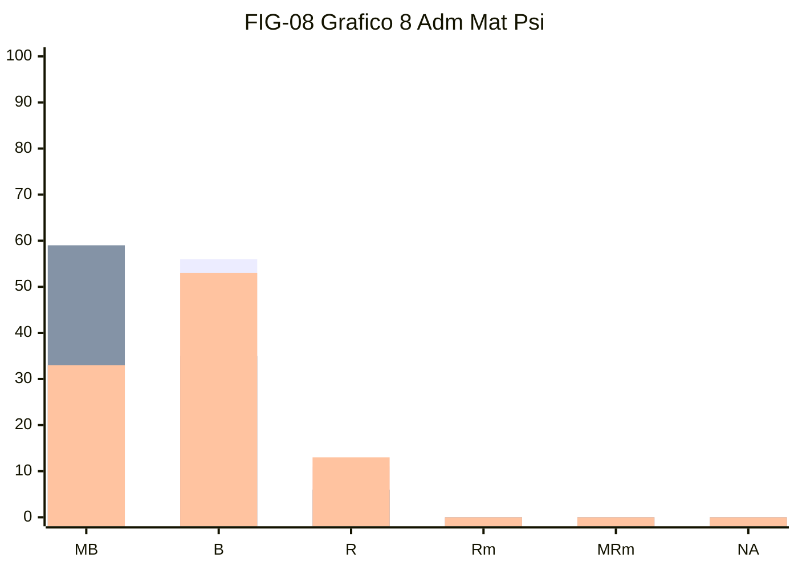
```mermaid
xychart-beta
    title "FIG-08 Grafico 8 Adm Mat Psi"
    x-axis [MB,B,R,Rm,MRm,NA]
    y-axis 0 --> 100
    bar [33,56,11,0,0,0]
    bar [59,35,6,0,0,0]
    bar [33,53,13,0,0,0]
```

### FIG-09. Gráfico 9, Atuação dos representantes discentes nos órgãos e centros acadêmicos (p. impressa 22)

Título verbatim: Gráfico 9 – Atuação dos representantes discentes nos órgãos e centros acadêmicos. Tipo: colunas verticais agrupadas por curso, eixo Y percentual, eixo X com Muito Bom / Bom / Regular / Ruim / Muito Ruim / Não se aplica ou não observado. Valores impressos: Administração 7% / 22% / 33% / 22% / 7% / 7%; Matemática 18% / 41% / 35% / 0% / 0% / 6%; Psicologia 20% / 20% / 33% / 13% / 7% / 7%. Texto fiel: BOA em 22 Adm, 41 Mat e 20 Psi (32 por cento do total); REGULAR em 33/35/33 (29,22 por cento); 7/6/7 por cento desconhecem os mecanismos. Abertas: Adm pede Projetos e Inglês optativa; Mat elogia curso e equipe; Psi pede multimídia fixo, coordenador presente e orientação sobre estágios, monitorias e complementares.

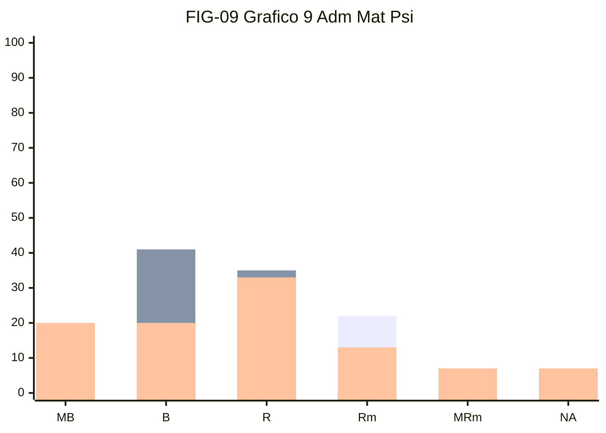
```mermaid
xychart-beta
    title "FIG-09 Grafico 9 Adm Mat Psi"
    x-axis [MB,B,R,Rm,MRm,NA]
    y-axis 0 --> 100
    bar [7,22,33,22,7,7]
    bar [18,41,35,0,0,6]
    bar [20,20,33,13,7,7]
```

### FIG-10. Gráfico 10, Disponibilidade e atenção aos acadêmicos (p. impressa 23)

Título verbatim: Gráfico 10 – Disponibilidade e atenção aos acadêmicos. Tipo: colunas verticais agrupadas por curso, eixo Y percentual, eixo X com Muito Bom / Bom / Regular / Ruim / Muito Ruim / Não se aplica ou não observado. Valores impressos: Administração 31% / 42% / 23% / 4% / 0% / 0%; Matemática 59% / 41% / 0% / 0% / 0% / 0%; Psicologia 0% / 25% / 25% / 25% / 25% / 0%. Texto fiel: Adm e Mat concentram MUITO BOM e BOM (Mat 59/41; Adm 31/42, acima de 70 por cento); Psi divide 25 por cento em cada um de BOM, REGULAR, RUIM e MUITO RUIM.

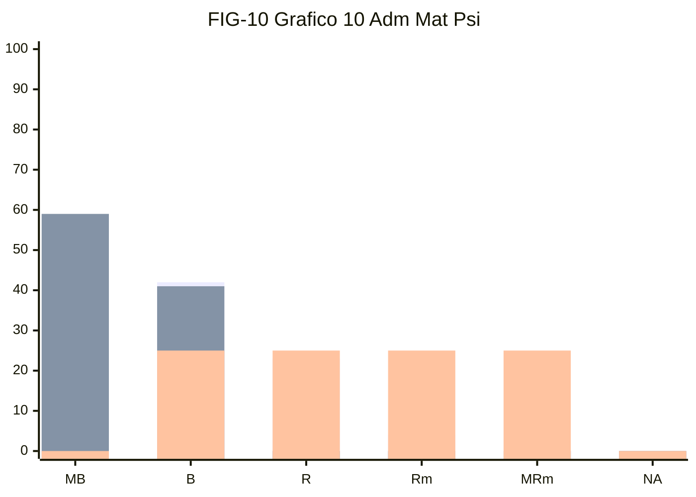
```mermaid
xychart-beta
    title "FIG-10 Grafico 10 Adm Mat Psi"
    x-axis [MB,B,R,Rm,MRm,NA]
    y-axis 0 --> 100
    bar [31,42,23,4,0,0]
    bar [59,41,0,0,0,0]
    bar [0,25,25,25,25,0]
```

### FIG-11. Gráfico 11, Divulgação das informações do curso (PPC, matriz curricular, locais, horários) (p. impressa 24)

Título verbatim: Gráfico 11 – Divulgação das informações do curso (PPC, matriz curricular, locais, horários). Tipo: colunas verticais agrupadas por curso, eixo Y percentual, eixo X com Muito Bom / Bom / Regular / Ruim / Muito Ruim / Não se aplica ou não observado. Valores impressos: Administração 31% / 35% / 31% / 4% / 0% / 0%; Matemática 47% / 41% / 6% / 0% / 0% / 6%; Psicologia 0% / 25% / 25% / 25% / 25% / 0%. Texto fiel: Adm e Mat avaliam MUITO BOA ou BOA (Adm 31/35; Mat 47/41); Psi divide 25 por cento entre BOM, REGULAR, RUIM e MUITO RUIM.

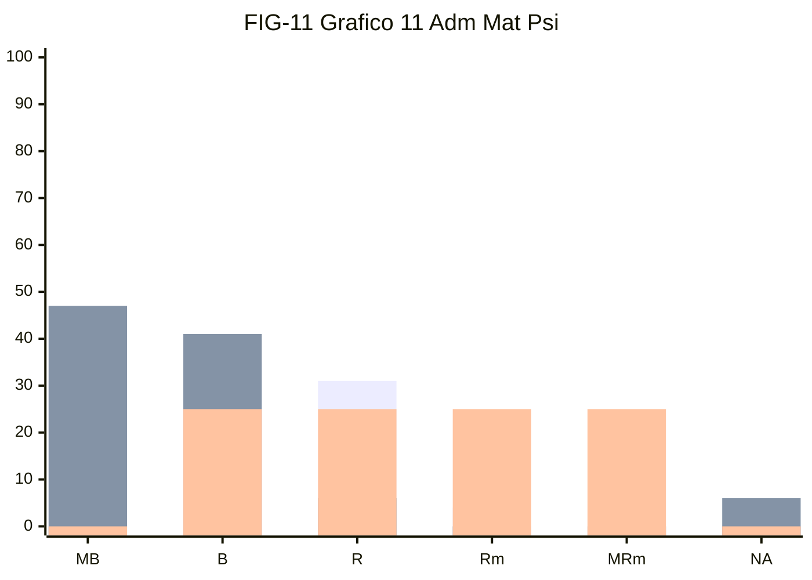
```mermaid
xychart-beta
    title "FIG-11 Grafico 11 Adm Mat Psi"
    x-axis [MB,B,R,Rm,MRm,NA]
    y-axis 0 --> 100
    bar [31,35,31,4,0,0]
    bar [47,41,6,0,0,6]
    bar [0,25,25,25,25,0]
```

### FIG-12. Gráfico 12, Orientação sobre atividades de pesquisa, extensão e outros (p. impressa 24)

Título verbatim: Gráfico 12 – Orientação sobre atividades de pesquisa, extensão e outros. Tipo: colunas verticais agrupadas por curso, eixo Y percentual, eixo X com Muito Bom / Bom / Regular / Ruim / Muito Ruim / Não se aplica ou não observado. Valores impressos: Administração 27% / 42% / 19% / 8% / 4% / 0%; Matemática 47% / 35% / 6% / 0% / 0% / 12%; Psicologia 0% / 25% / 17% / 33% / 17% / 8%. Texto fiel: MUITO BOA em 27 Adm e 47 Mat; BOA em 42 Adm e 35 Mat; Psi com 25 BOA, 33 RUIM e 17 MUITO RUIM. Grafia pequisa no original, defeito preservado.

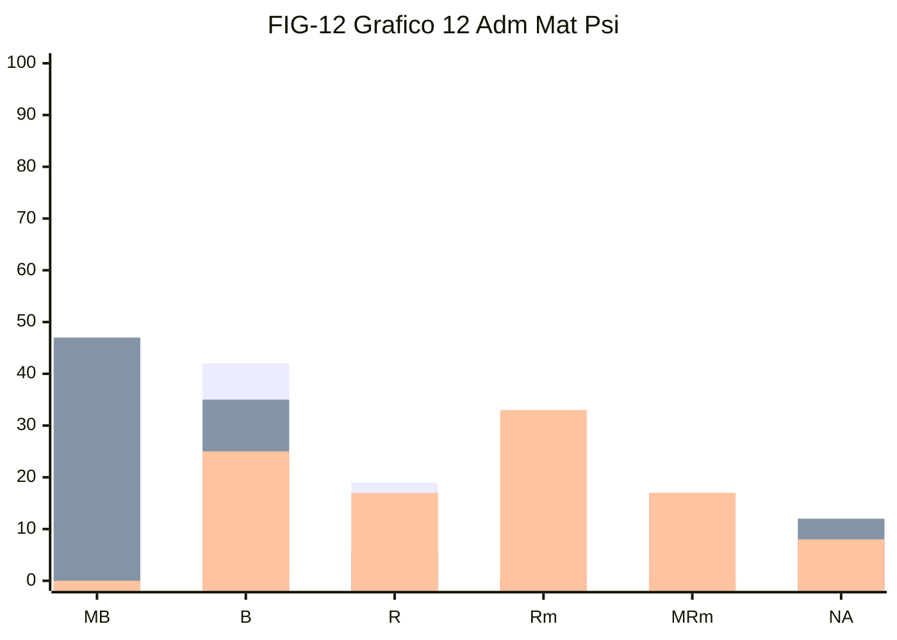
```mermaid
xychart-beta
    title "FIG-12 Grafico 12 Adm Mat Psi"
    x-axis [MB,B,R,Rm,MRm,NA]
    y-axis 0 --> 100
    bar [27,42,19,8,4,0]
    bar [47,35,6,0,0,12]
    bar [0,25,17,33,17,8]
```

### FIG-13. Gráfico 13, Importância das disciplinas para sua formação profissional (p. impressa 25)

Título verbatim: Gráfico 13 – Importância das disciplinas para sua formação profissional. Tipo: colunas verticais agrupadas por curso, eixo Y percentual, eixo X com Muito Bom / Bom / Regular / Ruim / Muito Ruim / Não se aplica ou não observado. Valores impressos: Administração 52% / 38% / 9% / 0% / 0% / 0%; Matemática 68% / 20% / 7% / 1% / 2% / 0%; Psicologia 66% / 22% / 10% / 0% / 2% / 1%. Texto fiel: MUITO BOM em 52 Adm, 68 Mat e 66 Psi; BOM em 29,41 por cento do total.

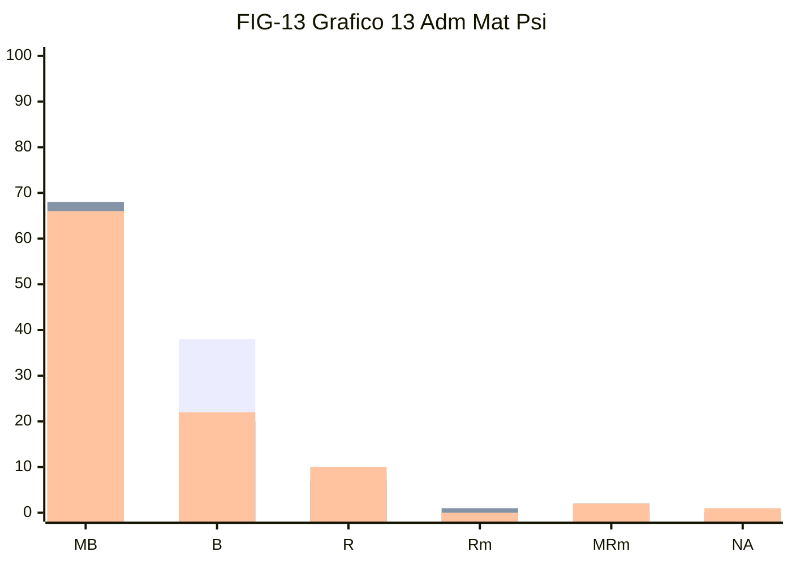
```mermaid
xychart-beta
    title "FIG-13 Grafico 13 Adm Mat Psi"
    x-axis [MB,B,R,Rm,MRm,NA]
    y-axis 0 --> 100
    bar [52,38,9,0,0,0]
    bar [68,20,7,1,2,0]
    bar [66,22,10,0,2,1]
```

### FIG-14. Gráfico 14, Disponibilidade da bibliografia (indicada no plano de ensino) na biblioteca (p. impressa 26)

Título verbatim: Gráfico 14 – Disponibilidade da bibliografia (indicada no plano de ensino) na biblioteca. Tipo: colunas verticais agrupadas por curso, eixo Y percentual, eixo X com Muito Bom / Bom / Regular / Ruim / Muito Ruim / Não se aplica ou não observado. Valores impressos: Administração 22% / 39% / 26% / 11% / 0% / 1%; Matemática 46% / 27% / 12% / 7% / 5% / 3%; Psicologia 32% / 25% / 20% / 14% / 6% / 3%. Texto fiel: BOA (39 Adm, 27 Mat, 25 Psi) ou MUITO BOA (22/46/32); acervo melhorado, mas pedido de novos títulos é do professor da disciplina.

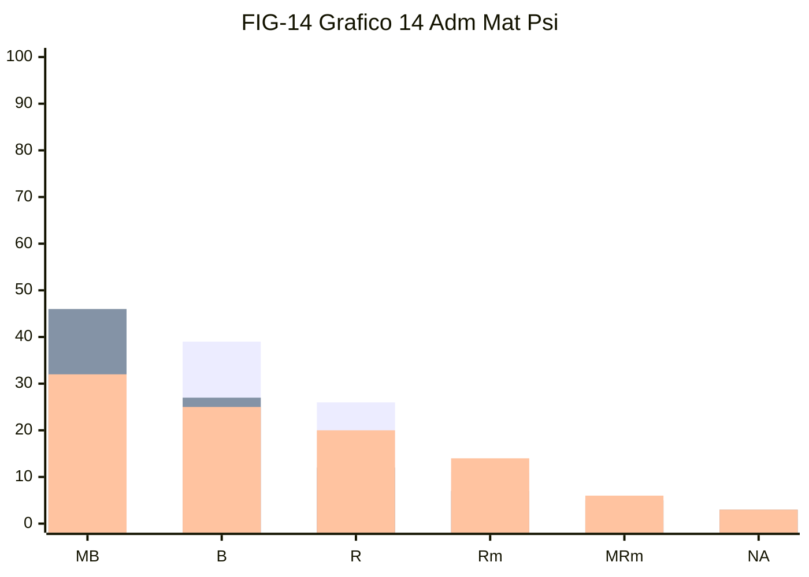
```mermaid
xychart-beta
    title "FIG-14 Grafico 14 Adm Mat Psi"
    x-axis [MB,B,R,Rm,MRm,NA]
    y-axis 0 --> 100
    bar [22,39,26,11,0,1]
    bar [46,27,12,7,5,3]
    bar [32,25,20,14,6,3]
```

### FIG-15. Gráfico 15, Adequação dos conteúdos das disciplinas à proposta do curso (p. impressa 26)

Título verbatim: Gráfico 15 – Adequação dos conteúdos das disciplinas à proposta do curso. Tipo: colunas verticais agrupadas por curso, eixo Y percentual, eixo X com Muito Bom / Bom / Regular / Ruim / Muito Ruim / Não se aplica ou não observado. Valores impressos: Administração 27% / 53% / 15% / 2% / 2% / 0%; Matemática 58% / 27% / 9% / 3% / 2% / 1%; Psicologia 50% / 31% / 11% / 2% / 4% / 2%. Texto fiel: BOA (53 Adm, 27 Mat, 31 Psi), MUITO BOM (27/58/50) e REGULAR (15/9/11).

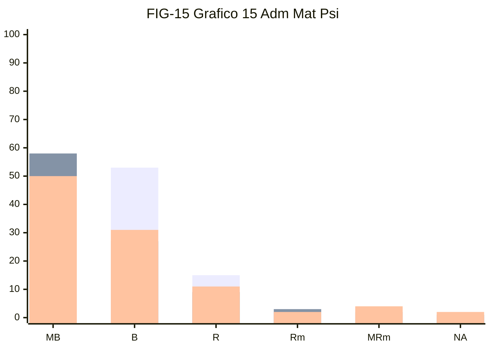
```mermaid
xychart-beta
    title "FIG-15 Grafico 15 Adm Mat Psi"
    x-axis [MB,B,R,Rm,MRm,NA]
    y-axis 0 --> 100
    bar [27,53,15,2,2,0]
    bar [58,27,9,3,2,1]
    bar [50,31,11,2,4,2]
```

### FIG-16. Gráfico 16, Número de alunos, quantidade de equipamentos e espaço físico das aulas práticas (p. impressa 27)

Título verbatim: Gráfico 16 – Número de alunos, quantidade de equipamentos e espaço físico das aulas práticas. Tipo: colunas verticais agrupadas por curso, eixo Y percentual, eixo X com Muito Bom / Bom / Regular / Ruim / Muito Ruim / Não se aplica ou não observado. Valores impressos: Administração 25% / 41% / 23% / 3% / 1% / 6%; Matemática 53% / 27% / 13% / 3% / 2% / 2%; Psicologia 48% / 25% / 9% / 2% / 3% / 14%. Texto fiel: MUITO BOM (25 Adm, 53 Mat, 48 Psi) e BOM (41/27/25); até 2014 sem distinção de carga prática e teórica nos PPCs, implantada em Psi em 2014.2 e em Mat em 2015.1.

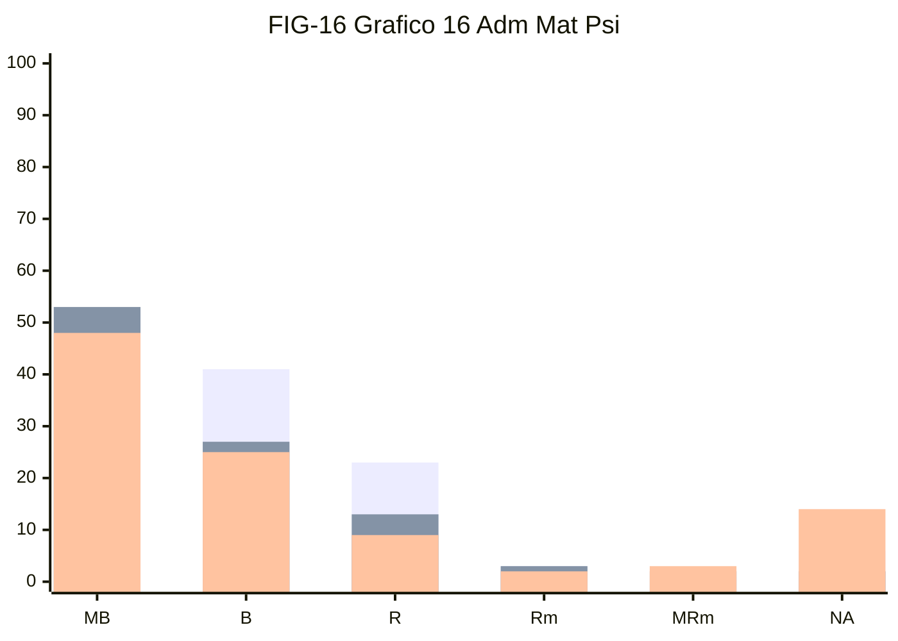
```mermaid
xychart-beta
    title "FIG-16 Grafico 16 Adm Mat Psi"
    x-axis [MB,B,R,Rm,MRm,NA]
    y-axis 0 --> 100
    bar [25,41,23,3,1,6]
    bar [53,27,13,3,2,2]
    bar [48,25,9,2,3,14]
```

### FIG-17. Gráfico 17, Participação e dedicação nas atividades (p. impressa 28)

Título verbatim: Gráfico 17 – Participação e dedicação nas atividades. Tipo: colunas verticais agrupadas por curso, eixo Y percentual, eixo X com Muito Bom / Bom / Regular / Ruim / Muito Ruim / Não se aplica ou não observado. Valores impressos: Administração 32% / 53% / 14% / 1% / 0% / 1%; Matemática 55% / 31% / 13% / 0% / 0% / 1%; Psicologia 63% / 25% / 7% / 1% / 1% / 2%. Texto fiel: Autoavaliação discente com MUITO BOM e BOM predominantes; sem parágrafo de análise na página.

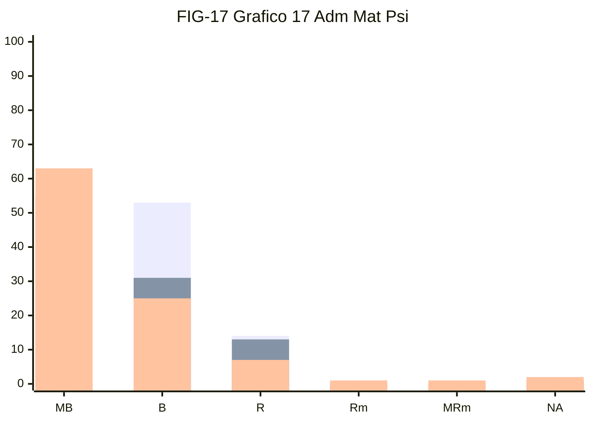
```mermaid
xychart-beta
    title "FIG-17 Grafico 17 Adm Mat Psi"
    x-axis [MB,B,R,Rm,MRm,NA]
    y-axis 0 --> 100
    bar [32,53,14,1,0,1]
    bar [55,31,13,0,0,1]
    bar [63,25,7,1,1,2]
```

### FIG-18. Gráfico 18, Pontualidade e Permanência do início ao término das aulas (p. impressa 28)

Título verbatim: Gráfico 18 – Pontualidade e Permanência do início ao término das aulas. Tipo: colunas verticais agrupadas por curso, eixo Y percentual, eixo X com Muito Bom / Bom / Regular / Ruim / Muito Ruim / Não se aplica ou não observado. Valores impressos: Administração 32% / 53% / 14% / 1% / 0% / 1%; Matemática 55% / 31% / 13% / 0% / 0% / 1%; Psicologia 63% / 25% / 7% / 1% / 1% / 2%. Texto fiel: Valores idênticos aos do Gráfico 17 número por número, defeito de duplicação preservado; sem parágrafo de análise na página.

```mermaid
xychart-beta
    title "FIG-18 Grafico 18 Adm Mat Psi"
    x-axis [MB,B,R,Rm,MRm,NA]
    y-axis 0 --> 100
    bar [32,53,14,1,0,1]
    bar [55,31,13,0,0,1]
    bar [63,25,7,1,1,2]
```

### FIG-19. Gráfico 19, Assimilação dos Conteúdos (p. impressa 28)

Título verbatim: Gráfico 19 – Assimilação dos Conteúdos. Tipo: colunas verticais agrupadas por curso, eixo Y percentual, eixo X com Muito Bom / Bom / Regular / Ruim / Muito Ruim / Não se aplica ou não observado. Valores impressos: Administração 17% / 53% / 26% / 3% / 1% / 1%; Matemática 50% / 31% / 13% / 3% / 1% / 1%; Psicologia 39% / 43% / 14% / 1% / 1% / 1%. Texto fiel: Autoavaliação com MUITO BOM e BOM semelhantes entre cursos; síntese na página seguinte.

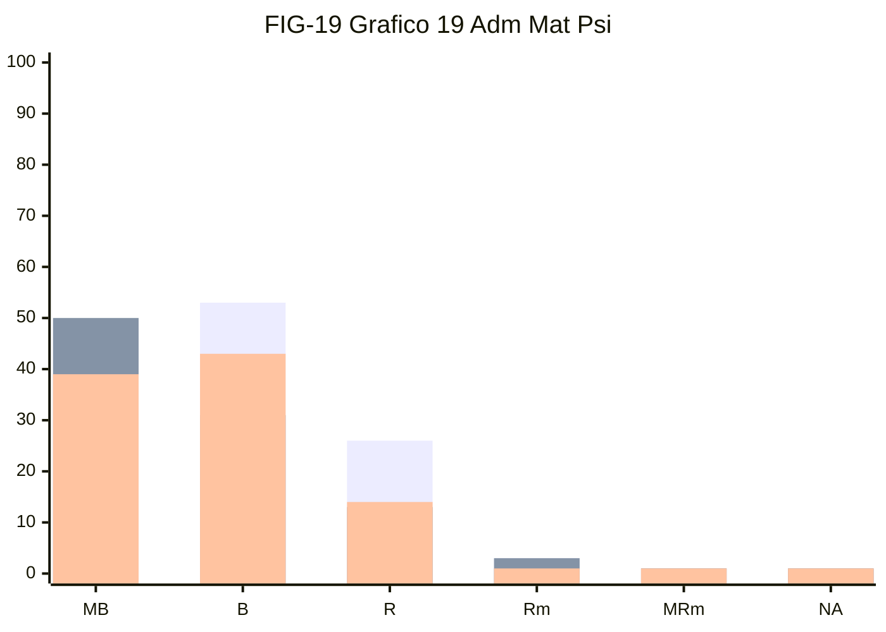
```mermaid
xychart-beta
    title "FIG-19 Grafico 19 Adm Mat Psi"
    x-axis [MB,B,R,Rm,MRm,NA]
    y-axis 0 --> 100
    bar [17,53,26,3,1,1]
    bar [50,31,13,3,1,1]
    bar [39,43,14,1,1,1]
```

### FIG-20. Gráfico 20, Planos de Ensino (p. impressa 29)

Título verbatim: Gráfico 20 – Planos de Ensino. Tipo: colunas verticais agrupadas por curso, eixo Y percentual, eixo X com Sim / Não / Não observado. Valores impressos: Administração 89% / 3% / 8%; Matemática 86% / 8% / 6%; Psicologia 90% / 2% / 8%. Texto fiel: Respostas Sim em 89 Adm, 86 Mat e 90 Psi; item praticamente na excelência com notas médias acima de 4 no bloco.

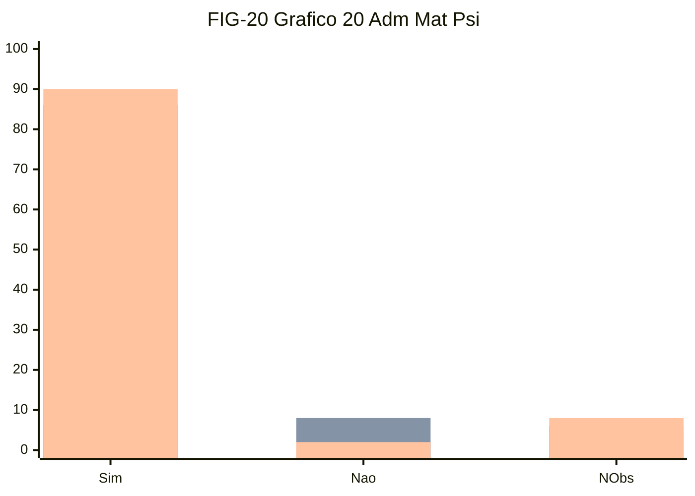
```mermaid
xychart-beta
    title "FIG-20 Grafico 20 Adm Mat Psi"
    x-axis [Sim,Nao,NObs]
    y-axis 0 --> 100
    bar [89,3,8]
    bar [86,8,6]
    bar [90,2,8]
```

### FIG-21. Gráfico 21, Qualidade Didática (p. impressa 29)

Título verbatim: Gráfico 21 – Qualidade Didática. Tipo: colunas verticais agrupadas por curso, eixo Y percentual, eixo X com Muito Bom / Bom / Regular / Ruim / Muito Ruim / Não se aplica ou não observado. Valores impressos: Administração 32% / 37% / 18% / 4% / 5% / 3%; Matemática 62% / 19% / 8% / 3% / 7% / 1%; Psicologia 60% / 16% / 16% / 6% / 1% / 2%. Texto fiel: Mat e Psi concentram MUITO BOM (62 e 60 por cento); Adm distribui 32 MB e 37 B; bloco docente entre MUITO BOM e BOM.

```mermaid
xychart-beta
    title "FIG-21 Grafico 21 Adm Mat Psi"
    x-axis [MB,B,R,Rm,MRm,NA]
    y-axis 0 --> 100
    bar [32,37,18,4,5,3]
    bar [62,19,8,3,7,1]
    bar [60,16,16,6,1,2]
```

### FIG-22. Gráfico 22, Assiduidade e cumprimento do horário (p. impressa 30)

Título verbatim: Gráfico 22 – Assiduidade e cumprimento do horário. Tipo: colunas verticais agrupadas por curso, eixo Y percentual, eixo X com Muito Bom / Bom / Regular / Ruim / Muito Ruim / Não se aplica ou não observado. Valores impressos: Administração 41% / 43% / 10% / 1% / 1% / 3%; Matemática 74% / 21% / 3% / 1% / 0% / 1%; Psicologia 73% / 20% / 4% / 0% / 1% / 1%. Texto fiel: Predomínio MUITO BOM e BOM nos três cursos.

```mermaid
xychart-beta
    title "FIG-22 Grafico 22 Adm Mat Psi"
    x-axis [MB,B,R,Rm,MRm,NA]
    y-axis 0 --> 100
    bar [41,43,10,1,1,3]
    bar [74,21,3,1,0,1]
    bar [73,20,4,0,1,1]
```

### FIG-23. Gráfico 23, Disponibilidade para o atendimento aos acadêmicos, dentro e fora da sala de aula (p. impressa 30)

Título verbatim: Gráfico 23 – Disponibilidade para o atendimento aos acadêmicos, dentro e fora da sala de aula. Tipo: colunas verticais agrupadas por curso, eixo Y percentual, eixo X com Muito Bom / Bom / Regular / Ruim / Muito Ruim / Não se aplica ou não observado. Valores impressos: Administração 28% / 37% / 20% / 4% / 3% / 7%; Matemática 64% / 19% / 8% / 3% / 3% / 3%; Psicologia 61% / 29% / 7% / 1% / 1% / 1%. Texto fiel: Predomínio MUITO BOM e BOM nos três cursos.

```mermaid
xychart-beta
    title "FIG-23 Grafico 23 Adm Mat Psi"
    x-axis [MB,B,R,Rm,MRm,NA]
    y-axis 0 --> 100
    bar [28,37,20,4,3,7]
    bar [64,19,8,3,3,3]
    bar [61,29,7,1,1,1]
```

### FIG-24. Gráfico 24, Grau de coerência entre conteúdos ministrados e as avaliações (p. impressa 30)

Título verbatim: Gráfico 24 – Grau de coerência entre conteúdos ministrados e as avaliações. Tipo: colunas verticais agrupadas por curso, eixo Y percentual, eixo X com Muito Bom / Bom / Regular / Ruim / Muito Ruim / Não se aplica ou não observado. Valores impressos: Administração 28% / 47% / 12% / 5% / 4% / 4%; Matemática 64% / 18% / 8% / 3% / 5% / 3%; Psicologia 58% / 28% / 9% / 0% / 2% / 2%. Texto fiel: Predomínio MUITO BOM e BOM nos três cursos.

```mermaid
xychart-beta
    title "FIG-24 Grafico 24 Adm Mat Psi"
    x-axis [MB,B,R,Rm,MRm,NA]
    y-axis 0 --> 100
    bar [28,47,12,5,4,4]
    bar [64,18,8,3,5,3]
    bar [58,28,9,0,2,2]
```

### FIG-25. Gráfico 25, Divulgação/entrega das notas no tempo previsto pela legislação (até 10 dias úteis após a realização) (p. impressa 31)

Título verbatim: Gráfico 25 – Divulgação/entrega das notas no tempo previsto pela legislação (até 10 dias úteis após a realização). Tipo: colunas verticais agrupadas por curso, eixo Y percentual, eixo X com Sim / Não / Não observado. Valores impressos: Administração 76% / 15% / 8%; Matemática 87% / 6% / 8%; Psicologia 82% / 12% / 6%. Texto fiel: Ampla maioria Sim (76 Adm, 87 Mat, 82 Psi); títulos com entregra, legislçao e reliazação no original, defeitos preservados.

```mermaid
xychart-beta
    title "FIG-25 Grafico 25 Adm Mat Psi"
    x-axis [Sim,Nao,NObs]
    y-axis 0 --> 100
    bar [76,15,8]
    bar [87,6,8]
    bar [82,12,6]
```

### FIG-26. Gráfico 26, Relacionamento professor-acadêmico (p. impressa 31)

Título verbatim: Gráfico 26 – Relacionamento professor-acadêmico. Tipo: colunas verticais agrupadas por curso, eixo Y percentual, eixo X com Muito Bom / Bom / Regular / Ruim / Muito Ruim / Não se aplica ou não observado. Valores impressos: Administração 39% / 39% / 13% / 2% / 3% / 3%; Matemática 68% / 19% / 5% / 3% / 5% / 1%; Psicologia 69% / 21% / 7% / 0% / 2% / 1%. Texto fiel: MUITO BOM e BOM dividem o bloco, com médias acima de 4; título com Relacinamento no original, defeito preservado.

```mermaid
xychart-beta
    title "FIG-26 Grafico 26 Adm Mat Psi"
    x-axis [MB,B,R,Rm,MRm,NA]
    y-axis 0 --> 100
    bar [39,39,13,2,3,3]
    bar [68,19,5,3,5,1]
    bar [69,21,7,0,2,1]
```

### FIG-27. Gráfico 27, Oportunidade de participar de projetos de pesquisa (p. impressa 32)

Título verbatim: Gráfico 27 – Oportunidade de participar de projetos de pesquisa. Tipo: colunas verticais agrupadas por curso, eixo Y percentual, eixo X com Muito Bom / Bom / Regular / Ruim / Muito Ruim / Não se aplica ou não observado. Valores impressos: Administração 14% / 38% / 24% / 19% / 5% / 0%; Matemática 19% / 31% / 19% / 6% / 6% / 19%; Psicologia 13% / 13% / 38% / 25% / 0% / 13%. Texto fiel: REGULAR em 24,16 por cento do total; sem parágrafo de análise na página.

```mermaid
xychart-beta
    title "FIG-27 Grafico 27 Adm Mat Psi"
    x-axis [MB,B,R,Rm,MRm,NA]
    y-axis 0 --> 100
    bar [14,38,24,19,5,0]
    bar [19,31,19,6,6,19]
    bar [13,13,38,25,0,13]
```

### FIG-28. Gráfico 28, Oportunidade de participar de projetos e programas de extensão (p. impressa 32)

Título verbatim: Gráfico 28 – Oportunidade de participar de projetos e programas de extensão. Tipo: colunas verticais agrupadas por curso, eixo Y percentual, eixo X com Muito Bom / Bom / Regular / Ruim / Muito Ruim / Não se aplica ou não observado. Valores impressos: Administração 14% / 52% / 14% / 14% / 5% / 0%; Matemática 19% / 44% / 13% / 6% / 6% / 13%; Psicologia 13% / 13% / 38% / 25% / 0% / 13%. Texto fiel: REGULAR em 25,77 por cento; necessidade de fortalecer pesquisa e extensão. Título com particpar no original, defeito preservado.

```mermaid
xychart-beta
    title "FIG-28 Grafico 28 Adm Mat Psi"
    x-axis [MB,B,R,Rm,MRm,NA]
    y-axis 0 --> 100
    bar [14,52,14,14,5,0]
    bar [19,44,13,6,6,13]
    bar [13,13,38,25,0,13]
```

### FIG-29. Gráfico 29, Qualidade das atividades de extensão, como complemento à formação acadêmica (p. impressa 32)

Título verbatim: Gráfico 29 – Qualidade das atividades de extensão, como complemento à formação acadêmica. Tipo: colunas verticais agrupadas por curso, eixo Y percentual, eixo X com Muito Bom / Bom / Regular / Ruim / Muito Ruim / Não se aplica ou não observado. Valores impressos: Administração 19% / 48% / 19% / 10% / 0% / 5%; Matemática 6% / 50% / 19% / 6% / 0% / 19%; Psicologia 0% / 38% / 13% / 13% / 0% / 38%. Texto fiel: BOM predomina (48 Adm, 50 Mat, 38 Psi); Psi com 38 por cento NÃO SE APLICA.

```mermaid
xychart-beta
    title "FIG-29 Grafico 29 Adm Mat Psi"
    x-axis [MB,B,R,Rm,MRm,NA]
    y-axis 0 --> 100
    bar [19,48,19,10,0,5]
    bar [6,50,19,6,0,19]
    bar [0,38,13,13,0,38]
```

### FIG-30. Gráfico 30, Apoio da instituição para a participação em eventos externos (p. impressa 33)

Título verbatim: Gráfico 30 – Apoio da instituição para a participação em eventos externos. Tipo: colunas verticais agrupadas por curso, eixo Y percentual, eixo X com Muito Bom / Bom / Regular / Ruim / Muito Ruim / Não se aplica ou não observado. Valores impressos: Administração 19% / 29% / 14% / 14% / 24% / 0%; Matemática 31% / 31% / 19% / 6% / 0% / 13%; Psicologia 0% / 13% / 38% / 25% / 0% / 25%. Texto fiel: Dispersão: Mat em MUITO BOM/BOM, Psi em REGULAR/RUIM, Adm entre BOM e MUITO RUIM.

```mermaid
xychart-beta
    title "FIG-30 Grafico 30 Adm Mat Psi"
    x-axis [MB,B,R,Rm,MRm,NA]
    y-axis 0 --> 100
    bar [19,29,14,14,24,0]
    bar [31,31,19,6,0,13]
    bar [0,13,38,25,0,25]
```

### FIG-31. Gráfico 31, Qualidade e funcionamento das instalações dos laboratórios, unidades de aulas práticas (e transporte a elas) (p. impressa 33)

Título verbatim: Gráfico 31 – Qualidade e funcionamento das instalações dos laboratórios, unidades de aulas práticas (e transporte a elas). Tipo: colunas verticais agrupadas por curso, eixo Y percentual, eixo X com Muito Bom / Bom / Regular / Ruim / Muito Ruim / Não se aplica ou não observado. Valores impressos: Administração 19% / 43% / 19% / 0% / 0% / 19%; Matemática 17% / 61% / 22% / 0% / 0% / 0%; Psicologia 22% / 44% / 11% / 0% / 22% / 0%. Texto fiel: Maioria BOM nos três cursos.

```mermaid
xychart-beta
    title "FIG-31 Grafico 31 Adm Mat Psi"
    x-axis [MB,B,R,Rm,MRm,NA]
    y-axis 0 --> 100
    bar [19,43,19,0,0,19]
    bar [17,61,22,0,0,0]
    bar [22,44,11,0,22,0]
```

### FIG-32. Gráfico 32, Recursos computacionais (laboratórios/unidades de aulas práticas, equipamentos, sistemas e Internet) (p. impressa 34)

Título verbatim: Gráfico 32 – Recursos computacionais (laboratórios/unidades de aulas práticas, equipamentos, sistemas e Internet). Tipo: colunas verticais agrupadas por curso, eixo Y percentual, eixo X com Muito Bom / Bom / Regular / Ruim / Muito Ruim / Não se aplica ou não observado. Valores impressos: Administração 19% / 19% / 24% / 29% / 10% / 0%; Matemática 22% / 61% / 17% / 0% / 0% / 0%; Psicologia 11% / 44% / 22% / 22% / 0% / 0%. Texto fiel: Mat com 61 por cento BOM; Adm com pico em RUIM (29 por cento). Sem parágrafo de análise na página.

```mermaid
xychart-beta
    title "FIG-32 Grafico 32 Adm Mat Psi"
    x-axis [MB,B,R,Rm,MRm,NA]
    y-axis 0 --> 100
    bar [19,19,24,29,10,0]
    bar [22,61,17,0,0,0]
    bar [11,44,22,22,0,0]
```

### FIG-33. Gráfico 33, Qualidade (conforto térmico, iluminação, limpeza, mobiliário e conservação) das salas de aula (p. impressa 34)

Título verbatim: Gráfico 33 – Qualidade (conforto térmico, iluminação, limpeza, mobiliário e conservação) das salas de aula. Tipo: colunas verticais agrupadas por curso, eixo Y percentual, eixo X com Muito Bom / Bom / Regular / Ruim / Muito Ruim / Não se aplica ou não observado. Valores impressos: Administração 33% / 38% / 19% / 5% / 5% / 0%; Matemática 44% / 33% / 17% / 6% / 0% / 0%; Psicologia 22% / 56% / 11% / 11% / 0% / 0%. Texto fiel: Predomínio positivo, com Psi em 56 por cento BOM. Sem parágrafo de análise na página.

```mermaid
xychart-beta
    title "FIG-33 Grafico 33 Adm Mat Psi"
    x-axis [MB,B,R,Rm,MRm,NA]
    y-axis 0 --> 100
    bar [33,38,19,5,5,0]
    bar [44,33,17,6,0,0]
    bar [22,56,11,11,0,0]
```

### FIG-34. Gráfico 34, Condições físicas dos sanitários (p. impressa 34)

Título verbatim: Gráfico 34 – Condições físicas dos sanitários. Tipo: colunas verticais agrupadas por curso, eixo Y percentual, eixo X com Muito Bom / Bom / Regular / Ruim / Muito Ruim / Não se aplica ou não observado. Valores impressos: Administração 29% / 48% / 19% / 5% / 0% / 0%; Matemática 28% / 33% / 17% / 11% / 11% / 0%; Psicologia 11% / 56% / 11% / 22% / 0% / 0%. Texto fiel: Predomínio BOM (48 Adm, 33 Mat, 56 Psi); Psi com 22 por cento RUIM. Sem parágrafo de análise na página.

```mermaid
xychart-beta
    title "FIG-34 Grafico 34 Adm Mat Psi"
    x-axis [MB,B,R,Rm,MRm,NA]
    y-axis 0 --> 100
    bar [29,48,19,5,0,0]
    bar [28,33,17,11,11,0]
    bar [11,56,11,22,0,0]
```

### FIG-35. Gráfico 35, Atendimento prestado aos portadores de necessidades especiais (p. impressa 35)

Título verbatim: Gráfico 35 – Atendimento prestado aos portadores de necessidades especiais. Tipo: colunas verticais agrupadas por curso, eixo Y percentual, eixo X com Muito Bom / Bom / Regular / Ruim / Muito Ruim / Não se aplica ou não observado. Valores impressos: Administração 14% / 24% / 10% / 10% / 5% / 38%; Matemática 17% / 33% / 28% / 0% / 0% / 22%; Psicologia 11% / 33% / 11% / 22% / 0% / 22%. Texto fiel: Maior NÃO SE APLICA do bloco (38 Adm); sem parágrafo de análise na página.

```mermaid
xychart-beta
    title "FIG-35 Grafico 35 Adm Mat Psi"
    x-axis [MB,B,R,Rm,MRm,NA]
    y-axis 0 --> 100
    bar [14,24,10,10,5,38]
    bar [17,33,28,0,0,22]
    bar [11,33,11,22,0,22]
```

### FIG-36. Gráfico 36, Serviços de segurança (p. impressa 35)

Título verbatim: Gráfico 36 – Serviços de segurança. Tipo: colunas verticais agrupadas por curso, eixo Y percentual, eixo X com Muito Bom / Bom / Regular / Ruim / Muito Ruim / Não se aplica ou não observado. Valores impressos: Administração 19% / 48% / 24% / 10% / 0% / 0%; Matemática 17% / 56% / 17% / 0% / 6% / 6%; Psicologia 0% / 67% / 11% / 11% / 0% / 11%. Texto fiel: Concentração em BOM nos três cursos, com 67 por cento em Psi. Sem parágrafo de análise na página.

```mermaid
xychart-beta
    title "FIG-36 Grafico 36 Adm Mat Psi"
    x-axis [MB,B,R,Rm,MRm,NA]
    y-axis 0 --> 100
    bar [19,48,24,10,0,0]
    bar [17,56,17,0,6,6]
    bar [0,67,11,11,0,11]
```

### FIG-37. Gráfico 37, Disponibilidade de espaços para lazer e convivência (p. impressa 35)

Título verbatim: Gráfico 37 – Disponibilidade de espaços para lazer e convivência. Tipo: colunas verticais agrupadas por curso, eixo Y percentual, eixo X com Muito Bom / Bom / Regular / Ruim / Muito Ruim / Não se aplica ou não observado. Valores impressos: Administração 5% / 19% / 38% / 14% / 24% / 0%; Matemática 0% / 39% / 6% / 28% / 22% / 6%; Psicologia 0% / 33% / 0% / 22% / 44% / 0%. Texto fiel: Avaliação mais negativa da infraestrutura; MUITO BOM quase zero e Psi com 44 por cento MUITO RUIM. Sem parágrafo de análise na página.

```mermaid
xychart-beta
    title "FIG-37 Grafico 37 Adm Mat Psi"
    x-axis [MB,B,R,Rm,MRm,NA]
    y-axis 0 --> 100
    bar [5,19,38,14,24,0]
    bar [0,39,6,28,22,6]
    bar [0,33,0,22,44,0]
```

### FIG-38. Gráfico 38, Serviços de limpeza e conservação de edificações e da infraestrutura (p. impressa 36)

Título verbatim: Gráfico 38 – Serviços de limpeza e conservação de edificações e da infraestrutura. Tipo: colunas verticais agrupadas por curso, eixo Y percentual, eixo X com Muito Bom / Bom / Regular / Ruim / Muito Ruim / Não se aplica ou não observado. Valores impressos: Administração 24% / 52% / 19% / 0% / 5% / 0%; Matemática 11% / 44% / 17% / 17% / 11% / 0%; Psicologia 33% / 44% / 22% / 0% / 0% / 0%. Texto fiel: BOM dominante nos três cursos. Sem parágrafo de análise na página.

```mermaid
xychart-beta
    title "FIG-38 Grafico 38 Adm Mat Psi"
    x-axis [MB,B,R,Rm,MRm,NA]
    y-axis 0 --> 100
    bar [24,52,19,0,5,0]
    bar [11,44,17,17,11,0]
    bar [33,44,22,0,0,0]
```

### FIG-39. Gráfico 39, Serviços prestados pelas cantinas e lanchonetes instaladas nas áreas internas de sua unidade setorial (p. impressa 36)

Título verbatim: Gráfico 39 – Serviços prestados pelas cantinas e lanchonetes instaladas nas áreas internas de sua unidade setorial. Tipo: colunas verticais agrupadas por curso, eixo Y percentual, eixo X com Muito Bom / Bom / Regular / Ruim / Muito Ruim / Não se aplica ou não observado. Valores impressos: Administração 10% / 19% / 29% / 29% / 10% / 5%; Matemática 11% / 44% / 28% / 0% / 17% / 0%; Psicologia 11% / 22% / 22% / 33% / 11% / 0%. Texto fiel: Item mais crítico, com média 2,85 citada na síntese; único local de alimentação nas imediações para o noturno. Sem parágrafo de análise na página.

```mermaid
xychart-beta
    title "FIG-39 Grafico 39 Adm Mat Psi"
    x-axis [MB,B,R,Rm,MRm,NA]
    y-axis 0 --> 100
    bar [10,19,29,29,10,5]
    bar [11,44,28,0,17,0]
    bar [11,22,22,33,11,0]
```

### FIG-40. Gráfico 40, Instalações físicas da biblioteca de seu Câmpus (p. impressa 36)

Título verbatim: Gráfico 40 – Instalações físicas da biblioteca de seu Câmpus. Tipo: colunas verticais agrupadas por curso, eixo Y percentual, eixo X com Muito Bom / Bom / Regular / Ruim / Muito Ruim / Não se aplica ou não observado. Valores impressos: Administração 38% / 33% / 14% / 14% / 0% / 0%; Matemática 28% / 56% / 11% / 6% / 0% / 0%; Psicologia 11% / 44% / 11% / 11% / 22% / 0%. Texto fiel: Positiva em Adm e Mat; Psi com 22 por cento MUITO RUIM. Sem parágrafo de análise na página.

```mermaid
xychart-beta
    title "FIG-40 Grafico 40 Adm Mat Psi"
    x-axis [MB,B,R,Rm,MRm,NA]
    y-axis 0 --> 100
    bar [38,33,14,14,0,0]
    bar [28,56,11,6,0,0]
    bar [11,44,11,11,22,0]
```

### FIG-41. Gráfico 41, Disponibilidade do acervo da biblioteca quanto à adequação ao curso (p. impressa 37)

Título verbatim: Gráfico 41 – Disponibilidade do acervo da biblioteca quanto à adequação ao curso. Tipo: colunas verticais agrupadas por curso, eixo Y percentual, eixo X com Muito Bom / Bom / Regular / Ruim / Muito Ruim / Não se aplica ou não observado. Valores impressos: Administração 14% / 33% / 43% / 10% / 0% / 0%; Matemática 17% / 44% / 33% / 0% / 6% / 0%; Psicologia 11% / 11% / 33% / 33% / 11% / 0%. Texto fiel: Adm em REGULAR 43 por cento; Mat em BOM 44 por cento; Psi dividida entre REGULAR e RUIM. Síntese: infra entre BOM e REGULAR, com lanchonete deficitária e sem espaços de descanso e lazer.

```mermaid
xychart-beta
    title "FIG-41 Grafico 41 Adm Mat Psi"
    x-axis [MB,B,R,Rm,MRm,NA]
    y-axis 0 --> 100
    bar [14,33,43,10,0,0]
    bar [17,44,33,0,6,0]
    bar [11,11,33,33,11,0]
```

### FIG-42. Gráfico 42, Atividades desenvolvidas para a promoção da cidadania e inclusão social (p. impressa 38)

Título verbatim: Gráfico 42 – Atividades desenvolvidas para a promoção da cidadania e inclusão social. Tipo: colunas verticais agrupadas por curso, eixo Y percentual, eixo X com Muito Bom / Bom / Regular / Ruim / Muito Ruim / Não se aplica ou não observado. Valores impressos: Administração 11% / 37% / 42% / 5% / 5% / 0%; Matemática 31% / 50% / 13% / 6% / 0% / 0%; Psicologia 0% / 33% / 22% / 33% / 0% / 11%. Texto fiel: Concentra REGULAR (42 Adm, 13 Mat, 22 Psi) e BOM (37/50/33).

```mermaid
xychart-beta
    title "FIG-42 Grafico 42 Adm Mat Psi"
    x-axis [MB,B,R,Rm,MRm,NA]
    y-axis 0 --> 100
    bar [11,37,42,5,5,0]
    bar [31,50,13,6,0,0]
    bar [0,33,22,33,0,11]
```

### FIG-43. Gráfico 43, Interação da UFMS com a comunidade regional, na área cultural e artística, na preservação da memória e do patrimônio cultural (p. impressa 38)

Título verbatim: Gráfico 43 – Interação da UFMS com a comunidade regional, na área cultural e artística, na preservação da memória e do patrimônio cultural. Tipo: colunas verticais agrupadas por curso, eixo Y percentual, eixo X com Muito Bom / Bom / Regular / Ruim / Muito Ruim / Não se aplica ou não observado. Valores impressos: Administração 11% / 21% / 53% / 0% / 16% / 0%; Matemática 25% / 31% / 13% / 13% / 6% / 13%; Psicologia 0% / 22% / 22% / 22% / 22% / 11%. Texto fiel: Concentra REGULAR (53 Adm, 13 Mat, 22 Psi) e BOM; Psi integral com RUIM, MUITO RUIM e NÃO OBSERVADO consideráveis, pedindo atenção especial.

```mermaid
xychart-beta
    title "FIG-43 Grafico 43 Adm Mat Psi"
    x-axis [MB,B,R,Rm,MRm,NA]
    y-axis 0 --> 100
    bar [11,21,53,0,16,0]
    bar [25,31,13,13,6,13]
    bar [0,22,22,22,22,11]
```

### FIG-44. Gráfico 44, Divulgação das atividades (eventos, concursos, etc.) realizadas na UFMS (p. impressa 39)

Título verbatim: Gráfico 44 – Divulgação das atividades (eventos, concursos, etc.) realizadas na UFMS. Tipo: colunas verticais agrupadas por curso, eixo Y percentual, eixo X com Muito Bom / Bom / Regular / Ruim / Muito Ruim / Não se aplica ou não observado. Valores impressos: Administração 6% / 24% / 35% / 29% / 6% / 0%; Matemática 25% / 44% / 25% / 6% / 0% / 0%; Psicologia 29% / 29% / 14% / 14% / 14% / 0%. Texto fiel: Sem consenso: Adm entre REGULAR e RUIM; Mat entre BOM e MUITO BOM; Psi entre BOM e MUITO BOM.

```mermaid
xychart-beta
    title "FIG-44 Grafico 44 Adm Mat Psi"
    x-axis [MB,B,R,Rm,MRm,NA]
    y-axis 0 --> 100
    bar [6,24,35,29,6,0]
    bar [25,44,25,6,0,0]
    bar [29,29,14,14,14,0]
```

### FIG-45. Gráfico 45, Qualidade dos serviços de ouvidoria da UFMS (p. impressa 40)

Título verbatim: Gráfico 45 – Qualidade dos serviços de ouvidoria da UFMS. Tipo: colunas verticais agrupadas por curso, eixo Y percentual, eixo X com Muito Bom / Bom / Regular / Ruim / Muito Ruim / Não se aplica ou não observado. Valores impressos: Administração 6% / 24% / 29% / 6% / 0% / 35%; Matemática 31% / 31% / 13% / 0% / 0% / 25%; Psicologia 14% / 29% / 0% / 14% / 0% / 43%. Texto fiel: NÃO SE APLICA dominante (35 Adm, 25 Mat, 43 Psi); no total REGULAR 27,72, RUIM 8,94 e MUITO RUIM 5,45 por cento.

```mermaid
xychart-beta
    title "FIG-45 Grafico 45 Adm Mat Psi"
    x-axis [MB,B,R,Rm,MRm,NA]
    y-axis 0 --> 100
    bar [6,24,29,6,0,35]
    bar [31,31,13,0,0,25]
    bar [14,29,0,14,0,43]
```

### FIG-46. Gráfico 46, Portal (site) da UFMS (p. impressa 40)

Título verbatim: Gráfico 46 – Portal (site) da UFMS. Tipo: colunas verticais agrupadas por curso, eixo Y percentual, eixo X com Muito Bom / Bom / Regular / Ruim / Muito Ruim / Não se aplica ou não observado. Valores impressos: Administração 6% / 41% / 47% / 6% / 0% / 0%; Matemática 25% / 50% / 13% / 6% / 0% / 6%; Psicologia 14% / 57% / 29% / 0% / 0% / 0%. Texto fiel: Bem positiva: Adm entre BOM e REGULAR; Psi entre BOM e REGULAR; Mat entre BOM e MUITO BOM.

```mermaid
xychart-beta
    title "FIG-46 Grafico 46 Adm Mat Psi"
    x-axis [MB,B,R,Rm,MRm,NA]
    y-axis 0 --> 100
    bar [6,41,47,6,0,0]
    bar [25,50,13,6,0,6]
    bar [14,57,29,0,0,0]
```

### FIG-47. Gráfico 47, Portal (site) da sua unidade setorial acadêmica (p. impressa 41)

Título verbatim: Gráfico 47 – Portal (site) da sua unidade setorial acadêmica. Tipo: colunas verticais agrupadas por curso, eixo Y percentual, eixo X com Muito Bom / Bom / Regular / Ruim / Muito Ruim / Não se aplica ou não observado. Valores impressos: Administração 6% / 29% / 24% / 18% / 0% / 24%; Matemática 25% / 38% / 25% / 0% / 6% / 6%; Psicologia 43% / 14% / 14% / 14% / 0% / 14%. Texto fiel: Adm e Mat com pico em BOM (29 e 38 por cento); Psi com pico em MUITO BOM (43 por cento); comissão de 2014 para o site do Câmpus.

```mermaid
xychart-beta
    title "FIG-47 Grafico 47 Adm Mat Psi"
    x-axis [MB,B,R,Rm,MRm,NA]
    y-axis 0 --> 100
    bar [6,29,24,18,0,24]
    bar [25,38,25,0,6,6]
    bar [43,14,14,14,0,14]
```

### FIG-48. Gráfico 48, Atendimento prestado pelos técnico-administrativos da sua unidade setorial acadêmica (p. impressa 42)

Título verbatim: Gráfico 48 – Atendimento prestado pelos técnico-administrativos da sua unidade setorial acadêmica. Tipo: colunas verticais agrupadas por curso, eixo Y percentual, eixo X com Muito Bom / Bom / Regular / Ruim / Muito Ruim / Não se aplica ou não observado. Valores impressos: Administração 18% / 65% / 18% / 0% / 0% / 0%; Matemática 50% / 31% / 13% / 0% / 0% / 6%; Psicologia 43% / 43% / 14% / 0% / 0% / 0%. Texto fiel: BOM ou MUITO BOM acima de 80 por cento nos três cursos.

```mermaid
xychart-beta
    title "FIG-48 Grafico 48 Adm Mat Psi"
    x-axis [MB,B,R,Rm,MRm,NA]
    y-axis 0 --> 100
    bar [18,65,18,0,0,0]
    bar [50,31,13,0,0,6]
    bar [43,43,14,0,0,0]
```

### FIG-49. Gráfico 49, Participação em processos decisórios (p. impressa 42)

Título verbatim: Gráfico 49 – Participação em processos decisórios. Tipo: colunas verticais agrupadas por curso, eixo Y percentual, eixo X com Muito Bom / Bom / Regular / Ruim / Muito Ruim / Não se aplica ou não observado. Valores impressos: Administração 6% / 24% / 41% / 24% / 6% / 0%; Matemática 38% / 38% / 6% / 0% / 0% / 19%; Psicologia 14% / 43% / 14% / 0% / 0% / 29%. Texto fiel: Adm REGULAR 41 por cento; Mat entre MUITO BOM e BOM; Psi com maioria BOM.

```mermaid
xychart-beta
    title "FIG-49 Grafico 49 Adm Mat Psi"
    x-axis [MB,B,R,Rm,MRm,NA]
    y-axis 0 --> 100
    bar [6,24,41,24,6,0]
    bar [38,38,6,0,0,19]
    bar [14,43,14,0,0,29]
```

### FIG-50. Gráfico 50, Atuação dos representantes discentes nos órgãos colegiados e do centro acadêmico do seu curso? (p. impressa 43)

Título verbatim: Gráfico 50 – Atuação dos representantes discentes nos órgãos colegiados e do centro acadêmico do seu curso?. Tipo: colunas verticais agrupadas por curso, eixo Y percentual, eixo X com Muito Bom / Bom / Regular / Ruim / Muito Ruim / Não se aplica ou não observado. Valores impressos: Administração 7% / 22% / 33% / 22% / 7% / 7%; Matemática 18% / 41% / 35% / 0% / 0% / 6%; Psicologia 20% / 20% / 33% / 13% / 7% / 7%. Texto fiel: Maiores em BOM e REGULAR; valores idênticos aos do Gráfico 9, defeito de repetição preservado.

```mermaid
xychart-beta
    title "FIG-50 Grafico 50 Adm Mat Psi"
    x-axis [MB,B,R,Rm,MRm,NA]
    y-axis 0 --> 100
    bar [7,22,33,22,7,7]
    bar [18,41,35,0,0,6]
    bar [20,20,33,13,7,7]
```

### FIG-51. Gráfico 51, Melhorias realizadas no curso ou na unidade setorial a partir do resultado das autoavaliações anteriores (p. impressa 43)

Título verbatim: Gráfico 51 – Melhorias realizadas no curso ou na unidade setorial a partir do resultado das autoavaliações anteriores. Tipo: colunas verticais agrupadas por curso, eixo Y percentual, eixo X com Muito Bom / Bom / Regular / Ruim / Muito Ruim / Não se aplica ou não observado. Valores impressos: Administração 6% / 18% / 24% / 6% / 18% / 29%; Matemática 25% / 31% / 19% / 0% / 0% / 25%; Psicologia 0% / 29% / 14% / 29% / 0% / 29%. Texto fiel: Cerca de 25 por cento NÃO SE APLICA em cada curso, indicando desconhecimento das avaliações e melhorias.

```mermaid
xychart-beta
    title "FIG-51 Grafico 51 Adm Mat Psi"
    x-axis [MB,B,R,Rm,MRm,NA]
    y-axis 0 --> 100
    bar [6,18,24,6,18,29]
    bar [25,31,19,0,0,25]
    bar [0,29,14,29,0,29]
```

### FIG-52. Gráfico 52, Atividades extracurriculares oferecidas pela UFMS (p. impressa 44)

Título verbatim: Gráfico 52 – Atividades extracurriculares oferecidas pela UFMS. Tipo: colunas verticais agrupadas por curso, eixo Y percentual, eixo X com Muito Bom / Bom / Regular / Ruim / Muito Ruim / Não se aplica ou não observado. Valores impressos: Administração 6% / 18% / 47% / 24% / 6% / 0%; Matemática 6% / 75% / 19% / 0% / 0% / 0%; Psicologia 17% / 17% / 50% / 17% / 0% / 0%. Texto fiel: Mat BOM 75 por cento; Adm e Psi REGULAR 47 e 50 por cento; anfiteatro pequeno e falta de recursos para eventos fora do município.

```mermaid
xychart-beta
    title "FIG-52 Grafico 52 Adm Mat Psi"
    x-axis [MB,B,R,Rm,MRm,NA]
    y-axis 0 --> 100
    bar [6,18,47,24,6,0]
    bar [6,75,19,0,0,0]
    bar [17,17,50,17,0,0]
```

### FIG-53. Gráfico 53, Serviços de apoio e orientação psicossocial da UFMS (p. impressa 45)

Título verbatim: Gráfico 53 – Serviços de apoio e orientação psicossocial da UFMS. Tipo: colunas verticais agrupadas por curso, eixo Y percentual, eixo X com Muito Bom / Bom / Regular / Ruim / Muito Ruim / Não se aplica ou não observado. Valores impressos: Administração 0% / 18% / 47% / 6% / 12% / 18%; Matemática 13% / 56% / 13% / 6% / 0% / 13%; Psicologia 0% / 50% / 0% / 0% / 33% / 17%. Texto fiel: BOM em Mat e Psi, REGULAR em Adm; abertas pediram auxílio psicológico, atendido com psicóloga em agosto de 2014; falta assistente social.

```mermaid
xychart-beta
    title "FIG-53 Grafico 53 Adm Mat Psi"
    x-axis [MB,B,R,Rm,MRm,NA]
    y-axis 0 --> 100
    bar [0,18,47,6,12,18]
    bar [13,56,13,6,0,13]
    bar [0,50,0,0,33,17]
```

### FIG-54. Gráfico 54, Organização e gestão da unidade setorial (p. impressa 46)

Título verbatim: Gráfico 54 – Organização e gestão da unidade setorial. Tipo: barras horizontais empilhadas de 100 por cento, eixo X de 0 a 100 com marcas em 0, 25, 50, 75 e 100, eixo Y com Questão 3 (5.00); Questão 2 (4.50); Questão 1 (3.50). Percentuais por categoria nas barras sem rótulo numérico impresso e lidos só pelas cores; texto fiel: Adm BOM e Mat REGULAR em treinamento; SECAC e SAP/COAC entre MUITO BOM e BOM; sem COAC no Câmpus; capacitação contínua de coordenadores.

```mermaid
xychart-beta
    title "FIG-54 Grafico 54 medias"
    x-axis [Q1,Q2,Q3]
    y-axis 0 --> 5
    bar [5.00,4.50,3.50]
```

### FIG-55. Gráfico 55, Infraestrutura (p. impressa 47)

Título verbatim: Gráfico 55 – Infraestrutura. Tipo: barras horizontais empilhadas de 100 por cento, eixo X de 0 a 100 com marcas em 0, 25, 50, 75 e 100, eixo Y com Questão 4 (4.00); Questão 3 (3.00); Questão 2 (3.00); Questão 1 (4.00). Percentuais por categoria nas barras sem rótulo numérico impresso e lidos só pelas cores; texto fiel: Salas BOM; laboratórios e equipamentos REGULAR, com um laboratório de 21 computadores para todos os cursos; atendimento MUITO BOM em Adm, mas turmas de 50 pedem salas maiores.

```mermaid
xychart-beta
    title "FIG-55 Grafico 55 medias"
    x-axis [Q1,Q2,Q3,Q4]
    y-axis 0 --> 5
    bar [4.00,3.00,3.00,4.00]
```

### FIG-56. Gráfico 56, Questões gerais (p. impressa 48)

Título verbatim: Gráfico 56 – Questões gerais. Tipo: barras horizontais empilhadas de 100 por cento, eixo X de 0 a 100 com marcas em 0, 25, 50, 75 e 100, eixo Y com Questão 4 (4.00); Questão 3 (4.00); Questão 2 (4.50); Questão 1 (3.50). Percentuais por categoria nas barras sem rótulo numérico impresso e lidos só pelas cores; texto fiel: BOM e MUITO BOM; expectativa de 100 por cento de doutores em Adm e Mat em três anos; NDE REGULAR só para Mat.

```mermaid
xychart-beta
    title "FIG-56 Grafico 56 medias"
    x-axis [Q1,Q2,Q3,Q4]
    y-axis 0 --> 5
    bar [4.00,4.00,4.50,3.50]
```

### FIG-57. Gráfico 57, Questões gerais [autoavaliação] (p. impressa 48)

Título verbatim: Gráfico 57 – Questões gerais [autoavaliação]. Tipo: barras horizontais empilhadas de 100 por cento, eixo X de 0 a 100 com marcas em 0, 25, 50, 75 e 100, eixo Y com Questão 2 (4.50); Questão 1 (4.00). Percentuais por categoria nas barras sem rótulo numérico impresso e lidos só pelas cores; texto fiel: Equilíbrio BOM e MUITO BOM no conhecimento de documentos da UFMS e do curso; legenda repete Questões gerais embora o conteúdo seja autoavaliação, defeito preservado.

```mermaid
xychart-beta
    title "FIG-57 Grafico 57 medias"
    x-axis [Q1,Q2]
    y-axis 0 --> 5
    bar [4.50,4.00]
```

### FIG-58. Gráfico 58, Missão e Plano de Desenvolvimento Institucional (p. impressa 49)

Título verbatim: Gráfico 58 – Missão e Plano de Desenvolvimento Institucional. Tipo: barras horizontais empilhadas de 100 por cento, eixo X de 0 a 100 com marcas em 0, 25, 50, 75 e 100, eixo Y com Questão 1 (4.60). Percentuais por categoria nas barras sem rótulo numérico impresso e lidos só pelas cores; texto fiel: 60 por cento MUITO BOA e 40 por cento BOA na contribuição da unidade ao PDI.

```mermaid
xychart-beta
    title "FIG-58 Grafico 58 medias"
    x-axis [Q1]
    y-axis 0 --> 5
    bar [4.60]
```

### FIG-59. Gráfico 59, Políticas Institucionais (p. impressa 50)

Título verbatim: Gráfico 59 – Políticas Institucionais. Tipo: barras horizontais empilhadas de 100 por cento, eixo X de 0 a 100 com marcas em 0, 25, 50, 75 e 100, eixo Y com Questão 5 (4.40); Questão 4 (3.00); Questão 3 (2.80); Questão 2 (4.40); Questão 1 (4.20). Percentuais por categoria nas barras sem rótulo numérico impresso e lidos só pelas cores; texto fiel: Relação com professores e alunos BOA/MUITO BOA; pesquisa e extensão com REGULAR e RUIM; resolução de problemas muito boa. Título interno sem acento em Politicas, defeito preservado.

```mermaid
xychart-beta
    title "FIG-59 Grafico 59 medias"
    x-axis [Q1,Q2,Q3,Q4,Q5]
    y-axis 0 --> 5
    bar [4.40,3.00,2.80,4.40,4.20]
```

### FIG-60. Gráfico 60, Responsabilidade Social (p. impressa 50)

Título verbatim: Gráfico 60 – Responsabilidade Social. Tipo: barras horizontais empilhadas de 100 por cento, eixo X de 0 a 100 com marcas em 0, 25, 50, 75 e 100, eixo Y com Questão 2 (4.20); Questão 1 (4.00). Percentuais por categoria nas barras sem rótulo numérico impresso e lidos só pelas cores; texto fiel: Inclusão MUITO BOA/BOA/REGULAR; integração MUITO BOA/BOA/REGULAR.

```mermaid
xychart-beta
    title "FIG-60 Grafico 60 medias"
    x-axis [Q1,Q2]
    y-axis 0 --> 5
    bar [4.20,4.00]
```

### FIG-61. Gráfico 61, Comunicação Institucional (p. impressa 51)

Título verbatim: Gráfico 61 – Comunicação Institucional. Tipo: barras horizontais empilhadas de 100 por cento, eixo X de 0 a 100 com marcas em 0, 25, 50, 75 e 100, eixo Y com Questão 7 (3.80); Questão 6 (4.20); Questão 5 (4.20); Questão 4 (3.60); Questão 3 (4.20); Questão 2 (3.80); Questão 1 (4.00). Percentuais por categoria nas barras sem rótulo numérico impresso e lidos só pelas cores; texto fiel: Boletim, e-mail e CIs bem; telefonia a mais crítica com RUIM; ouvidoria BOA/REGULAR.

```mermaid
xychart-beta
    title "FIG-61 Grafico 61 medias"
    x-axis [Q1,Q2,Q3,Q4,Q5,Q6,Q7]
    y-axis 0 --> 5
    bar [3.80,4.20,4.20,3.60,4.20,3.80,4.00]
```

### FIG-62. Gráfico 62, Políticas de Pessoal (p. impressa 52)

Título verbatim: Gráfico 62 – Políticas de Pessoal. Tipo: barras horizontais empilhadas de 100 por cento, eixo X de 0 a 100 com marcas em 0, 25, 50, 75 e 100, eixo Y com Questão 9 (5.00); Questão 8 (4.40); Questão 7 (3.80); Questão 6 (3.40); Questão 5 (4.20); Questão 4 (4.00); Questão 3 (3.20); Questão 2 (2.80); Questão 1 (3.20). Percentuais por categoria nas barras sem rótulo numérico impresso e lidos só pelas cores; texto fiel: Chefia 100 por cento MUITO BOM; capacitação a mais baixa; desempenho BOA/REGULAR; carreira e condições bem.

```mermaid
xychart-beta
    title "FIG-62 Grafico 62 medias"
    x-axis [Q1,Q2,Q3,Q4,Q5,Q6,Q7,Q8,Q9]
    y-axis 0 --> 5
    bar [5.00,4.40,3.80,3.40,4.20,4.00,3.20,2.80,3.20]
```

### FIG-63. Gráfico 63, Organização e gestão (p. impressa 53)

Título verbatim: Gráfico 63 – Organização e gestão. Tipo: barras horizontais empilhadas de 100 por cento, eixo X de 0 a 100 com marcas em 0, 25, 50, 75 e 100, eixo Y com Questão 10 (4.50); Questão 9 (5.00); Questão 8 (4.20); Questão 7 (3.80); Questão 6 (3.80); Questão 5 (3.80); Questão 4 (4.00); Questão 3 (3.80); Questão 2 (3.80); Questão 1 (3.80). Percentuais por categoria nas barras sem rótulo numérico impresso e lidos só pelas cores; texto fiel: PROGEP e Direção 100 por cento; PRAD, PROINFRA, PROPP, PREAE, PREG e PROPLAN BOA/REGULAR; NTI e Coord Adm com NÃO SE APLICA.

```mermaid
xychart-beta
    title "FIG-63 Grafico 63 medias"
    x-axis [Q1,Q2,Q3,Q4,Q5,Q6,Q7,Q8,Q9,Q10]
    y-axis 0 --> 5
    bar [4.50,5.00,4.20,3.80,3.80,3.80,4.00,3.80,3.80,3.80]
```

### FIG-64. Gráfico 64, Infraestrutura (p. impressa 54)

Título verbatim: Gráfico 64 – Infraestrutura. Tipo: barras horizontais empilhadas de 100 por cento, eixo X de 0 a 100 com marcas em 0, 25, 50, 75 e 100, eixo Y com Questão 11 (4.20); Questão 10 (4.00); Questão 9 (4.00); Questão 8 (3.80); Questão 7 (4.20); Questão 6 (3.80); Questão 5 (3.00); Questão 4 (4.20); Questão 3 (4.20); Questão 2 (2.00); Questão 1 (3.60). Percentuais por categoria nas barras sem rótulo numérico impresso e lidos só pelas cores; texto fiel: Estacionamento crítico com 60 por cento MUITO RUIM; espaço REGULAR; limpeza e coleta BOA/MUITO BOA; manutenções 100 por cento BOA.

```mermaid
xychart-beta
    title "FIG-64 Grafico 64 medias"
    x-axis [Q1,Q2,Q3,Q4,Q5,Q6,Q7,Q8,Q9,Q10,Q11]
    y-axis 0 --> 5
    bar [4.20,4.00,4.00,3.80,4.20,3.80,3.00,4.20,4.20,2.00,3.60]
```

### FIG-65. Gráfico 65, Avaliação Institucional (p. impressa 55)

Título verbatim: Gráfico 65 – Avaliação Institucional. Tipo: barras horizontais empilhadas de 100 por cento, eixo X de 0 a 100 com marcas em 0, 25, 50, 75 e 100, eixo Y com Questão 4 (3.80); Questão 3 (3.80); Questão 2 (3.80); Questão 1 (3.80). Percentuais por categoria nas barras sem rótulo numérico impresso e lidos só pelas cores; texto fiel: Quatro quesitos idênticos com 80 por cento BOM e 20 por cento REGULAR.

```mermaid
xychart-beta
    title "FIG-65 Grafico 65 medias"
    x-axis [Q1,Q2,Q3,Q4]
    y-axis 0 --> 5
    bar [3.80,3.80,3.80,3.80]
```

### FIG-66. Gráfico 66, Sustentabilidade financeira (p. impressa 56)

Título verbatim: Gráfico 66 – Sustentabilidade financeira. Tipo: barras horizontais empilhadas de 100 por cento, eixo X de 0 a 100 com marcas em 0, 25, 50, 75 e 100, eixo Y com Questão 3 (4.20); Questão 2 (3.60); Questão 1 (3.60). Percentuais por categoria nas barras sem rótulo numérico impresso e lidos só pelas cores; texto fiel: Orçamento e adequação BOA/REGULAR; uso racional com MUITO BOM; redação ambígua no original, defeito preservado.

```mermaid
xychart-beta
    title "FIG-66 Grafico 66 medias"
    x-axis [Q1,Q2,Q3]
    y-axis 0 --> 5
    bar [4.20,3.60,3.60]
```

## 12. Lacunas e defeitos declarados desta conversão

Cobertura integral das 66 figuras com valores lidos por visão a partir dos rótulos impressos (Gráficos 1 a 53) e das médias impressas (Gráficos 54 a 66). Texto com quatro cursos onde lista três. Administração com sete efetivos onde lista oito. ESA repetida nos evadidos de Administração. Grafias pequisa, entregra, legislçao, reliazação, Relacinamento, particpar, entregra e UIVERSITÁRIA no sumário, mantidas. Gráfico 6 com valores de BOM trocados no texto entre Matemática e Administração. Gráficos 17 e 18 com valores idênticos número por número. Gráfico 50 com valores idênticos aos do Gráfico 9. Gráfico 57 com legenda Questões gerais para conteúdo de autoavaliação. Questões discursivas agregadas sem transcrição individual. Nenhum valor estimado.
