# FONTE PRIMÁRIA ESTRUTURADA — Autoavaliação Setorial 2015 do CPAR/UFMS

> **Arquivo fonte**: `Relatorio_CSA_CPAR_2015.pdf` (cópia de trabalho em `workspace/fontes_pdfs/`).
> **Origem pública**: `https://cpar.ufms.br/avaliacao-institucional/` (sem bloqueio de download).
> **Documento**: AUTOAVALIAÇÃO SETORIAL 2015, CÂMPUS DE PARANAÍBA (CPAR/UFMS), capa datada de ABRIL DE 2016, com o ano 2015 em destaque na capa. Metadados internos do PDF: título Autoavaliação setorial unidade, autor Edson Norberto Caceres, assunto Ano de referência: 2011, criador Microsoft Word 2010, criação 03/05/2016. 50 páginas de PDF correspondentes a 46 páginas impressas numeradas (deslocamento de 4 páginas: impressa = PDF menos 4).
> **Método de conversão**: download direto + extração de texto por página (pymupdf, 87.832 caracteres, `workspace/fonte2015_texto.txt`) + inventário de imagens embutidas (39 imagens: logotipo UFMS na capa e 38 gráficos de barras, cada figura em página própria sem repetição de ornamento) + extração das 39 imagens em PNG (`workspace/fontes_imgs/fonte2015/`) + leitura por visão de cada imagem para confirmação de títulos, médias, legendas, eixos e escala.
> **Data da conversão**: 08 set 2026. **Cobertura**: integral do texto (páginas PDF 1 a 50), 1 tabela numerada, 38 figuras com médias transcritas por visão a partir do rótulo impresso de cada questão.
> **Relação com a série analítica**: este arquivo é a fonte primária estruturada; o arquivo analítico `RSA_2015_CPAR.md` permanece preservado e tem função diferente.
> **Convenção de imagens**: as Figuras 1 a 38 são barras horizontais empilhadas de 100 por cento com eixo X percentual e SEM percentuais numéricos impressos nas barras, apenas cores. Figuras 1 a 11, 13 a 16 e 21 a 22 (segmento discente e bloco docente inicial de curso) com marcas de 10 em 10 por cento; Figuras 12, 17 a 20 (Psicologia coordenação e blocos discentes de unidade) com marcas em 0, 20, 40, 60, 80 e 100 por cento; Figuras 21 a 38 (docentes, coordenadores e técnicos) com marcas em 0, 25, 50, 75 e 100 por cento. Legenda das Figuras 1 a 20 em maiúsculas com valores (MUITO BOM (5), BOM (4), REGULAR (3), RUIM (2), MUITO RUIM (1), NA OU NO (0)); legenda das Figuras 21 a 38 em minúsculas de título sem valores impressos (Muito bom, Bom, Regular, Ruim, Muito ruim, NA ou NO). Cada figura recebe bloco de contexto (número, título verbatim, página, tipo, escala, legenda das questões, médias, declaração de percentuais ilegíveis) + diagrama mermaid das médias. Nenhum percentual por categoria foi estimado. A Figura 00 é o logotipo da capa, com descrição em português sem mermaid.

## Sumário do documento fonte

1 INTRODUÇÃO (p. impressa 1). 2 AVALIAÇÃO DE CURSOS DE GRADUAÇÃO (p. 2): 2.1 Administração (2.1.1 Indicadores; 2.1.2 Potencialidades e Fragilidades; 2.1.3 Avaliação Externa; 2.1.4 Outras Informações; 2.1.5 Avaliação Interna por discentes, Figuras 1 a 5; 2.1.6 Considerações finais da Comissão); 2.2 Matemática (2.2.1 a 2.2.4, Figuras 6 a 10; 2.2.6 Considerações finais da Comissão); 2.3 Psicologia (2.3.1 a 2.3.4, Figuras 11 a 15; 2.3.6 Considerações da Comissão). 3 PESQUISA E PÓS-GRADUAÇÃO (p. 19): 3.1 Pós-graduação; 3.2 Pesquisa (13 projetos + 9 iniciações científicas). 4 EXTENSÃO E APOIO AO DISCENTE (p. 23): 4.1 Apoio estudantil; 4.2 Relação de projetos e atividades de extensão realizadas em 2015 (5 Ext + 3 Paext). 5 AVALIAÇÃO DA COMUNIDADE UNIVERSITÁRIA (p. 25): 5.1 Avaliação discente (5.1.1 Infraestrutura; 5.1.2 Pesquisa e Extensão; 5.1.3 Políticas de atendimento; 5.1.4 Organização e Gestão; 5.1.5 Comunicação; 5.1.6 Comentários; Figuras 16 a 20; Tabela 1 de participação 2013 a 2015); 5.2 Avaliação por docentes (5.2.1 a 5.2.7, Figuras 21 a 26); 5.3 Avaliação por coordenadores (5.3.1 a 5.3.3, Figuras 27 a 29); 5.4 Avaliação por técnico-administrativos (5.4.1 a 5.4.10, Figuras 30 a 38). 6 CONSIDERAÇÕES FINAIS (p. impressa 44 a 46).

## Lista de Tabelas do documento

Tabela 1: Relação de discentes do CPAR participantes do processo de avaliação institucional UFMS em 2013, 2014 e 2015 (p. impressa 25 a 26). É a única tabela numerada do documento; indicadores de cursos aparecem como listas com marcadores, sem numeração.

## Lista de Figuras do documento

Figuras 1 a 5: avaliação do curso de Administração pelos discentes (p. 4 a 7). Figuras 6 a 10: avaliação do curso de Matemática pelos discentes (p. 10 a 12). Figuras 11 a 15: avaliação do curso de Psicologia pelos discentes (p. 16 a 18). Figura 16: infraestrutura do CPAR pelos discentes (p. 26). Figura 17: pesquisa e extensão pelos discentes (p. 27). Figura 18: política de atendimento (p. 28). Figura 19: organização e gestão (p. 28). Figura 20: comunicação com a sociedade (p. 29). Figura 21: unidade setorial pelos docentes (p. 31). Figura 22: direção pelos docentes (p. 31). Figura 23: condições de oferecimento pelos docentes (p. 32). Figura 24: coordenação pelos docentes (p. 33). Figura 25: pesquisa e extensão pelos docentes (p. 34). Figura 26: autoavaliação dos docentes (p. 34). Figura 27: questões gerais pelos coordenadores (p. 35). Figura 28: infraestrutura pelos coordenadores (p. 36). Figura 29: autoavaliação dos coordenadores (p. 37). Figura 30: missão e perfil pelos técnicos (p. 37). Figura 31: políticas institucionais pelos técnicos (p. 38). Figura 32: responsabilidade social pelos técnicos (p. 38). Figura 33: comunicação institucional pelos técnicos (p. 39). Figura 34: políticas de pessoal pelos técnicos (p. 40). Figura 35: organização e gestão pelos técnicos (p. 41). Figura 36: infraestrutura pelos técnicos (p. 42). Figura 37: processo de avaliação pelos técnicos (p. 42). Figura 38: sustentabilidade financeira pelos técnicos (p. 43).

---

## 1. Rosto, capa e composição (páginas PDF 1 a 2)

Página PDF 1: capa com o ano 2015 em destaque, ABRIL DE 2016, AUTOAVALIAÇÃO SETORIAL e CPAR, com o logotipo da UFMS (ver Apêndice, FIG-00). Página PDF 2: COMISSÃO SETORIAL CPA/CPAR, composição indicada pela Instrução de Serviço n. 9, de 9 de fevereiro de 2016. Docentes: Ana Cláudia dos Santos, Geraldino Carneiro de Araújo, Juliana Aparecida Matias Zechi e Tatiana Bertoldi Carlos. Técnico-administrativos: Fabíola Cristina de Freitas, Keila Patricia Gonzalez, Leonardo Chaves de Carvalho. Discente: Luiz César Campos Domingues. DIRIGENTE: Andréia Cristina Ribeiro.

## 2. Introdução (página impressa 1, transcrição fiel condensada)

CPAR criado pela Resolução Coun n. 10/2001 com Administração, Matemática e Psicologia, para o desenvolvimento social, ambiental, cultural, científico e profissional de Paranaíba e entorno. Relatório apresenta a autoavaliação do Câmpus no ano de 2015. Participação de coordenadores e docentes por formulário eletrônico no google doc, com descritivo por e-mail para coordenadores e direção; discentes por questionário eletrônico no SISCAD, no período de junho a agosto de 2015 e janeiro a fevereiro de 2016. Conceitos: MUITO BOM (todas as expectativas), BOM (maior parte), REGULAR (cerca da metade), RUIM (maior parte não atendida), MUITO RUIM (nenhuma), NÃO SE APLICA (NA) OU NÃO OBSERVADO (NO). Para cada grupo foi elaborado gráfico com a média de 1 a 5 pontos (MUITO BOM 5, BOM 4, REGULAR 3, RUIM 2, MUITO RUIM 1; NA ou NO ignorado). Três segmentos com questões abertas. Organização: Seção 2 cursos de graduação; Seção 3 pesquisa e pós; Seção 4 extensão e apoio; Seção 5 avaliações de discentes, docentes e coordenadores; Seção 6 considerações.

## 3. Curso de Administração (páginas impressas 2 a 7)

Noturno, 50 vagas anuais para ingresso no período de inverno. Indicadores 2015: ingressantes 55 (7 IDI portador de diploma, 22 IVS via SiSU, 6 IL1, 7 IL2, 5 IL3, 7 IL4, 1 ITV transferência voluntária); evadidos 39 (32 EDE desistência, 7 ESA solicitada); formandos 14 (só 2015.1, greve impediu fechar 2015.2); matriculados 138 em 2015.1 (2014.1: 138) e 172 em 2015.2 (2014.2: 173); maior reprovação em número absoluto em Contabilidade Geral (12), Fundamentos de Marketing (12), Matemática Comercial e Financeira (11) e TCC III (11), e em percentual em Gestão Estratégica (3 de 4, 75 por cento), Administração Aplicada à Pecuária (5 de 9, 56 por cento), Teoria dos Jogos (5 de 10, 50 por cento) e TCC III (11 de 23, 48 por cento); corpo docente com 7 efetivos (6 doutores, 4 titularam-se em 2015, 1 afastado para doutorado) e 1 substituto especialista. Potencialidades (coordenação): futura titulação doutoral de todos os vinculados; mais projetos de pesquisa e extensão; suporte a Ciências Contábeis (mesma área CAPES); acervo novo e atualizado; envolvimento de docentes, técnicos e direção. Fragilidades: lista idêntica às potencialidades no original (defeito preservado). Externa: ENADE 2015 realizado, nota ainda não divulgada; Guia do Estudante Editora Abril 4 estrelas em 2015. Outras: Empresa Júnior ativa com ações em 2015; PAEXT/2015 com cooperativa de reciclagem e educação ambiental (4 bolsistas); resumos e artigos publicados; solicitação regular de monitores; formulário de egressos em elaboração com demais coordenadores e direção. Discentes respondentes: 97 de 198 (48,99 por cento). Curso (Figura 1, Q1 4,06; Q2 4,35; Q3 4,01; Q4 4,12; Q5 4,18; Q6 3,81; Q7 3,82; Q8 4,23): BOM e MUITO BOM em Q1 a Q8; Q4 e Q5 com muito NÃO SE APLICA; Q9 SIM 78,75 por cento, NÃO 20,25 por cento. Coordenação (Figura 2, Q1 4,43; Q2 4,52; Q3 4,31): BOA ou MUITO BOA em tudo, acima de 4. Autoavaliação (Figura 3, Q1 4,29; Q2 4,20; Q3 4,09): satisfatória. Docentes Q1 a Q5 (Figura 4, Q1 4,26; Q2 4,38; Q3 4,44; Q4 4,37; Q5 4,26): satisfatório; Q6 SIM 63,57 por cento, NÃO 14,61 por cento, NÃO OBSERVADA 21,86 por cento; Q7 SIM 81,76 por cento, NÃO 6,45 por cento, NÃO OBSERVADO 11,79 por cento. Disciplinas (Figura 5, Q1 4,39; Q2 4,01; Q3 4,11; Q4 4,02, ano letivo de 2015): satisfatórias. Considerações: muito bem avaliado, praticamente tudo igual ou acima de 4, confirmado nas abertas.

## 4. Curso de Matemática (páginas impressas 7 a 13)

Licenciatura noturna, 40 vagas anuais no verão. Indicadores 2015: ingressantes 35 de 40 vagas SiSU (sem outros meios); evasão de 42,9 por cento sobre os ingressantes (15 de 35 não matricularam), sem transferência; formandos 02 em 2015.1 e 05 com perspectiva em 2015.2; matriculados 89 em 2015.1 (2014.1: 91) e 72 em 2015.2 (2014.2: 67); maior reprovação em 2015.1 em Cálculo Diferencial e Integral I (83,4 por cento, terceiro semestre, atribuída à evasão na disciplina); 2015.2 sem dados pela greve e alteração do calendário; corpo docente com 7 efetivos (4 doutores, 2 afastados para doutorado, 1 afastado na direção) e 3 substitutos (1 especialista, 2 mestres). Potencialidades: corpo jovem focado no curso; PIBID com inserção nas redes; acompanhamento para pós com estudos orientados; monitores voluntários e bolsistas, PIBIC, PIBID (21 bolsistas em dois subprojetos) e permanência. Fragilidade: evasão, combatida com monitorias, nivelamento e aulas de exercícios. Externa: sem avaliação em 2015; ENADE 2014 nota 3. Discentes respondentes: 43 de 90 (47,78 por cento). Curso (Figura 6, Q1 3,97; Q2 4,33; Q3 3,97; Q4 3,72; Q5 4,21; Q6 3,91; Q7 3,65; Q8 4,15): satisfatório; Q4 com muito NÃO SE APLICA e NÃO OBSERVADA (TCC não obrigatório); Q9 SIM 87,88 por cento, NÃO 12,12 por cento. Coordenação (Figura 7, Q1 3,38; Q2 3,83; Q3 3,66): BOA ou MUITO BOA. Autoavaliação (Figura 8, Q1 4,21; Q2 4,13; Q3 4,00): satisfatória. Docentes Q1 a Q5 (Figura 9, Q1 4,40; Q2 4,32; Q3 4,57; Q4 4,43; Q5 4,36): satisfatório; Q6 SIM 76,5 por cento, NÃO 7,76 por cento, NÃO OBSERVADA 15,72 por cento; Q7 SIM 93,13 por cento, NÃO 2,00 por cento, NÃO OBSERVADO 4,88 por cento. Disciplinas (Figura 10, Q1 4,46; Q2 3,95; Q3 4,26; Q4 4,19, ano letivo de 2015): satisfatórias. Considerações: satisfatório com maioria igual ou acima de 4, confirmado nas abertas.

## 5. Curso de Psicologia (páginas impressas 13 a 19)

Bacharelado integral (vespertino e noturno), 40 vagas anuais no verão (até 2014.2 o ingresso era no inverno). Indicadores 2015: ingressantes 25 via SiSU (sem portador nem transferência, pela mudança de turno); evadidos 28 (23 EDE, 03 ESA, 02 ETU transferência); formandos 07, com estimativa de colação de 09 em 2015.2 (grafia do original, defeito preservado); matriculados 137 em 2015.1 (2014.1: 122) e 109 em 2015.2 (2014.2: 119); maior reprovação em Bases Biológicas do Comportamento (54 por cento), Filosofia Geral (46 por cento), Sociologia (42 por cento), Introdução à Psicologia (37 por cento) e Antropologia Cultural (33,5 por cento); corpo docente com 13 efetivos (7 doutores e 5 mestres ou doutorandos, soma parcial no original, lacuna declarada) e 2 substitutos mestres. Potencialidades: mais projetos de ensino; mais acadêmicos em pesquisa e grupos; melhor titulação; coesão e compromisso docente; amadurecimento discente; ocupação crescente das 40 vagas após a mudança para o verão; boa relação com a Direção. Fragilidades: 8 itens, com ênfase em falta de abertura da PREG a mudanças curriculares pedagógicas e de quadro; fluxo de compra de livros; suporte PREG só administrativo; gestão burocratizada e verticalizada; pesquisa e extensão sem financiamento; evasão por desistência em 2015.2 com hipóteses a investigar; sem programa psicopedagógico e psicoeducativo; irregularidade ante a diretriz do MEC que instituiu a Licenciatura em Psicologia desde 2013, não cumprida por falta de condições estruturais e de liderança da PREG. Externa: ENADE 2015 realizado, nota ainda não divulgada. Outras: insuficiência de bolsas de monitoria e ausência de acompanhamento de egressos. Discentes respondentes: 58 de 137 (42,34 por cento). Curso (Figura 11, Q1 3,78; Q2 4,22; Q3 3,84; Q4 4,00; Q5 4,00; Q6 3,20; Q7 3,05; Q8 3,52): maioria MUITO BOM ou BOM, com não atendimento em complementares (Q7), representantes (Q6) e atuação docente (Q8); Q9 SIM 84,78 por cento, NÃO 15,22 por cento. Coordenação (Figura 12, Q1 2,98; Q2 3,52; Q3 3,32): todas abaixo de 4, pedindo atenção em pesquisa e extensão (Q1), divulgação (Q3) e disponibilidade (Q2). Autoavaliação (Figura 13, Q1 4,21; Q2 4,13; Q3 4,00): satisfatória. Docentes Q1 a Q5 (Figura 14, Q1 4,26; Q2 4,29; Q3 4,38; Q4 4,23; Q5 3,91): MUITO BOM ou BOM em grande maioria; Q6 SIM 71,94 por cento, NÃO 10,56 por cento, NÃO OBSERVADA 17,50 por cento; Q7 SIM 93,33 por cento, NÃO 3,89 por cento, NÃO OBSERVADO 2,78 por cento. Disciplinas (Figura 15, Q1 4,47; Q2 3,55; Q3 4,03; Q4 3,90, ano letivo de 2015): MUITO BOM ou BOM em Q1 e Q4 em grande maioria, com atenção a bibliografia (Q2) e número de alunos, equipamentos e espaço de práticas (Q4). Considerações: bem avaliado no geral, com itens REGULARES em complementares, representantes, atuação docente, bibliografia e práticas, e coordenação pedindo atenção nos três quesitos, pontos também presentes nas abertas.

## 6. Pesquisa e pós-graduação (páginas impressas 19 a 23)

Pós: nenhum programa no CPAR; comissão (IS 102/2015 e 112/2015) para mestrado multidisciplinar; 2 docentes credenciados no PROFIAP ESAN e 1 no PROFMAT CPTL. Pesquisa: 13 projetos cadastrados em 2015 na Propp. Item 1: A história da loucura e a questão social (Bruno Peixoto Carvalho). Item 2: Construção civil sustentável com reciclagem de resíduos em Paranaíba (Wesley Ricardo de Souza Freitas). Item 3: Gestão ambiental nos meios de hospedagem em Paranaíba (Wesley Ricardo de Souza Freitas). Item 4: Gestão de recursos hídricos em empresa de agronegócio (Wesley Ricardo de Souza Freitas). Item 5: Gestão de recursos humanos em micro e pequenas empresas de Paranaíba (Wesley Ricardo de Souza Freitas). Item 6: Cidadania de catadores de materiais recicláveis autônomos (Geraldino Carneiro de Araújo). Item 7: Prevalência de TEA com avaliação clínica, diagnóstico e intervenção (Ana Luiza Bossolani Martins). Item 8: Protocolo de habilidades sociais em agentes comunitários de saúde sob estresse (Vinícius Santos Ferreira). Item 9: Convivência respeitosa e clima escolar em Paranaíba (Juliana Aparecida Matias Zechi). Item 10: Suportes sociais formais às famílias com autistas (Ana Luiza Bossolani Martins). Item 11: Análises quantitativas e qualitativas de intervenção em grupo sob estresse em agentes de saúde (Vinícius Santos Ferreira). Item 12: Olhar histórico-matemático da Geometria Analítica e Cálculo Vetorial no Brasil (Sabrina Helena Bonfim). Item 13: Análise crítica de instrumentos psicométricos de inteligência (Bruno Peixoto Carvalho). Iniciação científica (9 projetos Propp): 1 TEA no sistema educacional de Paranaíba, grafado Paran0aíba no original (Ana Luiza Bossolani Martins; Daniel Santos Braga Pibic/UFMS; Ana Carolina Pereira Barbosa e Mariana Paniago Campos voluntárias); 2 História da loucura e questão social (Bruno Carvalho Peixoto; Helen Toledo Piza voluntária); 3 Cidadania de catadores (Geraldino Carneiro de Araújo; Tamiris Fantini Pibic/UFMS); 4 Convivência respeitosa e clima escolar no Bolsão (Juliana Aparecida Matias Zechi; Monique Luzia de Souza Pibic/UFMS; Ana Elisa Magalhães Tristão Sousa voluntária); 5 Habilidades sociais em agentes de saúde (Vinicius Santos Ferreira; Lorena Melo Magalhães Pibic/UFMS; Mariana Garcia dos Santos voluntária); 6 GRH em micro e pequenas empresas (Wesley Ricardo de Souza Freitas; José Cícero Mélo Pibic/UFMS); 7 Recursos hídricos no agronegócio (Wesley Ricardo de Souza Freitas; Leandro Gonçalves Araújo voluntário); 8 Gestão ambiental em hospedagem (Wesley Ricardo de Souza Freitas; Milene Oliveira Queiroz voluntária); 9 Construção civil sustentável (Wesley Ricardo de Souza Freitas; Redivaguiner Antônio Souza Dias voluntário).

## 7. Extensão e apoio ao discente (páginas impressas 23 a 25)

Apoio estudantil (4.1, PREAE): em 2015, 75 acadêmicos com auxílio alimentação e 56 com bolsa permanência, além de 16 auxílios emergenciais e 08 ações de incentivo à participação em eventos (IPEV). Extensão Ext/2015 (5 ações, Preae): 1 Eu Planto o Futuro, conscientização e arborização (Bruna Pereira dos Santos, acadêmica); 2 Redução da fila de espera e implantação do pronto-atendimento psicológico na Seção Carolina Martuscelli Bori (Camila Bellini Colussi Macedo); 3 Aprendendo, construindo e desenvolvendo capacidades sócio-cognitivas pela contação de histórias (Jassonia Lima Vasconcelos Paccini); 4 Semana de Ação Mundial sobre políticas de educação inclusiva (Jassonia Lima Vasconcelos Paccini); 5 I Encontro de Educação e Psicologia Histórico-Cultural (Jassonia Lima Vasconcelos Paccini). Paext/2015 (3 ações): 1 Autogestão na Coorepa, cooperativa de reciclagem (Geraldino Carneiro Araújo; bolsistas Nayara Graciano Luz e Pâmella Martins Lopes); 2 Tele Cine Green, filmes ambientais (Marco Antônio Costa da Silva); 3 Campanha EuReciclo em escolas municipais (Geraldino Carneiro de Araújo; bolsistas Victor Hugo Nepomuceno Silva e Tiago Galdino Borges da Silva). Sem menção a Pbext no documento (lacuna declarada).

## 8. Avaliação da comunidade universitária (páginas impressas 25 a 43)

Universo discente: 198 participantes voluntários (46,59 por cento dos 425 com vínculo), questionário no SISCAD; sensibilização com redes sociais como facebook. Comparativo por curso com 2013 e 2014 (Tabela 1, p. 25 a 26, fonte texto do relatório): Administração 0901 (2013: 189 acadêmicos, 53, 28,04 por cento; 2014: 193, 39, 20,21 por cento; 2015: 198, 97, 48,99 por cento); Matemática 0902/0904 (2013: 94, 25, 26,60 por cento; 2014: 92, 33, 35,87 por cento; 2015: 90, 43, 47,78 por cento); Psicologia 0903 (2013: 169, 53, 31,36 por cento; 2014: 152, 27, 17,76 por cento; 2015: 137, 58, 42,34 por cento); Total (2013: 452, 131, 28,98 por cento; 2014: 437, 99, 22,65 por cento; 2015: 425, 198, 46,59 por cento). Infraestrutura (Figura 16, Q1 3,79; Q2 3,43; Q3 3,39; Q4 3,68; Q5 3,56; Q6 3,55; Q7 2,09; Q8 3,51; Q9 3,86; Q10 2,61; Q11 3,60): REGULAR no geral; negativas cantina (Q7, fechada no período) e lazer e convivência (Q10); reivindicação de biblioteca e espaço físico (Q11) e salas de estudo; sanitários (Q2) insatisfatórios para quase metade. Pesquisa e extensão (Figura 17, Q1 3,52; Q2 3,47; Q3 3,67; Q4 3,35): atenção a extensão (Q2) e apoio a eventos externos (Q4). Atendimento (Figura 18, Q1 3,17; Q2 3,83): psicossocial BOM/MUITO BOM (Q2); extracurriculares RUIM/REGULAR (Q1). Organização e gestão (Figura 19, Q1 3,50; Q2 4,13; Q3 3,60; Q4 3,25): técnicos (Q2) e decisórios satisfatórios; DCE (Q1) e melhorias pós-avaliação (Q4) pedem atenção, com remissão trocada no original entre Q1 e Q3 (defeito preservado). Comunicação (Figura 20, Q1 3,66; Q2 3,69; Q3 4,00; Q4 4,04): BOA ou MUITO BOA. Comentários discentes agregados (5.1.6, sem transcrição individual): infraestrutura (cantina fechada e licitação sem candidatos; lazer, convivência e quadra; livros do PPC insuficientes em Matemática e Psicologia; ar-condicionado; higiene de sanitários e bebedouros); pesquisa e extensão (poucos projetos; mais apoio a eventos externos pela distância); atendimento (mais semanas acadêmicas e cursos; assistente social efetiva para a equipe psicopedagógica). Docentes (5.2): 22 de 31 (70 por cento no original). Unidade (Figura 21, Q1 3,75; Q2 4,15; Q3 4,60; Q4 4,35): bem em Q2 a Q4; biblioteca (Q1) pede atenção. Direção (Figura 22, Q1 4,75; Q2 4,68; Q3 4,58; Q4 4,05; Q5 4,16; Q6 4,28): satisfatória. Condições (Figura 23, Q1 4,00; Q2 3,47; Q3 3,59; Q4 4,06; Q5 4,45; Q6 4,05; Q7 3,88): MUITO BOM ou BOM em Q1, Q4, Q5 e Q6; atenção a laboratórios (Q2), equipamentos (Q3) e PCD (Q7). Coordenação (Figura 24, Q1 4,70; Q2 4,50; Q3 4,60; Q4 4,35; Q5 4,40; Q6 4,65; Q7 4,65; Q8 4,70): muito bem avaliadas. Pesquisa e extensão (Figura 25, Q1 3,68; Q2 3,05; Q3 3,11): pedem integração (Q1), apoio (Q2) e infraestrutura (Q3). Autoavaliação (Figura 26, Q1 3,95; Q2 4,32): satisfatória em documentos do curso (Q2); atenção a documentos da UFMS (Q1). Abertas docentes agregadas (5.2.7): fragilidades (evasão; rotatividade; sem quadra; livros; comunidade; pós); potencialidades (eventos e artigos; Recicla Paranaíba; Clínica Escola; relacionamento docente; titulação; gestão democrática); sugestões (extensão, cultura e esporte; quadra; transporte; EAD; integração; cantina; fixação). Coordenadores (5.3): gestão e oferecimento (Figura 27, Q1 4,00; Q2 3,67; Q3 3,67; Q4 3,33): NDE satisfatório (Q1); atenção a quantitativo e titulação (Q2), PPC (Q3) e PCD (Q4). Infraestrutura (Figura 28, Q1 a Q4 todas 3,67): BOM e REGULAR. Autoavaliação (Figura 29, Q1 4,00; Q2 4,33): satisfatória. Técnicos (5.4): 15 efetivos (2 afastadas para qualificação), 100 por cento de resposta. Missão (Figura 30, Q1 3,87): REGULAR pela média, com cerca de 75 por cento entre MUITO BOM e BOM. Políticas institucionais (Figura 31, Q1 3,80; Q2 4,07; Q3 2,80; Q4 2,87; Q5 4,40): atenção a pesquisa (Q3) e extensão (Q4). Responsabilidade (Figura 32, Q1 3,93; Q2 3,67): maior parte das expectativas. Comunicação (Figura 33, Q1 3,80; Q2 4,07; Q3 4,00; Q4 3,20; Q5 3,80; Q6 3,93; Q7 4,07): regulares Coordenadoria, telefonia, e-mail e internas; bons portal, boletim e ouvidoria. Pessoal (Figura 34, Q1 2,80; Q2 2,47; Q3 3,07; Q4 3,20; Q5 3,21; Q6 3,53; Q7 2,87; Q8 3,60; Q9 4,67): só chefia (Q9) plena; regulares Q3, Q4, Q5, Q6 e Q8; insatisfatórios levantamento (Q1), capacitação (Q2) e carreira (Q7). Organização (Figura 35, Q1 3,80; Q2 3,87; Q3 3,87; Q4 4,07; Q5 4,07; Q6 3,87; Q7 4,00; Q8 4,33; Q9 4,80; Q10 4,64): satisfatórios PROGEP, PREAE, PROPLAN, NTI, Direção e Coordenação Administrativa; regulares PRAD, PROINFRA, PROPP e PREG. Infraestrutura (Figura 36, Q1 3,87; Q2 1,73; Q3 4,20; Q4 3,87; Q5 3,60; Q6 3,13; Q7 3,93; Q8 4,00; Q9 3,53; Q10 3,47; Q11 4,00): estacionamento MUITO RUIM (Q2); regulares espaço, coleta, acessibilidade, internet e telefonia, uso econômico, manutenções; satisfatórios limpeza, material permanente e segurança. Processo (Figura 37, Q1 3,64; Q2 3,57; Q3 3,64; Q4 4,07): CPA local satisfatória (Q4); demais REGULARES. Sustentabilidade (Figura 38, Q1 3,53; Q2 3,47; Q3 3,60): REGULAR, em torno de 3,5. Abertas dos técnicos agregadas (5.4.10): fortes (Direção eficiente e comprometida; corpo técnico comprometido e integrado; docentes majoritariamente doutores; limpeza, espaço e uso racional); fracos (sem RU; estacionamento sem pavimentação nem acessibilidade; sem convivência, lazer e almoxarifado; sem pós; sem capacitação na área; pouca comunicação com a central; demora em manutenção e recursos; material de baixa qualidade e desperdício; segurança deficitária com um vigilante e câmeras insuficientes; sem integração entre cursos; distância dos grandes centros); sugestões (reuniões entre setores; capacitação no interior, pois cursos da área só ocorrem em Campo Grande).

## 9. Considerações finais (páginas impressas 44 a 46, transcrição fiel condensada)

Divulgação intensificada elevou a participação em 2015: 46,59 por cento dos acadêmicos, 70 por cento dos professores e 100 por cento dos técnicos e coordenadores. Fragilidades: evasão; rotatividade docente; espaço físico, quadra e convivência; sem salas com isolamento acústico; livros desatualizados; pouca inserção comunitária; sem pós; cantina fechada e sem RU; estacionamento sem pavimentação nem acessibilidade; sem almoxarifado; demora em manutenção e recursos; desperdício e baixa qualidade de material; sem integração entre cursos; sem apoio PROPP a eventos; restrição de doutores do interior a pós existentes; sem anfiteatro; sem wifi aberto; sem transporte público até o Câmpus distante. Potencialidades: incentivo a eventos, pesquisa e artigos; Recicla Paranaíba; Clínica Escola e serviços de psicologia em saúde, educação e organização; relacionamento docente; titulação e interesse; comprometimento geral e gestão democrática; gestão eficiente; corpo técnico qualificado; corpo jovem com 71 por cento de doutores; mais submissões a fomento externo; grupos com outras unidades; estudos orientados; acadêmicos em eventos com trabalhos; estágios na Clínica Escola; Pibid; Empresa Júnior; CAs atuantes com a direção. Avanços ante 2014: 4 novos doutores em 2015; capacitações de técnicos; multimídia em todas as salas; substitutos para doutorandos; recursos para obras do estacionamento; prédio da biblioteca e salas de professores até meados de 2016 com mobiliário; subestação de energia. Divulgação do relatório à comunidade como norteador de direção e coordenações.

## 10. Referências

Seção de referências ausente no documento original (lacuna declarada: o relatório termina nas considerações finais, sem lista de referências).

---

## 11. Apêndice de figuras: contexto das imagens e tradução dos dados visuais

Padrão das Figuras 1 a 38: barras horizontais empilhadas de 100 por cento; eixo Y com questão e média entre parênteses; legenda com MUITO BOM, BOM, REGULAR, RUIM, MUITO RUIM, NA OU NO. Escala de média de 1 a 5 (MUITO BOM 5, BOM 4, REGULAR 3, RUIM 2, MUITO RUIM 1; NA ou NO com valor 0 ignorado no cálculo). Percentuais por categoria: ilegíveis em todas as figuras (nenhum número impresso nas barras), sem estimativa. Mermaid traduz as médias na ordem Q1 a Qn.

Legenda das questões discentes por curso (Administração, Matemática e Psicologia com mesmos enunciados): curso (Q1 matriz; Q2 SISCAD; Q3 adequação; Q4 TCC; Q5 estágio; Q6 representantes; Q7 complementares; Q8 atuação docente; Q9 PPC SIM/NÃO fora do gráfico); coordenação (Q1 pesquisa/extensão; Q2 disponibilidade; Q3 divulgação); autoavaliação (Q1 pontualidade; Q2 participação; Q3 assimilação); docentes (Q1 coerência; Q2 disponibilidade; Q3 assiduidade; Q4 relacionamento; Q5 didática; Q6 notas SIM/NÃO; Q7 planos SIM/NÃO); disciplinas (Q1 importância; Q2 bibliografia; Q3 adequação; Q4 práticas).

### FIG-00. Capa e logotipo (página PDF 1, imagem p01_0)

Capa com os textos 2015, ABRIL DE 2016, AUTOAVALIAÇÃO SETORIAL e CPAR, e o logotipo institucional da UFMS: quadrado azul com símbolo branco estilizado de chafariz sobre elipse, com a sigla UFMS em azul sobre faixa branca inferior. Descrição em português, sem mermaid e sem valores.

### FIG-01. Figura 1, avaliação do curso de Administração (p. impressa 4, PDF 8)

Título interno verbatim: Curso. Legenda externa verbatim: Figura 1: Avaliação do curso de Administração. Tipo: barras horizontais empilhadas de 100 por cento, eixo X de 0 a 100 de 10 em 10. Questões: Q1 matriz; Q2 SISCAD; Q3 adequação; Q4 TCC; Q5 estágio; Q6 representantes; Q7 complementares; Q8 atuação docente. Médias: Q1 4,06; Q2 4,35; Q3 4,01; Q4 4,12; Q5 4,18; Q6 3,81; Q7 3,82; Q8 4,23. Percentuais ilegíveis. Texto fiel: BOM e MUITO BOM em Q1 a Q8; Q4 e Q5 com muito NÃO SE APLICA; Q9 SIM 78,75 por cento e NÃO 20,25 por cento.

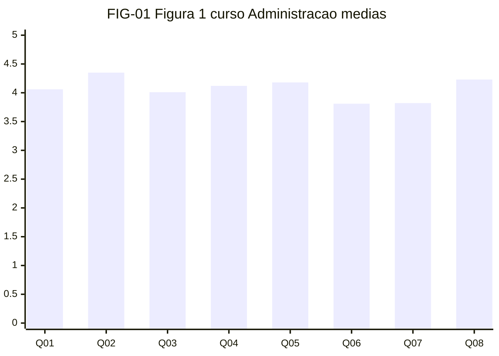
```mermaid
xychart-beta
    title "FIG-01 Figura 1 curso Administracao medias"
    x-axis [Q01, Q02, Q03, Q04, Q05, Q06, Q07, Q08]
    y-axis 0 --> 5
    bar [4.06, 4.35, 4.01, 4.12, 4.18, 3.81, 3.82, 4.23]
```

### FIG-02. Figura 2, coordenação de Administração (p. 5, PDF 9)

Título interno verbatim: Coordenação de Curso. Legenda externa verbatim: Figura 2: Avaliação da coordenação de curso de Administração. Tipo: barras 100 por cento, eixo X de 0 a 100 de 10 em 10. Questões: Q1 orientação; Q2 disponibilidade; Q3 divulgação. Médias: Q1 4,43; Q2 4,52; Q3 4,31. Percentuais ilegíveis. Texto fiel: BOA ou MUITO BOA em tudo, acima de 4.

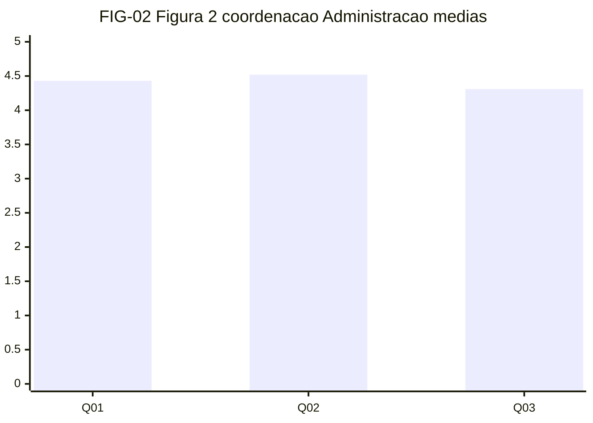
```mermaid
xychart-beta
    title "FIG-02 Figura 2 coordenacao Administracao medias"
    x-axis [Q01, Q02, Q03]
    y-axis 0 --> 5
    bar [4.43, 4.52, 4.31]
```

### FIG-03. Figura 3, autoavaliação discente de Administração (p. 6, PDF 10)

Título interno verbatim: Desempenho Discente. Legenda externa verbatim: Figura 3: Autoavaliação discente do curso de Administração. Tipo: barras 100 por cento, eixo X de 0 a 100 de 10 em 10. Questões: Q1 pontualidade; Q2 participação; Q3 assimilação. Médias: Q1 4,29; Q2 4,20; Q3 4,09. Percentuais ilegíveis. Texto fiel: desempenho satisfatório.

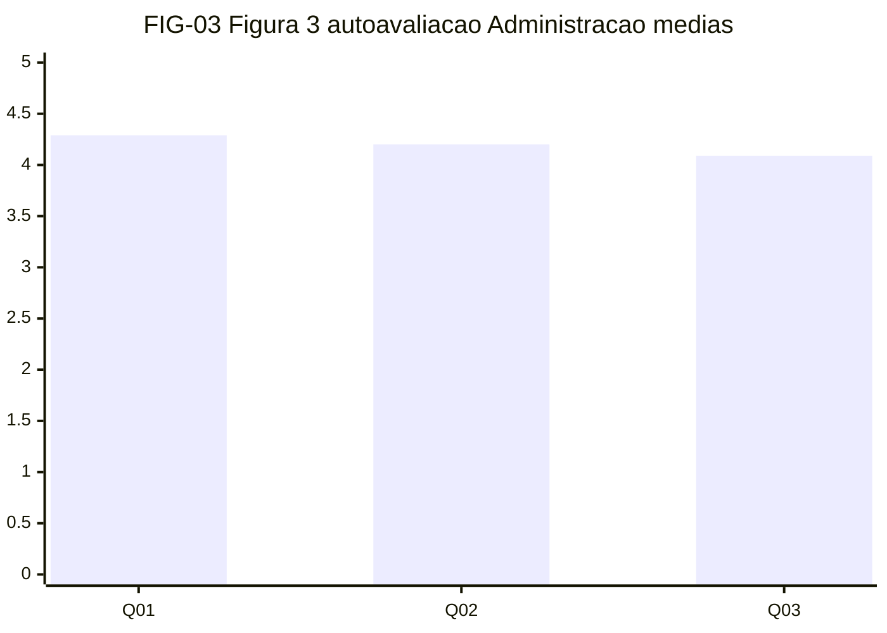
```mermaid
xychart-beta
    title "FIG-03 Figura 3 autoavaliacao Administracao medias"
    x-axis [Q01, Q02, Q03]
    y-axis 0 --> 5
    bar [4.29, 4.20, 4.09]
```

### FIG-04. Figura 4, docentes de Administração (p. 6, PDF 10)

Título interno verbatim: Desempenho Docente. Legenda externa verbatim: Figura 4: Avaliação dos docentes do curso de Administração. Tipo: barras 100 por cento, eixo X de 0 a 100 de 10 em 10. Questões: Q1 coerência; Q2 disponibilidade; Q3 assiduidade; Q4 relacionamento; Q5 didática. Médias: Q1 4,26; Q2 4,38; Q3 4,44; Q4 4,37; Q5 4,26. Percentuais ilegíveis. Texto fiel: satisfatório; Q6 SIM 63,57 por cento, NÃO 14,61 por cento, NÃO OBSERVADA 21,86 por cento; Q7 SIM 81,76 por cento, NÃO 6,45 por cento, NÃO OBSERVADO 11,79 por cento.

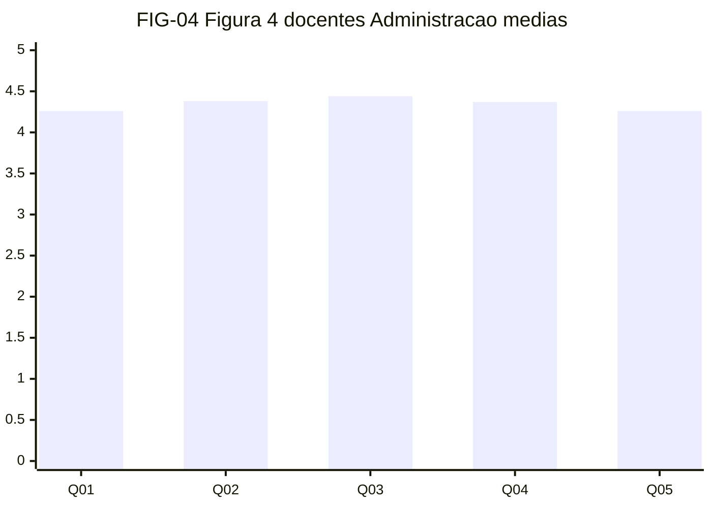
```mermaid
xychart-beta
    title "FIG-04 Figura 4 docentes Administracao medias"
    x-axis [Q01, Q02, Q03, Q04, Q05]
    y-axis 0 --> 5
    bar [4.26, 4.38, 4.44, 4.37, 4.26]
```

### FIG-05. Figura 5, disciplinas de Administração (p. 7, PDF 11)

Título interno verbatim: Disciplinas. Legenda externa verbatim: Figura 5: Avaliação das disciplinas do curso de Administração. Tipo: barras 100 por cento, eixo X de 0 a 100 de 10 em 10. Questões: Q1 importância; Q2 bibliografia; Q3 adequação; Q4 práticas. Médias: Q1 4,39; Q2 4,01; Q3 4,11; Q4 4,02. Percentuais ilegíveis. Texto fiel: satisfatórias no ano letivo de 2015.

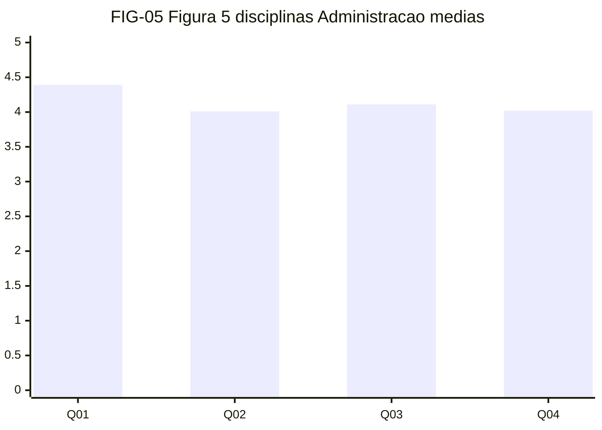
```mermaid
xychart-beta
    title "FIG-05 Figura 5 disciplinas Administracao medias"
    x-axis [Q01, Q02, Q03, Q04]
    y-axis 0 --> 5
    bar [4.39, 4.01, 4.11, 4.02]
```

### FIG-06. Figura 6, avaliação do curso de Matemática (p. 10, PDF 14)

Título interno verbatim: Curso. Legenda externa verbatim: Figura 6: Avaliação do curso de Matemática. Tipo: barras 100 por cento, eixo X de 0 a 100 de 10 em 10. Questões: Q1 matriz; Q2 SISCAD; Q3 adequação; Q4 TCC; Q5 estágio; Q6 representantes; Q7 complementares; Q8 atuação docente. Médias: Q1 3,97; Q2 4,33; Q3 3,97; Q4 3,72; Q5 4,21; Q6 3,91; Q7 3,65; Q8 4,15. Percentuais ilegíveis. Texto fiel: satisfatório; Q4 com muito NÃO SE APLICA e NÃO OBSERVADA (TCC não obrigatório); Q9 SIM 87,88 por cento, NÃO 12,12 por cento.

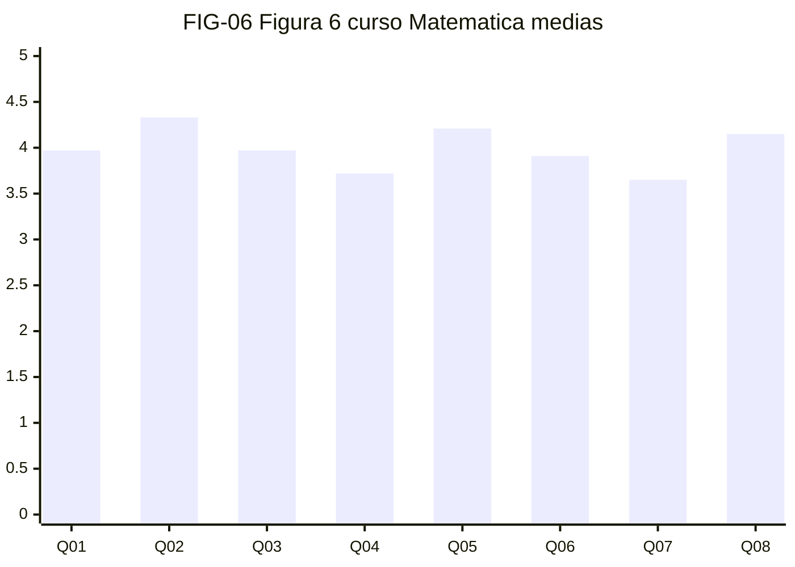
```mermaid
xychart-beta
    title "FIG-06 Figura 6 curso Matematica medias"
    x-axis [Q01, Q02, Q03, Q04, Q05, Q06, Q07, Q08]
    y-axis 0 --> 5
    bar [3.97, 4.33, 3.97, 3.72, 4.21, 3.91, 3.65, 4.15]
```

### FIG-07. Figura 7, coordenação de Matemática (p. 10, PDF 14)

Título interno verbatim: Coordenação de Curso. Legenda externa verbatim: Figura 7: Avaliação da coordenação de curso de Matemática. Tipo: barras 100 por cento, eixo X de 0 a 100 de 10 em 10. Questões: Q1 orientação; Q2 disponibilidade; Q3 divulgação. Médias: Q1 3,38; Q2 3,83; Q3 3,66. Percentuais ilegíveis. Texto fiel: BOA ou MUITO BOA.

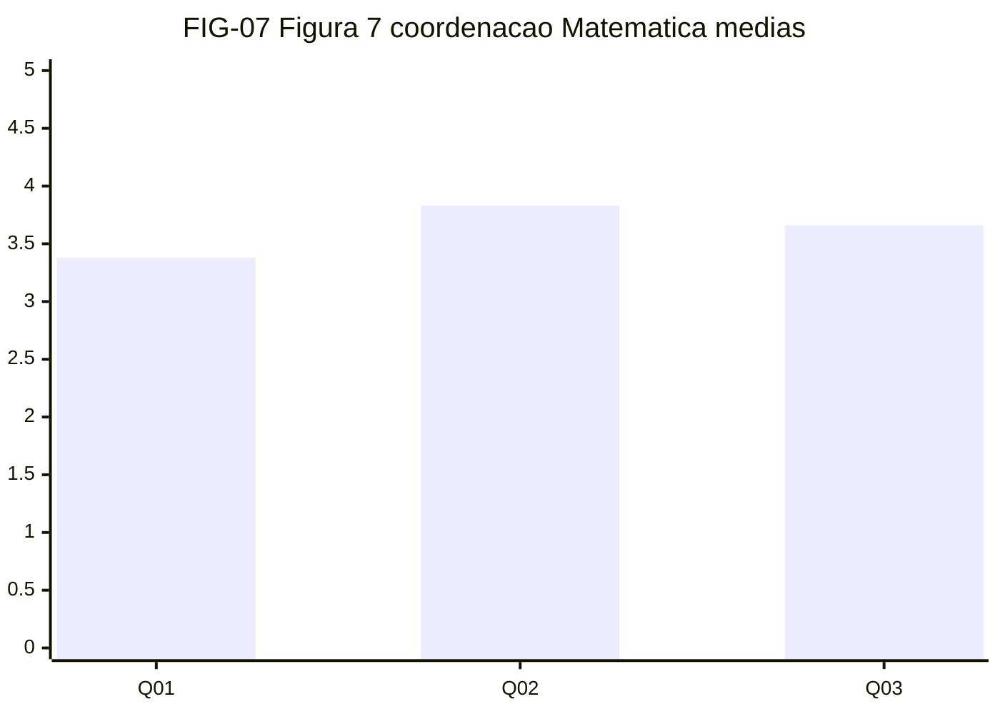
```mermaid
xychart-beta
    title "FIG-07 Figura 7 coordenacao Matematica medias"
    x-axis [Q01, Q02, Q03]
    y-axis 0 --> 5
    bar [3.38, 3.83, 3.66]
```

### FIG-08. Figura 8, autoavaliação discente de Matemática (p. 11, PDF 15)

Título interno verbatim: Desempenho Discente. Legenda externa verbatim: Figura 8: Autoavaliação discente do curso de Matemática. Tipo: barras 100 por cento, eixo X de 0 a 100 de 10 em 10. Questões: Q1 pontualidade; Q2 participação; Q3 assimilação. Médias: Q1 4,21; Q2 4,13; Q3 4,00. Percentuais ilegíveis. Texto fiel: satisfatório.

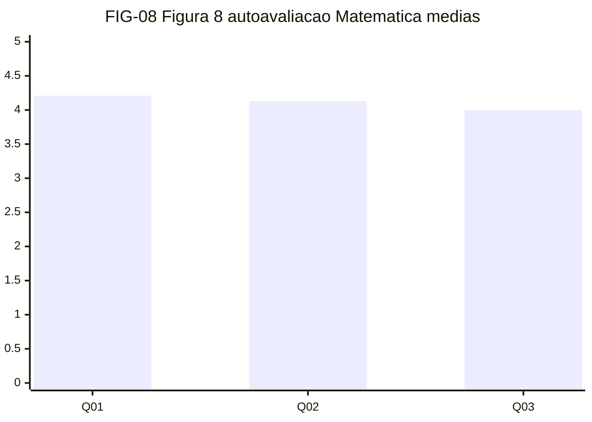
```mermaid
xychart-beta
    title "FIG-08 Figura 8 autoavaliacao Matematica medias"
    x-axis [Q01, Q02, Q03]
    y-axis 0 --> 5
    bar [4.21, 4.13, 4.00]
```

### FIG-09. Figura 9, docentes de Matemática (p. 12, PDF 16)

Título interno verbatim: Desempenho Docente. Legenda externa verbatim: Figura 9: Avaliação dos docentes do curso de Matemática. Tipo: barras 100 por cento, eixo X de 0 a 100 de 10 em 10. Questões: Q1 coerência; Q2 disponibilidade; Q3 assiduidade; Q4 relacionamento; Q5 didática. Médias: Q1 4,40; Q2 4,32; Q3 4,57; Q4 4,43; Q5 4,36. Percentuais ilegíveis. Texto fiel: satisfatório; Q6 SIM 76,5 por cento, NÃO 7,76 por cento, NÃO OBSERVADA 15,72 por cento; Q7 SIM 93,13 por cento, NÃO 2,00 por cento, NÃO OBSERVADO 4,88 por cento.

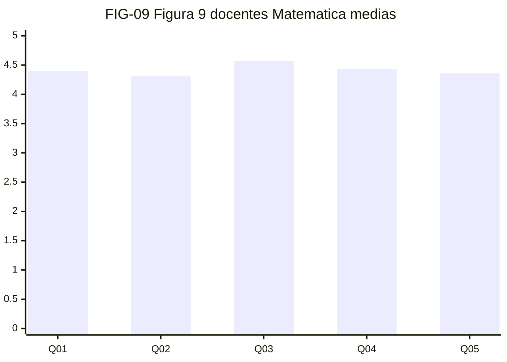
```mermaid
xychart-beta
    title "FIG-09 Figura 9 docentes Matematica medias"
    x-axis [Q01, Q02, Q03, Q04, Q05]
    y-axis 0 --> 5
    bar [4.40, 4.32, 4.57, 4.43, 4.36]
```

### FIG-10. Figura 10, disciplinas de Matemática (p. 12, PDF 16)

Título interno verbatim: Disciplinas. Legenda externa verbatim: Figura 10: Avaliação das disciplinas do curso de Matemática. Tipo: barras 100 por cento, eixo X de 0 a 100 de 10 em 10. Questões: Q1 importância; Q2 bibliografia; Q3 adequação; Q4 práticas. Médias: Q1 4,46; Q2 3,95; Q3 4,26; Q4 4,19. Percentuais ilegíveis. Texto fiel: satisfatórias no ano letivo de 2015.

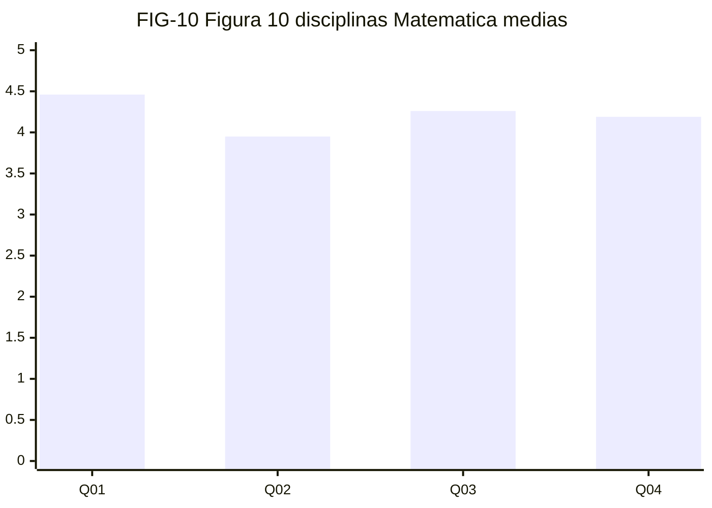
```mermaid
xychart-beta
    title "FIG-10 Figura 10 disciplinas Matematica medias"
    x-axis [Q01, Q02, Q03, Q04]
    y-axis 0 --> 5
    bar [4.46, 3.95, 4.26, 4.19]
```

### FIG-11. Figura 11, avaliação do curso de Psicologia (p. 16, PDF 20)

Título interno verbatim: Curso. Legenda externa verbatim: Figura 11: Avaliação do curso de Psicologia. Tipo: barras 100 por cento, eixo X de 0 a 100 de 10 em 10. Questões: Q1 matriz; Q2 SISCAD; Q3 adequação; Q4 TCC; Q5 estágio; Q6 representantes; Q7 complementares; Q8 atuação docente. Médias: Q1 3,78; Q2 4,22; Q3 3,84; Q4 4,00; Q5 4,00; Q6 3,20; Q7 3,05; Q8 3,52. Percentuais ilegíveis. Texto fiel (com remissão a Fig.12 no original, defeito preservado): MUITO BOM ou BOM em maioria, com não atendimento em Q6, Q7 e Q8; Q9 SIM 84,78 por cento, NÃO 15,22 por cento.

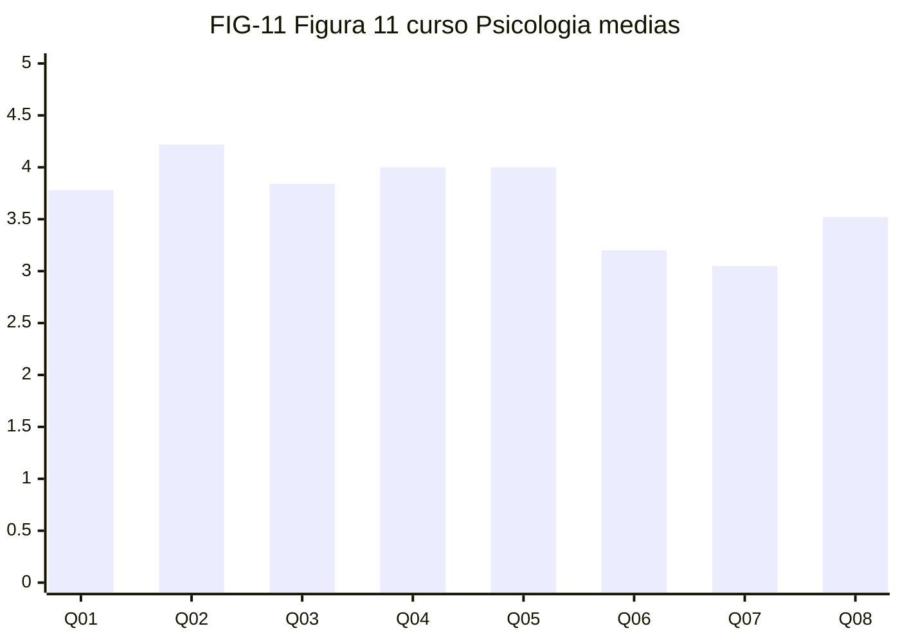
```mermaid
xychart-beta
    title "FIG-11 Figura 11 curso Psicologia medias"
    x-axis [Q01, Q02, Q03, Q04, Q05, Q06, Q07, Q08]
    y-axis 0 --> 5
    bar [3.78, 4.22, 3.84, 4.00, 4.00, 3.20, 3.05, 3.52]
```

### FIG-12. Figura 12, coordenação de Psicologia (p. 16, PDF 20)

Título interno verbatim: Coordenação de Curso. Legenda externa verbatim: Figura 12: Avaliação da coordenação de curso da Psicologia. Tipo: barras 100 por cento, eixo X de 0 a 100 em marcas de 20 em 20 (divergência de escala preservada). Questões: Q1 orientação; Q2 disponibilidade; Q3 divulgação. Médias: Q1 2,98; Q2 3,52; Q3 3,32. Percentuais ilegíveis. Texto fiel: todas abaixo de 4, com atenção a Q1, Q3 e Q2.

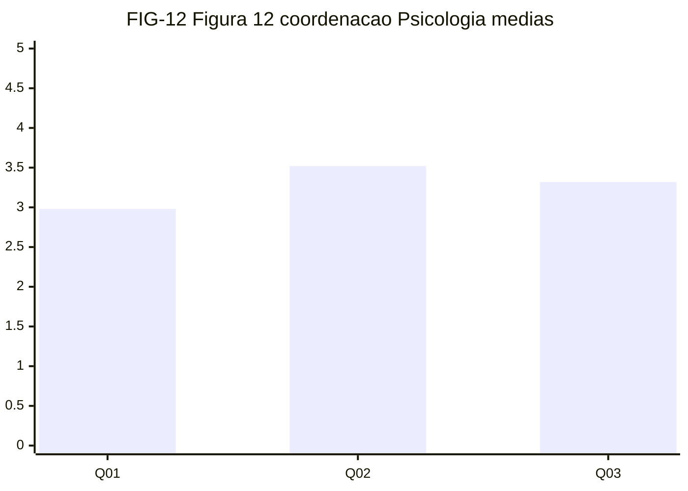
```mermaid
xychart-beta
    title "FIG-12 Figura 12 coordenacao Psicologia medias"
    x-axis [Q01, Q02, Q03]
    y-axis 0 --> 5
    bar [2.98, 3.52, 3.32]
```

### FIG-13. Figura 13, autoavaliação discente de Psicologia (p. 17, PDF 21)

Título interno verbatim: Desempenho Discente. Legenda externa verbatim: Figura 13: Autoavaliação discente do curso de Psicologia. Tipo: barras 100 por cento, eixo X de 0 a 100 de 10 em 10. Questões: Q1 pontualidade; Q2 participação; Q3 assimilação. Médias: Q1 4,21; Q2 4,13; Q3 4,00 (idênticas às da Figura 8, transcrição verbatim de ambas as imagens, coincidência preservada). Percentuais ilegíveis. Texto fiel: satisfatório.

```mermaid
xychart-beta
    title "FIG-13 Figura 13 autoavaliacao Psicologia medias"
    x-axis [Q01, Q02, Q03]
    y-axis 0 --> 5
    bar [4.21, 4.13, 4.00]
```

### FIG-14. Figura 14, docentes de Psicologia (p. 18, PDF 22)

Título interno verbatim: Desempenho Docente. Legenda externa verbatim: Figura 14: Avaliação dos docentes do curso de Psicologia. Tipo: barras 100 por cento, eixo X de 0 a 100 de 10 em 10. Questões: Q1 coerência; Q2 disponibilidade; Q3 assiduidade; Q4 relacionamento; Q5 didática. Médias: Q1 4,26; Q2 4,29; Q3 4,38; Q4 4,23; Q5 3,91. Percentuais ilegíveis. Texto fiel: MUITO BOM ou BOM em grande maioria; Q6 SIM 71,94 por cento, NÃO 10,56 por cento, NÃO OBSERVADA 17,50 por cento; Q7 SIM 93,33 por cento, NÃO 3,89 por cento, NÃO OBSERVADO 2,78 por cento.

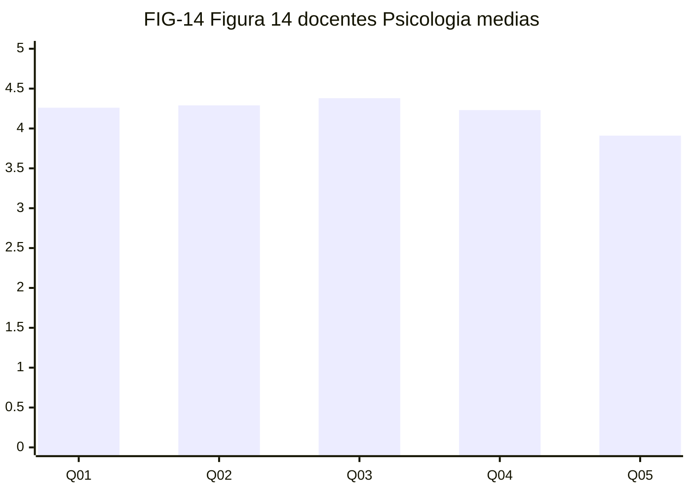
```mermaid
xychart-beta
    title "FIG-14 Figura 14 docentes Psicologia medias"
    x-axis [Q01, Q02, Q03, Q04, Q05]
    y-axis 0 --> 5
    bar [4.26, 4.29, 4.38, 4.23, 3.91]
```

### FIG-15. Figura 15, disciplinas de Psicologia (p. 18, PDF 22)

Título interno verbatim: Disciplinas. Legenda externa verbatim: Figura 15: Avaliação das disciplinas do curso de Psicologia. Tipo: barras 100 por cento, eixo X de 0 a 100 de 10 em 10. Questões: Q1 importância; Q2 bibliografia; Q3 adequação; Q4 práticas. Médias: Q1 4,47; Q2 3,55; Q3 4,03; Q4 3,90. Percentuais ilegíveis. Texto fiel: MUITO BOM ou BOM em Q1 e Q4 em grande maioria, com atenção a Q2 e à relação de Q4.

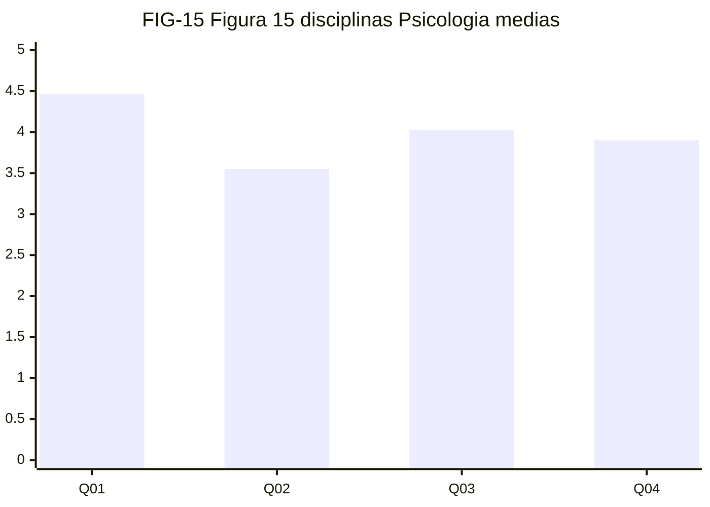
```mermaid
xychart-beta
    title "FIG-15 Figura 15 disciplinas Psicologia medias"
    x-axis [Q01, Q02, Q03, Q04]
    y-axis 0 --> 5
    bar [4.47, 3.55, 4.03, 3.90]
```

### FIG-16. Figura 16, infraestrutura pelos discentes (p. 26, PDF 30)

Título interno verbatim: Infraestrutura Física. Legenda externa verbatim: Figura 16: Avalialiação da infraestrutura do CPAR (duplo li no original, defeito preservado). Tipo: barras 100 por cento, eixo X de 0 a 100 de 10 em 10. Questões: Q1 segurança; Q2 sanitários; Q3 acervo; Q4 limpeza; Q5 PCD; Q6 laboratórios; Q7 cantina; Q8 computacionais; Q9 salas; Q10 lazer; Q11 biblioteca. Médias: Q1 3,79; Q2 3,43; Q3 3,39; Q4 3,68; Q5 3,56; Q6 3,55; Q7 2,09; Q8 3,51; Q9 3,86; Q10 2,61; Q11 3,60. Percentuais ilegíveis. Texto fiel: REGULAR no geral; cantina negativa com fechamento; lazer mal avaliado; biblioteca e salas de estudo reivindicadas; sanitários insatisfatórios para quase metade.

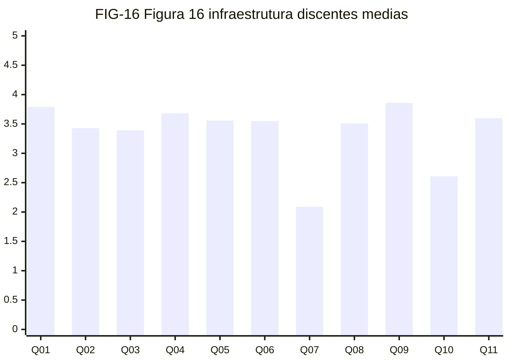
```mermaid
xychart-beta
    title "FIG-16 Figura 16 infraestrutura discentes medias"
    x-axis [Q01, Q02, Q03, Q04, Q05, Q06, Q07, Q08, Q09, Q10, Q11]
    y-axis 0 --> 5
    bar [3.79, 3.43, 3.39, 3.68, 3.56, 3.55, 2.09, 3.51, 3.86, 2.61, 3.60]
```

### FIG-17. Figura 17, pesquisa e extensão pelos discentes (p. 27, PDF 31)

Título interno verbatim: Pesquisa e Extensão. Legenda externa verbatim: Figura 17: Avalialiação das atividades de pesquisa e extensão do CPAR (duplo li no original, defeito preservado). Tipo: barras 100 por cento, eixo X em 0, 20, 40, 60, 80 e 100. Questões: Q1 pesquisa; Q2 extensão; Q3 qualidade; Q4 eventos externos. Médias: Q1 3,52; Q2 3,47; Q3 3,67; Q4 3,35. Percentuais ilegíveis. Texto fiel: atenção a Q2 e Q4.

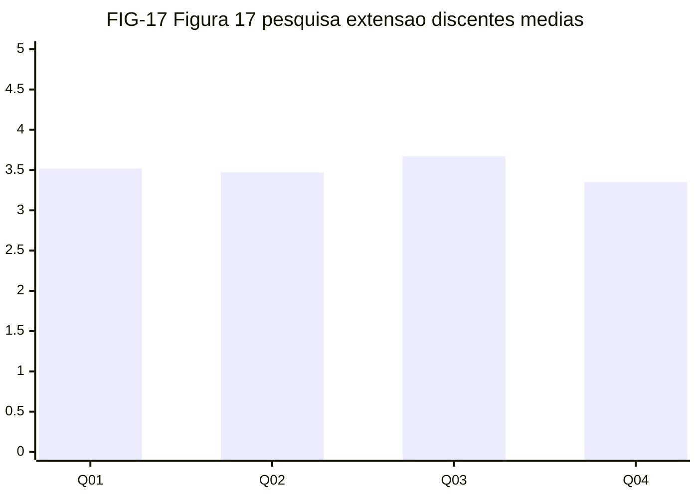
```mermaid
xychart-beta
    title "FIG-17 Figura 17 pesquisa extensao discentes medias"
    x-axis [Q01, Q02, Q03, Q04]
    y-axis 0 --> 5
    bar [3.52, 3.47, 3.67, 3.35]
```

### FIG-18. Figura 18, atendimento pelos discentes (p. 28, PDF 32)

Título interno verbatim: Políticas de Atendimento Discente. Legenda externa verbatim: Figura 18: Política de atendimento aos docente do CPAR (singular no original, defeito preservado). Tipo: barras 100 por cento, eixo X em 0, 20, 40, 60, 80 e 100. Questões: Q1 extracurriculares; Q2 psicossocial. Médias: Q1 3,17; Q2 3,83. Percentuais ilegíveis. Texto fiel: Q2 BOM ou MUITO BOM; Q1 RUIM e REGULAR na maioria.

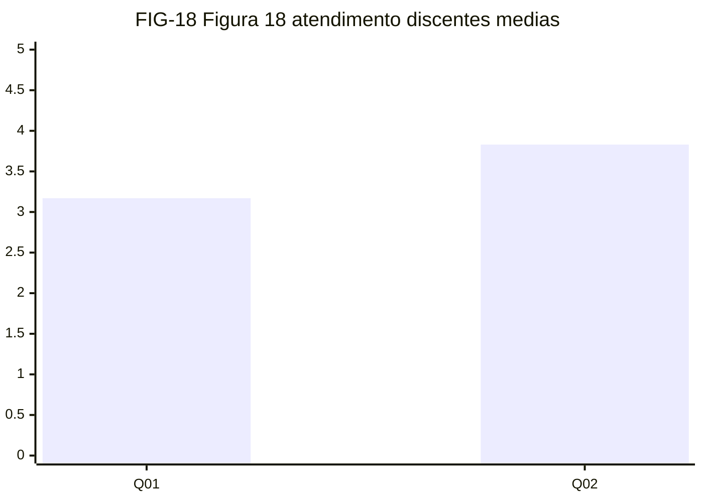
```mermaid
xychart-beta
    title "FIG-18 Figura 18 atendimento discentes medias"
    x-axis [Q01, Q02]
    y-axis 0 --> 5
    bar [3.17, 3.83]
```

### FIG-19. Figura 19, organização e gestão pelos discentes (p. 28, PDF 32)

Título interno verbatim: Organização e Gestão da Instituição. Legenda externa verbatim: Figura 19: Avaliação da organização e gestão do CPAR (duplo espaço no original, defeito preservado). Tipo: barras 100 por cento, eixo X em 0, 20, 40, 60, 80 e 100. Questões: Q1 DCE; Q2 técnicos; Q3 decisórios; Q4 melhorias. Médias: Q1 3,50; Q2 4,13; Q3 3,60; Q4 3,25. Percentuais ilegíveis. Texto fiel: técnicos e decisórios satisfatórios; Q4 e DCE pedem atenção, com remissão trocada a questão 3 no original (defeito preservado).

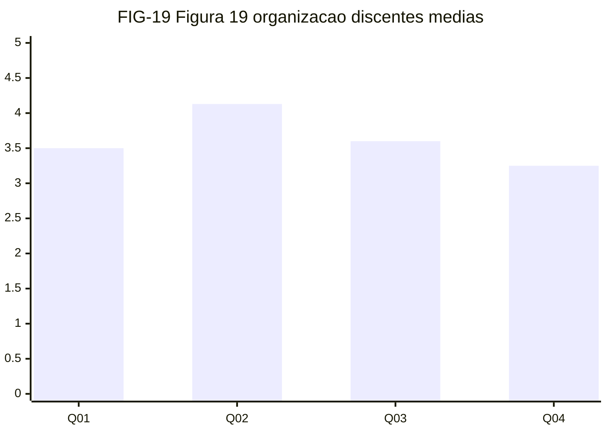
```mermaid
xychart-beta
    title "FIG-19 Figura 19 organizacao discentes medias"
    x-axis [Q01, Q02, Q03, Q04]
    y-axis 0 --> 5
    bar [3.50, 4.13, 3.60, 3.25]
```

### FIG-20. Figura 20, comunicação pelos discentes (p. 29, PDF 33)

Título interno verbatim: Comunicação com a Sociedade. Legenda externa verbatim: Figura 20: Comunicação com a sociedade. Tipo: barras 100 por cento, eixo X em 0, 20, 40, 60, 80 e 100. Questões: Q1 divulgação; Q2 ouvidoria; Q3 portal UFMS; Q4 portal unidade. Médias: Q1 3,66; Q2 3,69; Q3 4,00; Q4 4,04. Percentuais ilegíveis. Texto fiel: BOA ou MUITO BOA na maioria.

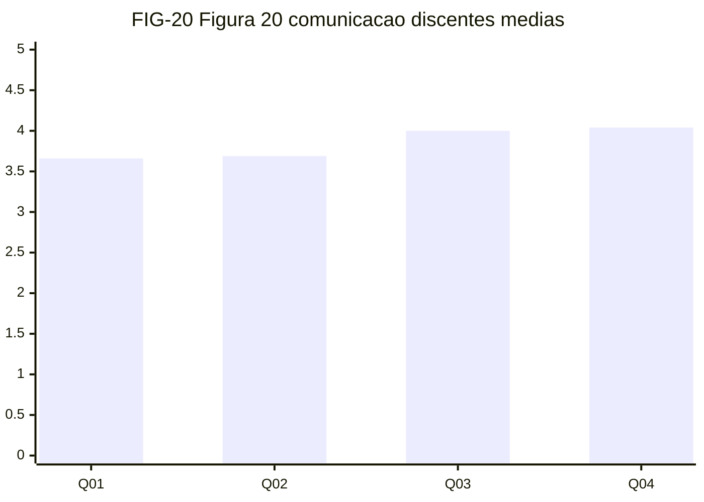
```mermaid
xychart-beta
    title "FIG-20 Figura 20 comunicacao discentes medias"
    x-axis [Q01, Q02, Q03, Q04]
    y-axis 0 --> 5
    bar [3.66, 3.69, 4.00, 4.04]
```

### FIG-21. Figura 21, unidade pelos docentes (p. 31, PDF 35)

Título interno verbatim: Unidade setorial. Legenda externa verbatim: Figura 21: Avaliação do CPAR pelos docentes. Tipo: barras 100 por cento, eixo X em 0, 25, 50, 75 e 100, legenda sem valores numéricos. Questões: Q1 biblioteca; Q2 satisfação; Q3 técnicos; Q4 portal. Médias: Q1 3,75; Q2 4,15; Q3 4,60; Q4 4,35. Percentuais ilegíveis. Texto fiel: bem em Q2 a Q4; biblioteca pede atenção.

```mermaid
xychart-beta
    title "FIG-21 Figura 21 unidade docentes medias"
    x-axis [Q01, Q02, Q03, Q04]
    y-axis 0 --> 5
    bar [3.75, 4.15, 4.60, 4.35]
```

### FIG-22. Figura 22, direção pelos docentes (p. 31, PDF 35)

Título interno verbatim: Direção. Legenda externa verbatim: Figura 22: Avaliação da direção do CPAR pelos docentes. Tipo: barras 100 por cento, eixo X em 0, 25, 50, 75 e 100, legenda sem valores numéricos. Questões: Q1 acesso; Q2 agilidade; Q3 soluções; Q4 integração; Q5 comunicação; Q6 transparência. Médias: Q1 4,75; Q2 4,68; Q3 4,58; Q4 4,05; Q5 4,16; Q6 4,28. Percentuais ilegíveis. Texto fiel: satisfatória.

```mermaid
xychart-beta
    title "FIG-22 Figura 22 direcao docentes medias"
    x-axis [Q01, Q02, Q03, Q04, Q05, Q06]
    y-axis 0 --> 5
    bar [4.75, 4.68, 4.58, 4.05, 4.16, 4.28]
```

### FIG-23. Figura 23, condições pelos docentes (p. 32, PDF 36)

Título interno verbatim: Condições de oferecimento do curso. Legenda externa verbatim: Figura 23: Avaliação das condições de oferecimentos dos cursos do CPAR pelos docentes (plural no original, defeito preservado). Tipo: barras 100 por cento, eixo X em 0, 25, 50, 75 e 100, legenda sem valores numéricos. Questões: Q1 salas; Q2 laboratórios; Q3 equipamentos; Q4 apoio; Q5 colegiado e NDE; Q6 matriz; Q7 PCD. Médias: Q1 4,00; Q2 3,47; Q3 3,59; Q4 4,06; Q5 4,45; Q6 4,05; Q7 3,88. Percentuais ilegíveis. Texto fiel: MUITO BOM ou BOM em Q1, Q4, Q5 e Q6; atenção a Q2, Q3 e Q7.

```mermaid
xychart-beta
    title "FIG-23 Figura 23 condicoes docentes medias"
    x-axis [Q01, Q02, Q03, Q04, Q05, Q06, Q07]
    y-axis 0 --> 5
    bar [4.00, 3.47, 3.59, 4.06, 4.45, 4.05, 3.88]
```

### FIG-24. Figura 24, coordenação pelos docentes (p. 33, PDF 37)

Título interno verbatim: Coordenação. Legenda externa verbatim: Figura 24: Avaliação dos coordenadores dos cursos do CPAR. Tipo: barras 100 por cento, eixo X em 0, 25, 50, 75 e 100, legenda sem valores numéricos. Questões: Q1 relacionamento; Q2 integração; Q3 disponibilidade; Q4 extensão; Q5 integração ensino-pesquisa-extensão; Q6 colegiado e NDE; Q7 acesso; Q8 transparência. Médias: Q1 4,70; Q2 4,50; Q3 4,60; Q4 4,35; Q5 4,40; Q6 4,65; Q7 4,65; Q8 4,70. Percentuais ilegíveis. Texto fiel: muito bem avaliadas.

```mermaid
xychart-beta
    title "FIG-24 Figura 24 coordenacao docentes medias"
    x-axis [Q01, Q02, Q03, Q04, Q05, Q06, Q07, Q08]
    y-axis 0 --> 5
    bar [4.70, 4.50, 4.60, 4.35, 4.40, 4.65, 4.65, 4.70]
```

### FIG-25. Figura 25, pesquisa e extensão pelos docentes (p. 34, PDF 38)

Título interno verbatim: Pesquisa e Extensão. Legenda externa verbatim: Figura 25: Avaliação das atividades de pesquisa e extensão do CPAR. Tipo: barras 100 por cento, eixo X em 0, 25, 50, 75 e 100, legenda sem valores numéricos. Questões: Q1 integração; Q2 apoio; Q3 infraestrutura. Médias: Q1 3,68; Q2 3,05; Q3 3,11. Percentuais ilegíveis. Texto fiel: pedem integração (Q1), apoio (Q2) e infraestrutura (Q3).

```mermaid
xychart-beta
    title "FIG-25 Figura 25 pesquisa docentes medias"
    x-axis [Q01, Q02, Q03]
    y-axis 0 --> 5
    bar [3.68, 3.05, 3.11]
```

### FIG-26. Figura 26, autoavaliação dos docentes (p. 34, PDF 38)

Título interno verbatim: Autoavaliação. Legenda externa verbatim: Figura 26: Autoavaliação dos docentes do CPAR. Tipo: barras 100 por cento, eixo X em 0, 25, 50, 75 e 100, legenda sem valores numéricos. Questões: Q1 documentos UFMS; Q2 documentos do curso. Médias: Q1 3,95; Q2 4,32. Percentuais ilegíveis. Texto fiel: satisfatória em Q2; atenção a Q1.

```mermaid
xychart-beta
    title "FIG-26 Figura 26 autoavaliacao docentes medias"
    x-axis [Q01, Q02]
    y-axis 0 --> 5
    bar [3.95, 4.32]
```

### FIG-27. Figura 27, questões gerais pelos coordenadores (p. 35, PDF 39)

Título interno verbatim: Questões gerais. Legenda externa verbatim: Figura 27: Questões gerais sobre a CPAR (preposição no original, defeito preservado). Tipo: barras 100 por cento, eixo X em 0, 25, 50, 75 e 100, legenda sem valores numéricos. Questões: Q1 NDE; Q2 docentes; Q3 PPC; Q4 PCD. Médias: Q1 4,00; Q2 3,67; Q3 3,67; Q4 3,33. Percentuais ilegíveis. Texto fiel: NDE satisfatório; atenção a Q2, Q3 e Q4. Amostra aparente de 3 respondentes (só BOM e REGULAR).

```mermaid
xychart-beta
    title "FIG-27 Figura 27 questoes coordenadores medias"
    x-axis [Q01, Q02, Q03, Q04]
    y-axis 0 --> 5
    bar [4.00, 3.67, 3.67, 3.33]
```

### FIG-28. Figura 28, infraestrutura pelos coordenadores (p. 36, PDF 40)

Título interno verbatim: Infraestrutura. Legenda externa verbatim: Figura 28: Avaliação da infraestrutura do CPAR pelos coordenadores. Tipo: barras 100 por cento, eixo X em 0, 25, 50, 75 e 100, legenda sem valores numéricos. Questões: Q1 salas; Q2 laboratórios; Q3 equipamentos; Q4 apoio. Médias: Q1 3,67; Q2 3,67; Q3 3,67; Q4 3,67. Percentuais ilegíveis. Texto fiel: satisfatórias (BOM e REGULAR).

```mermaid
xychart-beta
    title "FIG-28 Figura 28 infraestrutura coordenadores medias"
    x-axis [Q01, Q02, Q03, Q04]
    y-axis 0 --> 5
    bar [3.67, 3.67, 3.67, 3.67]
```

### FIG-29. Figura 29, autoavaliação dos coordenadores (p. 37, PDF 41)

Título interno verbatim: Autoavaliação. Legenda externa verbatim: Figura 29: Autoavaliação dos coordenadores de curso do CPAR. Tipo: barras 100 por cento, eixo X em 0, 25, 50, 75 e 100, legenda sem valores numéricos. Questões: Q1 documentos UFMS; Q2 documentos do curso. Médias: Q1 4,00; Q2 4,33. Percentuais ilegíveis. Texto fiel: satisfatórios.

```mermaid
xychart-beta
    title "FIG-29 Figura 29 autoavaliacao coordenadores medias"
    x-axis [Q01, Q02]
    y-axis 0 --> 5
    bar [4.00, 4.33]
```

### FIG-30. Figura 30, missão e perfil pelos técnicos (p. 37, PDF 41)

Título interno verbatim: Missão e perfil. Legenda externa verbatim: Figura 30: Avaliação da missão e perfil da instituição. Tipo: barras 100 por cento, eixo X em 0, 25, 50, 75 e 100, legenda sem valores numéricos. Questões: Q1 PDI. Médias: Q1 3,87. Percentuais ilegíveis. Texto fiel: REGULAR pela média, com cerca de 75 por cento entre MUITO BOM e BOM.

```mermaid
xychart-beta
    title "FIG-30 Figura 30 missao tecnicos medias"
    x-axis [Q01]
    y-axis 0 --> 5
    bar [3.87]
```

### FIG-31. Figura 31, políticas institucionais pelos técnicos (p. 38, PDF 42)

Título interno verbatim: Políticas institucionais. Legenda externa verbatim: Figura 31: Avaliação das políticas institucionais. Tipo: barras 100 por cento, eixo X em 0, 25, 50, 75 e 100, legenda sem valores numéricos. Questões: Q1 técnicos/professores; Q2 técnicos/alunos; Q3 pesquisa; Q4 extensão; Q5 problemas. Médias: Q1 3,80; Q2 4,07; Q3 2,80; Q4 2,87; Q5 4,40. Percentuais ilegíveis. Texto fiel: atenção a Q3 e Q4.

```mermaid
xychart-beta
    title "FIG-31 Figura 31 politicas tecnicos medias"
    x-axis [Q01, Q02, Q03, Q04, Q05]
    y-axis 0 --> 5
    bar [3.80, 4.07, 2.80, 2.87, 4.40]
```

### FIG-32. Figura 32, responsabilidade social pelos técnicos (p. 38, PDF 42)

Título interno verbatim: Responsabilidade social da UFMS. Legenda externa verbatim: Figura 32: Avaliação da responsabilidade social da unidade setorial. Tipo: barras 100 por cento, eixo X em 0, 25, 50, 75 e 100, legenda sem valores numéricos. Questões: Q1 inclusão; Q2 integração. Médias: Q1 3,93; Q2 3,67. Percentuais ilegíveis. Texto fiel: maior parte das expectativas.

```mermaid
xychart-beta
    title "FIG-32 Figura 32 responsabilidade tecnicos medias"
    x-axis [Q01, Q02]
    y-axis 0 --> 5
    bar [3.93, 3.67]
```

### FIG-33. Figura 33, comunicação pelos técnicos (p. 39, PDF 43)

Título interno verbatim: Comunicação institucional. Legenda externa verbatim: Figura 33: Avaliação da comunicação institucional. Tipo: barras 100 por cento, eixo X em 0, 25, 50, 75 e 100, legenda sem valores numéricos. Questões: Q1 coordenadoria; Q2 portal; Q3 boletim; Q4 telefonia; Q5 e-mail; Q6 internas; Q7 ouvidoria. Médias: Q1 3,80; Q2 4,07; Q3 4,00; Q4 3,20; Q5 3,80; Q6 3,93; Q7 4,07. Percentuais ilegíveis. Texto fiel: regulares Coordenadoria, telefonia, e-mail e internas; bons portal, boletim e ouvidoria.

```mermaid
xychart-beta
    title "FIG-33 Figura 33 comunicacao tecnicos medias"
    x-axis [Q01, Q02, Q03, Q04, Q05, Q06, Q07]
    y-axis 0 --> 5
    bar [3.80, 4.07, 4.00, 3.20, 3.80, 3.93, 4.07]
```

### FIG-34. Figura 34, pessoal pelos técnicos (p. 40, PDF 44)

Título interno verbatim: Políticas de Pessoal. Legenda externa verbatim: Figura 34: Avaliação das políticas de pessoal. Tipo: barras 100 por cento, eixo X em 0, 25, 50, 75 e 100, legenda sem valores numéricos. Questões: Q1 levantamento; Q2 capacitação; Q3 eventos; Q4 qualificação; Q5 saúde; Q6 desempenho; Q7 carreira; Q8 satisfação; Q9 chefia. Médias: Q1 2,80; Q2 2,47; Q3 3,07; Q4 3,20; Q5 3,21; Q6 3,53; Q7 2,87; Q8 3,60; Q9 4,67. Percentuais ilegíveis. Texto fiel: só Q9 plena; regulares Q3 a Q6 e Q8; insatisfatórios Q1, Q2 e Q7.

```mermaid
xychart-beta
    title "FIG-34 Figura 34 pessoal tecnicos medias"
    x-axis [Q01, Q02, Q03, Q04, Q05, Q06, Q07, Q08, Q09]
    y-axis 0 --> 5
    bar [2.80, 2.47, 3.07, 3.20, 3.21, 3.53, 2.87, 3.60, 4.67]
```

### FIG-35. Figura 35, organização pelos técnicos (p. 41, PDF 45)

Título interno verbatim: Organização e gestão. Legenda externa verbatim: Figura 35: Avaliação da organização e gestão dos órgãos/setores institucionais. Tipo: barras 100 por cento, eixo X em 0, 25, 50, 75 e 100, legenda sem valores numéricos. Questões: Q1 PRAD; Q2 PROINFRA; Q3 PROPP; Q4 PROGEP; Q5 PREAE; Q6 PREG; Q7 PROPLAN; Q8 NTI; Q9 direção; Q10 coordenação administrativa. Médias: Q1 3,80; Q2 3,87; Q3 3,87; Q4 4,07; Q5 4,07; Q6 3,87; Q7 4,00; Q8 4,33; Q9 4,80; Q10 4,64. Percentuais ilegíveis. Texto fiel: satisfatórios PROGEP, PREAE, PROPLAN, NTI, Direção e Coordenação Administrativa; regulares PRAD, PROINFRA, PROPP e PREG.

```mermaid
xychart-beta
    title "FIG-35 Figura 35 organizacao tecnicos medias"
    x-axis [Q01, Q02, Q03, Q04, Q05, Q06, Q07, Q08, Q09, Q10]
    y-axis 0 --> 5
    bar [3.80, 3.87, 3.87, 4.07, 4.07, 3.87, 4.00, 4.33, 4.80, 4.64]
```

### FIG-36. Figura 36, infraestrutura pelos técnicos (p. 42, PDF 46)

Título interno verbatim: Infraestrutura. Legenda externa verbatim: Figura 36: Avaliação da infraestrutura da unidade. Tipo: barras 100 por cento, eixo X em 0, 25, 50, 75 e 100, legenda sem valores numéricos. Questões: Q1 espaço; Q2 estacionamento; Q3 limpeza; Q4 coleta; Q5 acessibilidade; Q6 internet/telefonia; Q7 uso econômico; Q8 material permanente; Q9 manutenção de equipamentos; Q10 manutenção geral; Q11 segurança. Médias: Q1 3,87; Q2 1,73; Q3 4,20; Q4 3,87; Q5 3,60; Q6 3,13; Q7 3,93; Q8 4,00; Q9 3,53; Q10 3,47; Q11 4,00. Percentuais ilegíveis. Texto fiel: estacionamento MUITO RUIM; regulares espaço, coleta, acessibilidade, internet e telefonia, uso econômico e manutenções; satisfatórios limpeza, material permanente e segurança.

```mermaid
xychart-beta
    title "FIG-36 Figura 36 infraestrutura tecnicos medias"
    x-axis [Q01, Q02, Q03, Q04, Q05, Q06, Q07, Q08, Q09, Q10, Q11]
    y-axis 0 --> 5
    bar [3.87, 1.73, 4.20, 3.87, 3.60, 3.13, 3.93, 4.00, 3.53, 3.47, 4.00]
```

### FIG-37. Figura 37, processo de avaliação pelos técnicos (p. 42, PDF 46)

Título interno verbatim: Avaliação. Legenda externa verbatim: Figura 37: Avaliação do processo de Avaliação Institucional. Tipo: barras 100 por cento, eixo X em 0, 25, 50, 75 e 100, legenda sem valores numéricos. Questões: Q1 ações baseadas na autoavaliação; Q2 participação; Q3 planejamento e PDI; Q4 CPA local. Médias: Q1 3,64; Q2 3,57; Q3 3,64; Q4 4,07. Percentuais ilegíveis. Texto fiel: CPA local satisfatória; demais REGULARES.

```mermaid
xychart-beta
    title "FIG-37 Figura 37 processo tecnicos medias"
    x-axis [Q01, Q02, Q03, Q04]
    y-axis 0 --> 5
    bar [3.64, 3.57, 3.64, 4.07]
```

### FIG-38. Figura 38, sustentabilidade pelos técnicos (p. 43, PDF 47)

Título interno verbatim: Sustentabilidade financeira. Legenda externa verbatim: Figura 38: Avaliação da sustentabilidade financeira. Tipo: barras 100 por cento, eixo X em 0, 25, 50, 75 e 100, legenda sem valores numéricos. Questões: Q1 acompanhamento; Q2 adequação; Q3 uso racional. Médias: Q1 3,53; Q2 3,47; Q3 3,60. Percentuais ilegíveis. Texto fiel: REGULAR, em torno de 3,5.

```mermaid
xychart-beta
    title "FIG-38 Figura 38 sustentabilidade tecnicos medias"
    x-axis [Q01, Q02, Q03]
    y-axis 0 --> 5
    bar [3.53, 3.47, 3.60]
```

---

## 12. Lacunas e defeitos declarados desta conversão

Cobertura integral das 39 imagens (FIG-00 a FIG-38) com médias transcritas por visão a partir dos rótulos impressos. Percentuais por categoria ilegíveis em todas as Figuras 1 a 38 (nenhum impresso nas barras, só cores). Corpo docente de Psicologia com soma parcial no original (7 doutores e 5 mestres ou doutorandos em 13 efetivos). Pbext sem menção no ano (só Ext e Paext). Referências ausentes no original. Diplomados por ano ausentes neste ano. Auxílios por curso ausentes neste ano (só agregado de apoio estudantil). Colegiado e NDE sem contagens tabuladas. In loco sem menção. Guia do Estudante só para Administração. ENADE 2015 sem nota divulgada (só Matemática com nota 3 de 2014). Defeitos preservados: metadados do PDF com título genérico, autor e assunto de 2011; fragilidades de Administração idênticas às potencialidades; remissão a Fig.12 no texto da Figura 11; Avalialiação com duplo li nas Figuras 16 e 17; aos docente na Figura 18; duplo espaço em Avaliação da organização (Figura 19); troca de DCE questão 1 por questão 3 no texto 5.1.4; sobre a CPAR na Figura 27; oferecimentos no plural na Figura 23; om por com em 5.2.7; avaliararm, seguitentes, catina, reinvindicação e 201<u>3 na Tabela 1; Q9 de Administração somando 99,00 por cento; 76.5 por cento com ponto e 7, 76 por cento com espaço em Matemática; Paran0aíba com zero; Uma análise críticas; Instruções de os Serviço; Formandos: 07 formandos; Empresa do Júnior nas considerações; Figura 12 com eixo em marcas de 20 em 20; Figura 13 com médias idênticas às da Figura 8; curso de respondendo sem o nome do curso em 2.3.5. Nenhum valor estimado. Questões discursivas agregadas sem transcrição individual. Nomes apenas em composição, cargos e autoria de projetos.

## 13. Metadados

- **Citação (ABNT)**: UNIVERSIDADE FEDERAL DE MATO GROSSO DO SUL. Câmpus de Paranaíba. Comissão Setorial de Avaliação. Autoavaliação setorial 2015. Paranaíba: CPAR/UFMS, 2016.
- **Correlatos**: `RSA_2015_CPAR.md` (análise); Relatórios Setoriais 2014 e 2016; RAAI 2015 (lacuna preenchida por este setorial).
- **Vinculação**: Lei n. 10.861/2004 (SINAES); PDI 2015-2019; IS CPAR n. 9/2016.
- **Fontes de dados citadas no original**: google doc e e-mail (direção, coordenadores, docentes), SISCAD (discentes), Propp (pesquisa e IC), Preae (extensão), ENADE e Guia do Estudante (avaliação externa).
