# FONTE PRIMÁRIA ESTRUTURADA — Autoavaliação Setorial 2016 do CPAR/UFMS

> **Arquivo fonte**: `Relatorio_CSA_CPAR_2016.pdf` (cópia de trabalho em `workspace/fontes_pdfs/`).
> **Origem pública**: `https://cpar.ufms.br/avaliacao-institucional/` (sem bloqueio de download; URL original SEAVI `https://seavi.ufms.br/files/2017/03/CPAR_RelatorioSetorial_2016.pdf`).
> **Documento**: AUTOAVALIAÇÃO SETORIAL 2016, CÂMPUS DE PARANAÍBA (CPAR/UFMS), capa datada de MARÇO DE 2017. Título interno do PDF: Autoavaliação setorial 2016 <UNIDADE>. Autora: Keila. Criador: Microsoft Word 2013. Criação: 16/05/2017. 44 páginas.
> **Método de conversão**: download direto + extração de texto por página (pymupdf, 96.343 caracteres, `workspace/fonte2016_texto.txt`) + inventário de imagens embutidas (ornamento 321x223 repetido em 43 páginas; capa 864x627; gráficos 2016 embutidos como texto extraível, sem necessidade de leitura por visão para valores) + renderização de 26 páginas em PNG (`workspace/fontes_imgs/fonte2016/`) + leitura por visão de cada página com gráfico para confirmação de títulos, médias, legendas, eixos e parágrafos de análise.
> **Data da conversão**: 08 set 2026. **Cobertura**: integral do texto (páginas 1 a 44), 1 tabela numerada, 39 figuras com médias transcritas da camada de texto e conferidas por visão.
> **Relação com a série analítica**: este arquivo é a fonte primária estruturada; o arquivo analítico `RSA_2016_CPAR.md` permanece preservado e tem função diferente.
> **Convenção de imagens**: as Figuras 1 a 39 são barras horizontais empilhadas de 100 por cento com eixo X percentual e SEM percentuais numéricos impressos nas barras, apenas cores. Figuras 1 a 20 (segmento discente) com marcas de 10 em 10 por cento; Figuras 21 a 39 (docentes, coordenadores, técnicos) com marcas em 0, 25, 50, 75 e 100 por cento. Cada figura recebe bloco de contexto (número, título verbatim, página, tipo, escala, legenda das questões, médias, declaração de percentuais ilegíveis) + diagrama mermaid das médias. Nenhum percentual por categoria foi estimado. A Figura 00 é a capa com logotipo, com descrição em português sem mermaid.

## Sumário do documento fonte

1 INTRODUÇÃO (p. 5). 2 AVALIAÇÃO DE CURSOS DE GRADUAÇÃO (p. 5): 2.1 Administração (2.1.1 Indicadores; 2.1.2 Potencialidades e fragilidades; 2.1.3 Avaliação externa; 2.1.4 Outras informações; 2.1.5 Avaliação interna pelos discentes, Figuras 1 a 5; 2.1.6 Considerações da comissão setorial); 2.2 Matemática (2.2.1 a 2.2.4, Figuras 6 a 10); 2.3 Psicologia (2.3.1 a 2.3.6, Figuras 11 a 15). 3 PESQUISA E PÓS-GRADUAÇÃO (p. 20): 3.1 Pós-graduação; 3.2 Pesquisa (16 projetos + 10 iniciações científicas). 4 EXTENSÃO E APOIO AO DISCENTE (p. 24): 4.1 Apoio estudantil; 4.2 Relação de projetos de extensão realizados em 2016 (8 Ext + 3 Paext + 2 bolsas Pbext). 5 AVALIAÇÃO DA COMUNIDADE UNIVERSITÁRIA (p. 26): 5.1 Avaliação discente (5.1.1 Infraestrutura; 5.1.2 Pesquisa e Extensão; 5.1.3 Políticas de atendimento; 5.1.4 Organização e Gestão; 5.1.5 Comunicação; 5.1.6 Comentários; Figuras 16 a 20; Tabela 1 de participação 2014 a 2016); 5.2 Avaliação por docentes (5.2.1 a 5.2.7, Figuras 21 a 26); 5.3 Avaliação por coordenadores (5.3.1 a 5.3.4, Figuras 27 a 30); 5.4 Avaliação por técnico-administrativos (5.4.1 a 5.4.10, Figuras 31 a 39). 6 CONSIDERAÇÕES FINAIS (p. 43 a 44).

## Lista de Tabelas do documento

Tabela 1: Relação de discentes do CPAR participantes do processo de avaliação institucional UFMS em 2014, 2015 e 2016 (p. 26). É a única tabela numerada do documento; indicadores de cursos aparecem como listas com marcadores, sem numeração.

## Lista de Figuras do documento

Figuras 1 a 5: avaliação do curso de Administração pelos discentes (p. 8 a 10). Figuras 6 a 10: avaliação do curso de Matemática pelos discentes (p. 12 a 14). Figuras 11 a 15: avaliação do curso de Psicologia pelos discentes (p. 17 a 19). Figura 16: infraestrutura do CPAR pelos discentes (p. 27). Figura 17: pesquisa e extensão pelos discentes (p. 28). Figura 18: política de atendimento (p. 28). Figura 19: organização e gestão (p. 29). Figura 20: comunicação com a sociedade (p. 30). Figura 21: unidade setorial pelos docentes (p. 31). Figura 22: direção pelos docentes (p. 32). Figura 23: condições de oferecimento pelos docentes (p. 32 a 33). Figura 24: coordenadores pelos docentes (p. 33). Figura 25: pesquisa e extensão pelos docentes (p. 34). Figura 26: autoavaliação dos docentes (p. 34). Figura 27: questões gerais pelos coordenadores (p. 35). Figura 28: organização e gestão pelos coordenadores (p. 35 a 36). Figura 29: infraestrutura pelos coordenadores (p. 36). Figura 30: autoavaliação dos coordenadores (p. 36). Figura 31: missão e perfil pelos técnicos (p. 37). Figura 32: políticas institucionais pelos técnicos (p. 38). Figura 33: responsabilidade social pelos técnicos (p. 38). Figura 34: comunicação institucional pelos técnicos (p. 39). Figura 35: políticas de pessoal pelos técnicos (p. 39 a 40). Figura 36: organização e gestão pelos técnicos (p. 40). Figura 37: infraestrutura pelos técnicos (p. 41). Figura 38: processo de avaliação pelos técnicos (p. 41 a 42). Figura 39: sustentabilidade financeira pelos técnicos (p. 42).

---

## 1. Rosto, capa e composição (páginas 1 a 2)

Página 1: capa com o texto MARÇO DE 2017, AUTOAVALIAÇÃO SETORIAL 2016, CÂMPUS DE PARANAÍBA, faixa azul superior e bloco azul inferior com o logotipo da UFMS (ver Apêndice, FIG-00). Página 2: COMISSÃO SETORIAL CPA/CPAR, composição indicada pela Instrução de Serviço n. 21, de 3 de março de 2017. Docentes: Ana Cláudia dos Santos, Geraldinho Carneiro de Araújo (grafia do original, defeito preservado), Juliana Aparecida Matias Zechi e Tatiana Bertoldi Carlos. Técnico-administrativos: Ani Caroline Machado, Keila Patricia Gonzalez, Leonardo Chaves de Carvalho. Discente: Luiz César Campos Domingues. DIRIGENTE: Andréia Cristina Ribeiro.

## 2. Introdução (página 5, transcrição fiel condensada)

CPAR criado pela Resolução Coun n. 10/2001 com Administração, Matemática e Psicologia, para o desenvolvimento social, ambiental, cultural, científico e profissional de Paranaíba e entorno. Relatório apresenta a autoavaliação do Câmpus no ano de 2015 (divergência preservada: o ano correto confirmado por capa, sumário, indicadores e considerações é 2016). Participação da direção, coordenadores e docentes por formulário eletrônico no googledoc, com descritivo por e-mail; discentes por questionário eletrônico no SISCAD. Conceitos: MUITO BOM (todas as expectativas), BOM (maior parte), REGULAR (cerca da metade), RUIM (maior parte não atendida), MUITO RUIM (nenhuma), NÃO SE APLICA (NA) OU NÃO OBSERVADO (NO). Para cada grupo foi elaborado gráfico com a média de 1 a 5 pontos (MUITO BOM 5, BOM 4, REGULAR 3, RUIM 2, MUITO RUIM 1; NA ou NO ignorado). Três segmentos com questões abertas. Organização: Seção 2 cursos de graduação; Seção 3 pesquisa e pós; Seção 4 extensão e apoio; Seção 5 avaliações de discentes, docentes e coordenadores; Seção 6 considerações.

## 3. Curso de Administração (páginas 5 a 10)

Noturno, 50 vagas anuais para ingresso no período de inverno. Indicadores 2016: ingressantes 50 (25 IVS via SiSU, 6 IL1, 7 IL2, 5 IL3, 7 IL4; sem portador de diploma IDI); evadidos 43 (39 EDE desistência, 1 EJU jubilação, 3 ESA solicitada); formandos 25 (4 de 2015.2 não contabilizados no ano passado mais 21 de 2016.1; 2016.2 não fechado pela greve); matriculados 140 em 2016.1 e 161 em 2016.2; maior reprovação em número absoluto em Fundamentos de Marketing (19), Estatística Aplicada à Administração (14) e Métodos e Técnicas de Pesquisa em Administração (14), e em percentual em Gestão de Agronegócio (4 de 5, 80 por cento), Contabilidade Geral (8 de 12, 66,7 por cento, com dígito excedente 66,7,5 por cento no original, defeito preservado), Mercado de Capitais (10 de 15, 66,7 por cento), além de Estágio Obrigatório II e TCC II com 100 por cento; corpo docente com 8 efetivos (7 doutores, 1 mestre), 2 substitutos (1 especialista, 1 mestre) e 1 voluntário graduado. Potencialidades (coordenação): futura titulação doutoral de todos os vinculados (dois mestres efetivos doutorandos, viabiliza pós); mais projetos de ensino, pesquisa e extensão; suporte a Ciências Contábeis (mesma área CAPES) e afins; acervo novo e biblioteca nova com convivência e salas de estudo; envolvimento pela qualidade; ações de 2015 em desenvolvimento. Fragilidades: evasão e taxa de sucesso; muitas chamadas para completar vagas; transferência; sem contratação em Direito, Contabilidade e Economia; infraestrutura (biblioteca, salas, cantina, copiadora, estacionamento, internet aberta, convivência, esporte); direção com convivência, estacionamento, biblioteca, salas e cantina concretizados no início de 2017. Externa: ENADE 2015 nota 3, CPC nota 4; Guia do Estudante Editora Abril 4 estrelas em 2016. Outras: 2 docentes permanentes no PROFIAP ESAN; Empresa Júnior ativa em 2016; PAEXT/2016 com cooperativa de reciclagem e educação ambiental (2 bolsistas); quase todos com pesquisa e 3 IC; monitoria e acompanhamento de egressos iniciado. Discentes respondentes: 114 de 191 (59,69 por cento), questionário no SISCAD de novembro a dezembro de 2016 e março de 2017. Curso (Figura 1, Q1 4,00; Q2 4,35; Q3 4,13; Q4 4,22; Q5 3,83; Q6 3,89; Q7 3,90; Q8 4,37): maioria BOM e MUITO BOM; Q4 e Q5 com muito NA (só últimos anos); Q9 SIM/NÃO fora do gráfico (SIM 80,36 por cento, NÃO 10,94 por cento). Coordenação (Figura 2, Q1 4,34; Q2 4,51; Q3 4,37): BOA ou MUITO BOA em tudo. Autoavaliação (Figura 3, Q1 4,35; Q2 4,24; Q3 4,17): satisfatória. Docentes Q1 a Q5 (Figura 4, Q1 4,34; Q2 4,35; Q3 4,54; Q4 4,51; Q5 4,32): satisfatório; Q6 notas no prazo (SIM 85,28 por cento, NÃO 14,61 por cento, NÃO OBSERVADA 5,70 por cento, soma 105,59 por cento, defeito preservado); Q7 planos de ensino (SIM 91,46 ,76 por cento, grafia do original, defeito preservado; NÃO 6,01 por cento; NÃO OBSERVADO 2,53 por cento). Disciplinas (Figura 5, Q1 4,51; Q2 4,13; Q3 4,29; Q4 4,15): satisfatórias. Considerações da comissão: bem avaliado, quase tudo acima de 4; abertas pedem calendário acadêmico, mais professores, complementares sem custo, didática no primeiro ano, minicursos de Siscad e SIGProg, divulgação dos colegiados, normas e estágios remunerados.

## 4. Curso de Matemática (páginas 10 a 15)

Licenciatura noturna, 40 vagas anuais no verão. Indicadores 2016: ingressantes 42 (22 IVS, cotas L1 a L4, 2 ITV transferência voluntária; sem IDI); evadidos 30 (27 EDE, 1 EJU, 2 ESA); formandos 02; matriculados 101 em 2016.1 e 75 em 2016.2; maior reprovação em 2016.1 em Geometria Euclidiana e Desenho Geométrico I (76,08 por cento, primeiro semestre, base do ensino médio); 2016.2 sem dados pela greve e alteração do calendário; corpo docente com 8 efetivos (7 doutores, 1 mestre) e 1 substituto doutor. Potencialidades: corpo jovem focado no curso; PIBID com inserção nas redes; acompanhamento para pós com estudos orientados; 100 por cento formados para semipresencial. Fragilidade: desistências típicas de exatas com poucos formandos (questão nacional). Discentes respondentes: 49 de 101 (48,51 por cento). Curso (Figura 6, Q1 4,00; Q2 4,31; Q3 3,88; Q4 4,00; Q5 4,11; Q6 3,72; Q7 3,61; Q8 4,06): satisfatório; Q4 com muito NA/NO (TCC não obrigatório); Q7 REGULAR (complementares); Q9 SIM 65,31 por cento e NÃO 34,69 por cento. Coordenação (Figura 7, Q1 3,71; Q2 4,04; Q3 3,88): BOA ou MUITO BOA, com Q1 (pesquisa e extensão) pedindo atenção. Autoavaliação (Figura 8, Q1 4,24; Q2 4,08; Q3 3,93): satisfatória. Docentes Q1 a Q5 (Figura 9, Q1 4,22; Q2 4,17; Q3 4,42; Q4 4,33; Q5 4,09): satisfatório; Q6 SIM 81,27 por cento, NÃO 12,93 por cento, NÃO OBSERVADA 5,8 por cento; Q7 SIM 91,56 por cento, NÃO 3,43 por cento, NÃO OBSERVADO 5,01 por cento. Disciplinas (Figura 10, Q1 4,34; Q2 4,09; Q3 4,18; Q4 4,17, texto remete ao ano letivo de 2015, defeito preservado): satisfatórias. Considerações: satisfatório com maioria acima de 4, mas disciplinas de Metodologia da Pesquisa, Equações Diferenciais e Ordinárias, Tendências Matemáticas e Geometria Euclidiana e Desenho Geométrico I e II com RUIM ou MUITO RUIM em atendimento, relacionamento, didática e notas, também nas abertas; sugestões de aulas em dois dias por semana e troca de Matemática Financeira por Economia-Política.

## 5. Curso de Psicologia (páginas 15 a 19)

Bacharelado integral (vespertino e noturno), 40 vagas anuais no verão. Indicadores: ingressantes 38 em 2016 (17 IVS, 4 por cota L1 a L4, 5 ITV; sem portador); evadidos 16 em 2015 (15 EDE, 1 ESA, rótulo do original, defeito preservado); formandos 09; matriculados 131 em 2015.1 e 113 em 2015.2 (rótulos do original, defeito preservado); maior reprovação em Estatística Aplicada à Psicologia (50 por cento), TCC I (50 por cento), Métodos e Técnicas de Pesquisa I (35,5 por cento), Bases Biológicas do Comportamento (26,3 por cento) e Intervenção Psicopedagógica (25 por cento); corpo docente com 13 efetivos (7 doutores e 5 mestres ou doutorandos, soma parcial no original, lacuna declarada) e 2 substitutos mestres. Potencialidades: ações de ensino, pesquisa e extensão; eventos com externas; qualificação e disponibilidade; coesão com a comunidade; questionário de egressos para o novo PPC. Fragilidades: agilidade em livros; sem programa psicopedagógico e psicoeducativo; evasão por desistência em 2015.2 e 2016. Externa: ENADE 2015 nota 3, CPC 2. Outras: insuficiência de bolsas de monitoria (repetido de 2015). Discentes respondentes: 65 de 131 (49,62 por cento). Curso (Figura 11, Q1 3,73; Q2 4,14; Q3 3,80; Q4 3,50; Q5 3,87; Q6 3,50; Q7 3,05; Q8 3,57): maioria BOM, com não atendimento em TCC (Q4), estágio (Q5), complementares (Q7), representantes (Q6) e atuação docente (Q8), itens de Q5 a Q7 sem mudança ante 2015; Q9 SIM 93,32 por cento, NÃO 3,96 por cento, NÃO OBSERVADO 2,72 por cento. Coordenação (Figura 12, Q1 3,50; Q2 4,15; Q3 3,85): maioria BOA, com Q1 (pesquisa e extensão) pedindo atenção. Autoavaliação (Figura 13, Q1 4,16; Q2 4,22; Q3 4,09): satisfatória. Docentes Q1 a Q5 (Figura 14, Q1 4,40; Q2 4,35; Q3 4,30; Q4 4,36; Q5 3,91): MUITO BOM ou BOM em grande maioria; Q6 e Q7 com percentuais idênticos aos do bloco de Matemática (81,27/12,93/5,8 e 91,56/3,43/5,01, defeito preservado). Disciplinas (Figura 15, Q1 4,47; Q2 3,69; Q3 4,16; Q4 4,05, texto remete ao ano letivo de 2015, defeito preservado): MUITO BOM ou BOM em Q1 e Q4, com Q2 (bibliografia na biblioteca) pedindo atenção. Considerações: bem avaliado com itens REGULAR (complementares, representantes, atuação docente, reivindicações de 2015) e apontamentos em bibliografia, datashow e espaço físico por alunos.

## 6. Pesquisa e pós-graduação (páginas 20 a 23)

Pós: nenhum programa no CPAR; comissão (IS 102/2015 e 112/2015) para mestrado multidisciplinar; 4 docentes credenciados (2 no PROFIAP ESAN, 1 no PROFMAT CPTL, 1 no Mestrado em Psicologia de Campo Grande, linha Psicologia e Processos Psicossociais). Pesquisa: 16 projetos cadastrados em 2016 na Propp (2 com fomento externo, 14 sem). Item 1: Análise dos efeitos sob o estresse de protocolo de habilidades sociais em agentes comunitários de saúde (Vinícius Santos Ferreira, 01/02/2015 a 01/08/2017, Edital 19/2014 fomento interno, em andamento com parcial). Item 2: Aspectos Combinatórios da Teoria dos Números (Andréia Cristina Ribeiro, 01/04/2012 a 30/07/2016, recadastramento, em andamento com parcial). Item 3: Conflito cognitivo e decisão estratégica em equipes de direção de pequenas empresas (Tatiane Tavares Maia, 10/09/2016 a 10/09/2017, Edital 50/2016, em andamento normal). Item 4: Diferenças entre efeitos de reforçamento positivo versus negativo (Vinícius Santos Ferreira, 01/02/2015 a 01/02/2017, Edital 19/2014, em andamento normal). Item 5: Efeito da Hiperfobia em modelo animal de autismo por valproato pré-natal (Ana Luiza Bossolani Martins, 26/07/2016 a 26/07/2018, Edital 14/2014 fomento externo Fundec, em andamento normal). Item 6: Delineamentos Experimentais e Análise Multivariada (Elton Gean Araújo, 05/02/2014 a 05/02/2016, Edital 20/2013, concluída com final). Item 7: Convivência respeitosa em sala de aula e clima escolar (Juliana Aparecida Matias Zechi, 01/02/2015 a 31/07/2017, Edital 19/2014 interno com Fapesp em parceria Unicamp/Unesp, em andamento normal). Item 8: Prevalência de TEA e avaliação clínica em famílias (Ana Luiza Bossolani Martins, 01/01/2015 a 31/07/2017, Edital 19/2014 interno, em andamento normal). Item 9: Green HRM and green supply chain em empresas brasileiras (Adriano Alves Teixeira, 01/12/2016 a 30/11/2017, Edital 50/2016 sem fomento, a reformular). Item 10: Gestão organizacional, RH, qualidade e sustentabilidade (Wesley Ricardo de Souza Freitas, 01/01/2015 a 31/07/2017, Edital 20/2013 interno, em andamento com parcial). Item 11: Suportes sociais formais a famílias com autistas (Ana Luiza Bossolani Martins, 01/06/2015 a 31/12/2016, Edital 10/2015 interno, concluída sem final). Item 12: Pegada de carbono na cadeia de suprimento da carne bovina de MS (Thiago José Florindo, 10/12/2016 a 10/12/2018, Edital 50/2016 sem fomento, em andamento normal). Item 13: Sustentabilidade na COOREPA (Geraldino Carneiro de Araújo, 01/10/2012 a 30/07/2016, recadastramento, concluída com final). Item 14: Análise crítica de instrumentos psicométricos de inteligência (Bruno Peixoto Carvalho, 01/08/2016 a 31/07/2017, Edital 10/2015 interno, em andamento normal). Item 15: História da loucura pelo materialismo histórico-dialético (Bruno Peixoto Carvalho, 01/08/2015 a 31/07/2016, Edital 19/2014 interno, em andamento com final). Item 16: Inserção de Geometria Analítica e Cálculo Vetorial no Brasil (Sabrina Helena Bonfim, 13/01/2016 a 13/12/2017, Edital 10/2015 interno, em andamento normal). Iniciação científica (10 projetos, Propp, a partir de 2016): 1 Habilidades sociais e estresse em ACS, reaplicação (Vinícius Santos Ferreira; Mariana Garcia dos Santos e Sabrina Alecrim; voluntária); 2 Habilidades sociais em ACS (Vinícius Santos Ferreira; Gabriela Pinto Ferreira; voluntária); 3 Comunicação alternativa por troca de figuras no autismo (Ana Luiza Bossolani; Aline Soares Garcia e Bruna da Silva Pereira a partir de 2017; Pibic CNPQ); 4 Habilidades básicas de aprendizado em autistas (Ana Luiza Bossolani; Gabrieli Quevedo Meira; UFMS); 5 Clima escolar em Paranaíba (Juliana Aparecida Matias Zechi; Monique Luiza de Souza; Pibic/UFMS); 6 GRH e qualidade no plástico por equações estruturais (Wesley Ricardo de Souza Freitas; Luiz Cesar Campos Domingues; Pibic/CNPQ); 7 Gestão ambiental em hospitais (Wesley Ricardo de Souza Freitas; Elaine Dias Barbosa; Pibic/UFMS); 8 Sustentabilidade na UFMS/CPAR (Geraldino Carneiro de Araújo; Milton Cesar Gasparini de Andrade Junior; UFMS); 9 Clima escolar e convivência respeitosa (Juliana Aparecida Matias Zechi; Ana Elisa Magalhães Tristão Sousa; UFMS); 10 Reaplicação de habilidades sociais em ACS sob estresse (Vinícius Santos Ferreira; Lorena Melo Magalhães e Mariana Garcia dos Santos a partir de fev/2017; voluntária).
## 7. Extensão e apoio ao discente (páginas 24 a 26)

Apoio estudantil (4.1): em 2016, 53 acadêmicos com auxílio alimentação e 34 com bolsa permanência, além de 16 auxílios emergenciais e 09 ações de incentivo à participação em eventos (IPEV). Extensão Ext/2016 (8 ações, Proece): 1 Compartilhar (Ana Cláudia dos Santos, 01/06/2016 a 01/06/2017, em andamento normal); 2 Empresa Júnior de Administração gestão 2016/2017 (Geraldino Carneiro de Araújo, 01/09/2016 a 31/08/2017, em andamento normal); 3 Formação profissional e habilidades com agentes de saúde de Paranaíba (Renata Bellenzani, 18/11/2016 a 01/03/2017, em andamento normal); 4 Primeiro Simpósio Colorindo Azul, intervenção escolar em autismo (Ana Luiza Bossolani Martins, 18/05/2016 a 30/09/2016, concluída com final); 5 Redução da fila de espera na Seção de Psicologia Carolina Martuscelli Bori (Camila Bellini Colussi Macedo, 24/11/2016 a 23/11/2017, em andamento normal); 6 SetCors, seleção, treinamento, consultoria e responsabilidade social (Wesley Ricardo de Souza Freitas, 01/07/2016 a 31/07/2017, em andamento normal); 7 SE LIGA, acessibilidade em Paranaíba (Wesley Ricardo de Souza Freitas, 13/06/2016 a 01/06/2017, em andamento normal); 8 Você na UFMS, visitação e orientação no CPAR (Ana Claudia dos Santos, 01/03/2016 a 31/10/2016, concluído com final). Paext/2016 (3 ações): 1 Ações Sustentáveis em Paranaíba, educação ambiental, cidadania e resíduos (Geraldino Carneiro Araújo, 01/02/2016 a 31/12/2016, concluída sem final); 2 Eu Planto o Futuro II, conscientização e plantio (Marco Antônio Costa da Silva, 01/03/2016 a 30/11/2016, concluída sem final); 3 II Encontro de Educação e Psicologia Histórico-Cultural UFMS/UEMS (Jassônia Lima Vasconcelos Paccini, 04/03/2016 a 31/12/2016, período com 031 no original, defeito preservado; concluída sem final). Pbext/2016: 2 bolsas vinculadas às Ações Sustentáveis (Ação 1, Fernanda Sápia Silva, abr. a nov.; Ação 2 Pare, Repense, Recicle, Milton César Gasparini de Andrade Junior, período sem ano no original, lacuna declarada; Ação 3 Pense verde, Victor Hugo Nepomuceno Silva, ago. a out.; Ação 4 Hashtag Recicle, Luiz César Campos Domingues, nov.; sequência com código espúrio 23ewd no original, defeito preservado).

## 8. Avaliação da comunidade universitária (páginas 26 a 43)

Universo discente: 228 participantes voluntários de 423 com vínculo (53,90 por cento), questionário no SISCAD; sensibilização com redes sociais como facebook. Comparativo por curso com 2014 e 2015 (Tabela 1, p. 26, fonte texto do relatório): Administração 0901 (2014: 193 acadêmicos, 39, 20,21 por cento; 2015: 198, 97, 48,99 por cento; 2016: 191, 114, 59,69 por cento); Matemática 0902/0904 (2014: 92, 33, 35,87 por cento; 2015: 90, 43, 47,78 por cento; 2016: 101, 49, 48,51 por cento); Psicologia 0903 (2014: 152, 27, 17,76 por cento; 2015: 137, 58, 42,34 por cento; 2016: 131, 65, 49,62 por cento); Total (2014: 439, 99, 22,55 por cento; 2015: 428, 198, 46,26 por cento; 2016: 423, 228, 53,90 por cento). Infraestrutura (Figura 16, Q1 4,03; Q2 3,65; Q3 3,69; Q4 4,00; Q5 3,76; Q6 3,81; Q7 2,69; Q8 3,72; Q9 4,08; Q10 3,39; Q11 4,18, com parêntese duplo em Q11 no original, defeito preservado): BOA no geral; negativas cantina (Q7) e lazer/convivência (Q10), parcialmente solucionadas com reabertura da cantina em fevereiro de 2017 e área de lazer; Q2, Q3, Q5 e Q7 pedem atenção (menção de 2015). Pesquisa e extensão (Figura 17, Q1 3,56; Q2 3,51; Q3 3,77; Q4 3,54): satisfatórios, com atenção a Q1, Q2 e Q4. Atendimento (Figura 18, Q1 3,37; Q2 3,86; legenda com aos docente no original, defeito preservado): psicossocial BOM/MUITO BOM (Q2); extracurriculares RUIM/REGULAR (Q1, repete 2015). Organização e gestão (Figura 19, Q1 3,67; Q2 4,18; Q3 3,62; Q4 3,55): técnicos e participação satisfatórios; DCE (Q1), decisórios (Q3) e melhorias pós-avaliação (Q4) pedem atenção; ponderação de que o novo bloco não estava concluído na primeira fase da coleta. Comunicação (Figura 20, Q1 3,64; Q2 3,64; Q3 3,97; Q4 3,95): BOA/MUITO BOA, com Q1 e Q2 pedindo observação. Comentários discentes agregados (5.1.6, sem transcrição individual): infraestrutura (sem quadra e sala de jogos; livros do PPC insuficientes; wifi; ar e datashow em Adm e Psi; higiene dos sanitários; cantina com lanches de baixo valor e fechamento no fim de 2015; carteiras; laboratórios; iluminação no entorno); pesquisa e extensão (poucos projetos; divulgação; custeio a eventos); atendimento (mais semanas acadêmicas e cursos; assistente social efetiva para permanência, alimentação e emergencial); maioria repetida de 2015. Docentes: 23 de 31 (74 por cento). Unidade (Figura 21, Q1 4,13; Q2 4,61; Q3 4,78; Q4 4,61): bem avaliada; biblioteca melhorou ante 2015. Direção (Figura 22, Q1 4,91; Q2 4,83; Q3 4,83; Q4 4,41; Q5 4,57; Q6 4,70): satisfatória, destaque ao acesso. Condições (Figura 23, Q1 4,61; Q2 4,27; Q3 4,13; Q4 4,43; Q5 4,43; Q6 4,35; Q7 4,35): MUITO BOM/BOM em Q1, Q4, Q5 e Q6; melhora ante 2015 em laboratórios (Q2), equipamentos (Q3) e PNE (Q7). Coordenação (Figura 24, Q1 4,35; Q2 4,50; Q3 4,48; Q4 4,38; Q5 4,38; Q6 4,52; Q7 4,39; Q8 4,59): muito bem avaliadas. Pesquisa e extensão (Figura 25, Q1 3,73; Q2 3,70; Q3 3,52): satisfatórios, com demanda de integração (Q1), apoio (Q2) e infraestrutura (Q3). Autoavaliação (Figura 26, Q1 4,04; Q2 4,26): satisfatória; Q1 (documentos UFMS) melhorou ante 2015. Comentários docentes agregados (5.2.7): fragilidades (evasão; rotatividade; base fraca e alunos-trabalhadores; quadro mínimo; integração; cargas horárias; práticas; quadra; comunidade; pós); potencialidades (efetivos majoritariamente doutores; produção; reconhecimento; união; acesso a docentes e direção; projetos sociais; salas, LEM, Clínica Escola, EJ, informática, biblioteca). Coordenadores: 3 respondentes (médias 4,00 e 5,00 unânimes). Gestão e oferecimento (Figura 27, Q1 4,00; Q2 5,00; Q3 4,00; Q4 4,00; legenda sobre a CPAR no original, defeito preservado): satisfatórios. Organização (Figura 28, Q1 a Q3 4,00): satisfeitos. Infraestrutura (Figura 29, Q1 a Q4 5,00): satisfatória. Autoavaliação (Figura 30, Q1 e Q2 4,00): satisfatória. Técnicos: 13 de 15 (86,66 por cento), 52 questões em 9 blocos; quadro com 1 afastada integral a doutorado (3 anos), 1 retorno de mestrado em 08/2016, redistribuição do intérprete de Libras ao IFMS Dourados em 06/2016, 1 técnico em audiovisual em 08/2016, 1 licença saúde desde 09/2016; total igual a 2015. Missão e PDI (Figura 31, Q1 4,54): MUITO BOA; subiu de Regular 3,87 em 2015. Políticas institucionais (Figura 32, Q1 3,85; Q2 4,08; Q3 2,83; Q4 3,17; Q5 4,46): Q2 e Q5 satisfatórias; Q1, Q3 e Q4 pedem atenção. Responsabilidade social (Figura 33, Q1 4,31; Q2 4,15): maior parte das expectativas; subiu de 3,93 e 3,67. Comunicação (Figura 34, Q1 3,92; Q2 4,23; Q3 4,46; Q4 3,69; Q5 3,46; Q6 4,00; Q7 3,92): telefonia e e-mail REGULARES; coordenadoria, portal, internas e ouvidoria BOAS; boletim MUITO BOM; e-mail caiu de 3,80 e ouvidoria de 4,07. Pessoal (Figura 35, Q1 3,15; Q2 3,00; Q3 3,62; Q4 3,62; Q5 3,54; Q6 3,77; Q7 3,62; Q8 4,23; Q9 4,62): só Q9 satisfatória plena; Q3 a Q8 bons; Q1 e Q2 regulares. Organização e gestão (Figura 36, Q1 4,27; Q2 4,36; Q3 3,92; Q4 4,25; Q5 4,17; Q6 4,17; Q7 4,18; Q8 4,38; Q9 4,77; Q10 4,50): NTI, direção e coordenação administrativa muito bons; pró-reitorias satisfatórias. Infraestrutura (Figura 37, Q1 4,15; Q2 4,77; Q3 4,23; Q4 4,23; Q5 4,00; Q6 3,62; Q7 3,85; Q8 4,06; Q9 4,00; Q10 4,08; Q11 4,08): estacionamento MUITO BOM (subiu de 1,73 em 2015 por calçamento, pintura e urbanização); demais bons ou satisfatórios. Processo de avaliação (Figura 38, Q1 3,83; Q2 3,92; Q3 4,00; Q4 4,42): todos satisfatórios e melhores que 2015. Sustentabilidade (Figura 39, Q1 4,08; Q2 3,85; Q3 4,08): BOA, acima da anterior. Comentários técnicos agregados (5.4.10): fortes (direção eficiente e comprometida; relacionamento; qualificação acima do cargo; espaço, atendimento, segurança, limpeza); fracos (poucos cursos e sem pós, com ociosidade matutina; sem capacitação presencial por cargo; carência de técnicos com sobrecarga; recursos; material; esporte; almoxarifado; garagem do micro-ônibus; transporte público); sugestões (capacitação por área; mais técnicos; autonomia para serviços emergenciais).

## 9. Considerações finais (páginas 43 a 44, transcrição fiel condensada)

Participação crescente pelo terceiro ano: 53,90 por cento dos acadêmicos, 74 por cento dos professores e 86,6 por cento dos técnicos e coordenadores em 2016. Fragilidades: evasão; livros desatualizados; espaço para laboratórios; sem apoio PROPP a eventos; sem fixação docente no interior; sem anfiteatro de 400; acolhimento e assistência; sem wifi discente; sem transporte público; base fraca e alunos-trabalhadores; quadro mínimo; integração; cargas horárias; poucas práticas e extracurriculares; sem quadra; inserção comunitária; sem pós. Potencialidades: efetivo jovem com 71 por cento doutores; técnicos graduados e mestres; comissões atuantes; mais submissões de pesquisa, ensino e extensão; grupos com outras unidades e instituições; grupos de estudo; acadêmicos em eventos; interação; direção empenhada; Clínica Escola; Pibid; Empresa Júnior; CAs atuantes. Avanços ante 2015: 2 novos doutores em 2016; calçamento do estacionamento e praça de convivência; novo bloco de salas de professores com mobiliário. Divulgação do relatório à comunidade como norteador de direção e coordenações.

## 10. Referências

Seção de referências ausente no documento original (lacuna declarada: o relatório termina nas considerações finais, sem lista de referências).

---

## 11. Apêndice de figuras: contexto das imagens e tradução dos dados visuais

Padrão das Figuras 1 a 39: barras horizontais empilhadas de 100 por cento; eixo Y com questão e média entre parênteses; legenda com MUITO BOM, BOM, REGULAR, RUIM, MUITO RUIM, NA OU NO (0). Escala de média de 1 a 5 (MUITO BOM 5, BOM 4, REGULAR 3, RUIM 2, MUITO RUIM 1; NA ou NO com valor 0 ignorado no cálculo). Percentuais por categoria: ilegíveis em todas as figuras (nenhum número impresso nas barras), sem estimativa. Mermaid traduz as médias na ordem Q1 a Qn.

Legenda das questões discentes por curso (Administração, Matemática e Psicologia com mesmos enunciados): curso (Q1 matriz; Q2 SISCAD; Q3 adequação; Q4 TCC; Q5 estágio; Q6 representantes; Q7 complementares; Q8 atuação docente; Q9 PPC SIM/NÃO fora do gráfico); coordenação (Q1 pesquisa/extensão; Q2 disponibilidade; Q3 divulgação); autoavaliação (Q1 pontualidade; Q2 participação; Q3 assimilação); docentes (Q1 coerência; Q2 disponibilidade; Q3 assiduidade; Q4 relacionamento; Q5 didática; Q6 notas SIM/NÃO; Q7 planos SIM/NÃO); disciplinas (Q1 importância; Q2 bibliografia; Q3 adequação; Q4 práticas).

### FIG-00. Capa e logotipo (página 1, imagem p01)

Sem texto datado na imagem além do título AUTOAVALIAÇÃO SETORIAL 2016 e CÂMPUS DE PARANAÍBA e da identificação FUNDAÇÃO UNIVERSIDADE FEDERAL DE MATO GROSSO DO SUL com sigla UFMS. Tipo: capa institucional com faixa azul superior, bloco azul inferior e logotipo UFMS em preto e branco na transição. Descrição em português, sem mermaid e sem valores.

### FIG-01. Figura 1, avaliação do curso de Administração (p. 8)

Título interno verbatim: Curso. Legenda externa verbatim: Figura 1: Avaliação do curso de Administração. Tipo: barras horizontais empilhadas de 100 por cento, eixo X de 0 a 100 de 10 em 10. Questões: Q1 matriz; Q2 SISCAD; Q3 adequação; Q4 TCC; Q5 estágio; Q6 representantes; Q7 complementares; Q8 atuação docente. Médias: Q1 4,00; Q2 4,35; Q3 4,13; Q4 4,22; Q5 3,83 (com zero excedente 3,830 no original, defeito preservado); Q6 3,89; Q7 3,90; Q8 4,37. Percentuais ilegíveis. Texto fiel: maioria BOM/MUITO BOM; Q4 e Q5 com muito NA; Q9 SIM 80,36 por cento e NÃO 10,94 por cento.

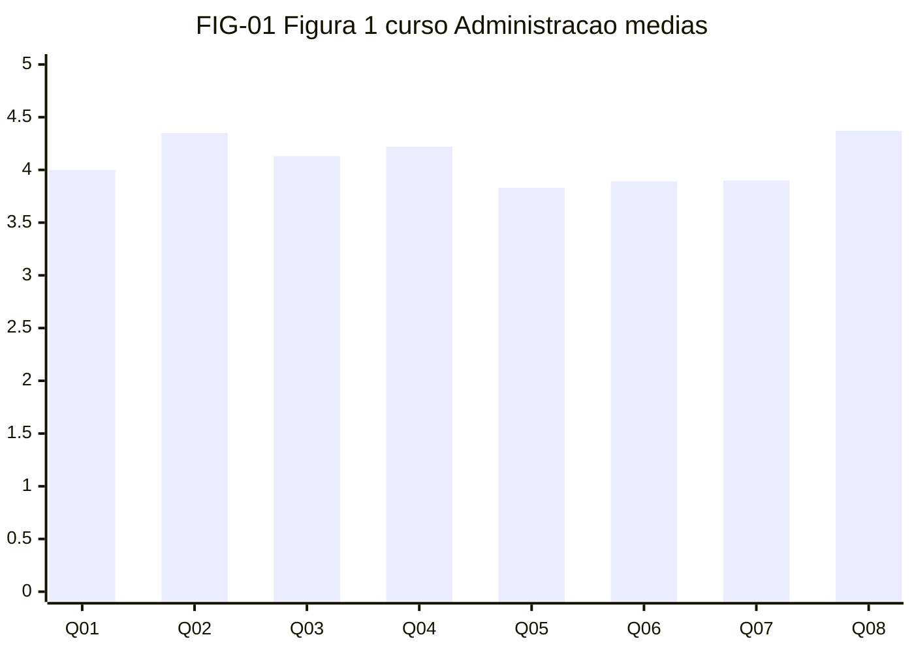
```mermaid
xychart-beta
    title "FIG-01 Figura 1 curso Administracao medias"
    x-axis [Q01, Q02, Q03, Q04, Q05, Q06, Q07, Q08]
    y-axis 0 --> 5
    bar [4.00, 4.35, 4.13, 4.22, 3.83, 3.89, 3.90, 4.37]
```

### FIG-02. Figura 2, coordenação de Administração (p. 8)

Título interno verbatim: Coordenação do Curso. Legenda externa verbatim: Figura 2: Avaliação da coordenação de curso de Administração. Tipo: barras 100 por cento, eixo X de 0 a 100 de 10 em 10. Questões: Q1 orientação; Q2 disponibilidade; Q3 divulgação. Médias: Q1 4,34; Q2 4,51; Q3 4,37. Percentuais ilegíveis. Texto fiel: BOA ou MUITO BOA em tudo, acima de 4.

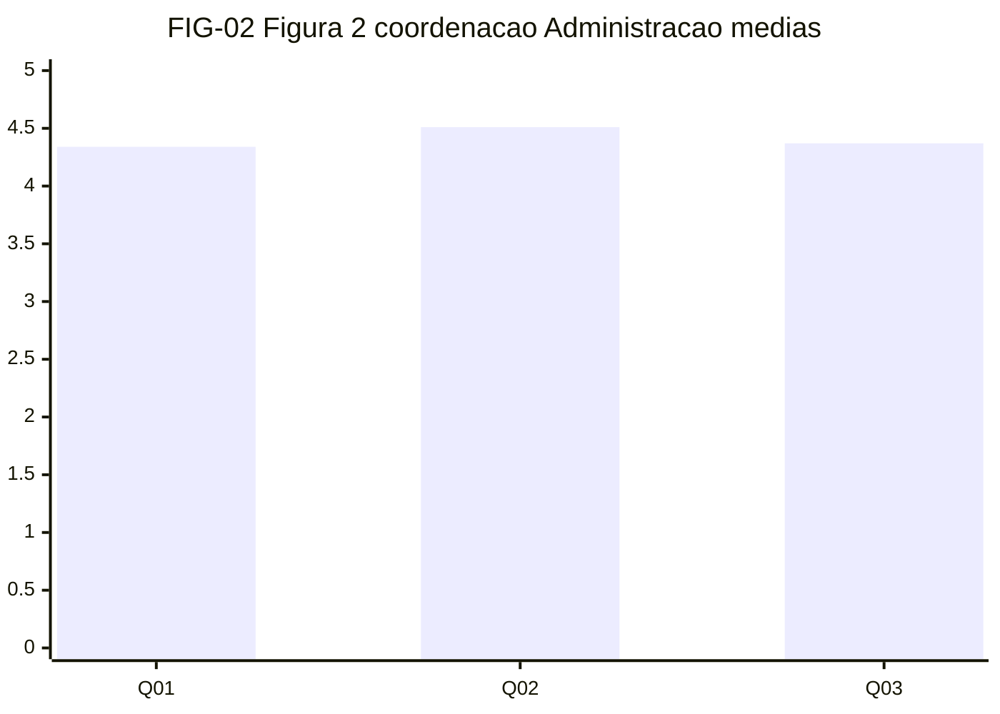
```mermaid
xychart-beta
    title "FIG-02 Figura 2 coordenacao Administracao medias"
    x-axis [Q01, Q02, Q03]
    y-axis 0 --> 5
    bar [4.34, 4.51, 4.37]
```

### FIG-03. Figura 3, autoavaliação discente de Administração (p. 9)

Título interno verbatim: Desempenho Discente. Legenda externa verbatim: Figura 3: Autoavaliação discente do curso de Administração. Tipo: barras 100 por cento, eixo X de 0 a 100 de 10 em 10. Questões: Q1 pontualidade; Q2 participação; Q3 assimilação. Médias: Q1 4,35; Q2 4,24; Q3 4,17. Percentuais ilegíveis. Texto fiel: desempenho satisfatório.

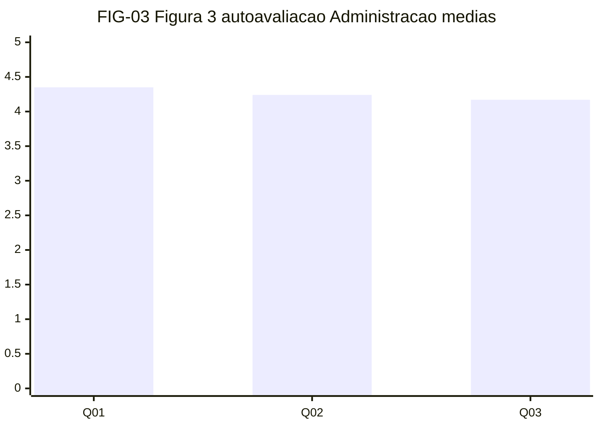
```mermaid
xychart-beta
    title "FIG-03 Figura 3 autoavaliacao Administracao medias"
    x-axis [Q01, Q02, Q03]
    y-axis 0 --> 5
    bar [4.35, 4.24, 4.17]
```

### FIG-04. Figura 4, docentes de Administração (p. 9)

Título interno verbatim: Desempenho Docente. Legenda externa verbatim: Figura 4: Avaliação dos docentes do curso de Administração. Tipo: barras 100 por cento, eixo X de 0 a 100 de 10 em 10. Questões: Q1 coerência; Q2 disponibilidade; Q3 assiduidade; Q4 relacionamento; Q5 didática. Médias: Q1 4,34; Q2 4,35; Q3 4,54; Q4 4,51; Q5 4,32. Percentuais ilegíveis. Texto fiel: satisfatório; Q6 SIM 85,28 por cento, NÃO 14,61 por cento, NÃO OBSERVADA 5,70 por cento (soma 105,59 por cento, defeito preservado); Q7 SIM 91,46 ,76 por cento (grafia do original, defeito preservado), NÃO 6,01 por cento, NÃO OBSERVADO 2,53 por cento.

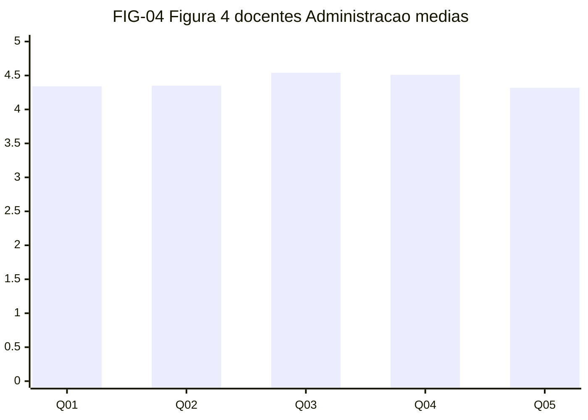
```mermaid
xychart-beta
    title "FIG-04 Figura 4 docentes Administracao medias"
    x-axis [Q01, Q02, Q03, Q04, Q05]
    y-axis 0 --> 5
    bar [4.34, 4.35, 4.54, 4.51, 4.32]
```

### FIG-05. Figura 5, disciplinas de Administração (p. 10)

Título interno verbatim: Disciplinas. Legenda externa verbatim: Figura 5: Avaliação das disciplinas do curso de Administração. Tipo: barras 100 por cento, eixo X de 0 a 100 de 10 em 10. Questões: Q1 importância; Q2 bibliografia; Q3 adequação; Q4 práticas. Médias: Q1 4,51; Q2 4,13; Q3 4,29; Q4 4,15. Percentuais ilegíveis. Texto fiel: satisfatórias.

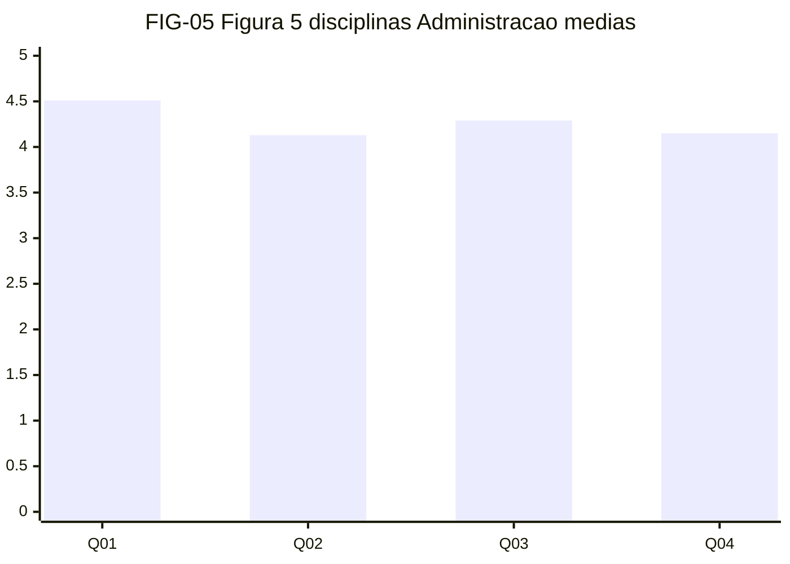
```mermaid
xychart-beta
    title "FIG-05 Figura 5 disciplinas Administracao medias"
    x-axis [Q01, Q02, Q03, Q04]
    y-axis 0 --> 5
    bar [4.51, 4.13, 4.29, 4.15]
```

### FIG-06. Figura 6, avaliação do curso de Matemática (p. 12)

Título interno verbatim: Curso. Legenda externa verbatim: Figura 6: Avaliação do curso de Matemática. Tipo: barras 100 por cento, eixo X de 0 a 100 de 10 em 10. Médias: Q1 4,00; Q2 4,31; Q3 3,88; Q4 4,00; Q5 4,11; Q6 3,72; Q7 3,61; Q8 4,06. Percentuais ilegíveis. Texto fiel: satisfatório; Q4 com muito NA/NO (TCC não obrigatório); Q7 REGULAR; Q9 SIM 65,31 por cento e NÃO 34,69 por cento.

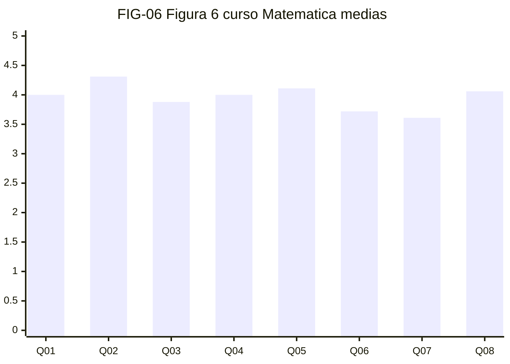
```mermaid
xychart-beta
    title "FIG-06 Figura 6 curso Matematica medias"
    x-axis [Q01, Q02, Q03, Q04, Q05, Q06, Q07, Q08]
    y-axis 0 --> 5
    bar [4.00, 4.31, 3.88, 4.00, 4.11, 3.72, 3.61, 4.06]
```

### FIG-07. Figura 7, coordenação de Matemática (p. 12)

Título interno verbatim: Coordenação do Curso. Legenda externa verbatim: Figura 7: Avaliação da coordenação de curso de Matemática. Tipo: barras 100 por cento, eixo X de 0 a 100 de 10 em 10. Médias: Q1 3,71; Q2 4,04; Q3 3,88. Percentuais ilegíveis. Texto fiel: BOA ou MUITO BOA, com Q1 pedindo atenção.

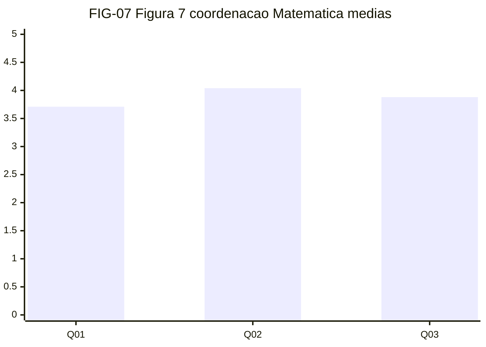
```mermaid
xychart-beta
    title "FIG-07 Figura 7 coordenacao Matematica medias"
    x-axis [Q01, Q02, Q03]
    y-axis 0 --> 5
    bar [3.71, 4.04, 3.88]
```

### FIG-08. Figura 8, autoavaliação discente de Matemática (p. 13)

Título interno verbatim: Desempenho Discente. Legenda externa verbatim: Figura 8: Autoavaliação discente do curso de Matemática. Tipo: barras 100 por cento, eixo X de 0 a 100 de 10 em 10. Médias: Q1 4,24; Q2 4,08; Q3 3,93. Percentuais ilegíveis. Texto fiel: satisfatório.

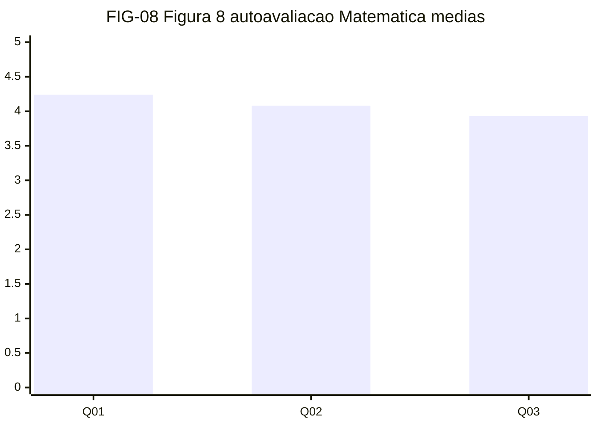
```mermaid
xychart-beta
    title "FIG-08 Figura 8 autoavaliacao Matematica medias"
    x-axis [Q01, Q02, Q03]
    y-axis 0 --> 5
    bar [4.24, 4.08, 3.93]
```

### FIG-09. Figura 9, docentes de Matemática (p. 14)

Título interno verbatim: Desempenho Docente. Legenda externa verbatim: Figura 9: Avaliação dos docentes do curso de Matemática. Tipo: barras 100 por cento, eixo X de 0 a 100 de 10 em 10. Médias: Q1 4,22; Q2 4,17; Q3 4,42; Q4 4,33; Q5 4,09. Percentuais ilegíveis. Texto fiel: satisfatório; Q6 SIM 81,27 por cento, NÃO 12,93 por cento, NÃO OBSERVADA 5,8 por cento; Q7 SIM 91,56 por cento, NÃO 3,43 por cento, NÃO OBSERVADO 5,01 por cento.

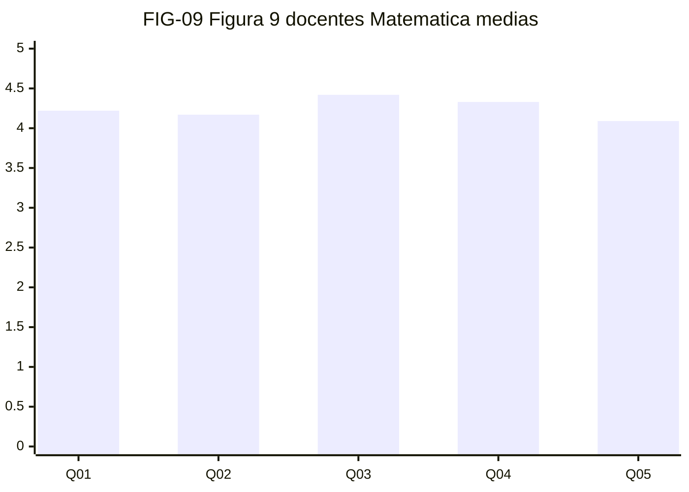
```mermaid
xychart-beta
    title "FIG-09 Figura 9 docentes Matematica medias"
    x-axis [Q01, Q02, Q03, Q04, Q05]
    y-axis 0 --> 5
    bar [4.22, 4.17, 4.42, 4.33, 4.09]
```

### FIG-10. Figura 10, disciplinas de Matemática (p. 14)

Título interno verbatim: Disciplinas. Legenda externa verbatim: Figura 10: Avaliação das disciplinas do curso de Matemática. Tipo: barras 100 por cento, eixo X de 0 a 100 de 10 em 10. Médias: Q1 4,34; Q2 4,09; Q3 4,18; Q4 4,17. Percentuais ilegíveis. Texto fiel (com remissão ao ano letivo de 2015, defeito preservado): satisfatórias.

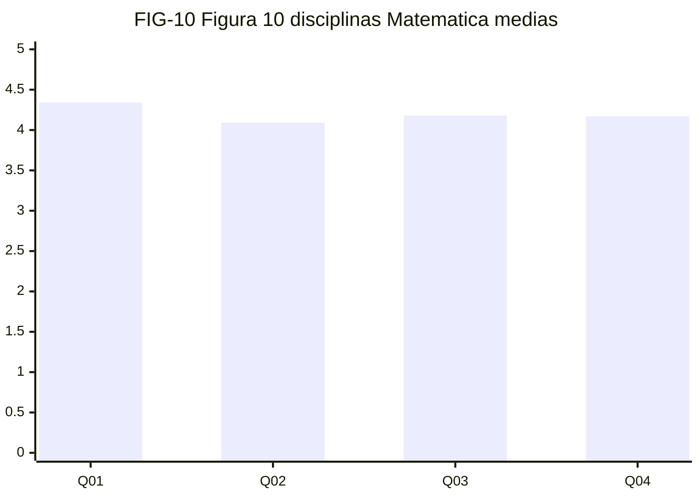
```mermaid
xychart-beta
    title "FIG-10 Figura 10 disciplinas Matematica medias"
    x-axis [Q01, Q02, Q03, Q04]
    y-axis 0 --> 5
    bar [4.34, 4.09, 4.18, 4.17]
```

### FIG-11. Figura 11, avaliação do curso de Psicologia (p. 17)

Título interno verbatim: Curso. Legenda externa verbatim: Figura 11: Avaliação do curso de Psicologia. Tipo: barras 100 por cento, eixo X de 0 a 100 de 10 em 10. Médias: Q1 3,73; Q2 4,14; Q3 3,80; Q4 3,50; Q5 3,87; Q6 3,50; Q7 3,05; Q8 3,57. Percentuais ilegíveis. Texto fiel (com remissão a Fig.1 onde o contexto é Fig. 11, defeito preservado): maioria BOM, com não atendimento em Q4 a Q8 e itens de Q5 a Q7 sem mudança ante 2015; Q9 SIM 93,32 por cento, NÃO 3,96 por cento, NÃO OBSERVADO 2,72 por cento.

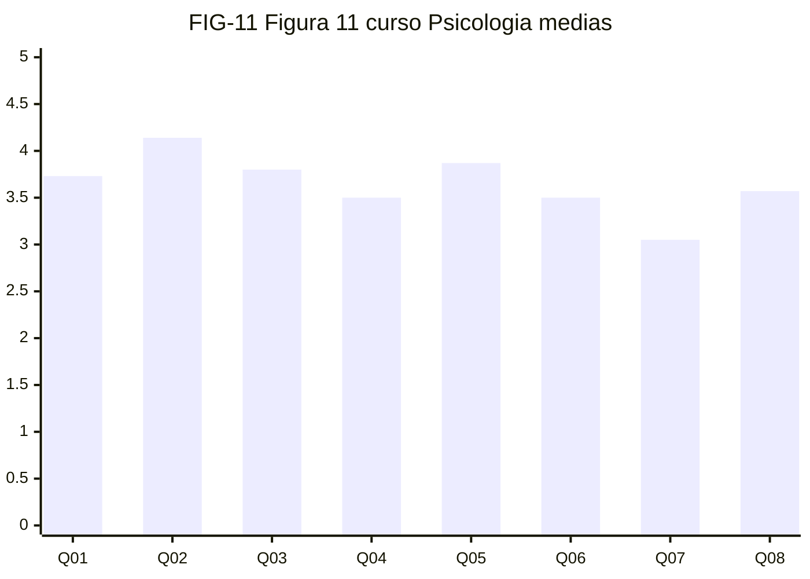
```mermaid
xychart-beta
    title "FIG-11 Figura 11 curso Psicologia medias"
    x-axis [Q01, Q02, Q03, Q04, Q05, Q06, Q07, Q08]
    y-axis 0 --> 5
    bar [3.73, 4.14, 3.80, 3.50, 3.87, 3.50, 3.05, 3.57]
```

### FIG-12. Figura 12, coordenação de Psicologia (p. 17)

Título interno verbatim: Coordenação de Curso. Legenda externa verbatim: Figura 12: Avaliação da coordenação de curso da Psicologia. Tipo: barras 100 por cento, eixo X de 0 a 100 de 10 em 10. Médias: Q1 3,50; Q2 4,15; Q3 3,85. Percentuais ilegíveis. Texto fiel: maioria BOA, com Q1 pedindo atenção.

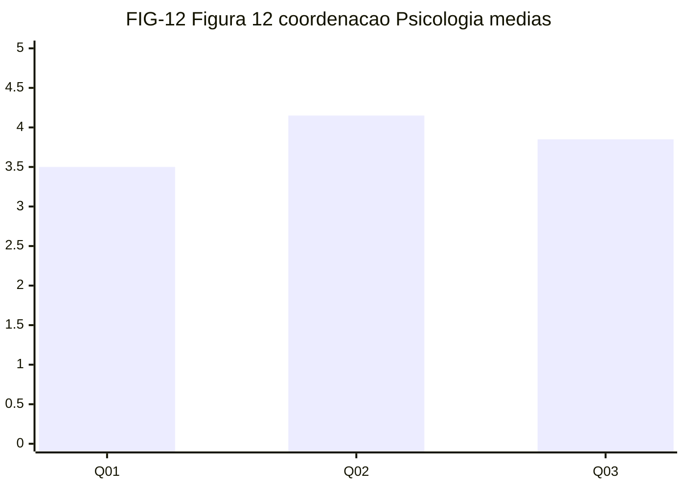
```mermaid
xychart-beta
    title "FIG-12 Figura 12 coordenacao Psicologia medias"
    x-axis [Q01, Q02, Q03]
    y-axis 0 --> 5
    bar [3.50, 4.15, 3.85]
```

### FIG-13. Figura 13, autoavaliação discente de Psicologia (p. 18)

Título interno verbatim: Desempenho Discente. Legenda externa verbatim: Figura 13: Autoavaliação discente do curso de Psicologia. Tipo: barras 100 por cento, eixo X de 0 a 100 de 10 em 10. Médias: Q1 4,16; Q2 4,22; Q3 4,09. Percentuais ilegíveis. Texto fiel: satisfatório.

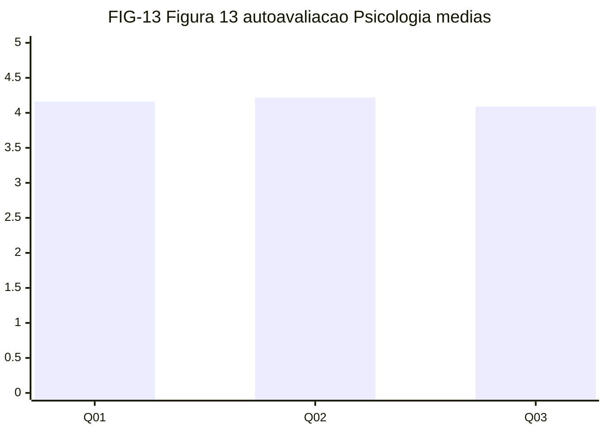
```mermaid
xychart-beta
    title "FIG-13 Figura 13 autoavaliacao Psicologia medias"
    x-axis [Q01, Q02, Q03]
    y-axis 0 --> 5
    bar [4.16, 4.22, 4.09]
```

### FIG-14. Figura 14, docentes de Psicologia (p. 18)

Título interno verbatim: Desempenho Docente. Legenda externa verbatim: Figura 14: Avaliação dos docentes do curso de Psicologia. Tipo: barras 100 por cento, eixo X de 0 a 100 de 10 em 10. Médias: Q1 4,40; Q2 4,35; Q3 4,30; Q4 4,36; Q5 3,91. Percentuais ilegíveis. Texto fiel (p. 19): MUITO BOM ou BOM em grande maioria; Q6 e Q7 com percentuais idênticos aos do bloco de Matemática (81,27/12,93/5,8 e 91,56/3,43/5,01, defeito preservado).

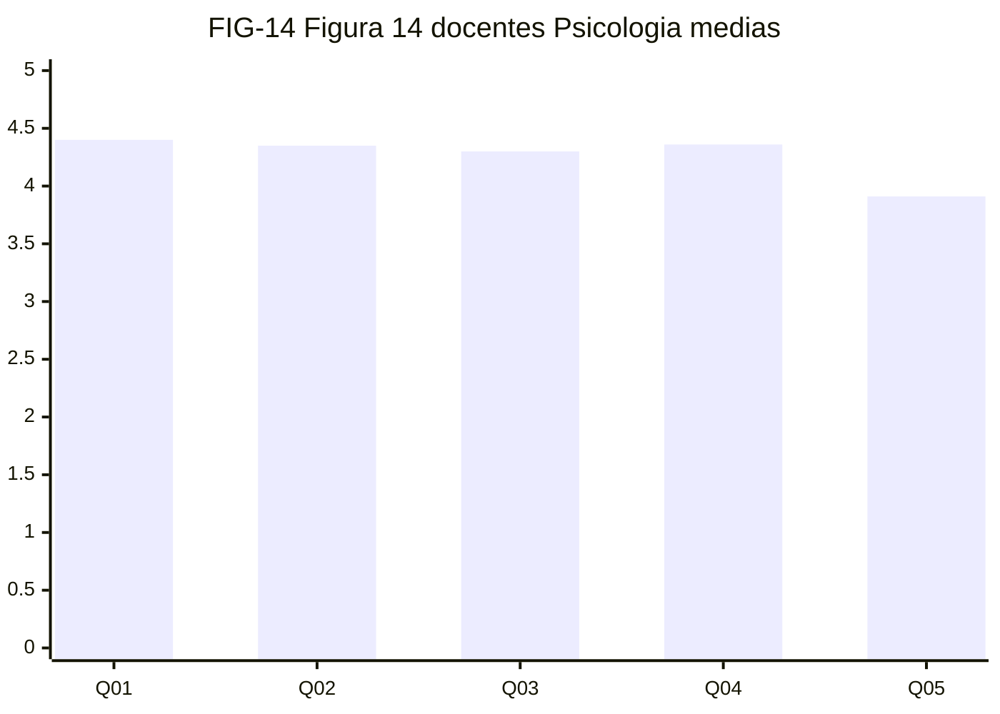
```mermaid
xychart-beta
    title "FIG-14 Figura 14 docentes Psicologia medias"
    x-axis [Q01, Q02, Q03, Q04, Q05]
    y-axis 0 --> 5
    bar [4.40, 4.35, 4.30, 4.36, 3.91]
```

### FIG-15. Figura 15, disciplinas de Psicologia (p. 19)

Título interno verbatim: Disciplinas. Legenda externa verbatim: Figura 15: Avaliação das disciplinas do curso de Psicologia. Tipo: barras 100 por cento, eixo X de 0 a 100 de 10 em 10. Médias: Q1 4,47; Q2 3,69; Q3 4,16; Q4 4,05. Percentuais ilegíveis. Texto fiel (com remissão ao ano letivo de 2015 e grafia Figura 15 sem dois pontos, defeitos preservados): MUITO BOM/BOM em Q1 e Q4; Q2 pede atenção.

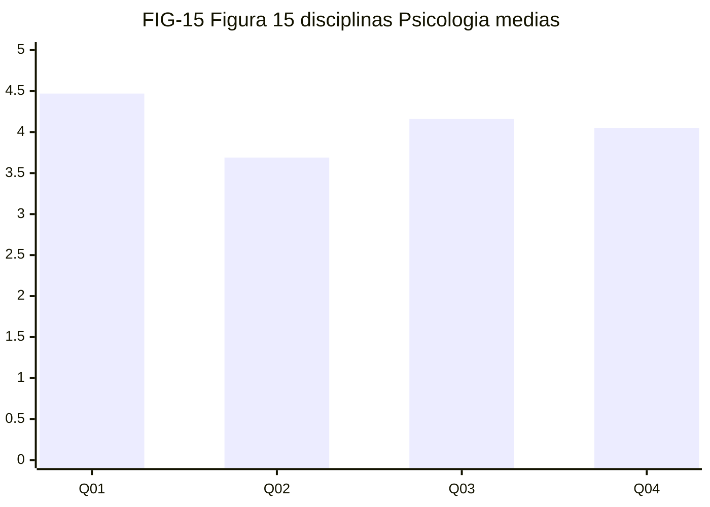
```mermaid
xychart-beta
    title "FIG-15 Figura 15 disciplinas Psicologia medias"
    x-axis [Q01, Q02, Q03, Q04]
    y-axis 0 --> 5
    bar [4.47, 3.69, 4.16, 4.05]
```

### FIG-16. Figura 16, infraestrutura pelos discentes (p. 27)

Título interno verbatim: Infraestrutura Física. Legenda externa verbatim: Figura 16: Avalialiação da infraestrutura do CPAR (grafia do original, defeito preservado). Tipo: barras 100 por cento, eixo X de 0 a 100 de 10 em 10. Questões: Q1 segurança; Q2 sanitários; Q3 acervo; Q4 limpeza; Q5 PNE; Q6 laboratórios; Q7 cantina; Q8 computacionais; Q9 salas; Q10 lazer; Q11 biblioteca. Médias: Q1 4,03; Q2 3,65; Q3 3,69; Q4 4,00; Q5 3,76; Q6 3,81; Q7 2,69; Q8 3,72; Q9 4,08; Q10 3,39; Q11 4,18 (com parêntese duplo no original, defeito preservado). Percentuais ilegíveis. Texto fiel: BOA no geral; Q7 e Q10 negativas com solução parcial; Q2, Q3, Q5 e Q7 pedem atenção.

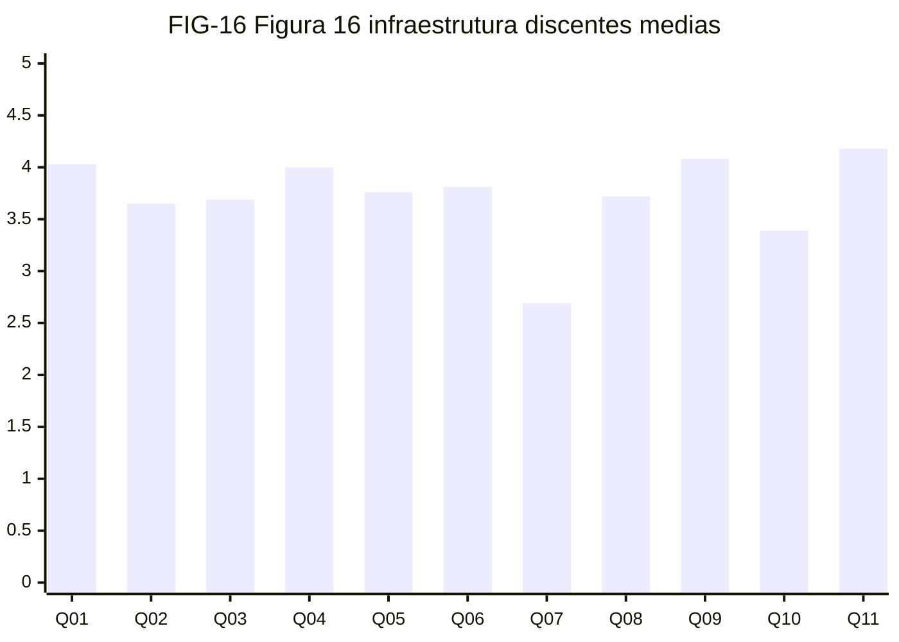
```mermaid
xychart-beta
    title "FIG-16 Figura 16 infraestrutura discentes medias"
    x-axis [Q01, Q02, Q03, Q04, Q05, Q06, Q07, Q08, Q09, Q10, Q11]
    y-axis 0 --> 5
    bar [4.03, 3.65, 3.69, 4.00, 3.76, 3.81, 2.69, 3.72, 4.08, 3.39, 4.18]
```

### FIG-17. Figura 17, pesquisa e extensão pelos discentes (p. 28)

Título interno verbatim: Pesquisa e Extensão. Legenda externa verbatim: Figura 17: Avaliação das atividades de pesquisa e extensão do CPAR (com erro Avalialiação no original em figura correlata, aqui grafia simples, ver defeitos). Tipo: barras 100 por cento, eixo X de 0 a 100 de 10 em 10. Questões: Q1 pesquisa; Q2 extensão; Q3 qualidade; Q4 eventos. Médias: Q1 3,56; Q2 3,51; Q3 3,77; Q4 3,54. Percentuais ilegíveis. Texto fiel: satisfatórios, com atenção a Q1, Q2 e Q4.

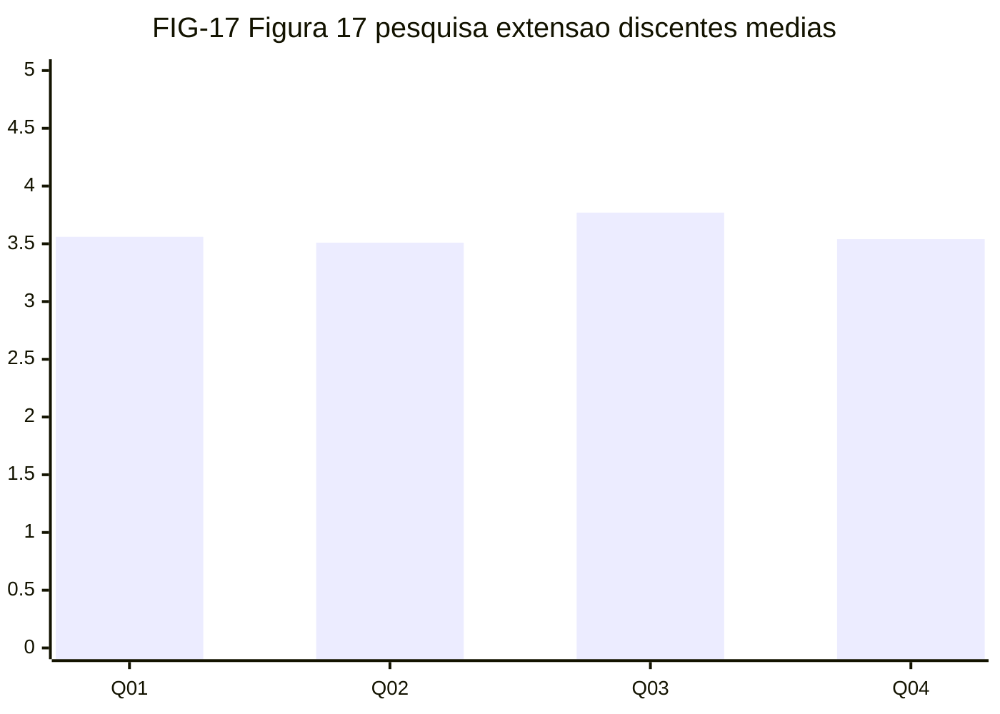
```mermaid
xychart-beta
    title "FIG-17 Figura 17 pesquisa extensao discentes medias"
    x-axis [Q01, Q02, Q03, Q04]
    y-axis 0 --> 5
    bar [3.56, 3.51, 3.77, 3.54]
```

### FIG-18. Figura 18, atendimento pelos discentes (p. 28)

Título interno verbatim: Políticas de Atendimento Discente. Legenda externa verbatim: Figura 18: Política de atendimento aos docente do CPAR (grafia do original, defeito preservado). Tipo: barras 100 por cento, eixo X de 0 a 100 de 10 em 10. Questões: Q1 extracurriculares; Q2 psicossocial. Médias: Q1 3,37; Q2 3,86. Percentuais ilegíveis. Texto fiel: Q2 BOM/MUITO BOM; Q1 RUIM/REGULAR, repete 2015.

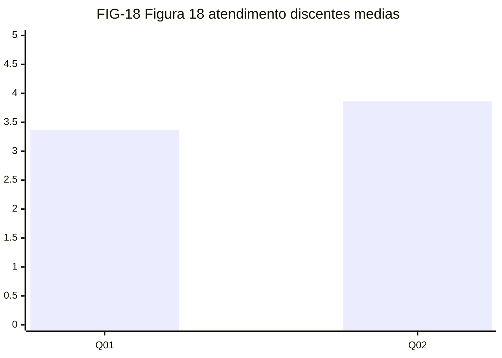
```mermaid
xychart-beta
    title "FIG-18 Figura 18 atendimento discentes medias"
    x-axis [Q01, Q02]
    y-axis 0 --> 5
    bar [3.37, 3.86]
```

### FIG-19. Figura 19, organização e gestão pelos discentes (p. 29)

Título interno verbatim: Organização e Gestão da Instituição. Legenda externa verbatim: Figura 19: Avaliação da organização e gestão de instituição. Tipo: barras 100 por cento, eixo X de 0 a 100 de 10 em 10. Questões: Q1 DCE; Q2 técnicos; Q3 decisórios; Q4 melhorias. Médias: Q1 3,67; Q2 4,18; Q3 3,62; Q4 3,55. Percentuais ilegíveis. Texto fiel: técnicos e participação satisfatórios; Q1, Q3 e Q4 pedem atenção; ponderação do bloco não concluído.

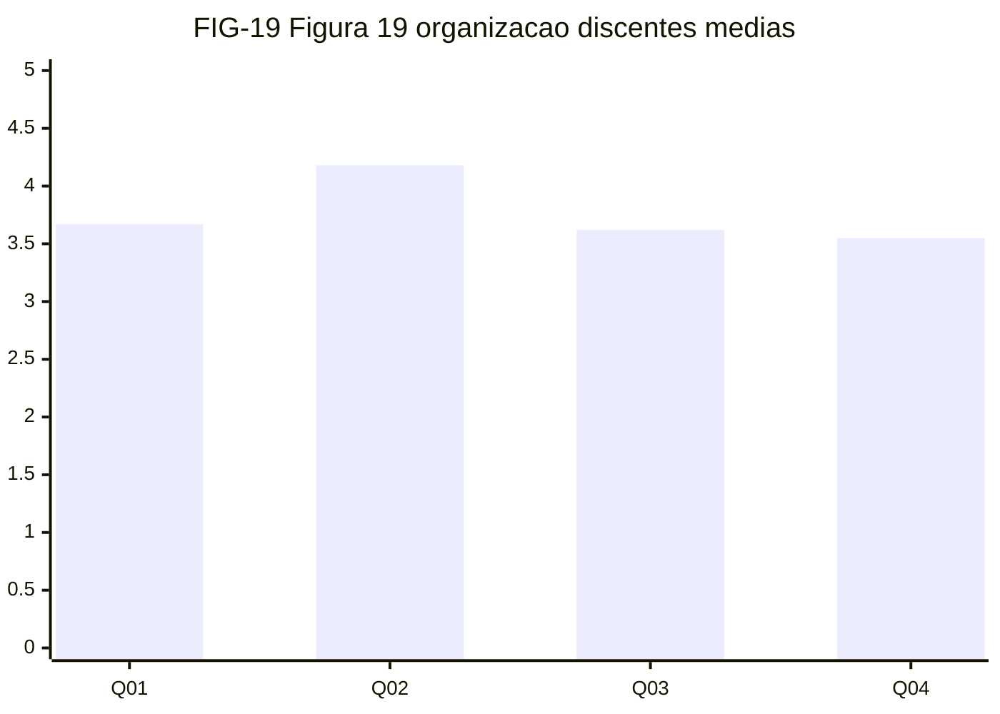
```mermaid
xychart-beta
    title "FIG-19 Figura 19 organizacao discentes medias"
    x-axis [Q01, Q02, Q03, Q04]
    y-axis 0 --> 5
    bar [3.67, 4.18, 3.62, 3.55]
```

### FIG-20. Figura 20, comunicação pelos discentes (p. 30)

Título interno verbatim: Comunicação com a Sociedade. Legenda externa verbatim: Figura 20: Comunicação com a sociedade. Tipo: barras 100 por cento, eixo X de 0 a 100 de 10 em 10. Questões: Q1 divulgação; Q2 ouvidoria; Q3 site UFMS; Q4 site da unidade. Médias: Q1 3,64; Q2 3,64; Q3 3,97; Q4 3,95. Percentuais ilegíveis. Texto fiel: BOA/MUITO BOA, com Q1 e Q2 pedindo observação.

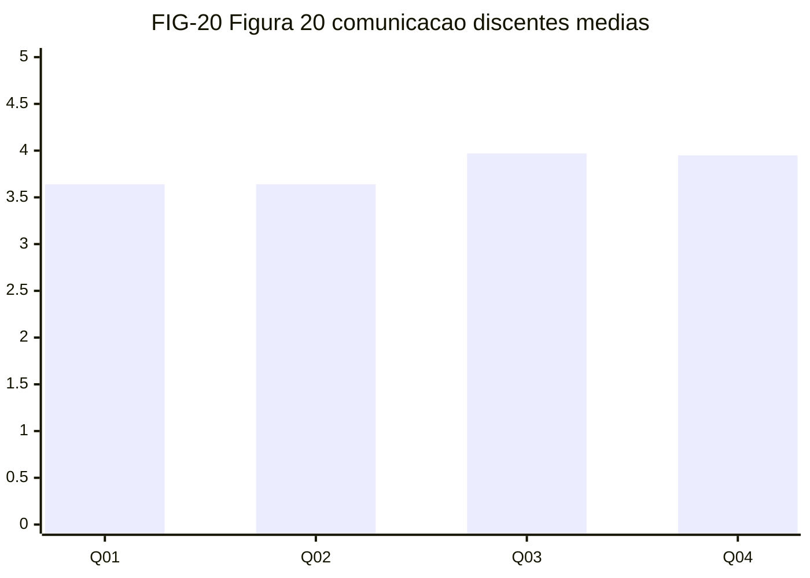
```mermaid
xychart-beta
    title "FIG-20 Figura 20 comunicacao discentes medias"
    x-axis [Q01, Q02, Q03, Q04]
    y-axis 0 --> 5
    bar [3.64, 3.64, 3.97, 3.95]
```

### FIG-21. Figura 21, unidade pelos docentes (p. 31)

Título interno verbatim: Unidade setorial. Legenda externa verbatim: Figura 21: Avaliação do CPAR pelos docentes. Tipo: barras 100 por cento, eixo X em 0, 25, 50, 75 e 100. Questões: Q1 biblioteca; Q2 satisfação; Q3 técnicos; Q4 site. Médias: Q1 4,13; Q2 4,61; Q3 4,78; Q4 4,61. Percentuais ilegíveis. Texto fiel: bem avaliada; biblioteca melhorou ante 2015.

```mermaid
xychart-beta
    title "FIG-21 Figura 21 unidade docentes medias"
    x-axis [Q01, Q02, Q03, Q04]
    y-axis 0 --> 5
    bar [4.13, 4.61, 4.78, 4.61]
```

### FIG-22. Figura 22, direção pelos docentes (p. 32)

Título interno verbatim: Direção. Legenda externa verbatim: Figura 22: Avaliação da direção do CPAR pelos docentes. Tipo: barras 100 por cento, eixo X em 0, 25, 50, 75 e 100. Questões: Q1 acesso; Q2 agilidade; Q3 soluções; Q4 integração; Q5 comunicação; Q6 transparência. Médias: Q1 4,91; Q2 4,83; Q3 4,83; Q4 4,41; Q5 4,57; Q6 4,70. Percentuais ilegíveis. Texto fiel: satisfatória, destaque ao acesso.

```mermaid
xychart-beta
    title "FIG-22 Figura 22 direcao docentes medias"
    x-axis [Q01, Q02, Q03, Q04, Q05, Q06]
    y-axis 0 --> 5
    bar [4.91, 4.83, 4.83, 4.41, 4.57, 4.70]
```

### FIG-23. Figura 23, condições de oferecimento pelos docentes (p. 32 a 33)

Título interno verbatim: Condições de oferecimento do curso. Legenda externa verbatim: Figura 23: Avaliação das condições de oferecimentos dos cursos do CPAR pelos docentes (plural do original, defeito preservado). Tipo: barras 100 por cento, eixo X em 0, 25, 50, 75 e 100. Questões: Q1 espaço; Q2 laboratórios; Q3 equipamentos; Q4 apoio; Q5 colegiado/NDE; Q6 matriz; Q7 PNE. Médias: Q1 4,61; Q2 4,27; Q3 4,13; Q4 4,43; Q5 4,43; Q6 4,35; Q7 4,35. Percentuais ilegíveis. Texto fiel: MUITO BOM/BOM em Q1, Q4, Q5 e Q6; melhora em Q2, Q3 e Q7.

```mermaid
xychart-beta
    title "FIG-23 Figura 23 condicoes docentes medias"
    x-axis [Q01, Q02, Q03, Q04, Q05, Q06, Q07]
    y-axis 0 --> 5
    bar [4.61, 4.27, 4.13, 4.43, 4.43, 4.35, 4.35]
```

### FIG-24. Figura 24, coordenadores pelos docentes (p. 33)

Título interno verbatim: Coordenação. Legenda externa verbatim: Figura 24: Avaliação dos coordenadores dos cursos do CPAR. Tipo: barras 100 por cento, eixo X em 0, 25, 50, 75 e 100. Questões: Q1 relacionamento; Q2 integração; Q3 disponibilidade; Q4 extensão; Q5 integração docente; Q6 colegiado/NDE; Q7 acesso; Q8 transparência. Médias: Q1 4,35; Q2 4,50; Q3 4,48; Q4 4,38; Q5 4,38; Q6 4,52; Q7 4,39; Q8 4,59. Percentuais ilegíveis. Texto fiel: muito bem avaliadas.

```mermaid
xychart-beta
    title "FIG-24 Figura 24 coordenadores docentes medias"
    x-axis [Q01, Q02, Q03, Q04, Q05, Q06, Q07, Q08]
    y-axis 0 --> 5
    bar [4.35, 4.50, 4.48, 4.38, 4.38, 4.52, 4.39, 4.59]
```

### FIG-25. Figura 25, pesquisa e extensão pelos docentes (p. 34)

Título interno verbatim: Pesquisa e Extensão. Legenda externa verbatim: Figura 25: Avaliação das atividades de pesquisa e extensão do CPAR. Tipo: barras 100 por cento, eixo X em 0, 25, 50, 75 e 100. Questões: Q1 integração; Q2 apoio; Q3 infraestrutura. Médias: Q1 3,73; Q2 3,70; Q3 3,52. Percentuais ilegíveis. Texto fiel: satisfatórios, com demanda de integração, apoio e infraestrutura.

```mermaid
xychart-beta
    title "FIG-25 Figura 25 pesquisa docentes medias"
    x-axis [Q01, Q02, Q03]
    y-axis 0 --> 5
    bar [3.73, 3.70, 3.52]
```

### FIG-26. Figura 26, autoavaliação dos docentes (p. 34)

Título interno verbatim: Autoavaliação. Legenda externa verbatim: Figura 26: Autoavaliação dos docentes do CPAR. Tipo: barras 100 por cento, eixo X em 0, 25, 50, 75 e 100. Questões: Q1 documentos UFMS; Q2 documentos do curso. Médias: Q1 4,04; Q2 4,26. Percentuais ilegíveis. Texto fiel: satisfatórios; Q1 melhorou ante 2015.

```mermaid
xychart-beta
    title "FIG-26 Figura 26 autoavaliacao docentes medias"
    x-axis [Q01, Q02]
    y-axis 0 --> 5
    bar [4.04, 4.26]
```

### FIG-27. Figura 27, questões gerais pelos coordenadores (p. 35)

Título interno verbatim: Questões gerais. Legenda externa verbatim: Figura 27: Questões gerais sobre a CPAR (artigo do original, defeito preservado). Tipo: barras 100 por cento, eixo X em 0, 25, 50, 75 e 100. Questões: Q1 NDE; Q2 docentes; Q3 PPC; Q4 PNE. Médias: Q1 4,00; Q2 5,00; Q3 4,00; Q4 4,00. Percentuais ilegíveis. Texto fiel: satisfatórios.

```mermaid
xychart-beta
    title "FIG-27 Figura 27 gerais coordenadores medias"
    x-axis [Q01, Q02, Q03, Q04]
    y-axis 0 --> 5
    bar [4.00, 5.00, 4.00, 4.00]
```

### FIG-28. Figura 28, organização pelos coordenadores (p. 35 a 36)

Título interno verbatim: Organização e gestão da unidade setorial. Legenda externa verbatim: Figura 28: Avaliação da organização e gestão do CPAR pelos coordenadores. Tipo: barras 100 por cento, eixo X em 0, 25, 50, 75 e 100. Questões: Q1 treinamento; Q2 SECAC; Q3 COAC/SAP. Médias: Q1 4,00; Q2 4,00; Q3 4,00. Percentuais ilegíveis. Texto fiel: satisfeitos.

```mermaid
xychart-beta
    title "FIG-28 Figura 28 organizacao coordenadores medias"
    x-axis [Q01, Q02, Q03]
    y-axis 0 --> 5
    bar [4.00, 4.00, 4.00]
```

### FIG-29. Figura 29, infraestrutura pelos coordenadores (p. 36)

Título interno verbatim: Infraestrutura. Legenda externa verbatim: Figura 29: Avaliação da infraestrutura do CPAR pelos coordenadores. Tipo: barras 100 por cento, eixo X em 0, 25, 50, 75 e 100. Questões: Q1 espaço; Q2 laboratórios; Q3 equipamentos; Q4 apoio. Médias: Q1 5,00; Q2 5,00; Q3 5,00; Q4 5,00. Percentuais ilegíveis. Texto fiel: satisfatórias.

```mermaid
xychart-beta
    title "FIG-29 Figura 29 infraestrutura coordenadores medias"
    x-axis [Q01, Q02, Q03, Q04]
    y-axis 0 --> 5
    bar [5.00, 5.00, 5.00, 5.00]
```

### FIG-30. Figura 30, autoavaliação dos coordenadores (p. 36)

Título interno verbatim: Autoavaliação. Legenda externa verbatim: Figura 30: Autoavaliação dos coordenadores de curso do CPAR. Tipo: barras 100 por cento, eixo X em 0, 25, 50, 75 e 100. Questões: Q1 documentos UFMS; Q2 documentos do curso. Médias: Q1 4,00; Q2 4,00. Percentuais ilegíveis. Texto fiel: satisfatórios.

```mermaid
xychart-beta
    title "FIG-30 Figura 30 autoavaliacao coordenadores medias"
    x-axis [Q01, Q02]
    y-axis 0 --> 5
    bar [4.00, 4.00]
```

### FIG-31. Figura 31, missão e perfil pelos técnicos (p. 37)

Título interno verbatim: Missão e perfil. Legenda externa verbatim: Figura 31: Avaliação da missão e perfil da instituição. Tipo: barras 100 por cento, eixo X em 0, 25, 50, 75 e 100. Questões: Q1 PDI. Médias: Q1 4,54. Percentuais ilegíveis. Texto fiel: MUITO BOA; subiu de 3,87 em 2015.

```mermaid
xychart-beta
    title "FIG-31 Figura 31 missao tecnicos medias"
    x-axis [Q01]
    y-axis 0 --> 5
    bar [4.54]
```

### FIG-32. Figura 32, políticas institucionais pelos técnicos (p. 38)

Título interno verbatim: Políticas institucionais. Legenda externa verbatim: Figura 32: Avaliação das políticas institucionais. Tipo: barras 100 por cento, eixo X em 0, 25, 50, 75 e 100. Questões: Q1 técnicos/professores; Q2 técnicos/alunos; Q3 pesquisa; Q4 extensão; Q5 problemas. Médias: Q1 3,85; Q2 4,08; Q3 2,83; Q4 3,17; Q5 4,46. Percentuais ilegíveis. Texto fiel: Q2 e Q5 satisfatórias; Q1, Q3 e Q4 pedem atenção.

```mermaid
xychart-beta
    title "FIG-32 Figura 32 politicas tecnicos medias"
    x-axis [Q01, Q02, Q03, Q04, Q05]
    y-axis 0 --> 5
    bar [3.85, 4.08, 2.83, 3.17, 4.46]
```

### FIG-33. Figura 33, responsabilidade social pelos técnicos (p. 38)

Título interno verbatim: Responsabilidade social da UFMS. Legenda externa verbatim: Figura 33: Avaliação da responsabilidade social da unidade setorial. Tipo: barras 100 por cento, eixo X em 0, 25, 50, 75 e 100. Questões: Q1 inclusão; Q2 integração. Médias: Q1 4,31; Q2 4,15. Percentuais ilegíveis. Texto fiel: maior parte das expectativas; subiu de 3,93 e 3,67.

```mermaid
xychart-beta
    title "FIG-33 Figura 33 responsabilidade tecnicos medias"
    x-axis [Q01, Q02]
    y-axis 0 --> 5
    bar [4.31, 4.15]
```

### FIG-34. Figura 34, comunicação pelos técnicos (p. 39)

Título interno verbatim: Comunicação institucional. Legenda externa verbatim: Figura 34: Avaliação da comunicação institucional. Tipo: barras 100 por cento, eixo X em 0, 25, 50, 75 e 100. Questões: Q1 coordenadoria; Q2 portal; Q3 boletim; Q4 telefonia; Q5 e-mail; Q6 internas; Q7 ouvidoria. Médias: Q1 3,92; Q2 4,23; Q3 4,46; Q4 3,69; Q5 3,46; Q6 4,00; Q7 3,92. Percentuais ilegíveis. Texto fiel: telefonia e e-mail REGULARES; coordenadoria, portal, internas e ouvidoria BOAS; boletim MUITO BOM; e-mail caiu de 3,80 e ouvidoria de 4,07.

```mermaid
xychart-beta
    title "FIG-34 Figura 34 comunicacao tecnicos medias"
    x-axis [Q01, Q02, Q03, Q04, Q05, Q06, Q07]
    y-axis 0 --> 5
    bar [3.92, 4.23, 4.46, 3.69, 3.46, 4.00, 3.92]
```

### FIG-35. Figura 35, pessoal pelos técnicos (p. 39 a 40)

Título interno verbatim: Políticas de Pessoal. Legenda externa verbatim: Figura 35: Avaliação das políticas de pessoal. Tipo: barras 100 por cento, eixo X em 0, 25, 50, 75 e 100. Questões: Q1 levantamento; Q2 capacitação; Q3 eventos; Q4 qualificação; Q5 saúde; Q6 desempenho; Q7 carreira; Q8 satisfação; Q9 chefia. Médias: Q1 3,15; Q2 3,00; Q3 3,62; Q4 3,62; Q5 3,54; Q6 3,77; Q7 3,62; Q8 4,23; Q9 4,62. Percentuais ilegíveis. Texto fiel: só Q9 plena; Q3 a Q8 bons; Q1 e Q2 regulares.

```mermaid
xychart-beta
    title "FIG-35 Figura 35 pessoal tecnicos medias"
    x-axis [Q01, Q02, Q03, Q04, Q05, Q06, Q07, Q08, Q09]
    y-axis 0 --> 5
    bar [3.15, 3.00, 3.62, 3.62, 3.54, 3.77, 3.62, 4.23, 4.62]
```

### FIG-36. Figura 36, organização pelos técnicos (p. 40)

Título interno verbatim: Organização e gestão. Legenda externa verbatim: Figura 36: Avaliação da organização e gestão dos órgãos/setores institucionais. Tipo: barras 100 por cento, eixo X em 0, 25, 50, 75 e 100. Questões: Q1 PRAD; Q2 PROINFRA; Q3 PROPP; Q4 PROGEP; Q5 PREAE; Q6 PREG; Q7 PROPLAN; Q8 NTI; Q9 direção; Q10 coordenação administrativa. Médias: Q1 4,27; Q2 4,36; Q3 3,92; Q4 4,25; Q5 4,17; Q6 4,17; Q7 4,18; Q8 4,38; Q9 4,77; Q10 4,50. Percentuais ilegíveis. Texto fiel: NTI, direção e coordenação muito bons; pró-reitorias satisfatórias.

```mermaid
xychart-beta
    title "FIG-36 Figura 36 organizacao tecnicos medias"
    x-axis [Q01, Q02, Q03, Q04, Q05, Q06, Q07, Q08, Q09, Q10]
    y-axis 0 --> 5
    bar [4.27, 4.36, 3.92, 4.25, 4.17, 4.17, 4.18, 4.38, 4.77, 4.50]
```

### FIG-37. Figura 37, infraestrutura pelos técnicos (p. 41)

Título interno verbatim: Infraestrutura. Legenda externa verbatim: Figura 37: Avaliação da infraestrutura da unidade. Tipo: barras 100 por cento, eixo X em 0, 25, 50, 75 e 100. Questões: Q1 espaço; Q2 estacionamento; Q3 limpeza; Q4 coleta; Q5 acessibilidade; Q6 internet/telefonia; Q7 uso econômico; Q8 material permanente; Q9 manutenção de equipamentos; Q10 manutenção geral; Q11 segurança. Médias: Q1 4,15; Q2 4,77; Q3 4,23; Q4 4,23; Q5 4,00; Q6 3,62; Q7 3,85; Q8 4,06; Q9 4,00; Q10 4,08; Q11 4,08. Percentuais ilegíveis. Texto fiel: estacionamento MUITO BOM (subiu de 1,73 por obras); demais bons ou satisfatórios.

```mermaid
xychart-beta
    title "FIG-37 Figura 37 infraestrutura tecnicos medias"
    x-axis [Q01, Q02, Q03, Q04, Q05, Q06, Q07, Q08, Q09, Q10, Q11]
    y-axis 0 --> 5
    bar [4.15, 4.77, 4.23, 4.23, 4.00, 3.62, 3.85, 4.06, 4.00, 4.08, 4.08]
```

### FIG-38. Figura 38, processo de avaliação pelos técnicos (p. 41 a 42)

Título interno verbatim: Avaliação. Legenda externa verbatim: Figura 38: Avaliação do processo de Avaliação Institucional. Tipo: barras 100 por cento, eixo X em 0, 25, 50, 75 e 100. Questões: Q1 ações baseadas na autoavaliação; Q2 participação; Q3 planejamento e PDI; Q4 CPA local. Médias: Q1 3,83; Q2 3,92; Q3 4,00; Q4 4,42. Percentuais ilegíveis. Texto fiel (p. 42): todos satisfatórios e melhores que 2015.

```mermaid
xychart-beta
    title "FIG-38 Figura 38 processo tecnicos medias"
    x-axis [Q01, Q02, Q03, Q04]
    y-axis 0 --> 5
    bar [3.83, 3.92, 4.00, 4.42]
```

### FIG-39. Figura 39, sustentabilidade pelos técnicos (p. 42)

Título interno verbatim: Sustentabilidade financeira. Legenda externa verbatim: Figura 39: Avaliação da sustentabilidade financeira. Tipo: barras 100 por cento, eixo X em 0, 25, 50, 75 e 100. Questões: Q1 acompanhamento; Q2 adequação; Q3 uso racional. Médias: Q1 4,08; Q2 3,85; Q3 4,08. Percentuais ilegíveis. Texto fiel: BOA, em torno de 4,0, acima da anterior.

```mermaid
xychart-beta
    title "FIG-39 Figura 39 sustentabilidade tecnicos medias"
    x-axis [Q01, Q02, Q03]
    y-axis 0 --> 5
    bar [4.08, 3.85, 4.08]
```

---

## 12. Lacunas e defeitos declarados desta conversão

Cobertura integral das 40 figuras (FIG-00 a FIG-39) com médias transcritas da camada de texto e conferidas por visão. Percentuais por categoria ilegíveis em todas as Figuras 1 a 39 (nenhum impresso nas barras, só cores). Corpo docente de Psicologia com soma parcial no original (7 doutores e 5 mestres ou doutorandos em 13 efetivos). Pbext sem ano nos períodos. Referências ausentes no original. Diplomados por ano ausentes neste ano. Auxílios por curso ausentes neste ano (só agregado de apoio estudantil). Colegiado e NDE sem contagens tabuladas. In loco sem menção. Guia do Estudante ausente em 2016 (só ENADE e CPC). Defeitos preservados: Geraldinho com o segundo h no nome (p. 2); introdução com ano de 2015 (p. 5); 66,7,5 por cento (p. 6); 91,46 ,76 por cento (p. 9); soma de 105,59 por cento na Q6 de Administração (p. 9); remissão ao ano letivo de 2015 nas Figuras 10 e 15; Fig.1 onde o contexto é Fig. 11; percentuais de Q6/Q7 de Psicologia idênticos aos de Matemática; Q5 da Figura 1 com zero excedente 3,830; parêntese duplo na Q11 da Figura 16; Avalialiação com duplo li nas Figuras 16 e 17; aos docente na Figura 18; sobre a CPAR na Figura 27; oferecimentos no plural na Figura 23; 031/12/2016 no Paext; código espúrio 23ewd (p. 26). Nenhum valor estimado. Questões discursivas agregadas sem transcrição individual. Nomes apenas em composição, cargos e autoria de projetos.

## 13. Metadados

- **Citação (ABNT)**: UNIVERSIDADE FEDERAL DE MATO GROSSO DO SUL. Câmpus de Paranaíba. Comissão Setorial de Avaliação. Autoavaliação setorial 2016. Paranaíba: CPAR/UFMS, 2017.
- **Correlatos**: `RSA_2016_CPAR.md` (análise); Relatórios Setoriais 2015 e 2017; RAAI 2016 (lacuna preenchida por este setorial).
- **Vinculação**: Lei n. 10.861/2004 (SINAES); PDI 2015-2019; IS CPAR n. 21/2017.
- **Fontes de dados citadas no original**: googledoc e e-mail (direção, coordenadores, docentes), SISCAD (discentes), Propp (pesquisa e IC), Proece (extensão), ENADE/CPC (avaliação externa).
