# FONTE PRIMÁRIA ESTRUTURADA — Autoavaliação Setorial 2017-1 do CPAR/UFMS

> **Arquivo fonte**: `Relatorio_CSA_CPAR_2017.pdf` (cópia de trabalho em `workspace/fontes_pdfs/`).
> **Origem pública**: `https://cpar.ufms.br/avaliacao-institucional/` (sem bloqueio de download; URL original SEAVI `https://seavi.ufms.br/files/2017/12/CPAR-2017.pdf`).
> **Documento**: AUTOAVALIAÇÃO SETORIAL 2017-1, CÂMPUS DE PARANAÍBA (CPAR/UFMS), outubro de 2017. Título do PDF: Autoavaliação setorial 2017-1 CPAr. Autor: Microsoft Office User. Criador: Microsoft Word 2013. Criação: 24/11/2017. 55 páginas.
> **Método de conversão**: download direto + extração de texto por página (pymupdf, 96.752 caracteres, `workspace/fonte2017_texto.txt`) + inventário de imagens embutidas + renderização das páginas com gráficos em PNG (`workspace/fontes_imgs/fonte2017/`) + leitura por visão de cada gráfico + transcrição de tabelas.
> **Data da conversão**: 08 set 2026. **Cobertura**: integral do texto (páginas 1 a 55), 7 tabelas, 55 figuras com médias lidas por visão onde impressas.
> **Relação com a série analítica**: este arquivo é a fonte primária estruturada; o arquivo analítico `RSA_2017_CPAR.md` permanece preservado e tem função diferente.
> **Convenção de imagens**: as Figuras 1 a 51 são barras horizontais empilhadas de 100 por cento com eixo X percentual e SEM percentuais numéricos impressos nas barras, apenas cores. Cada figura recebe bloco de contexto (número, título verbatim, página, tipo, escala, legenda das questões, médias lidas por visão, declaração de percentuais ilegíveis) + diagrama mermaid das médias. Nenhum percentual por categoria foi estimado. As Figuras 52 a 55 (direção) são barras horizontais simples azuis com eixo de 0 a 6, SEM médias impressas e SEM legenda, por isso recebem descrição em português sem mermaid e sem valores. A Figura 00 é a capa com logotipo, com descrição em português sem mermaid.

## Sumário do documento fonte

1 INTRODUÇÃO (p. 5). 2 UNIDADE SETORIAL (p. 6): 2.1 Histórico; 2.2 Planejamento de desenvolvimento da unidade. 3 CURSOS DE GRADUAÇÃO (p. 7): 3.1 Bacharelado em Administração (3.1.1 Indicadores; 3.1.2 Potencialidades e fragilidades; 3.1.3 Avaliação externa; 3.1.1 Análise dos resultados das avaliações anteriores; 3.1.2 Avaliação interna pelos discentes, Figuras 1 a 10); 3.2 Licenciatura em Matemática (3.2.1 a 3.2.5, Figuras 11 a 20); 3.3 Bacharelado em Psicologia (3.3.1 a 3.3.5, Figuras 21 a 30); 3.4 Avaliação interna feita pelos docentes (3.4.1 a 3.4.9, Figuras 31 a 38); 3.5 Avaliação interna realizada por coordenadores (3.5.1 a 3.5.5, Figuras 39 a 42); 3.6 Avaliação interna realizada por técnico-administrativos (3.6.1 a 3.6.10, Figuras 43 a 51); 3.7 Avaliação da direção (3.7.1.1 a 3.7.1.5, Figuras 52 a 55); 3.8 Considerações da comissão setorial (só no sumário). 4 PESQUISA E PÓS-GRADUAÇÃO (p. 49): 4.1 Pós-graduação; 4.2 Pesquisa (13 projetos). 5 EXTENSÃO E APOIO AO DISCENTE (p. 52): 5.1 Apoio estudantil; 5.2 Relação de projetos de extensão (9 com fomento + 3 sem ônus). 6 AVALIAÇÃO DA SOCIEDADE CIVIL ORGANIZADA (p. 54, Guia do Estudante). 7 CONSIDERAÇÕES FINAIS (p. 55).

> **Defeito preservado**: o sumário lista 3.1.4 e 3.8 com a marca Erro! Indicador não definido. A seção 3.8 não existe no corpo. A numeração das subseções de Administração repete 3.1.1 e 3.1.2 após 3.1.3. Divergências mantidas sem correção.

## Lista de Tabelas do documento

Tabela 1: Titulação e regime de trabalho dos docentes do curso de Administração (p. 7). Tabela 2: Indicadores de fluxo acadêmico do Curso de Administração em 2017 (p. 7 a 8). Tabela 3: Titulação e regime de trabalho dos docentes do curso de Matemática (p. 14 a 15). Tabela 4: Indicadores de fluxo acadêmico do Curso de Matemática em 2017 (p. 15). Tabela 5: Titulação e regime de trabalho dos docentes do curso de Psicologia (p. 21 a 22). Tabela 6: Indicadores de fluxo acadêmico do Curso Psicologia em 2017 (p. 22). Tabela 7: Perfil do corpo técnico administrativo do Câmpus de Paranaíba (p. 36).

## Lista de Figuras do documento

Figuras 1 a 10: avaliação discente de Administração (p. 9 a 14). Figuras 11 a 20: avaliação discente de Matemática (p. 17 a 21). Figuras 21 a 30: avaliação discente de Psicologia (p. 23 a 27). Figuras 31 a 38: avaliação feita pelos docentes (p. 28 a 32). Figuras 39 a 42: avaliação feita pelos coordenadores (p. 34 a 35). Figuras 43 a 51: avaliação feita pelos técnico-administrativos (p. 37 a 42). Figuras 52 a 55: avaliação feita pela direção (p. 43 a 47).

---

## 1. Rosto, capa e composição (páginas 1 a 4)

Página 1: capa com o texto OUTUBRO DE 2017, AUTOAVALIAÇÃO SETORIAL 2017-1 CÂMPUS DE PARANAÍBA (CPAR), faixa azul superior e inferior com o logotipo da UFMS (ver Apêndice, FIG-00). Páginas 2 a 3: sumário integral transcrito acima. Página 4: COMISSÃO SETORIAL CSA-CPAR, composição indicada pela Instrução de Serviço n. 95, de 8 de setembro de 2017. Docentes: Geraldino Carneiro de Araújo (Siape 25335850, presidente), Ana Cláudia dos Santos (Siape 1227780), Dalton de Sousa (Siape 16717206), Magno Pinheiro de Almeida (Siape 2903747), Tatiana Bertoldi Carlos (Siape 1672313). Técnico-administrativo: Leonardo Chaves de Carvalho (Siape 1731126). Discente: Luiz César Campos Domingues (RGA 2014.0901.001-5). Dirigente: Andréia Cristina Ribeiro.

## 2. Introdução (página 5, transcrição fiel condensada)

Relatório apresenta a autoavaliação do Câmpus de Paranaíba no ano de 2017-1, com objetivo de apontar aspectos relevantes da unidade e buscar o desenvolvimento integral e a melhoria constante dos processos educacionais e científicos. Participação do diretor, coordenadores e docentes por formulário eletrônico via googledoc, com coordenadores e direção em avaliação descritiva por e-mail, e discentes por questionário eletrônico no SISCAD. Conceitos: MUITO BOM (todas as expectativas atendidas), BOM (maior parte atendida), REGULAR (cerca da metade), RUIM (maior parte não atendida), MUITO RUIM (nenhuma atendida), NÃO SE APLICA (NA) OU NÃO OBSERVADO (NO) (sem oportunidade de avaliar). Para cada grupo de questões foi elaborado um gráfico com a média de 1 a 5 pontos (MUITO BOM 5, BOM 4, REGULAR 3, RUIM 2, MUITO RUIM 1; NA ou NO ignorado no cálculo). Os três segmentos também responderam questões abertas. Organização: Seção 2 unidade setorial; Seção 3 cursos de graduação; Seção 4 pesquisa e pós-graduação; Seção 5 extensão e apoio ao estudante; Seção 6 sociedade civil organizada; Seção 7 considerações.

## 3. Unidade setorial (página 6)

Histórico (condensado): criação do CPAR para o desenvolvimento social, cultural, científico e profissional da região do Bolsão e cidades fronteiriças de São Paulo, Goiás e Minas Gerais, com ensino público, gratuito e de qualidade. Registro no Processo 23104.004496/1988, autorização pela Resolução 107/CD de 15/06/1988. Criação pela Resolução Coun 10/2001 com Administração, Matemática e Psicologia. Em 2016 nova infraestrutura de biblioteca, cantina, salas de estudos, laboratórios, salas de professores e atendimentos de apoio para a permanência estudantil. Planejamento (condensado): previsão de Ciências Contábeis (bacharelado, 50 vagas, noturno) e Medicina Veterinária (bacharelado, 60 vagas, matutino e vespertino), constantes do PDI 2015-2019, realinhamento aprovado pela Resolução COUN 71 de 12/09/2017.

---

## 4. Curso de Bacharelado em Administração (páginas 7 a 14)

Ficha (p. 7): habilitação bacharelado; área Ciências Sociais Aplicadas; duração CFE mínimo 4 anos e máximo 6 anos; duração UFMS 4 anos; implantação 2001; autorização Resolução 206 de 13/07/2001; reconhecimento Portaria MEC 272 de 03/04/2017; turno noturno; 50 vagas; carga horária 3.014; coordenação Geraldino Carneiro de Araújo.

Tabela 1, Titulação e regime dos docentes de Administração, p. 7, fonte Coordenação de Curso: doutores 7 (DE 7, 77,8 por cento); mestres 1 (DE 1, 11,1 por cento); especialistas 1 (parcial 1, 11,1 por cento); total 9 (parcial 1, DE 8, 100 por cento); regime DE 88,9 por cento e parcial 11,1 por cento.

Tabela 2, Fluxo acadêmico de Administração em 2017, p. 7 a 8, fonte Siscad, Secac e Coordenação: vagas 50; ingressantes 20 (portadores de diploma e transferência voluntária); matriculados 161; trancamentos 3; desligamentos sem valor (traço); mobilidade interna sem valor (traço); mobilidade externa sem valor (traço); vagas ociosas sem valor (traço); concluintes 7. Maior reprovação em TCC II (80,0 por cento) e TCC III (66,7 por cento), atribuída à sobrecarga de atividades concentradas em 2017 para regularização do calendário.

Potencialidades (coordenador): futura titulação doutoral de todos os vinculados (viabiliza pós-graduação); mais projetos de ensino, pesquisa e extensão; suporte à abertura de Ciências Contábeis (mesma área CAPES) e afins; espaços de interação (biblioteca com mesas individuais e salas coletivas, praça de convivência, salas de professores); comprometimento com qualidade (ENADE 3, CPC 4, 4 estrelas no Guia). Fragilidades: evasão alta e baixa taxa de sucesso; pouco interesse em concluir no Câmpus (transferência e desistência); necessidade de nivelamento em escrita e matemática básica; quadro reduzido sem Direito, Contabilidade e Economia; necessidade de acervo e bolsas (IC, extensão, cultura, monitoria). Obras entregues no início de 2017: convivência, estacionamento, biblioteca, salas de professores e coordenação, cantina.

Avaliação externa: ENADE 2015 nota 3 e CPC nota 4; Guia do Estudante Editora Abril 4 estrelas em 2017. Análise das anteriores (seção numerada 3.1.1 no original, defeito preservado): apontamentos de 2016 em desenvolvimento para manter bons índices.

Avaliação interna pelos discentes (Figuras 1 a 10, p. 9 a 14): coordenação com médias acima de 4,00 (satisfatório); infraestrutura satisfatória com atenção à cantina (Q9); pesquisa e extensão satisfatórias com margem a melhoria; atendimento satisfatório; organização e gestão satisfatórias com destaque ao atendimento dos técnicos; comunicação com boas médias em torno de 4; responsabilidade social com bom resultado; docentes com todas as médias acima de 4; disciplinas satisfatórias acima de 4; autoavaliação satisfatória. Síntese (3.1.2.11): curso bem avaliado, praticamente todas as questões com média igual ou superior a 4.

## 5. Curso de Licenciatura em Matemática (páginas 14 a 21)

Ficha (p. 14): habilitação licenciatura; área Exatas; duração CFE mínimo 4 e máximo 6 anos; duração UFMS 6 anos; implantação 2001; autorização Resolução n. (não informado); reconhecimento Portaria SESU/MEC 1.009 de 29/11/2006 (DOU 230 de 01/12/2006) e renovação Portaria SERES/MEC 1.097 de 24/12/2015 (DOU 249 de 30/12/2015); turno noturno; 40 vagas; carga horária 2813; coordenação Sabrina Helena Bonfim.

Tabela 3, Titulação e regime dos docentes de Matemática, p. 14 a 15, fonte Coordenação: doutores 5 (DE 5, 83,3 por cento); mestres 1 (DE 1, 16,7 por cento); especialistas nenhum; total 6 (DE 6, 100 por cento); regime DE 100 por cento.

Tabela 4, Fluxo de Matemática em 2017, p. 15, fonte Siscad, Secac e Coordenação: vagas 40; ingressantes 44; matriculados 97; trancamentos 07; desligamentos 10; mobilidade interna 00; mobilidade externa 07; vagas ociosas sem valor (traço); concluintes com célula vazia (lacuna declarada). Maior reprovação em Fundamentos de Matemática Elementar I (90 por cento), no primeiro semestre, atribuída a dificuldades com conteúdos do ensino médio.

Potencialidades e fragilidades (texto da coordenação e docentes): corpo jovem com excelente formação e meta comum de fortalecer o curso; PIBID com inserção nas redes; acompanhamento à pós com IC e monitoria; formação para semipresencial com 20 por cento e resultado satisfatório; orientação ao uso de ensino, pesquisa, extensão, permanência e monitoria (voluntária e bolsista, PIBIC, 21 bolsistas PIBID em dois subprojetos, permanência); incentivo a eventos científico-acadêmicos e Semana da Matemática (nono ano, organizada pelos alunos com coordenação docente). Maior fragilidade: evasão ligada à dificuldade de permanência, parcialmente mitigada por monitorias, nivelamento, aulas de exercícios e horários flexíveis.

Avaliação externa: curso passou por avaliação externa em 2017 (sem detalhamento do ato no texto, lacuna declarada). Análise das anteriores: ações de 2016 cumpridas, com quase todo o efetivo doutor em 2017 para sustentar docência e pesquisa.

Avaliação interna pelos discentes (Figuras 11 a 20, p. 17 a 21): coordenação satisfatória; infraestrutura satisfatória com atenção à cantina (Q9); pesquisa e extensão satisfatórias com demanda por ações de melhoria; atendimento satisfatório; organização e gestão satisfatórias com médias próximas a 4; comunicação satisfatória próxima a 4; responsabilidade social satisfatória; docentes com boas médias acima de 4; disciplinas acima de 4; autoavaliação satisfatória. Síntese (3.2.5.11): curso satisfatório, maioria das questões com média igual ou superior a 4.

## 6. Curso de Bacharelado em Psicologia (páginas 21 a 27)

Ficha (p. 21): habilitação bacharel; área Pesquisa e Ensino; duração CFE 5 anos; duração UFMS 10 semestres; implantação 2001; autorização Resolução 10/Coun de 03/05/2001; reconhecimento Portaria MEC (sem número no texto, lacuna declarada); turno Tarde-Noite; 40 vagas; carga horária 4000; coordenação Ana Claudia dos Santos.

Tabela 5, Titulação e regime dos docentes de Psicologia, p. 21 a 22, fonte Coordenação (texto remete a tabela 3, defeito preservado): doutores 8 (DE 8, 57,1 por cento); mestres 6 (DE 6, 42,9 por cento); especialistas nenhum; total 14 (DE 14, 100 por cento); regime DE 100 por cento.

Tabela 6, Fluxo de Psicologia em 2017, p. 22, fonte Siscad, Secac e Coordenação: vagas 40; ingressantes 39; matriculados 165; trancamentos 0; desligamentos 0; mobilidade interna 3; mobilidade externa 16; vagas ociosas 1; concluintes com célula vazia (lacuna declarada). Maior reprovação em Métodos de Pesquisa em Psicologia I e II (primeiro e segundo semestres, sem percentual no texto), com dificuldades de leitura, projeto de pesquisa e organização acadêmica; proposta em elaboração de optativa de escrita e leitura acadêmica.

Potencialidade: titulação e experiência docente, estrutura do Câmpus e proximidade com discentes. Fragilidade: evasão por distância da família e necessidade financeira de permanência. Avaliação externa: CPC 2, que provocou reflexão docente, reuniões do NDE e releitura do PPC. Ações pós-2016: contratação para optativas como Libras e escrita e leitura (formação também em Letras); inclusão na matriz das optativas de Educação para as Relações Étnico Raciais, Direitos Humanos e Psicologia, e Natureza, Cultura e Sociedade.

Avaliação interna pelos discentes (Figuras 21 a 30, p. 23 a 27): coordenação satisfatória com necessidade de melhorar orientação a pesquisa e extensão (Q3 com 2,79); infraestrutura satisfatória com menor índice na cantina (Q9 com 3,20); pesquisa e extensão satisfatórias com atenção a oportunidades de pesquisa (Q1 com 3,20); atendimento com médias próximas a 3, com margem a melhoria; organização e gestão satisfatórias; comunicação satisfatória; responsabilidade social satisfatória (3,16 e 3,42); docentes com bons resultados próximos a 4; disciplinas satisfatórias próximas a 4; autoavaliação satisfatória. Síntese (3.3.5.11): curso bem avaliado de modo geral.

---

## 7. Avaliação interna feita pelos docentes (páginas 27 a 33)

Universo: 33 docentes no CPAR, 5 afastados para capacitação e 1 docente na direção; 27 responderam (totalidade dos elegíveis). Unidade (Figura 31): CPAR muito bem avaliado em satisfação, atendimento técnico e atuação docente. Direção (Figura 32): satisfatória, com destaque ao acesso à direção. Condições de oferecimento (Figura 33): maioria MUITO BOM ou BOM, com destaque às questões 5, 6, 8 e 9. Coordenação (Figura 34): muito bem avaliada. Pesquisa e extensão (Figura 35): satisfatórias em integração, apoio e infraestrutura, com atenção à infraestrutura. Autoavaliação (Figura 36): satisfatória no conhecimento dos documentos da UFMS e do curso. Organização e gestão (Figura 37): majoritariamente satisfatória, com atenção à participação em processos decisórios (menor média). Responsabilidade social (Figura 38): satisfatória, com necessidade de divulgar mais as atividades (Q3). Comentários agregados (3.4.9, sem transcrição individual): fragilidades (quadro enxuto sem áreas específicas; cursos isolados que dificultam grupos de pesquisa; acervo; quadra poliesportiva; base fraca dos ingressantes; poucas empresas para interação teoria e prática); potencialidades (efetivos majoritariamente doutores; produção técnico-científica; salas, Laboratório de Ensino de Matemática, Seção de Psicologia e Clínica Escola, Empresa Júnior, Laboratório de Informática, Biblioteca); observações (ouvir a base sobre mudanças; integrar o interior às ações e eventos culturais da capital; mais cursos em áreas distintas; quadra; comissões locais com pró-reitorias para inserção regional e inovação).

## 8. Avaliação interna realizada por coordenadores (páginas 33 a 35)

Gestão e oferecimento (Figura 39): satisfatórios em NDE, quantitativo e titulação docente, PPC e PNE. Organização e gestão (Figura 40): satisfeitos. Infraestrutura (Figura 41): satisfatória. Autoavaliação (Figura 42): satisfatória no conhecimento dos documentos da UFMS e do curso. Observações agregadas (3.5.5): necessidade de treinamento para a função (volume de normas) e maior participação das unidades nas decisões.

## 9. Avaliação interna realizada por técnico-administrativos (páginas 36 a 42)

Quadro: 14 servidores lotados em 2016 (1 afastada integral para doutorado por 3 anos; 2 parciais para mestrado em 20 horas, com conclusão no início de 2018); redistribuição de TAE ao IFSP Barretos em 08/2017; licença saúde e maternidade de uma servidora até 2018; redução de 15 (2015) para 14, com 12 efetivamente em serviço; concurso Edital PROGRAD 70/2017 com 4 vagas ao CPAR (TAE, Tradutor e Intérprete de Libras, assistente e auxiliar administrativo). Responderam 12 de 14 (85,71 por cento) a 52 questões em 9 blocos.

Tabela 7, Perfil do corpo técnico, p. 36, fonte Direção de Câmpus: fundamental 0; médio 0; graduados 5 (2 feminino 14,285 por cento, 3 masculino 21,43 por cento, total 35,715 por cento); especialistas 6 (2 feminino 14,285 por cento, 4 masculino 28,57 por cento, total 42,855 por cento); mestres 3 (3 feminino 21,43 por cento, total 21,43 por cento); doutores 0; total 7 feminino (50 por cento) e 7 masculino (50 por cento), 14 (100 por cento).

Missão e PDI (Figura 43): MUITO BOA (4,33), com leve queda ante 4,54 em 2015. Políticas institucionais (Figura 44): satisfatórias a integração com acadêmicos e a resolução de problemas; com atenção a integração com professores e participação em pesquisa e extensão. Responsabilidade social (Figura 45): atende à maior parte das expectativas (Q1 de 4,31 para 4,17; Q2 de 4,15 para 4,25). Comunicação (Figura 46): Telefonia menor (3,58), seguida da Secretaria de Comunicação (3,92); Portal, e-mail, internas e Ouvidoria com BOM; Boletim com MUITO BOM. Pessoal (Figura 47): só Q9 (chefia, 4,83) satisfatória plena; Q1, Q3 a Q8 regulares; Q2 (capacitação, 2,67) RUIM. Organização e gestão (Figura 48): Direção e Coordenação Administrativa MUITO BOAS; demais órgãos satisfatórios (bom a muito bom). Infraestrutura (Figura 49): estacionamento MUITO BOM (4,83; ante 1,73 em 2015 e 4,77 em 2016, por calçamento, pintura e urbanização); demais itens satisfatórios; internet e telefonia REGULAR (3,17, menor). Processo de avaliação (Figura 50): satisfatório. Sustentabilidade (Figura 51): BOA (em torno de 4,0). Discursiva agregada (3.6.10): fortes (contato com a direção, solução de problemas, clima interpessoal, espaço e manutenção); fracos (poucos cursos, sem assistente social na Secae, sem periódico interno, impossibilidade de técnico conduzir pesquisa, anfiteatro pequeno, sem área de esportes); sugestões (capacitação por setor, cursos na capital em 1 ou 2 dias, mais servidores, 30 horas, manutenção predial, espaço para crescer).

## 10. Avaliação da direção (páginas 42 a 48)

Qualidade UFMS (Figura 52): satisfatória, com atenção a biblioteca (Q7) e PNE (Q9). Biblioteca atende em espaço e informática com salas de grupo; acervo com preocupação aos PPCs mas sem recurso orçamentário para compra nos últimos dois anos, com expectativa na biblioteca virtual; problema técnico no portal sem assistência no Brasil, com sugestão de nova compra pela central; sugestão de visita da acessibilidade aos espaços. Gestão institucional (Figura 53): satisfatória; cursos atenderam à reestruturação dos PPCs pedida pelo MEC; demanda de efetivos em áreas específicas (exemplo Direito e Ciências Contábeis). Pesquisa e extensão (Figura 54): satisfatórias com margem a melhoria. Potencialidades: efetivo jovem de 28 docentes (2 vagas em concurso), 62 por cento doutores (16 de 26) e 31 por cento doutorandos (8 de 26), projeção de 92 por cento doutores em 36 meses; técnicos 15 todos graduados, com 1 afastamento a doutorado e 2 parciais a mestrado (mais 2 mestres e 1 doutor até 05/2018); comissões atuantes (CPA, CPAC, extensão, site, cultura, ética, acessibilidade); submissões a fomento externo; grupos com outras unidades e instituições; grupos de estudo; participação discente em eventos; proximidade das coordenações; estágios na Clínica Escola; PIBID com 21 bolsistas; Empresa Júnior; CAs atuantes. Fragilidades: espaço para laboratórios e diurnos; sem apoio PROPP a eventos (desmotiva jovens doutores e reduz editais); restrição a pós e diárias; sem fixação no interior (exonerações pós-doutorado; defasagem de doutores de 2016 a 2017); sem anfiteatro para 400 pessoas (demanda no PDI); condição socioeconômica e base fraca com SISU e mais afastados; sem transporte público ou escolar com insegurança e aluguéis distantes (reunião com prefeito sem solução orçamentária). Autoavaliação (Figura 55): satisfatória. Sugestões: fóruns por setor; fortalecer SECAE; força-tarefa federal por permanência e fixação; moradia, alimentação, cultura, lazer, esporte e quadras; espaços para movimento estudantil e EJ; ações conjuntas das pró-reitorias por índices; suporte aos campi do interior; visita da acessibilidade (Lei 13.409/2016).

## 11. Pesquisa e pós-graduação (páginas 49 a 51)

Pós: nenhum programa no CPAR; comissão de mestrado interdisciplinar com GEPeDES e I EnINTER; 5 docentes credenciados (2 no Profissional em Administração Pública ESAN, 1 no ProfMAT CPTL, 1 em Educação UPAR/UEMS, 1 em Psicologia Campo Grande). Pesquisa: 13 projetos em andamento em 2017 (fonte Propp). Item 1: A crise da psicologia da década de 1920 por Georges Politzer (Bruno Peixoto Carvalho, docente; Ciências Humanas, Psicologia, Fundamentos e Medidas, História, Teorias e Sistemas; vigência 05/09/2017 a 01/08/2018). Item 2: A crise da psicologia por Politzer e Vigotski, análise comparativa (Bruno Peixoto Carvalho; mesma subárea; 01/08/2017 a 31/07/2018). Item 3: História da matemática na formação inicial de professores nas federais brasileiras (Sabrina Helena Bonfim; Matemática, Exatas; 30/04/2017 a 30/04/2019). Item 4: Análise dos efeitos sob o estresse de protocolo de habilidades sociais em agentes comunitários de saúde (Vinicius Santos Ferreira; Psicologia, Tratamento e Prevenção, Atendimento Comunitário; 01/02/2015 a 01/08/2017). Item 5: Aplicações de estruturas algébricas em teoria de códigos (Raildo Santos de Lima; Matemática, Álgebra, Conjuntos, Exatas; 03/03/2017 a 03/03/2019). Item 6: Efeito da hiperforina em modelo animal de autismo por valproato pré-natal (Ana Luiza Bossolani Martins; Psicologia, Fisiológica, Psicobiologia; 26/07/2016 a 26/07/2018). Item 7: Geoestatística multivariada da dinâmica do carbono do solo no Cerrado agrícola (Elton Gean Araújo; Probabilidade e Estatística Aplicadas, Exatas; 01/11/2017 a 30/04/2019). Item 8: Gestão organizacional, RH, qualidade e sustentabilidade em organizações públicas e privadas (Wesley Ricardo de Souza Freitas; Administração de Empresas, RH; 01/08/2016 a 31/07/2017). Item 9: Green human resource management and green supply chain, evidências brasileiras (Adriano Alves Teixeira; Administração de Empresas, RH; 01/12/2016 a 01/08/2018). Item 10: Pegada de carbono na cadeia de suprimentos da carne bovina de MS (Thiago José Florindo; Administração; 10/12/2016 a 10/12/2018). Item 11: Olhar histórico-matemático da inserção de geometria analítica e cálculo vetorial no Brasil (Sabrina Helena Bonfim; Matemática, Análise, Exatas; 13/01/2016 a 13/12/2017). Item 12: Coco do babaçu em energia na cadeia das microrregiões de Jauru e Alto Pantanal em MT (Geraldino Carneiro de Araújo; Administração de Setores Específicos; 02/05/2017 a 31/12/2018). Item 13: Violência escolar, indicadores para prevenção (Juliana Aparecida Matias Zechi; Educação; 01/02/2017 a 30/12/2018).

## 12. Extensão, sociedade civil e considerações (páginas 52 a 55)

Apoio estudantil: em 2017, por edital, auxílio alimentação e bolsa permanência, auxílios emergenciais e incentivo à participação em eventos (IPEV), sem quantitativos no texto (lacuna declarada). Extensão com fomento interno (PAEXT, PROFE e Mais Cultura 2017 Interior, fonte Proece): 9 ações. Item 1: Psicologia no trabalho familiar-comunitário em rede em Paranaíba (Renata Bellenzani, PAEXT/2017). Item 2: Balaio cultural no CPAR (Geraldino Carneiro de Araújo, Mais Cultura/2017 Interior). Item 3: Barulhinho bom, música entre UFMS/CPAR e comunidade (Thiago Donda Rodrigues, Mais Cultura/2017 Interior). Item 4: Gestão da Coorepa Recicla Paranaíba, capacitação, empoderamento e autogestão (Geraldino Carneiro de Araújo, PAEXT/2017). Item 5: I EnINTER interdisciplinar em desenvolvimento sociocultural e políticas públicas (Thiago Donda Rodrigues, PROFE-2017). Item 6: I Jornada de orientação à queixa escolar UFMS-CPAR (Bruno Peixoto Carvalho, PAEXT/2017). Item 7: I Simpósio sul-mato-grossense de administração (Adriano Alves Teixeira, PAEXT/2017). Item 8: III Encontro de educação e psicologia histórico-cultural UFMS/UEMS (Jassonia Lima Vasconcelos Paccini, PAEXT/2017). Item 9: Você na UFMS, visitação e orientação no CPAR (Ana Claudia dos Santos, PAEXT/2017). Sem ônus (EXT/2017): ADM Júnior empresa júnior (Wesley Ricardo de Souza Freitas); Compartilhar (Ana Claudia dos Santos); X Semana de Matemática do CPAR (Tatiana Bertoldi Carlos). Sociedade civil (p. 54): Guia do Estudante, GE Profissões Vestibular 2018, com Administração 4 estrelas, Matemática 3 estrelas e Psicologia 3 estrelas. Considerações finais (p. 55, fiel condensado): avaliação como ferramenta de gestão. Fragilidades (evasão; biblioteca desatualizada; espaço para laboratórios; fixação docente; anfiteatro para 400; acolhimento e assistência; transporte; base fraca e alunos trabalhadores; quadro mínimo; integração entre cursos; práticas e extracurriculares; quadra; inserção comunitária; pós-graduação). Potencialidades (docentes jovens majoritariamente doutores; técnicos graduados e mestres; comissões atuantes; grupos com outras unidades; grupos de estudo; eventos discentes; interação; direção empenhada; Clínica Escola; PIBID; Empresa Júnior; CAs). Divulgação do relatório à comunidade como norteador de direção e coordenações.

---

## 13. Apêndice de figuras: contexto das imagens e tradução dos dados visuais

Padrão das Figuras 1 a 51: barras horizontais empilhadas de 100 por cento; eixo X percentual (discentes com marcas de 10 em 10; docentes, coordenadores e técnicos com marcas em 0, 25, 50, 75 e 100); eixo Y com questão e média entre parênteses; legenda com MUITO BOM, BOM, REGULAR, RUIM, MUITO RUIM, NA OU NO (0). Escala de média de 1 a 5 (MUITO BOM 5, BOM 4, REGULAR 3, RUIM 2, MUITO RUIM 1; NA ou NO com valor 0 ignorado no cálculo). Percentuais por categoria: ilegíveis em todas as figuras deste lote (nenhum número impresso nas barras), sem estimativa. Mermaid traduz as médias na ordem Q1 a Qn.

Legenda das questões discentes por bloco (Administração, Matemática e Psicologia com mesmos enunciados): coordenação (Q1 disponibilidade, Q2 divulgação do PPC e matriz, Q3 orientação a pesquisa e extensão); infraestrutura (Q1 laboratórios, Q2 recursos computacionais, Q3 salas de aula, Q4 sanitários, Q5 PNE, Q6 segurança, Q7 lazer e convivência, Q8 limpeza, Q9 cantina, Q10 instalações da biblioteca, Q11 acervo); pesquisa e extensão (Q1 pesquisa, Q2 extensão, Q3 qualidade da extensão, Q4 apoio a eventos externos); atendimento (Q1 extracurriculares, Q2 apoio psicossocial); organização (Q1 técnicos, Q2 decisões, Q3 DCE, Q4 melhorias); comunicação (Q1 divulgação, Q2 ouvidoria, Q3 site UFMS, Q4 site da unidade); responsabilidade (Q1 cidadania, Q2 interação regional); docentes (Q1 didática, Q2 assiduidade, Q3 disponibilidade, Q4 coerência, Q5 relacionamento); disciplinas (Q1 importância, Q2 bibliografia, Q3 adequação, Q4 práticas); autoavaliação (Q1 participação, Q2 pontualidade, Q3 assimilação).

### FIG-00. Capa e logotipo (página 1, imagem p01)

Descrição em português (mermaid não aplicável): página vertical com faixa azul sólida no topo e grande bloco azul na metade inferior. No centro superior, em azul sobre branco, o texto AUTOAVALIAÇÃO SETORIAL, 2017-1 CÂMPUS DE PARANAÍBA, (CPAR). No bloco azul, logotipo central: retângulo vertical preto de cantos arredondados com desenho branco de barras verticais sobre base elíptica com raios e a sigla UFMS em caixa alta; abaixo, em preto, FUNDAÇÃO UNIVERSIDADE e FEDERAL DE MATO GROSSO DO SUL.

### FIG-01. Figura 1, coordenação pelos discentes de Administração (p. 9)

Título interno verbatim: Coordenação de curso (ADM). Médias: Q1 4,23; Q2 4,08; Q3 4,07. Percentuais ilegíveis. Texto fiel: satisfatórios, com média superior a 4,00.

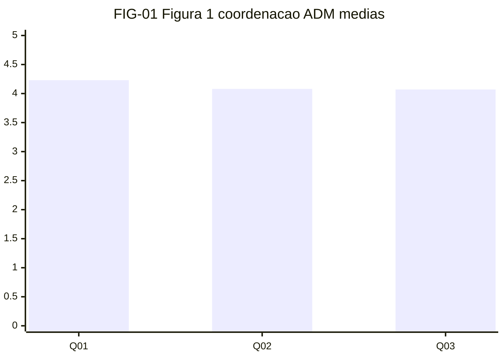
```mermaid
xychart-beta
    title "FIG-01 Figura 1 coordenacao ADM medias"
    x-axis [Q01, Q02, Q03]
    y-axis 0 --> 5
    bar [4.23, 4.08, 4.07]
```

### FIG-02. Figura 2, infraestrutura pelos discentes de Administração (p. 10)

Título interno verbatim: Infraestrutura do curso (ADM). Médias: Q1 3,96; Q2 3,79; Q3 4,14; Q4 4,00; Q5 3,92 (com vírgula no original); Q6 4,10; Q7 3,66; Q8 4,05; Q9 3,07; Q10 4,47; Q11 3,84. Percentuais ilegíveis. Texto fiel: satisfeitos, com atenção à cantina (Q9).

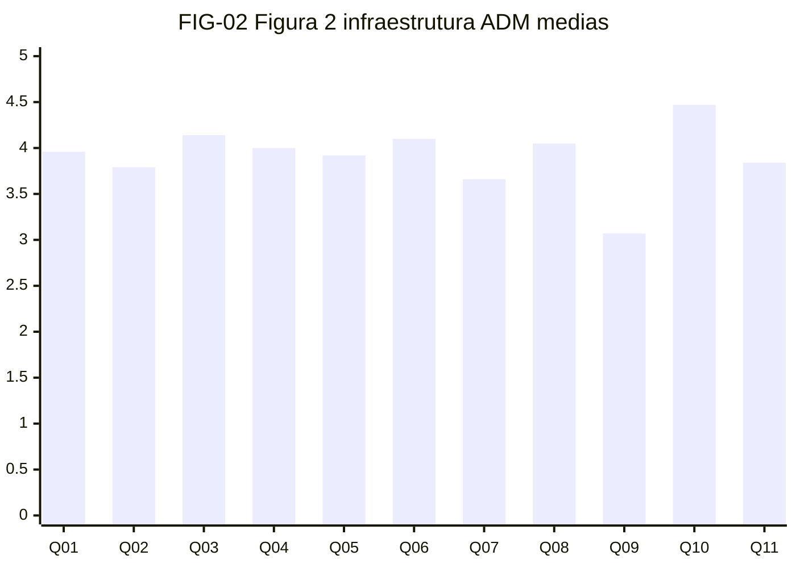
```mermaid
xychart-beta
    title "FIG-02 Figura 2 infraestrutura ADM medias"
    x-axis [Q01, Q02, Q03, Q04, Q05, Q06, Q07, Q08, Q09, Q10, Q11]
    y-axis 0 --> 5
    bar [3.96, 3.79, 4.14, 4.00, 3.92, 4.10, 3.66, 4.05, 3.07, 4.47, 3.84]
```

### FIG-03. Figura 3, pesquisa e extensão pelos discentes de Administração (p. 10)

Título interno verbatim: Pesquisa e extensão do curso (ADM). Médias: Q1 3,70; Q2 3,63; Q3 3,77; Q4 3,42. Percentuais ilegíveis. Texto fiel: satisfatórios, com margem a melhoria.

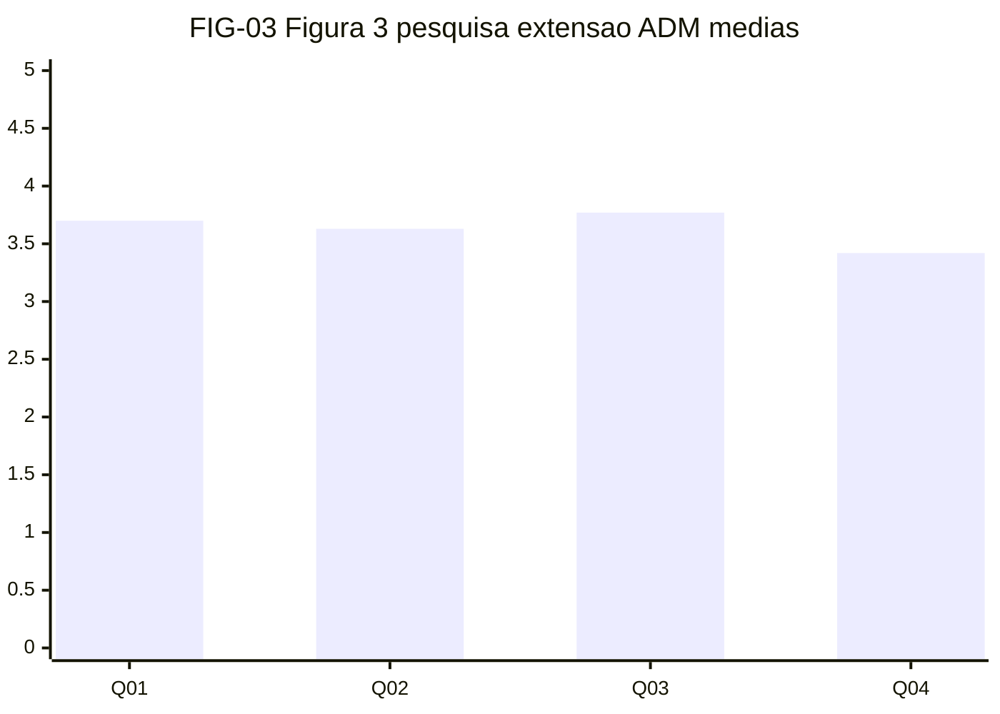
```mermaid
xychart-beta
    title "FIG-03 Figura 3 pesquisa extensao ADM medias"
    x-axis [Q01, Q02, Q03, Q04]
    y-axis 0 --> 5
    bar [3.70, 3.63, 3.77, 3.42]
```

### FIG-04. Figura 4, atendimento pelos discentes de Administração (p. 11)

Título interno verbatim: Políticas de atendimento aos discentes (ADM). Médias: Q1 3,86; Q2 3,83. Percentuais ilegíveis. Texto fiel: satisfatórios.

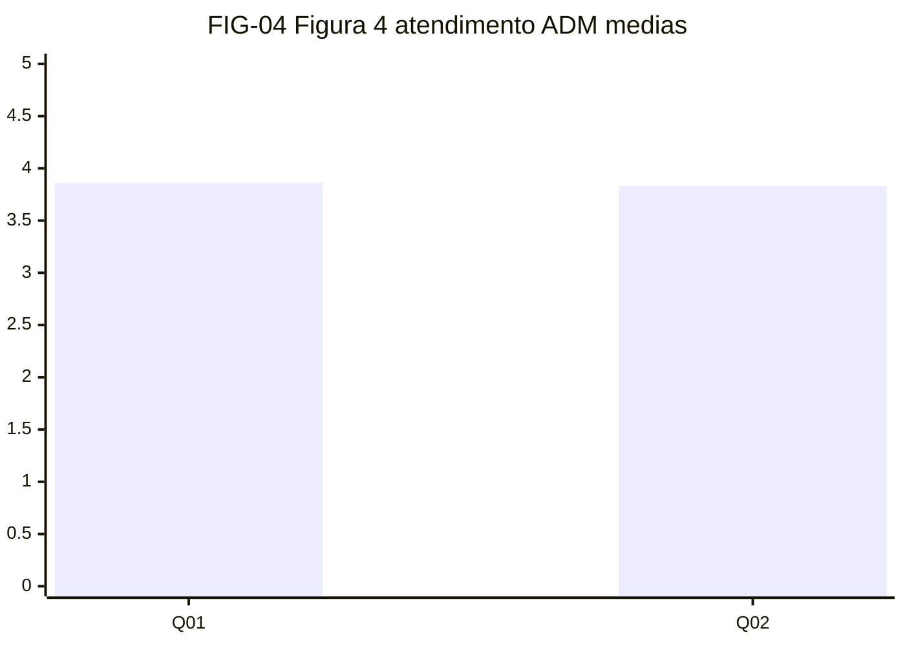
```mermaid
xychart-beta
    title "FIG-04 Figura 4 atendimento ADM medias"
    x-axis [Q01, Q02]
    y-axis 0 --> 5
    bar [3.86, 3.83]
```

### FIG-05. Figura 5, organização e gestão pelos discentes de Administração (p. 11)

Título interno verbatim: Organização e gestão do curso (ADM). Médias: Q1 4,31; Q2 3,91; Q3 3,78; Q4 3,98. Percentuais ilegíveis. Texto fiel: satisfatórios, com destaque ao atendimento dos técnicos.

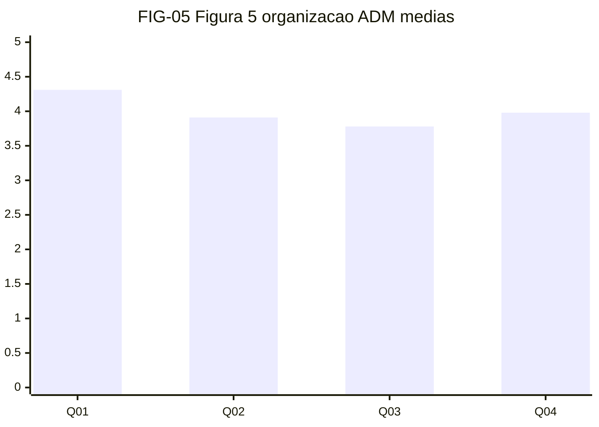
```mermaid
xychart-beta
    title "FIG-05 Figura 5 organizacao ADM medias"
    x-axis [Q01, Q02, Q03, Q04]
    y-axis 0 --> 5
    bar [4.31, 3.91, 3.78, 3.98]
```

### FIG-06. Figura 6, comunicação pelos discentes de Administração (p. 12)

Título interno verbatim: Comunicação com a sociedade (ADM). Médias: Q1 3,89; Q2 3,78; Q3 4,04; Q4 4,08. Percentuais ilegíveis. Texto fiel: boas médias, em torno de 4 pontos.

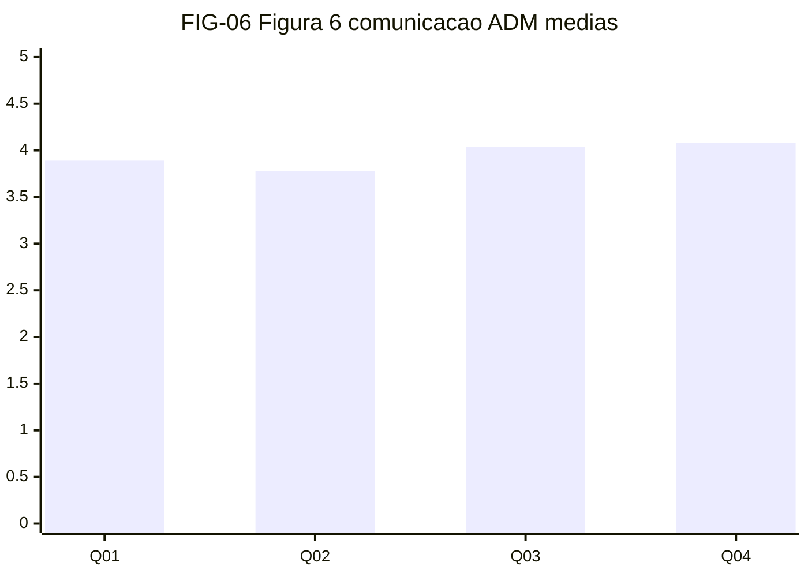
```mermaid
xychart-beta
    title "FIG-06 Figura 6 comunicacao ADM medias"
    x-axis [Q01, Q02, Q03, Q04]
    y-axis 0 --> 5
    bar [3.89, 3.78, 4.04, 4.08]
```

### FIG-07. Figura 7, responsabilidade social pelos discentes de Administração (p. 12)

Título interno verbatim: Responsabilidade social (ADM). Médias: Q1 3,81; Q2 3,56. Percentuais ilegíveis. Texto fiel: bom resultado, com margem a ações de melhoria.

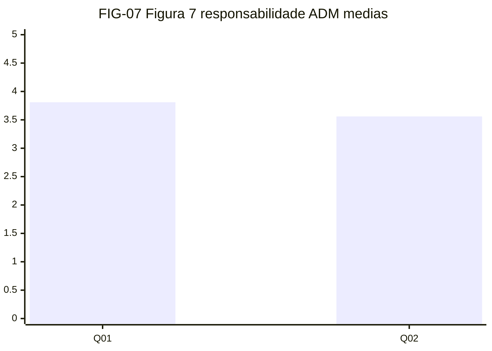
```mermaid
xychart-beta
    title "FIG-07 Figura 7 responsabilidade ADM medias"
    x-axis [Q01, Q02]
    y-axis 0 --> 5
    bar [3.81, 3.56]
```

### FIG-08. Figura 8, docentes pelos discentes de Administração (p. 13)

Título interno verbatim: Docentes do curso (ADM). Médias: Q1 4,37; Q2 4,49; Q3 4,40; Q4 4,44; Q5 4,60. Percentuais ilegíveis. Texto fiel: todas acima de 4 pontos.

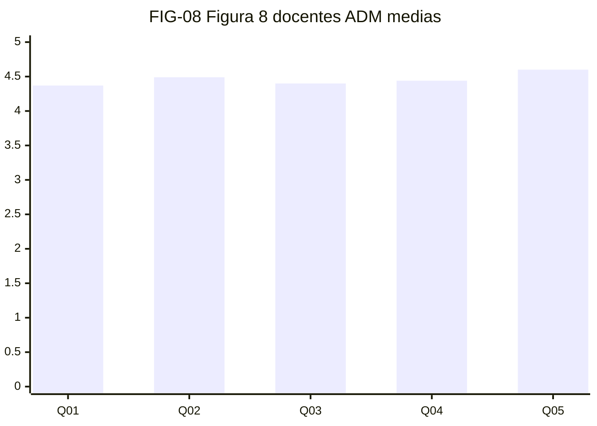
```mermaid
xychart-beta
    title "FIG-08 Figura 8 docentes ADM medias"
    x-axis [Q01, Q02, Q03, Q04, Q05]
    y-axis 0 --> 5
    bar [4.37, 4.49, 4.40, 4.44, 4.60]
```

### FIG-09. Figura 9, disciplinas pelos discentes de Administração (p. 13)

Título interno verbatim: Disciplinas do curso (ADM). Médias: Q1 4,48; Q2 4,05; Q3 4,22; Q4 4,17. Percentuais ilegíveis. Texto fiel: satisfatórios, acima de 4 pontos.

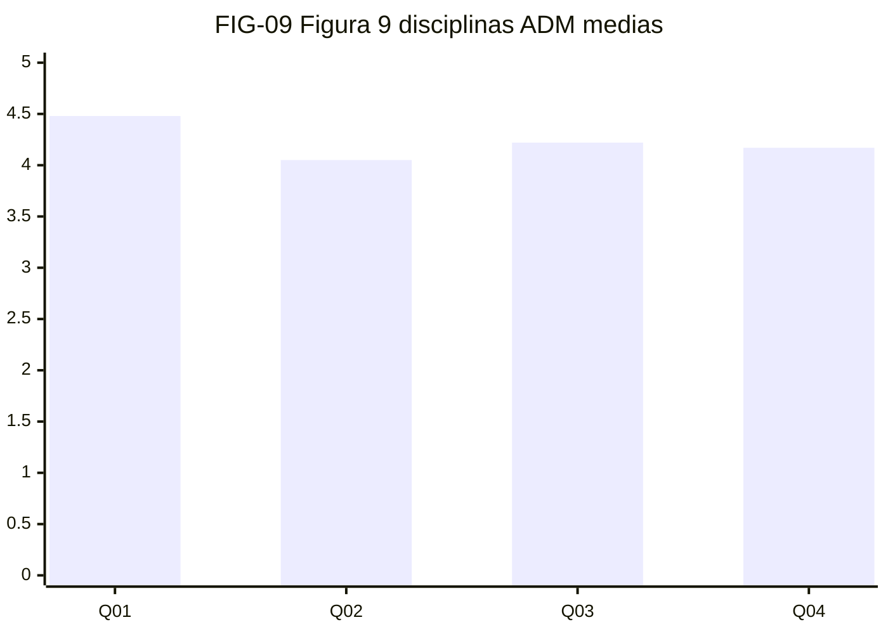
```mermaid
xychart-beta
    title "FIG-09 Figura 9 disciplinas ADM medias"
    x-axis [Q01, Q02, Q03, Q04]
    y-axis 0 --> 5
    bar [4.48, 4.05, 4.22, 4.17]
```

### FIG-10. Figura 10, autoavaliação discente de Administração (p. 14)

Título interno verbatim: Autoavaliação discente (ADM). Médias: Q1 4,26; Q2 4,43; Q3 4,20. Percentuais ilegíveis. Texto fiel (com grafia Figura10 sem espaço no original): satisfatórios.

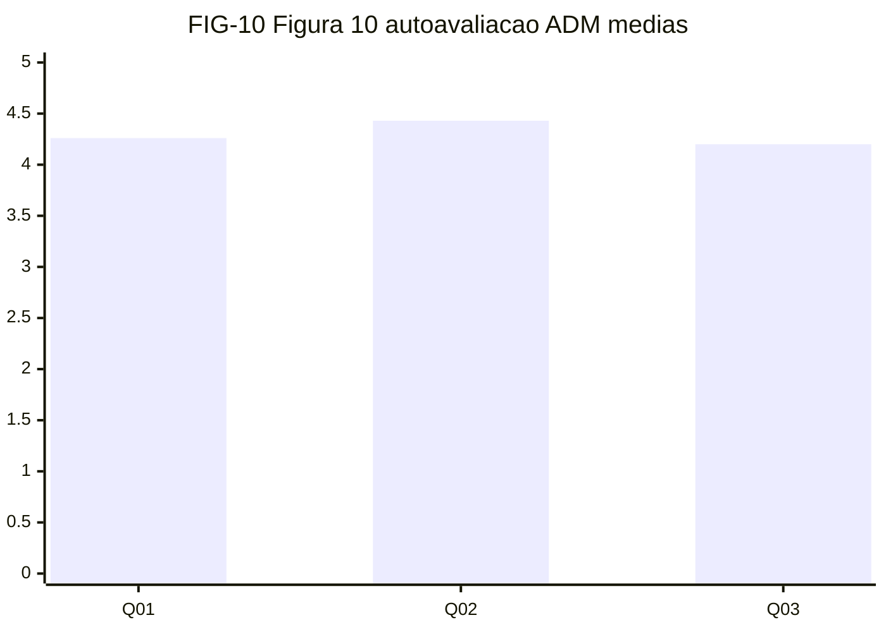
```mermaid
xychart-beta
    title "FIG-10 Figura 10 autoavaliacao ADM medias"
    x-axis [Q01, Q02, Q03]
    y-axis 0 --> 5
    bar [4.26, 4.43, 4.20]
```

### FIG-11. Figura 11, coordenação pelos discentes de Matemática (p. 17)

Título interno verbatim: Coordenação de curso (MAT). Médias: Q1 3,77; Q2 3,77; Q3 3,81. Percentuais ilegíveis. Texto fiel: satisfatórios.

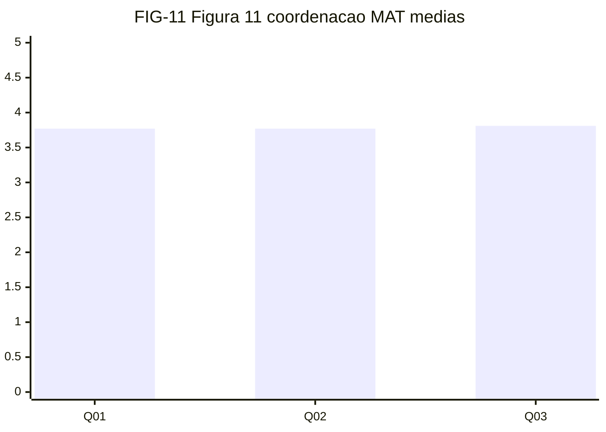
```mermaid
xychart-beta
    title "FIG-11 Figura 11 coordenacao MAT medias"
    x-axis [Q01, Q02, Q03]
    y-axis 0 --> 5
    bar [3.77, 3.77, 3.81]
```

### FIG-12. Figura 12, infraestrutura pelos discentes de Matemática (p. 17)

Título interno verbatim: Infraestrutura do curso (MAT). Médias: Q1 4,00; Q2 3,96; Q3 4,31; Q4 3,85; Q5 3,86; Q6 4,12; Q7 3,68; Q8 4,19; Q9 3,38; Q10 4,50; Q11 4,23. Percentuais ilegíveis. Texto fiel: satisfatórios, com atenção à cantina (Q9).

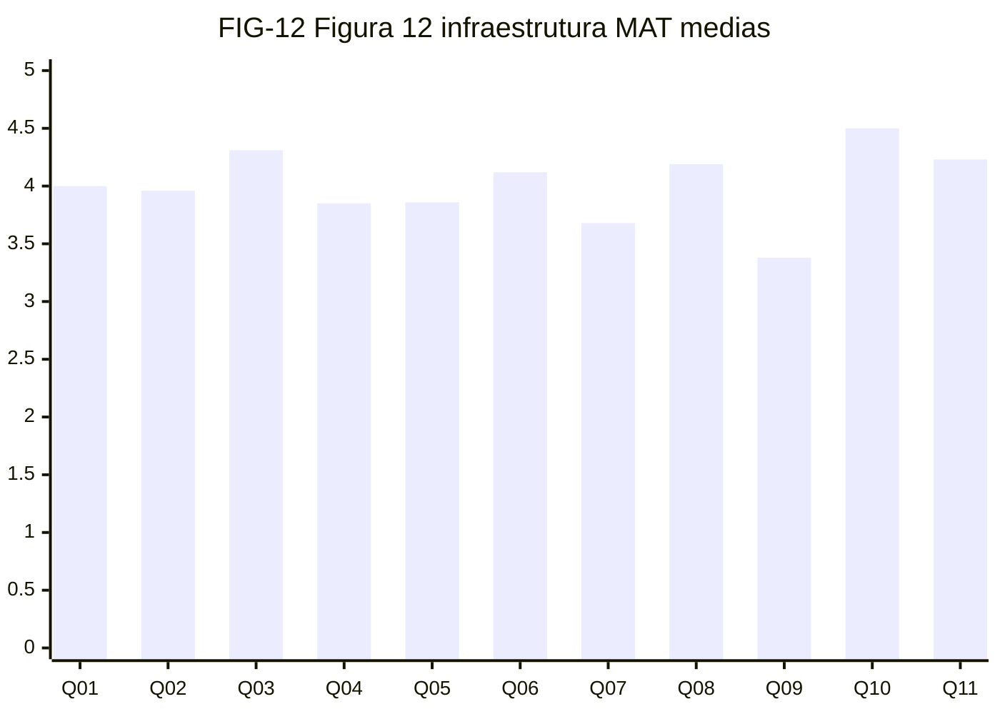
```mermaid
xychart-beta
    title "FIG-12 Figura 12 infraestrutura MAT medias"
    x-axis [Q01, Q02, Q03, Q04, Q05, Q06, Q07, Q08, Q09, Q10, Q11]
    y-axis 0 --> 5
    bar [4.00, 3.96, 4.31, 3.85, 3.86, 4.12, 3.68, 4.19, 3.38, 4.50, 4.23]
```

### FIG-13. Figura 13, pesquisa e extensão pelos discentes de Matemática (p. 18)

Título interno verbatim: Pesquisa e extensão do curso (MAT). Médias: Q1 3,64; Q2 3,45; Q3 3,59; Q4 3,55. Percentuais ilegíveis. Texto fiel: satisfatórios, com demanda por ações de melhoria.

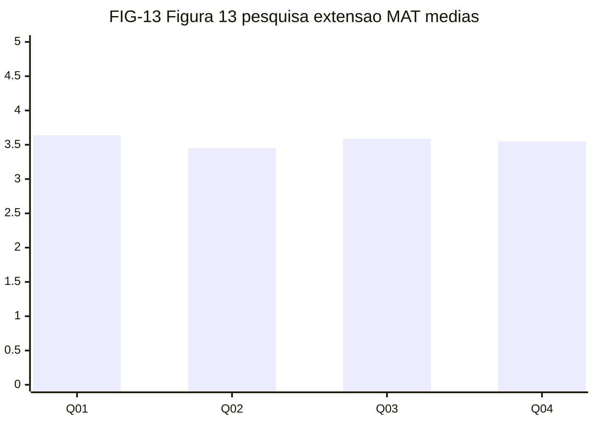
```mermaid
xychart-beta
    title "FIG-13 Figura 13 pesquisa extensao MAT medias"
    x-axis [Q01, Q02, Q03, Q04]
    y-axis 0 --> 5
    bar [3.64, 3.45, 3.59, 3.55]
```

### FIG-14. Figura 14, atendimento pelos discentes de Matemática (p. 18)

Título interno verbatim: Políticas de atendimento aos discentes (MAT). Médias: Q1 3,84; Q2 3,88. Percentuais ilegíveis. Texto fiel (com grafia Figura14 sem espaço): satisfatórios.

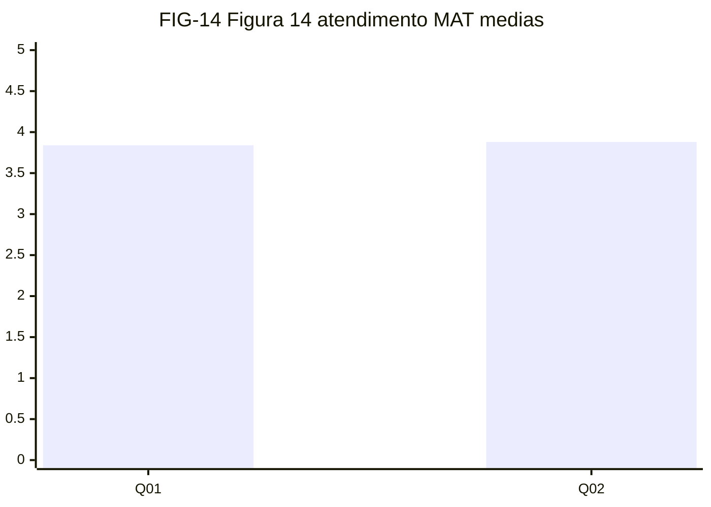
```mermaid
xychart-beta
    title "FIG-14 Figura 14 atendimento MAT medias"
    x-axis [Q01, Q02]
    y-axis 0 --> 5
    bar [3.84, 3.88]
```

### FIG-15. Figura 15, organização e gestão pelos discentes de Matemática (p. 19)

Título interno verbatim: Organização e gestão do curso (MAT). Médias: Q1 4,19; Q2 3,81; Q3 3,95; Q4 3,87. Percentuais ilegíveis. Texto fiel (com grafia Figura15 sem espaço): satisfatórios, com médias próximas a 4 pontos.

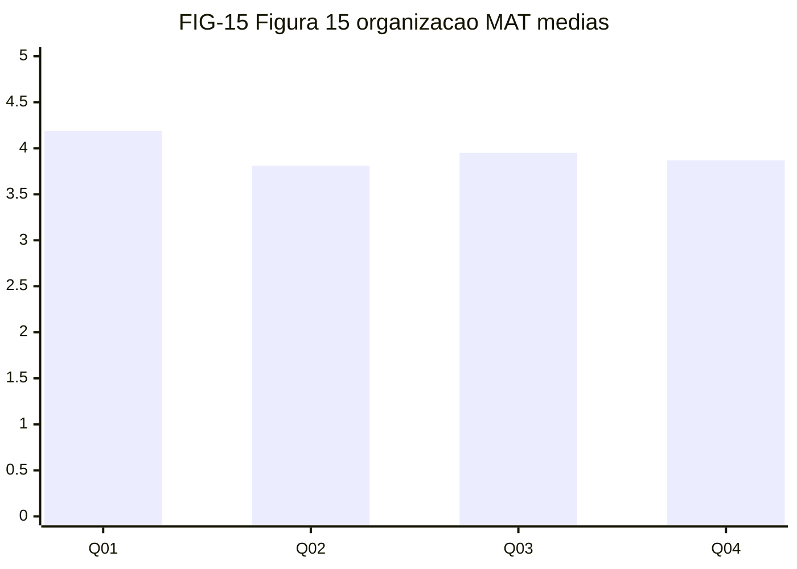
```mermaid
xychart-beta
    title "FIG-15 Figura 15 organizacao MAT medias"
    x-axis [Q01, Q02, Q03, Q04]
    y-axis 0 --> 5
    bar [4.19, 3.81, 3.95, 3.87]
```

### FIG-16. Figura 16, comunicação pelos discentes de Matemática (p. 19)

Título interno verbatim: Comunicação com a sociedade (MAT). Médias: Q1 4,00; Q2 3,95; Q3 4,23; Q4 4,27. Percentuais ilegíveis. Texto fiel (com grafia Figura16 sem espaço): satisfatórios, médias próximas a 4 pontos.

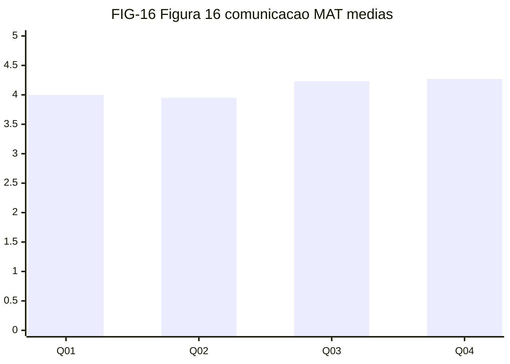
```mermaid
xychart-beta
    title "FIG-16 Figura 16 comunicacao MAT medias"
    x-axis [Q01, Q02, Q03, Q04]
    y-axis 0 --> 5
    bar [4.00, 3.95, 4.23, 4.27]
```

### FIG-17. Figura 17, responsabilidade social pelos discentes de Matemática (p. 19 a 20)

Título interno verbatim: Responsabilidade social (MAT). Médias: Q1 3,83; Q2 3,78. Percentuais ilegíveis. Texto fiel: satisfatórios.

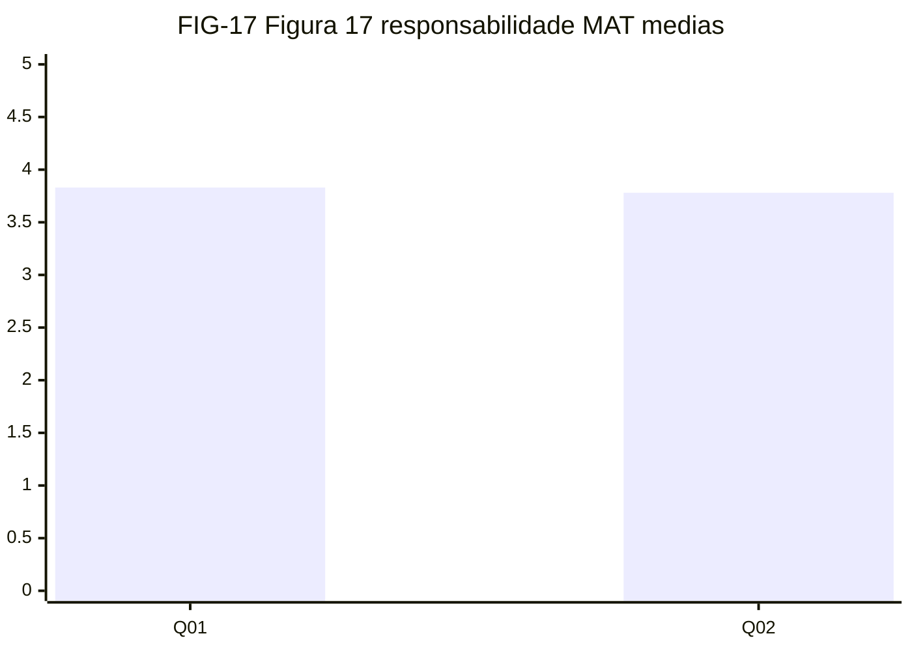
```mermaid
xychart-beta
    title "FIG-17 Figura 17 responsabilidade MAT medias"
    x-axis [Q01, Q02]
    y-axis 0 --> 5
    bar [3.83, 3.78]
```

### FIG-18. Figura 18, docentes pelos discentes de Matemática (p. 20)

Título interno verbatim: Docentes do curso (MAT). Médias: Q1 4,23; Q2 4,47; Q3 4,40; Q4 4,35; Q5 4,44. Percentuais ilegíveis. Texto fiel: boas médias, acima de 4 pontos.

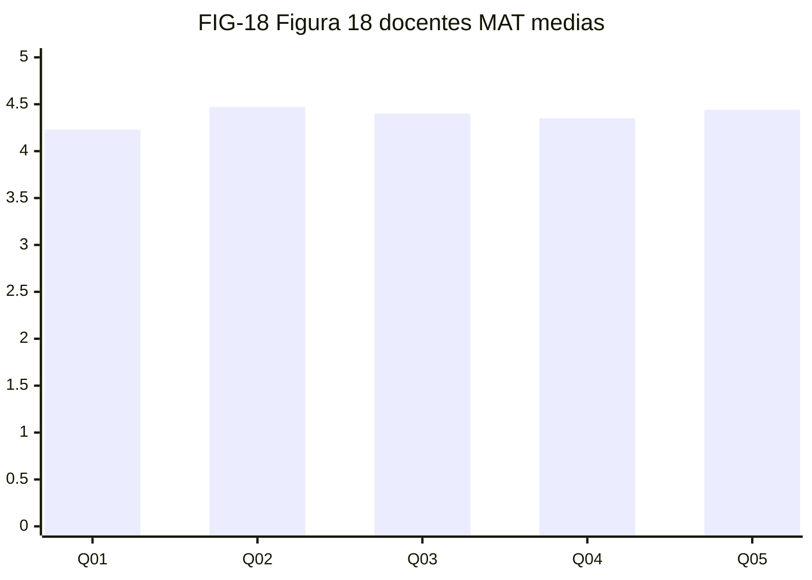
```mermaid
xychart-beta
    title "FIG-18 Figura 18 docentes MAT medias"
    x-axis [Q01, Q02, Q03, Q04, Q05]
    y-axis 0 --> 5
    bar [4.23, 4.47, 4.40, 4.35, 4.44]
```

### FIG-19. Figura 19, disciplinas pelos discentes de Matemática (p. 20)

Título interno verbatim: Disciplinas do curso (MAT). Médias: Q1 4,25; Q2 4,27; Q3 4,24; Q4 4,24. Percentuais ilegíveis. Texto fiel: médias acima de 4 pontos.

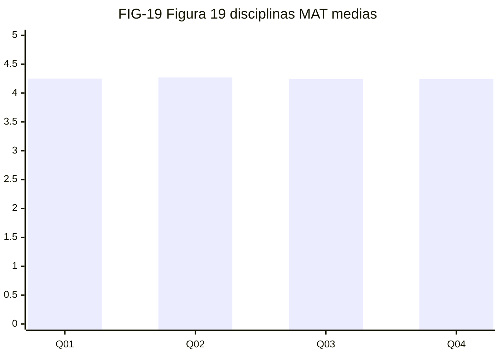
```mermaid
xychart-beta
    title "FIG-19 Figura 19 disciplinas MAT medias"
    x-axis [Q01, Q02, Q03, Q04]
    y-axis 0 --> 5
    bar [4.25, 4.27, 4.24, 4.24]
```

### FIG-20. Figura 20, autoavaliação discente de Matemática (p. 21)

Título interno verbatim: Autoavaliação discente (MAT). Médias legíveis: Q1 4,27; Q3 4,06. Rótulo da barra central ilegível ou ausente na imagem nativa e na renderização (lacuna declarada, sem estimativa). Percentuais ilegíveis. Texto fiel (com grafia autovaliação sem o segundo a no original): satisfatórios.

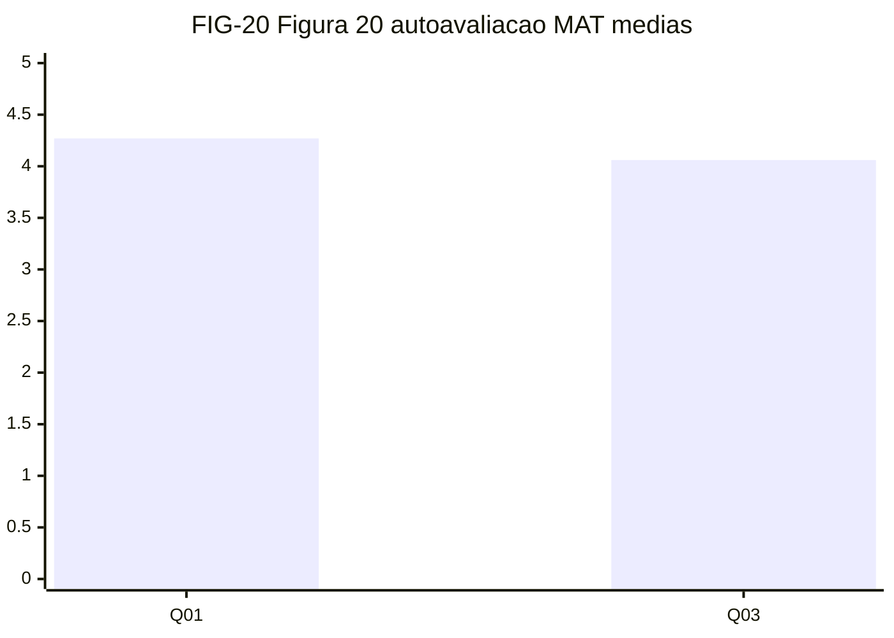
```mermaid
xychart-beta
    title "FIG-20 Figura 20 autoavaliacao MAT medias"
    x-axis [Q01, Q03]
    y-axis 0 --> 5
    bar [4.27, 4.06]
```

### FIG-21. Figura 21, coordenação pelos discentes de Psicologia (p. 23)

Título interno verbatim: Coordenação de curso (PSICO). Médias: Q1 3,97; Q2 3,23; Q3 2,79. Percentuais ilegíveis. Texto fiel: satisfatórios, com necessidade de melhorar orientação a pesquisa e extensão (Q3).

```mermaid
xychart-beta
    title "FIG-21 Figura 21 coordenacao PSICO medias"
    x-axis [Q01, Q02, Q03]
    y-axis 0 --> 5
    bar [3.97, 3.23, 2.79]
```

### FIG-22. Figura 22, infraestrutura pelos discentes de Psicologia (p. 24)

Título interno verbatim: Infraestrutura do curso (PSICO). Médias: Q1 3,65; Q2 3,80; Q3 4,04; Q4 4,04; Q5 3,75; Q6 4,13; Q7 4,08; Q8 4,64; Q9 3,20; Q10 4,60; Q11 3,56. Percentuais ilegíveis. Texto fiel: satisfatórios, com menor índice na cantina (Q9 com 3,20).

```mermaid
xychart-beta
    title "FIG-22 Figura 22 infraestrutura PSICO medias"
    x-axis [Q01, Q02, Q03, Q04, Q05, Q06, Q07, Q08, Q09, Q10, Q11]
    y-axis 0 --> 5
    bar [3.65, 3.80, 4.04, 4.04, 3.75, 4.13, 4.08, 4.64, 3.20, 4.60, 3.56]
```

### FIG-23. Figura 23, pesquisa e extensão pelos discentes de Psicologia (p. 24)

Título interno verbatim: Pesquisa e extensão do curso (PSICO). Médias: Q1 3,20; Q2 3,46; Q3 3,89; Q4 3,00. Percentuais ilegíveis. Texto fiel: satisfatórios, com atenção a oportunidades de pesquisa (Q1).

```mermaid
xychart-beta
    title "FIG-23 Figura 23 pesquisa extensao PSICO medias"
    x-axis [Q01, Q02, Q03, Q04]
    y-axis 0 --> 5
    bar [3.20, 3.46, 3.89, 3.00]
```

### FIG-24. Figura 24, atendimento pelos discentes de Psicologia (p. 25)

Título interno verbatim: Políticas de atendimento aos discentes (PSICO). Médias: Q1 3,09; Q2 3,00. Percentuais ilegíveis. Texto fiel: médias próximas a 3 pontos, com margem a melhoria.

```mermaid
xychart-beta
    title "FIG-24 Figura 24 atendimento PSICO medias"
    x-axis [Q01, Q02]
    y-axis 0 --> 5
    bar [3.09, 3.00]
```

### FIG-25. Figura 25, organização e gestão pelos discentes de Psicologia (p. 25)

Título interno verbatim: Organização e gestão do curso (PSICO). Médias: Q1 4,36; Q2 3,60; Q3 3,67; Q4 3,53. Percentuais ilegíveis. Texto fiel: satisfatórios.

```mermaid
xychart-beta
    title "FIG-25 Figura 25 organizacao PSICO medias"
    x-axis [Q01, Q02, Q03, Q04]
    y-axis 0 --> 5
    bar [4.36, 3.60, 3.67, 3.53]
```

### FIG-26. Figura 26, comunicação pelos discentes de Psicologia (p. 25 a 26)

Título interno verbatim: Comunicação com a sociedade (PSICO). Médias: Q1 3,43; Q2 3,56; Q3 4,04; Q4 4,04. Percentuais ilegíveis. Texto fiel: satisfatórios.

```mermaid
xychart-beta
    title "FIG-26 Figura 26 comunicacao PSICO medias"
    x-axis [Q01, Q02, Q03, Q04]
    y-axis 0 --> 5
    bar [3.43, 3.56, 4.04, 4.04]
```

### FIG-27. Figura 27, responsabilidade social pelos discentes de Psicologia (p. 26)

Título interno verbatim: Responsabilidade social (PSICO). Médias: Q1 3,42; Q2 3,16. Percentuais ilegíveis. Texto fiel: satisfatória, com médias 3,16 e 3,42, com margem a melhoria.

```mermaid
xychart-beta
    title "FIG-27 Figura 27 responsabilidade PSICO medias"
    x-axis [Q01, Q02]
    y-axis 0 --> 5
    bar [3.42, 3.16]
```

### FIG-28. Figura 28, docentes pelos discentes de Psicologia (p. 26)

Título interno verbatim: Docentes do curso (PSICO). Médias: Q1 3,78; Q2 4,24; Q3 4,10; Q4 4,04; Q5 4,20. Percentuais ilegíveis. Texto fiel: bons resultados, com médias próximas a 4 pontos.

```mermaid
xychart-beta
    title "FIG-28 Figura 28 docentes PSICO medias"
    x-axis [Q01, Q02, Q03, Q04, Q05]
    y-axis 0 --> 5
    bar [3.78, 4.24, 4.10, 4.04, 4.20]
```

### FIG-29. Figura 29, disciplinas pelos discentes de Psicologia (p. 27)

Título interno verbatim: Disciplinas do curso (PSICO). Médias: Q1 4,49; Q2 3,67; Q3 4,06; Q4 3,95. Percentuais ilegíveis. Texto fiel: satisfatórios, com médias próximas a 4 pontos.

```mermaid
xychart-beta
    title "FIG-29 Figura 29 disciplinas PSICO medias"
    x-axis [Q01, Q02, Q03, Q04]
    y-axis 0 --> 5
    bar [4.49, 3.67, 4.06, 3.95]
```

### FIG-30. Figura 30, autoavaliação discente de Psicologia (p. 27)

Título interno verbatim (defeito preservado): Disciplinas do curso (PSICO), idêntico ao da Figura 29, onde o contexto é autoavaliação discente. Médias impressas idênticas às da Figura 29: Q1 4,49; Q2 3,67; Q3 4,06; Q4 3,95. Percentuais ilegíveis. Texto fiel (com grafia Figura30 sem espaço): satisfatórios.

```mermaid
xychart-beta
    title "FIG-30 Figura 30 autoavaliacao PSICO medias"
    x-axis [Q01, Q02, Q03, Q04]
    y-axis 0 --> 5
    bar [4.49, 3.67, 4.06, 3.95]
```

### FIG-31. Figura 31, unidade pelos docentes (p. 28)

Título interno verbatim: Unidade setorial. Questões: Q1 satisfação com a unidade; Q2 atendimento técnico; Q3 atuação docente. Médias: Q1 4,48; Q2 4,41; Q3 4,44. Percentuais ilegíveis. Texto fiel (com grafia Figura31 sem espaço): muito bem avaliada.

```mermaid
xychart-beta
    title "FIG-31 Figura 31 unidade docentes medias"
    x-axis [Q01, Q02, Q03]
    y-axis 0 --> 5
    bar [4.48, 4.41, 4.44]
```

### FIG-32. Figura 32, direção pelos docentes (p. 28 a 29)

Título interno verbatim: Direção. Questões: Q1 acesso; Q2 agilidade; Q3 soluções; Q4 integração entre cursos; Q5 comunicação das decisões; Q6 transparência. Médias: Q1 4,78; Q2 4,63; Q3 4,63; Q4 4,11; Q5 4,26; Q6 4,48. Percentuais ilegíveis. Texto fiel: satisfatória, com destaque ao acesso.

```mermaid
xychart-beta
    title "FIG-32 Figura 32 direcao docentes medias"
    x-axis [Q01, Q02, Q03, Q04, Q05, Q06]
    y-axis 0 --> 5
    bar [4.78, 4.63, 4.63, 4.11, 4.26, 4.48]
```

### FIG-33. Figura 33, condições de oferecimento pelos docentes (p. 29)

Título interno verbatim: Condições de oferecimento do curso. Questões: Q1 espaço de salas; Q2 espaço de laboratórios; Q3 equipamentos; Q4 pessoal de apoio; Q5 colegiado e NDE; Q6 matriz; Q7 PNE; Q8 SECAC; Q9 SAP. Médias: Q1 4,07; Q2 4,04; Q3 3,96; Q4 4,08; Q5 4,19; Q6 4,00; Q7 4,12; Q8 4,31; Q9 4,27. Percentuais ilegíveis. Texto fiel: maioria MUITO BOM ou BOM, com destaque às questões 5, 6, 8 e 9.

```mermaid
xychart-beta
    title "FIG-33 Figura 33 condicoes docentes medias"
    x-axis [Q01, Q02, Q03, Q04, Q05, Q06, Q07, Q08, Q09]
    y-axis 0 --> 5
    bar [4.07, 4.04, 3.96, 4.08, 4.19, 4.00, 4.12, 4.31, 4.27]
```

### FIG-34. Figura 34, coordenadores avaliados pelos docentes (p. 30)

Título interno verbatim: Coordenação. Questões: Q1 relacionamento; Q2 integração da disciplina; Q3 disponibilidade; Q4 extensão; Q5 integração ensino, pesquisa e extensão; Q6 comunicação do colegiado e NDE; Q7 acesso; Q8 transparência. Médias: Q1 4,15; Q2 4,38; Q3 4,33; Q4 4,33; Q5 4,08; Q6 4,30; Q7 4,22; Q8 4,15. Percentuais ilegíveis. Texto fiel: muito bem avaliadas.

```mermaid
xychart-beta
    title "FIG-34 Figura 34 coordenacao docentes medias"
    x-axis [Q01, Q02, Q03, Q04, Q05, Q06, Q07, Q08]
    y-axis 0 --> 5
    bar [4.15, 4.38, 4.33, 4.33, 4.08, 4.30, 4.22, 4.15]
```

### FIG-35. Figura 35, pesquisa e extensão pelos docentes (p. 30)

Título interno verbatim: Pesquisa e Extensão. Questões: Q1 integração; Q2 apoio institucional; Q3 infraestrutura. Médias: Q1 4,11; Q2 3,85; Q3 3,70. Percentuais ilegíveis. Texto fiel (com grafia quantoa sem espaço no original): satisfatórios, com atenção à infraestrutura.

```mermaid
xychart-beta
    title "FIG-35 Figura 35 pesquisa extensao docentes medias"
    x-axis [Q01, Q02, Q03]
    y-axis 0 --> 5
    bar [4.11, 3.85, 3.70]
```

### FIG-36. Figura 36, autoavaliação dos docentes (p. 31)

Título interno verbatim: Autoavaliação. Questões: Q1 documentos da UFMS; Q2 documentos do curso. Médias: Q1 3,96; Q2 4,26. Percentuais ilegíveis. Texto fiel: satisfatórios.

```mermaid
xychart-beta
    title "FIG-36 Figura 36 autoavaliacao docentes medias"
    x-axis [Q01, Q02]
    y-axis 0 --> 5
    bar [3.96, 4.26]
```

### FIG-37. Figura 37, organização e gestão pelos docentes (p. 32)

Título interno verbatim: Organização e gestão da UFMS. Questões: Q1 AGETIC; Q2 AGINOVA; Q3 PROAES; Q4 PROGRAD; Q5 PROPP; Q6 PROPLAN; Q7 PROGEP; Q8 PROADI; Q9 PROECE; Q10 SEAVI; Q11 SECOM; Q12 SEDFOR; Q13 SELOC; Q14 melhorias; Q15 participação decisória. Médias: Q1 3,91; Q2 3,94; Q3 3,95; Q4 3,88; Q5 3,85; Q6 3,83; Q7 4,15; Q8 3,89; Q9 4,16; Q10 4,00; Q11 3,94; Q12 3,94; Q13 4,00; Q14 3,96; Q15 3,12. Percentuais ilegíveis. Texto fiel: majoritariamente satisfatórios, com atenção à participação decisória (menor média).

```mermaid
xychart-beta
    title "FIG-37 Figura 37 organizacao docentes medias"
    x-axis [Q01, Q02, Q03, Q04, Q05, Q06, Q07, Q08, Q09, Q10, Q11, Q12, Q13, Q14, Q15]
    y-axis 0 --> 5
    bar [3.91, 3.94, 3.95, 3.88, 3.85, 3.83, 4.15, 3.89, 4.16, 4.00, 3.94, 3.94, 4.00, 3.96, 3.12]
```

### FIG-38. Figura 38, responsabilidade social pelos docentes (p. 32)

Título interno verbatim: Responsabilidade social da UFMS. Questões: Q1 cidadania; Q2 interação regional; Q3 divulgação; Q4 ouvidoria; Q5 site UFMS; Q6 site da unidade; Q7 biblioteca. Médias: Q1 3,96; Q2 3,74; Q3 3,78; Q4 3,90; Q5 4,26; Q6 4,33; Q7 4,15. Percentuais ilegíveis. Texto fiel (com grafia ais sem o m no original): satisfatórios, com necessidade de divulgar mais as atividades (Q3).

```mermaid
xychart-beta
    title "FIG-38 Figura 38 responsabilidade docentes medias"
    x-axis [Q01, Q02, Q03, Q04, Q05, Q06, Q07]
    y-axis 0 --> 5
    bar [3.96, 3.74, 3.78, 3.90, 4.26, 4.33, 4.15]
```

### FIG-39. Figura 39, questões gerais pelos coordenadores (p. 34)

Título interno verbatim: Informações gerais. Questões: Q1 NDE; Q2 docentes (quantitativo, titulação, previsão); Q3 PPC; Q4 PNE; Q5 PROGRAD; Q6 PROAES. Médias: Q1 4,00; Q2 3,50; Q3 4,00; Q4 3,50; Q5 4,00; Q6 4,00. Percentuais ilegíveis. Texto fiel: satisfatórios.

```mermaid
xychart-beta
    title "FIG-39 Figura 39 gerais coordenadores medias"
    x-axis [Q01, Q02, Q03, Q04, Q05, Q06]
    y-axis 0 --> 5
    bar [4.00, 3.50, 4.00, 3.50, 4.00, 4.00]
```

### FIG-40. Figura 40, organização e gestão pelos coordenadores (p. 34)

Título interno verbatim (defeito preservado): Informações gerais, idêntico ao da Figura 39. Médias impressas idênticas às da Figura 39: Q1 4,00; Q2 3,50; Q3 4,00; Q4 3,50; Q5 4,00; Q6 4,00. Percentuais ilegíveis. Texto fiel: satisfeitos.

```mermaid
xychart-beta
    title "FIG-40 Figura 40 organizacao coordenadores medias"
    x-axis [Q01, Q02, Q03, Q04, Q05, Q06]
    y-axis 0 --> 5
    bar [4.00, 3.50, 4.00, 3.50, 4.00, 4.00]
```

### FIG-41. Figura 41, infraestrutura pelos coordenadores (p. 35)

Título interno verbatim: Infraestrutura. Questões: Q1 espaço de salas; Q2 espaço de laboratórios; Q3 equipamentos. Médias: Q1 4,00; Q2 3,50; Q3 4,50. Percentuais ilegíveis. Texto fiel: satisfatórias.

```mermaid
xychart-beta
    title "FIG-41 Figura 41 infraestrutura coordenadores medias"
    x-axis [Q01, Q02, Q03]
    y-axis 0 --> 5
    bar [4.00, 3.50, 4.50]
```

### FIG-42. Figura 42, autoavaliação dos coordenadores (p. 35)

Título interno verbatim: Autoavaliação. Questões: Q1 documentos da UFMS; Q2 documentos do curso. Médias: Q1 4,00; Q2 4,00. Percentuais ilegíveis. Texto fiel: satisfatórios.

```mermaid
xychart-beta
    title "FIG-42 Figura 42 autoavaliacao coordenadores medias"
    x-axis [Q01, Q02]
    y-axis 0 --> 5
    bar [4.00, 4.00]
```

### FIG-43. Figura 43, missão e PDI pelos técnicos (p. 37)

Título interno verbatim: Missão e perfil. Questão única: Q1 contribuição da unidade no PDI. Média: Q1 4,33. Percentuais ilegíveis. Texto fiel: MUITO BOA, com queda ante 4,54 em 2015.

```mermaid
xychart-beta
    title "FIG-43 Figura 43 missao tecnicos medias"
    x-axis [Q01]
    y-axis 0 --> 5
    bar [4.33]
```

### FIG-44. Figura 44, políticas institucionais pelos técnicos (p. 37)

Título interno verbatim: Políticas institucionais. Questões (numeração do gráfico, com dupla numeração no texto): Q1 integração com professores; Q2 integração com alunos; Q3 pesquisa; Q4 extensão; Q5 resolução de problemas. Médias: Q1 3,92; Q2 4,00; Q3 2,50; Q4 2,75; Q5 4,25. Percentuais ilegíveis. Texto fiel: satisfatórias Q2 e Q5; com atenção a Q1, Q3 e Q4.

```mermaid
xychart-beta
    title "FIG-44 Figura 44 politicas tecnicos medias"
    x-axis [Q01, Q02, Q03, Q04, Q05]
    y-axis 0 --> 5
    bar [3.92, 4.00, 2.50, 2.75, 4.25]
```

### FIG-45. Figura 45, responsabilidade social pelos técnicos (p. 38)

Título interno verbatim: Responsabilidade social da UFMS. Questões: Q1 inclusão e responsabilidade; Q2 integração com a sociedade. Médias: Q1 4,17; Q2 4,25. Percentuais ilegíveis. Texto fiel: maior parte das expectativas atendida (Q1 de 4,31 para 4,17; Q2 de 4,15 para 4,25).

```mermaid
xychart-beta
    title "FIG-45 Figura 45 responsabilidade tecnicos medias"
    x-axis [Q01, Q02]
    y-axis 0 --> 5
    bar [4.17, 4.25]
```

### FIG-46. Figura 46, comunicação institucional pelos técnicos (p. 38)

Título interno verbatim: Comunicação institucional. Questões: Q1 Secretaria de Comunicação; Q2 Portal UFMS; Q3 Boletim; Q4 Telefonia; Q5 e-mail; Q6 internas; Q7 Ouvidoria. Médias: Q1 3,92; Q2 4,42; Q3 4,50; Q4 3,58; Q5 4,17; Q6 4,25; Q7 4,25. Percentuais ilegíveis. Texto fiel: Telefonia menor, seguida da Secretaria; Portal, e-mail, internas e Ouvidoria com BOM; Boletim com MUITO BOM.

```mermaid
xychart-beta
    title "FIG-46 Figura 46 comunicacao tecnicos medias"
    x-axis [Q01, Q02, Q03, Q04, Q05, Q06, Q07]
    y-axis 0 --> 5
    bar [3.92, 4.42, 4.50, 3.58, 4.17, 4.25, 4.25]
```

### FIG-47. Figura 47, políticas de pessoal pelos técnicos (p. 39)

Título interno verbatim: Políticas de Pessoal. Questões: Q1 levantamento de treinamento; Q2 capacitação; Q3 eventos; Q4 qualificação; Q5 saúde; Q6 desempenho; Q7 carreira; Q8 condições de trabalho; Q9 chefia. Médias: Q1 3,25; Q2 2,67; Q3 3,25; Q4 3,83; Q5 3,42; Q6 3,83; Q7 3,00; Q8 4,08; Q9 4,83. Percentuais ilegíveis. Texto fiel: só Q9 satisfatória plena; Q1, Q3, Q4, Q5, Q6, Q7 e Q8 regulares; Q2 RUIM.

```mermaid
xychart-beta
    title "FIG-47 Figura 47 pessoal tecnicos medias"
    x-axis [Q01, Q02, Q03, Q04, Q05, Q06, Q07, Q08, Q09]
    y-axis 0 --> 5
    bar [3.25, 2.67, 3.25, 3.83, 3.42, 3.83, 3.00, 4.08, 4.83]
```

### FIG-48. Figura 48, organização e gestão pelos técnicos (p. 40)

Título interno verbatim: Organização e gestão. Questões: Q1 Coordenação Administrativa; Q2 Direção; Q3 AGETIC; Q4 AGINOVA; Q5 PROAES; Q6 PROGRAD; Q7 PROPP; Q8 PROPLAN; Q9 PROGEP; Q10 PROADI; Q11 PROECE; Q12 SEAVI; Q13 SECOM; Q14 SEDFOR; Q15 SELOC. Médias: Q1 4,44; Q2 4,75; Q3 4,27; Q4 4,10; Q5 4,00; Q6 4,09; Q7 4,10; Q8 4,00; Q9 4,18; Q10 4,00; Q11 4,00; Q12 3,90; Q13 4,10; Q14 3,88; Q15 4,27. Percentuais ilegíveis. Texto fiel: Direção e Coordenação MUITO BOAS; demais satisfatórios.

```mermaid
xychart-beta
    title "FIG-48 Figura 48 organizacao tecnicos medias"
    x-axis [Q01, Q02, Q03, Q04, Q05, Q06, Q07, Q08, Q09, Q10, Q11, Q12, Q13, Q14, Q15]
    y-axis 0 --> 5
    bar [4.44, 4.75, 4.27, 4.10, 4.00, 4.09, 4.10, 4.00, 4.18, 4.00, 4.00, 3.90, 4.10, 3.88, 4.27]
```

### FIG-49. Figura 49, infraestrutura pelos técnicos (p. 41)

Título interno verbatim: Infraestrutura. Questões: Q1 espaço físico; Q2 estacionamento; Q3 limpeza; Q4 resíduos; Q5 acessibilidade; Q6 internet e telefonia; Q7 material de consumo; Q8 material permanente; Q9 manutenção de equipamentos; Q10 manutenção geral; Q11 segurança. Médias: Q1 4,42; Q2 4,83; Q3 4,50; Q4 4,50; Q5 4,17; Q6 3,17; Q7 4,08; Q8 4,25; Q9 3,75; Q10 3,92; Q11 4,08. Percentuais ilegíveis. Texto fiel: estacionamento MUITO BOM (4,83; ante 1,73 em 2015 e 4,77 em 2016); demais satisfatórios; internet e telefonia REGULAR (3,17).

```mermaid
xychart-beta
    title "FIG-49 Figura 49 infraestrutura tecnicos medias"
    x-axis [Q01, Q02, Q03, Q04, Q05, Q06, Q07, Q08, Q09, Q10, Q11]
    y-axis 0 --> 5
    bar [4.42, 4.83, 4.50, 4.50, 4.17, 3.17, 4.08, 4.25, 3.75, 3.92, 4.08]
```

### FIG-50. Figura 50, processo de avaliação pelos técnicos (p. 41)

Título interno verbatim: Avaliação. Questões: Q1 ações baseadas na autoavaliação; Q2 participação; Q3 planejamento e PDI; Q4 CSA. Médias: Q1 3,73; Q2 4,08; Q3 4,00; Q4 4,00. Percentuais ilegíveis. Texto fiel: todos satisfatórios.

```mermaid
xychart-beta
    title "FIG-50 Figura 50 avaliacao tecnicos medias"
    x-axis [Q01, Q02, Q03, Q04]
    y-axis 0 --> 5
    bar [3.73, 4.08, 4.00, 4.00]
```

### FIG-51. Figura 51, sustentabilidade financeira pelos técnicos (p. 42)

Título interno verbatim: Sustentabilidade financeira. Questões: Q1 acompanhamento do orçamento; Q2 adequação dos recursos; Q3 uso racional. Médias: Q1 3,91; Q2 3,67; Q3 4,00. Percentuais ilegíveis. Texto fiel: BOA, em torno de 4,0 pontos.

```mermaid
xychart-beta
    title "FIG-51 Figura 51 sustentabilidade tecnicos medias"
    x-axis [Q01, Q02, Q03]
    y-axis 0 --> 5
    bar [3.91, 3.67, 4.00]
```

### FIG-52. Figura 52, qualidade avaliada pela direção (p. 43)

Título interno verbatim: Qualidade. Legenda externa verbatim: Figura 52: Avaliação da qualidade pela Direção. Tipo: barras horizontais simples azuis de série única, eixo X de 0 a 6, 9 questões (Q1 cidadania; Q2 interação; Q3 divulgação; Q4 ouvidoria; Q5 site UFMS; Q6 site da unidade; Q7 biblioteca; Q8 técnicos; Q9 PNE). Médias: nenhuma impressa na figura (não definitiva, sem estimativa). Texto fiel: satisfatórios, com atenção a biblioteca e PNE.

### FIG-53. Figura 53, Administração Central avaliada pela direção (p. 44)

Título interno verbatim: Administração Central. Legenda externa na página 45: Figura 53: Avaliação Administração Central pela Direção. Tipo: barras horizontais simples azuis de série única, eixo X de 0 a 6, 18 questões (Q1 acesso; Q2 materiais; Q3 agilidade; Q4 investimentos; Q5 AGETIC; Q6 AGINOVA; Q7 PROAES; Q8 PROGRAD; Q9 PROPP; Q10 PROPLAN; Q11 PROGEP; Q12 PROADI; Q13 PROECE; Q14 SEAVI; Q15 SECOM; Q16 SEDFOR; Q17 SELOC; Q18 assessoramento). Médias: nenhuma impressa (não definitiva, sem estimativa). Texto fiel: satisfatórios.

### FIG-54. Figura 54, pesquisa e extensão pela direção (p. 45)

Título interno verbatim: Pesquisa e Extensão. Legenda externa verbatim: Figura 54: Pesquisa e Extensão pela Direção. Tipo: barras horizontais simples azuis, eixo X de 0 a 6, 3 questões (Q1 integração; Q2 apoio; Q3 infraestrutura). Médias: nenhuma impressa (não definitiva, sem estimativa). Texto fiel: satisfatórios, com margem a melhoria.

### FIG-55. Figura 55, autoavaliação pela direção (p. 47)

Título interno verbatim: Autoavaliação. Legenda externa verbatim: Figura 55: Autoavaliação pela Direção. Tipo: barras horizontais simples azuis, eixo X de 0 a 6, 2 questões (Q1 documentos da UFMS; Q2 exercício da direção). Médias: nenhuma impressa (não definitiva, sem estimativa). Texto fiel (com remissão a Figura 51 onde o contexto é Figura 55, defeito preservado): satisfatórios.

---

## 14. Lacunas e defeitos declarados desta conversão

Cobertura integral das 56 figuras (FIG-00 a FIG-55) com médias lidas por visão onde impressas. Percentuais por categoria ilegíveis em todas as Figuras 1 a 51 (nenhum impresso nas barras, só cores). Figuras 52 a 55 sem médias impressas, registradas como não definitivas, sem mermaid e sem estimativa. FIG-20 com rótulo da barra central ilegível ou ausente (só Q1 e Q3 no mermaid). Tabela 4 com concluintes em célula vazia. Tabela 6 com concluintes em célula vazia e sem percentual de reprovação. Reconhecimento de Psicologia sem número de portaria no texto. Avaliação externa de Matemática em 2017 sem detalhamento do ato. Apoio estudantil sem quantitativos. Diplomados por ano ausentes neste ano. Auxílios por curso ausentes neste ano. Colegiado e NDE sem contagens tabuladas. Adesão discente global sem tabela (só respondentes docentes 27 elegíveis e técnicos 12 de 14). Defeitos preservados: sumário 3.1.4 e 3.8 com Erro! Indicador não definido; repetição de 3.1.1 e 3.1.2 após 3.1.3; remissão a tabela 3 onde o contexto é Tabela 5 (Psicologia); item 3, Qualidade com vírgula nas listas de infraestrutura; sobreposição técnicos-PSICOinistrativos (p. 25); grafias Figura10, Figura12, Figura14, Figura15, Figura16, Figura31 sem espaço e autovaliação sem o segundo a (p. 21); quantoa sem espaço (p. 30); ais sem o m (p. 32); e aOuvidoria sem espaço (p. 38); Q5 da Figura 2 com vírgula (3,92); Figura 30 com título e médias idênticos aos da Figura 29; Figuras 39 e 40 com médias idênticas sob legendas diferentes e com listas de questões duplicadas na página 34; remissão a Figura 51 onde o contexto é Figura 55 (p. 47). Nenhum valor estimado. Questões discursivas agregadas sem transcrição individual. Nomes apenas em composição, cargos e autoria de projetos.

## 15. Metadados

- **Citação (ABNT)**: UNIVERSIDADE FEDERAL DE MATO GROSSO DO SUL. Câmpus de Paranaíba. Comissão Setorial de Avaliação. Autoavaliação setorial 2017-1. Paranaíba: CPAR/UFMS, 2017.
- **Correlatos**: `RSA_2017_CPAR.md` (análise); Relatórios Setoriais 2016 e 2018; RAAI 2017 (lacuna preenchida por este setorial).
- **Vinculação**: Lei n. 10.861/2004 (SINAES); PDI 2015-2019 (Resolução COUN 71/2017); IS CPAR n. 95/2017.
- **Fontes de dados citadas no original**: googledoc e e-mail (diretor, coordenadores, docentes), SISCAD (discentes), Direção, Secac e coordenações (indicadores), Siscad, Secac e Coordenação (fluxo), Propp (pesquisa), Proece (extensão), Guia do Estudante Editora Abril (sociedade civil).
