# FONTE PRIMÁRIA ESTRUTURADA — Relatório de Autoavaliação Setorial 2018 do CPAR/UFMS

> **Arquivo fonte**: `Relatorio_CSA_CPAR_2018.pdf` (cópia de trabalho em `workspace/fontes_pdfs/`).
> **Origem pública**: `https://cpar.ufms.br/avaliacao-institucional/` (sem bloqueio de download).
> **Documento**: RELATÓRIO DE AUTOAVALIAÇÃO SETORIAL 2018, CPAR/UFMS, Paranaíba MS, 2019. Aprovado pela Resolução n. 36 de 19/03/2020 do Conselho de Câmpus (presidente Andréia Cristina Ribeiro, Processo n. 23456.000269/2020-95, SEI 1863825, BO n. 7254 de 20/03/2020, pg. 39). 184 páginas (numeração do PDF; paginação do anexo SEI de pg. 1 a pg. 184). Produtor iText 5.3.1, criação 20/03/2020.
> **Método de conversão**: download direto + extração de texto por página (pymupdf, 267 mil caracteres) + extração das imagens embutidas (102 imagens grandes: 1 capa/logotipo + 101 gráficos) + leitura por visão de cada gráfico + transcrição de tabelas.
> **Data da conversão**: 08 set 2026. **Cobertura**: integral do texto (páginas 1 a 184), 28 tabelas, 101 gráficos com médias lidas por visão.
> **Relação com a série analítica**: este arquivo é a fonte primária estruturada; o arquivo analítico `RSA_2018_CPAR.md` permanece preservado e tem função diferente.
> **Convenção de imagens**: os gráficos de 2018 são barras horizontais empilhadas de 100 por cento com eixo X de 0 a 100 e SEM percentuais numéricos impressos nas barras, apenas cores sólidas ou segmentadas. Por isso cada figura recebe bloco de contexto (número, título verbatim, página, tipo, escala, legenda das questões, médias lidas por visão, declaração de percentuais ilegíveis) + diagrama mermaid das médias quando aplicável + descrição em português quando não aplicável. Nenhum percentual por categoria foi estimado. Onde o corpo do texto traz percentuais por extenso, eles são transcritos na figura correspondente. Segmentos descritos apenas por cor dominante sem quantificação.

## Sumário do documento fonte

1 INTRODUÇÃO (p. 12 a 13). 2 UNIDADE SETORIAL (p. 14 a 16): 2.1 Histórico; 2.2 Planejamento. 3 AVALIAÇÃO DA UNIDADE por eixos (p. 17 em diante): 3.1 Eixo 1 Planejamento e Avaliação Institucional (Dimensão 8); 3.2 Eixo 2 Desenvolvimento Institucional (Dimensão 1 Missão e PDI; Dimensão 3 Responsabilidade Social); 3.3 Eixo 3 Políticas Acadêmicas (Dimensão 2 ensino, pesquisa, extensão; Dimensão 4 comunicação; Dimensão 9 atendimento discente); 3.4 Eixo 4 Políticas de Gestão (Dimensão 5 pessoal; Dimensão 6 organização e gestão; Dimensão 10 sustentabilidade financeira); 3.5 Eixo 5 Infraestrutura (Dimensão 7). 4 AVALIAÇÃO DOS CURSOS DE GRADUAÇÃO (p. 157 em diante): 4.1 Administração; 4.2 Matemática; 4.3 Psicologia (base legal); 4.4 Apoio ao discente; 4.5 Corpo docente e tutorial; Colegiado e NDE (Gráficos 100 a 101). 6 BALANÇO CRÍTICO (p. 183). 7 CONSIDERAÇÕES FINAIS (p. 183). REFERÊNCIAS (p. 183).

> **Defeito preservado**: a Introdução (p. 13) afirma que neste relatório não será abordado o Eixo 2, mas o Eixo 2 está presente com a seção 3.2 e os Gráficos 6 a 10. Divergência mantida sem correção. O mesmo defeito ocorre no relatório de 2019.

## Lista de Tabelas do documento (p. 3)

Tabela 1: Representação da Comunidade Acadêmica na CSA (p. 17). Tabela 2: Canais de sensibilização por frequência (p. 18). Tabela 3: Adesão dos segmentos (p. 18). Tabela 4: Conceito Enade e CPC dos cursos (p. 19). Tabela 5: Cursos oferecidos e vagas 2018 (p. 33). Tabela 6: Programas, ações e beneficiados do ensino de graduação 2018 (p. 33). Tabela 7: Estudantes em Iniciação Científica ciclo 2017/2018 (p. 39). Tabela 8: Projetos de extensão 2018 (p. 44). Tabela 9: Estudantes beneficiados por auxílios e bolsas 2018 (p. 64). Tabela 10: Titulação e regime dos docentes (p. 76). Tabela 11: Titulação nominal dos docentes (p. 77). Tabela 12: Docentes em qualificação (mestrado/doutorado, 2018) (p. 78). Tabela 13: Participação em cursos e auxílio para eventos (p. 79). Tabela 14: Número de técnico-administrativos na unidade (p. 84). Tabela 15: Participação de técnicos em cursos e auxílios (p. 84). Tabela 16: Técnicos em qualificação (p. 84). Tabela 17: Servidores e equipamentos (p. 101). Tabela 18: Salas de aula 2018 (p. 105). Tabela 19: Auditórios (p. 109). Tabela 20: Salas de professores (p. 115). Tabela 21: Convivência e alimentação (p. 119). Tabela 22: Laboratórios e cenários de práticas (p. 125). Tabela 23: Biblioteca, espaço e equipamentos (p. 134). Tabela 24: Salas de apoio de informática (p. 140). Tabela 25: Instalações sanitárias 2018 (p. 146). Tabela 26: Diplomados por ano (p. 158). Tabela 27: Auxílios por curso (p. 179). Tabela 28: Colegiado e NDE por curso (p. 180).

## Lista de Gráficos do documento (p. 4 a 7)

Gráficos 1 a 5: planejamento e autoavaliação por segmento (p. 20 a 24). Gráficos 6 a 10: clareza da missão/PDI por segmento (p. 26 a 31). Gráficos 11 a 14: políticas de ensino por segmento (p. 34 a 37). Gráficos 15 a 18: pesquisa e inovação por segmento (p. 40 a 43). Gráficos 19 a 22: extensão, cultura e esporte por segmento (p. 45 a 48). Gráficos 23 a 25: egressos por segmento (p. 50 a 52). Gráficos 26 a 29: internacionalização por segmento (p. 54 a 57). Gráficos 30 a 34: comunicação por segmento (p. 59 a 63). Gráficos 35 a 38: atendimento aos estudantes por segmento (p. 66 a 69). Gráficos 39 a 42: estímulo à produção e eventos por segmento (p. 71 a 74). Gráficos 43 a 45: capacitação docente por segmento (p. 80 a 82). Gráficos 46 a 47: capacitação de técnicos (p. 85 a 86). Gráficos 48 a 52: gestão institucional por segmento (p. 89 a 94). Gráficos 53 a 55: sustentabilidade financeira (p. 97 a 99). Gráficos 56 a 58: instalações administrativas (p. 102 a 104). Gráficos 59 a 61: salas de aula (p. 106 a 108; títulos com defeito dizem instalações administrativas). Gráficos 62 a 66: auditórios (p. 110 a 114). Gráficos 67 a 69: salas de professores (p. 116 a 118). Gráficos 70 a 74: convivência e alimentação (p. 120 a 124). Gráficos 75 a 77: laboratórios (p. 127 a 129). Gráficos 78 a 80: infraestrutura da CSA (p. 131 a 133). Gráficos 81 a 85: biblioteca (p. 135 a 139). Gráficos 86 a 90: informática (p. 141 a 145). Gráficos 91 a 95: sanitários (p. 147 a 151). Gráficos 96 a 99: TICs (p. 153 a 156). Gráficos 100 a 101: NDE e colegiado por discentes e docentes (p. 181 a 182).

---

## 1. Rosto, resolução e composição (páginas 1 a 3)

Página 1: Resolução n. 36 de 19/03/2020, Conselho de Câmpus do CPAR, aprova o Relatório Setorial de 2018 (Processo n. 23456.000269/2020-95). Presidente Andréia Cristina Ribeiro. Assinatura eletrônica em 19/03/2020. Verificador 1863825, CRC C6F851C7. Referência Processo n. 23456.000261/2020-29, SEI 1863825, BO n. 7254 pg. 39.

Página 2: capa com título RELATÓRIO DE AUTOAVALIAÇÃO SETORIAL 2018, Paranaíba MS, 2019, precedido do logotipo oficial da UFMS (ver Apêndice, FIG-00).

Página 3: composição pela Instrução de Serviço n. 95 de 08/09/2017. Docentes: Geraldino Carneiro de Araújo (presidente, Siape 25335850), Ana Cláudia dos Santos, Dalton de Sousa, Magno Pinheiro de Almeida, Tatiana Bertoldi Carlos. Técnico: Leonardo Chaves de Carvalho. Estudante: Luiz César Campos Domingues (RGA 2014.0901.001-5). Mandato até 08/09/2020. Dirigente: Profa. Dra. Andreia Cristina Ribeiro.

## 2. Introdução (páginas 12 a 13, transcrição fiel condensada)

Relatório apresenta o processo de autoavaliação orientado pela CPA/UFMS conforme a Lei n. 10.861/2004, com sensibilização, acompanhamento da consulta, tratamento e análise, divulgação, decorrências e balanço crítico. Objetivo: disseminar a percepção sobre ensino, pesquisa, extensão e gestão no CPAR, apontar potencialidades e fragilidades e subsidiar o RAAI. Finalidade: cultura de avaliação (cidadania, reflexão contínua, pertencimento, subsídio à gestão). Estrutura em quatro partes: contextualização da UAS; resultados de 2018 por eixos e dimensões do art. 3 da Lei n. 10.861/2004 (os relatórios das CSAs subsidiam o RAAI, regido pela Nota Técnica n. 65/2014 do INEP, com 5 eixos); balanço crítico; considerações finais. Indicadores dos instrumentos externos de credenciamento e reconhecimento nortearam as questões da consulta.

## 3. Unidade setorial (páginas 14 a 16)

Histórico idêntico em estrutura ao de 2019 e 2020: Resolução CD n. 8/2000 (26/02/2000); Resolução Coun n. 18 (24/05/2000); Resolução Coun n. 10 (03/05/2001) cria Administração, Matemática e Psicologia com Vestibular de Inverno 2001; Processo n. 23104.005016/2001-35 e Convênio UFMS/Prefeitura (05/08/2001, cinco anos); funcionamento no Educandário Santa Clara; mudança em 08/2003 para a Escola Maria Luíza Corrêa Machado; em 08/2005 parte do Colégio Valmir Lopes Cançado; construção do prédio definitivo desde 11/01/2006 em terreno doado, atividades desde o 2o semestre de 2007; bloco da Psicologia em 06/11/2008 (clínica-escola + laboratório, SEPS); bloco 2 em 10/2016 (biblioteca, SAP, SECAE, salas, copas, convivência). Planejamento: PDI 2015/2019 como prática comum; PDU 2018/2021 com cinco eixos (histórico; gestão; organização acadêmica; atendimento discente; tático-operacional).

---

## 4. Eixo 1, Planejamento e Avaliação (páginas 17 a 24)

Coordenação pela CSA sob a CPA, conforme Proposta de Autoavaliação e Resolução COUN n. 57 de 13/06/2017.

Tabela 1, Representação na CSA, p. 17, fonte CSA-CPAR e SECAC-CPAR: docentes 4 em 32 (12,5 por cento); discentes 1 em 439 (0,2); técnicos 1 em 18 (5,6).

Tabela 2, Canais de sensibilização, p. 18, fonte Plano CSA 2018: WhatsApp semanal (X); Facebook semanal (X); Página da UFMS única vez (X); Página da Unidade mensal (X); Siscad única vez (X).

Tabela 3, Adesão, p. 18, fonte SIAI/AGETIC 2018: 2018-1 com estudantes 338/496 (68 por cento) e demais segmentos sem registro no semestre; 2018-2 com diretor 1/1 (100), coordenadores 3/3 (100), docentes 21/32 (66), estudantes 164/439 (37), técnicos 14/18 (78). Resultados no SIAI web por perfil; análise e discussão pela CSA-CPAR.

Tabela 4, Enade e CPC, p. 19, fonte e-MEC. Administração (52136): 2015 Enade 3 CPC 4; 2012 Enade 3 CPC 3; 2011 CC 3; 2009 Enade 3 CPC 2 IDD 2. Matemática (52139): 2017 Enade 2 CPC 3 IDD 3; 2014 Enade 3 CPC 3; 2011 Enade 3 CPC 3; 2008 Enade 4 CPC 4 IDD 4; 2005 Enade 4 CC 4 IDD 3. Psicologia (52141): 2015 Enade 3 CPC 2; 2012 Enade 3 CPC 3; 2011 CC 4; 2009 Enade 3 CPC 2 IDD 2. Atos regulatórios: Administração renovação pela Portaria n. 272 de 03/04/2017 (DOU 04/04/2017); Matemática renovação pela Portaria n. 920 de 27/12/2018 (DOU 28/12/2018); Psicologia renovação pela Portaria n. 706 de 18/12/2013 (DOU 19/12/2013). Todas com validade vinculada ao ciclo avaliativo. Nenhuma avaliação in loco do INEP/MEC registrada no texto para 2018; nenhuma visita ou Guia do Estudante mencionados.

Percepção do planejamento (Gráficos 1 a 5, p. 20 a 24): direção avalia como bom; coordenadores apontam divulgação do plano, meios de divulgação e melhorias como pontos a melhorar; docentes avaliam como bom; discentes apontam como bom; técnicos avaliam como bom. Síntese (p. 25): o planejamento pode ser melhorado especialmente junto às coordenações.

## 5. Eixo 2, Desenvolvimento Institucional (páginas 25 a 32)

Missão da UFMS como eixo do PDI quinquenal com realinhamento anual. Todos os segmentos avaliam missão e PDI (Gráficos 6 a 10). Direção considera muito boa a clareza, com destaque a proposição de linhas de pesquisa (Q8), afirmativas e empreendedorismo; coordenadores consideram bom com observação a avanços tecnológicos e interdisciplinaridade (Q5); docentes consideram bom; discentes apontam como bom; técnicos avaliam como bom.

Responsabilidade Social (Dimensão 3, p. 32): concretizada por extensão, ensino e pesquisa para sociedade justa e sustentável, inclusão, meio ambiente, desenvolvimento econômico, qualidade de vida e infraestrutura local.

## 6. Eixo 3, Políticas Acadêmicas (páginas 32 a 75)

Ensino de graduação sob a PROGRAD; currículos pelos colegiados com NDE (Resolução COEG 167/2010), DCN e PPC.

Tabela 5, Cursos e vagas 2018, p. 33, fonte SECAC-CPAR: Administração noturno 1o semestre 50 vagas; Matemática noturno 1o semestre 40; Psicologia vespertino/noturno 1o semestre 40. Sem acréscimo de cursos ou vagas.

Tabela 6, Ensino de graduação, p. 33, fonte Secae/CPAR: disciplinas com monitoria 24; monitores bolsistas 6; voluntários 22; PIBID 11.

Políticas de ensino (Gráficos 11 a 14): direção considera muito boa; coordenadores apontam divulgação no meio acadêmico (Q1) como ponto a melhorar; conclusão da página 37 menciona técnico-administrativos onde o contexto é docente (defeito preservado); estudantes consideram boa. Síntese (p. 37): política avaliada de forma positiva.

Pesquisa sob CPQ/PROPP via DIPPE e SIGProj, grupos no CNPq; PIBIC, PIBITI, PIBIC-AF (CNPq/UFMS) e PIVIC. Projetos detalhados no relatório da CPA. Remissão do texto a Tabela 10 onde o contexto é a Tabela 7 (defeito preservado, p. 38).

Tabela 7, IC ciclo 2017/2018, p. 39, fonte INIC-PROPP: CNPq PIBIC 2; UFMS PIBIC 2, PIBIT zero, AF zero; voluntários PIVIC 4; total em IC 8; total de graduandos na unidade 439.

Percepção da pesquisa (Gráficos 15 a 18): direção considera boa com observação à implantação (Q2); coordenadores apontam todos os pontos a melhorar; docentes apontam necessidade de desenvolvimento; estudantes consideram boas e pedem estímulo. Síntese (p. 43): necessária mais atenção com ações envolvendo docentes e discentes.

Extensão sob a Coordenadoria de Extensão (Coex, FORPROEX, Comissão Central com 8 áreas; comissões setoriais consultivas).

Tabela 8, Extensão 2018, p. 44, fonte Diaex/Proece: 11 projetos; 15 docentes; 3 bolsistas; 50 voluntários; 439 graduandos.

Percepção da extensão (Gráficos 19 a 22): direção considera boa com observação à implantação (Q2); coordenadores apontam como boas e pedem estímulo a revistas; docentes consideram boas; estudantes apontam como boas mas destacam melhorar o estímulo a projetos (Q3). Síntese (p. 48): melhorar revistas e estímulo estudantil, essencial o programa de bolsas.

Egressos: formação crítica e humanista; acompanhamento individual por curso sem programa ou regularidade. Percepção (Gráficos 23 a 25): direção avalia como deficitária; coordenadores apontam necessidade de melhorar; docentes colocam necessidade de melhorar ações. Síntese: item precisa ser melhor estruturado na UFMS.

Internacionalização: Santander Luso-brasileiras, Erasmus Mundus Ibrasil e EBW+, Ciências sem Fronteiras, stricto sensu com estrangeiros. Numeração da seção 3.2.1.10 onde o contexto é 3.3.1.10 (defeito preservado, p. 53). Percepção (Gráficos 26 a 29): direção considera boa; coordenadores apontam necessidade de melhorar divulgação, atividades, coordenação e inovação; docentes consideram que tudo precisa ser melhor desenvolvido; estudantes indicam mais divulgação e melhor implantação. Síntese: necessidade de desenvolver mais atividades.

Comunicação: página e rede social do CPAR com comissão e frequência diária nas redes com acompanhamento de feedback; Ouvidoria da UFMS. Percepção (Gráficos 30 a 34): direção muito boa; coordenadores boa com apontamento à eficiência dos canais (Q1); docentes boa; estudantes boa; técnicos muito boa. Defeito preservado: as questões do Gráfico 34 (p. 63) tratam de TICs e PDTIC, não de comunicação. Síntese (p. 63): comunicação avaliada como boa, podendo melhorar a eficiência dos canais.

Atendimento discente sob a Coordenadoria de Integração e Assistência Estudantil (PROAES): extensão, desporto, cultura, pesquisa, monitoria, nivelamento, saúde; Bolsa Permanência UFMS/MEC, alimentação, emergencial, creche, moradia, kit instrumental.

Tabela 9, Auxílios e bolsas 2018, p. 64 a 65, fonte Proaes: permanência 43; moradia 23; creche 2; emergencial 3; alimentação 51; atleta 0; esporte universitário 0; mais cultura 1; cursinho 3; monitoria 3; PIBID 11; extensão 2; PIBIC 4; pró-estágio 1; total 147.

Percepção do atendimento (Gráficos 35 a 38): direção aponta acessibilidade (Q2), psicopedagógico (Q4) e inovação (Q6) a melhorar; coordenadores apontam melhorias; docentes consideram boas; estudantes consideram boa. Síntese (p. 69): ressalta-se a melhoria de acessibilidade, ações inovadoras e apoio psicopedagógico.

Estímulo à produção e eventos via APEE (individual, coletiva institucional, stricto sensu). Percepção (Gráficos 39 a 42): direção avalia como boa; coordenadores apontam necessidade de melhor apoio à produção e publicação; docentes apontam necessidade de melhorar apoio financeiro e à produção; estudantes apontam necessidade de melhorar apoio financeiro e à produção.

## 7. Eixo 4, Políticas de Gestão (páginas 76 a 100)

PROGEP planeja pessoal com DIFOR e SEDFOR; prioridade a quantitativo, capacitação e qualidade de vida.

Tabela 10, Titulação e regime, p. 76, fonte Registro Mensal 2018: doutor 22 integral + 2 horista = 24; mestre 5 integral + 2 horista = 7; especialista 0; graduado 1 horista = 1; total 27 integral + 5 horista = 32. Texto fiel: 96,87 por cento mestres e doutores; 84,37 por cento em tempo integral.

Tabela 11, Titulação nominal, p. 77, fonte Registro Mensal 2018: 32 docentes (Adriano Alves Teixeira doutor; Alexandre José de Souza Peres doutor; Ana Alice Reis Pieretti mestre substituta; Ana Cláudia dos Santos doutora; Ana Luiza Bossolani Martins doutora; Andréia Cristina Ribeiro doutora; Camila Bellini Colussi Macedo mestre; Carlos Rodrigues da Silva doutor; Carolina Goulart de Carvalho doutora substituta; Cintia Carvalho mestre; Claudia Yaisa Gonçalves da Silva mestre substituta; Dalton de Sousa doutor; Elton Gean Araujo doutor; Geraldino Carneiro de Araújo doutor; Hélio Roberto Braunstein doutor; Jassonia Lima Vasconcelos Paccini doutora; Jeferson Camargo Taborda doutor; Juliana Aparecida Matias Zechi doutora; Juliano Setsuo Violin Kanamota doutor; Luiz Fernando de Souza Freitas doutor; Magno Pinheiro de Almeida mestre; Monalisa de Fátima Freitas Carneiro Leão doutora substituta; Morelle Maykon Monteiro Mello graduado substituto; Odirlei Fernando Dal Moro doutor; Raildo Santos de Lima mestre; Renata Bellenzani doutora; Sabrina Helena Bonfim doutora; Silvia Maria Bonassi doutora; Tatiana Bertoldi Carlos doutora; Thiago Donda Rodrigues doutor; Vinicius Santos Ferreira mestre; Wesley Ricardo de Souza Freitas doutor).

Tabela 12, Docentes em qualificação, p. 78, fonte Sistema de Pessoal 2018: pós-doutorado 3; doutorado 6; mestrado 0. Capacitação por stricto sensu e pós-doutorado (Decreto n. 5.707/2006, página da PROGEP); critérios (desempenho, plano, contribuição futura, credenciamento Capes); Programa de Capacitação e Qualificação permanente e pedagógica.

Tabela 13, Cursos e eventos, p. 79, fonte Sistema de Pessoal e arquivos do CPAR 2018: 5 cursos oferecidos; participação em cursos na IES 28; auxílios para eventos 10.

Percepção da capacitação docente (Gráficos 43 a 45): direção com 4,00 boa nas duas questões; coordenadores entre parcialmente satisfatório e muito bom, média 4,00 em ambas; docentes com 21 respondentes, Q1 com 28,57 muito bom, 28,57 bom, 28,57 satisfatório, 9,52 insatisfatório, 4,76 NSA (média 3,70) e Q2 com 42,86 bom, 28,57 muito bom, 9,52 satisfatório, 19,05 NSA (média 4,24); texto conclui que as políticas garantem participação e qualificação.

Técnicos: capacitação pela DICQ/CDR/PROGEP (inscrição, diárias, passagens para curta duração), PDI-PCCTAE (Lei n. 11.091/2005, Decreto n. 5.825/2006). Em 2018 foram oferecidos 4 cursos de desenvolvimento pessoal e profissional.

Tabela 14, Técnicos na unidade, p. 84, fonte Registro Mensal 2018: fundamental 3; médio 4; graduação 5; especialização 4; mestrado 2; doutorado sem valor legível na extração (lacuna declarada); total 18.

Tabela 15, Técnicos em cursos e auxílios, p. 84, fonte Sistema de Pessoal e arquivos do CPAR 2018: cursos na IES 18; externos 2; auxílios fora da IES 1.

Tabela 16, Técnicos em qualificação, p. 84, fonte Sistema de Pessoal da UFMS 2019 (ano divergente preservado): doutorado 1; mestrado 2; pós-doutorado, especialização e graduação sem valores legíveis na extração (lacuna declarada).

Percepção dos técnicos (Gráficos 46 a 47): direção com 4,00 boa nas duas questões; 14 técnicos com Q1 (participação) 42,86 boa, 28,57 satisfatória, 14,29 muito boa, 7,14 parcial e 7,14 insatisfatória (média 3,50) e Q2 (qualificação) 50,00 boa, 21,43 satisfatória e 21,43 insatisfatória, 7,14 muito boa (média 3,21); afastamentos difíceis em unidades pequenas por serviços específicos.

Gestão institucional: Conselho de Câmpus (presidente diretora, 3 coordenadores natos, 1 docente, 1 discente, 1 técnico; representações docente, discente e técnica vagas no fim de 2018 por término de mandato e não indicação); colegiados IS CPAR n. 125/2017 com Administração 6 membros, Matemática 4, Psicologia 4, todos com 1 representante discente indicado pelo DCE (IS CPAR n. 57, 70 e 71/2018); mandatos de 2 anos (docentes, técnicos) e 1 ano (discentes); publicidade no BO/UFMS e site do CPAR.

Percepção da gestão (Gráficos 48 a 52): direção com Q1 em 4,00 (satisfatória) e Q2 a Q4 em 5,00 (muito bom); coordenadores entre 3,00 e 3,67 (Q1 3,67; Q2 3,33; Q3 3,67; Q4 3,00, com empates de terços); docentes entre 3,30 e 3,79 (Q1 3,58; Q2 3,30; Q3 3,79; Q4 3,53); estudantes com Q1 3,37, Q2 2,81, Q3 3,05; técnicos com Q1 3,71, Q2 3,36, Q3 3,14, Q4 3,50 (conceito bom).

Orçamento: formulado pelo PDU e articulado a ensino, extensão e pesquisa; duas fontes próprias em 2018 (aluguel da cantina e matrículas do MBA em Gestão Estratégica de Organizações); recursos do MBA em diárias, passagens, notebooks e projetores; divisão igual entre os três cursos; transparência no Conselho, matrizes no BO e por e-mail; relatórios de avaliação considerados (exemplos: estacionamento, salas de professores, biblioteca, convivência); parcerias (limpeza pela Prefeitura, patrocínios); prontidão da direção inclusive junto à Administração Superior.

Sustentabilidade (Gráficos 53 a 55): direção com 5,00 nas três (muito boa); coordenadores com Q1 2,67 (terços entre boa, satisfatória e insatisfatória), Q2 e Q3 3,00 (com NSA); técnicos com questão única de fontes captadoras em 3,36 (50,00 bom, 35,71 satisfatório, 14,29 parcial). Síntese: monitoramento por metas e indicadores do PDU/PDI com ciência das instâncias; limitação orçamentária como barreira das unidades menores.

## 8. Eixo 5, Infraestrutura (páginas 101 a 156)

Coordenação Administrativa (COAD) assessora a direção; PDI 2015-2019 com realinhamento 2017 e modernização como objetivo.

Tabela 17, Servidores e equipamentos, p. 101, fonte CPAR: SECAC 3/3/1; recepção 1/1/1; SECAD 2/2/1; direção 3/3/2; SAP 2/2/1; SECAE 2/2/1; professores 32/32/13; coordenadores 3/3/3; biblioteca 3/6/11; laboratório de informática 1/40/2; audiovisual 1/1/1; clínica de psicologia 4/4/19 (servidores, computadores com internet, climatizadores).

Instalações administrativas (Gráficos 56 a 58): direção com adequação 4,00, manutenção 4,00 e acessibilidade 3,00; coordenadores com adequação 3,67, manutenção 3,67 e acessibilidade 3,33; técnicos com adequação 4,14 e acessibilidade 3,21. Síntese (p. 104 a 106): satisfação parcial; adequação e acessibilidade como melhorias; problema de gestão do espaço compartilhado; texto cobra a oitiva dos docentes, sem avaliação docente registrada.

Salas de aula: 15 salas para 650 estudantes; 439 discentes em 3 cursos.

Tabela 18, Salas, p. 105, fonte CPAR: com computador 15; com projetor 14; com ar-condicionado 15.

Percepção (Gráficos 59 a 61): direção com adequação, acessibilidade e manutenção 4,00 e recursos tecnológicos 2,00; coordenadores com adequação, acessibilidade e manutenção 3,33 e recursos 3,00; docentes com média geral 3,69 (boa). Títulos dos Gráficos 59 a 61 dizem instalações administrativas onde subtítulo e análise tratam de salas de aula (defeito preservado). Manutenção de ar, lâmpadas e datashow como rotina.

Auditórios.

Tabela 19, p. 109, fonte CPAR: 1 auditório; capacidade 109; com computador 0; com projetor 1; com refrigeração 1.

Percepção (Gráficos 62 a 66): direção com acessibilidade 2,00, conforto e acústica 3,00, multimídia 5,00; coordenadores com os três em 2,67 (parcialmente insatisfatório e insatisfatório); docentes com maior 3,68 e menor 3,05; técnicos com máxima 4,00 (satisfatórios e muito bom); discentes com máxima 3,35 (70 por cento entre bom, muito bom e satisfatório). CSA entende capacidade insuficiente com o crescimento.

Salas de professores para 33 docentes.

Tabela 20, p. 115, fonte CPAR 2018: 3 salas; 3 com computador; 3 com refrigeração. Computador por docente; impressoras compartilhadas; atendimento nas salas.

Percepção (Gráficos 67 a 69): direção com atendimento e manutenção 5,00, recursos tecnológicos 3,00 e acessibilidade 4,00; coordenadores com atendimento 4,33 e recursos 3,33; docentes com geral 4,19 (atendimento 4,05; acessibilidade 4,43; manutenção 4,71; recursos 3,60). Remissão do texto a gráficos 103 a 106 onde o contexto é 67 a 69 (defeito preservado, p. 115). Síntese: satisfação importante dos docentes, destaque ao atendimento ao aluno.

Convivência e alimentação para 33 docentes.

Tabela 21, p. 119, fonte CPAR: convivência 3; alimentação 2; capacidade total 1.000; com refrigeração 0.

Percepção (Gráficos 70 a 74): direção com alimentação e acessibilidade 4,00 e suficiência 3,00; coordenadores com alimentação 2,50, acessibilidade 3,50 e suficiência 3,00; docentes com alimentação 3,79, acessibilidade 4,05 e suficiência 3,63; técnicos com alimentação 4,09, acessibilidade 4,17 e suficiência 4,08; discentes com alimentação 3,22, acessibilidade 3,59 e suficiência 3,14. Cruzamento indica satisfação e bom da comunidade, com acessibilidade e conservação em destaque.

Laboratórios e cenários.

Tabela 22, p. 125, fonte CPAR: 7 espaços; capacidade 150. Lista: biotério; clínica-escola de psicologia; empresa júnior; laboratório de informática; laboratório de informática CPAC; laboratório de matemática; laboratório de psicologia experimental. Sem alimentos e sem barulho; 50 computadores com internet, climatizado e acessível; impressão com servidor; biotério e experimental com animais; clínica com atendimento externo por acadêmicos supervisionados; matemática interdisciplinar com 3 computadores; empresa júnior sem fins lucrativos.

Percepção (Gráficos 75 a 77): direção com adequação, acessibilidade e recursos 3,00 e normas e manutenção 4,00; coordenadores com adequação 3,33, acessibilidade e normas 3,67, recursos 2,67 e manutenção 3,33; docentes com adequação 3,80, acessibilidade 3,79, recursos 3,40, normas 3,67 e manutenção 3,97. Síntese (p. 130 a 131): Q1 geral 3,37, Q2 3,48, Q3 3,78, Q4 3,76, Q5 3,02, alertando que no Q5 uma das respostas de coordenadores é insatisfatória.

CSA sem sala própria (salas de aula ociosas de manhã e à tarde; laboratório com cronograma por curso e turma; análise no espaço possível; membro discente trabalha em residência). Texto introdutório da seção 3.5.4.14 com comando editorial não removido (defeito preservado, p. 130).

Percepção da CSA (Gráficos 78 a 80): direção com Q1/Q2 4,00 (100 por cento bom), Q3 5,00 (100 por cento muito bom), Q4 3,00 (100 por cento satisfatório); coordenadores com 4,00 nas quatro e 66,67 por cento NSA com 33,33 bom; docentes com Q1 3,64, Q2 e Q3 3,71, Q4 3,50 (média 3,64, satisfatório). Parágrafo da página 133 diz na percepção dos coordenadores onde o contexto é docentes (defeito preservado). Síntese: demanda por identidade e referência da CSA, sala para cultura da avaliação.

Biblioteca com 3 servidores e 1 estagiária; 60 estudantes por período (cerca de 100 pelo espaço).

Tabela 23, p. 134, fonte CPAR: individuais 10; coletivas 6; consulta 2; salas 6; com projetor 0; com refrigeração 6; cadeira para obeso 0; piso tátil 0; porta para cadeirante 1 (biblioteca). Nota: setoriais de Campo Grande usam a Central; cada câmpus tem a setorial.

Percepção (Gráficos 81 a 85): direção com 5,00 em tudo (100 por cento muito bom); coordenadores com Q1/Q2 4,00 e Q3/Q4 4,33; docentes com Q1 4,48, Q2 4,62, Q3 4,20, Q4 4,38; técnicos com Q1 4,64, Q2 4,21, Q3 4,71, Q4 4,64; discentes com Q1 4,29, Q2 4,25, Q3 4,36, Q4 4,14. Parágrafo da página 138 diz na percepção dos docentes onde o contexto é técnicos (defeito preservado). Síntese com 50 a 100 por cento muito bom e 2 por cento de insatisfação.

Informática com 1 técnico.

Tabela 24, p. 140, fonte sem preenchimento (lacuna declarada): computadores com internet 50; download e upload sem valor no original; wifi 100 por cento.

Percepção (Gráficos 86 a 90): direção com Q1 3,00, Q2 4,00 e Q3 5,00; coordenadores com Q1 3,67, Q2 3,00 e Q3 3,67; docentes com Q1 3,67, Q2 3,57 e Q3 4,10; técnicos com Q1 3,86, Q2 4,00 e Q3 4,00; discentes com Q1 3,68, Q2 3,54 e Q3 3,71.

Sanitários.

Tabela 25, p. 146, fonte CPAR: 27 sanitários; 8 adaptados; 13 familiares/fraldários; limpeza diária. Texto diz disponíveis na [sigla da UAS] (defeito preservado).

Percepção (Gráficos 91 a 95): direção com 4,00 e 4,00; coordenadores com 3,67 e 4,33; docentes com 4,14 e 4,14; técnicos com 4,21 e 3,57; discentes com 3,75 e 3,78.

TICs com operação 24/7 (energia, rede, SLA, segurança, contingência).

Percepção (Gráficos 96 a 99): direção com 3,00, 4,00, 5,00; coordenadores com 2,33, 2,67, 4,00; docentes com 3,38, 3,48, 3,84; técnicos com 3,50, 3,43, 3,86. Parágrafo da página 156 diz na percepção dos coordenadores onde o contexto é técnicos (defeito preservado).

---

## 9. Cursos de graduação (páginas 157 a 182)

### 9.1 Administração (p. 157 a 168)

Criação pela Resolução COUN n. 10 (03/05/2001); Currículo Pleno pela Resolução CAEN n. 207 (13/07/2001), 2o semestre de 2001 (Processo n. 23104.005476/2001-63). Perfil do bacharel para o mercado com autoafirmação. Avaliação de reconhecimento (05 a 08/10/2005): organização, docentes, instalações, PPC, PDI, avaliação, estágio, entrevistas e visita. Conceitos: organização CB, docentes CB, instalações CR. PPC carente de atualizações sem comprometer; docentes comprometidos; estrutura crítica (espaço, equipamentos, softwares, biblioteca, informática), sanada depois. Parecer favorável. Sem Provão; ENADE desde 2006. Candidatos por vaga: vestibular 3,71 c/v (2004 com 6,08; 2005 com 3,72; 2006 com 3,48; 2007 com 2,76; 2008 com 3,84; 2009 com 2,38, mínimo); SISU desde 2010 acima de 10 c/v. Quatorze turmas, 307 profissionais.

Organização (p. 159): ADMINISTRAÇÃO; coordenador Wesley Ricardo de Souza Freitas (Administração, doutorado em Administração); e-MEC 52136; bacharelado; presencial; semestral; 8 semestres (proposto e CNE), máximo 12; 3.000 horas (CNE) e 3.015 (UFMS); 50 vagas; 1 entrada; noturno com sábado; Av. Pedro Pedrossian 725.

Objetivos e perfil: base teórica e prática, mercado, responsabilidade social, ética e moral; equipes multidisciplinares; empreendedorismo e liderança; planejamento e produção; temas transversais; integração local e regional; Mercosul; flexibilidade pós-fordista; Lei n. 4.769/1965. Habilidades: problemas, estratégia, decisão; comunicação e negociação; crítica da produção; raciocínio lógico e matemático; iniciativa e ética; projetos; consultoria e perícias; chefia; integridade.

Matriz (Quadro, p. 163 a 164): básica 510 h (Comportamento Organizacional, Comunicação Empresarial, Contabilidade Geral, Direito Empresarial, Ética, Filosofia, Fundamentos da Economia, Noções de Política, Psicologia Aplicada, Sociologia e Antropologia, 51 h); profissional 765 h (Produção e Logística I e II, Recursos Humanos I e II, Financeira e Orçamentária I e II, Mercadológica I e II, Teorias da Administração I e II, Materiais e Patrimoniais, Serviços, Sistemas de Informação, Estratégica, Capitais, 51 h); quantitativos 306 h (Estatística, Informática, Matemática Aplicada, Comercial e Financeira, Pesquisa Operacional, Teoria dos Jogos, 51 h); complementar 357 h (Marketing, Agronegócios, Ambiental, Conhecimento, Custos, Métodos, Empreendedorismo, 51 h); práticas 1.076 h (complementares 294, estágios I 68 II 119 III 119, TCC I 136 II 170 III 170); total 3.014. Metodologias ativas (expositiva, grupos, dirigidos, projetos, seminários, discussão, workshop, casos, filmes, simulação, dramatização, artigos, visitas, convidados); até 20 por cento semipresencial (Portaria n. 1.134/2016); TICs e EAD até 20 por cento, redes sociais, computadores e projetores em todas as salas, aplicativos, empreendedorismo. Avaliação como aprendizagem e momento pedagógico, inclusão para deficiência e TEA; escritas, grupos, individuais, seminários; critérios (língua, correção, criatividade, honestidade, adaptação, oralidade, socioemocional, argumentação, cobertura, ética); Resolução n. 269/Coeg (mínimo duas obrigatórias e uma optativa); estágios I (68, 6o), II (119, 7o), III (119, 8o) com comissão; complementares 340 h; TCC I (136, 6o), II (170, 7o), III (170, 6o no original, defeito preservado).

Tabela 26, Diplomados por ano, p. 158: 2005 com 39; 2006 com 30; 2007 com 29; 2008 com 19; 2009 com 28; 2010 com 13; 2011 com 25; 2012 com 12; 2013 com 17; 2014 com 22; 2015 com 18; 2016 com 25; 2017 com 12; 2018 com 18. Total 307.

### 9.2 Matemática (p. 168 a 173)

Criação pela Resolução COUN n. 10 (03/05/2001); Currículo pela Resolução CAEN n. 207 (13/07/2001), 2o semestre, conforme DCN. MEC em 2005 favorável ao reconhecimento. Formação inicial e continuada, IC, grupos, semanas e capacitação. PIBID e estágio com reforço em turmas reduzidas. ENADE 2005, 2008, 2011 e 2014 com nota 3.

Organização (p. 169): Matemática, Licenciatura, Exatas; CFE 8 a 12, UFMS 12; 2001; Portaria SESU n. 1.009 (29/11/2006, DOU 230); renovação Portaria SERES n. 1.097 (24/12/2015, DOU 249); noturno com sábado; 40 vagas; 3.213 horas; coordenação Thiago Donda Rodrigues. Objetivos: conhecimento construído; professores para a educação básica; ciência contextualizada; matemática e tecnologia; cotidiano; tripé; presencial e EAD; projetos com PCN. Egresso: educador crítico, pesquisa em educação matemática, conteúdos e pedagogia, cultura e inclusão, autonomia e ética, três eixos (Pura, Aplicada, Educação), laboratório, estágio e práticas, optativas, trânsito por álgebra, cálculo, geometrias, educação especial, psicologia, história, políticas, Libras, tendências; interdisciplinaridade por problemas; temas transversais; 20 por cento semipresencial. Metodologias ativas com TICs; complementares 204 h (Resolução n. 186/2014); TCC optativo (Resolução n. 112/2016); estágio obrigatório do 5o semestre, 408 h (128 teóricas, 280 práticas), COE pela Resolução n. 19/2018.

### 9.3 Psicologia (p. 173 a 179)

Base legal transcrita (Resolução n. 369/2017 altera a n. 120/2011; LDB, DCN, semipresencial, Libras, SINAES, carga, transição, graduação presencial, estágio, NDE, regimento, estatuto, étnico-raciais, ambiental, autismo, acessibilidade, direitos humanos). Acessibilidade e AEE pela Diaaf (Libras, monitorias, tecnologia assistiva, orientação; Braille, lupas, audiolivros). Perfil generalista, crítico e reflexivo; atuação inter e multi em saúde e instituições; referenciais teóricos, multideterminação, qualidade de vida, educação continuada, interdisciplinaridade. Extensão (12 grupos: diversidade, violência contra mulheres, rede de proteção, visitação, InterTEA, Libras II, Inocência, Balaio 2019, Barulinho, Palavras 2019, GEPPEd Winnicott com dupla numeração 10 no original preservada, Ler e conviver); ensino (Raça/Classe/Mulheres, Troika, Foucault); pesquisa (Lukács, saúde coletiva, hiperforina e autismo, trabalho das mulheres, homoafetividade, léxico da personalidade). Avaliação discente pela Resolução n. 214/2009 (frequência e média, atividades, mesmos trabalhos, duas obrigatórias e optativa, entrega e sistema); estágios Básico (5o/6o) e Específicos (7o ao 10o); complementares 221 h; TCC nos dois últimos semestres.

### 9.4 Apoio, gestão e corpo docente (p. 179 a 182)

Tabela 27, Auxílios por curso, p. 179, fonte SISGBA: permanência com Adm 7, Mat 7, Psi 28; moradia com 3, 1, 18; alimentação com 7, 12, 33; creche com 1, 1, 0; emergencial com 1, 1, 1. Monitorias bolsistas em 8 disciplinas (4 por semestre). Atendimentos psicológicos 43 (Adm 12, Mat 9, Psi 22).

Gestão: avaliação semestral com divulgação pela CSA (Conselho de Unidade, estudantes, impressos, site, redes). Colegiado e NDE estimulados a analisar resultados internos e externos.

Corpo docente e tutorial: magistério por concurso, substitutos, visitantes, voluntários; tutores bolsistas via Sedfor/UAB/Capes/FNDE. Colegiados deliberativos (4 a 6 docentes + 1 discente); NDE consultivo do PPC (Resolução COEG 167/2010).

Tabela 28, Colegiado e NDE, p. 180, fonte colegiados e NDEs: Administração 6 docentes, 1 estudante, 6 NDE; Matemática 4, 1, 4; Psicologia 4, 1, 6.

NDE e colegiado (Gráficos 100 a 101): discentes com 3,61 e 3,48, bem avaliados, com críticas abertas agregadas a calendário, decisões e demora na nomeação discente; docentes bem mais positivos, estruturados com agendas e SEI, com lacuna de compreensão e participação discente.

## 10. Balanço crítico (p. 183, transcrição fiel condensada)

Autoavaliação do planejamento e execução de 2018. Ações conforme o previsto, com melhorias identificadas. Como em anos anteriores: questionário extenso gera muitos gráficos e dados, dificulta a análise, nem tudo recebe atenção; respondentes por vezes automáticos; sugere-se revisão do formulário pela CPA.

## 11. Considerações finais (p. 183, transcrição fiel condensada)

Análise completa do CPAR e cursos. Leitura essencial à comunidade e à gestão para reflexão sobre planejamento, acompanhamento e avaliação de ensino, pesquisa, extensão e gestão, força motriz da UFMS. Base para novas ações na UFMS e no CPAR pela melhoria contínua.

## 12. Referências (p. 183)

UFMS. Plano de Desenvolvimento Institucional. 2018. Disponível em https://www.ufms.br/universidade/documentos-oficiais/plano-de-desenvolvimento-institucional/. Acesso em 24 nov. 2018.

---

## 13. Apêndice de figuras: contexto das imagens e tradução dos dados visuais

Padrão visual de 2018: barras horizontais empilhadas de 100 por cento; eixo X de 0 a 100 (marcas 0, 10, 20, 30, 40, 50, 60, 70, 80, 90, 100 truncado como 1... nas imagens); eixo Y com questão e média; legenda com Não Quero Responder, Muito Bom, Bom, Satisfatório, Parcialmente Satisfatório, Insatisfatório, Não Se Aplica ou Não Sei Responder. Barras do diretor com respondente único aparecem em cor sólida de 100 por cento. Percentuais por categoria: ilegíveis em todas as figuras deste lote (nenhum número impresso nas barras), sem estimativa. Onde o corpo do texto traz percentuais por extenso, eles são transcritos na figura. Mermaid traduz as médias.

Legenda padrão do planejamento da direção/coords (Gráficos 1 a 2): Q1 conhecimento do plano; Q2 CPA; Q3 CSA; Q4 contribuição do plano; Q5 representatividade; Q6 adequação dos instrumentos; Q7 sensibilização; Q8 divulgação; Q9 qualidade; Q10/Q11 melhorias. Docentes (Gráfico 3): Q1 a Q8 sem qualidade. Discentes (Gráfico 4): Q1 CSA; Q2 sensibilização; Q3 divulgação; Q4 melhorias. Técnicos (Gráfico 5): Q1 conhecimento; Q2 contribuição; Q3 representatividade; Q4 adequação; Q5 sensibilização; Q6 divulgação; Q7 relevância; Q8 melhorias.

Legenda do PDI (Gráficos 6 a 10), 15 questões até EaD e polos e contribuição local; discentes só Q1/Q2; técnicos Q1 a Q5.

Legenda do ensino: direção/coords/docentes Q1 a Q5 (divulgação, implantação, grade, EAD, monitoria); direção com Q6 e estudantes com Q6 de mobilidade.

Legenda da pesquisa: direção/coords/docentes Q1 a Q5 (divulgação, implantação, PIBIC/PIBIT, publicações, revista); estudantes Q1 a Q3.

Legenda da extensão: Q1 a Q5 (divulgação, implantação, bolsas, incentivo docente, revista de extensão); docentes e estudantes com Q1 a Q3.

Legenda de egressos: Q1 mecanismos; Q2 atualização; Q3 comparativo; Q4 inovação.

Legenda de internacionalização: direção/coords Q1 PDI, Q2 divulgação, Q3 implantação, Q4 cooperação, Q5 coordenação, Q6 inovação; docentes Q1 a Q5; discentes Q1/Q2.

Legenda de comunicação: direção/coords Q1 a Q6 (canais, transparência, externa, documentos, interna+externa, inovação); docentes Q1 a Q4; discentes Q1 a Q3; técnicos com Q1 a Q3 de TICs (defeito preservado).

Legenda do atendimento: direção/coords Q1 a Q6 (acolhimento, acessibilidade, estágios, psicopedagógico, execução, inovação); docentes Q1 a Q4; discentes Q1 a Q3.

Legenda do estímulo: Q1 eventos; Q2 produção.

Legenda da capacitação docente: Q1 eventos; Q2 qualificação. Técnicos: Q1 eventos; Q2 qualificação.

Legenda da gestão: Q1 autonomia; Q2 participação; Q3 regulamentação; Q4 apropriação.

Legenda da sustentabilidade: Q1 articulação orçamentária; Q2 fontes captadoras; Q3 estudos com metas; técnicos com questão única de fontes captadoras.

Legenda de infraestrutura por bloco nas seções 8 e 13. Legenda da atuação discente/docente (Gráficos 100 a 101): Q1 NDE; Q2 colegiado.

### FIG-00. Logotipo da UFMS (página 2, imagem p002_capa)

Descrição em português (mermaid não aplicável): logotipo oficial da UFMS sobre fundo preto. Retângulo cinza-escuro de cantos arredondados com desenho estilizado branco de barras verticais sobre base elíptica com raios e a sigla UFMS em caixa alta. Abaixo, em duas linhas, FUNDAÇÃO UNIVERSIDADE FEDERAL DE MATO GROSSO DO SUL em cinza-escuro de baixo contraste, levemente cortado nas bordas.

### FIG-01. Gráfico 1, planejamento pela direção (p. 20)

Médias: Q1 5,00; Q2 5,00; Q3 5,00; Q5 5,00; Q6 5,00; Q7 5,00; Q8 4,00; Q9 4,00; Q10 4,00; Q11 4,00. Rótulo Q4 ausente no eixo Y (defeito preservado). Percentuais ilegíveis, só cores. Texto fiel: direção avalia como bom.

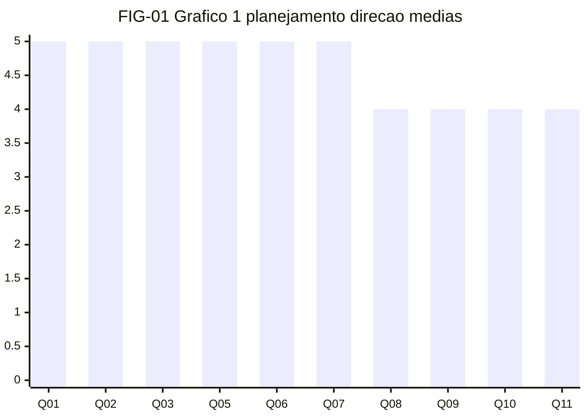
```mermaid
xychart-beta
    title "FIG-01 Grafico 1 planejamento direcao medias"
    x-axis [Q01, Q02, Q03, Q05, Q06, Q07, Q08, Q09, Q10, Q11]
    y-axis 0 --> 5
    bar [5.00, 5.00, 5.00, 5.00, 5.00, 5.00, 4.00, 4.00, 4.00, 4.00]
```

### FIG-02. Gráfico 2, planejamento pelos coordenadores (p. 21)

Médias: Q1 2,67; Q2 3,67; Q3 3,67; Q4 3,67; Q5 3,67; Q6 3,33; Q7 3,33; Q8 3,00; Q9 3,33; Q10 3,00. Percentuais ilegíveis. Texto fiel: melhorar divulgação do plano (Q1), meios de divulgação (Q8) e melhorias (Q10).

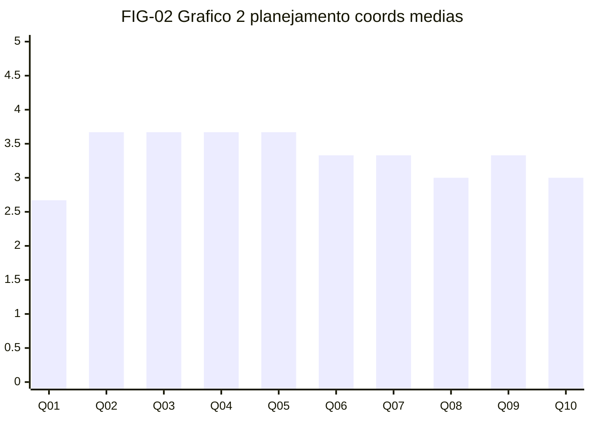
```mermaid
xychart-beta
    title "FIG-02 Grafico 2 planejamento coords medias"
    x-axis [Q01, Q02, Q03, Q04, Q05, Q06, Q07, Q08, Q09, Q10]
    y-axis 0 --> 5
    bar [2.67, 3.67, 3.67, 3.67, 3.67, 3.33, 3.33, 3.00, 3.33, 3.00]
```

### FIG-03. Gráfico 3, planejamento pelos docentes (p. 22)

Médias: Q1 3,67; Q2 4,06; Q3 4,35; Q4 4,21; Q5 3,94; Q6 4,00; Q7 3,94; Q8 3,94. Percentuais ilegíveis. Texto fiel: docentes avaliam como bom.

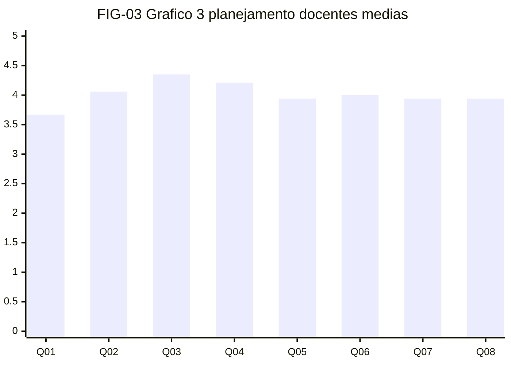
```mermaid
xychart-beta
    title "FIG-03 Grafico 3 planejamento docentes medias"
    x-axis [Q01, Q02, Q03, Q04, Q05, Q06, Q07, Q08]
    y-axis 0 --> 5
    bar [3.67, 4.06, 4.35, 4.21, 3.94, 4.00, 3.94, 3.94]
```

### FIG-04. Gráfico 4, planejamento pelos estudantes (p. 23)

Médias: Q1 3,49; Q2 3,47; Q3 3,27; Q4 3,22. Percentuais ilegíveis. Texto fiel: discentes apontam como bom.

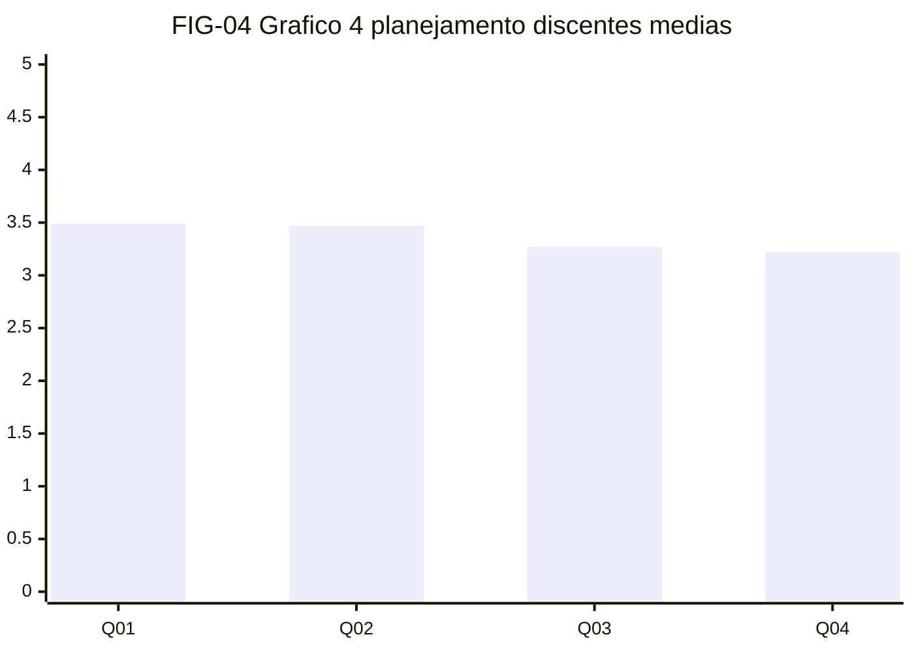
```mermaid
xychart-beta
    title "FIG-04 Grafico 4 planejamento discentes medias"
    x-axis [Q01, Q02, Q03, Q04]
    y-axis 0 --> 5
    bar [3.49, 3.47, 3.27, 3.22]
```

### FIG-05. Gráfico 5, planejamento pelos técnicos (p. 24)

Médias: Q1 3,62; Q2 3,85; Q3 3,38; Q4 3,31; Q5 3,38; Q6 3,29; Q7 3,57; Q8 3,85. Percentuais ilegíveis. Texto fiel: técnicos avaliam como bom.

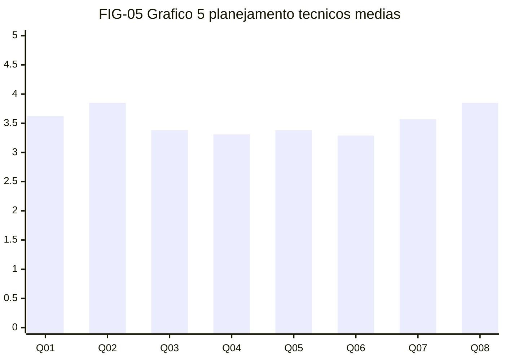
```mermaid
xychart-beta
    title "FIG-05 Grafico 5 planejamento tecnicos medias"
    x-axis [Q01, Q02, Q03, Q04, Q05, Q06, Q07, Q08]
    y-axis 0 --> 5
    bar [3.62, 3.85, 3.38, 3.31, 3.38, 3.29, 3.57, 3.85]
```

### FIG-06. Gráfico 6, PDI pela direção (p. 26)

Médias: Q1 4,00; Q2 4,00; Q3 4,00; Q4 4,00; Q5 4,00; Q6 4,00; Q7 4,00; Q8 3,00; Q9 4,00; Q10 3,00; Q11 3,00; Q12 4,00; Q13 0,00; Q14 4,00; Q15 5,00. Percentuais ilegíveis. Texto fiel: direção considera muito boa, com destaque a Q8 (linhas de pesquisa), afirmativas e empreendedorismo.

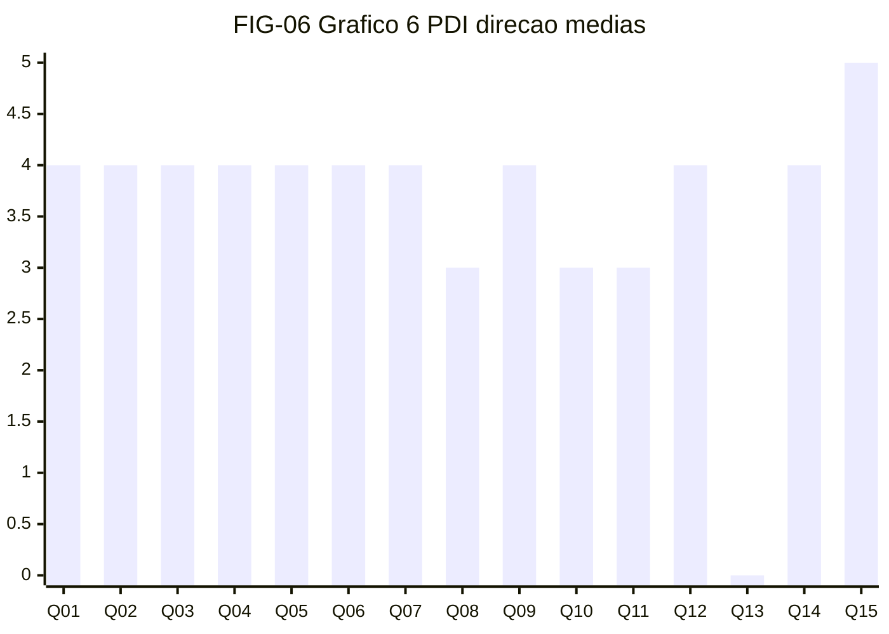
```mermaid
xychart-beta
    title "FIG-06 Grafico 6 PDI direcao medias"
    x-axis [Q01, Q02, Q03, Q04, Q05, Q06, Q07, Q08, Q09, Q10, Q11, Q12, Q13, Q14, Q15]
    y-axis 0 --> 5
    bar [4.00, 4.00, 4.00, 4.00, 4.00, 4.00, 4.00, 3.00, 4.00, 3.00, 3.00, 4.00, 0.00, 4.00, 5.00]
```

### FIG-07. Gráfico 7, PDI pelos coordenadores (p. 27)

Médias: Q1 3,67; Q2 3,33; Q3 3,33; Q4 3,33; Q5 3,00; Q6 3,67; Q7 3,67; Q8 3,50; Q9 4,50; Q10 4,50; Q11 3,33; Q12 0,00; Q13 0,00; Q14 0,00; Q15 4,00. Percentuais ilegíveis. Texto fiel: consideram bom, com observação a Q5 (avanços tecnológicos e interdisciplinaridade).

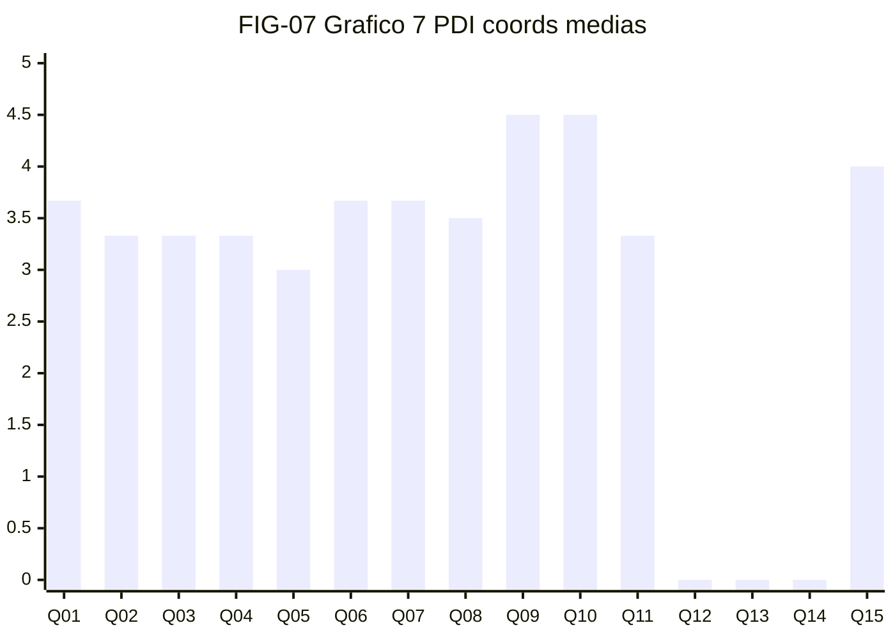
```mermaid
xychart-beta
    title "FIG-07 Grafico 7 PDI coords medias"
    x-axis [Q01, Q02, Q03, Q04, Q05, Q06, Q07, Q08, Q09, Q10, Q11, Q12, Q13, Q14, Q15]
    y-axis 0 --> 5
    bar [3.67, 3.33, 3.33, 3.33, 3.00, 3.67, 3.67, 3.50, 4.50, 4.50, 3.33, 0.00, 0.00, 0.00, 4.00]
```

### FIG-08. Gráfico 8, PDI pelos docentes (p. 29)

Médias: Q1 3,83; Q2 3,92; Q3 3,92; Q4 3,83; Q5 3,92; Q6 3,75; Q7 3,92; Q8 3,83; Q9 3,75; Q10 3,83; Q11 3,83; Q12 3,50; Q13 3,50; Q14 3,67; Q15 3,57. Percentuais ilegíveis. Texto fiel: docentes consideram bom.

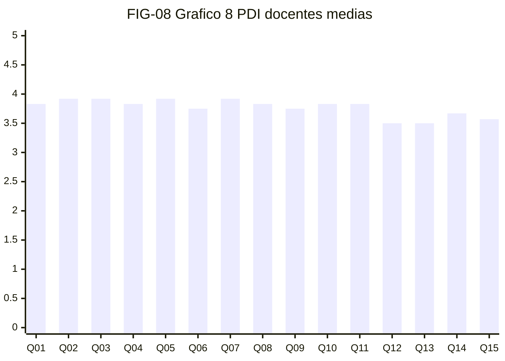
```mermaid
xychart-beta
    title "FIG-08 Grafico 8 PDI docentes medias"
    x-axis [Q01, Q02, Q03, Q04, Q05, Q06, Q07, Q08, Q09, Q10, Q11, Q12, Q13, Q14, Q15]
    y-axis 0 --> 5
    bar [3.83, 3.92, 3.92, 3.83, 3.92, 3.75, 3.92, 3.83, 3.75, 3.83, 3.83, 3.50, 3.50, 3.67, 3.57]
```

### FIG-09. Gráfico 9, PDI pelos discentes (p. 30)

Médias: Q1 3,64; Q2 3,52. Percentuais ilegíveis. Texto fiel: discentes apontam como bom.

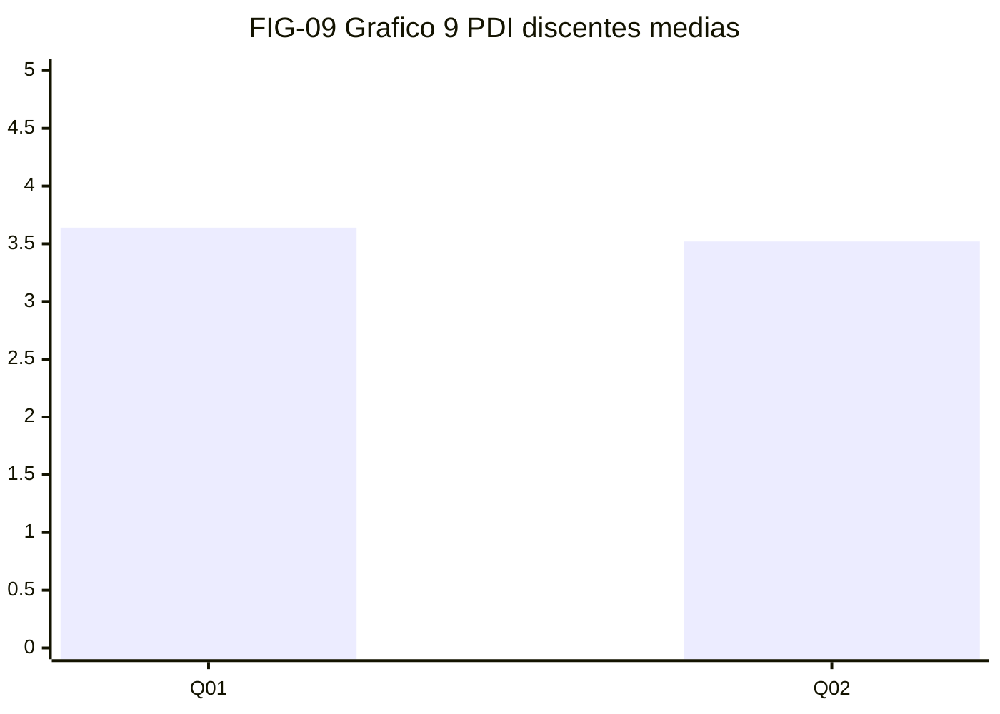
```mermaid
xychart-beta
    title "FIG-09 Grafico 9 PDI discentes medias"
    x-axis [Q01, Q02]
    y-axis 0 --> 5
    bar [3.64, 3.52]
```

### FIG-10. Gráfico 10, PDI pelos técnicos (p. 31)

Médias: Q1 4,07; Q2 3,64; Q3 3,57; Q4 3,77; Q5 3,85. Percentuais ilegíveis. Texto fiel: técnicos avaliam como bom.

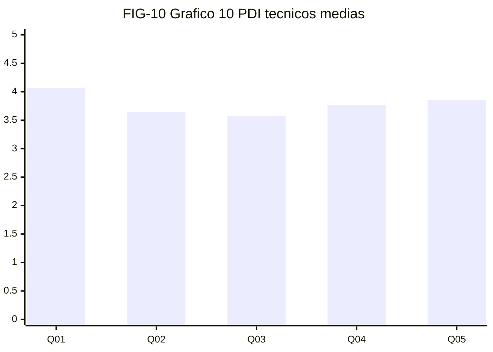
```mermaid
xychart-beta
    title "FIG-10 Grafico 10 PDI tecnicos medias"
    x-axis [Q01, Q02, Q03, Q04, Q05]
    y-axis 0 --> 5
    bar [4.07, 3.64, 3.57, 3.77, 3.85]
```

### FIG-11. Gráfico 11, ensino pela direção (p. 34)

Médias: Q1 4,00; Q2 4,00; Q3 5,00; Q4 0,00; Q5 5,00; Q6 5,00. Percentuais ilegíveis. Texto fiel: direção considera muito boa.

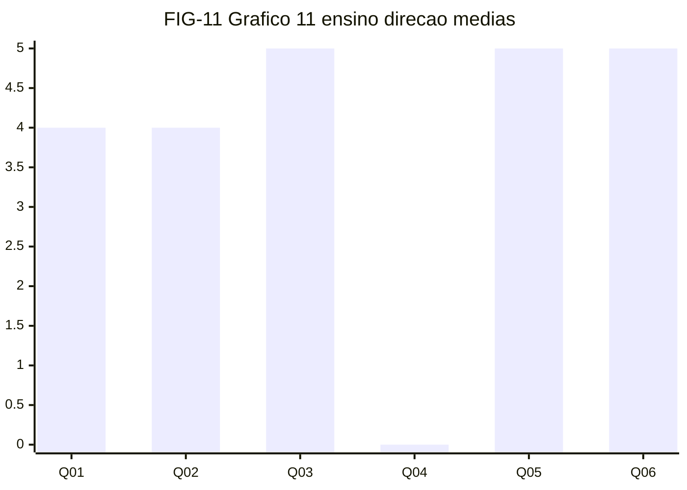
```mermaid
xychart-beta
    title "FIG-11 Grafico 11 ensino direcao medias"
    x-axis [Q01, Q02, Q03, Q04, Q05, Q06]
    y-axis 0 --> 5
    bar [4.00, 4.00, 5.00, 0.00, 5.00, 5.00]
```

### FIG-12. Gráfico 12, ensino pelos coordenadores (p. 35)

Médias: Q1 3,00; Q2 3,33; Q3 3,67; Q4 1,00; Q5 3,33. Percentuais ilegíveis. Texto fiel: ponto a melhorar é a divulgação no meio acadêmico (Q1).

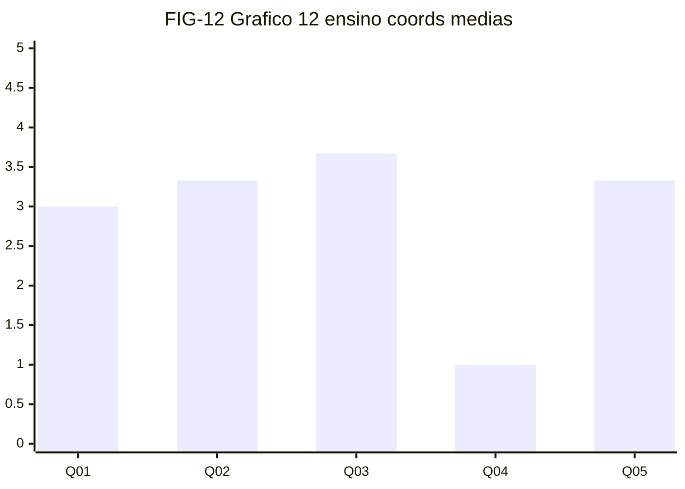
```mermaid
xychart-beta
    title "FIG-12 Grafico 12 ensino coords medias"
    x-axis [Q01, Q02, Q03, Q04, Q05]
    y-axis 0 --> 5
    bar [3.00, 3.33, 3.67, 1.00, 3.33]
```

### FIG-13. Gráfico 13, ensino pelos docentes (p. 36)

Médias: Q1 3,71; Q2 3,67; Q3 3,65; Q4 2,77; Q5 4,05. Percentuais ilegíveis. Texto fiel com defeito preservado: menciona técnico-administrativos onde o contexto é docente; observação a EAD (Q4).

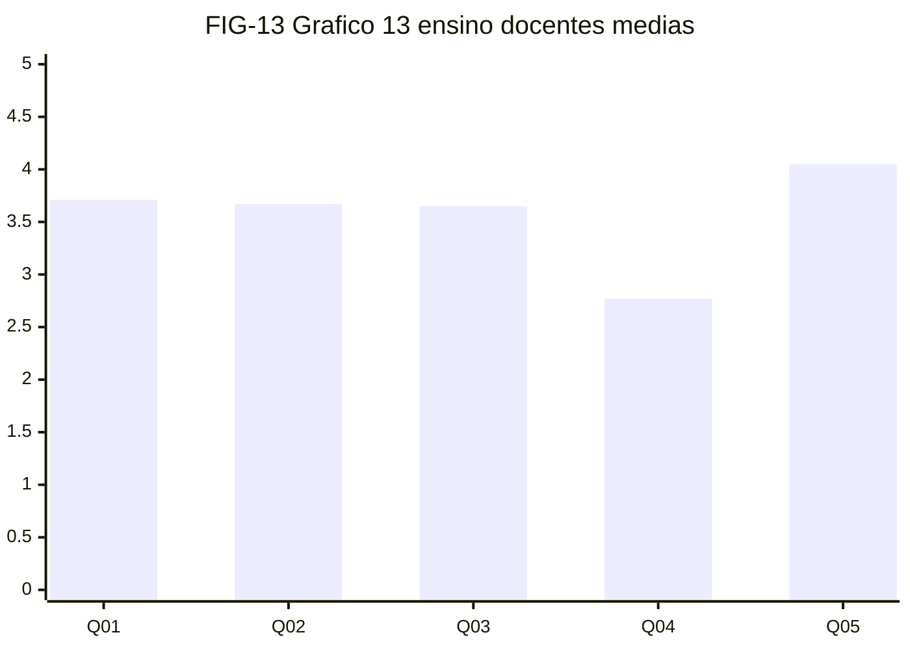
```mermaid
xychart-beta
    title "FIG-13 Grafico 13 ensino docentes medias"
    x-axis [Q01, Q02, Q03, Q04, Q05]
    y-axis 0 --> 5
    bar [3.71, 3.67, 3.65, 2.77, 4.05]
```

### FIG-14. Gráfico 14, ensino pelos estudantes (p. 37)

Médias: Q1 3,54; Q2 3,61; Q3 3,42; Q4 3,21; Q5 3,31; Q6 2,98. Percentuais ilegíveis. Texto fiel: estudantes consideram boa; de modo geral positiva.

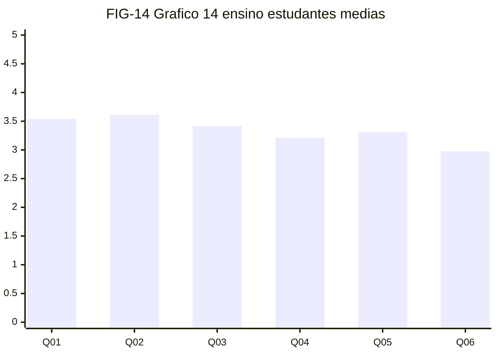
```mermaid
xychart-beta
    title "FIG-14 Grafico 14 ensino estudantes medias"
    x-axis [Q01, Q02, Q03, Q04, Q05, Q06]
    y-axis 0 --> 5
    bar [3.54, 3.61, 3.42, 3.21, 3.31, 2.98]
```

### FIG-15. Gráfico 15, pesquisa pela direção (p. 40)

Médias: Q1 4,00; Q2 3,00; Q3 5,00; Q4 4,00; Q5 1,00. Percentuais ilegíveis. Texto fiel: direção considera boa, com observação à implantação (Q2).

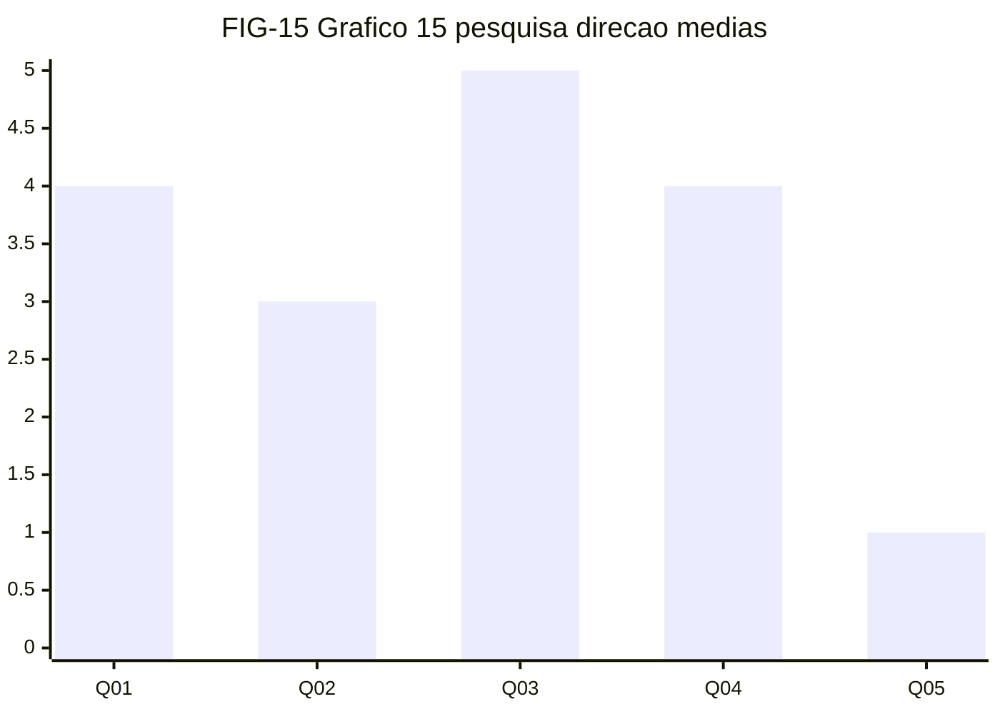
```mermaid
xychart-beta
    title "FIG-15 Grafico 15 pesquisa direcao medias"
    x-axis [Q01, Q02, Q03, Q04, Q05]
    y-axis 0 --> 5
    bar [4.00, 3.00, 5.00, 4.00, 1.00]
```

### FIG-16. Gráfico 16, pesquisa pelos coordenadores (p. 41)

Médias: Q1 2,67; Q2 2,67; Q3 3,00; Q4 3,00; Q5 2,33. Percentuais ilegíveis. Texto fiel: todos os pontos precisam ser melhorados.

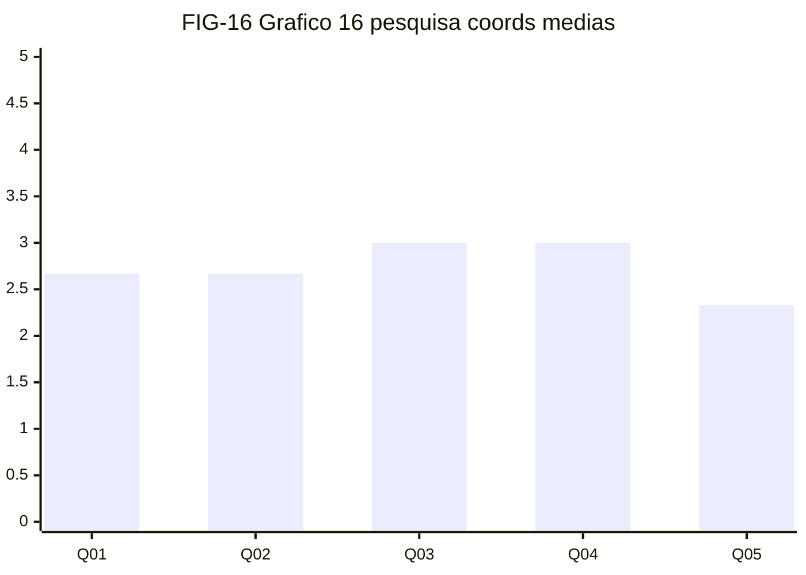
```mermaid
xychart-beta
    title "FIG-16 Grafico 16 pesquisa coords medias"
    x-axis [Q01, Q02, Q03, Q04, Q05]
    y-axis 0 --> 5
    bar [2.67, 2.67, 3.00, 3.00, 2.33]
```

### FIG-17. Gráfico 17, pesquisa pelos docentes (p. 42)

Médias: Q1 3,42; Q2 2,84; Q3 3,26; Q4 2,95; Q5 2,50. Percentuais ilegíveis. Texto fiel: precisam ser melhor desenvolvidas.

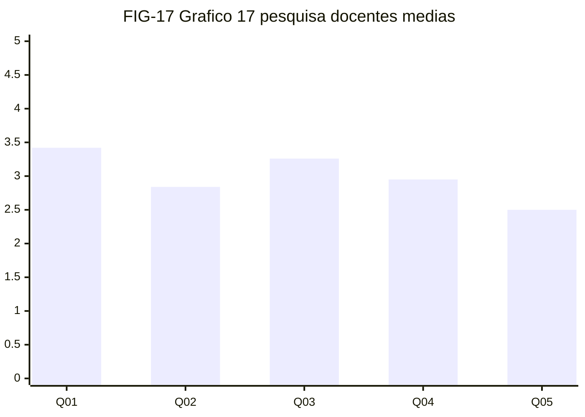
```mermaid
xychart-beta
    title "FIG-17 Grafico 17 pesquisa docentes medias"
    x-axis [Q01, Q02, Q03, Q04, Q05]
    y-axis 0 --> 5
    bar [3.42, 2.84, 3.26, 2.95, 2.50]
```

### FIG-18. Gráfico 18, pesquisa pelos estudantes (p. 43)

Médias: Q1 3,35; Q2 3,34; Q3 2,90. Percentuais ilegíveis. Texto fiel com defeito preservado: diz pelos coordenadores de graduação onde o contexto é estudantes; boas, com mais estímulo à participação.

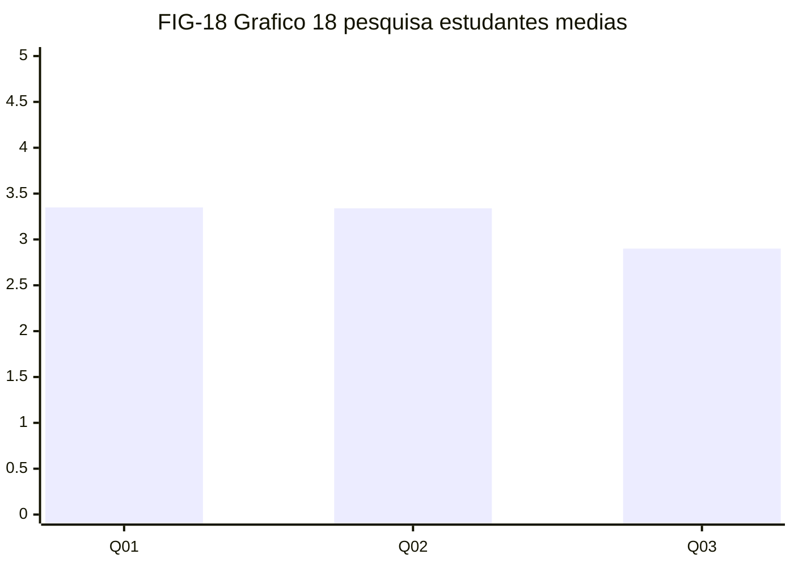
```mermaid
xychart-beta
    title "FIG-18 Grafico 18 pesquisa estudantes medias"
    x-axis [Q01, Q02, Q03]
    y-axis 0 --> 5
    bar [3.35, 3.34, 2.90]
```

### FIG-19. Gráfico 19, extensão pela direção (p. 45)

Médias: Q1 5,00; Q2 3,00; Q3 5,00; Q4 4,00; Q5 4,00. Percentuais ilegíveis. Texto fiel: boa, com observação à implantação (Q2).

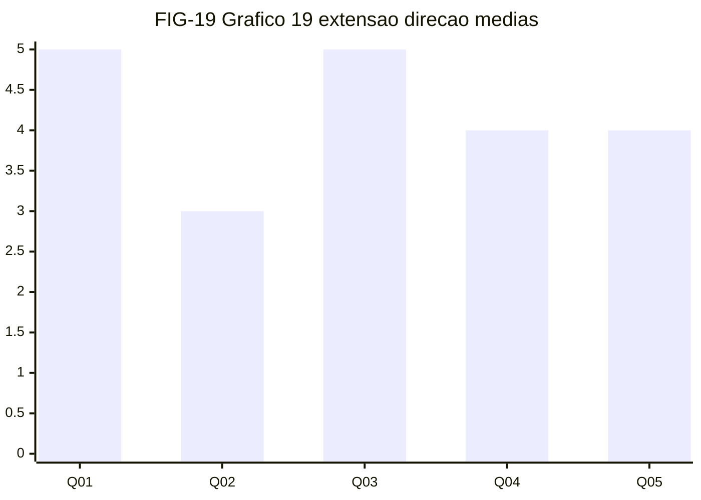
```mermaid
xychart-beta
    title "FIG-19 Grafico 19 extensao direcao medias"
    x-axis [Q01, Q02, Q03, Q04, Q05]
    y-axis 0 --> 5
    bar [5.00, 3.00, 5.00, 4.00, 4.00]
```

### FIG-20. Gráfico 20, extensão pelos coordenadores (p. 46)

Médias: Q1 4,00; Q2 3,00; Q3 3,33; Q4 4,00; Q5 2,50. Percentuais ilegíveis. Texto fiel: boas; estimular publicações de revistas.

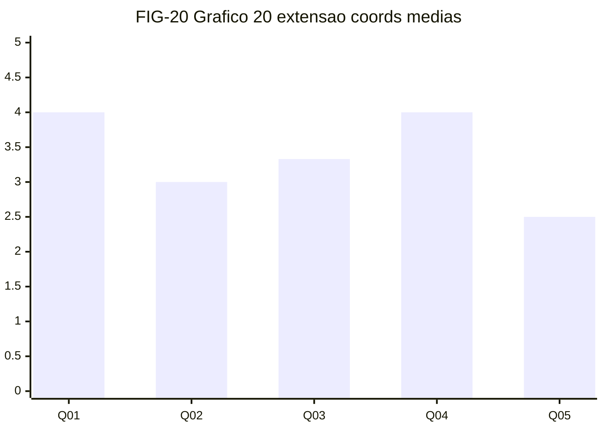
```mermaid
xychart-beta
    title "FIG-20 Grafico 20 extensao coords medias"
    x-axis [Q01, Q02, Q03, Q04, Q05]
    y-axis 0 --> 5
    bar [4.00, 3.00, 3.33, 4.00, 2.50]
```

### FIG-21. Gráfico 21, extensão pelos docentes (p. 47)

Médias: Q1 3,65; Q2 3,65; Q3 3,72. Percentuais ilegíveis. Texto fiel: docentes consideram boas.

```mermaid
xychart-beta
    title "FIG-21 Grafico 21 extensao docentes medias"
    x-axis [Q01, Q02, Q03]
    y-axis 0 --> 5
    bar [3.65, 3.65, 3.72]
```

### FIG-22. Gráfico 22, extensão pelos estudantes (p. 48)

Médias: Q1 3,18; Q2 3,13; Q3 2,95. Percentuais ilegíveis. Texto fiel: boas, mas melhorar o estímulo a projetos (Q3); melhorar revistas e estímulo, essencial o programa de bolsas.

```mermaid
xychart-beta
    title "FIG-22 Grafico 22 extensao estudantes medias"
    x-axis [Q01, Q02, Q03]
    y-axis 0 --> 5
    bar [3.18, 3.13, 2.95]
```

### FIG-23. Gráfico 23, egressos pela direção (p. 50)

Médias: Q1 2,00; Q2 2,00; Q3 0,00; Q4 3,00. Percentuais ilegíveis. Texto fiel: direção avalia como deficitária.

```mermaid
xychart-beta
    title "FIG-23 Grafico 23 egressos direcao medias"
    x-axis [Q01, Q02, Q03, Q04]
    y-axis 0 --> 5
    bar [2.00, 2.00, 0.00, 3.00]
```

### FIG-24. Gráfico 24, egressos pelos coordenadores (p. 51)

Médias: Q1 2,00; Q2 1,67; Q3 2,00; Q4 2,00. Percentuais ilegíveis. Texto fiel: necessário melhorar a política.

```mermaid
xychart-beta
    title "FIG-24 Grafico 24 egressos coords medias"
    x-axis [Q01, Q02, Q03, Q04]
    y-axis 0 --> 5
    bar [2.00, 1.67, 2.00, 2.00]
```

### FIG-25. Gráfico 25, egressos pelos docentes (p. 52)

Médias: Q1 2,44; Q2 2,11; Q3 1,89; Q4 2,11. Percentuais ilegíveis. Texto fiel: necessário melhorar ações; item precisa ser melhor estruturado na UFMS.

```mermaid
xychart-beta
    title "FIG-25 Grafico 25 egressos docentes medias"
    x-axis [Q01, Q02, Q03, Q04]
    y-axis 0 --> 5
    bar [2.44, 2.11, 1.89, 2.11]
```

### FIG-26. Gráfico 26, internacionalização pela direção (p. 54)

Médias: Q1 4,00; Q2 3,00; Q3 0,00; Q4 0,00; Q5 4,00; Q6 0,00. Percentuais ilegíveis. Texto fiel: direção considera boa.

```mermaid
xychart-beta
    title "FIG-26 Grafico 26 internacionalizacao direcao medias"
    x-axis [Q01, Q02, Q03, Q04, Q05, Q06]
    y-axis 0 --> 5
    bar [4.00, 3.00, 0.00, 0.00, 4.00, 0.00]
```

### FIG-27. Gráfico 27, internacionalização pelos coordenadores (p. 55)

Médias: Q1 3,00; Q2 2,00; Q3 2,00; Q4 1,50; Q5 2,00; Q6 2,00. Percentuais ilegíveis. Texto fiel: preciso melhorar divulgação, atividades, coordenação e inovação.

```mermaid
xychart-beta
    title "FIG-27 Grafico 27 internacionalizacao coords medias"
    x-axis [Q01, Q02, Q03, Q04, Q05, Q06]
    y-axis 0 --> 5
    bar [3.00, 2.00, 2.00, 1.50, 2.00, 2.00]
```

### FIG-28. Gráfico 28, internacionalização pelos docentes (p. 56)

Médias: Q1 3,00; Q2 2,78; Q3 2,72; Q4 2,29; Q5 2,76. Percentuais ilegíveis. Texto fiel: todas as questões precisam ser melhor desenvolvidas.

```mermaid
xychart-beta
    title "FIG-28 Grafico 28 internacionalizacao docentes medias"
    x-axis [Q01, Q02, Q03, Q04, Q05]
    y-axis 0 --> 5
    bar [3.00, 2.78, 2.72, 2.29, 2.76]
```

### FIG-29. Gráfico 29, internacionalização pelos estudantes (p. 57)

Médias: Q1 2,79; Q2 2,72. Percentuais ilegíveis. Texto fiel: mais divulgação e melhor implantação; necessidade de desenvolver mais atividades.

```mermaid
xychart-beta
    title "FIG-29 Grafico 29 internacionalizacao estudantes medias"
    x-axis [Q01, Q02]
    y-axis 0 --> 5
    bar [2.79, 2.72]
```

### FIG-30. Gráfico 30, comunicação pela direção (p. 59)

Médias: Q1 5,00; Q2 5,00; Q3 4,00; Q4 5,00; Q5 4,00; Q6 5,00. Percentuais ilegíveis. Texto fiel: direção avalia como muito boa.

```mermaid
xychart-beta
    title "FIG-30 Grafico 30 comunicacao direcao medias"
    x-axis [Q01, Q02, Q03, Q04, Q05, Q06]
    y-axis 0 --> 5
    bar [5.00, 5.00, 4.00, 5.00, 4.00, 5.00]
```

### FIG-31. Gráfico 31, comunicação pelos coordenadores (p. 60)

Médias: Q1 2,33; Q2 3,00; Q3 3,67; Q4 3,67; Q5 3,67; Q6 3,00. Percentuais ilegíveis. Texto fiel: boa, com apontamento à eficiência dos canais (Q1).

```mermaid
xychart-beta
    title "FIG-31 Grafico 31 comunicacao coords medias"
    x-axis [Q01, Q02, Q03, Q04, Q05, Q06]
    y-axis 0 --> 5
    bar [2.33, 3.00, 3.67, 3.67, 3.67, 3.00]
```

### FIG-32. Gráfico 32, comunicação pelos docentes (p. 61)

Médias: Q1 3,35; Q2 3,58; Q3 3,15; Q4 3,65. Percentuais ilegíveis. Texto fiel: docentes consideram boa.

```mermaid
xychart-beta
    title "FIG-32 Grafico 32 comunicacao docentes medias"
    x-axis [Q01, Q02, Q03, Q04]
    y-axis 0 --> 5
    bar [3.35, 3.58, 3.15, 3.65]
```

### FIG-33. Gráfico 33, comunicação pelos estudantes (p. 62)

Médias: Q1 3,35; Q2 3,31; Q3 3,32. Percentuais ilegíveis. Texto fiel: estudantes consideram boa.

```mermaid
xychart-beta
    title "FIG-33 Grafico 33 comunicacao estudantes medias"
    x-axis [Q01, Q02, Q03]
    y-axis 0 --> 5
    bar [3.35, 3.31, 3.32]
```

### FIG-34. Gráfico 34, comunicação pelos técnicos (p. 63)

Médias: Q1 3,92; Q2 4,08; Q3 3,75. Percentuais ilegíveis. Texto fiel: técnicos consideram muito boa; síntese com defeito preservado (eficiência dos canais). Defeito preservado: questões de TICs/PDTIC onde o contexto é comunicação.

```mermaid
xychart-beta
    title "FIG-34 Grafico 34 comunicacao tecnicos medias"
    x-axis [Q01, Q02, Q03]
    y-axis 0 --> 5
    bar [3.92, 4.08, 3.75]
```

### FIG-35. Gráfico 35, atendimento pela direção (p. 66)

Médias: Q1 4,00; Q2 3,00; Q3 0,00; Q4 2,00; Q5 4,00; Q6 3,00. Percentuais ilegíveis. Texto fiel: melhorar acessibilidade (Q2), psicopedagógico (Q4) e inovação (Q6).

```mermaid
xychart-beta
    title "FIG-35 Grafico 35 atendimento direcao medias"
    x-axis [Q01, Q02, Q03, Q04, Q05, Q06]
    y-axis 0 --> 5
    bar [4.00, 3.00, 0.00, 2.00, 4.00, 3.00]
```

### FIG-36. Gráfico 36, atendimento pelos coordenadores (p. 67)

Médias: Q1 3,00; Q2 3,00; Q3 3,00; Q4 3,50; Q5 3,50; Q6 3,50. Percentuais ilegíveis. Texto fiel: podem ser melhoradas.

```mermaid
xychart-beta
    title "FIG-36 Grafico 36 atendimento coords medias"
    x-axis [Q01, Q02, Q03, Q04, Q05, Q06]
    y-axis 0 --> 5
    bar [3.00, 3.00, 3.00, 3.50, 3.50, 3.50]
```

### FIG-37. Gráfico 37, atendimento pelos docentes (p. 68)

Médias: Q1 3,42; Q2 3,30; Q3 3,25; Q4 3,53. Percentuais ilegíveis. Texto fiel: docentes consideram boas.

```mermaid
xychart-beta
    title "FIG-37 Grafico 37 atendimento docentes medias"
    x-axis [Q01, Q02, Q03, Q04]
    y-axis 0 --> 5
    bar [3.42, 3.30, 3.25, 3.53]
```

### FIG-38. Gráfico 38, atendimento pelos estudantes (p. 69)

Médias: Q1 3,00; Q2 3,15; Q3 3,19. Percentuais ilegíveis. Texto fiel: estudantes consideram boa; melhorar acessibilidade, inovação e psicopedagógico.

```mermaid
xychart-beta
    title "FIG-38 Grafico 38 atendimento estudantes medias"
    x-axis [Q01, Q02, Q03]
    y-axis 0 --> 5
    bar [3.00, 3.15, 3.19]
```

### FIG-39. Gráfico 39, estímulo pela direção (p. 71)

Médias: Q1 5,00; Q2 4,00. Percentuais ilegíveis. Texto fiel: direção avalia como boa.

```mermaid
xychart-beta
    title "FIG-39 Grafico 39 estimulo direcao medias"
    x-axis [Q01, Q02]
    y-axis 0 --> 5
    bar [5.00, 4.00]
```

### FIG-40. Gráfico 40, estímulo pelos coordenadores (p. 72)

Médias: Q1 3,33; Q2 2,67. Percentuais ilegíveis. Texto fiel: necessário melhor apoio à produção e publicação.

```mermaid
xychart-beta
    title "FIG-40 Grafico 40 estimulo coords medias"
    x-axis [Q01, Q02]
    y-axis 0 --> 5
    bar [3.33, 2.67]
```

### FIG-41. Gráfico 41, estímulo pelos docentes (p. 73)

Médias: Q1 3,00; Q2 2,89. Percentuais ilegíveis. Texto fiel: melhorar apoio financeiro/logístico e à produção.

```mermaid
xychart-beta
    title "FIG-41 Grafico 41 estimulo docentes medias"
    x-axis [Q01, Q02]
    y-axis 0 --> 5
    bar [3.00, 2.89]
```

### FIG-42. Gráfico 42, estímulo pelos estudantes (p. 74)

Médias: Q1 2,91; Q2 2,94. Percentuais ilegíveis. Texto fiel: melhorar apoio financeiro/logístico e à produção.

```mermaid
xychart-beta
    title "FIG-42 Grafico 42 estimulo estudantes medias"
    x-axis [Q01, Q02]
    y-axis 0 --> 5
    bar [2.91, 2.94]
```

### FIG-43. Gráfico 43, capacitação docente pelo diretor (p. 80)

Médias: Q1 4,00; Q2 4,00. Percentuais ilegíveis. Texto fiel: totalidade com conceito bom.

```mermaid
xychart-beta
    title "FIG-43 Grafico 43 capacitacao docentes diretor medias"
    x-axis [Q01, Q02]
    y-axis 0 --> 5
    bar [4.00, 4.00]
```

### FIG-44. Gráfico 44, capacitação docente pelos coordenadores (p. 81)

Médias: Q1 4,00; Q2 4,00. Percentuais ilegíveis. Texto fiel: entre parcialmente satisfatório e muito bom.

```mermaid
xychart-beta
    title "FIG-44 Grafico 44 capacitacao docentes coords medias"
    x-axis [Q01, Q02]
    y-axis 0 --> 5
    bar [4.00, 4.00]
```

### FIG-45. Gráfico 45, capacitação docente pelos docentes (p. 82)

Médias: Q1 3,70; Q2 4,24. Percentuais do corpo do texto: Q1 com 28,57 muito bom, 28,57 bom, 28,57 satisfatório, 9,52 insatisfatório, 4,76 NSA; Q2 com 42,86 bom, 28,57 muito bom, 9,52 satisfatório, 19,05 NSA. 21 respondentes. Texto fiel: políticas garantem participação e qualificação.

```mermaid
xychart-beta
    title "FIG-45 Grafico 45 capacitacao docentes docentes medias"
    x-axis [Q01, Q02]
    y-axis 0 --> 5
    bar [3.70, 4.24]
```

### FIG-46. Gráfico 46, capacitação de técnicos pelo diretor (p. 85)

Médias: Q1 4,00; Q2 4,00. Percentuais ilegíveis. Texto fiel: boa nas duas questões.

```mermaid
xychart-beta
    title "FIG-46 Grafico 46 capacitacao tecnicos diretor medias"
    x-axis [Q01, Q02]
    y-axis 0 --> 5
    bar [4.00, 4.00]
```

### FIG-47. Gráfico 47, capacitação de técnicos pelos técnicos (p. 86)

Médias: Q1 3,50; Q2 3,21. Percentuais do corpo do texto: Q1 com 42,86 boa, 28,57 satisfatória, 14,29 muito boa, 7,14 parcial e 7,14 insatisfatória; Q2 com 50,00 boa, 21,43 satisfatória e 21,43 insatisfatória, 7,14 muito boa. 14 respondentes. Texto fiel: afastamentos difíceis em unidades pequenas.

```mermaid
xychart-beta
    title "FIG-47 Grafico 47 capacitacao tecnicos tecnicos medias"
    x-axis [Q01, Q02]
    y-axis 0 --> 5
    bar [3.50, 3.21]
```

### FIG-48. Gráfico 48, gestão pelo diretor (p. 89)

Médias: Q1 4,00; Q2 5,00; Q3 5,00; Q4 5,00. Percentuais ilegíveis. Texto fiel: Q1 satisfatória; demais muito bom.

```mermaid
xychart-beta
    title "FIG-48 Grafico 48 gestao diretor medias"
    x-axis [Q01, Q02, Q03, Q04]
    y-axis 0 --> 5
    bar [4.00, 5.00, 5.00, 5.00]
```

### FIG-49. Gráfico 49, gestão pelos coordenadores (p. 90)

Médias: Q1 3,67; Q2 3,33; Q3 3,67; Q4 3,00. Percentuais do corpo do texto: Q1 com empate de 33,33 em muito bom, bom e parcial; Q2 com empate de 33,33 em muito bom, satisfatório e parcial; Q3 com 66,67 bom e 33,33 satisfatório; Q4 com empate de 33,33 em bom, satisfatório e parcial.

```mermaid
xychart-beta
    title "FIG-49 Grafico 49 gestao coords medias"
    x-axis [Q01, Q02, Q03, Q04]
    y-axis 0 --> 5
    bar [3.67, 3.33, 3.67, 3.00]
```

### FIG-50. Gráfico 50, gestão pelos docentes (p. 91)

Médias: Q1 3,58; Q2 3,30; Q3 3,79; Q4 3,53. Percentuais do corpo do texto: Q1 com 28,57 muito bom, 23,81 bom, 19,05 satisfatório, 9,52 parcial, 9,52 insatisfatório, 9,52 NSA; Q2 com 23,81 muito boa, 14,29 boa, 28,57 satisfatória, 23,81 parcial, 4,76 insatisfatória, 4,76 NSA (menor); Q3 com 33,33 muito boa, 19,05 boa, 28,57 satisfatória, 4,76 parcial, 4,76 insatisfatória, 9,52 NSA (maior); Q4 com 23,81 muito bom, 28,57 bom, 19,05 satisfatório, 9,52 parcial, 9,52 insatisfatório, 9,52 NSA.

```mermaid
xychart-beta
    title "FIG-50 Grafico 50 gestao docentes medias"
    x-axis [Q01, Q02, Q03, Q04]
    y-axis 0 --> 5
    bar [3.58, 3.30, 3.79, 3.53]
```

### FIG-51. Gráfico 51, gestão pelos estudantes (p. 93)

Médias: Q1 3,37; Q2 2,81; Q3 3,05. Percentuais do corpo do texto: Q1 com 14,63 muito bom, 34,76 bom, 25,61 satisfatório, 14,63 parcial, 6,71 insatisfatório, 3,66 NSA; Q2 com 6,71 muito bom, 25,00 bom, 28,05 satisfatória, 18,29 parcial, 19,51 insatisfatório, 2,44 NSA; Q3 com 6,10 muito boa, 33,54 boa, 25,61 satisfatória, 18,90 parcial, 10,98 insatisfatória, 4,88 NSA.

```mermaid
xychart-beta
    title "FIG-51 Grafico 51 gestao estudantes medias"
    x-axis [Q01, Q02, Q03]
    y-axis 0 --> 5
    bar [3.37, 2.81, 3.05]
```

### FIG-52. Gráfico 52, gestão pelos técnicos (p. 94)

Médias: Q1 3,71; Q2 3,36; Q3 3,14; Q4 3,50. Percentuais do corpo do texto: Q1 com 64,29 bom, 7,14 muito bom, 21,43 satisfatório, 7,14 parcial; Q2 com 50,00 boa, 7,14 muito boa, 21,43 satisfatória, 14,29 parcial, 7,14 insatisfatória; Q3 com 7,14 muito boa, 42,86 boa, 14,29 satisfatória, 28,57 parcial, 7,14 insatisfatória; Q4 com 57,14 boa, 7,14 muito boa, 14,29 satisfatória, 21,43 parcial. Conceito bom.

```mermaid
xychart-beta
    title "FIG-52 Grafico 52 gestao tecnicos medias"
    x-axis [Q01, Q02, Q03, Q04]
    y-axis 0 --> 5
    bar [3.71, 3.36, 3.14, 3.50]
```

### FIG-53. Gráfico 53, sustentabilidade pelo diretor (p. 97)

Médias: Q1 5,00; Q2 5,00; Q3 5,00. Percentuais ilegíveis. Texto fiel: nota máxima, muito boa.

```mermaid
xychart-beta
    title "FIG-53 Grafico 53 sustentabilidade diretor medias"
    x-axis [Q01, Q02, Q03]
    y-axis 0 --> 5
    bar [5.00, 5.00, 5.00]
```

### FIG-54. Gráfico 54, sustentabilidade pelos coordenadores (p. 98)

Médias: Q1 2,67; Q2 3,00; Q3 3,00. Percentuais do corpo do texto: Q1 com 33,33 boa, 33,33 satisfatória, 33,33 insatisfatória; Q2 com 33,33 boa, 33,33 parcial, 33,33 NSA; Q3 com 66,67 satisfatórias, 33,33 NSA.

```mermaid
xychart-beta
    title "FIG-54 Grafico 54 sustentabilidade coords medias"
    x-axis [Q01, Q02, Q03]
    y-axis 0 --> 5
    bar [2.67, 3.00, 3.00]
```

### FIG-55. Gráfico 55, sustentabilidade pelos técnicos (p. 99)

Médias: Q1 3,36. Percentuais do corpo do texto: 50,00 bom, 35,71 satisfatório, 14,29 parcial. Questão única de fontes captadoras.

```mermaid
xychart-beta
    title "FIG-55 Grafico 55 sustentabilidade tecnicos medias"
    x-axis [Q01]
    y-axis 0 --> 5
    bar [3.36]
```

### FIG-56. Gráfico 56, instalações administrativas pelo diretor (p. 102)

Médias: Q1 4,00; Q2 4,00; Q3 3,00. Percentuais ilegíveis. Texto fiel: adequação 4,00, manutenção 4,00, acessibilidade 3,00.

```mermaid
xychart-beta
    title "FIG-56 Grafico 56 instalacoes adm diretor medias"
    x-axis [Q01, Q02, Q03]
    y-axis 0 --> 5
    bar [4.00, 4.00, 3.00]
```

### FIG-57. Gráfico 57, instalações administrativas pelos coordenadores (p. 103)

Médias: Q1 3,67; Q2 3,33; Q3 3,67. Percentuais ilegíveis. Texto fiel: adequação 3,67, manutenção 3,67, acessibilidade 3,33. Rótulo Q3 sem acento no original (Media, defeito preservado).

```mermaid
xychart-beta
    title "FIG-57 Grafico 57 instalacoes adm coords medias"
    x-axis [Q01, Q02, Q03]
    y-axis 0 --> 5
    bar [3.67, 3.33, 3.67]
```

### FIG-58. Gráfico 58, instalações administrativas pelos técnicos (p. 104)

Médias: Q1 4,14; Q2 3,21; Q3 4,07. Percentuais ilegíveis. Texto fiel: maior adequação 4,14; menor acessibilidade 3,21; satisfação parcial com adequação e acessibilidade.

```mermaid
xychart-beta
    title "FIG-58 Grafico 58 instalacoes adm tecnicos medias"
    x-axis [Q01, Q02, Q03]
    y-axis 0 --> 5
    bar [4.14, 3.21, 4.07]
```

### FIG-59. Gráfico 59, salas de aula pelo diretor (p. 106)

Médias: Q1 4,00; Q2 4,00; Q3 4,00; Q4 2,00. Percentuais ilegíveis. Título com defeito diz instalações administrativas onde o contexto é salas de aula (defeito preservado). Texto fiel: adequação, acessibilidade e manutenção 4,00; recursos tecnológicos 2,00.

```mermaid
xychart-beta
    title "FIG-59 Grafico 59 salas aula diretor medias"
    x-axis [Q01, Q02, Q03, Q04]
    y-axis 0 --> 5
    bar [4.00, 4.00, 4.00, 2.00]
```

### FIG-60. Gráfico 60, salas de aula pelos coordenadores (p. 107)

Médias: Q1 3,33; Q2 3,33; Q3 3,33; Q4 3,00. Percentuais ilegíveis. Título com defeito igual ao FIG-59 (defeito preservado). Texto fiel: adequação, acessibilidade e manutenção 3,33; recursos 3,00.

```mermaid
xychart-beta
    title "FIG-60 Grafico 60 salas aula coords medias"
    x-axis [Q01, Q02, Q03, Q04]
    y-axis 0 --> 5
    bar [3.33, 3.33, 3.33, 3.00]
```

### FIG-61. Gráfico 61, salas de aula pelos docentes (p. 108)

Médias: Q1 4,05; Q2 3,67; Q3 4,00; Q4 3,05. Percentuais ilegíveis. Título com defeito igual ao FIG-59 (defeito preservado). Texto fiel: média geral 3,69, boa; salas atendem docentes e alunos.

```mermaid
xychart-beta
    title "FIG-61 Grafico 61 salas aula docentes medias"
    x-axis [Q01, Q02, Q03, Q04]
    y-axis 0 --> 5
    bar [4.05, 3.67, 4.00, 3.05]
```

### FIG-62. Gráfico 62, auditórios pelo diretor (p. 110)

Médias: Q1 2,00; Q2 3,00; Q3 5,00. Percentuais ilegíveis. Texto fiel: acessibilidade 2,00, conforto e acústica 3,00, multimídia 5,00.

```mermaid
xychart-beta
    title "FIG-62 Grafico 62 auditorios diretor medias"
    x-axis [Q01, Q02, Q03]
    y-axis 0 --> 5
    bar [2.00, 3.00, 5.00]
```

### FIG-63. Gráfico 63, auditórios pelos coordenadores (p. 111)

Médias: Q1 2,67; Q2 2,67; Q3 2,67. Percentuais ilegíveis. Texto fiel: todos 2,67, parcialmente insatisfatório e insatisfatório.

```mermaid
xychart-beta
    title "FIG-63 Grafico 63 auditorios coords medias"
    x-axis [Q01, Q02, Q03]
    y-axis 0 --> 5
    bar [2.67, 2.67, 2.67]
```

### FIG-64. Gráfico 64, auditórios pelos docentes (p. 112)

Médias: Q1 3,05; Q2 3,25; Q3 3,68. Percentuais ilegíveis. Texto fiel: maior 3,68, menor 3,05; auditório já não atende a demanda dos três cursos.

```mermaid
xychart-beta
    title "FIG-64 Grafico 64 auditorios docentes medias"
    x-axis [Q01, Q02, Q03]
    y-axis 0 --> 5
    bar [3.05, 3.25, 3.68]
```

### FIG-65. Gráfico 65, auditórios pelos técnicos (p. 113)

Médias: Q1 3,50; Q2 3,57; Q3 4,00. Percentuais ilegíveis. Texto fiel: satisfatórios e muito bom; máxima 4,00.

```mermaid
xychart-beta
    title "FIG-65 Grafico 65 auditorios tecnicos medias"
    x-axis [Q01, Q02, Q03]
    y-axis 0 --> 5
    bar [3.50, 3.57, 4.00]
```

### FIG-66. Gráfico 66, auditórios pelos discentes (p. 114)

Médias: Q1 3,26; Q2 3,33; Q3 3,35. Percentuais do corpo do texto: 70 por cento entre bom, muito bom e satisfatório; máxima 3,35. Texto fiel: avaliação dos alunos com máxima 3,35.

```mermaid
xychart-beta
    title "FIG-66 Grafico 66 auditorios discentes medias"
    x-axis [Q01, Q02, Q03]
    y-axis 0 --> 5
    bar [3.26, 3.33, 3.35]
```

### FIG-67. Gráfico 67, salas de professores pelo diretor (p. 116)

Médias: Q1 5,00; Q2 4,00; Q3 5,00; Q4 3,00. Percentuais ilegíveis. Texto fiel: atendimento e manutenção 5,00, recursos 3,00, acessibilidade 4,00.

```mermaid
xychart-beta
    title "FIG-67 Grafico 67 salas professores diretor medias"
    x-axis [Q01, Q02, Q03, Q04]
    y-axis 0 --> 5
    bar [5.00, 4.00, 5.00, 3.00]
```

### FIG-68. Gráfico 68, salas de professores pelos coordenadores (p. 117)

Médias: Q1 4,33; Q2 4,00; Q3 4,00; Q4 3,33. Percentuais ilegíveis. Texto fiel: maior atendimento 4,33; menor recursos 3,33.

```mermaid
xychart-beta
    title "FIG-68 Grafico 68 salas professores coords medias"
    x-axis [Q01, Q02, Q03, Q04]
    y-axis 0 --> 5
    bar [4.33, 4.00, 4.00, 3.33]
```

### FIG-69. Gráfico 69, salas de professores pelos docentes (p. 118)

Médias: Q1 4,05; Q2 4,43; Q3 4,71; Q4 3,60. Percentuais ilegíveis. Texto fiel: geral 4,19; atendimento 4,05; acessibilidade 4,43; manutenção 4,71; recursos 3,60.

```mermaid
xychart-beta
    title "FIG-69 Grafico 69 salas professores docentes medias"
    x-axis [Q01, Q02, Q03, Q04]
    y-axis 0 --> 5
    bar [4.05, 4.43, 4.71, 3.60]
```

### FIG-70. Gráfico 70, convivência e alimentação pelo diretor (p. 120)

Médias: Q1 4,00; Q2 4,00; Q3 3,00. Percentuais ilegíveis. Texto fiel: alimentação e acessibilidade bom 4,00; suficiência satisfatória 3,00.

```mermaid
xychart-beta
    title "FIG-70 Grafico 70 convivencia diretor medias"
    x-axis [Q01, Q02, Q03]
    y-axis 0 --> 5
    bar [4.00, 4.00, 3.00]
```

### FIG-71. Gráfico 71, convivência e alimentação pelos coordenadores (p. 121)

Médias: Q1 2,50; Q2 3,50; Q3 3,00. Percentuais ilegíveis. Texto fiel: alimentação 2,50 (menor), acessibilidade 3,50, suficiência 3,00.

```mermaid
xychart-beta
    title "FIG-71 Grafico 71 convivencia coords medias"
    x-axis [Q01, Q02, Q03]
    y-axis 0 --> 5
    bar [2.50, 3.50, 3.00]
```

### FIG-72. Gráfico 72, convivência e alimentação pelos docentes (p. 122)

Médias: Q1 3,79; Q2 4,05; Q3 3,63. Percentuais ilegíveis. Texto fiel: alimentação 3,79, acessibilidade 4,05, suficiência 3,63 (menor).

```mermaid
xychart-beta
    title "FIG-72 Grafico 72 convivencia docentes medias"
    x-axis [Q01, Q02, Q03]
    y-axis 0 --> 5
    bar [3.79, 4.05, 3.63]
```

### FIG-73. Gráfico 73, convivência e alimentação pelos técnicos (p. 123)

Médias: Q1 4,09; Q2 4,17; Q3 4,08. Percentuais ilegíveis. Texto fiel: alimentação 4,09, acessibilidade 4,17, suficiência 4,08 (menor).

```mermaid
xychart-beta
    title "FIG-73 Grafico 73 convivencia tecnicos medias"
    x-axis [Q01, Q02, Q03]
    y-axis 0 --> 5
    bar [4.09, 4.17, 4.08]
```

### FIG-74. Gráfico 74, convivência e alimentação pelos discentes (p. 124)

Médias: Q1 3,22; Q2 3,59; Q3 3,14. Percentuais ilegíveis. Texto fiel: alimentação 3,22, acessibilidade 3,59, suficiência 3,14 (menor).

```mermaid
xychart-beta
    title "FIG-74 Grafico 74 convivencia discentes medias"
    x-axis [Q01, Q02, Q03]
    y-axis 0 --> 5
    bar [3.22, 3.59, 3.14]
```

### FIG-75. Gráfico 75, laboratórios pelo diretor (p. 127)

Médias: Q1 3,00; Q2 3,00; Q3 4,00; Q4 4,00; Q5 3,00. Percentuais ilegíveis. Texto fiel: adequação, acessibilidade e recursos 3,00 (satisfatório); normas e manutenção 4,00 (bom).

```mermaid
xychart-beta
    title "FIG-75 Grafico 75 laboratorios diretor medias"
    x-axis [Q01, Q02, Q03, Q04, Q05]
    y-axis 0 --> 5
    bar [3.00, 3.00, 4.00, 4.00, 3.00]
```

### FIG-76. Gráfico 76, laboratórios pelos coordenadores (p. 128)

Médias: Q1 3,33; Q2 3,67; Q3 3,67; Q4 3,33; Q5 2,67. Percentuais do corpo do texto: Q1 com 33,33 parcial e 66,67 bom; Q2 e Q3 com 33,33 parcial, muito bom e bom; Q4 com 33,33 parcial e 66,67 bom; Q5 (recursos) com 33,33 insatisfatório, satisfatório e bom. Menor 2,67.

```mermaid
xychart-beta
    title "FIG-76 Grafico 76 laboratorios coords medias"
    x-axis [Q01, Q02, Q03, Q04, Q05]
    y-axis 0 --> 5
    bar [3.33, 3.67, 3.67, 3.33, 2.67]
```

### FIG-77. Gráfico 77, laboratórios pelos docentes (p. 129)

Médias: Q1 3,80; Q2 3,79; Q3 3,67; Q4 3,95; Q5 3,40. Percentuais do corpo do texto: Q1 com nível bom 38,10; Q2 com satisfatório 42,86; Q3 com muito bom 38,10; Q4 com bom 28,57; Q5 com muito bom 38,10. Texto fiel incompleto na extração (frases cortadas, lacuna declarada).

```mermaid
xychart-beta
    title "FIG-77 Grafico 77 laboratorios docentes medias"
    x-axis [Q01, Q02, Q03, Q04, Q05]
    y-axis 0 --> 5
    bar [3.80, 3.79, 3.67, 3.95, 3.40]
```

### FIG-78. Gráfico 78, CSA pelo diretor (p. 131)

Médias: Q1 4,00; Q2 4,00; Q3 5,00; Q4 3,00. Percentuais ilegíveis. Texto fiel: Q1/Q2 100 por cento bom; Q3 100 por cento muito bom; Q4 100 por cento satisfatório.

```mermaid
xychart-beta
    title "FIG-78 Grafico 78 CSA diretor medias"
    x-axis [Q01, Q02, Q03, Q04]
    y-axis 0 --> 5
    bar [4.00, 4.00, 5.00, 3.00]
```

### FIG-79. Gráfico 79, CSA pelos coordenadores (p. 132)

Médias: Q1 4,00; Q2 4,00; Q3 4,00; Q4 4,00. Percentuais do corpo do texto: 66,67 NSA e 33,33 bom em todos.

```mermaid
xychart-beta
    title "FIG-79 Grafico 79 CSA coords medias"
    x-axis [Q01, Q02, Q03, Q04]
    y-axis 0 --> 5
    bar [4.00, 4.00, 4.00, 4.00]
```

### FIG-80. Gráfico 80, CSA pelos docentes (p. 133)

Médias: Q1 3,64; Q2 3,71; Q3 3,71; Q4 3,50. Percentuais do corpo do texto: 33,33 NSA em todos. Parágrafo diz na percepção dos coordenadores onde o contexto é docentes (defeito preservado). Texto fiel: média do aspecto 3,64, satisfatório; demanda por identidade da CSA.

```mermaid
xychart-beta
    title "FIG-80 Grafico 80 CSA docentes medias"
    x-axis [Q01, Q02, Q03, Q04]
    y-axis 0 --> 5
    bar [3.64, 3.71, 3.71, 3.50]
```

### FIG-81. Gráfico 81, biblioteca pelo diretor (p. 135)

Médias: Q1 5,00; Q2 5,00; Q3 5,00; Q4 5,00. Percentuais ilegíveis. Texto fiel: máxima 5,00, 100 por cento muito bom.

```mermaid
xychart-beta
    title "FIG-81 Grafico 81 biblioteca diretor medias"
    x-axis [Q01, Q02, Q03, Q04]
    y-axis 0 --> 5
    bar [5.00, 5.00, 5.00, 5.00]
```

### FIG-82. Gráfico 82, biblioteca pelos coordenadores (p. 136)

Médias: Q1 4,00; Q2 4,00; Q3 4,33; Q4 4,33. Percentuais ilegíveis. Texto fiel com defeito preservado: diz Q1 e Q2 no nível muito bom e Q3 e Q4 no nível bom e muito bom.

```mermaid
xychart-beta
    title "FIG-82 Grafico 82 biblioteca coords medias"
    x-axis [Q01, Q02, Q03, Q04]
    y-axis 0 --> 5
    bar [4.00, 4.00, 4.33, 4.33]
```

### FIG-83. Gráfico 83, biblioteca pelos docentes (p. 137)

Médias: Q1 4,48; Q2 4,62; Q3 4,20; Q4 4,38. Percentuais ilegíveis. Texto fiel: Q1 4,48, Q2 4,62, Q3 4,20, Q4 4,38, muito bom.

```mermaid
xychart-beta
    title "FIG-83 Grafico 83 biblioteca docentes medias"
    x-axis [Q01, Q02, Q03, Q04]
    y-axis 0 --> 5
    bar [4.48, 4.62, 4.20, 4.38]
```

### FIG-84. Gráfico 84, biblioteca pelos técnicos (p. 138)

Médias: Q1 4,64; Q2 4,21; Q3 4,71; Q4 4,64. Percentuais ilegíveis. Parágrafo na página 139 diz na percepção dos técnicos onde o contexto inclui docentes e estudantes (ver FIG-85; defeito contextual preservado).

```mermaid
xychart-beta
    title "FIG-84 Grafico 84 biblioteca tecnicos medias"
    x-axis [Q01, Q02, Q03, Q04]
    y-axis 0 --> 5
    bar [4.64, 4.21, 4.71, 4.64]
```

### FIG-85. Gráfico 85, biblioteca pelos discentes (p. 139)

Médias: Q1 4,29; Q2 4,25; Q3 4,36; Q4 4,14. Percentuais ilegíveis. Texto fiel: Q1 4,29, Q2 4,25, Q3 4,36, Q4 4,14; síntese com 50 a 100 por cento muito bom e 2 por cento de insatisfação.

```mermaid
xychart-beta
    title "FIG-85 Grafico 85 biblioteca discentes medias"
    x-axis [Q01, Q02, Q03, Q04]
    y-axis 0 --> 5
    bar [4.29, 4.25, 4.36, 4.14]
```

### FIG-86. Gráfico 86, informática pelo diretor (p. 141)

Médias: Q1 3,00; Q2 4,00; Q3 5,00. Percentuais ilegíveis. Texto fiel: Q1 satisfatório, Q2 bom, Q3 muito bom.

```mermaid
xychart-beta
    title "FIG-86 Grafico 86 informatica diretor medias"
    x-axis [Q01, Q02, Q03]
    y-axis 0 --> 5
    bar [3.00, 4.00, 5.00]
```

### FIG-87. Gráfico 87, informática pelos coordenadores (p. 142)

Médias: Q1 3,67; Q2 3,00; Q3 3,67. Percentuais ilegíveis. Texto fiel: Q1 parcial e muito bom; Q2 parcial e bom; Q3 parcial e muito bom.

```mermaid
xychart-beta
    title "FIG-87 Grafico 87 informatica coords medias"
    x-axis [Q01, Q02, Q03]
    y-axis 0 --> 5
    bar [3.67, 3.00, 3.67]
```

### FIG-88. Gráfico 88, informática pelos docentes (p. 143)

Médias: Q1 3,67; Q2 3,57; Q3 4,10. Percentuais ilegíveis. Texto fiel: Q1, Q2 e Q3 bom e muito bom.

```mermaid
xychart-beta
    title "FIG-88 Grafico 88 informatica docentes medias"
    x-axis [Q01, Q02, Q03]
    y-axis 0 --> 5
    bar [3.67, 3.57, 4.10]
```

### FIG-89. Gráfico 89, informática pelos técnicos (p. 144)

Médias: Q1 3,86; Q2 4,00; Q3 4,00. Percentuais ilegíveis. Texto fiel: Q1, Q2 e Q3 bom e muito bom.

```mermaid
xychart-beta
    title "FIG-89 Grafico 89 informatica tecnicos medias"
    x-axis [Q01, Q02, Q03]
    y-axis 0 --> 5
    bar [3.86, 4.00, 4.00]
```

### FIG-90. Gráfico 90, informática pelos discentes (p. 145)

Médias: Q1 3,68; Q2 3,54; Q3 3,71. Percentuais ilegíveis. Texto fiel: Q1, Q2 e Q3 bom e muito bom.

```mermaid
xychart-beta
    title "FIG-90 Grafico 90 informatica discentes medias"
    x-axis [Q01, Q02, Q03]
    y-axis 0 --> 5
    bar [3.68, 3.54, 3.71]
```

### FIG-91. Gráfico 91, sanitários pelo diretor (p. 147)

Médias: Q1 4,00; Q2 4,00. Percentuais ilegíveis. Texto fiel: Q1 e Q2 bom.

```mermaid
xychart-beta
    title "FIG-91 Grafico 91 sanitarios diretor medias"
    x-axis [Q01, Q02]
    y-axis 0 --> 5
    bar [4.00, 4.00]
```

### FIG-92. Gráfico 92, sanitários pelos coordenadores (p. 148)

Médias: Q1 3,67; Q2 4,33. Percentuais ilegíveis. Texto fiel: Q1 satisfatório e muito bom; Q2 bom e muito bom.

```mermaid
xychart-beta
    title "FIG-92 Grafico 92 sanitarios coords medias"
    x-axis [Q01, Q02]
    y-axis 0 --> 5
    bar [3.67, 4.33]
```

### FIG-93. Gráfico 93, sanitários pelos docentes (p. 149)

Médias: Q1 4,14; Q2 4,14. Percentuais ilegíveis. Texto fiel: Q1 e Q2 bom e muito bom.

```mermaid
xychart-beta
    title "FIG-93 Grafico 93 sanitarios docentes medias"
    x-axis [Q01, Q02]
    y-axis 0 --> 5
    bar [4.14, 4.14]
```

### FIG-94. Gráfico 94, sanitários pelos técnicos (p. 150)

Médias: Q1 4,21; Q2 3,57. Percentuais ilegíveis. Texto fiel: Q1 e Q2 muito bom e bom.

```mermaid
xychart-beta
    title "FIG-94 Grafico 94 sanitarios tecnicos medias"
    x-axis [Q01, Q02]
    y-axis 0 --> 5
    bar [4.21, 3.57]
```

### FIG-95. Gráfico 95, sanitários pelos discentes (p. 151)

Médias: Q1 3,75; Q2 3,78. Percentuais ilegíveis. Texto fiel: Q1 e Q2 muito bom e bom.

```mermaid
xychart-beta
    title "FIG-95 Grafico 95 sanitarios discentes medias"
    x-axis [Q01, Q02]
    y-axis 0 --> 5
    bar [3.75, 3.78]
```

### FIG-96. Gráfico 96, TICs pelo diretor (p. 153)

Médias: Q1 3,00; Q2 4,00; Q3 5,00. Percentuais ilegíveis. Texto fiel: Q1 satisfatório, Q2 bom, Q3 muito bom.

```mermaid
xychart-beta
    title "FIG-96 Grafico 96 TICs diretor medias"
    x-axis [Q01, Q02, Q03]
    y-axis 0 --> 5
    bar [3.00, 4.00, 5.00]
```

### FIG-97. Gráfico 97, TICs pelos coordenadores (p. 154)

Médias: Q1 2,33; Q2 2,67; Q3 4,00. Percentuais ilegíveis. Texto fiel: Q1 insatisfatório, parcial e bom; Q2 parcial e bom; Q3 NSA, satisfatório e muito bom.

```mermaid
xychart-beta
    title "FIG-97 Grafico 97 TICs coords medias"
    x-axis [Q01, Q02, Q03]
    y-axis 0 --> 5
    bar [2.33, 2.67, 4.00]
```

### FIG-98. Gráfico 98, TICs pelos docentes (p. 155)

Médias: Q1 3,38; Q2 3,48; Q3 3,84. Percentuais ilegíveis. Texto fiel: Q1 parcial e bom; Q2 satisfatório e bom; Q3 satisfatório e muito bom.

```mermaid
xychart-beta
    title "FIG-98 Grafico 98 TICs docentes medias"
    x-axis [Q01, Q02, Q03]
    y-axis 0 --> 5
    bar [3.38, 3.48, 3.84]
```

### FIG-99. Gráfico 99, TICs pelos técnicos (p. 156)

Médias: Q1 3,50; Q2 3,43; Q3 3,86. Percentuais ilegíveis. Parágrafo diz na percepção dos coordenadores onde o contexto é técnicos (defeito preservado). Texto fiel: Q1 insatisfatório, parcial e bom; Q2 satisfatório e bom; Q3 satisfatório, bom e muito bom.

```mermaid
xychart-beta
    title "FIG-99 Grafico 99 TICs tecnicos medias"
    x-axis [Q01, Q02, Q03]
    y-axis 0 --> 5
    bar [3.50, 3.43, 3.86]
```

### FIG-100. Gráfico 100, NDE e colegiado pelos discentes (p. 181)

Médias: Q1 3,61; Q2 3,48. Percentuais ilegíveis. Texto fiel: bem avaliados; críticas abertas agregadas a calendário, decisões e nomeação discente; necessidade de esclarecimentos sobre NDE e colegiado.

```mermaid
xychart-beta
    title "FIG-100 Grafico 100 NDE colegiado discentes medias"
    x-axis [Q01, Q02]
    y-axis 0 --> 5
    bar [3.61, 3.48]
```

### FIG-101. Gráfico 101, NDE e colegiado pelos docentes (p. 182)

Médias: Q1 4,17; Q2 4,16. Percentuais ilegíveis. Texto fiel: bem mais positiva que a discente; estruturados com agendas e SEI; lacuna de compreensão e participação discente.

```mermaid
xychart-beta
    title "FIG-101 Grafico 101 NDE colegiado docentes medias"
    x-axis [Q01, Q02]
    y-axis 0 --> 5
    bar [4.17, 4.16]
```

---

## 14. Lacunas e defeitos declarados desta conversão

Cobertura integral das 102 figuras (FIG-00 a FIG-101) com médias lidas por visão. Percentuais por categoria ilegíveis em todas as figuras (nenhum impresso nas barras, só cores); percentuais transcritos somente onde o corpo do texto os traz por extenso (FIG-45, FIG-47, FIG-49 a FIG-52, FIG-54, FIG-55, FIG-66, FIG-76, FIG-77, FIG-79, FIG-80). Tabela 14 com doutorado sem valor legível na extração. Tabela 16 com pós-doutorado, especialização e graduação sem valores legíveis na extração. Tabela 24 com download e upload sem valor no original. FIG-77 com texto analítico incompleto na extração. Introdução afirma que o Eixo 2 não será abordado mas o Eixo 2 está presente (mesmo defeito de 2019). Texto remete a Tabela 10 onde o contexto é a Tabela 7 (p. 38). Parágrafo da página 37 menciona técnico-administrativos onde o contexto é docente. Numeração da seção 3.2.1.10 onde o contexto é 3.3.1.10 (p. 53). Questões do Gráfico 34 tratam de TICs/PDTIC onde o contexto é comunicação (p. 63). Títulos dos Gráficos 59 a 61 dizem instalações administrativas onde o contexto é salas de aula (p. 106 a 108). Remissão a gráficos 103 a 106 onde o contexto é 67 a 69 (p. 115). Parágrafo da página 133 diz coordenadores onde o contexto é docentes. Seção 3.5.4.14 com comando editorial não removido (p. 130). Tabela 25 diz disponíveis na [sigla da UAS] (p. 146). Parágrafo da página 156 diz coordenadores onde o contexto é técnicos. TCC III com 6o semestre no original. Rótulo Q4 ausente no eixo Y do Gráfico 1 (salto de Q3 para Q5, defeito preservado). Rótulo Q3 do Gráfico 57 sem acento (Media). Eixo X com 100 truncado como 1... em todas as imagens. Extensão com dupla numeração 10 no original. Nenhum valor estimado. Questões discursivas agregadas sem transcrição individual.

## 15. Metadados

- **Citação (ABNT)**: UNIVERSIDADE FEDERAL DE MATO GROSSO DO SUL. Câmpus de Paranaíba. Comissão Setorial de Avaliação. Relatório de autoavaliação setorial 2018. Paranaíba: CPAR/UFMS, 2018. Aprovado pela Resolução n. 36/2020.
- **Correlatos**: `RSA_2018_CPAR.md` (análise); Relatórios Setoriais 2019 e 2020; RAAI 2018.
- **Vinculação**: Lei n. 10.861/2004 (SINAES); Resolução COUN n. 57/2017; Nota Técnica n. 65/2014 (INEP); PDI 2015-2019; PDU 2018/2021.
- **Fontes de dados citadas no original**: SIAI/AGETIC (percepção e adesão), e-MEC (Enade/CPC), SECAC (vagas), Secae (monitoria/PIBID), INIC-PROPP (IC), Diaex/Proece (extensão), Proaes (auxílios), Registro Mensal (pessoal), Sistema de Pessoal e arquivos do CPAR (capacitação), CPAR/COAD (infraestrutura), SISGBA (auxílios por curso), colegiados e NDEs, autores (organização).
