# FONTE PRIMÁRIA ESTRUTURADA — Relatório de Autoavaliação Setorial 2019 do CPAR/UFMS

> **Arquivo fonte**: `Relatorio_CSA_CPAR_2019.pdf` (cópia de trabalho em `workspace/fontes_pdfs/`).
> **Origem pública**: `https://cpar.ufms.br/files/2022/06/RELATORIO_CSAs_CPAR_-2019.pdf` (sem bloqueio de download).
> **Documento**: RELATÓRIO DE AUTOAVALIAÇÃO SETORIAL 2019, CPAR/UFMS, Paranaíba MS, 2019. Aprovado pela Resolução n. 54 de 27/04/2020 do Conselho de Câmpus (presidente Andréia Cristina Ribeiro, Processo n. 23456.000318/2020-90, SEI 1925294, BO n. 7280 de 29/04/2020). 204 páginas (numeração do PDF; paginação do anexo SEI de pg. 1 a pg. 203). Produtor iText 5.3.1, criação 29/04/2020.
> **Método de conversão**: download direto + extração de texto por página (pymupdf, 293 mil caracteres) + renderização das páginas com gráficos em PNG + leitura por visão de cada gráfico + transcrição de tabelas.
> **Data da conversão**: 08 set 2026. **Cobertura**: integral do texto (páginas 1 a 204), 26 tabelas listadas + Tabela 30, 112 gráficos com médias lidas por visão (cobertura integral das figuras, segunda passada de correção).
> **Relação com a série analítica**: este arquivo é a fonte primária estruturada; o arquivo analítico `RSA_2019_CPAR.md` (108 linhas) permanece preservado e tem função diferente.
> **Convenção de imagens**: os gráficos de 2019 são barras horizontais empilhadas de 100 por cento com eixo X de 0 a 100 e SEM percentuais numéricos impressos nas barras, apenas cores sólidas ou segmentadas. Por isso cada figura recebe bloco de contexto (número, título verbatim, página, tipo, escala, legenda das questões, médias lidas por visão, declaração de percentuais ilegíveis) + diagrama mermaid das médias quando aplicável + descrição em português quando não aplicável. Nenhum percentual por categoria foi estimado. Segmentos descritos apenas por cor dominante sem quantificação.

## Sumário do documento fonte

1 INTRODUÇÃO (p. 11 a 12). 2 UNIDADE SETORIAL (p. 13 a 15): 2.1 Histórico; 2.2 Planejamento. 3 AVALIAÇÃO DA UNIDADE por eixos (p. 16 em diante): 3.1 Eixo 1 Planejamento e Avaliação Institucional (Dimensão 8); 3.2 Eixo 2 Desenvolvimento Institucional (Dimensão 1 Missão e PDI; Dimensão 3 Responsabilidade Social); 3.3 Eixo 3 Políticas Acadêmicas (Dimensão 2 ensino, pesquisa, extensão; Dimensão 4 comunicação; Dimensão 9 atendimento discente); 3.4 Eixo 4 Políticas de Gestão (Dimensão 5 pessoal; Dimensão 6 organização e gestão; sustentabilidade financeira); 3.5 Eixo 5 Infraestrutura (Dimensão 7). 4 AVALIAÇÃO DOS CURSOS DE GRADUAÇÃO (p. 156 em diante): 4.1 Administração; 4.2 Matemática; 4.3 Psicologia (base legal); 4.4 Avaliação dos Estudantes (Gráficos 97 a 110); 4.5 Corpo docente e tutorial; Colegiado e NDE (Gráficos 111 a 112). 5 BALANÇO CRÍTICO (p. 202). 6 CONSIDERAÇÕES FINAIS (p. 203). REFERÊNCIAS (p. 203).

> **Defeito preservado**: a Introdução (p. 12) afirma que neste relatório não será abordado o Eixo 2, mas o Eixo 2 está presente com a seção 3.2 e os Gráficos 6 a 10. Divergência mantida sem correção.

## Lista de Tabelas do documento (p. 3)

Tabela 1: Representação da Comunidade Acadêmica na CSA (p. 16). Tabela 2: Canais de sensibilização por frequência (p. 17). Tabela 3: Adesão dos segmentos (p. 17). Tabela 4: Conceito Enade e CPC dos cursos (p. 18). Tabela 5: Cursos oferecidos e vagas 2019 (p. 34). Tabela 6: Programas, ações e beneficiados do ensino de graduação 2019 (p. 35). Tabela 7: Estudantes em Iniciação Científica ciclo 2018/2019 (p. 41). Tabela 8: Projetos de extensão 2019 (p. 46). Tabela 9: Estudantes beneficiados por auxílios e bolsas 2019 (p. 66). Tabela 10: Titulação e regime dos docentes (p. 77). Tabela 11: Titulação nominal dos docentes (p. 78). Tabela 12: Docentes em qualificação (mestrado/doutorado, 2019) (p. 79). Tabela 13: Participação em cursos e auxílio para eventos (p. 80). Tabela 14: Número de técnico-administrativos na unidade (p. 84). Tabela 15: Participação de técnicos em cursos e auxílios (p. 85). Tabela 16: Técnicos em qualificação (p. 85). Tabela 17: Servidores e equipamentos (p. 102). Tabela 18: Salas de aula 2019 (p. 106). Tabela 19: Auditórios (p. 109). Tabela 20: Salas de professores (p. 115). Tabela 21: Convivência e alimentação (p. 119). Tabela 22: Laboratórios e cenários de práticas (p. 125). Tabela 23: Biblioteca, espaço e equipamentos (p. 134). Tabela 24: Salas de apoio de informática (p. 140). Tabela 25: Instalações sanitárias 2019 (p. 145). Tabela 26: Diplomados por ano, Administração (p. 157). Tabela 30: Auxílios por curso (p. 190).

## Lista de Gráficos do documento (p. 3 a 7)

Gráficos 1 a 5: planejamento e autoavaliação por segmento (p. 19 a 23). Gráficos 6 a 10: clareza da missão/PDI por segmento (p. 25 a 32). Gráficos 11 a 14: políticas de ensino por segmento (p. 36 a 39). Gráficos 15 a 18: pesquisa e inovação por segmento (p. 42 a 45). Gráficos 19 a 22: extensão, cultura e esporte por segmento (p. 47 a 50). Gráficos 23 a 25: egressos por segmento (p. 52 a 54). Gráficos 26 a 29: internacionalização por segmento (p. 56 a 59). Gráficos 30 a 34: comunicação por segmento (p. 61 a 65). Gráficos 35 a 38: atendimento aos estudantes por segmento (p. 68 a 71). Gráficos 39 a 42: estímulo à produção e eventos por segmento (p. 73 a 76). Gráficos 43 a 45: capacitação docente por segmento (p. 80 a 82). Gráficos 46 a 47: capacitação de técnicos (p. 86 a 87). Gráficos 48 a 52: gestão institucional por segmento (p. 90 a 95). Gráficos 53 a 55: sustentabilidade financeira (p. 98 a 100). Gráficos 56 a 60: instalações administrativas e salas de aula (p. 103 a 108). Gráficos 61 a 65: auditórios (p. 110 a 114). Gráficos 66 a 68: salas de professores (p. 116 a 118). Gráficos 69 a 73: convivência e alimentação (p. 120 a 124). Gráficos 74 a 76: laboratórios (p. 127 a 129). Gráficos 77 a 79: infraestrutura da CSA (p. 131 a 133). Gráficos 80 a 84: biblioteca (p. 135 a 139). Gráficos 85 a 88: informática (p. 141 a 144). Gráficos 89 a 93: sanitários (p. 146 a 150). Gráficos 94 a 96: TICs (p. 152 a 154). Gráficos 97 a 112: avaliação dos estudantes e cursos (p. 180 a 200).

---

## 1. Rosto, resolução e composição (páginas 1 a 3)

Página 1: Resolução n. 54 de 27/04/2020, Conselho de Câmpus do CPAR, aprova o Relatório Setorial de 2019 (Processo n. 23456.000318/2020-90). Presidente Andréia Cristina Ribeiro. Assinatura eletrônica em 28/04/2020. Verificador 1925294, CRC 4D94C886. Referência Processo n. 23456.000312/2020-12, SEI 1925294, BO n. 7280 pg. 23.

Página 2: capa com título RELATÓRIO DE AUTOAVALIAÇÃO SETORIAL 2019, Paranaíba MS, 2019.

Página 3: composição pela Instrução de Serviço n. 95 de 08/09/2017. Docentes: Geraldino Carneiro de Araújo (presidente, Siape 25335850), Ana Cláudia dos Santos, Dalton de Sousa, Magno Pinheiro de Almeida, Tatiana Bertoldi Carlos. Técnico: Leonardo Chaves de Carvalho. Estudante: Luiz César Campos Domingues (RGA 2014.0901.001-5). Mandato até 08/09/2020. Dirigente: Profa. Dra. Andreia Cristina Ribeiro.

## 2. Introdução (páginas 11 a 12, transcrição fiel condensada)

Relatório apresenta o processo de autoavaliação orientado pela CPA/UFMS conforme a Lei n. 10.861/2004, com sensibilização, acompanhamento da consulta, tratamento e análise, divulgação, decorrências e balanço crítico. Objetivo: disseminar a percepção sobre ensino, pesquisa, extensão e gestão no CPAR, apontar potencialidades e fragilidades e subsidiar o RAAI. Finalidade: cultura de avaliação (cidadania, reflexão contínua, pertencimento, subsídio à gestão). Estrutura em quatro partes: contextualização da UAS; resultados de 2019 por eixos e dimensões do art. 3 da Lei n. 10.861/2004 (os relatórios das CSAs subsidiam o RAAI); balanço crítico; considerações finais. Cinco eixos: Planejamento e Avaliação; Desenvolvimento Institucional; Políticas Acadêmicas; Políticas de Gestão; Infraestrutura. Indicadores dos instrumentos externos de credenciamento e reconhecimento nortearam as questões da consulta.

## 3. Unidade setorial (páginas 13 a 15)

Histórico idêntico em estrutura ao de 2020: Resolução CD n. 8/2000 (26/02/2000); Resolução Coun n. 18 (24/05/2000); Resolução Coun n. 10 (03/05/2001) cria Administração, Matemática e Psicologia com Vestibular de Inverno 2001; Processo n. 23104.005016/2001-35 e Convênio UFMS/Prefeitura (05/08/2001, cinco anos); funcionamento no Educandário Santa Clara; mudança em 08/2003 para a Escola Maria Luíza Corrêa Machado; em 08/2005 parte do Colégio Valmir Lopes Cançado; construção do prédio definitivo desde 11/01/2006 em terreno doado, atividades desde o 2o semestre de 2007; bloco da Psicologia em 06/11/2008 (clínica-escola + laboratório, SEPS); bloco 2 em 10/2016 (biblioteca, SAP, SECAE, salas, copas, convivência). Planejamento: PDI 2015/2019 como prática comum; PDU 2018/2021 com cinco eixos (histórico; gestão; organização acadêmica; atendimento discente; tático-operacional).

---

## 4. Eixo 1, Planejamento e Avaliação (páginas 16 a 24)

Coordenação pela CSA sob a CPA, conforme Proposta de Autoavaliação e Resolução COUN n. 57 de 13/06/2017.

Tabela 1, Representação na CSA, p. 16, fonte CSA-CPAR e SECAC: docentes 4 em 30 (13,33 por cento); discentes 1 em 421 (0,24); técnicos 1 em 18 (5,56).

Tabela 2, Canais de sensibilização, p. 17, fonte Plano CSA 2019: WhatsApp semanal (X); Facebook semanal (X); Página da UFMS única vez (X); Página da Unidade mensal (X); Siscad única vez (X).

Tabela 3, Adesão, p. 17, fonte SIAI/AGETIC 2019: 2019-1 com estudantes 223/497 (45 por cento), demais segmentos sem registro no semestre; 2019-2 com diretor 1/1 (100), coordenadores 3/3 (100), docentes 25/30 (83), estudantes 191/421 (45), técnicos 18/18 (100). Resultados no SIAI web por perfil; análise e discussão pela CSA-CPAR.

Tabela 4, Enade e CPC, p. 18, fonte e-MEC. Administração (52136): 2018 Enade 4; 2015 Enade 3 CPC 4; 2012 Enade 3 CPC 3; 2011 CC 3; 2009 Enade 3 CPC 2 IDD 2. Matemática (52139): 2017 Enade 2 CPC 3 IDD 3; 2014 Enade 3 CPC 3; 2011 Enade 3 CPC 3; 2008 Enade 4 CPC 4 IDD 4; 2005 Enade 4 CC 4 IDD 3. Psicologia (52141): 2018 Enade 3 CC 4 IDD 1; 2015 Enade 3 CPC 2; 2012 Enade 3 CPC 3; 2011 CC 4; 2009 Enade 3 CPC 2 IDD 2. Atos regulatórios: Administração renovação pela Portaria n. 272 de 03/04/2017 (DOU 04/04/2017); Matemática renovação pela Portaria n. 920 de 27/12/2018 (DOU 28/12/2018); Psicologia renovação pela Portaria n. 706 de 18/12/2013 (DOU 19/12/2013). Todas com validade vinculada ao ciclo avaliativo. Registro: em 2019 um curso avaliado por comissão do INEP/MEC.

Percepção do planejamento (Gráficos 1 a 5, p. 19 a 24): direção avalia como bom; coordenadores apontam divulgação dos resultados (Q8) e conhecimento do plano (Q1) como pontos a melhorar; docentes avaliam como bom; discentes apontam como bom; técnicos avaliam como bom.

## 5. Eixo 2, Desenvolvimento Institucional (páginas 24 a 33)

Missão da UFMS como eixo do PDI quinquenal com realinhamento anual. Todos os segmentos avaliam missão e PDI (Gráficos 6 a 10). Direção considera muito boa a clareza, com destaque a proposição de linhas de pesquisa (Q8).

Responsabilidade Social (Dimensão 3, p. 33): concretizada por extensão, ensino e pesquisa para sociedade justa e sustentável, inclusão, meio ambiente, desenvolvimento econômico, qualidade de vida e infraestrutura local.

## 6. Eixo 3, Políticas Acadêmicas (páginas 34 a 76)

Ensino de graduação sob a PROGRAD; currículos pelos colegiados com NDE (Resolução COEG 167/2010), DCN e PPC.

Tabela 5, Cursos e vagas 2019, p. 34, fonte SECAC: Administração noturno 1o semestre 50 vagas; Matemática noturno 1o semestre 40; Psicologia vespertino/noturno 1o semestre 40. Sem acréscimo de cursos ou vagas.

Tabela 6, Ensino de graduação, p. 35, fonte Secae: disciplinas com monitoria 24; monitores bolsistas 8; voluntários 21; PIBID 19.

Políticas de ensino (Gráficos 11 a 14): direção considera muito boa; coordenadores apontam EAD (Q4) como ponto a melhorar; conclusão da página 38 menciona técnico-administrativos onde o contexto é docente (defeito preservado); estudantes consideram boa.

Pesquisa sob CPQ/PROPP via DIPPE e SIGProj, grupos no CNPq; PIBIC, PIBITI, PIBIC-AF (CNPq/UFMS) e PIVIC. Projetos detalhados no relatório da CPA.

Tabela 7, IC ciclo 2018/2019, p. 41, fonte INIC-PROPP: CNPq PIBIC 2; UFMS PIBIC 2, PIBIT zero, AF zero; voluntários PIVIC 4; total em IC 8; total de graduandos na unidade 421.

Percepção da pesquisa (Gráficos 15 a 18): direção considera boa com observação à implantação; coordenadores apontam todos os pontos a melhorar; docentes apontam necessidade de desenvolvimento, em especial revista (Q5 com 2,94); estudantes consideram boas e pedem estímulo.

Extensão sob a Coordenadoria de Extensão (Coex, FORPROEX, Comissão Central com 8 áreas; comissões setoriais consultivas).

Tabela 8, Extensão 2019, p. 46, fonte Diaex/Proece: 11 projetos; 14 docentes; 3 bolsistas; 45 voluntários; 421 graduandos.

Percepção da extensão (Gráficos 19 a 22): direção considera boa com observação ao incentivo docente em eventos (Q4); demais segmentos com avaliação positiva e demanda por bolsas e transparência (detalhes na seção 4.4).

Egressos (Gráficos 23 a 25): direção com Q1 a Q3 em 0,00 (100 por cento NSA) e Q4 em 3,00; necessidade de ações de acompanhamento; item precisa ser melhor estruturado na UFMS.

Internacionalização: Santander Luso-brasileiras, Erasmus Mundus Ibrasil e EBW+, Ciências sem Fronteiras, stricto sensu com estrangeiros. Percepção (Gráficos 26 a 29): direção considera boa; estudantes consideram boas mas demandam mais atividades.

Comunicação: página e redes sociais do CPAR com comissão e frequência diária nas redes com acompanhamento de feedback; Ouvidoria da UFMS. Percepção (Gráficos 30 a 34): direção muito boa; coordenadores boa; docentes boa; estudantes boa; técnicos muito boa, com indicação de melhorar a eficiência dos canais.

Atendimento discente sob a Coordenadoria de Integração e Assistência Estudantil (PROAES): extensão, desporto, cultura, pesquisa, monitoria, nivelamento, saúde; Bolsa Permanência UFMS/MEC, alimentação, emergencial, creche, moradia, kit instrumental.

Tabela 9, Auxílios e bolsas 2019, p. 66 a 67, fonte Proaes: permanência 55; moradia 30; creche 4; emergencial traço (zero); alimentação 54; atleta 0; esporte universitário 0; mais cultura 3; cursinho 2; monitoria 4; PIBID 19; extensão 3; PIBIC 2; pró-estágio 3; total 179.

Percepção do atendimento (Gráficos 35 a 38): direção aponta acessibilidade (Q2) e estágios não obrigatórios (Q3) a melhorar.

Estímulo à produção e eventos (Gráficos 39 a 42): direção avalia como boa com observação à produção e publicação (Q2); coordenadores apontam necessidade de apoio; docentes apontam necessidade de apoio financeiro e logístico; estudantes avaliam como bom.

## 7. Eixo 4, Políticas de Gestão (páginas 77 a 101)

PROGEP planeja pessoal com DIFOR e SEDFOR; prioridade a quantitativo, capacitação e qualidade de vida.

Tabela 10, Titulação e regime, p. 77, fonte Registro Mensal 2019: doutor 24 integral + 3 horista = 27; mestre 3 integral + 2 horista = 5; especialista 1 horista = 1; total 27 integral + 6 horista = 33. Texto fiel: 96,96 por cento mestres e doutores; 81,81 por cento em tempo integral.

Tabela 11, Titulação nominal, p. 78: 33 docentes listados (Adriano Alves Teixeira doutor; Alexandre José de Souza Peres doutor; Ana Cláudia dos Santos doutora; Ana Luiza Bossolani Martins doutora; Andréia Cristina Ribeiro doutora; Camila Bellini Colussi Macedo doutora; Carlos Rodrigues da Silva doutor; Carolina Goulart de Carvalho doutora substituta; Cintia Carvalho doutora; Cledione Jacinto de Freitas doutor substituto; Dalton de Sousa doutor; Douglas Goncalves da Silva doutor substituto; Elton Gean Araujo doutor; Geraldino Carneiro de Araújo doutor; Hélio Roberto Braunstein doutor; Jassonia Lima Vasconcelos Paccini doutora; Jeferson Camargo Taborda doutor; Juliano Setsuo Violin Kanamota doutor; Luiz Fernando de Souza Freitas doutor; Magno Pinheiro de Almeida mestre; Morelle Maykon Monteiro Mello graduado substituto; Odirlei Fernando Dal Moro doutor; Priscila Ferreira de Carvalho Kanamota mestre substituta; Rafael Pazeto Alvarenga doutor; Raildo Santos de Lima mestre; Renata Bellenzani doutora; Sabrina Helena Bonfim doutora; Silvia Maria Bonassi doutora; Tanya Marques Cardoso mestre substituta; Tatiana Bertoldi Carlos doutora; Thiago Donda Rodrigues doutor; Vinicius Santos Ferreira mestre; Wesley Ricardo de Souza Freitas doutor).

Tabela 12, Docentes em qualificação, p. 79, fonte Sistema de Pessoal 2019: pós-doutorado 4; doutorado 2; mestrado 0. Capacitação por stricto sensu e pós-doutorado (Decreto n. 5.707/2006, página da PROGEP); critérios (desempenho, plano, contribuição futura, credenciamento Capes); Programa de Capacitação e Qualificação permanente e pedagógica.

Tabela 13, Cursos e eventos, p. 80: participação em cursos na IES 7; auxílios para eventos 11.

Percepção da capacitação docente (Gráficos 43 a 45): direção com Q1 (participação em eventos) 3,00 satisfatória e Q2 (qualificação em mestrado/doutorado) 5,00 muito boa; coordenadores com Q1 3,33 (66,67 satisfatória, 33,33 boa) e Q2 3,50 (terços entre boa, satisfatória e NSA); docentes com 21 respondentes, Q1 com 9,52 muito bom, 23,81 bom, 23,81 satisfatório, 19,05 parcialmente, 19,05 insatisfatório, 4,76 NSA (média 2,85, menor que o ano anterior) e Q2 com 38,10 muito bom, 19,05 bom, 33,33 satisfatório, 4,76 insatisfatório, 4,76 NSA (média 3,90); texto atribui queda às dificuldades financeiras das federais.

Técnicos: capacitação pela DICQ/CDR/PROGEP (inscrição, diárias, passagens para curta duração), PDI-PCCTAE (Lei n. 11.091/2005, Decreto n. 5.825/2006). Texto com XX cursos (defeito preservado, número não informado no original).

Tabela 14, Técnicos na unidade, p. 84, fonte Registro Mensal 2019: distribuição por escolaridade com total 18 (séries extraídas: fundamental, médio, graduação, especialização, mestrado, doutorado; valores 3, 3, 6, 4, 2 com total 18; uma célula de nível sem valor legível na extração, declarada como lacuna).

Tabela 15, Técnicos em cursos e auxílios, p. 85: cursos na IES 11; externos 1; auxílios fora da IES 0.

Tabela 16, Técnicos em qualificação, p. 85: pós-doutorado 0; doutorado 1; mestrado 1; especialização 1; graduação 3.

Percepção dos técnicos (Gráficos 46 a 47): direção com 4,00 boa nas duas questões; 18 técnicos com Q1 (participação) 27,78 satisfatória, 22,22 muito boa, 22,22 boa, 11,11 parcial e 16,67 insatisfatória (média 3,22) e Q2 (qualificação) 33,33 satisfatória, 27,78 boa, 16,67 muito boa, 11,11 parcial e 11,11 insatisfatória (média 3,28); afastamentos difíceis em unidades pequenas; suspensão de apoio a eventos em 2019.

Gestão institucional: Conselho de Câmpus (natos, docentes, técnicos com 2 anos, discentes com 1 ano); colegiados com coordenações natas; publicidade no BO/UFMS e site do CPAR. Colegiados em 2019: Administração 6 membros; Matemática 4; Psicologia 4; todos sem representante discente por falta de indicação do DCE (IS CPAR n. 57, 70 e 71/2018). Vagas em colegiados por término de mandato e não indicação.

Percepção da gestão (Gráficos 48 a 52): direção com Q1 e Q4 em 4,00 (boa) e Q2 e Q3 em 5,00 (muito bom); coordenadores entre 3,33 e 3,67 (Q1 66,67 bom e 33,33 satisfatório; Q2 e Q4 empatadas 66,67 satisfatório e 33,33 bom; Q3 66,67 satisfatório e 33,33 muito bom); docentes entre 3,70 e 4,05 (Q1 3,89; Q2 3,80; Q3 4,05; aumento ante 2018); estudantes com Q1 3,59, Q2 3,42, Q3 3,44; técnicos com Q1 3,47, Q2 3,53, Q3 3,81 (conceito bom).

Orçamento: formulado pelo PDU e articulado a ensino, extensão e pesquisa; duas fontes próprias em 2019 (aluguel da cantina e aluguel do espaço para concurso da Prefeitura); uso em manutenção e equipamentos; divisão igual entre os três cursos; transparência no Conselho, matrizes no BO e por e-mail; relatórios de avaliação considerados (exemplos: estacionamento, salas de professores). Monitoramento por metas e indicadores do PDU/PDI com ciência das instâncias.

Sustentabilidade (Gráficos 53 a 55): direção com Q1 5,00 (muito boa) e Q2/Q3 4,00 (boas); coordenadores com Q1 3,50 (terços entre boa, satisfatória e NSA) e Q2/Q3 4,00 (33,33 boa, 66,67 NSA); técnicos com questão única de fontes captadoras em 2,81 (27,78 bom, 11,11 muito bom, 5,56 satisfatório, 22,22 parcial, 11,11 NSA; soma parcial declarada como no original). Limitação orçamentária como barreira das unidades menores.

## 8. Eixo 5, Infraestrutura (páginas 102 a 155)

Coordenação Administrativa (COAD) assessora a direção; PDI 2015-2019 com realinhamento 2017 e modernização como objetivo.

Tabela 17, Servidores e equipamentos, p. 102, fonte CPAR: SECAC 3/3/1; recepção 1/1/1; SECAD 2/2/1; direção 3/3/2; SAP 2/2/1; SECAE 2/2/1; professores 32/32/13; coordenadores 3/3/3; biblioteca 3/6/11; laboratório de informática 1/40/2; audiovisual 1/1/1; clínica de psicologia 4/4/19 (servidores, computadores com internet, climatizadores).

Instalações administrativas (Gráficos 56 a 58): direção com adequação 4,33, manutenção 3,67, acessibilidade 4,00 (entre bom e muito bom); técnicos com adequação 4,17 e acessibilidade 3,28; adequação e acessibilidade como melhorias; sem avaliação docente registrada (texto cobra a oitiva).

Salas de aula: 15 salas para 650 estudantes; 439 discentes em 3 cursos.

Tabela 18, Salas, p. 106, fonte CPAR: com computador 15; com projetor 14; com ar-condicionado 15.

Percepção (Gráficos 59 a 60): direção com adequação e manutenção 5,00 e recursos tecnológicos e acessibilidade 4,00; coordenadores com adequação, acessibilidade e manutenção 4,33 e recursos 4,00; manutenção de ar, lâmpadas e datashow como rotina.

Auditórios.

Tabela 19, p. 109, fonte CPAR: 1 auditório; capacidade 109; com computador 0; com projetor 1; com refrigeração 1.

Percepção (Gráficos 61 a 65): direção com acessibilidade 4,00, conforto e acústica 4,00, multimídia 5,00; coordenadores com acessibilidade 2,00 e demais 3,00; docentes com acessibilidade e conforto 3,76 e multimídia 3,90; técnicos com 3,33 e 3,72; discentes com 3,60 e 3,50; CSA entende capacidade insuficiente com o crescimento.

Salas de professores para 33 docentes.

Tabela 20, p. 115, fonte CPAR 2019: 3 salas; 3 com computador; 3 com refrigeração. Computador por docente; impressoras compartilhadas; atendimento nas salas.

Percepção (Gráficos 66 a 68): direção com acessibilidade e atendimento 5,00; coordenadores com 4,00 e 3,33; docentes com 4,48 nas duas (bom e muito bom, destaque ao atendimento ao aluno).

Convivência e alimentação para 33 docentes.

Tabela 21, p. 119, fonte CPAR: convivência 3; alimentação 2; capacidade total 1.000; com refrigeração 0.

Percepção (Gráficos 69 a 73): direção com alimentação 5,00 e acessibilidade e suficiência 4,00; coordenadores/docentes/técnicos/discentes com médias entre 3,00 e 4,24 e ampla dispersão até NSA; cruzamento indica satisfação de direção, coords e docentes e oscilação de técnicos e discentes.

Laboratórios e cenários.

Tabela 22, p. 125, fonte CPAR: 7 espaços; capacidade 150. Lista: biotério; clínica-escola de psicologia; empresa júnior; laboratório de informática; laboratório de informática CPAC; laboratório de matemática; laboratório de psicologia experimental. Sem alimentos e sem barulho; 50 computadores com internet, climatizado e acessível; impressão com servidor; biotério e experimental com animais; clínica com atendimento externo por acadêmicos supervisionados; matemática interdisciplinar com 3 computadores; empresa júnior sem fins lucrativos.

Percepção (Gráficos 74 a 76): direção com adequação, acessibilidade e recursos 4,00 e normas e manutenção 5,00; coordenadores com adequação e manutenção 3,50 e demais 4,00; docentes com adequação 4,10, acessibilidade 4,43, recursos 4,10, normas 3,95, manutenção 3,67; visão por questão entre 3,86 e 4,31.

CSA sem sala própria (salas de aula ociosas de manhã e à tarde; laboratório com cronograma por curso e turma).

Percepção da CSA (Gráficos 77 a 79): direção com Q1/Q2 4,00 (100 por cento bom), Q3 5,00 (100 por cento muito bom), Q4 3,00 (100 por cento satisfatório); coordenadores 100 por cento NSA; docentes com Q1 3,92, Q2 3,62, Q3 3,85, Q4 3,54 (média 3,75, satisfatório); demanda por identidade e referência da CSA.

Biblioteca com 3 servidores e 1 estagiária; 60 estudantes por período (cerca de 100 pelo espaço).

Tabela 23, p. 134, fonte CPAR: individuais 10; coletivas 6; consulta 2; salas 6; com projetor 0; com refrigeração 6; cadeira para obeso 0; piso tátil 0; porta para cadeirante 1 (biblioteca). Nota: setoriais de Campo Grande usam a Central; cada câmpus tem a setorial.

Percepção (Gráficos 80 a 84): direção com 5,00 em tudo (100 por cento muito bom); coordenadores com Q1 4,00, Q2 4,67, Q3 4,67, Q4 4,00; docentes com Q1 4,57, Q2 4,71, Q3 4,57, Q4 4,33; técnicos e discentes entre 4,06 e 4,72; síntese com 50 a 100 por cento muito bom e 2 por cento de insatisfação.

Informática com 1 técnico.

Tabela 24, p. 140, fonte CPAR: computadores com internet 50; download 20 Mb/s; upload 20 Mb/s; wifi 100 por cento.

Percepção (Gráficos 85 a 88): direção com Q1/Q2 4,00 e Q3 5,00; coordenadores com 3,67, 4,00, 4,00; docentes com 4,15, 4,05, 4,15; técnicos com 3,72, 4,11, 4,22; contrato com a Oi para 100 Mb/s desistido pela empresa; atendimento entre satisfatório e muito bom.

Sanitários.

Tabela 25, p. 145, fonte CPAR: 10 sanitários; 6 adaptados; 2 familiares/fraldários; limpeza diária.

Percepção (Gráficos 89 a 93): direção com 4,00 e 4,00; coordenadores com 3,33 e 3,00; docentes com 4,29 e 4,38; técnicos com 3,89 e 3,44; discentes com 3,73 e 3,90; síntese entre 3,87 e 4,69 (bom), com adequação, limpeza, segurança, acessibilidade e fraldários atendidos.

TICs com operação 24/7 (energia, rede, SLA, segurança, contingência).

Percepção (Gráficos 94 a 96): direção com 4,00, 4,00, 5,00; coordenadores com 3,33, 3,33, 4,00; técnicos com 3,56, 3,39, 4,00; recursos asseguram o PDI e a interatividade.

---

## 9. Cursos de graduação (páginas 156 a 202)

### 9.1 Administração (p. 156 a 168)

Criação pela Resolução COUN n. 10 (03/05/2001); Currículo Pleno pela Resolução CAEN n. 207 (13/07/2001), 2o semestre de 2001 (Processo n. 23104.005476/2001-63). Perfil do bacharel para o mercado com autoafirmação. Avaliação de reconhecimento (05 a 08/10/2005): organização, docentes, instalações, PPC, PDI, avaliação, estágio, entrevistas e visita. Conceitos: organização CB, docentes CB, instalações CR. PPC carente de atualizações sem comprometer; docentes comprometidos; estrutura crítica (espaço, equipamentos, softwares, biblioteca, informática), sanada depois. Parecer favorável. Sem Provão; ENADE desde 2006. Candidatos por vaga: vestibular 3,71 c/v (2004 com 6,08; 2005 com 3,72; 2006 com 3,48; 2007 com 2,76; 2008 com 3,84; 2009 com 2,38, mínimo); SISU desde 2010 acima de 10 c/v. Quatorze turmas, 307 profissionais.

Organização (p. 158): ADMINISTRAÇÃO; coordenador Wesley Ricardo de Souza Freitas (Administração, doutorado em Administração); e-MEC 52136; bacharelado; presencial; semestral; 8 semestres (proposto e CNE), máximo 12; 3.000 horas (CNE) e 3.015 (UFMS); 50 vagas; 1 entrada; noturno com sábado; Av. Pedro Pedrossian 725.

Objetivos e perfil: base teórica e prática, mercado, responsabilidade social, ética e moral; equipes multidisciplinares; empreendedorismo e liderança; planejamento e produção; temas transversais; integração local e regional; Mercosul; flexibilidade pós-fordista; Lei n. 4.769/1965. Habilidades: problemas, estratégia, decisão; comunicação e negociação; crítica da produção; raciocínio lógico e matemático; iniciativa e ética; projetos; consultoria e perícias; chefia; integridade.

Matriz (Quadro, p. 162 a 164): básica 510 h (Comportamento Organizacional, Comunicação Empresarial, Contabilidade Geral, Direito Empresarial, Ética, Filosofia e outros, 51 h); quantitativos 306 h (Estatística, Informática, Matemática Aplicada, Comercial e Financeira, Pesquisa Operacional, Teoria dos Jogos, 51 h); complementar 357 h (Marketing, Agronegócios, Ambiental, Conhecimento, Custos, Métodos, Empreendedorismo, 51 h); práticas 1.076 h (complementares 294, estágios I 68 II 119 III 119, TCC I 136 II 170 III 170); total 3.014. Metodologias ativas (grupos, dirigidos, projetos, seminários, discussão, workshop, casos, filmes, simulação, dramatização, artigos, visitas, convidados); avaliação como aprendizagem e momento pedagógico, inclusão para deficiência e TEA; escritas, grupos, individuais, seminários; critérios (língua, correção, criatividade, honestidade, adaptação, oralidade, socioemocional, argumentação, cobertura, ética); Resolução n. 269/Coeg (mínimo duas obrigatórias e uma optativa); estágios I (68, 6o), II (119, 7o), III (119, 8o) com comissão; complementares; TCC I (136, 6o), II (170, 7o), III (170, 6o no original, defeito preservado).

Tabela 26, Diplomados por ano, p. 157: 2005 com 39; 2006 com 30; 2007 com 29; 2008 com 19; 2009 com 28; 2010 com 13; 2011 com 25; 2012 com 12; 2013 com 17; 2014 com 22; 2015 com 18; 2016 com 25; 2017 com 12; 2018 com 18. Total 307.

### 9.2 Matemática (p. 168 a 174)

Criação pela Resolução COUN n. 10 (03/05/2001); Currículo pela Resolução CAEN n. 207 (13/07/2001), 2o semestre, conforme DCN. MEC em 2005 favorável ao reconhecimento. Formação inicial e continuada, IC, grupos, semanas e capacitação. PIBID e estágio com reforço em turmas reduzidas. ENADE 2005, 2008, 2011 e 2014 com nota 3.

Organização (p. 169): Matemática, Licenciatura, Exatas; CFE 8 a 12, UFMS 12; 2001; Portaria SESU n. 1.009 (29/11/2006, DOU 230); renovação Portaria SERES n. 1.097 (24/12/2015, DOU 249); noturno com sábado; 40 vagas; 3.213 horas; coordenação Thiago Donda Rodrigues. Objetivos: conhecimento construído; professores para a educação básica; ciência contextualizada; matemática e tecnologia; cotidiano; tripé; presencial e EAD; projetos com PCN. Egresso: educador crítico, pesquisa em educação matemática, conteúdos e pedagogia, cultura e inclusão, autonomia e ética, três eixos (Pura, Aplicada, Educação), laboratório, estágio e práticas, optativas, trânsito por álgebra, cálculo, geometrias, educação especial, psicologia, história, políticas, Libras, tendências; interdisciplinaridade por problemas; temas transversais; 20 por cento semipresencial. Metodologias ativas com TICs; complementares; TCC optativo (Resoluções n. 186/2014 e 112/2016).

### 9.3 Psicologia (p. 174 a 180)

Base legal transcrita (LDB, DCN, semipresencial, Libras, SINAES, carga, transição, graduação presencial, estágio, NDE, regimento, estatuto, étnico-raciais, ambiental, autismo, acessibilidade, direitos humanos). Acessibilidade e AEE pela Diaaf (Libras, monitorias, tecnologia assistiva, orientação; Braille, lupas, audiolivros). Perfil generalista, crítico e reflexivo; atuação inter e multi em saúde e instituições; referenciais teóricos, multideterminação, qualidade de vida, educação continuada, interdisciplinaridade. Extensão (12 grupos: diversidade, violência contra mulheres, rede de proteção, visitação, InterTEA, Libras II, Inocência, Balaio 2019, Barulinho, Palavras 2019, GEPPEd Winnicott, Ler e conviver); ensino (Raça/Classe/Mulheres, Troika, Foucault); pesquisa (Lukács, saúde coletiva, hiperforina e autismo, trabalho das mulheres, homoafetividade, léxico da personalidade). Avaliação discente pela Resolução n. 214/2009 (frequência e média, atividades, mesmos trabalhos, duas obrigatórias e optativa, entrega e sistema); estágios Básico (5o/6o) e Específicos (7o ao 10o).

### 9.4 Avaliação dos estudantes em 2019 (p. 180 a 198)

Políticas de ensino (Gráficos 97 e 98): discentes com médias iguais ou superiores a 3,43 e interesse em mobilidade; docentes próximos de 4 com menor em execução nos setores (Q4).

Pesquisa (Gráficos 99 e 100): discentes com maioria satisfatória ou superior e cerca de 10 por cento insatisfeitos (engajados); docentes com um dos mais baixos graus de 2019 e alerta por recursos no MS.

Extensão (Gráficos 101 e 102): discentes relativamente satisfatórios com demanda por projetos, bolsas e quadra (menor em Q3); docentes relativamente satisfatórios com menor em Q3 (bolsas) e demanda por transparência e pessoal.

Disciplinas e docentes (Gráfico 103): 20 questões entre 4,15 e 4,54; menor Q4 (metodologia, 4,15); atenção a Q4, Q6 (TICs, 4,19), Q15 (didática, 4,24), Q20 (prazos, 4,30) e Q12 (segurança, 4,16); quatro pedagógicas e uma de segurança.

Autoavaliação discente (Gráfico 104): médias acima de 4 na maioria; menor em dedicação extraclasse Q2 (perfil noturno e trabalhador); remissão a Gráfico 163 no texto (defeito preservado, o gráfico é o 104).

Apoio discente.

Tabela 30, Auxílios por curso, p. 190, fonte SISGBA: permanência com Adm 6, Mat 7, Psi 27; moradia com 3, 1, 19; alimentação com 4, 8, 31; creche com 1, 1, 0. Monitorias bolsistas em 8 disciplinas (4 por semestre).

Atendimento (Gráficos 105 e 106): discentes relativamente satisfatórios, crítica a acolhimento e permanência Q1, demanda por RU e esclarecimento de bolsas; docentes relativamente satisfatórios com preocupações sobre bolsas e permanência.

Estímulo (Gráficos 107 e 108): discentes com 3,25 e 3,34 e demanda de pesquisadores por recursos; docentes com 2,61 e 2,53, ainda mais críticos.

Gestão (Gráficos 109 e 110): discentes majoritariamente satisfatórios ou superiores com menor em melhorias Q4; docentes mais positivos com menor em divulgação Q7.

Corpo docente e tutorial: magistério por concurso, substitutos, visitantes, voluntários; tutores bolsistas via Sedfor/UAB/Capes/FNDE. Colegiados deliberativos (4 a 6 docentes + 1 discente); NDE consultivo do PPC (Resolução COEG 167/2010).

NDE e colegiado (Gráficos 111 e 112): discentes consideravelmente positivos (próximos de 4) com críticas à representação; docentes muito positivos (acima de 4); colegiados estruturados com calendário, suporte e SEI; NDEs com mínimo 5 docentes, tempo integral, stricto sensu, coords integrantes, PPC e DCN, continuidade parcial. Parágrafo da página 200 menciona avaliação discente onde o contexto é docente (defeito preservado).

## 10. Balanço crítico (p. 202, transcrição fiel condensada)

Autoavaliação do planejamento e execução de 2019. Ações conforme o previsto, com melhorias identificadas. Como em anos anteriores: questionário extenso gera muitos gráficos e dados, dificulta a análise, nem tudo recebe atenção; respondentes por vezes automáticos; sugere-se revisão do formulário pela CPA.

## 11. Considerações finais (p. 203, transcrição fiel condensada)

Análise completa do CPAR e cursos. Leitura essencial à comunidade e à gestão para reflexão sobre planejamento, acompanhamento e avaliação de ensino, pesquisa, extensão e gestão, força motriz da UFMS. Base para novas ações na UFMS e no CPAR pela melhoria contínua.

## 12. Referências (p. 203)

UFMS. Plano de Desenvolvimento Institucional. 2018. Disponível em https://www.ufms.br/universidade/documentos-oficiais/plano-de-desenvolvimento-institucional/. Acesso em 11 nov. 2019.

---

## 13. Apêndice de figuras: contexto das imagens e tradução dos dados visuais

Padrão visual de 2019: barras horizontais empilhadas de 100 por cento; eixo X de 0 a 100 (marcas 0, 10, 20, 30, 40, 50, 60, 70, 80, 90, 100 truncado como 1... nas imagens); eixo Y com questão e média; legenda com Não Quero Responder, Muito Bom, Bom, Satisfatório, Parcialmente Satisfatório, Insatisfatório, Não Se Aplica ou Não Sei Responder. Barras do diretor com respondente único aparecem em cor sólida de 100 por cento. Percentuais por categoria: ilegíveis em todas as figuras deste lote (nenhum número impresso nas barras), sem estimativa. Mermaid traduz as médias.

Legenda padrão do planejamento da direção/coords/docentes (Gráficos 1 a 3, 110): Q1 conhecimento do plano; Q2 CPA; Q3 CSA; Q4 contribuição do plano; Q5 representatividade; Q6 adequação dos instrumentos; Q7 sensibilização; Q8 divulgação; Q9 qualidade (só direção); Q10/Q11 melhorias. Discentes (Gráficos 4, 109): Q1 CSA; Q2 sensibilização; Q3 divulgação; Q4 melhorias. Técnicos (Gráfico 5): Q1 conhecimento; Q2 contribuição; Q3 representatividade; Q4 adequação; Q5 sensibilização; Q6 divulgação; Q7 relevância; Q8 melhorias.

Legenda do PDI (Gráficos 6 a 10), 15 questões até EaD e polos e contribuição local; discentes só Q1/Q2; técnicos Q1 a Q5.

Legenda do ensino: direção/coords/docentes Q1 a Q5 (divulgação, implantação, grade, EAD, monitoria); estudantes Q1 a Q6 (mais mobilidade).

Legenda da pesquisa: direção/coords/docentes Q1 a Q5 (divulgação, implantação, PIBIC/PIBIT, publicações, revista); estudantes Q1 a Q3.

Legenda da extensão: Q1 a Q5 (divulgação, implantação, bolsas, incentivo docente, revista de extensão).

Legenda de egressos: Q1 mecanismos; Q2 atualização; Q3 comparativo; Q4 inovação.

Legenda de internacionalização: Q1 PDI; Q2 divulgação; Q3 implantação; Q4 cooperação; Q5 coordenação; Q6 inovação.

Legenda de comunicação: direção/coords Q1 a Q6 (canais, transparência, externa, documentos, interna+externa, inovação); docentes Q1 a Q4; discentes Q1 a Q3; técnicos Q1 a Q3 de TICs.

Legenda do atendimento: Q1 acolhimento; Q2 acessibilidade; Q3 estágios (só direção/docentes); Q4 psicopedagógico; Q5 execução; Q6 inovação.

Legenda do estímulo: Q1 eventos; Q2 produção.

Legenda da capacitação docente: Q1 eventos; Q2 qualificação. Técnicos: Q1 eventos; Q2 qualificação.

Legenda da gestão: Q1 autonomia; Q2 participação; Q3 regulamentação; Q4 apropriação.

Legenda da sustentabilidade: Q1 articulação orçamentária; Q2 fontes captadoras; Q3 estudos com metas.

Legenda de infraestrutura por bloco nas seções 8 e 13. Legenda das disciplinas 2019/2 (Gráfico 103), 20 questões, e da autoavaliação discente (Gráfico 104), 6 questões, transcritas na seção 9.4.

### FIG-01. Gráfico 1, planejamento pela direção (p. 19)

Médias: Q1 4,00; Q2 5,00; Q3 5,00; Q5 4,00; Q6 4,00; Q7 4,00; Q8 4,00; Q9 5,00; Q10 4,00; Q11 4,00. Rótulo Q4 ausente no eixo Y (defeito preservado). Percentuais ilegíveis, só cores. Texto fiel: direção avalia como bom.

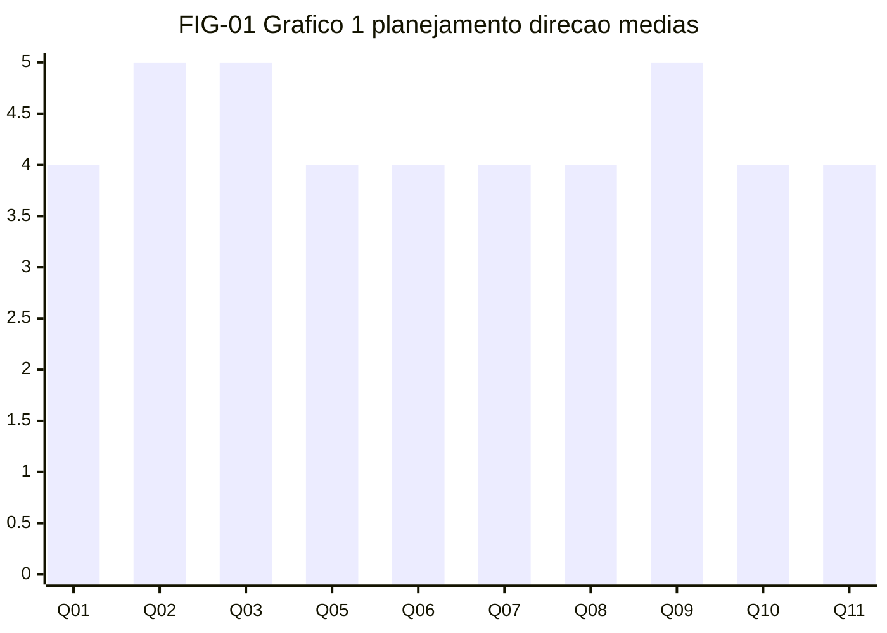
```mermaid
xychart-beta
    title "FIG-01 Grafico 1 planejamento direcao medias"
    x-axis [Q01, Q02, Q03, Q05, Q06, Q07, Q08, Q09, Q10, Q11]
    y-axis 0 --> 5
    bar [4.00, 5.00, 5.00, 4.00, 4.00, 4.00, 4.00, 5.00, 4.00, 4.00]
```

### FIG-02. Gráfico 2, planejamento pelos coordenadores (p. 20)

Médias: Q1 3,00; Q2 3,67; Q3 3,33; Q4 3,67; Q5 3,33; Q6 3,33; Q7 3,33; Q8 3,00; Q9 3,67; Q10 3,67. Menores Q1 e Q8. Percentuais ilegíveis. Texto fiel: melhorar divulgação (Q8) e conhecimento do plano (Q1).

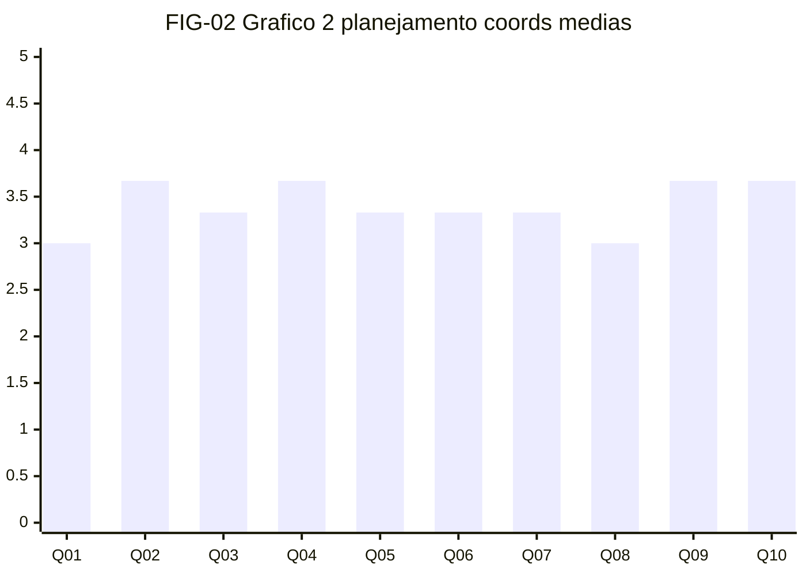
```mermaid
xychart-beta
    title "FIG-02 Grafico 2 planejamento coords medias"
    x-axis [Q01, Q02, Q03, Q04, Q05, Q06, Q07, Q08, Q09, Q10]
    y-axis 0 --> 5
    bar [3.00, 3.67, 3.33, 3.67, 3.33, 3.33, 3.33, 3.00, 3.67, 3.67]
```

### FIG-03. Gráfico 3, planejamento pelos docentes (p. 21)

Médias: Q1 3,74; Q2 3,84; Q3 4,11; Q4 4,00; Q5 3,56; Q6 3,70; Q7 3,55; Q8 3,88. Percentuais ilegíveis. Texto fiel: docentes avaliam como bom.

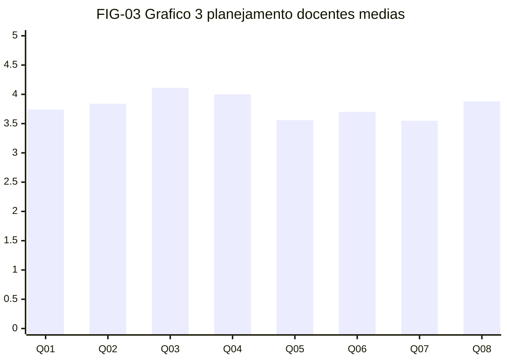
```mermaid
xychart-beta
    title "FIG-03 Grafico 3 planejamento docentes medias"
    x-axis [Q01, Q02, Q03, Q04, Q05, Q06, Q07, Q08]
    y-axis 0 --> 5
    bar [3.74, 3.84, 4.11, 4.00, 3.56, 3.70, 3.55, 3.88]
```

### FIG-04. Gráfico 4, planejamento pelos discentes (p. 22)

Médias: Q1 3,77; Q2 3,61; Q3 3,53; Q4 3,51. Percentuais ilegíveis. Texto fiel: discentes apontam como bom.

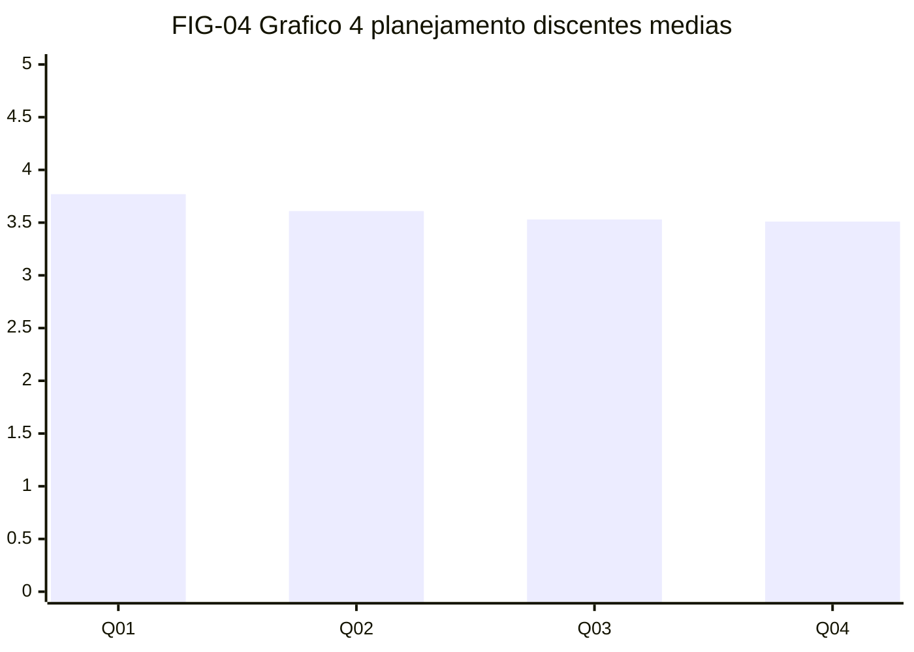
```mermaid
xychart-beta
    title "FIG-04 Grafico 4 planejamento discentes medias"
    x-axis [Q01, Q02, Q03, Q04]
    y-axis 0 --> 5
    bar [3.77, 3.61, 3.53, 3.51]
```

### FIG-05. Gráfico 5, planejamento pelos técnicos (p. 23)

Médias: Q1 3,50; Q2 3,88; Q3 3,65; Q4 3,71; Q5 3,44; Q6 3,72; Q7 3,76; Q8 3,81. Percentuais ilegíveis. Texto fiel: técnicos avaliam como bom.

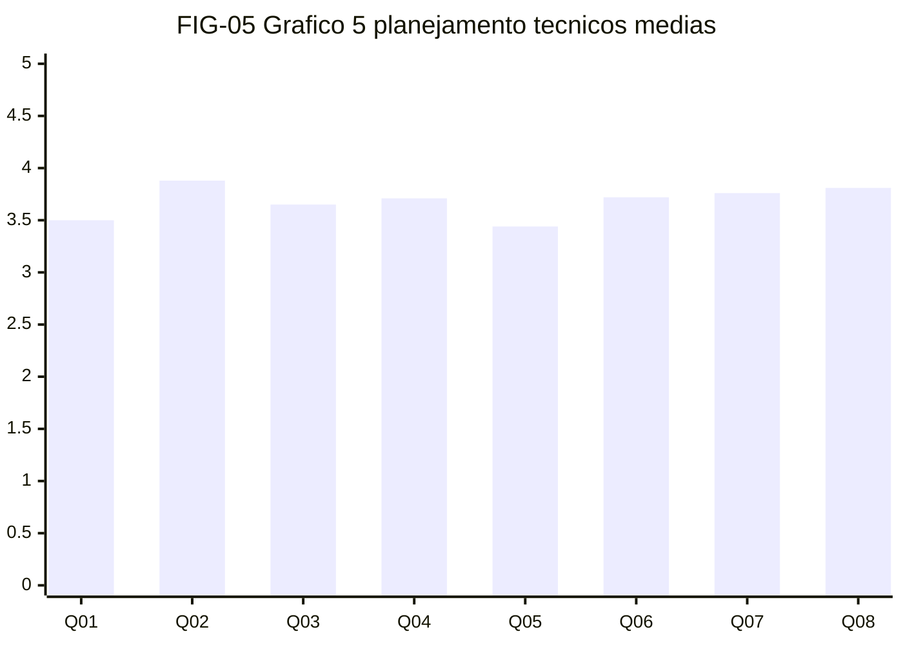
```mermaid
xychart-beta
    title "FIG-05 Grafico 5 planejamento tecnicos medias"
    x-axis [Q01, Q02, Q03, Q04, Q05, Q06, Q07, Q08]
    y-axis 0 --> 5
    bar [3.50, 3.88, 3.65, 3.71, 3.44, 3.72, 3.76, 3.81]
```

### FIG-06. Gráfico 6, PDI pela direção (p. 25)

Médias: Q1 5,00; Q2 4,00; Q3 5,00; Q4 4,00; Q5 4,00; Q6 5,00; Q7 4,00; Q8 3,00; Q9 4,00; Q10 4,00; Q11 4,00; Q12 0,00; Q13 0,00; Q14 0,00; Q15 0,00. Q12 a Q15 em 100 por cento NSA. Percentuais ilegíveis.

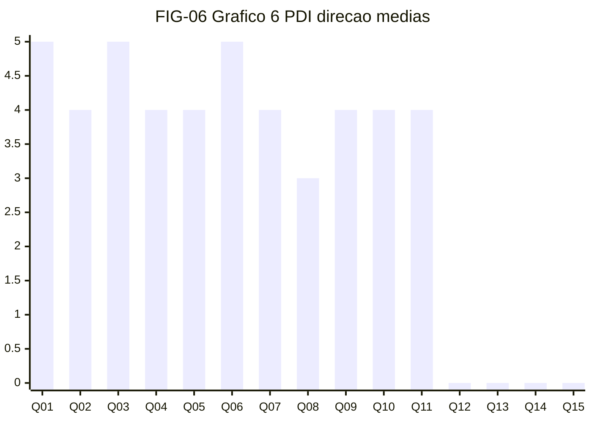
```mermaid
xychart-beta
    title "FIG-06 Grafico 6 PDI direcao medias"
    x-axis [Q01, Q02, Q03, Q04, Q05, Q06, Q07, Q08, Q09, Q10, Q11, Q12, Q13, Q14, Q15]
    y-axis 0 --> 5
    bar [5.00, 4.00, 5.00, 4.00, 4.00, 5.00, 4.00, 3.00, 4.00, 4.00, 4.00, 0.00, 0.00, 0.00, 0.00]
```

### FIG-07. Gráfico 7, PDI pelos coordenadores (p. 27)

Médias: Q1 3,00; Q2 3,00; Q3 3,50; Q4 3,50; Q5 3,00; Q6 3,00; Q7 3,00; Q8 3,00; Q9 2,00; Q10 2,50; Q11 3,50; Q12 0,00; Q13 0,00; Q14 0,00; Q15 2,00. Percentuais ilegíveis.

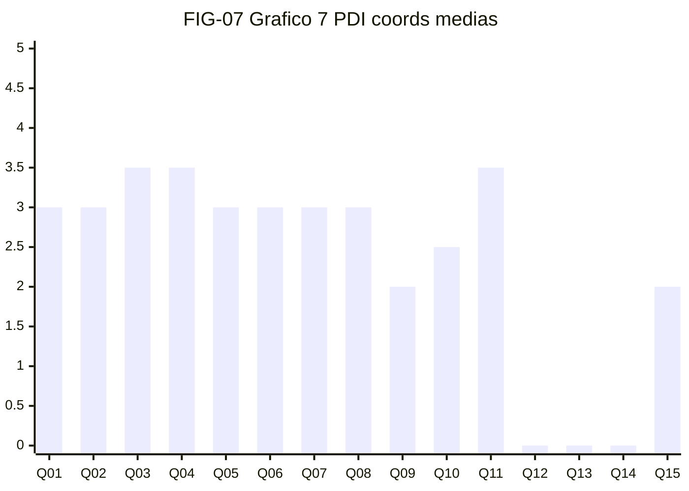
```mermaid
xychart-beta
    title "FIG-07 Grafico 7 PDI coords medias"
    x-axis [Q01, Q02, Q03, Q04, Q05, Q06, Q07, Q08, Q09, Q10, Q11, Q12, Q13, Q14, Q15]
    y-axis 0 --> 5
    bar [3.00, 3.00, 3.50, 3.50, 3.00, 3.00, 3.00, 3.00, 2.00, 2.50, 3.50, 0.00, 0.00, 0.00, 2.00]
```

### FIG-08. Gráfico 8, PDI pelos docentes (p. 29)

Médias: Q1 3,75; Q2 3,58; Q3 4,17; Q4 3,83; Q5 3,50; Q6 3,25; Q7 3,50; Q8 3,58; Q9 3,67; Q10 3,69; Q11 3,67; Q12 3,00; Q13 4,00; Q14 3,25; Q15 4,13. Alta taxa visual de NSA em Q12 a Q14. Percentuais ilegíveis.

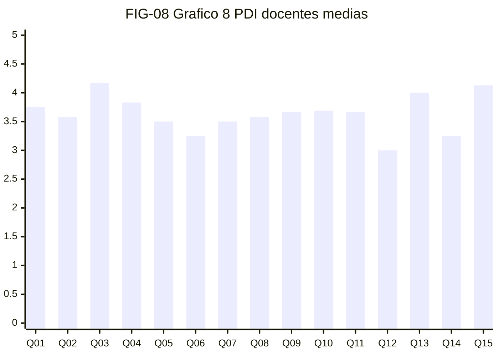
```mermaid
xychart-beta
    title "FIG-08 Grafico 8 PDI docentes medias"
    x-axis [Q01, Q02, Q03, Q04, Q05, Q06, Q07, Q08, Q09, Q10, Q11, Q12, Q13, Q14, Q15]
    y-axis 0 --> 5
    bar [3.75, 3.58, 4.17, 3.83, 3.50, 3.25, 3.50, 3.58, 3.67, 3.69, 3.67, 3.00, 4.00, 3.25, 4.13]
```

### FIG-09. Gráfico 9, PDI pelos discentes (p. 31)

Médias: Q1 4,00; Q2 3,92. Percentuais ilegíveis. Texto fiel: discentes apontam como bom.

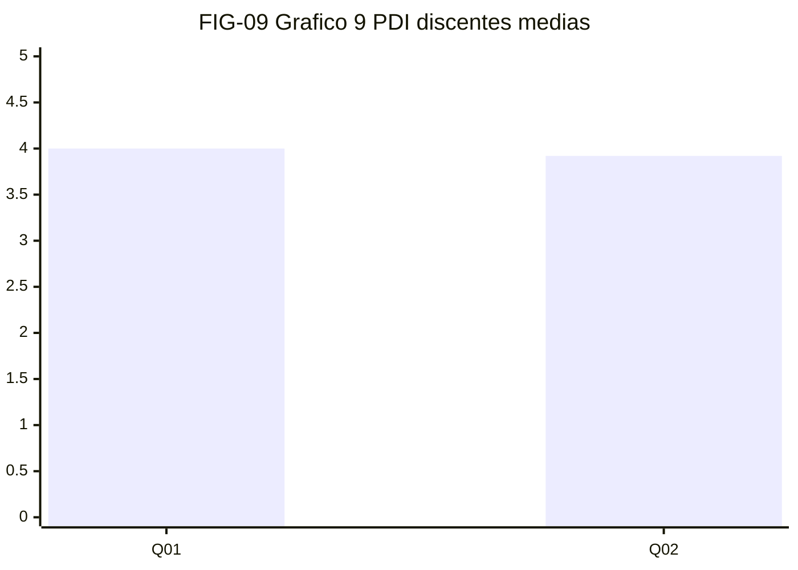
```mermaid
xychart-beta
    title "FIG-09 Grafico 9 PDI discentes medias"
    x-axis [Q01, Q02]
    y-axis 0 --> 5
    bar [4.00, 3.92]
```

### FIG-10. Gráfico 10, PDI pelos técnicos (p. 32)

Médias: Q1 4,11; Q2 3,72; Q3 3,76; Q4 3,61; Q5 3,61. Percentuais ilegíveis. Texto fiel: técnicos avaliam como bom.

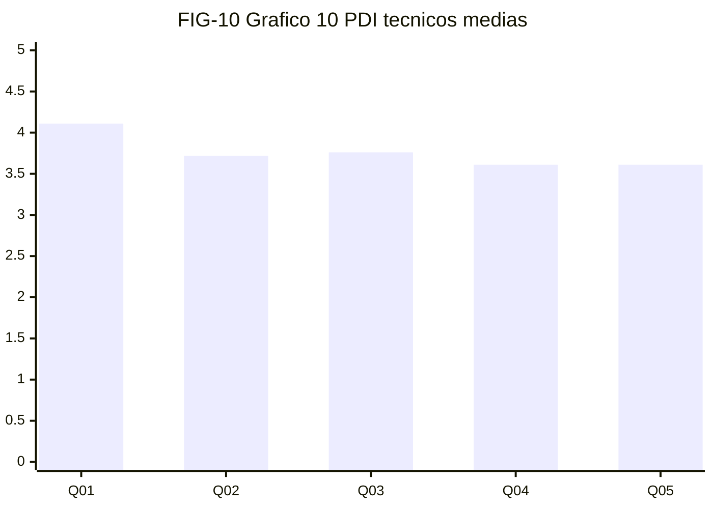
```mermaid
xychart-beta
    title "FIG-10 Grafico 10 PDI tecnicos medias"
    x-axis [Q01, Q02, Q03, Q04, Q05]
    y-axis 0 --> 5
    bar [4.11, 3.72, 3.76, 3.61, 3.61]
```

### FIG-11. Gráfico 11, ensino pela direção (p. 36)

Médias: Q1 5,00; Q2 4,00; Q3 4,00; Q4 4,00; Q5 5,00. Barras sólidas de respondente único. Percentuais ilegíveis. Texto fiel: direção considera muito boa.

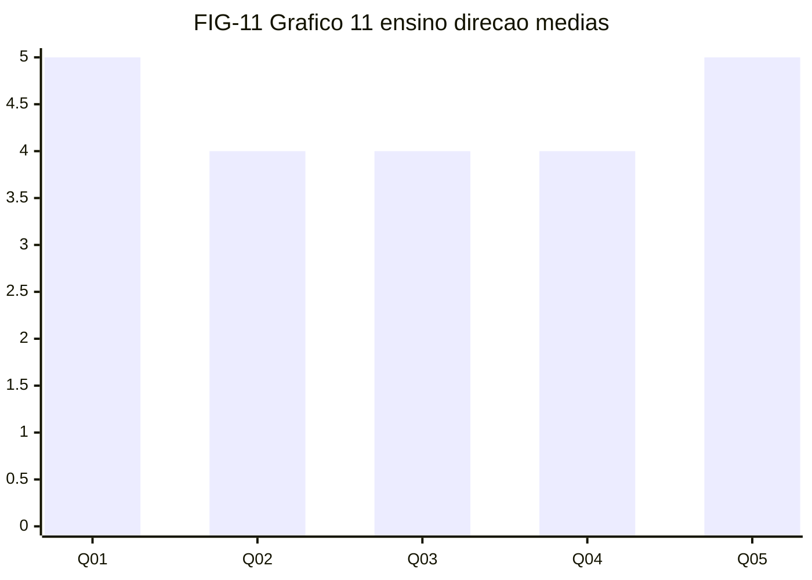
```mermaid
xychart-beta
    title "FIG-11 Grafico 11 ensino direcao medias"
    x-axis [Q01, Q02, Q03, Q04, Q05]
    y-axis 0 --> 5
    bar [5.00, 4.00, 4.00, 4.00, 5.00]
```

### FIG-12. Gráfico 12, ensino pelos coordenadores (p. 37)

Médias: Q1 3,67; Q2 3,67; Q3 3,33; Q4 3,00; Q5 3,33. Q4 com NSA majoritário (EAD). Percentuais ilegíveis. Texto fiel: melhorar EAD (Q4).

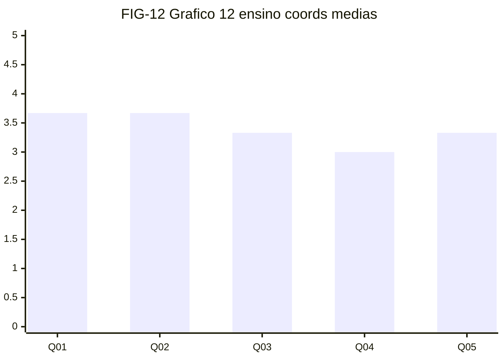
```mermaid
xychart-beta
    title "FIG-12 Grafico 12 ensino coords medias"
    x-axis [Q01, Q02, Q03, Q04, Q05]
    y-axis 0 --> 5
    bar [3.67, 3.67, 3.33, 3.00, 3.33]
```

### FIG-13. Gráfico 13, ensino pelos docentes (p. 38)

Médias: Q1 3,95; Q2 4,00; Q3 4,16; Q4 3,38; Q5 3,95. Q4 com grande NSA. Percentuais ilegíveis. Parágrafo menciona técnico-administrativos onde o contexto é docente (defeito preservado).

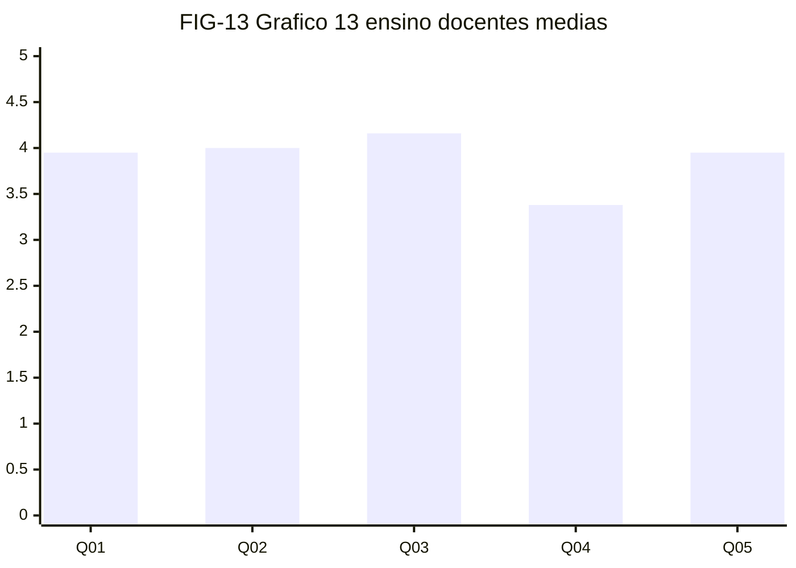
```mermaid
xychart-beta
    title "FIG-13 Grafico 13 ensino docentes medias"
    x-axis [Q01, Q02, Q03, Q04, Q05]
    y-axis 0 --> 5
    bar [3.95, 4.00, 4.16, 3.38, 3.95]
```

### FIG-14. Gráfico 14, ensino pelos discentes (p. 39)

Médias: Q1 3,84; Q2 3,88; Q3 3,65; Q4 3,43; Q5 3,66; Q6 3,46. Percentuais ilegíveis. Texto fiel: consideram boa.

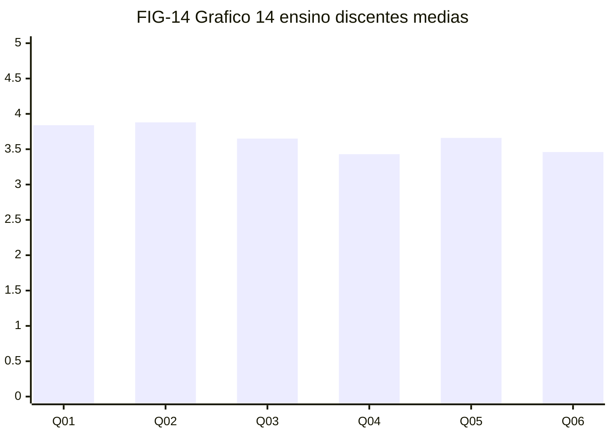
```mermaid
xychart-beta
    title "FIG-14 Grafico 14 ensino discentes medias"
    x-axis [Q01, Q02, Q03, Q04, Q05, Q06]
    y-axis 0 --> 5
    bar [3.84, 3.88, 3.65, 3.43, 3.66, 3.46]
```

### FIG-15. Gráfico 15, pesquisa pela direção (p. 42)

Médias: Q1 4,00; Q2 3,00; Q3 4,00; Q4 3,00; Q5 0,00 (100 por cento NSA). Percentuais ilegíveis. Texto fiel: boa com observação à implantação.

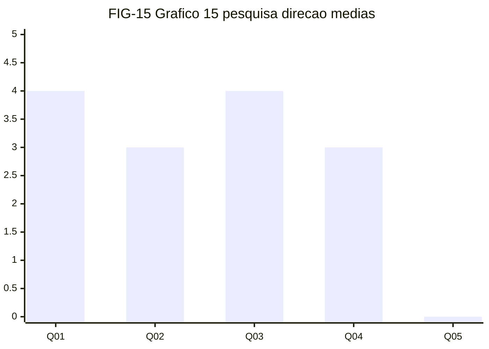
```mermaid
xychart-beta
    title "FIG-15 Grafico 15 pesquisa direcao medias"
    x-axis [Q01, Q02, Q03, Q04, Q05]
    y-axis 0 --> 5
    bar [4.00, 3.00, 4.00, 3.00, 0.00]
```

### FIG-16. Gráfico 16, pesquisa pelos coordenadores (p. 43)

Médias: Q1 3,50; Q2 3,50; Q3 3,00; Q4 3,00; Q5 3,00. Percentuais ilegíveis. Texto fiel: todos os pontos a melhorar.

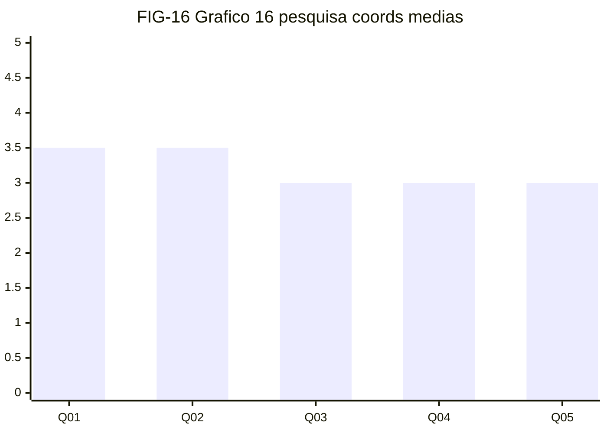
```mermaid
xychart-beta
    title "FIG-16 Grafico 16 pesquisa coords medias"
    x-axis [Q01, Q02, Q03, Q04, Q05]
    y-axis 0 --> 5
    bar [3.50, 3.50, 3.00, 3.00, 3.00]
```

### FIG-17. Gráfico 17, pesquisa pelos docentes (p. 44)

Médias: Q1 3,25; Q2 3,11; Q3 3,30; Q4 3,05; Q5 2,94. Percentuais ilegíveis. Texto fiel: precisam ser melhor desenvolvidas, em especial revista (Q5).

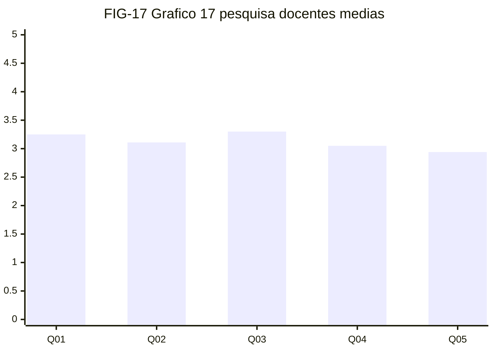
```mermaid
xychart-beta
    title "FIG-17 Grafico 17 pesquisa docentes medias"
    x-axis [Q01, Q02, Q03, Q04, Q05]
    y-axis 0 --> 5
    bar [3.25, 3.11, 3.30, 3.05, 2.94]
```

### FIG-18. Gráfico 18, pesquisa pelos discentes (p. 45)

Médias: Q1 3,76; Q2 3,76; Q3 3,57. Percentuais ilegíveis. Texto fiel: boas, com pedido de estímulo; atenção geral com docentes e discentes.

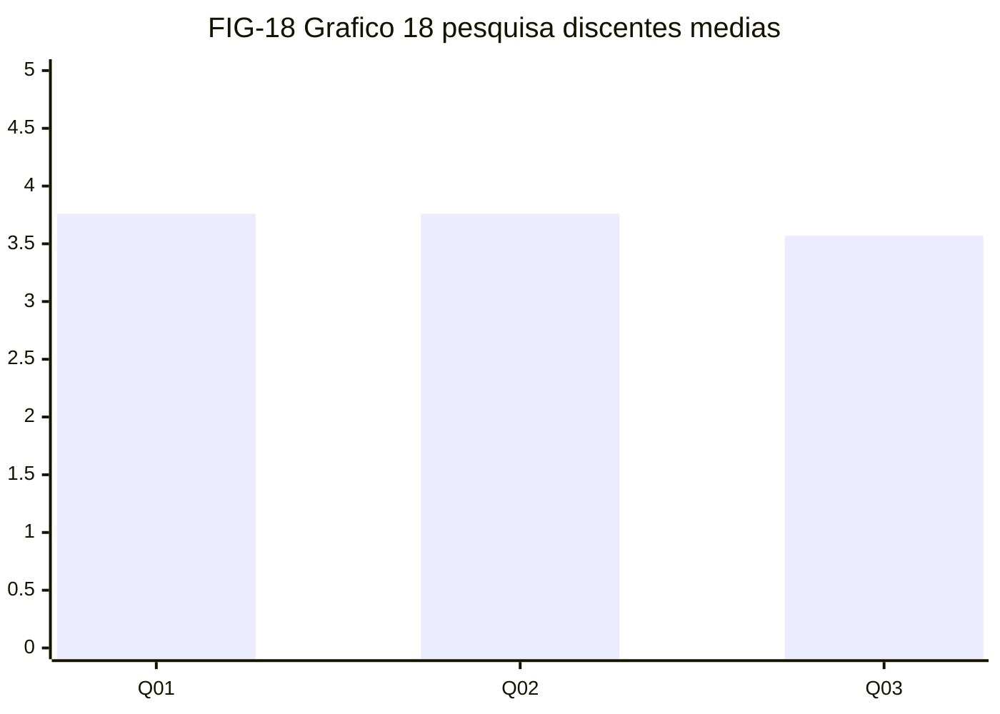
```mermaid
xychart-beta
    title "FIG-18 Grafico 18 pesquisa discentes medias"
    x-axis [Q01, Q02, Q03]
    y-axis 0 --> 5
    bar [3.76, 3.76, 3.57]
```

### FIG-19. Gráfico 19, extensão pela direção (p. 47)

Médias: Q1 5,00; Q2 5,00; Q3 4,00; Q4 3,00; Q5 4,00. Sólidas de respondente único. Percentuais ilegíveis. Texto fiel: boa com observação ao incentivo docente (Q4).

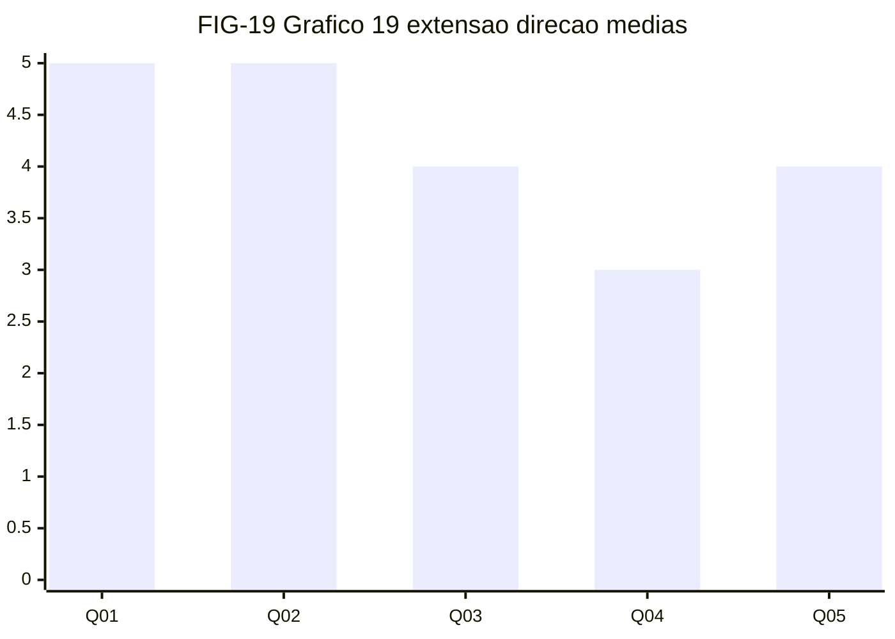
```mermaid
xychart-beta
    title "FIG-19 Grafico 19 extensao direcao medias"
    x-axis [Q01, Q02, Q03, Q04, Q05]
    y-axis 0 --> 5
    bar [5.00, 5.00, 4.00, 3.00, 4.00]
```

### FIG-20. Gráfico 20, extensão pelos coordenadores (p. 48)

Médias: Q1 3,33; Q2 2,33; Q3 2,33; Q4 2,33; Q5 1,50. Percentuais ilegíveis, só cores. Texto fiel (sic, mantido como impresso): os coordenadores apontam com médias baixar as questões de extensão, cultura e esporte.

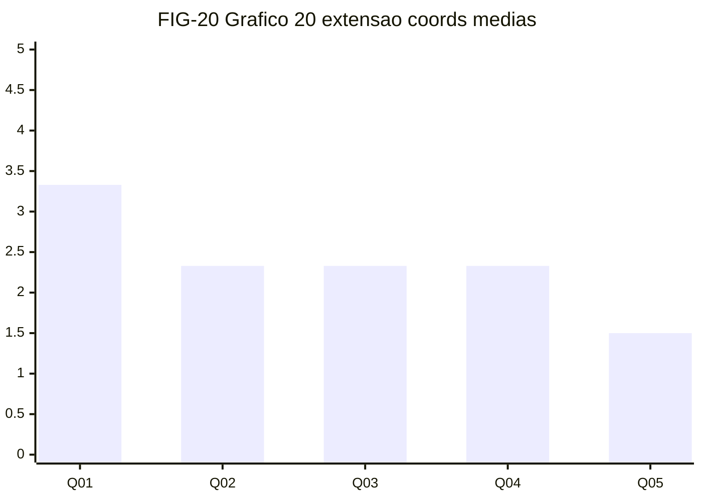
```mermaid
xychart-beta
    title "FIG-20 Grafico 20 extensao coords medias"
    x-axis [Q01, Q02, Q03, Q04, Q05]
    y-axis 0 --> 5
    bar [3.33, 2.33, 2.33, 2.33, 1.50]
```

### FIG-21. Gráfico 21, extensão pelos docentes (p. 49)

Título verbatim: Gráfico 21 - Avaliação das políticas de extensão, cultura e esporte pelos docentes. Subtítulo: AVALIAÇÃO DOCENTE – 2019/1 – Política de desenvolvimento da extensão, cultura e esporte. Médias: Q1 3,85; Q2 3,55; Q3 3,40. Percentuais ilegíveis, só cores. Texto fiel: os docentes consideram boas as políticas de extensão, cultura e esporte.

```mermaid
xychart-beta
    title "FIG-21 Grafico 21 extensao docentes medias"
    x-axis [Q01, Q02, Q03]
    y-axis 0 --> 5
    bar [3.85, 3.55, 3.40]
```

### FIG-22. Gráfico 22, extensão pelos discentes (p. 50)

Título verbatim: Gráfico 22 - Avaliação das políticas de extensão, cultura e esporte pelos estudantes de graduação. Subtítulo: AVALIAÇÃO ESTUDANTE – PRESENCIAL – 2019/1 – Política de desenvolvimento da extensão, cultura e esporte. Médias: Q1 3,63; Q2 3,59; Q3 3,29. Percentuais ilegíveis, só cores. Texto fiel: boas, mas melhorar o estímulo à participação em projetos (menor em Q3).

### FIG-23. Gráfico 23, egressos pela direção (p. 52)

Médias: Q1 0,00; Q2 0,00; Q3 0,00; Q4 3,00. Q1 a Q3 em 100 por cento NSA. Percentuais ilegíveis. Texto fiel: necessidade de ações de acompanhamento.

```mermaid
xychart-beta
    title "FIG-23 Grafico 23 egressos direcao medias"
    x-axis [Q01, Q02, Q03, Q04]
    y-axis 0 --> 5
    bar [0.00, 0.00, 0.00, 3.00]
```

### FIG-24. Gráfico 24, egressos pelos coordenadores (p. 53)

Médias: Q1 1,33; Q2 1,33; Q3 1,67; Q4 2,33. Percentuais ilegíveis, só cores. Texto fiel: é necessário melhorar todos os aspectos da política de acompanhamento de egressos.

```mermaid
xychart-beta
    title "FIG-24 Grafico 24 egressos coords medias"
    x-axis [Q01, Q02, Q03, Q04]
    y-axis 0 --> 5
    bar [1.33, 1.33, 1.67, 2.33]
```

### FIG-25. Gráfico 25, egressos pelos docentes (p. 54)

Médias: Q1 2,65; Q2 2,75; Q3 2,56; Q4 3,00. Percentuais ilegíveis, só cores. Texto fiel: é necessário melhorar todas as ações neste âmbito.

```mermaid
xychart-beta
    title "FIG-25 Grafico 25 egressos docentes medias"
    x-axis [Q01, Q02, Q03, Q04]
    y-axis 0 --> 5
    bar [2.65, 2.75, 2.56, 3.00]
```

### FIG-26. Gráfico 26, internacionalização pela direção (p. 56)

Médias: Q1 4,00; Q2 5,00; Q3 0,00; Q4 4,00; Q5 3,00; Q6 3,00. Sólidas de respondente único. Percentuais ilegíveis. Texto fiel: considera boa.

```mermaid
xychart-beta
    title "FIG-26 Grafico 26 internacionalizacao direcao medias"
    x-axis [Q01, Q02, Q03, Q04, Q05, Q06]
    y-axis 0 --> 5
    bar [4.00, 5.00, 0.00, 4.00, 3.00, 3.00]
```

### FIG-27. Gráfico 27, internacionalização pelos coordenadores (p. 57)

Médias: Q1 3,00; Q2 3,00; Q3 2,33; Q4 2,00; Q5 3,00; Q6 2,50. Percentuais ilegíveis, só cores. Texto fiel: melhorar implantação (Q3), previsão de atividades (Q4) e ações inovadoras (Q6).

```mermaid
xychart-beta
    title "FIG-27 Grafico 27 internacionalizacao coords medias"
    x-axis [Q01, Q02, Q03, Q04, Q05, Q06]
    y-axis 0 --> 5
    bar [3.00, 3.00, 2.33, 2.00, 3.00, 2.50]
```

### FIG-28. Gráfico 28, internacionalização pelos docentes (p. 58)

Médias: Q1 3,00; Q2 2,94; Q3 2,65; Q4 2,56; Q5 2,76. Percentuais ilegíveis, só cores. Texto fiel: todas as questões precisam ser melhor desenvolvidas.

```mermaid
xychart-beta
    title "FIG-28 Grafico 28 internacionalizacao docentes medias"
    x-axis [Q01, Q02, Q03, Q04, Q05]
    y-axis 0 --> 5
    bar [3.00, 2.94, 2.65, 2.56, 2.76]
```

### FIG-29. Gráfico 29, internacionalização pelos discentes (p. 59)

Médias: Q1 3,23; Q2 3,30. Percentuais ilegíveis, só cores. Texto fiel: questões boas; necessidade de mais atividades.

```mermaid
xychart-beta
    title "FIG-29 Grafico 29 internacionalizacao discentes medias"
    x-axis [Q01, Q02]
    y-axis 0 --> 5
    bar [3.23, 3.30]
```

### FIG-30. Gráfico 30, comunicação pela direção (p. 61)

Médias: Q1 5,00; Q2 5,00; Q3 5,00; Q4 5,00; Q5 5,00; Q6 4,00. Sólidas de respondente único. Percentuais ilegíveis. Texto fiel: muito boa.

```mermaid
xychart-beta
    title "FIG-30 Grafico 30 comunicacao direcao medias"
    x-axis [Q01, Q02, Q03, Q04, Q05, Q06]
    y-axis 0 --> 5
    bar [5.00, 5.00, 5.00, 5.00, 5.00, 4.00]
```

### FIG-31. Gráfico 31, comunicação pelos coordenadores (p. 62)

Médias: Q1 3,00; Q2 3,33; Q3 3,33; Q4 3,33; Q5 3,33; Q6 3,33. Q1 com unanimidade em satisfatório. Percentuais ilegíveis, só cores. Texto fiel: boa.

```mermaid
xychart-beta
    title "FIG-31 Grafico 31 comunicacao coords medias"
    x-axis [Q01, Q02, Q03, Q04, Q05, Q06]
    y-axis 0 --> 5
    bar [3.00, 3.33, 3.33, 3.33, 3.33, 3.33]
```

### FIG-32. Gráfico 32, comunicação pelos docentes (p. 63)

Médias: Q1 3,67; Q2 3,74; Q3 3,33; Q4 3,78. Percentuais ilegíveis, só cores. Texto fiel: boa.

```mermaid
xychart-beta
    title "FIG-32 Grafico 32 comunicacao docentes medias"
    x-axis [Q01, Q02, Q03, Q04]
    y-axis 0 --> 5
    bar [3.67, 3.74, 3.33, 3.78]
```

### FIG-33. Gráfico 33, comunicação pelos discentes (p. 64)

Médias: Q1 3,78; Q2 3,62; Q3 3,66. Percentuais ilegíveis, só cores. Texto fiel: boa.

```mermaid
xychart-beta
    title "FIG-33 Grafico 33 comunicacao discentes medias"
    x-axis [Q01, Q02, Q03]
    y-axis 0 --> 5
    bar [3.78, 3.62, 3.66]
```

### FIG-34. Gráfico 34, comunicação pelos técnicos (p. 65)

Subtítulo com defeito preservado: AVALIAÇÃO TÉCNICO-ADMINISTRATIVO – 2019 – Recursos de Tecnologias da Informação e Comunicação (o contexto é comunicação). Médias: Q1 4,00; Q2 4,13; Q3 3,81. Percentuais ilegíveis, só cores. Texto fiel: muito boa, podendo melhorar a eficiência dos canais (sic, mantido como impresso).

```mermaid
xychart-beta
    title "FIG-34 Grafico 34 comunicacao tecnicos medias"
    x-axis [Q01, Q02, Q03]
    y-axis 0 --> 5
    bar [4.00, 4.13, 3.81]
```

### FIG-35. Gráfico 35, atendimento pela direção (p. 68)

Médias: Q1 5,00; Q2 3,00; Q3 3,00; Q4 4,00; Q5 4,00; Q6 4,00. Sólidas de respondente único. Percentuais ilegíveis. Texto fiel: melhorar acessibilidade (Q2) e estágios (Q3).

```mermaid
xychart-beta
    title "FIG-35 Grafico 35 atendimento direcao medias"
    x-axis [Q01, Q02, Q03, Q04, Q05, Q06]
    y-axis 0 --> 5
    bar [5.00, 3.00, 3.00, 4.00, 4.00, 4.00]
```

### FIG-36. Gráfico 36, atendimento pelos coordenadores (p. 69)

Médias: Q1 3,00; Q2 3,00; Q3 2,50; Q4 3,33; Q5 3,33; Q6 3,00. Q1/Q2 em 100 por cento satisfatório; Q3 a pior. Percentuais ilegíveis, só cores. Texto fiel: melhorar, em destaque estágios não obrigatórios (Q3).

```mermaid
xychart-beta
    title "FIG-36 Grafico 36 atendimento coords medias"
    x-axis [Q01, Q02, Q03, Q04, Q05, Q06]
    y-axis 0 --> 5
    bar [3.00, 3.00, 2.50, 3.33, 3.33, 3.00]
```

### FIG-37. Gráfico 37, atendimento pelos docentes (p. 70)

Médias: Q1 3,25; Q2 3,75; Q3 3,35; Q4 3,55. Percentuais ilegíveis, só cores. Texto fiel: boas as questões de atendimento.

```mermaid
xychart-beta
    title "FIG-37 Grafico 37 atendimento docentes medias"
    x-axis [Q01, Q02, Q03, Q04]
    y-axis 0 --> 5
    bar [3.25, 3.75, 3.35, 3.55]
```

### FIG-38. Gráfico 38, atendimento pelos discentes (p. 71)

Médias: Q1 3,32; Q2 3,49; Q3 3,57. Percentuais ilegíveis, só cores. Texto fiel: boa; melhoria em acessibilidade, inovação e psicopedagógico.

```mermaid
xychart-beta
    title "FIG-38 Grafico 38 atendimento discentes medias"
    x-axis [Q01, Q02, Q03]
    y-axis 0 --> 5
    bar [3.32, 3.49, 3.57]
```

### FIG-39. Gráfico 39, estímulo pela direção (p. 73)

Médias: Q1 4,00; Q2 3,00. Sólidas de respondente único. Percentuais ilegíveis. Texto fiel: boa com Q2 (produção e publicação) a melhorar.

```mermaid
xychart-beta
    title "FIG-39 Grafico 39 estimulo direcao medias"
    x-axis [Q01, Q02]
    y-axis 0 --> 5
    bar [4.00, 3.00]
```

### FIG-40. Gráfico 40, estímulo pelos coordenadores (p. 74)

Médias: Q1 2,50; Q2 2,50. Barras idênticas em terços (NSA, parcial, satisfatório). Percentuais ilegíveis, só cores. Texto fiel: necessário melhor apoio à produção e publicação.

```mermaid
xychart-beta
    title "FIG-40 Grafico 40 estimulo coords medias"
    x-axis [Q01, Q02]
    y-axis 0 --> 5
    bar [2.50, 2.50]
```

### FIG-41. Gráfico 41, estímulo pelos docentes (p. 75)

Médias: Q1 2,61; Q2 2,53. Percentuais ilegíveis, só cores. Texto fiel: necessário melhorar o apoio financeiro e logístico e o apoio à produção e publicação.

```mermaid
xychart-beta
    title "FIG-41 Grafico 41 estimulo docentes medias"
    x-axis [Q01, Q02]
    y-axis 0 --> 5
    bar [2.61, 2.53]
```

### FIG-42. Gráfico 42, estímulo pelos discentes (p. 76)

Médias: Q1 3,25; Q2 3,34. Percentuais ilegíveis, só cores. Texto fiel: bom o apoio a eventos e à produção e publicação.

```mermaid
xychart-beta
    title "FIG-42 Grafico 42 estimulo discentes medias"
    x-axis [Q01, Q02]
    y-axis 0 --> 5
    bar [3.25, 3.34]
```

### FIG-43. Gráfico 43, capacitação docente pelo diretor (p. 80)

Tabela 13 no topo da página: cursos na IES 7; auxílios para eventos 11. Médias: Q1 3,00 (satisfatória, participação em eventos); Q2 5,00 (muito boa, qualificação). Sólidas de respondente único. Percentuais ilegíveis.

```mermaid
xychart-beta
    title "FIG-43 Grafico 43 capacitacao diretor medias"
    x-axis [Q01, Q02]
    y-axis 0 --> 5
    bar [3.00, 5.00]
```

### FIG-44. Gráfico 44, capacitação pelos coordenadores (p. 81)

Médias: Q1 3,33; Q2 3,50. Percentuais ilegíveis.

```mermaid
xychart-beta
    title "FIG-44 Grafico 44 capacitacao coords medias"
    x-axis [Q01, Q02]
    y-axis 0 --> 5
    bar [3.33, 3.50]
```

### FIG-45. Gráfico 45, capacitação pelos docentes (p. 82)

Médias: Q1 2,85; Q2 3,90. Texto com percentuais no corpo (Q1: 9,52 muito bom, 23,81 bom, 23,81 satisfatório, 19,05 parcial, 19,05 insatisfatório, 4,76 NSA; Q2: 38,10 muito bom, 19,05 bom, 33,33 satisfatório, 4,76 insatisfatório, 4,76 NSA; 21 respondentes). Percentuais nas barras ilegíveis (só cores); percentuais do corpo transcritos como texto, não como leitura visual.

```mermaid
xychart-beta
    title "FIG-45 Grafico 45 capacitacao docentes medias"
    x-axis [Q01, Q02]
    y-axis 0 --> 5
    bar [2.85, 3.90]
```

### FIG-46. Gráfico 46, capacitação de técnicos pelo diretor (p. 86)

Médias: Q1 4,00; Q2 4,00. Sólidas de respondente único. Percentuais ilegíveis. Texto fiel: boa nas duas.

```mermaid
xychart-beta
    title "FIG-46 Grafico 46 capacitacao tec diretor medias"
    x-axis [Q01, Q02]
    y-axis 0 --> 5
    bar [4.00, 4.00]
```

### FIG-47. Gráfico 47, capacitação pelos técnicos (p. 87)

Médias: Q1 3,22; Q2 3,28. 18 respondentes. Percentuais ilegíveis nas barras; corpo com Q1 (27,78 satisfatória, 22,22 muito boa, 22,22 boa, 11,11 parcial, restante na página seguinte) e Q2 (33,33 satisfatória, 27,78 boa, 16,67 muito boa, 11,11 parcial e 11,11 insatisfatória).

```mermaid
xychart-beta
    title "FIG-47 Grafico 47 capacitacao tecnicos medias"
    x-axis [Q01, Q02]
    y-axis 0 --> 5
    bar [3.22, 3.28]
```

### FIG-48. Gráfico 48, gestão pelo diretor (p. 90)

Médias: Q1 4,00; Q2 5,00; Q3 5,00; Q4 4,00. Sólidas de respondente único. Percentuais ilegíveis. Texto fiel: Q1 e Q4 boas, Q2 e Q3 muito boas.

```mermaid
xychart-beta
    title "FIG-48 Grafico 48 gestao diretor medias"
    x-axis [Q01, Q02, Q03, Q04]
    y-axis 0 --> 5
    bar [4.00, 5.00, 5.00, 4.00]
```

### FIG-49. Gráfico 49, gestão pelos coordenadores (p. 91)

Médias: Q1 3,67; Q2 3,33; Q3 3,67; Q4 3,33. Corpo com Q1 (66,67 bom, 33,33 satisfatório), Q2/Q4 (66,67 satisfatório, 33,33 bom), Q3 (66,67 satisfatório, 33,33 muito bom). Percentuais nas barras ilegíveis.

```mermaid
xychart-beta
    title "FIG-49 Grafico 49 gestao coords medias"
    x-axis [Q01, Q02, Q03, Q04]
    y-axis 0 --> 5
    bar [3.67, 3.33, 3.67, 3.33]
```

### FIG-50. Gráfico 50, gestão pelos docentes (p. 92)

Médias: Q1 3,89; Q2 3,80; Q3 4,05; Q4 3,70. Aumento ante 2018 (texto fiel). Parágrafo da página mistura análise de coords (66,67/33,33, com média digitada como 33,33 onde o contexto indica 3,33; defeito preservado). Percentuais nas barras ilegíveis, só cores. Corpo docente com Q1 (28,57 muito bom, 33,33 bom, 23,81 satisfatório, 4,76 insatisfatório, 9,52 NSA), Q2 (23,81 muito boa, 38,10 boa, 23,81 satisfatória, 9,52 parcial, 4,76 NSA), Q3 como a maior (33,33 muito bom e texto truncado na extração).

```mermaid
xychart-beta
    title "FIG-50 Grafico 50 gestao docentes medias"
    x-axis [Q01, Q02, Q03, Q04]
    y-axis 0 --> 5
    bar [3.89, 3.80, 4.05, 3.70]
```

### FIG-51. Gráfico 51, gestão pelos discentes (p. 94)

Médias: Q1 3,59; Q2 3,42; Q3 3,44. Corpo com Q1 (16,59 muito bom, 28,57 bom, 21,97 satisfatório, 9,42 parcial, 4,48 insatisfatório, 8,97 NSA), Q2 (16,14 muito bom, 33,63 bom, 24,66 satisfatório, 9,42 parcial, 8,97 insatisfatório, 7,17 NSA), Q3 (13,90 muito boa, 34,98 boa, 24,22 satisfatória, 7,62 parcial, 8,07 insatisfatória, 11,21 NSA). Percentuais nas barras ilegíveis, só cores.

```mermaid
xychart-beta
    title "FIG-51 Grafico 51 gestao discentes medias"
    x-axis [Q01, Q02, Q03]
    y-axis 0 --> 5
    bar [3.59, 3.42, 3.44]
```

### FIG-52. Gráfico 52, gestão pelos técnicos (p. 95)

Médias: Q1 3,47; Q2 3,53; Q3 3,81; Q4 3,56. Conceito bom. Corpo com Q1 (16,67 muito bom, 33,33 bom, 22,22 satisfatório, 22,22 parcial, 5,58 NSA), Q2 (22,22 muito boa, 38,89 boa, 11,11 em cada uma de satisfatória, parcial e insatisfatória, 5,56 NSA), Q3 (16,67 muito boa, 44,44 boa, 22,22 satisfatória, 5,56 parcial, 11,11 NSA), Q4 (16,67 muito boa, 38,89 boa, 16,67 satisfatória, 11,11 parcial, restante truncado). Percentuais nas barras ilegíveis, só cores.

```mermaid
xychart-beta
    title "FIG-52 Grafico 52 gestao tecnicos medias"
    x-axis [Q01, Q02, Q03, Q04]
    y-axis 0 --> 5
    bar [3.47, 3.53, 3.81, 3.56]
```

### FIG-53. Gráfico 53, sustentabilidade pelo diretor (p. 98)

Médias: Q1 5,00; Q2 4,00; Q3 4,00. Sólidas de respondente único. Percentuais ilegíveis. Texto fiel: Q1 muito boa, Q2/Q3 boas.

```mermaid
xychart-beta
    title "FIG-53 Grafico 53 sustentabilidade diretor medias"
    x-axis [Q01, Q02, Q03]
    y-axis 0 --> 5
    bar [5.00, 4.00, 4.00]
```

### FIG-54. Gráfico 54, sustentabilidade pelos coordenadores (p. 99)

Médias: Q1 3,50; Q2 4,00; Q3 4,00. Corpo com Q1 (33,33 boa, 33,33 satisfatória, 33,33 NSA), Q2 (33,33 boa, 66,67 NSA), Q3 (33,33 boas, 66,67 NSA). Percentuais nas barras ilegíveis, só cores.

```mermaid
xychart-beta
    title "FIG-54 Grafico 54 sustentabilidade coords medias"
    x-axis [Q01, Q02, Q03]
    y-axis 0 --> 5
    bar [3.50, 4.00, 4.00]
```

### FIG-55. Gráfico 55, sustentabilidade pelos técnicos (p. 100)

Questão única. Média: Q1 2,81. Corpo com 27,78 bom, 11,11 muito bom, 5,56 satisfatório, 22,22 parcial, 11,11 NSA (soma parcial como no original). Percentuais nas barras ilegíveis, só cores.

```mermaid
xychart-beta
    title "FIG-55 Grafico 55 sustentabilidade tecnicos medias"
    x-axis [Q01]
    y-axis 0 --> 5
    bar [2.81]
```

### FIG-56. Gráfico 56, instalações administrativas pelo diretor (p. 103)

Médias: Q1 5,00; Q2 4,00; Q3 5,00. Sólidas de respondente único. Percentuais ilegíveis.

```mermaid
xychart-beta
    title "FIG-56 Grafico 56 instalacoes diretor medias"
    x-axis [Q01, Q02, Q03]
    y-axis 0 --> 5
    bar [5.00, 4.00, 5.00]
```

### FIG-57. Gráfico 57, instalações pelos coordenadores (p. 104)

Médias: Q1 4,33; Q2 4,00; Q3 3,67. Q1 com 2/3 bom e 1/3 muito bom; Q2 em 100 por cento bom; Q3 em terços (parcial, bom, muito bom). Percentuais ilegíveis, só cores. Parágrafo com defeito preservado: diz avaliadas pelo diretor e na visão da direção onde o contexto é coordenadores.

```mermaid
xychart-beta
    title "FIG-57 Grafico 57 instalacoes coords medias"
    x-axis [Q01, Q02, Q03]
    y-axis 0 --> 5
    bar [4.33, 4.00, 3.67]
```

### FIG-58. Gráfico 58, instalações pelos técnicos (p. 105)

Médias: Q1 4,17; Q2 3,28; Q3 4,00. Q1 atendimento como maior; Q2 acessibilidade como menor. Percentuais ilegíveis, só cores. Texto fiel: satisfação parcial.

```mermaid
xychart-beta
    title "FIG-58 Grafico 58 instalacoes tecnicos medias"
    x-axis [Q01, Q02, Q03]
    y-axis 0 --> 5
    bar [4.17, 3.28, 4.00]
```

### FIG-59. Gráfico 59, salas de aula pelo diretor (p. 107)

Título com defeito preservado (diz instalações administrativas; subtítulo e análise tratam de salas de aula). Médias: Q1 5,00; Q2 4,00; Q3 5,00; Q4 4,00. Sólidas de respondente único. Q1/Q3 adequação e manutenção; Q2/Q4 recursos e acessibilidade. Percentuais ilegíveis, só cores.

```mermaid
xychart-beta
    title "FIG-59 Grafico 59 salas direcao medias"
    x-axis [Q01, Q02, Q03, Q04]
    y-axis 0 --> 5
    bar [5.00, 4.00, 5.00, 4.00]
```

### FIG-60. Gráfico 60, salas de aula pelos coordenadores (p. 108)

Título com defeito preservado (mesmo caso da FIG-59). Médias: Q1 4,33; Q2 4,33; Q3 4,33; Q4 4,00. Q1 a Q3 com satisfatório e muito bom; Q4 com satisfatório, bom e muito bom. Percentuais ilegíveis, só cores. Texto fiel: menor em recursos tecnológicos (Q4).

```mermaid
xychart-beta
    title "FIG-60 Grafico 60 salas coords medias"
    x-axis [Q01, Q02, Q03, Q04]
    y-axis 0 --> 5
    bar [4.33, 4.33, 4.33, 4.00]
```

### FIG-61. Gráfico 61, auditórios pelo diretor (p. 110)

Médias: Q1 4,00; Q2 4,00; Q3 5,00. Sólidas de respondente único. Q1 acessibilidade; Q2 conforto e acústica; Q3 multimídia. Percentuais ilegíveis, só cores.

```mermaid
xychart-beta
    title "FIG-61 Grafico 61 auditorios diretor medias"
    x-axis [Q01, Q02, Q03]
    y-axis 0 --> 5
    bar [4.00, 4.00, 5.00]
```

### FIG-62. Gráfico 62, auditórios pelos coordenadores (p. 111)

Médias: Q1 2,00; Q2 3,00; Q3 3,00. Q1 em terços (insatisfatório, parcial, satisfatório); Q2/Q3 em terços (parcial, satisfatório, bom). Percentuais ilegíveis, só cores. Texto fiel: itens entre parcial e bom.

```mermaid
xychart-beta
    title "FIG-62 Grafico 62 auditorios coords medias"
    x-axis [Q01, Q02, Q03]
    y-axis 0 --> 5
    bar [2.00, 3.00, 3.00]
```

### FIG-63. Gráfico 63, auditórios pelos docentes (p. 112)

Médias: Q1 3,76; Q2 3,76; Q3 3,90. Percentuais ilegíveis, só cores. Texto fiel: maior porcentagem entre satisfatório e muito bom.

```mermaid
xychart-beta
    title "FIG-63 Grafico 63 auditorios docentes medias"
    x-axis [Q01, Q02, Q03]
    y-axis 0 --> 5
    bar [3.76, 3.76, 3.90]
```

### FIG-64. Gráfico 64, auditórios pelos técnicos (p. 113)

Médias: Q1 3,33; Q2 3,33; Q3 3,72. Percentuais ilegíveis, só cores. Texto fiel: maior porcentagem entre satisfatório e muito bom.

```mermaid
xychart-beta
    title "FIG-64 Grafico 64 auditorios tecnicos medias"
    x-axis [Q01, Q02, Q03]
    y-axis 0 --> 5
    bar [3.33, 3.33, 3.72]
```

### FIG-65. Gráfico 65, auditórios pelos discentes (p. 114)

Médias: Q1 3,60; Q2 3,60; Q3 3,50. Percentuais ilegíveis, só cores. Texto fiel: maior porcentagem entre satisfatório e muito bom. Síntese da CSA (p. 115): capacidade insuficiente com o crescimento.

```mermaid
xychart-beta
    title "FIG-65 Grafico 65 auditorios discentes medias"
    x-axis [Q01, Q02, Q03]
    y-axis 0 --> 5
    bar [3.60, 3.60, 3.50]
```

### FIG-66. Gráfico 66, salas de professores pelo diretor (p. 116)

Título com defeito preservado (diz salas de professores; subtítulo e análise tratam de espaços de atendimento e prestação de serviços). Médias: Q1 5,00; Q2 5,00. Sólidas de respondente único. Q1 acessibilidade e adequação; Q2 qualidade do atendimento. Percentuais ilegíveis, só cores.

```mermaid
xychart-beta
    title "FIG-66 Grafico 66 atendimento diretor medias"
    x-axis [Q01, Q02]
    y-axis 0 --> 5
    bar [5.00, 5.00]
```

### FIG-67. Gráfico 67, espaços de atendimento pelos coordenadores (p. 117)

Médias: Q1 4,00; Q2 3,33. Q1 em terços (satisfatório, bom, muito bom); Q2 com parcial e bom. Percentuais ilegíveis, só cores. Texto fiel: Q1 entre satisfatório, bom e muito bom; Q2 entre parcial e bom.

```mermaid
xychart-beta
    title "FIG-67 Grafico 67 atendimento coords medias"
    x-axis [Q01, Q02]
    y-axis 0 --> 5
    bar [4.00, 3.33]
```

### FIG-68. Gráfico 68, espaços de atendimento pelos docentes (p. 118)

Médias: Q1 4,48; Q2 4,48. Barras idênticas (satisfatório, bom, muito bom). Percentuais ilegíveis, só cores. Texto fiel: importante satisfação, destaque ao atendimento ao aluno.

```mermaid
xychart-beta
    title "FIG-68 Grafico 68 atendimento docentes medias"
    x-axis [Q01, Q02]
    y-axis 0 --> 5
    bar [4.48, 4.48]
```

### FIG-69. Gráfico 69, convivência e alimentação pelo diretor (p. 120)

Médias: Q1 5,00; Q2 4,00; Q3 4,00. Sólidas de respondente único. Q1 alimentação; Q2 acessibilidade e conservação; Q3 suficiência. Percentuais ilegíveis, só cores.

```mermaid
xychart-beta
    title "FIG-69 Grafico 69 convivencia diretor medias"
    x-axis [Q01, Q02, Q03]
    y-axis 0 --> 5
    bar [5.00, 4.00, 4.00]
```

### FIG-70. Gráfico 70, convivência e alimentação pelos coordenadores (p. 121)

Médias: Q1 4,00; Q2 4,00; Q3 3,00. Q1/Q2 em terços (satisfatório, bom, muito bom); Q3 com parcial e muito bom. Percentuais ilegíveis, só cores. Parágrafo com defeito preservado: diz para os docentes onde o contexto é coordenadores.

```mermaid
xychart-beta
    title "FIG-70 Grafico 70 convivencia coords medias"
    x-axis [Q01, Q02, Q03]
    y-axis 0 --> 5
    bar [4.00, 4.00, 3.00]
```

### FIG-71. Gráfico 71, convivência e alimentação pelos docentes (p. 122)

Médias: Q1 3,90; Q2 4,24; Q3 3,81. Percentuais ilegíveis, só cores. Texto fiel: Q1 com parcial a muito bom; Q2 com parcial a muito bom; Q3 com insatisfatório a muito bom.

```mermaid
xychart-beta
    title "FIG-71 Grafico 71 convivencia docentes medias"
    x-axis [Q01, Q02, Q03]
    y-axis 0 --> 5
    bar [3.90, 4.24, 3.81]
```

### FIG-72. Gráfico 72, convivência e alimentação pelos técnicos (p. 123)

Médias: Q1 3,18; Q2 3,65; Q3 3,65. Percentuais ilegíveis, só cores. Texto fiel: Q1 com NSA a muito bom; Q2/Q3 com NSA, parcial, satisfatório, bom e muito bom.

```mermaid
xychart-beta
    title "FIG-72 Grafico 72 convivencia tecnicos medias"
    x-axis [Q01, Q02, Q03]
    y-axis 0 --> 5
    bar [3.18, 3.65, 3.65]
```

### FIG-73. Gráfico 73, convivência e alimentação pelos discentes (p. 124)

Médias: Q1 3,27; Q2 3,61; Q3 3,26. Percentuais ilegíveis, só cores. Parágrafo com defeito preservado: diz para os técnicos onde o contexto é discentes. Síntese (p. 125): satisfação de direção, coords e docentes; oscilação de técnicos e discentes.

```mermaid
xychart-beta
    title "FIG-73 Grafico 73 convivencia discentes medias"
    x-axis [Q01, Q02, Q03]
    y-axis 0 --> 5
    bar [3.27, 3.61, 3.26]
```

### FIG-74. Gráfico 74, laboratórios pelo diretor (p. 127)

Médias: Q1 4,00; Q2 4,00; Q3 4,00; Q4 5,00; Q5 5,00. Sólidas de respondente único. Q1 adequação; Q2 acessibilidade; Q3 recursos; Q4 normas; Q5 manutenção. Percentuais ilegíveis, só cores.

```mermaid
xychart-beta
    title "FIG-74 Grafico 74 laboratorios diretor medias"
    x-axis [Q01, Q02, Q03, Q04, Q05]
    y-axis 0 --> 5
    bar [4.00, 4.00, 4.00, 5.00, 5.00]
```

### FIG-75. Gráfico 75, laboratórios pelos coordenadores (p. 128)

Médias: Q1 3,50; Q2 4,00; Q3 4,00; Q4 4,00; Q5 3,50. Alto NSA visual. Percentuais ilegíveis, só cores. Texto fiel: Q1/Q5 com NSA, satisfatório e bom; Q2 a Q4 com NSA, satisfatório, muito bom e bom.

```mermaid
xychart-beta
    title "FIG-75 Grafico 75 laboratorios coords medias"
    x-axis [Q01, Q02, Q03, Q04, Q05]
    y-axis 0 --> 5
    bar [3.50, 4.00, 4.00, 4.00, 3.50]
```

### FIG-76. Gráfico 76, laboratórios pelos docentes (p. 129)

Médias: Q1 4,10; Q2 4,43; Q3 4,10; Q4 3,95; Q5 3,67. Percentuais ilegíveis, só cores. Parágrafo truncado pelo carimbo (restante na p. 130). Síntese (p. 130): Q1 3,86, Q2 4,14, Q3 4,00, Q4 4,31, Q5 4,05 (médias gerais por questão entre segmentos).

```mermaid
xychart-beta
    title "FIG-76 Grafico 76 laboratorios docentes medias"
    x-axis [Q01, Q02, Q03, Q04, Q05]
    y-axis 0 --> 5
    bar [4.10, 4.43, 4.10, 3.95, 3.67]
```

### FIG-77. Gráfico 77, infraestrutura da CSA pelo diretor (p. 131)

Subtítulo com defeito preservado: AVALIAÇÃO DIRETOR – 2018/2 (o ciclo é 2019/1). Médias: Q1 4,00; Q2 4,00; Q3 5,00; Q4 3,00. Sólidas de respondente único (100 por cento bom, bom, muito bom, satisfatório). Percentuais ilegíveis, só cores.

```mermaid
xychart-beta
    title "FIG-77 Grafico 77 CSA diretor medias"
    x-axis [Q01, Q02, Q03, Q04]
    y-axis 0 --> 5
    bar [4.00, 4.00, 5.00, 3.00]
```

### FIG-78. Gráfico 78, infraestrutura da CSA pelos coordenadores (p. 132)

Médias: Q1 0,00; Q2 0,00; Q3 0,00; Q4 0,00. Barras 100 por cento NSA. Percentuais ilegíveis, só cores. Texto fiel: 100 por cento Não Se Aplica ou Não Sei Responder.

```mermaid
xychart-beta
    title "FIG-78 Grafico 78 CSA coords medias"
    x-axis [Q01, Q02, Q03, Q04]
    y-axis 0 --> 5
    bar [0.00, 0.00, 0.00, 0.00]
```

### FIG-79. Gráfico 79, infraestrutura da CSA pelos docentes (p. 133)

Médias: Q1 3,92; Q2 3,62; Q3 3,85; Q4 3,54. Alto NSA visual (37 a 40 por cento). Percentuais ilegíveis, só cores. Parágrafo com defeito preservado: diz na percepção do diretor onde o contexto é docente. Média do aspecto em 3,75 (satisfatório, p. 134); demanda por sala e identidade da CSA.

```mermaid
xychart-beta
    title "FIG-79 Grafico 79 CSA docentes medias"
    x-axis [Q01, Q02, Q03, Q04]
    y-axis 0 --> 5
    bar [3.92, 3.62, 3.85, 3.54]
```

### FIG-80. Gráfico 80, biblioteca pelo diretor (p. 135)

Médias: Q1 5,00; Q2 5,00; Q3 5,00; Q4 5,00. Sólidas de respondente único (100 por cento muito bom). Percentuais ilegíveis, só cores.

```mermaid
xychart-beta
    title "FIG-80 Grafico 80 biblioteca diretor medias"
    x-axis [Q01, Q02, Q03, Q04]
    y-axis 0 --> 5
    bar [5.00, 5.00, 5.00, 5.00]
```

### FIG-81. Gráfico 81, biblioteca pelos coordenadores (p. 136)

Médias: Q1 4,00; Q2 4,67; Q3 4,67; Q4 4,00. Q1 cabines; Q2 acessibilidade; Q3 acervo; Q4 atendimento. Percentuais ilegíveis, só cores.

```mermaid
xychart-beta
    title "FIG-81 Grafico 81 biblioteca coords medias"
    x-axis [Q01, Q02, Q03, Q04]
    y-axis 0 --> 5
    bar [4.00, 4.67, 4.67, 4.00]
```

### FIG-82. Gráfico 82, biblioteca pelos docentes (p. 137)

Médias da figura: Q1 4,57; Q2 4,71; Q3 4,57; Q4 4,43. Parágrafo com defeito preservado: registra Q4 como 4,33 (divergência mantida; a figura indica 4,43 e o texto 4,33). Percentuais ilegíveis, só cores.

```mermaid
xychart-beta
    title "FIG-82 Grafico 82 biblioteca docentes medias"
    x-axis [Q01, Q02, Q03, Q04]
    y-axis 0 --> 5
    bar [4.57, 4.71, 4.57, 4.43]
```

### FIG-83. Gráfico 83, biblioteca pelos técnicos (p. 138)

Médias: Q1 4,72; Q2 4,06; Q3 4,67; Q4 4,44. Percentuais ilegíveis, só cores. Parágrafo com defeito preservado: diz na percepção dos docentes onde o contexto é técnicos.

```mermaid
xychart-beta
    title "FIG-83 Grafico 83 biblioteca tecnicos medias"
    x-axis [Q01, Q02, Q03, Q04]
    y-axis 0 --> 5
    bar [4.72, 4.06, 4.67, 4.44]
```

### FIG-84. Gráfico 84, biblioteca pelos discentes (p. 139)

Médias: Q1 4,40; Q2 4,37; Q3 4,30; Q4 4,32. Percentuais ilegíveis, só cores. Parágrafo com defeito preservado: diz na percepção dos docentes onde o contexto é discentes. Síntese (p. 140): 50 a 100 por cento muito bom, 2 por cento de insatisfação.

```mermaid
xychart-beta
    title "FIG-84 Grafico 84 biblioteca discentes medias"
    x-axis [Q01, Q02, Q03, Q04]
    y-axis 0 --> 5
    bar [4.40, 4.37, 4.30, 4.32]
```

### FIG-85. Gráfico 85, informática pelo diretor (p. 141)

Médias: Q1 4,00; Q2 4,00; Q3 5,00. Sólidas de respondente único. Q1 ergonomia; Q2 internet e inclusão; Q3 suporte. Percentuais ilegíveis, só cores.

```mermaid
xychart-beta
    title "FIG-85 Grafico 85 informatica diretor medias"
    x-axis [Q01, Q02, Q03]
    y-axis 0 --> 5
    bar [4.00, 4.00, 5.00]
```

### FIG-86. Gráfico 86, informática pelos coordenadores (p. 142)

Médias: Q1 3,67; Q2 4,00; Q3 4,00. Só satisfatório, bom e muito bom. Percentuais ilegíveis, só cores.

```mermaid
xychart-beta
    title "FIG-86 Grafico 86 informatica coords medias"
    x-axis [Q01, Q02, Q03]
    y-axis 0 --> 5
    bar [3.67, 4.00, 4.00]
```

### FIG-87. Gráfico 87, informática pelos docentes (p. 143)

Médias: Q1 4,15; Q2 4,05; Q3 4,15. Percentuais ilegíveis, só cores. Texto fiel: predomínio de satisfatório, bom e muito bom.

```mermaid
xychart-beta
    title "FIG-87 Grafico 87 informatica docentes medias"
    x-axis [Q01, Q02, Q03]
    y-axis 0 --> 5
    bar [4.15, 4.05, 4.15]
```

### FIG-88. Gráfico 88, informática pelos técnicos (p. 144)

Médias: Q1 3,72; Q2 4,11; Q3 4,22. Percentuais ilegíveis, só cores. Texto fiel: predomínio de parcial a muito bom. Síntese (p. 145): 20 Mb/s atende entre satisfatório e muito bom; Oi desistiu dos 100 Mb/s.

```mermaid
xychart-beta
    title "FIG-88 Grafico 88 informatica tecnicos medias"
    x-axis [Q01, Q02, Q03]
    y-axis 0 --> 5
    bar [3.72, 4.11, 4.22]
```

### FIG-89. Gráfico 89, sanitários pelo diretor (p. 146)

Médias: Q1 4,00; Q2 4,00. Sólidas de respondente único. Q1 limpeza e higiene; Q2 acessibilidade. Percentuais ilegíveis, só cores.

```mermaid
xychart-beta
    title "FIG-89 Grafico 89 sanitarios diretor medias"
    x-axis [Q01, Q02]
    y-axis 0 --> 5
    bar [4.00, 4.00]
```

### FIG-90. Gráfico 90, sanitários pelos coordenadores (p. 147)

Médias: Q1 3,33; Q2 3,00. Cada uma em terços. Percentuais ilegíveis, só cores.

```mermaid
xychart-beta
    title "FIG-90 Grafico 90 sanitarios coords medias"
    x-axis [Q01, Q02]
    y-axis 0 --> 5
    bar [3.33, 3.00]
```

### FIG-91. Gráfico 91, sanitários pelos docentes (p. 148)

Médias: Q1 4,29; Q2 4,38. Predomínio de muito bom. Percentuais ilegíveis, só cores.

```mermaid
xychart-beta
    title "FIG-91 Grafico 91 sanitarios docentes medias"
    x-axis [Q01, Q02]
    y-axis 0 --> 5
    bar [4.29, 4.38]
```

### FIG-92. Gráfico 92, sanitários pelos técnicos (p. 149)

Médias: Q1 3,89; Q2 3,44. Predomínio de bom. Percentuais ilegíveis, só cores.

```mermaid
xychart-beta
    title "FIG-92 Grafico 92 sanitarios tecnicos medias"
    x-axis [Q01, Q02]
    y-axis 0 --> 5
    bar [3.89, 3.44]
```

### FIG-93. Gráfico 93, sanitários pelos discentes (p. 150)

Médias: Q1 3,73; Q2 3,90. Predomínio de parcial a muito bom. Percentuais ilegíveis, só cores. Síntese (p. 151): geral entre 3,87 e 4,69 (bom); sanitários atendem com limpeza, segurança, acessibilidade e fraldários.

```mermaid
xychart-beta
    title "FIG-93 Grafico 93 sanitarios discentes medias"
    x-axis [Q01, Q02]
    y-axis 0 --> 5
    bar [3.73, 3.90]
```

### FIG-94. Gráfico 94, TICs pelo diretor (p. 152)

Médias: Q1 4,00; Q2 4,00; Q3 5,00. Sólidas de respondente único. Q1 energia; Q2 oferta 24/7; Q3 segurança. Percentuais ilegíveis, só cores.

```mermaid
xychart-beta
    title "FIG-94 Grafico 94 TICs diretor medias"
    x-axis [Q01, Q02, Q03]
    y-axis 0 --> 5
    bar [4.00, 4.00, 5.00]
```

### FIG-95. Gráfico 95, TICs pelos coordenadores (p. 153)

Médias: Q1 3,33; Q2 3,33; Q3 4,00. Q1/Q2 com parcial e bom; Q3 com NSA e bom. Percentuais ilegíveis, só cores.

```mermaid
xychart-beta
    title "FIG-95 Grafico 95 TICs coords medias"
    x-axis [Q01, Q02, Q03]
    y-axis 0 --> 5
    bar [3.33, 3.33, 4.00]
```

### FIG-96. Gráfico 96, TICs pelos técnicos (p. 154)

Médias da figura: Q1 3,56; Q2 3,39; Q3 3,94. Parágrafo com defeito preservado: registra Q3 como 4,00 (divergência mantida; a figura indica 3,94 e o texto 4,00). Predomínio de parcial a muito bom. Percentuais ilegíveis, só cores. Síntese (p. 155): TICs asseguram o PDI e a interatividade.

```mermaid
xychart-beta
    title "FIG-96 Grafico 96 TICs tecnicos medias"
    x-axis [Q01, Q02, Q03]
    y-axis 0 --> 5
    bar [3.56, 3.39, 3.94]
```

### FIG-97. Gráfico 97, ensino pelos discentes (p. 180)

Médias: Q1 3,84; Q2 3,88; Q3 3,65; Q4 3,43; Q5 3,66; Q6 3,46. Percentuais ilegíveis. Texto fiel: maioria bom ou muito bom; interesse em mobilidade.

```mermaid
xychart-beta
    title "FIG-97 Grafico 97 ensino discentes medias"
    x-axis [Q01, Q02, Q03, Q04, Q05, Q06]
    y-axis 0 --> 5
    bar [3.84, 3.88, 3.65, 3.43, 3.66, 3.46]
```

### FIG-98. Gráfico 98, ensino pelos docentes (p. 181)

Médias: Q1 3,95; Q2 4,00; Q3 4,16; Q4 3,38; Q5 3,95. Percentuais ilegíveis. Texto fiel: próximas de 4; menor em execução nos setores (Q4).

```mermaid
xychart-beta
    title "FIG-98 Grafico 98 ensino docentes medias"
    x-axis [Q01, Q02, Q03, Q04, Q05]
    y-axis 0 --> 5
    bar [3.95, 4.00, 4.16, 3.38, 3.95]
```

### FIG-99. Gráfico 99, pesquisa pelos discentes (p. 182)

Médias: Q1 3,76; Q2 3,76; Q3 3,57. Percentuais ilegíveis. Texto fiel: maioria satisfatória ou superior; cerca de 10 por cento insatisfeitos (engajados).

```mermaid
xychart-beta
    title "FIG-99 Grafico 99 pesquisa discentes medias"
    x-axis [Q01, Q02, Q03]
    y-axis 0 --> 5
    bar [3.76, 3.76, 3.57]
```

### FIG-100. Gráfico 100, pesquisa pelos docentes (p. 183)

Médias: Q1 3,25; Q2 3,11; Q3 3,30; Q4 3,05; Q5 2,94. Percentuais ilegíveis. Texto fiel: um dos mais baixos graus de 2019; alerta por recursos no MS.

```mermaid
xychart-beta
    title "FIG-100 Grafico 100 pesquisa docentes medias"
    x-axis [Q01, Q02, Q03, Q04, Q05]
    y-axis 0 --> 5
    bar [3.25, 3.11, 3.30, 3.05, 2.94]
```

### FIG-101. Gráfico 101, extensão pelos discentes (p. 184)

Médias: Q1 3,63; Q2 3,59; Q3 3,29. Percentuais ilegíveis. Texto fiel da página 185: relativamente satisfatório; demanda por projetos, bolsas e quadra; menor em Q3.

```mermaid
xychart-beta
    title "FIG-101 Grafico 101 extensao discentes medias"
    x-axis [Q01, Q02, Q03]
    y-axis 0 --> 5
    bar [3.63, 3.59, 3.29]
```

### FIG-102. Gráfico 102, extensão pelos docentes (p. 185)

Médias: Q1 3,85; Q2 3,55; Q3 3,40. Percentuais ilegíveis. Texto fiel: relativamente satisfatórias; menor em Q3 (bolsas); demanda por transparência e pessoal.

```mermaid
xychart-beta
    title "FIG-102 Grafico 102 extensao docentes medias"
    x-axis [Q01, Q02, Q03]
    y-axis 0 --> 5
    bar [3.85, 3.55, 3.40]
```

### FIG-103. Gráfico 103, disciplinas e docentes pelos discentes (p. 187)

20 questões. Médias: Q1 4,28; Q2 4,54; Q3 4,24; Q4 4,15; Q5 4,33; Q6 4,19; Q7 4,26; Q8 4,27; Q9 4,31; Q10 4,32; Q11 4,28; Q12 4,16; Q13 4,28; Q14 4,43; Q15 4,24; Q16 4,45; Q17 4,51; Q18 4,36; Q19 4,45; Q20 4,30. Percentuais ilegíveis. Texto fiel (p. 188): satisfatórios, menor 4,15; atenção a Q4, Q6, Q15, Q20 e Q12.

```mermaid
xychart-beta
    title "FIG-103 Grafico 103 disciplinas discentes medias"
    x-axis [Q01, Q02, Q03, Q04, Q05, Q06, Q07, Q08, Q09, Q10, Q11, Q12, Q13, Q14, Q15, Q16, Q17, Q18, Q19, Q20]
    y-axis 0 --> 5
    bar [4.28, 4.54, 4.24, 4.15, 4.33, 4.19, 4.26, 4.27, 4.31, 4.32, 4.28, 4.16, 4.28, 4.43, 4.24, 4.45, 4.51, 4.36, 4.45, 4.30]
```

### FIG-104. Gráfico 104, autoavaliação discente (p. 189)

Médias: Q1 3,97; Q2 3,83; Q3 4,22; Q4 4,59; Q5 4,19; Q6 4,04. Percentuais ilegíveis. Texto fiel: menos críticos, acima de 4 na maioria; menor em dedicação extraclasse Q2 (perfil noturno e trabalhador). Remissão a Gráfico 163 (defeito preservado).

```mermaid
xychart-beta
    title "FIG-104 Grafico 104 autoavaliacao discente medias"
    x-axis [Q01, Q02, Q03, Q04, Q05, Q06]
    y-axis 0 --> 5
    bar [3.97, 3.83, 4.22, 4.59, 4.19, 4.04]
```

### FIG-105. Gráfico 105, atendimento pelos discentes (p. 191)

Médias: Q1 3,32; Q2 3,49; Q3 3,57. Percentuais ilegíveis. Texto fiel: relativamente satisfatórias; crítica a Q1 (bolsas); demanda por RU e esclarecimento de bolsas.

```mermaid
xychart-beta
    title "FIG-105 Grafico 105 atendimento discentes medias"
    x-axis [Q01, Q02, Q03]
    y-axis 0 --> 5
    bar [3.32, 3.49, 3.57]
```

### FIG-106. Gráfico 106, atendimento pelos docentes (p. 192)

Médias: Q1 3,25; Q2 3,75; Q3 3,35; Q4 3,55. Percentuais ilegíveis. Texto fiel: relativamente satisfatória com preocupações sobre bolsas e permanência.

```mermaid
xychart-beta
    title "FIG-106 Grafico 106 atendimento docentes medias"
    x-axis [Q01, Q02, Q03, Q04]
    y-axis 0 --> 5
    bar [3.25, 3.75, 3.35, 3.55]
```

### FIG-107. Gráfico 107, estímulo pelos discentes (p. 193)

Médias: Q1 3,25; Q2 3,34. Percentuais ilegíveis. Texto fiel: maioria satisfatória ou superior mas médias relativamente baixas; pesquisadores demandam recursos.

```mermaid
xychart-beta
    title "FIG-107 Grafico 107 estimulo discentes medias"
    x-axis [Q01, Q02]
    y-axis 0 --> 5
    bar [3.25, 3.34]
```

### FIG-108. Gráfico 108, estímulo pelos docentes (p. 194)

Médias: Q1 2,61; Q2 2,53. Percentuais ilegíveis. Texto fiel: ainda mais crítica que a discente, abaixo de 3.

```mermaid
xychart-beta
    title "FIG-108 Grafico 108 estimulo docentes medias"
    x-axis [Q01, Q02]
    y-axis 0 --> 5
    bar [2.61, 2.53]
```

### FIG-109. Gráfico 109, planejamento pelos discentes (p. 196)

Médias: Q1 3,77; Q2 3,61; Q3 3,53; Q4 3,51. Percentuais ilegíveis. Texto fiel: majoritariamente satisfatório ou superior; menor em melhorias Q4.

```mermaid
xychart-beta
    title "FIG-109 Grafico 109 planejamento discentes medias"
    x-axis [Q01, Q02, Q03, Q04]
    y-axis 0 --> 5
    bar [3.77, 3.61, 3.53, 3.51]
```

### FIG-110. Gráfico 110, planejamento pelos docentes (p. 197)

Médias: Q1 3,74; Q2 3,84; Q3 4,11; Q4 4,00; Q5 3,56; Q6 3,70; Q7 3,55; Q8 3,88. Percentuais ilegíveis. Texto fiel (p. 198): mais positiva que a discente; menor em divulgação Q7.

```mermaid
xychart-beta
    title "FIG-110 Grafico 110 planejamento docentes medias"
    x-axis [Q01, Q02, Q03, Q04, Q05, Q06, Q07, Q08]
    y-axis 0 --> 5
    bar [3.74, 3.84, 4.11, 4.00, 3.56, 3.70, 3.55, 3.88]
```

### FIG-111. Gráfico 111, NDE e colegiado pelos discentes (p. 199)

Médias: Q1 3,76; Q2 3,65. Percentuais ilegíveis.

```mermaid
xychart-beta
    title "FIG-111 Grafico 111 NDE colegiado discentes medias"
    x-axis [Q01, Q02]
    y-axis 0 --> 5
    bar [3.76, 3.65]
```

### FIG-112. Gráfico 112, NDE e colegiado pelos docentes (p. 200)

Médias: Q1 4,10; Q2 4,33. Percentuais ilegíveis. Parágrafo menciona discente onde o contexto é docente (defeito preservado).

```mermaid
xychart-beta
    title "FIG-112 Grafico 112 NDE colegiado docentes medias"
    x-axis [Q01, Q02]
    y-axis 0 --> 5
    bar [4.10, 4.33]
```

---

## 14. Lacunas e defeitos declarados desta conversão

Cobertura integral das 112 figuras com médias lidas por visão. Percentuais por categoria ilegíveis em todas as figuras (nenhum impresso nas barras, só cores). Tabela 14 com uma célula de escolaridade sem valor legível. Texto com XX cursos para técnicos. Rótulo Q4 ausente no eixo Y do Gráfico 1 (salto de Q3 para Q5, com 10 rótulos para 11 questões da legenda; defeito preservado). Parágrafo da página 38 menciona técnico-administrativos onde o contexto é docente. Parágrafo da página 200 menciona avaliação discente onde o contexto é docente. Parágrafo da página 104 (FIG-57) diz avaliadas pelo diretor e na visão da direção onde o contexto é coordenadores. Parágrafo da página 121 (FIG-70) diz para os docentes onde o contexto é coordenadores. Parágrafo da página 124 (FIG-73) diz para os técnicos onde o contexto é discentes. Parágrafo da página 133 (FIG-79) diz na percepção do diretor onde o contexto é docente. Parágrafo da página 137 (FIG-82) registra Q4 como 4,33 contra 4,43 da figura. Parágrafo das páginas 138 e 139 (FIG-83 e FIG-84) diz na percepção dos docentes onde o contexto é técnicos e discentes. Parágrafo da página 154 (FIG-96) registra Q3 como 4,00 contra 3,94 da figura. Subtítulo da FIG-34 (p. 65) diz Recursos de Tecnologias da Informação e Comunicação onde o contexto é comunicação. Títulos das FIG-59 e FIG-60 (p. 107 a 108) dizem instalações administrativas onde subtítulo e análise tratam de salas de aula. Título da FIG-66 (p. 116) diz salas de professores onde subtítulo e análise tratam de espaços de atendimento. Subtítulo da FIG-77 (p. 131) diz AVALIAÇÃO DIRETOR – 2018/2 onde o ciclo é 2019/1. Remissões a Gráfico 157 (p. 185) e Gráfico 163 (p. 189) fora da numeração. TCC III com 6o semestre no original. Parágrafo da página 92 com média digitada como 33,33 onde o contexto indica 3,33. Eixo X com 100 truncado como 1... em todas as imagens. Nenhum valor estimado. Questões discursivas agregadas sem transcrição individual.

## 15. Metadados

- **Citação (ABNT)**: UNIVERSIDADE FEDERAL DE MATO GROSSO DO SUL. Câmpus de Paranaíba. Comissão Setorial de Avaliação. Relatório de autoavaliação setorial 2019. Paranaíba: CPAR/UFMS, 2019. Aprovado pela Resolução n. 54/2020.
- **Correlatos**: `RSA_2019_CPAR.md` (análise); Relatórios Setoriais 2018 e 2020; RAAI 2019.
- **Vinculação**: Lei n. 10.861/2004 (SINAES); Resolução COUN n. 57/2017; PDI 2015-2019; PDU 2018/2021.
- **Fontes de dados citadas no original**: SIAI/AGETIC (percepção e adesão), e-MEC (Enade/CPC), SECAC (vagas), Secae (monitoria/PIBID), INIC-PROPP (IC), Diaex/Proece (extensão), Proaes (auxílios), Registro Mensal (pessoal), Sistema de Pessoal e arquivos do CPAR (capacitação), CPAR/COAD (infraestrutura), SISGBA (auxílios por curso), autores (organização).
