# FONTE PRIMÁRIA ESTRUTURADA — Relatório de Autoavaliação Setorial 2020 do CPAR/UFMS

> **Arquivo fonte**: `Relatorio_CSA_CPAR_2020.pdf` (cópia de trabalho em `workspace/fontes_pdfs/`).
> **Origem pública**: `https://cpar.ufms.br/files/2022/06/RELATORIO_CSAs_CPAR_2020.pdf` (sem bloqueio de download).
> **Documento**: RELATÓRIO DE AUTOAVALIAÇÃO SETORIAL 2020, CPAR/UFMS, Paranaíba, 2020. 76 páginas. Autoria Word: CARLA ARAUJO, Microsoft Word 2019, criação 11/05/2021.
> **Método de conversão**: download direto + extração de texto por página (pymupdf) + extração das 31 imagens embutidas + leitura por visão de cada gráfico + transcrição de tabelas.
> **Data da conversão**: 08 set 2026. **Cobertura**: integral do texto (páginas 1 a 76), 10 tabelas, 30 gráficos com dados visuais, 1 quadro curricular, 1 logotipo.
> **Relação com a série analítica**: este arquivo é a fonte primária estruturada; o arquivo analítico `RSA_2020_CPAR.md` (150 linhas) permanece preservado e tem função diferente (extração com foco no banco histórico).
> **Convenção de imagens**: cada figura recebe bloco de contexto (número, título verbatim, página, tipo, escala, legenda das questões, médias e percentuais rotulados lidos por visão, segmentos sem rótulo declarados) + diagrama mermaid das médias quando aplicável (gráficos de barras) + descrição em português quando não aplicável (logotipo). Segmentos sem número impresso são declarados como sem rótulo visível, nunca estimados.

## Sumário do documento fonte (páginas 6 a 7)

1 INTRODUÇÃO (p. 7). 2 UNIDADE SETORIAL (p. 9): 2.1 Histórico (p. 9); 2.2 Planejamento de desenvolvimento da unidade (p. 10). 3 AVALIAÇÃO DOS CURSOS (p. 12): 3.1 Avaliação dos Cursos de Graduação (p. 12); 3.1.1 Administração/Bacharelado (p. 12): organização didático-pedagógica (p. 14), objetivos e perfil (p. 15), conteúdos e metodologia (p. 19), apoio ao estudante (p. 27), gestão e avaliação interna/externa (p. 29), corpo docente (p. 31), Colegiado e NDE (p. 31), coordenação (p. 33), ensino remoto (p. 35); 3.1.2 Matemática/Licenciatura (p. 36): organização (p. 37), objetivos e perfil (p. 38), conteúdos e metodologia (p. 40), apoio (p. 45), gestão (p. 46), corpo docente (p. 48), Colegiado e NDE (p. 48), coordenação (p. 50), ensino remoto (p. 52); 3.1.3 Psicologia/Bacharelado (p. 54): organização (p. 55), objetivos e perfil (p. 57), conteúdos e metodologia (p. 59), apoio (p. 62), gestão (p. 64), corpo docente (p. 66), Colegiado e NDE (p. 66), coordenação (p. 68), ensino remoto (p. 70). 4 AVALIAÇÃO DA UNIDADE (p. 72): 4.1 Planejamento e Avaliação Institucional (p. 72), processo na unidade (p. 72), avaliações externas (p. 74). 5 BALANÇO CRÍTICO (p. 75). 6 CONSIDERAÇÕES FINAIS (p. 75). 7 REFERÊNCIAS (p. 76).

## Lista de Gráficos do documento (páginas 3 a 4)

Gráfico 1: disciplinas e desempenho docente 2020/1 (p. 26). Gráfico 2: idem 2020/2 (p. 27). Gráfico 3: políticas de atendimento aos estudantes, discentes, 2020/2 (p. 28). Gráfico 4: política institucional e estímulo à produção e eventos, discentes, 2020/2 (p. 29). Gráfico 5: Planejamento e Avaliação Institucional, discentes, 2020/2 (p. 30). Gráfico 6: atuação do NDE e Colegiado, discentes, 2020/2 (p. 33). Gráfico 7: Coordenador de Administração, discentes, 2020/1 (p. 34). Gráfico 8: idem 2020/2 (p. 35). Gráfico 9: Ensino Remoto de Emergência em Administração, 2020/1 (p. 35). Gráfico 10: idem 2020/2 (p. 36). Gráfico 11: disciplinas e desempenho docente 2020/1, Matemática (p. 43). Gráfico 12: idem 2020/2 (p. 44). Gráfico 13: atendimento aos estudantes, 2020/2, Matemática (p. 45). Gráfico 14: estímulo à produção e eventos, 2020/2, Matemática (p. 46). Gráfico 15: Planejamento e Avaliação Institucional, 2020/2, Matemática (p. 47). Gráfico 16: NDE e Colegiado, 2020/2, Matemática (p. 50). Gráfico 17: Coordenador de Matemática, 2020/1 (p. 51). Gráfico 18: idem 2020/2 (p. 52). Gráfico 19: Ensino Remoto, 2020/1 (título com defeito, diz Administração, contexto Matemática, p. 53). Gráfico 20: idem 2020/2 (mesmo defeito, p. 53). Gráfico 21: disciplinas e desempenho docente 2020/1, Psicologia (p. 61). Gráfico 22: idem, título diz 2020/1 mas no contexto é 2020/2 (defeito preservado, p. 62). Gráfico 23: atendimento aos estudantes, 2020/2, Psicologia (p. 63). Gráfico 24: estímulo à produção e eventos, 2020/2, Psicologia (p. 64). Gráfico 25: Planejamento e Avaliação Institucional, 2020/2, Psicologia (p. 65). Gráfico 26: NDE e Colegiado, 2020/2, Psicologia (p. 68). Gráfico 27: Coordenador de Psicologia, 2020/1 (p. 69). Gráfico 28: idem 2020/2 (p. 70). Gráfico 29: Ensino Remoto em Psicologia, 2020/1 (p. 71). Gráfico 30: Ensino Remoto, 2020/2 (título com defeito, diz Administração, contexto Psicologia, p. 71).

## Lista de Tabelas do documento (página 5)

Tabela 1: Diplomados por ano, Administração (p. 14). Tabela 2: Auxílios recebidos, Administração (p. 28). Tabela 3: Colegiado e NDE, Administração (p. 32). Tabela 4: Auxílios, Matemática (p. 45). Tabela 5: Colegiado e NDE, Matemática (p. 49). Tabela 6: Auxílios, Psicologia (p. 63). Tabela 7: Colegiado e NDE, Psicologia (p. 67). Tabela 8: Representação da Comunidade Acadêmica na CSA (p. 72). Tabela 9: Canais de sensibilização por frequência (p. 73, células de frequência vazias no original). Tabela 10: Adesão dos segmentos (p. 74).

---

## 1. Folha de rosto e composição (páginas 1 a 2)

Página 1: logotipo oficial da UFMS (ver Apêndice de figuras, FIG-00) + título RELATÓRIO DE AUTOAVALIAÇÃO SETORIAL 2020 + PARANAÍBA 2020.

Página 2, transcrição fiel: COMISSÃO SETORIAL DE AVALIAÇÃO. Instrução de Serviço n. 43/CPAR, de 4 de junho de 2020. Docentes: CARLOS RODRIGUES DA SILVA, ANA CLAUDIA DOS SANTOS, GERALDINO CARNEIRO DE ARAÚJO, MAGNO PINHEIRO DE ALMEIDA, RAFAEL PAZETO ALVARENGA, TATIANA BERTOLDI CARLOS. Técnico-administrativos: ANDERSON DA SILVA NASCIMENTO, FABÍOLA CRISTINA DE FREITAS. Estudantes: CAROLINA HELENA DE MOURA ZAMAI, DIEGO FRANCIS ALVES DA SILVA. DIRIGENTE DA UNIDADE: Prof. ANDRÉIA CRISTINA RIBEIRO.

## 2. Introdução (páginas 7 a 8)

Conteúdo fiel condensado: o relatório apresenta o desenvolvimento do processo de autoavaliação institucional orientado pela CPA/UFMS conforme a Lei n. 10.861/2004, com etapas de sensibilização, acompanhamento da consulta à comunidade, tratamento e análise, divulgação, acompanhamento de decorrências e balanço crítico. Objetivo: disseminar a percepção da comunidade sobre ensino, pesquisa, extensão e gestão no CPAR, apontar potencialidades e fragilidades e subsidiar a CPA no RAAI. Finalidade adicional: desenvolver cultura de avaliação (participação cidadã, reflexão contínua, pertencimento, subsídio à gestão). Estrutura em seis partes: introdução; contextualização da UAS (histórico e planejamento); cursos e percepção de 2020 + percepção da unidade; balanço crítico; considerações finais; referências.

## 3. Unidade setorial (páginas 9 a 11)

### 3.1 Histórico (páginas 9 a 10)

Criação do CPAR para o desenvolvimento social, ambiental, cultural, científico e profissional de Paranaíba e região. Marcos: Resolução CD n. 8/2000 (26/02/2000) insere o Câmpus de Paranaíba nos órgãos da Administração Setorial; Resolução Coun n. 18 (24/05/2000) aprova o Regimento com o CPAR; Resolução Coun n. 10 (03/05/2001) cria Administração, Matemática e Psicologia, com Vestibular de Inverno 2001; Processo n. 23104.005016/2001-35 e Convênio de Cooperação Mútua UFMS/Prefeitura de Paranaíba (05/08/2001, cinco anos) para apoio financeiro. Funcionamento inicial no Educandário Santa Clara (PREVÊ-Objetivo) por convênio com a Prefeitura e a Associação das Franciscanas de Agudos; mudança em agosto de 2003 para a Escola Municipal Maria Luíza Corrêa Machado; em agosto de 2005 uso parcial do Colégio Educacional Valmir Lopes Cançado via convênio Prefeitura/Governo do Estado. Construção do prédio definitivo iniciada em 11/01/2006 em terreno doado pela Prefeitura, com atividades desde o segundo semestre de 2007. Em 06/11/2008 inaugurado o bloco anexo da Psicologia (clínica-escola + laboratório de psicologia experimental, Seção de Psicologia SEPS). Em outubro de 2016 inaugurado o bloco 2 (biblioteca, SAP, SECAE, salas de professores e coordenadores, duas copas, espaço de convivência).

### 3.2 Planejamento da unidade (páginas 10 a 11)

UFMS consolida prática de modernização e transparência; operacionalização das estratégias com sistemas de apoio à qualidade, eficácia e aprendizagem organizacional. PDI 2015/2019 como prática comum às unidades. PDU 2018/2021: alinhamento tático-operacional das UAC/UAS ao PDI; rede de unidades com competência e autonomia; benefícios (comunicação interna e externa, decisão assertiva, delegação, desempenho). Cinco eixos: histórico da UAS; gestão da UAS; organização acadêmica; políticas de atendimento aos discentes; planejamento tático-operacional. Registro: PDU 2020-2024 em fase final de elaboração.

---

## 4. Avaliação dos cursos, marco de 2020 (página 12)

Registro do ano atípico: pandemia de coronavírus; nos 3 cursos as disciplinas foram remotas com TICs; cursos presenciais; desconforto de docentes, discentes e técnicos, mais evidente com a continuidade do remoto e a ânsia pelo retorno presencial; críticas tanto à disciplina quanto ao docente. Dimensões: organização didático-pedagógica, corpo docente e infraestrutura.

### 4.1 Administração/Bacharelado (páginas 12 a 36)

Criação pela Resolução COUN n. 10 (03/05/2001); primeiro Currículo Pleno pela Resolução CAEN n. 207 (13/07/2001), implantado no segundo semestre de 2001 (Processo n. 23104.005476/2001-63). Perfil: bacharel com capacidades de atuação no mercado, autoafirmação e exercício profissional. Avaliação das Condições de Ensino para reconhecimento (05 a 08/10/2005): organização didático-pedagógica, corpo docente, instalações, PPC, PDI, avaliação institucional, regulamento de estágio, entrevistas e visita. Conceitos: Organização Didático-Pedagógica CB, Corpo Docente CB, Instalações CR. Ressalvas: PPC carecia de atualizações sem comprometer o desempenho; corpo docente comprometido apesar do número restrito; estrutura o ponto mais crítico (espaço físico, equipamentos, softwares, acervo da biblioteca e laboratório de informática), sanado com investimentos posteriores. Parecer favorável ao reconhecimento. Reconhecimento pela Portaria SESU/MEC n. 1.010 (29/11/2006, DOU n. 230 de 01/12/2006); renovação pela Portaria SERES/MEC n. 211 (25/06/2020, DOU n. 128 de 07/07/2020). Carga de 3.000 horas, integralização de 8 a 12 semestres, 50 vagas anuais noturnas, matrícula semestral por disciplina. Não submetido ao Provão; ENADE desde 2006. Candidatos por vaga: vestibular 3,71 c/v no período (inverno 2004 com 6,08; 2005 com 3,72; 2006 com 3,48; 2007 com 2,76; 2008 com 3,84; 2009 com 2,38, mínimo); com o SISU desde 2010, índices superiores a 10 c/v.

Organização didático-pedagógica (p. 14): denominação ADMINISTRAÇÃO; coordenador Wesley Ricardo de Souza Freitas (graduação em Administração, doutorado em Administração); código e-MEC 52136; bacharelado; presencial; semestral; 8 semestres (proposto e mínimo CNE), máximo UFMS 12; carga mínima CNE 3.000 horas, mínima UFMS 3.015 horas; 50 vagas por ingresso; 1 entrada por ano; noturno com sábado de manhã e à tarde; endereço Av. Pedro Pedrossian 725, Bairro Universitário, Paranaíba MS.

Objetivos e perfil (p. 15 a 18): objetivo geral de formar profissionais com sólida base teórica e prática para o mercado, com responsabilidade social, ética e moral. Objetivos específicos: perfis para equipes multidisciplinares (comércio e serviços); espírito empreendedor, crítico, criativo e de liderança; estudos de planejamento e análises de produção e organização; temas transversais (gênero, transculturalismo, globalização, sustentabilidade, qualidade de vida, meio ambiente); integração local e regional por cooperação comunitária. Perfil do egresso: atuação nas diversas áreas, complementação por atividades complementares para exercício profissional ou carreiras públicas; atenção ao local e regional, temas nacionais e internacionais, mundo mercantil, agropecuária, ambiente, setorização econômica e Mercosul; solução de conflitos; passagem do modelo taylorista-fordista ao flexível com visão holística; gestão de planejamento, análise, produção, organização, perícias, estudos, pesquisas e consultorias; Lei n. 4.769/1965. Habilidades e competências: reconhecer e definir problemas, pensar estrategicamente, decidir em complexidades; expressão e comunicação, negociação; reflexão crítica sobre a produção; raciocínio lógico, crítico e analítico com valores e formulações matemáticas; iniciativa, criatividade, determinação, vontade de aprender, abertura a mudanças, consciência ética; elaborar e consolidar projetos; consultoria, pareceres e perícias; chefia, direção, assessoramento; personalidade íntegra e postura ética.

Matriz curricular, Quadro 1 (p. 19 a 20): formação básica com Administração de Sistemas de Informação e Tecnologia, Comunicação Empresarial, Contabilidade I e II, Economia e Política, Estudos Sociológicos e Antropológicos, Filosofia e Ética, Fundamentos da Economia, Gestão de Custos, Matemática Comercial e Financeira, Métodos e Técnicas de Pesquisa, Noções de Direito Aplicado, Teorias da Administração e das Organizações I e II (todas 68 h). Formação profissional com Financeira e Orçamentária I e II, Produção e Logística I e II, Recursos Materiais e Patrimoniais, Serviços, Comportamento Humano nas Organizações, Empreendedorismo e Gestão de Pequena Empresa, Gestão Ambiental, Estratégica, Inovação, Qualidade, Agronegócios, Recursos Humanos I e II, Gestão do Conhecimento, Marketing I e II, Mercado de Capitais, Tópicos Avançados I (todas 68 h). Estudos quantitativos com Estatística Aplicada I e II, Matemática Aplicada, Pesquisa Operacional, Teoria dos Jogos (68 h). Optativas (68 h a integralizar): Desenvolvimento Sustentável, Elaboração de Artigo Científico (136 h), Elaboração de Plano de Negócio, Empreendedorismo e Inovação, Estágio Não Obrigatório I (272 h) e II (136 h), Introdução à Lógica Matemática, Informática, Introdução à Análise Multivariada, Libras, Negócio de Impacto Socioambiental, Pesquisa de Marketing, Português Instrumental, Psicologia e Trabalho I e II (51 h cada), Sustentabilidade Empresarial, Técnicas Avançadas de Pesquisa, Tópicos Avançados II, Tópicos de Seminário I, II e III (68 h). Não disciplinares: Atividades Complementares OBR 295 h, Atividades Orientadas de Ensino OPT 340 h, ENADE OBR.

Metodologia (p. 20 a 22): metodologias ativas (aula expositiva para grandes temas; trabalhos em grupo; estudos dirigidos; projetos; seminários; grupos de discussão; workshop; estudos de caso; filmes; simulações; dramatizações; artigos científicos; visitas técnicas; convidados). Até 20 por cento da carga por modalidade semipresencial (Portaria n. 1.134/2016). TICs e EAD até 20 por cento, redes sociais, computadores e projetores em todas as salas, aplicativos para smartphones, estímulo ao empreendedorismo. Avaliação como fomento à aprendizagem, momento pedagógico; avaliação de estudantes com deficiência e TEA pelas orientações de educação inclusiva e PDI. Sistema: avaliações escritas (individuais ou em grupo; níveis de aplicação, síntese, análise e avaliação; problemas abertos; situações contextualizadas); trabalhos em grupo e individuais; seminários; critérios (rigor da língua, correção conceitual e procedimental, criatividade, honestidade intelectual, adaptabilidade, comunicação oral, competências socioemocionais, argumentação, cobertura e aprofundamento, compromisso ético); Resolução n. 269/Coeg (01/08/2013, capítulos XVI e XVII): mínimo de duas avaliações obrigatórias e uma optativa substitutiva; discussão e solução padrão; notas em até dez dias úteis; entrega das avaliações. Estágio não obrigatório (optativo, complementar, em qualquer fase, áreas do curso, possível atividade complementar, Resolução Coeg n. 107/2010); Comissão de Estágio (coordenação, planejamento, supervisão, execução, avaliação, deliberação, condições de desenvolvimento). Atividades Complementares com 340 horas extraclasse compatíveis com o curso e o perfil. Sem TCC disciplinar; optativas de Elaboração de Artigo Científico e de Plano de Negócio.

Tabela 1, Diplomados por ano, Administração, página 14, fonte Organizado pelos Autores (2021): 2005 com 39; 2006 com 30; 2007 com 29; 2008 com 19; 2009 com 28; 2010 com 13; 2011 com 25; 2012 com 12; 2013 com 17; 2014 com 22; 2015 com 18; 2016 com 25; 2017 com 12; 2018 com 18; 2019 com 26; 2020 com 30. Total 363 bacharéis; dezesseis turmas.

Apoio ao estudante (p. 27 a 28): assistência do item 3.3.3.1; Tabela 2, Auxílios recebidos por estudantes do curso, página 28, fonte SISGBA: permanência 11, moradia 04, alimentação 09, emergencial 06, creche 01. Monitorias: 03 disciplinas em 2020-1 e 02 em 2020-2.

Gestão e avaliação interna/externa (p. 29 a 30): avaliação semestral com divulgação pela CSA (Conselho de Unidade, estudantes, impressos, site, redes). Colegiado e NDE estimulados a analisar resultados internos e externos.

Corpo docente e tutorial (p. 31): carreira do magistério (concurso), substitutos, visitantes, voluntários; tutores bolsistas via Sedfor/UAB/Capes/FNDE.

Colegiado e NDE (p. 31 a 33): colegiados deliberativos (Regimento: 4 a 6 docentes + 1 estudante); NDE acompanha concepção e atualização do PPC (Resolução COEG n. 167/2010: presidente do colegiado preside + ao menos quatro docentes da carreira, preferencialmente do PPC original; tecnologia com 50 por cento de experiência externa; quadro insuficiente com afins). Tabela 3, página 32, fonte site do CPAR: Administração com 05 docentes no colegiado, representação estudantil aguardando indicação do DCE, 05 docentes no NDE. Colegiado bienal (Processo n. 23456.000824/2019-45, IS n. 128 de 11/11/2019); sem representante discente; reuniões mensais (segunda quinta-feira, 9 h), abertas, com suporte técnico e atas no SEI. NDE com 5 docentes em dedicação exclusiva, mínimo doutorado, com o coordenador; acompanha PPC, impacto da avaliação, perfil do egresso e DCN; atento ao Parecer CNE/CES n. 438/2020 (10/07/2020, Processo n. 23001.000146/2019-69) aguardando homologação; mandato de 2 anos com renovação de cerca de 50 por cento.

Coordenação (p. 33 a 35): eleita entre pares do colegiado; competências do art. 19 do Regimento (compatibilizar programas e planos ao PPC; demandas de oferta; acompanhar PPC e vida acadêmica; desempenho dos estudantes; assessoramento; matrícula; informações do sistema acadêmico). Destaques discentes: disponibilidade para atendimento (Q009); menor média em 2020-1 nas orientações de pesquisa e inovação Q006 (3,66); em 2020-2 na divulgação do PDI, regulamento e PPC Q001 (3,74); sem quesito com média baixa.

Ensino remoto (p. 35 a 36): médias satisfatórias; 2020-1 entre 2,91 e 3,57; 2020-2 entre 3,16 e 3,48; pior item Q003 (contribuição das aulas ao vivo) com 2,91 e 3,16. Dificuldades: internet, biblioteca, rotina de estudo, conciliação acadêmica e pessoal.

Análise geral das disciplinas (p. 25): boa avaliação nas 17 questões; Q004 (importância para a formação) com mediana 5 nos dois semestres; atenção a Q003 (bibliografia na biblioteca física/virtual), única abaixo de 4 no primeiro semestre (3,86) e entre as quatro abaixo de 4 no segundo (Q003, Q005, Q006, Q007; valores 3,98 e contexto).

### 4.2 Matemática/Licenciatura (páginas 36 a 53)

Criação pela Resolução COUN n. 10 (03/05/2001); primeiro Currículo Pleno pela Resolução CAEN n. 207 (13/07/2001), segundo semestre de 2001, conforme DCN do ano. Avaliação MEC em 2005 favorável ao reconhecimento, com aumento do corpo docente. Contribuição desde 2005 à formação continuada, pesquisa (IC, grupos) e extensão (semanas acadêmicas, capacitação). PIBID (escola como espaço de formação, contato administrativo e pedagógico). Estágio com reforço em turmas reduzidas. ENADE 2005, 2008, 2011 e 2014 com nota 3 (satisfatório).

Organização (p. 37 a 38): denominação Matemática, Licenciatura em Matemática, área Exatas; duração CFE de 8 a 12 semestres, UFMS 12 semestres; implantação 2001; reconhecimento pela Portaria SESU/MEC n. 1.009 (29/11/2006, DOU n. 230 de 01/12/2006); renovação pela Portaria SERES/MEC n. 1.097 (24/12/2015, DOU n. 249 de 30/12/2015); noturno com sábado de manhã e à tarde; 40 vagas; 3.213 horas; coordenação Thiago Donda Rodrigues.

Objetivos e perfil (p. 38 a 40): concepção de conhecimento construído pelo sujeito. Objetivo geral: formar professores de Matemática para a educação básica. Específicos: ciência contextualizada; relação matemática-tecnologia; conteúdos básicos para a vida cotidiana; tripé ensino-pesquisa-extensão; métodos para presencial e EAD; projetos para a educação básica com PCN e práxis. Egresso: educador com Matemática e dimensões humanas, visão ampla, senso crítico social; autonomia, responsabilidade, cooperação, ética; superação da dicotomia teoria-prática por problemas reais, investigação e projetos; três eixos (Pura, Aplicada, Educação) integrados; vivências em Laboratório, Estágio Obrigatório e Práticas de Ensino; optativas de Produção Científica, Saberes Tecnológicos e Resolução de Problemas. Trânsito por Álgebra, Álgebra Linear, Cálculo, Geometrias Euclidiana e Analítica, Educação Especial, Psicologia da Educação, História e Filosofia da Educação, Políticas Educacionais, Libras, Tendências e Metodologia. Interdisciplinaridade por problemas e temáticas; temas (direitos humanos, educação especial, ambiental, africana, indígena, afro-brasileira, étnico-raciais, ciência-tecnologia-sociedade, ética) em disciplinas e contextualização. Até 20 por cento semipresencial (Portaria n. 1.134/2016).

Conteúdos e metodologia (p. 41 a 42): metodologias ativas com TICs; aula expositiva, grupos, estudos dirigidos, projetos, seminários, discussão, colóquios, casos, filmes, simulações, dramatizações, artigos. Complementares (204 horas, Resolução n. 186 de 27/11/2014): disciplinas de enriquecimento, estágio não obrigatório, IC, monitorias, eventos, projetos, publicações, cursos, representação, programas institucionais, TCC não disciplinar, mesário TRE. TCC optativo não disciplinar (Resolução n. 112 de 24/11/2016) com banca e orientador.

Apoio (p. 45): Tabela 4, Auxílios, página 45, fonte SISGBA: permanência 12, moradia 02, alimentação 10, emergencial 03, creche 01. Monitorias: 03 disciplinas em 2020-1 e 01 em 2020-2. Discentes relativamente satisfeitos com atendimento, mais críticos ao apoio psicopedagógico Q003. Estímulo à produção com médias pouco satisfatórias (3,12 e 3,23). Planejamento com médias pouco satisfatórias (2,93 a 3,41); piores Q003 (divulgação) e Q004 (melhorias); mesmas observações sobre a CSA nova (junho/2020, remoto, sem cartazes, telão e anfiteatro) e sobre melhorias não percebidas; processo visto como fraco indutor.

Colegiado e NDE (p. 48 a 49): mesmos regramentos. Tabela 5, página 49, fonte site do CPAR: Matemática com 04 docentes no colegiado, representação estudantil aguardando o DCE, 06 docentes no NDE. Bienal (Processo n. 23456.000824/2019-45, IS n. 128 de 11/11/2019); sem representante discente; mensais (segunda terça-feira, 14 h), abertas, atas no SEI. NDE com 6 docentes em dedicação exclusiva, mínimo doutorado, com o coordenador; mandato de 2 anos com 50 por cento de continuidade.

Coordenação (p. 50 a 52): destaques Q002 (horários e locais) e Q009 (disponibilidade); atenção a Q004 (melhorias por avaliações, 2,93 no segundo semestre) e Q001 (divulgação do PDI, regulamento e PPC, 3,00).

Ensino remoto (p. 52 a 53): médias pouco satisfatórias (2,74 a 3,31); piores Q003 (ao vivo) e Q004 (gravadas); dificuldades com inexperiência docente no remoto, rotina e conciliação.

### 4.3 Psicologia/Bacharelado (páginas 54 a 71)

Base legal: Resolução n. 369 (28/06/2017) altera a Resolução n. 120 (06/06/2011, Processo n. 23104.005106/2010-17); item 4.2 com LDB n. 9.394/1996, Resolução CNE/CES n. 5/2011 (DCN Psicologia e formação de professores), Portaria n. 1.134/2016 (semipresencial), Decreto n. 5.626/2005 (Libras, Lei n. 10.436/2002, art. 18 da Lei n. 10.098/2000), Lei n. 10.861/2004 (SINAES), Resolução CNE/CES n. 2/2007 (carga e integralização), Resolução n. 105/2016 (transição curricular), Resolução n. 269/2013 (regulamento da graduação presencial), Resolução n. 107/2010 (estágio), Resolução n. 167/2010 (NDE), Resolução n. 78/2011 (Regimento), Resolução n. 35/2011 (Estatuto), Resolução CNE/CP n. 1/2004 (étnico-raciais), Lei n. 9.795/1999 (educação ambiental), Lei n. 12.764/2012 e Decreto n. 8.368/2014 (autismo), Portaria n. 3.284/2003, Lei n. 10.098/2000 e Decreto n. 5.296/2004 (acessibilidade), Resolução CNE n. 1/2012 (direitos humanos, Parecer n. 8/2012).

Organização e acessibilidade (p. 55 a 57): incentivo a monitoria, IC, extensão e ensino. Recursos e métodos para acessibilidade de deficiências física, motora, intelectual, auditiva, visual e emocional; identificação em sala e encaminhamento ao AEE (identificar, elaborar e organizar recursos; público com deficiência, altas habilidades e TGD/TEA; triagem no sistema acadêmico, contato, Diaaf, entrevista; Libras, monitorias, tecnologia assistiva, orientação psicoeducacional e pedagógica a discentes, familiares, docentes e colegas). Sem barreiras de comunicação. Metodologia do AEE por necessidade. Adaptações pela Diaaf (Braille, lupas, audiolivros, Libras). Materiais e páginas da UFMS em trabalho extenso em andamento.

Perfil e objetivos (p. 57 a 58): formação generalista, crítica e reflexiva nas diferentes psicologias (filosófica, epistemológica, científica) e cenários. Objetivo geral: conhecimentos para competências e habilidades inter e multiprofissionais em contextos institucionais e de saúde (investigação, análise, avaliação, prevenção, atuação). Específicos: multideterminação do fenômeno psicológico com social e biológico; conhecimento e competências para qualidade de vida; capacitação contínua em psicologia e afins; práticas em equipe interdisciplinar. Incentivo a monitoria, IC, extensão e ensino; acessibilidade reiterada.

Projetos (p. 58 a 59): extensão com Fortalecendo Amor e Respeito na Diversidade; Um dia resolvi mudar (mulheres em violência); Universidade no trabalho em rede; Você na UFMS (visitação a Paranaíba); InterTEA; Curso Básico de Libras II; Grupo Inocência; Balaio Cultural 2019; Barulinho Bom; Palavras que Saltam dos Livros 2019; GEPPEd Winnicott; Ler e conviver. Ensino com Raça, Classe e Mulheres; Troika (histórico-cultural); Foucault. Pesquisa com ontologia de Lukács e psicologia histórico-cultural; aportes à saúde (mental) coletiva; hiperforina em modelo animal de autismo por ácido valpróico; trabalho das mulheres no MS (rural-urbano); revelação da homoafetividade na família; léxico brasileiro da personalidade.

Conteúdos e avaliação (p. 59 a 60): indicadores de avaliação externa compatíveis com nota máxima 5. Avaliação discente pela Resolução n. 214 (17/12/2009, capítulo XVII, matrícula por disciplinas, art. 51): aprovação por frequência e média; rendimento por avaliações (escritas, práticas, orais), trabalhos, estágios, seminários, debates, pesquisa, excursões; mesmos trabalhos para a turma; mínimo de duas obrigatórias e uma optativa substitutiva; entrega até o fim do semestre; notas e frequências no sistema nos prazos. Estágios: Básico no 5o e 6o semestres e Específicos no 7o ao 10o, com docentes orientadores por cenários.

Apoio (p. 62 a 63): Tabela 6, Auxílios, página 63, fonte SISGBA: permanência 42, moradia 24, alimentação 32, emergencial 09, creche 01. Monitorias: 03 disciplinas em cada semestre. Atendimento relativamente satisfatório, crítica a Q003 (psicopedagógico). Estímulo com médias relativamente baixas (2,92 e 3,05), demanda por apoio financeiro. Planejamento com médias relativamente baixas (2,53 a 2,96); piores Q003 e Q004; mesmas observações sobre a CSA nova e melhorias; processo visto como fraco indutor.

Colegiado e NDE (p. 66 a 67): mesmos regramentos. Tabela 7, página 67, fonte site do CPAR: Psicologia com 05 docentes no colegiado, 01 estudante, 05 docentes no NDE. Bienal (Processo n. 23456.000824/2019-45, IS n. 128 de 11/11/2019); representação pelo DCE; mensais (segunda segunda-feira, 14 h), abertas, atas no SEI. NDE com 5 docentes em dedicação exclusiva, mínimo doutorado, com o coordenador; mandato de 2 anos com continuidade parcial.

Coordenação (p. 68 a 70): destaque Q002 (horários e locais); atenção a Q004 (melhorias, 2,95 e 3,24 nos semestres).

Ensino remoto (p. 70 a 71): médias pouco satisfatórias (2,43 a 3,24); piores Q003 e Q004; mesmas dificuldades (inexperiência docente, rotina, conciliação).

---

## 5. Avaliação da unidade (páginas 72 a 74)

Processo coordenado pela CSA sob a CPA, conforme a Proposta de Autoavaliação e a Resolução COUN n. 96 (28/06/2019). Tabela 8, Representação da Comunidade Acadêmica na CSA, página 72, fonte Organizado pelos Autores (2021): docentes 6 em 24 (25,00 por cento); estudantes 2 em 411 (0,48 por cento); técnicos 2 em 16 (12,50 por cento).

Sensibilização remota desde março: redes sociais, página do CPAR, Facebook, Instagram, WhatsApp (grupos acadêmicos, empresa júnior, CAs, disciplinas e mensagens individuais). Primeiro semestre com docentes e discentes; segundo com todos os segmentos. Menor participação que 2019, quando havia convite presencial ao laboratório e celulares. Tabela 9, Canais por frequência, página 73, fonte Plano de atividades da CSA (2020): linhas WhatsApp, Facebook, Instagram, Página da UFMS, Página da Unidade, Siscad; colunas Diária, Semanal, Mensal, Única vez; células de frequência vazias no original, registradas como extraídas mas vazias, sem preenchimento por inferência.

Tabela 10, Adesão, página 74, fonte SIAI/AGETIC: 2020-1 com diretor sem registro, coordenadores sem registro, docentes 24 (77,4 por cento), estudantes 196 (40,1 por cento), técnicos sem registro; 2020-2 com diretor 1 (100,0), coordenadores 3 (100,0), docentes 14 (58,3), estudantes 139 (33,8), técnicos 12 (75,0). Redução geral atribuída ao remoto e à sensibilização mais difícil. Instrumentos no SIAI web por perfil (professores com individuais, coordenadores com curso, diretores e CSAs com a unidade). Sem reunião presencial da CSA em 2021 com a manutenção do remoto.

Externas (p. 74): em 2020 nenhum curso avaliado in loco pelo INEP/MEC (reconhecimento, renovação ou autorização). Em 2019 nenhum curso (Administração/2018, Matemática/2017, Psicologia/2018) no ENADE; exame obrigatório para selecionados, condição do histórico e da renovação de reconhecimento.

## 6. Balanço crítico (página 75, transcrição fiel condensada)

Autoavaliação do planejamento e execução de 2020. Ações conforme o previsto, com pontos de melhoria. Como em anos anteriores: questionário extenso gera muitos gráficos e dados, dificulta a análise, nem tudo recebe atenção; respondentes por vezes respondem de forma automática; sugere-se que a CPA reveja o formulário. Atipicidade do remoto para comunidade preparada para o presencial, enquanto o questionário manteve características do presencial.

## 7. Considerações finais (páginas 75 a 76, transcrição fiel condensada)

Análise completa da situação do CPAR e cursos. Leitura essencial à comunidade e à gestão para reflexão sobre planejamento, acompanhamento e avaliação de ensino, pesquisa, extensão e gestão, força motriz da UFMS. Base para novas ações na UFMS e no CPAR pela melhoria contínua.

## 8. Referências (página 76)

UFMS. SISGBA, Sistema de Gestão de Bolsas e Auxílios. 2020. Disponível em https://bolsas.ufms.br/. Acesso em 12 fev. 2021.

---

## 9. Apêndice de figuras: contexto das imagens e tradução dos dados visuais

Escala comum dos 30 gráficos: barras horizontais empilhadas de 100 por cento; eixo X de 0 a 100 (marcas 0, 20, 40, 60, 80, 100); eixo Y com questões Q e média; legenda com Não Quero Responder (cinza claro), Muito Bom (verde escuro), Bom (azul), Satisfatório (roxo), Parcialmente Satisfatório (amarelo), Insatisfatório (vermelho), Não Se Aplica ou Não Sei Responder (cinza escuro). Percentuais em branco dentro dos segmentos; segmentos pequenos sem número são declarados sem rótulo. MB+B indica soma positiva quando citada.

Legenda padrão das disciplinas (Gráficos 1, 2, 11, 12, 21, 22), 17 questões: Q001 adequação ao PPC; Q002 coerência conteúdo-avaliações; Q003 bibliografia na biblioteca; Q004 importância profissional; Q005 metodologia; Q006 quantidade de atividades e carga; Q007 suficiência da carga; Q008 material didático; Q009 relacionamento professor-estudantes; Q010 TICs para acesso a materiais; Q011 uso efetivo das TICs; Q012 disponibilidade para atendimento; Q013 pontualidade; Q014 qualidade didática; Q015 cumprimento da carga; Q016 apresentação do plano; Q017 prazos de notas (dez dias úteis).

Legenda padrão do atendimento (Gráficos 3, 13, 23): Q001 acolhimento e permanência (bolsas e auxílios); Q002 acessibilidade; Q003 apoio psicopedagógico.

Legenda padrão do estímulo (Gráficos 4, 14, 24): Q001 apoio financeiro ou logístico a eventos; Q002 apoio à produção e publicação.

Legenda padrão do planejamento (Gráficos 5, 15, 25): Q001 atuação da CSA; Q002 sensibilização; Q003 divulgação dos resultados; Q004 melhorias a partir de avaliações.

Legenda padrão NDE/Colegiado (Gráficos 6, 16, 26): Q001 NDE; Q002 Colegiado.

Legenda padrão do coordenador (Gráficos 7, 8, 17, 18, 27, 28), 10 questões: Q001 divulgação do PDI, regulamento e PPC; Q002 horários e locais; Q003 gestão para ensino, pesquisa, extensão, empreendedorismo e inovação; Q004 melhorias por avaliações interna e externa; Q005 ensino e empreendedorismo; Q006 pesquisa e inovação; Q007 extensão, cultura e esporte; Q008 assistência estudantil; Q009 disponibilidade e atenção; Q010 agilidade no retorno.

Legenda padrão do remoto (Gráficos 9, 10, 19, 20, 29, 30): Q001 internet; Q002 equipamentos e softwares; Q003 contribuição das aulas ao vivo; Q004 contribuição das aulas gravadas.

### FIG-00. Logotipo da UFMS (página 1, imagem p01_x11)

Descrição em português (mermaid não aplicável): logotipo oficial moderno da UFMS em monocromático de alto contraste. Retângulo vertical cinza-escuro de cantos arredondados com desenho estilizado branco de barras verticais sobre base elíptica com raios e a sigla UFMS em caixa alta extrabold. Abaixo, em duas linhas, FUNDAÇÃO UNIVERSIDADE FEDERAL DE MATO GROSSO DO SUL. Não é brasão heráldico em escudo.

### FIG-01. Gráfico 1, Administração, disciplinas 2020/1 (página 26, imagem p26_x239)

Médias: Q001 4,26; Q002 4,38; Q003 4,05; Q004 4,15; Q005 4,36; Q006 4,18; Q007 4,13; Q008 4,02; Q009 4,24; Q010 3,86; Q011 4,41; Q012 4,34; Q013 4,52; Q014 4,52; Q015 4,26; Q016 4,37; Q017 4,31. Percentuais rotulados (Muito Bom, Bom, Satisfatório): Q001 51, 31, 11; Q002 57, 27, 10; Q003 38, 37, 19; Q004 46, 33, 12; Q005 56, 29, 8; Q006 45, 33, 15; Q007 33, 48, 13; Q008 33, 42, 19; Q009 43, 37, 15; Q010 29, 38, 18 (maiores fatias de parcial, insatisfatório e NSA, sem número); Q011 55, 36, sem número no roxo; Q012 54, 32, 9; Q013 63, 27, 9; Q014 61, 30, sem número no roxo; Q015 49, 34, 12; Q016 56, 29, 12; Q017 49, 35, 14. Restantes sem rótulo.

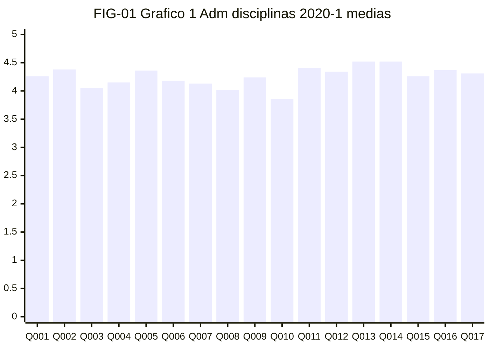
```mermaid
xychart-beta
    title "FIG-01 Grafico 1 Adm disciplinas 2020-1 medias"
    x-axis [Q001, Q002, Q003, Q004, Q005, Q006, Q007, Q008, Q009, Q010, Q011, Q012, Q013, Q014, Q015, Q016, Q017]
    y-axis 0 --> 5
    bar [4.26, 4.38, 4.05, 4.15, 4.36, 4.18, 4.13, 4.02, 4.24, 3.86, 4.41, 4.34, 4.52, 4.52, 4.26, 4.37, 4.31]
```

### FIG-02. Gráfico 2, Administração, disciplinas 2020/2 (página 27, imagem p27_x241)

Médias: Q001 4,05; Q002 4,15; Q003 3,96; Q004 3,95; Q005 4,16; Q006 4,17; Q007 4,15; Q008 3,94; Q009 4,13; Q010 3,98; Q011 4,26; Q012 4,04; Q013 4,41; Q014 4,27; Q015 4,04; Q016 4,14; Q017 4,13. Rotulados: Q001 39, 38, 15; Q002 51, 24, 16; Q003 35, 40, 18; Q004 41, 30, 16, 8 no quarto; Q005 48, 30, 14; Q006 46, 30, 13; Q007 45, 31, 14; Q008 37, 34, 19; Q009 39, 38, 15; Q010 30, 47, 11; Q011 46, 36, 10; Q012 45, 29, 16; Q013 57, 26, 9; Q014 43, 42, 9; Q015 45, 27, 20; Q016 43, 36, 15; Q017 37, 36, 13 com 10 no cinza NSA. Maior média Q013 (4,41); menor Q008 (3,94).

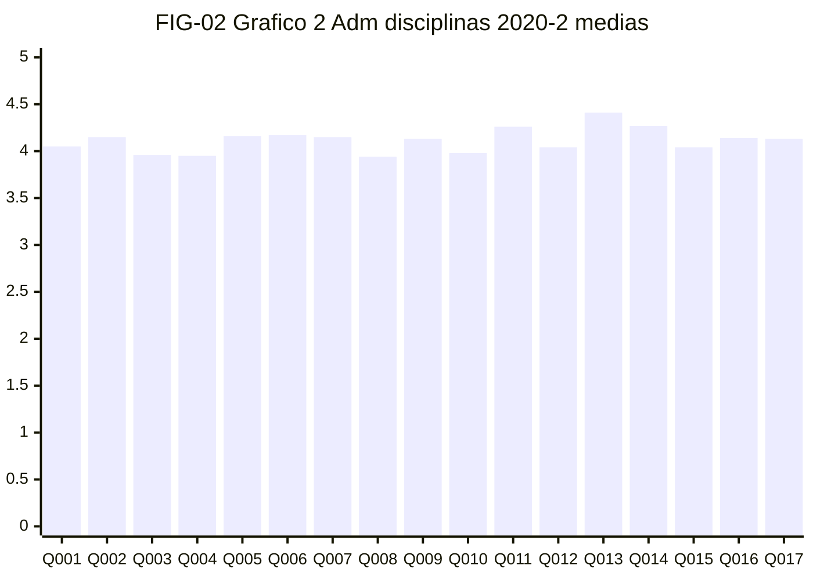
```mermaid
xychart-beta
    title "FIG-02 Grafico 2 Adm disciplinas 2020-2 medias"
    x-axis [Q001, Q002, Q003, Q004, Q005, Q006, Q007, Q008, Q009, Q010, Q011, Q012, Q013, Q014, Q015, Q016, Q017]
    y-axis 0 --> 5
    bar [4.05, 4.15, 3.96, 3.95, 4.16, 4.17, 4.15, 3.94, 4.13, 3.98, 4.26, 4.04, 4.41, 4.27, 4.04, 4.14, 4.13]
```

### FIG-03. Gráfico 3, Administração, atendimento 2020/2 (página 28, imagem p28_x243)

Médias: Q001 3,73; Q002 3,81; Q003 3,70. Rotulados: Q001 27, 34, 16, 13, 7 no cinza; Q002 27, 34, 23, 7 no cinza; Q003 27, 36, 13, 16. Texto fiel: avaliação relativamente satisfatória, mais crítica em Q003 (psicopedagógico).

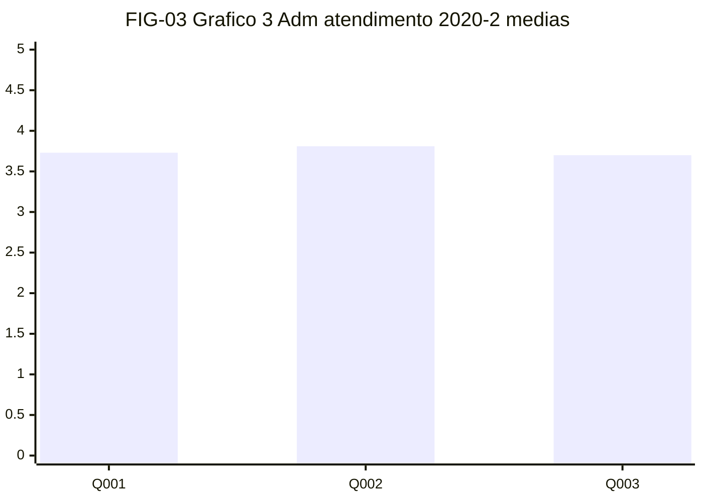
```mermaid
xychart-beta
    title "FIG-03 Grafico 3 Adm atendimento 2020-2 medias"
    x-axis [Q001, Q002, Q003]
    y-axis 0 --> 5
    bar [3.73, 3.81, 3.70]
```

### FIG-04. Gráfico 4, Administração, estímulo 2020/2 (página 29, imagem p29_x245)

Médias: Q001 3,73; Q002 3,75. Rotulados: Q001 18, 41, 14, 11, 14 no cinza; Q002 20, 37, 18, 9, 14 no cinza. Texto fiel: média satisfatória nos itens de eventos e produção científica.

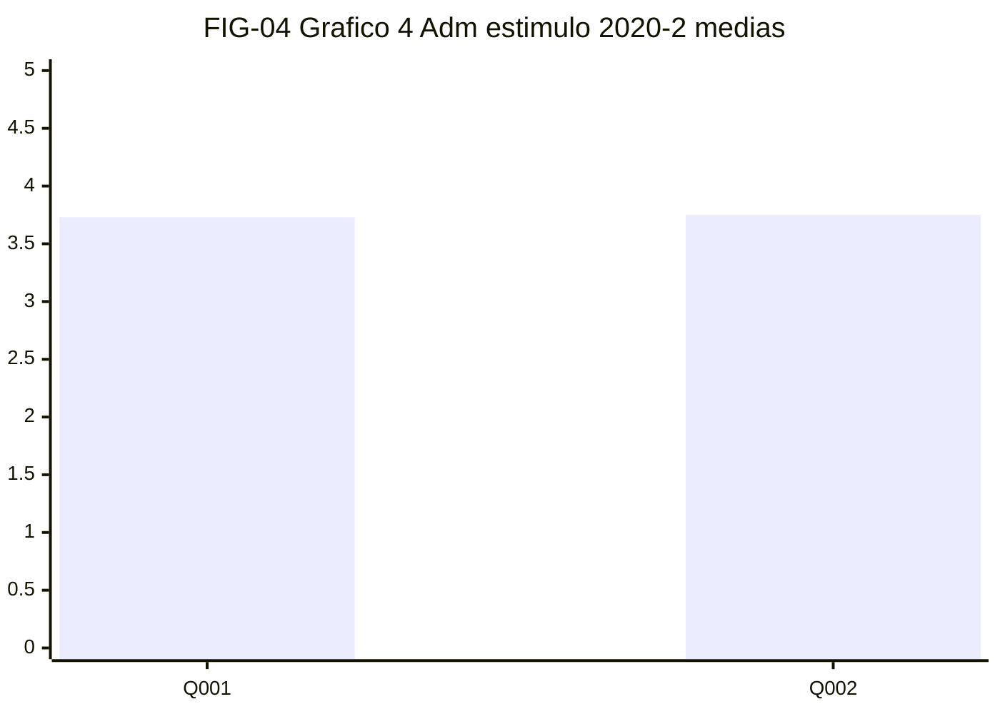
```mermaid
xychart-beta
    title "FIG-04 Grafico 4 Adm estimulo 2020-2 medias"
    x-axis [Q001, Q002]
    y-axis 0 --> 5
    bar [3.73, 3.75]
```

### FIG-05. Gráfico 5, Administração, planejamento 2020/2 (página 30, imagem p30_x247)

Médias: Q001 3,42; Q002 3,69; Q003 3,63; Q004 3,46. Rotulados: Q001 13, 32, 27, 16, 11; Q002 18, 45, 20, 14; Q003 18, 34, 21, 9, 14; Q004 18, 30, 21, 14, 11. Texto fiel: satisfatórias (3,42 a 3,69); menores Q001 (CSA) e Q004 (melhorias); CSA nova desde junho/2020 com avaliação 2020/1 em curso e sem ações presenciais (cartazes, telão, anfiteatro); melhorias não percebidas ou a divulgar; processo visto como indutor de avanços.

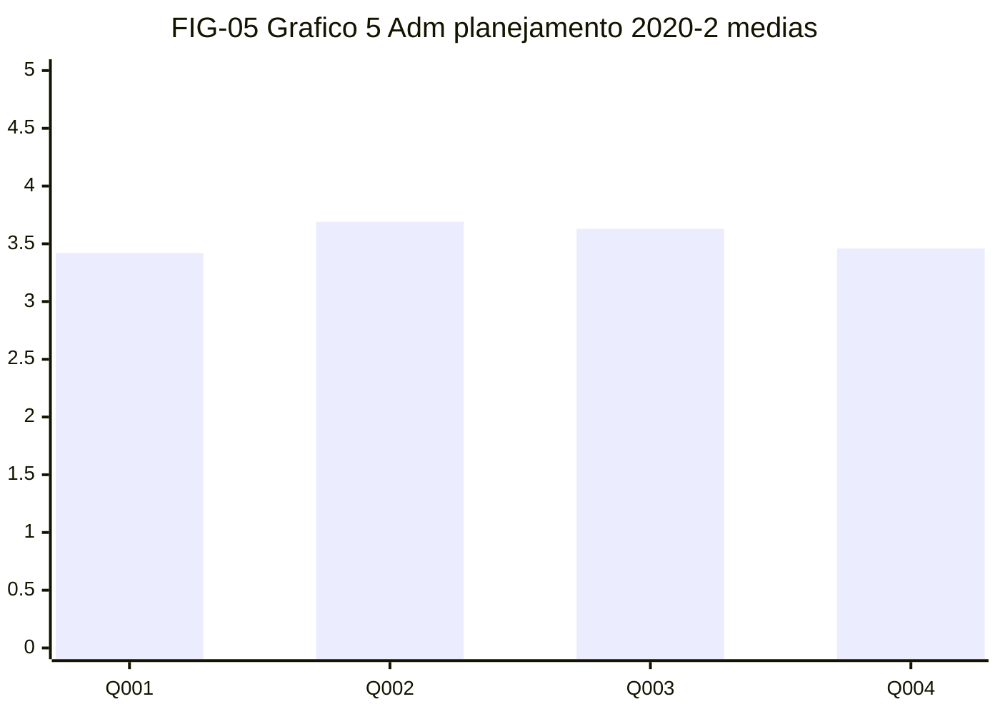
```mermaid
xychart-beta
    title "FIG-05 Grafico 5 Adm planejamento 2020-2 medias"
    x-axis [Q001, Q002, Q003, Q004]
    y-axis 0 --> 5
    bar [3.42, 3.69, 3.63, 3.46]
```

### FIG-06. Gráfico 6, Administração, NDE e Colegiado 2020/2 (página 33, imagem p33_x256)

Médias: Q001 3,94; Q002 3,96. Rotulados: Q001 29, 30, 18, 16 no cinza; Q002 27, 37, 14, 14 no cinza. Texto fiel: satisfatória, próximas de 4.

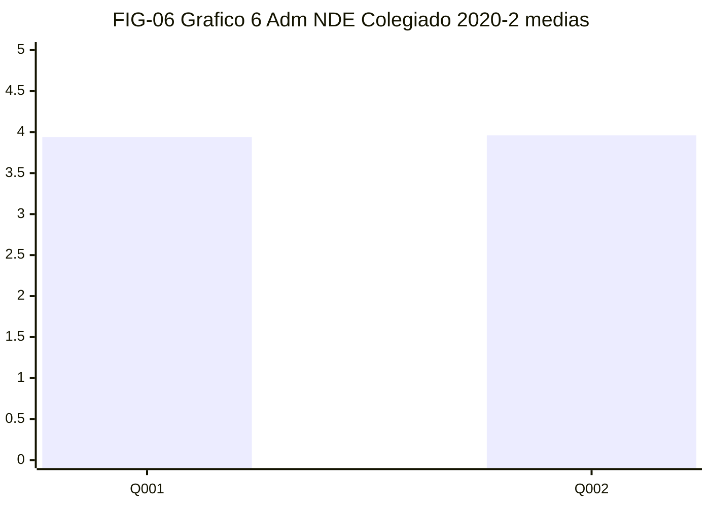
```mermaid
xychart-beta
    title "FIG-06 Grafico 6 Adm NDE Colegiado 2020-2 medias"
    x-axis [Q001, Q002]
    y-axis 0 --> 5
    bar [3.94, 3.96]
```

### FIG-07. Gráfico 7, Administração, coordenador 2020/1 (página 34, imagem p34_x258)

Médias: Q001 3,88; Q002 4,01; Q003 3,95; Q004 3,76; Q005 3,66; Q006 3,70; Q007 3,78; Q008 4,06; Q009 4,27; Q010 4,03. Rotulados: Q001 35, 29, 16, 13; Q002 40, 32, 19; Q003 35, 37, 13, 9; Q004 37, 28, 18, 10; Q005 32, 24, 21, 13; Q006 34, 24, 22, 12; Q007 34, 29, 13, 12; Q008 44, 31, 10; Q009 54, 26; Q010 43, 31, 12. Melhor Q009 (disponibilidade); menor Q005 (3,66, pesquisa e inovação).

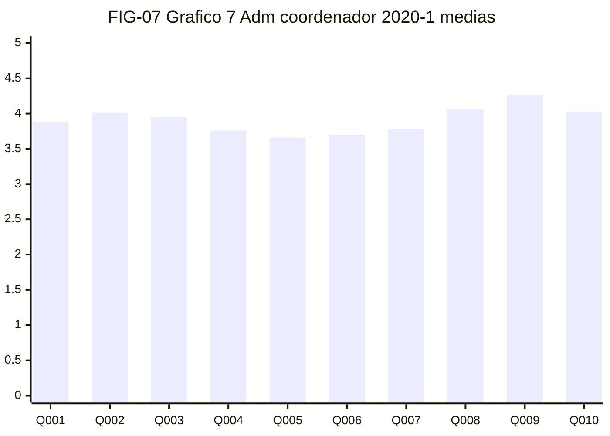
```mermaid
xychart-beta
    title "FIG-07 Grafico 7 Adm coordenador 2020-1 medias"
    x-axis [Q001, Q002, Q003, Q004, Q005, Q006, Q007, Q008, Q009, Q010]
    y-axis 0 --> 5
    bar [3.88, 4.01, 3.95, 3.76, 3.66, 3.70, 3.78, 4.06, 4.27, 4.03]
```

### FIG-08. Gráfico 8, Administração, coordenador 2020/2 (página 35, imagem p35_x260)

Médias: Q001 3,74; Q002 4,13; Q003 4,11; Q004 4,02; Q005 4,15; Q006 4,09; Q007 3,93; Q008 3,89; Q009 4,09; Q010 4,07. Rotulados: Q001 27, 32, 14, 13, 11; Q002 45, 30, 13; Q003 39, 36, 16; Q004 34, 37, 16; Q005 41, 37, 14; Q006 41, 32, 12; Q007 36, 36, 9, 14; Q008 36, 34, 13, 9; Q009 48, 25, 12, 11; Q010 43, 27, 20. Menor Q001 (3,74, PDI e PPC).

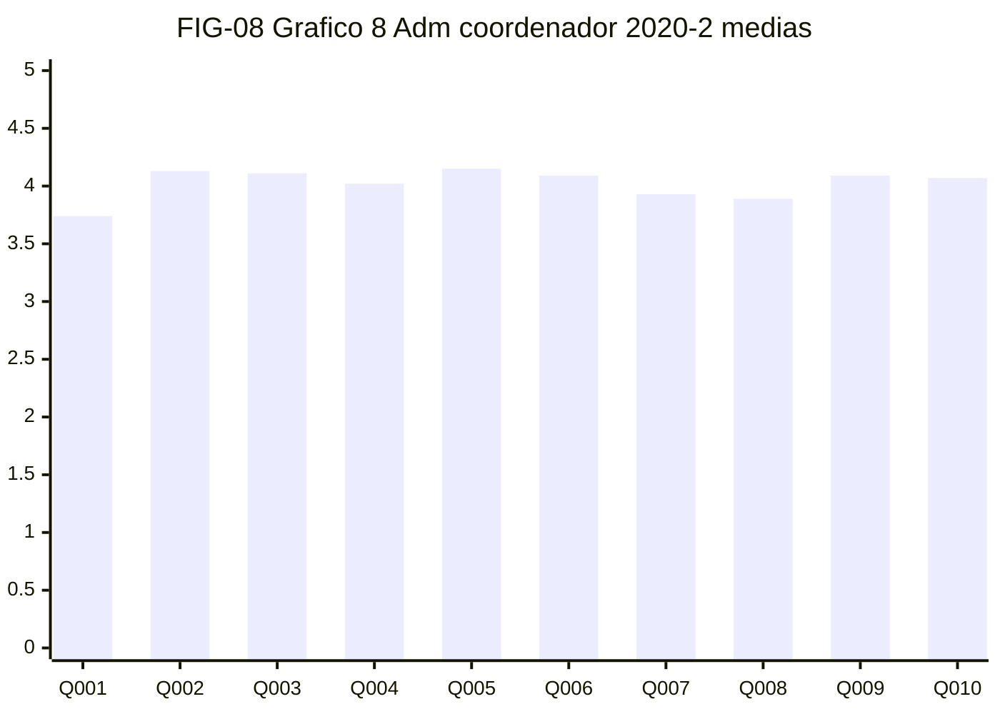
```mermaid
xychart-beta
    title "FIG-08 Grafico 8 Adm coordenador 2020-2 medias"
    x-axis [Q001, Q002, Q003, Q004, Q005, Q006, Q007, Q008, Q009, Q010]
    y-axis 0 --> 5
    bar [3.74, 4.13, 4.11, 4.02, 4.15, 4.09, 3.93, 3.89, 4.09, 4.07]
```

### FIG-09. Gráfico 9, Administração, remoto 2020/1 (página 35, imagem p35_x261)

Médias: Q001 3,44; Q002 3,57; Q003 2,91; Q004 3,18. Rotulados: Q001 26, 28, 21, 13, 12; Q002 28, 29, 19, 15, 7; Q003 15, 19, 24, 28, 15; Q004 18, 24, 28, 18, 12.

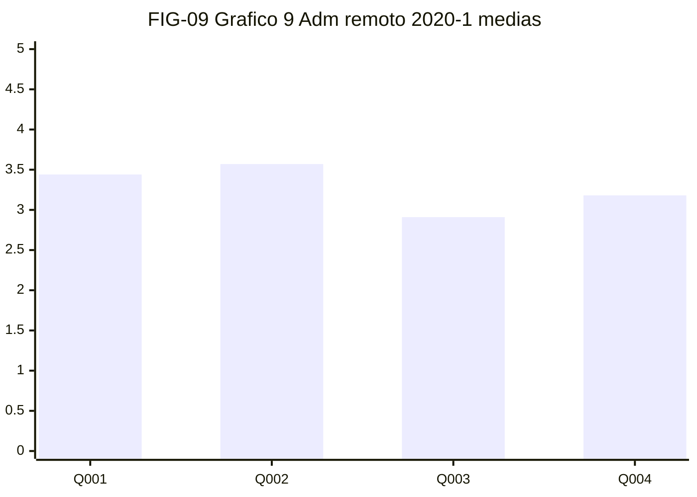
```mermaid
xychart-beta
    title "FIG-09 Grafico 9 Adm remoto 2020-1 medias"
    x-axis [Q001, Q002, Q003, Q004]
    y-axis 0 --> 5
    bar [3.44, 3.57, 2.91, 3.18]
```

### FIG-10. Gráfico 10, Administração, remoto 2020/2 (página 36, imagem p36_x263)

Médias: Q001 3,38; Q002 3,48; Q003 3,16; Q004 3,40. Rotulados: Q001 18, 39, 13, 23; Q002 14, 43, 23, 16; Q003 13, 32, 23, 20, 11; Q004 18, 34, 23, 16.

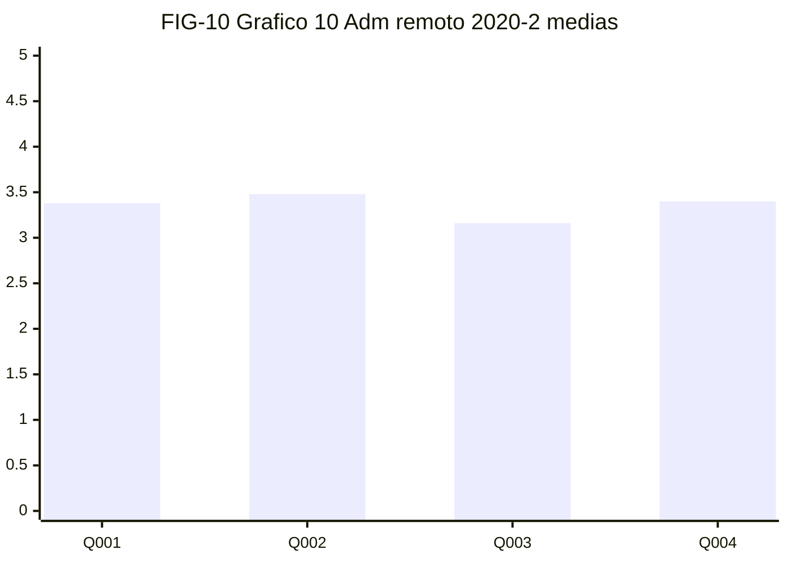
```mermaid
xychart-beta
    title "FIG-10 Grafico 10 Adm remoto 2020-2 medias"
    x-axis [Q001, Q002, Q003, Q004]
    y-axis 0 --> 5
    bar [3.38, 3.48, 3.16, 3.40]
```

### FIG-11. Gráfico 11, Matemática, disciplinas 2020/1 (página 43, imagem p43_x278)

Médias: Q001 4,09; Q002 4,25; Q003 4,08; Q004 4,01; Q005 4,18; Q006 3,92; Q007 4,02; Q008 4,16; Q009 4,03; Q010 4,15; Q011 4,27; Q012 4,20; Q013 4,40; Q014 4,42; Q015 4,23; Q016 4,36; Q017 4,22. Rotulados: Q001 44, 29, 17; Q002 48, 35, 9; Q003 39, 39, 12; Q004 39, 35, 14; Q005 44, 30, 12; Q006 34, 38, 12; Q007 40, 31, 17; Q008 38, 41, 12; Q009 31, 45, 13; Q010 39, 36, 13; Q011 50, 33, 9; Q012 50, 28, 11; Q013 59, 26, 8; Q014 55, 30, 11; Q015 47, 32, 13; Q016 49, 40; Q017 43, 33, 11, 9 no cinza.

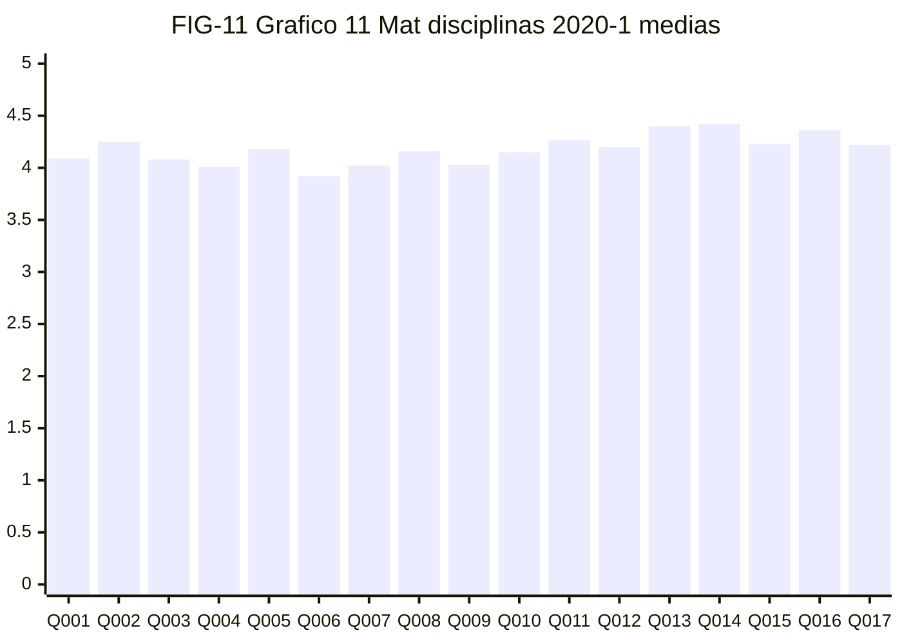
```mermaid
xychart-beta
    title "FIG-11 Grafico 11 Mat disciplinas 2020-1 medias"
    x-axis [Q001, Q002, Q003, Q004, Q005, Q006, Q007, Q008, Q009, Q010, Q011, Q012, Q013, Q014, Q015, Q016, Q017]
    y-axis 0 --> 5
    bar [4.09, 4.25, 4.08, 4.01, 4.18, 3.92, 4.02, 4.16, 4.03, 4.15, 4.27, 4.20, 4.40, 4.42, 4.23, 4.36, 4.22]
```

### FIG-12. Gráfico 12, Matemática, disciplinas 2020/2 (página 44, imagem p44_x280)

Médias: Q001 4,08; Q002 4,18; Q003 4,11; Q004 3,87; Q005 4,01; Q006 3,80; Q007 3,63; Q008 3,93; Q009 3,86; Q010 3,96; Q011 4,18; Q012 4,00; Q013 4,29; Q014 4,20; Q015 4,03; Q016 4,22; Q017 3,63. Rotulados: Q001 47, 29, 8, 12; Q002 46, 37, 8; Q003 40, 43, 9; Q004 38, 29, 18, 10; Q005 45, 29, 10, 13; Q006 35, 21, 32, 9; Q007 35, 21, 23, 11, 9; Q008 33, 37, 19, 10; Q009 35, 29, 21, 11; Q010 31, 45, 13; Q011 44, 32, 18; Q012 45, 28, 12, 10; Q013 54, 27, 8; Q014 49, 27, 10, 8; Q015 47, 29, 8, 10; Q016 45, 39, 10; Q017 27, 40, 10, 11, 10.

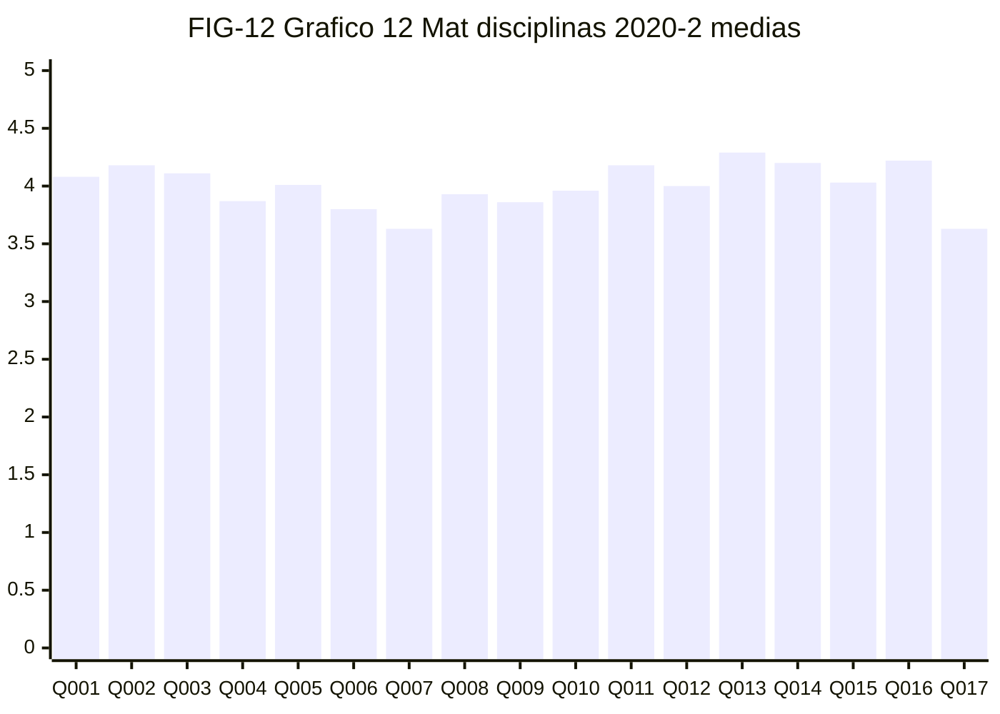
```mermaid
xychart-beta
    title "FIG-12 Grafico 12 Mat disciplinas 2020-2 medias"
    x-axis [Q001, Q002, Q003, Q004, Q005, Q006, Q007, Q008, Q009, Q010, Q011, Q012, Q013, Q014, Q015, Q016, Q017]
    y-axis 0 --> 5
    bar [4.08, 4.18, 4.11, 3.87, 4.01, 3.80, 3.63, 3.93, 3.86, 3.96, 4.18, 4.00, 4.29, 4.20, 4.03, 4.22, 3.63]
```

### FIG-13. Gráfico 13, Matemática, atendimento 2020/2 (página 45, imagem p45_x282)

Médias: Q001 3,55; Q002 3,42; Q003 3,35. Rotulados: Q001 25, 28, 9, 28, 9; Q002 16, 25, 19, 22, 19; Q003 16, 28, 13, 19, 6, 19.

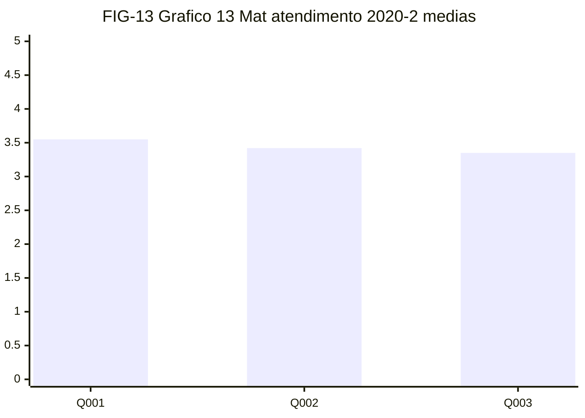
```mermaid
xychart-beta
    title "FIG-13 Grafico 13 Mat atendimento 2020-2 medias"
    x-axis [Q001, Q002, Q003]
    y-axis 0 --> 5
    bar [3.55, 3.42, 3.35]
```

### FIG-14. Gráfico 14, Matemática, estímulo 2020/2 (página 46, imagem p46_x284)

Médias: Q001 3,12; Q002 3,23. Rotulados: Q001 9, 22, 19, 25, 3, 22; Q002 9, 22, 19, 13, 6, 31.

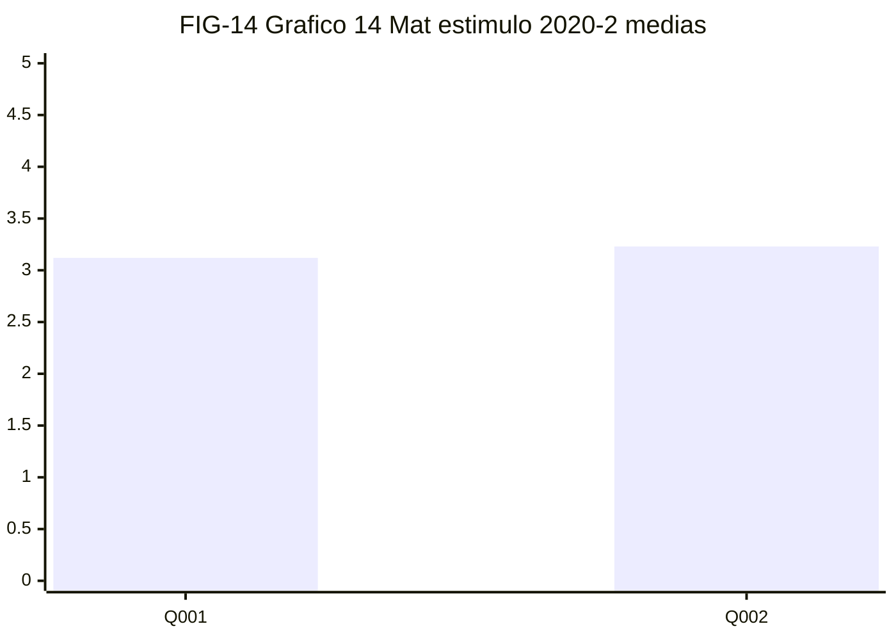
```mermaid
xychart-beta
    title "FIG-14 Grafico 14 Mat estimulo 2020-2 medias"
    x-axis [Q001, Q002]
    y-axis 0 --> 5
    bar [3.12, 3.23]
```

### FIG-15. Gráfico 15, Matemática, planejamento 2020/2 (página 47, imagem p47_x286)

Médias: Q001 3,22; Q002 3,41; Q003 3,07; Q004 2,93. Rotulados: Q001 9, 28, 22, 22, 3, 16; Q002 16, 25, 31, 19, 9 no cinza; Q003 6, 25, 31, 13, 9, 16; Q004 9, 16, 34, 16, 13, 13.

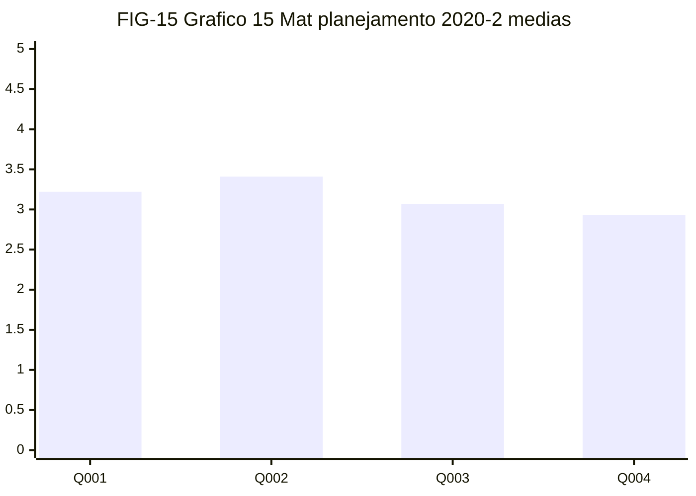
```mermaid
xychart-beta
    title "FIG-15 Grafico 15 Mat planejamento 2020-2 medias"
    x-axis [Q001, Q002, Q003, Q004]
    y-axis 0 --> 5
    bar [3.22, 3.41, 3.07, 2.93]
```

### FIG-16. Gráfico 16, Matemática, NDE e Colegiado 2020/2 (página 50, imagem p50_x292)

Médias: Q001 3,75; Q002 3,80. Rotulados: Q001 22, 28, 13, 9, 3, 25; Q002 16, 38, 19, 6, 22 no cinza.

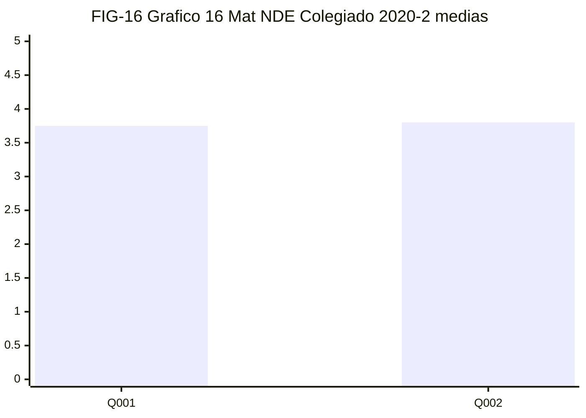
```mermaid
xychart-beta
    title "FIG-16 Grafico 16 Mat NDE Colegiado 2020-2 medias"
    x-axis [Q001, Q002]
    y-axis 0 --> 5
    bar [3.75, 3.80]
```

### FIG-17. Gráfico 17, Matemática, coordenador 2020/1 (página 51, imagem p51_x294)

Médias: Q001 3,52; Q002 3,64; Q003 3,55; Q004 3,55; Q005 3,30; Q006 3,40; Q007 3,43; Q008 3,47; Q009 3,67; Q010 3,38. Rotulados: Q001 25, 23, 25, 13, 8; Q002 23, 31, 31, 8; Q003 23, 27, 25, 8, 8, 10; Q004 19, 29, 23, 8, 15; Q005 15, 25, 25, 13, 17; Q006 17, 25, 21, 8, 10, 19; Q007 17, 27, 23, 10, 8, 15; Q008 23, 25, 23, 10, 10, 10; Q009 25, 38, 21, 10; Q010 21, 29, 27, 13, 10.

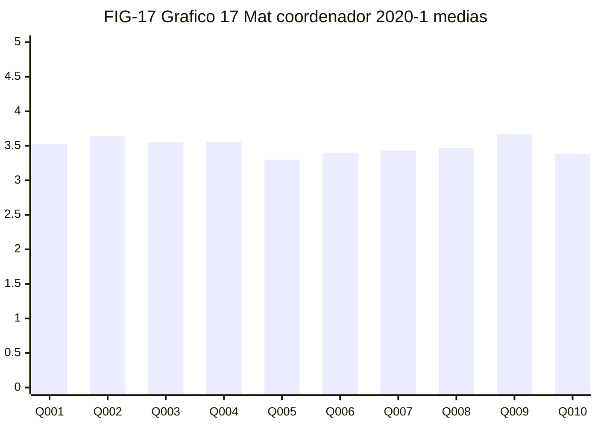
```mermaid
xychart-beta
    title "FIG-17 Grafico 17 Mat coordenador 2020-1 medias"
    x-axis [Q001, Q002, Q003, Q004, Q005, Q006, Q007, Q008, Q009, Q010]
    y-axis 0 --> 5
    bar [3.52, 3.64, 3.55, 3.55, 3.30, 3.40, 3.43, 3.47, 3.67, 3.38]
```

### FIG-18. Gráfico 18, Matemática, coordenador 2020/2 (página 52, imagem p52_x296)

Médias: Q001 3,00; Q002 3,63; Q003 3,21; Q004 2,93; Q005 3,45; Q006 3,30; Q007 3,28; Q008 3,20; Q009 3,41; Q010 3,30. Rotulados: Q001 6, 25, 31, 25, 6, 6; Q002 19, 47, 16, 16, 3; Q003 16, 25, 25, 13, 13, 9; Q004 9, 19, 31, 13, 16, 13; Q005 19, 31, 22, 9, 9, 9; Q006 16, 22, 28, 9, 9, 16; Q007 13, 31, 25, 13, 9, 9; Q008 13, 28, 28, 16, 9, 6; Q009 25, 28, 22, 13, 13; Q010 19, 28, 22, 13, 13, 6.

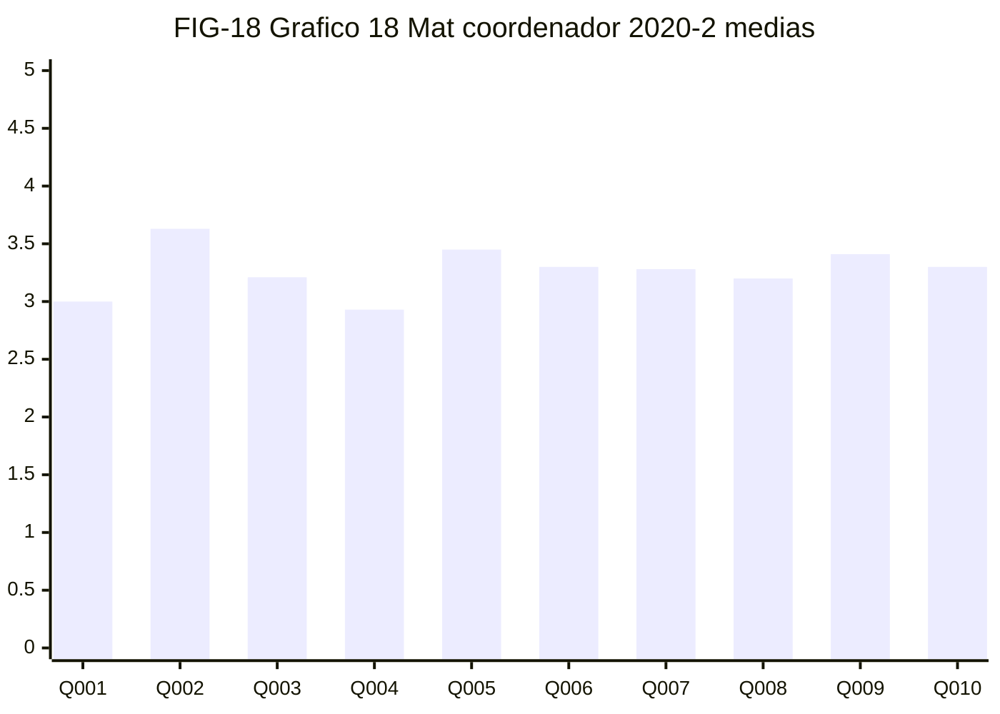
```mermaid
xychart-beta
    title "FIG-18 Grafico 18 Mat coordenador 2020-2 medias"
    x-axis [Q001, Q002, Q003, Q004, Q005, Q006, Q007, Q008, Q009, Q010]
    y-axis 0 --> 5
    bar [3.00, 3.63, 3.21, 2.93, 3.45, 3.30, 3.28, 3.20, 3.41, 3.30]
```

### FIG-19. Gráfico 19, remoto 2020/1, contexto Matemática, título com defeito diz Administração (página 53, imagem p53_x298)

Defeito de rotulagem preservado: o título impresso menciona Administração, mas a seção é a 3.1.2.9 da Matemática. Médias: Q001 3,13; Q002 3,10; Q003 2,74; Q004 3,00. Rotulados: Q001 12, 25, 37, 19, 8; Q002 37, 31, 15, 12 (verde sem rótulo); Q003 23, 29, 19, 15, 12 no cinza; Q004 17, 17, 27, 13, 19.

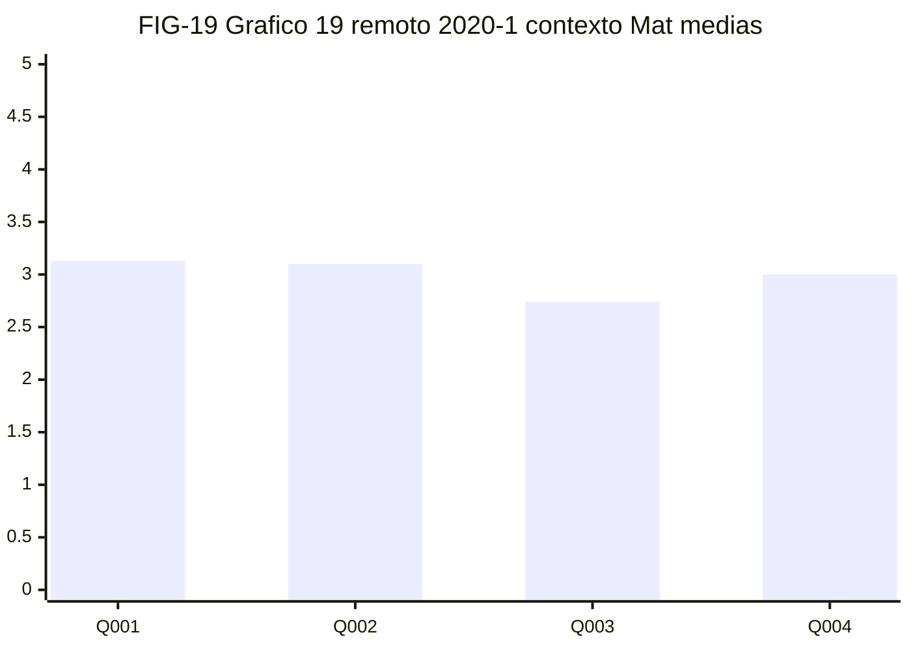
```mermaid
xychart-beta
    title "FIG-19 Grafico 19 remoto 2020-1 contexto Mat medias"
    x-axis [Q001, Q002, Q003, Q004]
    y-axis 0 --> 5
    bar [3.13, 3.10, 2.74, 3.00]
```

### FIG-20. Gráfico 20, remoto 2020/2, contexto Matemática, título com defeito diz Administração (página 53, imagem p53_x299)

Defeito preservado. Médias: Q001 3,31; Q002 3,22; Q003 2,66; Q004 3,06. Rotulados: Q001 19, 28, 19, 34; Q002 16, 22, 38, 19, 6; Q003 6, 16, 31, 31, 16; Q004 19, 22, 16, 34, 9.

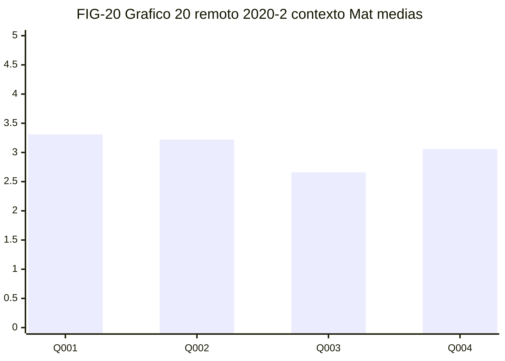
```mermaid
xychart-beta
    title "FIG-20 Grafico 20 remoto 2020-2 contexto Mat medias"
    x-axis [Q001, Q002, Q003, Q004]
    y-axis 0 --> 5
    bar [3.31, 3.22, 2.66, 3.06]
```

### FIG-21. Gráfico 21, Psicologia, disciplinas 2020/1 (página 61, imagem p61_x308)

Médias: Q001 3,91; Q002 4,12; Q003 3,76; Q004 3,72; Q005 4,05; Q006 3,85; Q007 3,87; Q008 3,79; Q009 3,84; Q010 3,90; Q011 4,12; Q012 3,97; Q013 4,13; Q014 4,21; Q015 4,13; Q016 4,18; Q017 4,12. Rotulados: Q001 43, 23, 18, 7; Q002 50, 23, 16; Q003 33, 27, 23, 11; Q004 35, 23, 22, 8, 8; Q005 45, 26, 12; Q006 33, 33, 19; Q007 37, 22, 24, 9; Q008 30, 34, 16, 11; Q009 32, 32, 22; Q010 32, 31, 13, 7, 12 no cinza; Q011 44, 31, 13; Q012 42, 29, 12; Q013 43, 31, 15; Q014 48, 30, 11; Q015 51, 22, 14; Q016 52, 27, 8; Q017 47, 26, 11.

```mermaid
xychart-beta
    title "FIG-21 Grafico 21 Psi disciplinas 2020-1 medias"
    x-axis [Q001, Q002, Q003, Q004, Q005, Q006, Q007, Q008, Q009, Q010, Q011, Q012, Q013, Q014, Q015, Q016, Q017]
    y-axis 0 --> 5
    bar [3.91, 4.12, 3.76, 3.72, 4.05, 3.85, 3.87, 3.79, 3.84, 3.90, 4.12, 3.97, 4.13, 4.21, 4.13, 4.18, 4.12]
```

### FIG-22. Gráfico 22, Psicologia, disciplinas, título diz 2020/1 mas no contexto é 2020/2 (página 62, imagem p62_x310)

Defeito preservado. Médias: Q001 3,72; Q002 4,08; Q003 3,96; Q004 3,55; Q005 4,11; Q006 3,69; Q007 3,95; Q008 3,95; Q009 3,99; Q010 4,09; Q011 4,11; Q012 3,81; Q013 3,80; Q014 4,31; Q015 3,97; Q016 4,07; Q017 4,00. Rotulados: Q001 35, 21, 23, 11; Q002 53, 18, 16, 9; Q003 43, 26, 16, 9; Q004 33, 24, 20, 11, 12; Q005 47, 25, 17, 8; Q006 32, 22, 23, 13; Q007 38, 28, 17, 8; Q008 40, 30, 16, 8; Q009 37, 32, 18, 8; Q010 42, 28, 20; Q011 47, 24, 18, 9; Q012 39, 25, 17, 11; Q013 43, 22, 15, 9, 10; Q014 52, 26, 15; Q015 49, 18, 16, 8; Q016 47, 25, 17; Q017 46, 24, 16. Maior Q014 (4,31); menor Q004 (3,55).

```mermaid
xychart-beta
    title "FIG-22 Grafico 22 Psi disciplinas 2020-2 medias"
    x-axis [Q001, Q002, Q003, Q004, Q005, Q006, Q007, Q008, Q009, Q010, Q011, Q012, Q013, Q014, Q015, Q016, Q017]
    y-axis 0 --> 5
    bar [3.72, 4.08, 3.96, 3.55, 4.11, 3.69, 3.95, 3.95, 3.99, 4.09, 4.11, 3.81, 3.80, 4.31, 3.97, 4.07, 4.00]
```

### FIG-23. Gráfico 23, Psicologia, atendimento 2020/2 (página 63, imagem p63_x312)

Médias: Q001 3,15; Q002 3,36; Q003 2,93. Rotulados: Q001 18, 16, 22, 12, 14, 20; Q002 20, 18, 18, 14, 8, 24; Q003 8, 24, 22, 22, 12, 14.

```mermaid
xychart-beta
    title "FIG-23 Grafico 23 Psi atendimento 2020-2 medias"
    x-axis [Q001, Q002, Q003]
    y-axis 0 --> 5
    bar [3.15, 3.36, 2.93]
```

### FIG-24. Gráfico 24, Psicologia, estímulo 2020/2 (página 64, imagem p64_x314)

Médias: Q001 2,92; Q002 3,05. Rotulados: Q001 18, 27, 12, 12, 25 no cinza (verde sem rótulo); Q002 8, 25, 20, 14, 12, 22.

```mermaid
xychart-beta
    title "FIG-24 Grafico 24 Psi estimulo 2020-2 medias"
    x-axis [Q001, Q002]
    y-axis 0 --> 5
    bar [2.92, 3.05]
```

### FIG-25. Gráfico 25, Psicologia, planejamento 2020/2 (página 65, imagem p65_x316)

Médias: Q001 2,96; Q002 2,77; Q003 2,59; Q004 2,53. Rotulados: Q001 18, 14, 12, 49 no cinza (verdes sem rótulo); Q002 22, 20, 24, 10, 24; Q003 14, 20, 10, 20, 33; Q004 14, 20, 20, 16, 29. NSA dominante (24 a 49 por cento).

```mermaid
xychart-beta
    title "FIG-25 Grafico 25 Psi planejamento 2020-2 medias"
    x-axis [Q001, Q002, Q003, Q004]
    y-axis 0 --> 5
    bar [2.96, 2.77, 2.59, 2.53]
```

### FIG-26. Gráfico 26, Psicologia, NDE e Colegiado 2020/2 (página 68, imagem p68_x320)

Médias: Q001 3,32; Q002 3,29. Rotulados: Q001 14, 14, 20, 8, 39; Q002 16, 16, 22, 12, 31. Texto fiel: relativamente satisfatória, próximas de 3. NSA é a maior fatia (39 e 31 por cento).

```mermaid
xychart-beta
    title "FIG-26 Grafico 26 Psi NDE Colegiado 2020-2 medias"
    x-axis [Q001, Q002]
    y-axis 0 --> 5
    bar [3.32, 3.29]
```

### FIG-27. Gráfico 27, Psicologia, coordenador 2020/1 (página 69, imagem p69_x322)

Médias: Q001 3,37; Q002 3,53; Q003 3,29; Q004 2,95; Q005 2,98; Q006 3,04; Q007 3,15; Q008 3,42; Q009 3,47; Q010 3,46. Rotulados: Q001 14, 32, 22, 11, 9, 11; Q002 22, 32, 28, 11; Q003 20, 22, 20, 11, 13, 14; Q004 9, 22, 14, 18, 13, 22; Q005 11, 17, 17, 18, 11, 26; Q006 12, 17, 16, 20, 9, 26; Q007 12, 21, 22, 17, 8, 20; Q008 22, 28, 20, 17, 8; Q009 25, 24, 26, 13, 8; Q010 28, 22, 20, 16, 9.

```mermaid
xychart-beta
    title "FIG-27 Grafico 27 Psi coordenador 2020-1 medias"
    x-axis [Q001, Q002, Q003, Q004, Q005, Q006, Q007, Q008, Q009, Q010]
    y-axis 0 --> 5
    bar [3.37, 3.53, 3.29, 2.95, 2.98, 3.04, 3.15, 3.42, 3.47, 3.46]
```

### FIG-28. Gráfico 28, Psicologia, coordenador 2020/2 (página 70, imagem p70_x324)

Médias: Q001 3,26; Q002 4,09; Q003 3,49; Q004 3,24; Q005 3,50; Q006 3,35; Q007 3,60; Q008 3,52; Q009 3,69; Q010 3,89. Rotulados: Q001 18, 20, 20, 18, 8, 18; Q002 41, 27, 14, 10, 8; Q003 18, 29, 20, 12, 16; Q004 10, 27, 25, 12, 8, 18; Q005 27, 22, 16, 20, 10; Q006 22, 20, 27, 12, 10, 10; Q007 25, 27, 24, 8, 8, 8; Q008 27, 25, 20, 12, 10; Q009 41, 14, 18, 12, 10; Q010 39, 20, 22, 8, 8.

```mermaid
xychart-beta
    title "FIG-28 Grafico 28 Psi coordenador 2020-2 medias"
    x-axis [Q001, Q002, Q003, Q004, Q005, Q006, Q007, Q008, Q009, Q010]
    y-axis 0 --> 5
    bar [3.26, 4.09, 3.49, 3.24, 3.50, 3.35, 3.60, 3.52, 3.69, 3.89]
```

### FIG-29. Gráfico 29, Psicologia, remoto 2020/1 (página 71, imagem p71_x326)

Médias: Q001 2,99; Q002 3,10; Q003 2,12; Q004 2,66. Rotulados: Q001 17, 20, 20, 29, 13; Q002 18, 22, 18, 24, 13; Q003 9, 18, 26, 34, 9; Q004 21, 18, 26, 20, 8. Pior Q003 (2,12, aulas ao vivo; 34 por cento insatisfatório).

```mermaid
xychart-beta
    title "FIG-29 Grafico 29 Psi remoto 2020-1 medias"
    x-axis [Q001, Q002, Q003, Q004]
    y-axis 0 --> 5
    bar [2.99, 3.10, 2.12, 2.66]
```

### FIG-30. Gráfico 30, remoto 2020/2, contexto Psicologia, título com defeito diz Administração (página 71, imagem p71_x327)

Defeito preservado. Médias: Q001 3,20; Q002 3,24; Q003 2,43; Q004 2,94. Rotulados: Q001 16, 29, 18, 33; Q002 12, 35, 24, 20, 8; Q003 14, 27, 31, 24 (verde sem rótulo); Q004 20, 10, 29, 24, 16.

```mermaid
xychart-beta
    title "FIG-30 Grafico 30 remoto 2020-2 contexto Psi medias"
    x-axis [Q001, Q002, Q003, Q004]
    y-axis 0 --> 5
    bar [3.20, 3.24, 2.43, 2.94]
```

---

## 10. Lacunas e defeitos declarados desta conversão

Tabela 9 com células de frequência vazias no original (extraída mas vazia, sem inferência). Títulos com defeito preservados sem correção silenciosa: Gráficos 19 e 20 dizem Administração no contexto da Matemática; Gráfico 22 diz 2020/1 no contexto de 2020/2; Gráfico 30 diz Administração no contexto da Psicologia. Texto da página 33 remete à tabela 6 ao tratar do Gráfico 6; página 50 remete à tabela 6 ao tratar do Gráfico 16; página 68 remete ao gráfico 22 ao tratar do Gráfico 26. Segmentos de gráfico sem número impresso declarados como sem rótulo visível. Nenhum valor estimado. Questões discursivas agregadas sem transcrição individual, conforme regra de anonimização.

## 11. Metadados

- **Citação (ABNT)**: UNIVERSIDADE FEDERAL DE MATO GROSSO DO SUL. Câmpus de Paranaíba. Comissão Setorial de Avaliação. Relatório de autoavaliação setorial 2020. Paranaíba: CPAR/UFMS, 2020.
- **Correlatos**: `RSA_2020_CPAR.md` (análise); RAAI 2020 (recorte do trienal); Relatórios Setoriais 2019 e 2021.
- **Vinculação**: Lei n. 10.861/2004 (SINAES); Resolução COUN n. 96/2019; PDI 2015/2019; PDU 2018/2021 (com 2020-2024 em elaboração).
- **Fontes de dados citadas no original**: SIAI/AGETIC (adesão), SISGBA (auxílios), site do CPAR (colegiados), SEI/UFMS (processos), autores 2021 (organização).
