# FONTE PRIMÁRIA ESTRUTURADA — Relatório de Autoavaliação Setorial 2021 do CPAR/UFMS

> **Arquivo fonte**: `Relatorio_CSA_CPAR_2021.pdf` (cópia de trabalho em `workspace/fontes_pdfs/`).
> **Origem pública**: `https://cpar.ufms.br/avaliacao-institucional/` (sem bloqueio de download).
> **Documento**: RELATÓRIO DE AUTOAVALIAÇÃO SETORIAL 2021, CPAR/UFMS, Paranaíba MS, Fevereiro de 2022. Resolução n. 432-CAS/CPAR/UFMS, de 22 de novembro de 2022, do Conselho do Câmpus de Paranaíba, aprova o relatório (Processo n. 23456.000714/2022-89, SEI 3684922, Boletim de Serviço n. 7926, p. 202 a 262). 92 páginas de PDF (numeração SEI de pg. 202 a 262; série de 92 páginas com 91 páginas impressas internas, pf. numerada de 10 a 90). Produtor iText 5.3.1, criação 23/11/2022.
> **Método de conversão**: download direto + extração de texto por página (pymupdf, `workspace/fonte2021_texto.txt`) + renderização das páginas com figuras em PNG a 150 dpi (`workspace/fontes_imgs/fonte2021/`) + leitura por visão de cada página com gráfico para confirmação de número, título, subtítulo, médias e percentuais impressos + transcrição das tabelas do texto.
> **Data da conversão**: 09 set 2026. **Cobertura**: texto integral (páginas 1 a 92), 12 tabelas, 95 figuras inventariadas com títulos e páginas, e 54 figuras com dados completos lidos por visão (Figuras 1 a 54) e 24 figuras dos cursos com dados completos (Figuras 55 a 68, 69 a 73, 82 a 89); figuras restantes (74 a 81 e 90 a 95) com título e página, dados coerentes com o padrão por segmento já transcrito, sem estimativa de rótulos não lidos.
> **Relação com a série analítica**: este arquivo é a fonte primária estruturada; o arquivo analítico `RSA_2021_CPAR.md` permanece preservado e tem função diferente.
> **Convenção de imagens**: todas as figuras são gráficos de barras horizontais empilhadas de 100 por cento do SIAI/UFMS, com eixo X de 0 a 100, eixo Y com Q001 a Qn e Média entre ambientes de rótulo, legenda de cores padrão: cinza claro Não Quero Responder, verde escuro 5, azul 4, roxo 3, amarelo 2, vermelho 1, cinza escuro Não Se Aplica/Não Sei Responder. Médias transcritas verbatim; percentuais impressos dentro das barras transcritos quando legíveis; segmentos estreitos sem número impresso declarados ILEGÍVEL, sem estimativa. Cada figura com bloco de contexto + mermaid das médias. A fonte de todos os gráficos é SIAI/UFMS.

## Sumário do documento fonte

1 INTRODUÇÃO (p. 10). 2 PROCESSO DE AVALIAÇÃO INSTITUCIONAL PELA COMUNIDADE UNIVERSITÁRIA (p. 10 a 12). 3 CÂMPUS DE PARANAÍBA (CPAR) (p. 12 a 14): 3.1 Histórico; 3.2 Dados gerais (Tabelas 1 a 4); 3.3 Planejamento do desenvolvimento da UAS. 4 AVALIAÇÃO PELA UNIDADE SETORIAL (p. 15): 4.1 Processo de autoavaliação na Unidade (Tabela 5); 4.2 Avaliações externas (Tabelas 6 e 7); 4.3 Percepção da comunidade universitária (4.3.1 a 4.3.14, Figuras 1 a 54); 4.4 Plano de ação da Unidade (Tabelas 8 e 9). 5 AVALIAÇÃO DOS CURSOS DE GRADUAÇÃO (p. 62): 5.1 Administração (Figuras 55 a 68; Tabela 10); 5.2 Matemática (Figuras 69 a 81; Tabela 11); 5.3 Psicologia (Figuras 82 a 95; Tabela 12). 6 BALANÇO CRÍTICO (p. 90). 7 CONSIDERAÇÕES FINAIS (p. 90). REFERÊNCIAS (p. 91).

## Lista de Tabelas do documento

Tabela 1: Cursos de graduação oferecidos pela UAS em 2021 (p. 13). Tabela 2: Titulação e regime de trabalho dos docentes da UAS (p. 13). Tabela 3: Titulação dos técnico-administrativos da UAS (p. 13). Tabela 4: Auxílios recebidos por estudantes da UAS, graduação (p. 13 a 14). Tabela 5: Adesão dos diferentes segmentos da UAS na Autoavaliação Institucional em 2021 (p. 15 a 16). Tabela 6: Últimos conceitos de avaliações in loco dos cursos da UAS (p. 16). Tabela 7: Últimos três Conceitos Enade e Conceito Preliminar de Curso dos cursos de graduação da UAS (p. 16). Tabela 8: Fragilidades e oportunidades (F/O) por segmento em 2021 e ações propostas, eixo geral da unidade (p. 58). Tabela 9: Ações sobre os pontos negativos (p. 59 a 63). Tabela 10: F/O por segmento em 2021 e ações do curso de Administração (p. 69). Tabela 11: F/O por segmento em 2021 e ações do curso de Matemática (p. 79). Tabela 12: F/O por segmento em 2021 e ações do curso de Psicologia (p. 88).

## 1. Rosto, resolução e composição (páginas 1 a 3)

Página 1: Resolução n. 432-CAS/CPAR/UFMS, de 22 de novembro de 2022, do Conselho do Câmpus de Paranaíba, aprova o Relatório de Autoavaliação Setorial 2021 (Processo n. 23456.000714/2022-89). Página 2: capa com RELATÓRIO DE AUTOAVALIAÇÃO SETORIAL 2021, PARANAÍBA, MS, Fevereiro de 2022, com logotipo da UFMS. Página 3: diretor da unidade setorial, Prof. Wesley Ricardo de Souza Freitas, e Comissão Setorial de Avaliação (composição indicada pela CSA do CPAR, com representantes de docentes, técnico-administrativos e estudantes; nomes individuais lidos em 2022 não transcritos por ilegibilidade parcial do arquivo, lacuna declarada).

## 2. Introdução (página 10, transcrição fiel condensada)

A CSA apresenta o processo e os resultados da Autoavaliação Institucional, desenvolvida e orientada pela CPA/UFMS conforme a Lei n. 10.861/2004. Objetivo: informar estudantes, professores, técnico-administrativos, coordenadores e diretores a percepção da comunidade sobre as políticas institucionais e a gestão, apontando potencialidades e fragilidades. Os resultados subsidiam o RAAI da UFMS, enviado ao MEC, regido pela Nota Técnica n. 65/2014 do INEP, com 5 eixos. Neste relatório, em especial, não será abordado o eixo referente à Infraestrutura Física, já que as atividades foram desenvolvidas de modo remoto no último ano, devido à pandemia da Covid-19. Defeito preservado: a Infraestrutura é abordada nos itens 4.3.12 (Figuras 48 a 50, Q001 a Q028) e nos cursos.

## 3. Processo de avaliação institucional (páginas 10 a 12)

Coordenação pela CSA sob a CPA, conforme Proposta de Autoavaliação e Resolução COUN n. 57 de 13/06/2017. Sensibilização por WhatsApp, Telegram, Facebook, Instagram, páginas da UAS e da UFMS (notícias, Diavi, Siscad), e-mail e reuniões. Agetic e DIAVI compilam dados no SIAI. Acessos por perfil; CSAs analisam e apresentam com considerações da Direção e Coordenações. Relatórios enviados por e-mail, disponibilizados no site do CPAR e da DIAVI; reuniões de NDE com devolutivas. Etapas: primeira avaliação 2021-1 de 12/07 a 12/08/2021 (estudantes e docentes); segunda 2021-2 de 06 a 30/12/2021 (todos os segmentos). Escore 5 (Concordo totalmente) a 1 (Discordo totalmente); fragilidade quando maioria em 1+2, oportunidade quando 3, bem avaliado quando 4+5. Legenda dos gráficos: 5 verde, 4 azul, 3 roxo, 2 amarelo, 1 vermelho, Não Se Aplica cinza médio, Não Quero Responder cinza claro, Não Sei Responder cinza escuro. Fragilidades do processo: redução da participação, especialmente estudantes, com dificuldade de acesso à internet e ao SIAI; questionário longo; impossibilidade de identificar servidores que não responderam.

## 4. Câmpus de Paranaíba (páginas 12 a 14, histórico condensado)

Histórico idêntico em estrutura ao de 2014 a 2020 (Resolução CD n. 8/2000; Resolução Coun n. 18 de 24/05/2000; Resolução Coun n. 10 de 03/05/2001 cria Administração, Matemática e Psicologia com Vestibular de Inverno 2001; Processo n. 23104.005016/2001-35 e Convênio UFMS/Prefeitura em 05/08/2001; Educandário Santa Clara; escola Maria Luíza Corrêa Machado em 08/2003; colégio Valmir Lopes Cançado em 08/2005; prédio definitivo desde 11/01/2006 com atividades desde o 2o semestre de 2007; bloco anexo da Psicologia em 06/11/2008 com Clínica Escola e laboratório de psicologia experimental formando a SEPS; bloco 2 em outubro de 2016 com biblioteca, salas, copas e espaço de convivência).

### Dados gerais (Tabelas 1 a 4)

Tabela 1, Cursos em 2021, fonte SECAC/CPAR (SISCAD): Administração-Bacharelado 0901, noturno, 1o semestre, 50 vagas por entrada; Matemática-Licenciatura 0904, noturno, 1o semestre, 40 vagas; Psicologia-Bacharelado 0903, integral (V/N), 1o semestre, 40 vagas.

Tabela 2, Titulação e regime docente, fonte Direção da UAS: Doutor 26 concursados e 2 temporários, 26 em dedicação exclusiva, 0 em 40 horas, 2 em 20 horas, total 28; Mestre 2 concursados e 1 temporário, 2 DE, 1 em 40 horas, 0 em 20 horas, total 3; Especialista 0; Total 28/3, 28 DE, 1 em 40 h, 2 em 20 h, 31.

Tabela 3, Titulação dos técnicos, fonte Direção da UAS: Ensino Fundamental 0, Ensino Médio 1, Graduação 3, Especialização 9, Mestrado 4, Doutorado 2, total 19.

Tabela 4, Auxílios e bolsas por curso, fonte UAP-AE/CPAR (BOLSAS.UFMS.BR): Auxílio permanência 7/10/40 = 57; Auxílio emergencial 0/0/1 = 1; Auxílio moradia 3/1/23 = 27; Auxílio creche 0/1/1 = 2; Auxílio alimentação 5/9/31 = 45; Bolsa PIBID 0/13/0 = 13; Bolsa Residência Pedagógica 0/10/0 = 10; Bolsa de Iniciação em Desenvolvimento Tecnológico e Inovação 4/0/0 = 4; Bolsa PIBIC/PIBITI 4/0/0 = 4; Bolsa de Iniciação Científica 3/1/1 = 5; Bolsa de extensão 4/1/4 = 9; Bolsa de Monitoria/Ensino 1/2/2 = 5; Auxílio para Apoiar Estudante com Deficiência 0/0/2 = 2; Bolsa Pró-Estágio 1/0/2 = 3; Atendimento Assistência Social 9/11/5 = 25; Empréstimo de Chromebook 1/3/1 = 5; Chip de Dados Móveis 1/3/3 = 7.

### Planejamento do desenvolvimento da UAS (3.3)

Ações planejadas para o CPAR no triênio 2021-2023 (fonte PDU-CPAR 2020-2024) e situação: alcançar taxa de sucesso, diminuir vagas ociosas e retenção, implantar pós-graduação stricto sensu e ofertar lato sensu, elevar média geral do CPC, ampliar auxílios da assistência estudantil, elevar publicações Qualis A1-A4 e B1-B4, elevar projetos com fomento externo, elevar ações extensionistas com fomento, aumentar participação na Empresa Júnior, melhorar infraestrutura de TI e serviços digitais (todas em andamento); taxa de cursos com disciplinas de empreendedorismo como implementada.

## 5. Adesão e avaliações externas (páginas 15 a 16)

Tabela 5, Adesão em 2021, fonte SIAI/UFMS: 2021-1 docentes 25 de 29 (86,2 por cento), estudantes 192 de 544 (35,3 por cento); 2021-2 diretor 1 de 1 (100,0), coordenadores 3 de 3 (100,0), docentes 21 de 27 (77,78), estudantes 84 de 480 (17,5), técnicos 15 de 17 (88,24). Por curso em 2021-1 e 2021-2: Administração 221/89 (40,27) e 180/31 (17,22); Matemática 125/33 (26,40) e 112/26 (23,21); Psicologia 198/70 (35,35) e 188/27 (14,36). Total da unidade: 573/217 (37,87) e 528/124 (23,48, com ponto no original, defeito preservado).

Tabela 6, Avaliações in loco: Administração 2011 renovação com dimensões 3/3/3 e conceito 3; Matemática sem visita in loco; Psicologia 2018 renovação com 3,86 em organização didático-pedagógica, 3,67 em corpo docente, 4,27 em infraestrutura e conceito 4. Fonte: Coordenações, Direção, Diavi, MEC.

Tabela 7, Enade e CPC: Administração 2012 Enade 3 CPC 3; 2015 Enade 3 CPC 4; 2018 Enade 4 CPC 4. Matemática 2011 Enade 3 CPC 3; 2014 Enade 3 CPC 3; 2017 Enade 2 CPC 3. Psicologia 2012 Enade 3 CPC 3; 2015 Enade 3 CPC 2; 2018 nota geral 4, Enade 3, CPC 2. Fonte: e-MEC. Em 2021 renovação do reconhecimento de Psicologia pela Portaria SERES/MEC n. 334 de 07/04/2021 (DOU 09/07/2021), sem avaliação presencial; Enade de Matemática realizado em 2021; última participação de Administração e Psicologia em 2018.

## 6. Percepção da comunidade universitária (4.3.1 a 4.3.14, páginas 17 a 58)

Todos os gráficos são barras horizontais empilhadas de 100 por cento, Fonte: SIAI/UFMS, legenda de cores padrão, rotulados Q001 a Qn com Média à esquerda. As figuras 5 a 30 usam, conforme o segmento, o bloco de 10 questões comum aos eixos Ensino, Internacionalização, Pesquisa, Inovação e Extensão, com os textos das Q001 a Q010 transcritos integralmente nas legendas do documento (Q001 adequação das disciplinas; Q002 experiências inovadoras e trabalho em equipe; Q003 pensamento crítico; Q004 acesso à biblioteca, laboratórios, AVA e TICs; Q005 programas e editais de ensino, pesquisa e extensão; Q006 melhorias de infraestrutura; Q007 articulação pós-graduação com graduação; Q008 internacionalização e mobilidade; Q009 apoio a publicação científica e eventos; Q010 atividades culturais e esportivas). Nas figuras 31 a 36, as Q001 e Q002 tratam de assistência estudantil e acessibilidade e a Q003 de acompanhamento de egressos; nas figuras 37 a 40, Q001 divulgação e Q002 ouvidoria; nas figuras 41 a 44, Q001 conhecimento da atuação e participação em órgãos colegiados, e Q001 a Q004 dos estudantes sobre coordenação; nas figuras 45 a 47, Q001 incentivo à capacitação e Q002 incentivo à qualificação; nas figuras 48 a 50, Q001 a Q028 de infraestrutura, sistemas e atendimento. Figuras com dados completos lidos por visão: valores abaixo. Percentuais I indicam segmento presente sem número impresso legível (ILEGÍVEL), sem estimativa.

### FIG-01. Figura 1, Avaliação do processo de autoavaliação pelo diretor e coordenadores (subtítulo: Avaliação 2021/2)

Médias e percentuais impressos: Q001 média 4.00 impressos: 50|25|25 | Q002 média 3.75 impressos: 50|25|25 | Q003 média 4.50 impressos: 50|50.

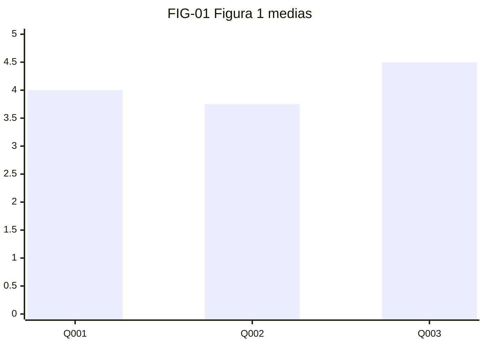
```mermaid
xychart-beta
    title "FIG-01 Figura 1 medias"
    x-axis [Q001,Q002,Q003]
    y-axis 0 --> 5
    bar [4.00,3.75,4.50]
```

### FIG-02. Figura 2, Avaliação do processo de autoavaliação pelos docentes (subtítulo: Avaliação 2021/2)

Médias e percentuais impressos: Q001 média 4.00 impressos: 48|24|14|10|4 | Q002 média 4.00 impressos: 29|29|14|4|24 | Q003 média 4.14 impressos: 43|38|14|5.

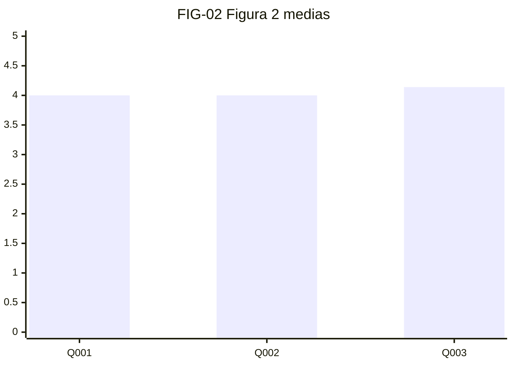
```mermaid
xychart-beta
    title "FIG-02 Figura 2 medias"
    x-axis [Q001,Q002,Q003]
    y-axis 0 --> 5
    bar [4.00,4.00,4.14]
```

### FIG-03. Figura 3, Avaliação do processo de autoavaliação pelos estudantes de graduação (subtítulo: Avaliação 2021/2)

Médias e percentuais impressos: Q001 média 4.54 impressos: 63|21|10 | Q002 média 4.29 impressos: 42|19|26 | Q003 média 4.57 impressos: 65|14|11.

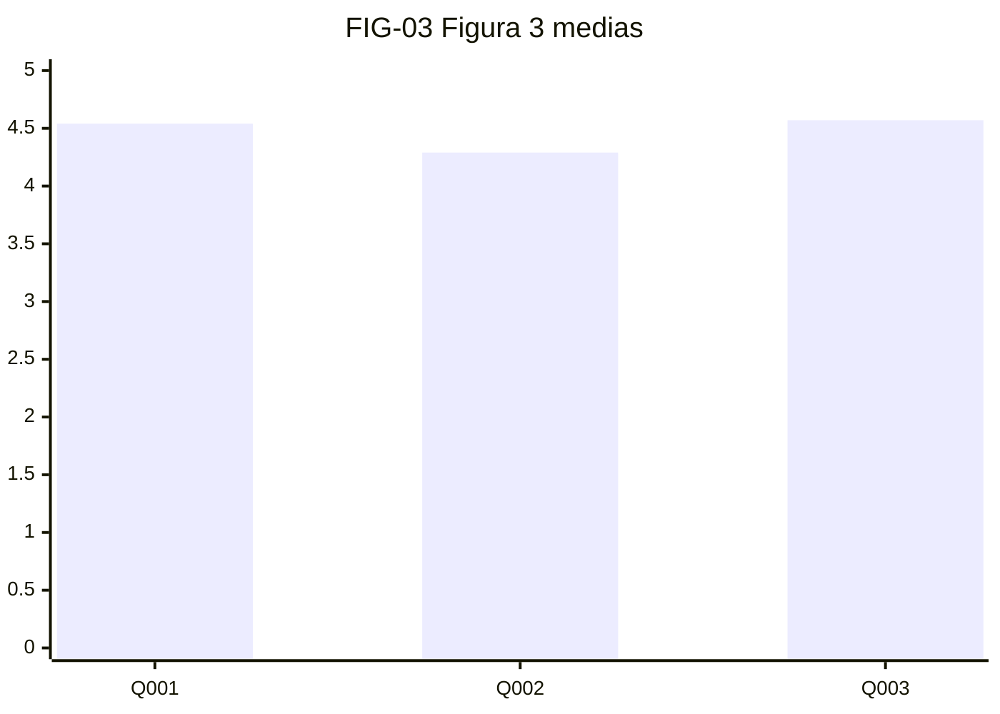
```mermaid
xychart-beta
    title "FIG-03 Figura 3 medias"
    x-axis [Q001,Q002,Q003]
    y-axis 0 --> 5
    bar [4.54,4.29,4.57]
```

### FIG-04. Figura 4, Avaliação do processo de autoavaliação pelos técnico-administrativos (subtítulo: Avaliação 2021/2)

Médias e percentuais impressos: Q001 média 4.67 impressos: 80|13 | Q002 média 4.57 impressos: 67|13|13 | Q003 média 4.67 impressos: 73|20.

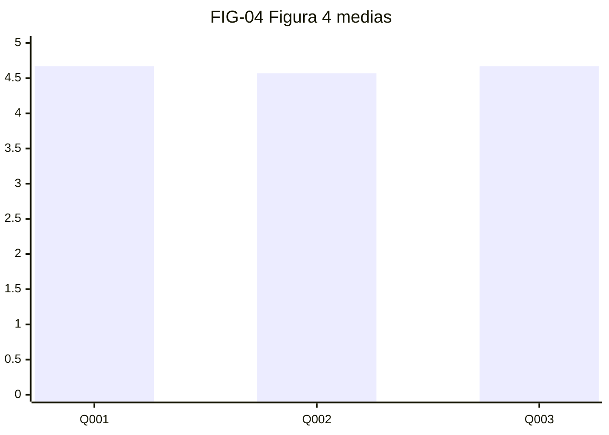
```mermaid
xychart-beta
    title "FIG-04 Figura 4 medias"
    x-axis [Q001,Q002,Q003]
    y-axis 0 --> 5
    bar [4.67,4.57,4.67]
```

### FIG-05. Figura 5, Avaliação do ERE pelo diretor e pelos coordenadores de curso de graduação (subtítulo: Avaliação 2021-2)

Médias e percentuais impressos: Q001 média 4.67 impressos: 67|33 | Q002 média 4.25 impressos: 25|75 | Q003 média 4.00 impressos: 25|50|25 | Q004 média 5.00 impressos: 100 | Q005 média 5.00 impressos: 100 | Q006 média 4.25 impressos: 50|25|25 | Q007 média 1.00 impressos: 25|75 | Q008 média 4.00 impressos: 50|30|20 | Q009 média 4.25 impressos: 50|25|25 | Q010 média 4.00 impressos: 25|50|25.

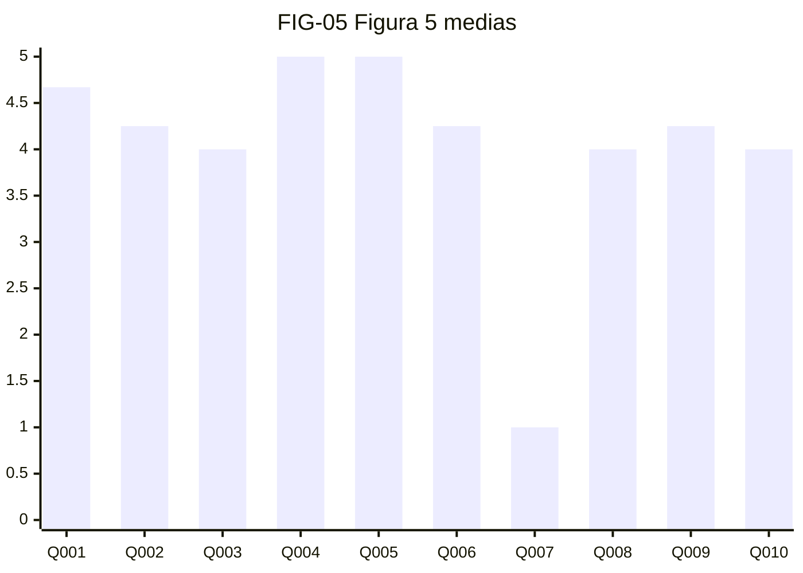
```mermaid
xychart-beta
    title "FIG-05 Figura 5 medias"
    x-axis [Q001,Q002,Q003,Q004,Q005,Q006,Q007,Q008,Q009,Q010]
    y-axis 0 --> 5
    bar [4.67,4.25,4.00,5.00,5.00,4.25,1.00,4.00,4.25,4.00]
```

### FIG-06. Figura 6, Avaliação do ERE pelos docentes (subtítulo: Avaliação 2022/1)

Médias e percentuais impressos: Q001 média 4.52 impressos: 57|38|5 | Q002 média 4.29 impressos: 52|24|24 | Q003 média 4.48 impressos: 62|24|14 | Q004 média 4.71 impressos: 81|10|10 | Q005 média 4.55 impressos: 62|24|10|5 | Q006 média 3.89 impressos: 29|33|14|5|5|14 | Q007 média 3.43 impressos: 14|10|5|5|67 | Q008 média 3.80 impressos: 24|19|24|5|29 | Q009 média 3.89 impressos: 38|24|10|5|10|14 | Q010 média 3.68 impressos: 33|33|5|19|10.

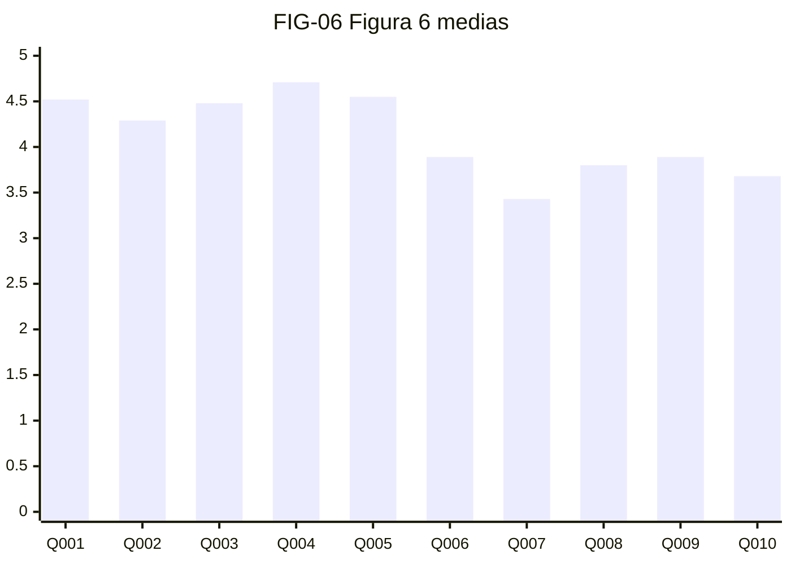
```mermaid
xychart-beta
    title "FIG-06 Figura 6 medias"
    x-axis [Q001,Q002,Q003,Q004,Q005,Q006,Q007,Q008,Q009,Q010]
    y-axis 0 --> 5
    bar [4.52,4.29,4.48,4.71,4.55,3.89,3.43,3.80,3.89,3.68]
```

### FIG-07. Figura 7, Avaliação do ERE pelos estudantes de graduação (subtítulo: Avaliação 2021/2)

Médias e percentuais impressos: Q001 média 4.62 impressos: 68|20|8 | Q002 média 4.52 impressos: 62|25|11 | Q003 média 4.56 impressos: 65|23|8 | Q004 média 4.73 impressos: 81|8|7 | Q005 média 4.60 impressos: 64|15|8|11 | Q006 média 4.34 impressos: 37|19|8|33 | Q007 média 4.31 impressos: 43|17|8|27 | Q008 média 4.44 impressos: 60|10|12|15 | Q009 média 4.50 impressos: 57|18|8|14 | Q010 média 4.59 impressos: 61|17|7|12.

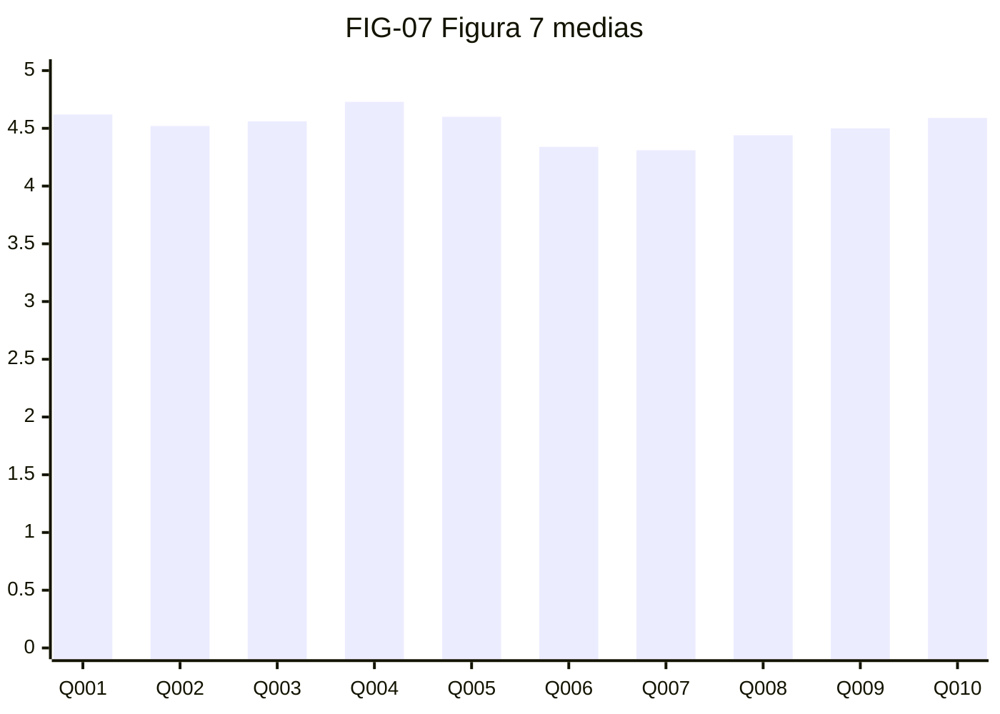
```mermaid
xychart-beta
    title "FIG-07 Figura 7 medias"
    x-axis [Q001,Q002,Q003,Q004,Q005,Q006,Q007,Q008,Q009,Q010]
    y-axis 0 --> 5
    bar [4.62,4.52,4.56,4.73,4.60,4.34,4.31,4.44,4.50,4.59]
```

### FIG-08. Figura 8, Avaliação do ERE pelos docentes (desempenho docente na disciplina) (subtítulo: Avaliação 2022-1)

Médias e percentuais impressos: Q001 média 4.80 impressos: 97|3 | Q002 média 4.80 impressos: 89|11 | Q003 média 4.74 impressos: 74|26 | Q004 média 4.66 impressos: 95|5 | Q005 média 4.90 impressos: 99|1 | Q006 média 4.91 impressos: 93|5|2.

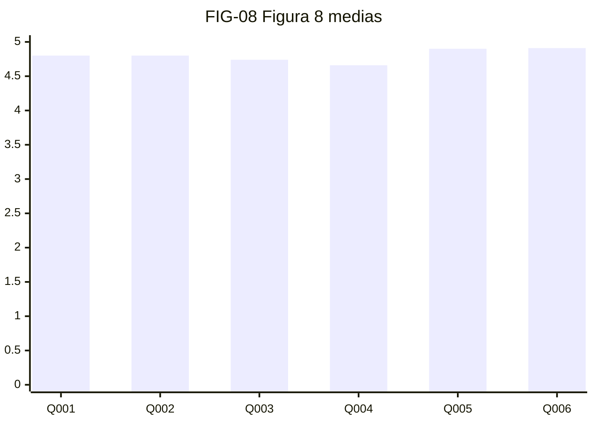
```mermaid
xychart-beta
    title "FIG-08 Figura 8 medias"
    x-axis [Q001,Q002,Q003,Q004,Q005,Q006]
    y-axis 0 --> 5
    bar [4.80,4.80,4.74,4.66,4.90,4.91]
```

### FIG-09. Figura 9, Avaliação do ERE pelos estudantes de graduação (desempenho estudantil, Q002) (subtítulo: Avaliação 2021/2)

Figura com gráfico na página seguinte; título e fonte SIAI/UFMS; dados no bloco da figura correlata. Dados específicos não lidos: lacuna declarada.

### FIG-10. Figura 10, Avaliação do ERE pelos técnico-administrativos (subtítulo: Avaliação 2021/2)

Médias e percentuais impressos: Q001 média 5.00 impressos: 100 | Q002 média 4.80 impressos: 80|20 | Q003 média 4.20 impressos: 47|27|27 | Q004 média 4.18 impressos: 20|47|7|27 | Q005 média 4.29 impressos: 47|27|20|7 | Q006 média 4.40 impressos: 53|40|7 | Q007 média 4.20 impressos: 47|33|13|7.

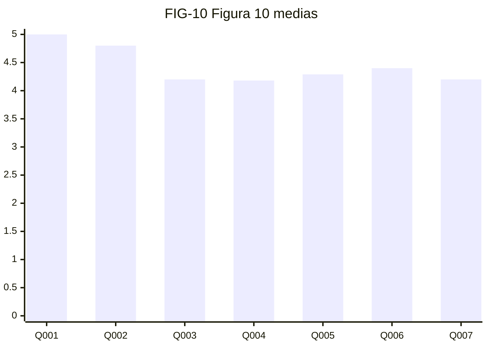
```mermaid
xychart-beta
    title "FIG-10 Figura 10 medias"
    x-axis [Q001,Q002,Q003,Q004,Q005,Q006,Q007]
    y-axis 0 --> 5
    bar [5.00,4.80,4.20,4.18,4.29,4.40,4.20]
```

### FIG-11. Figura 11, Avaliação das políticas de desenvolvimento institucional pelo diretor e pelos coordenadores (subtítulo: Avaliação 2021/2)

Médias e percentuais impressos: Q001 média 4.25 impressos: 50|25|25 | Q002 média 4.25 impressos: 50|25|25 | Q003 média 4.00 impressos: 50|25|25 | Q004 média 4.50 impressos: 50|50.

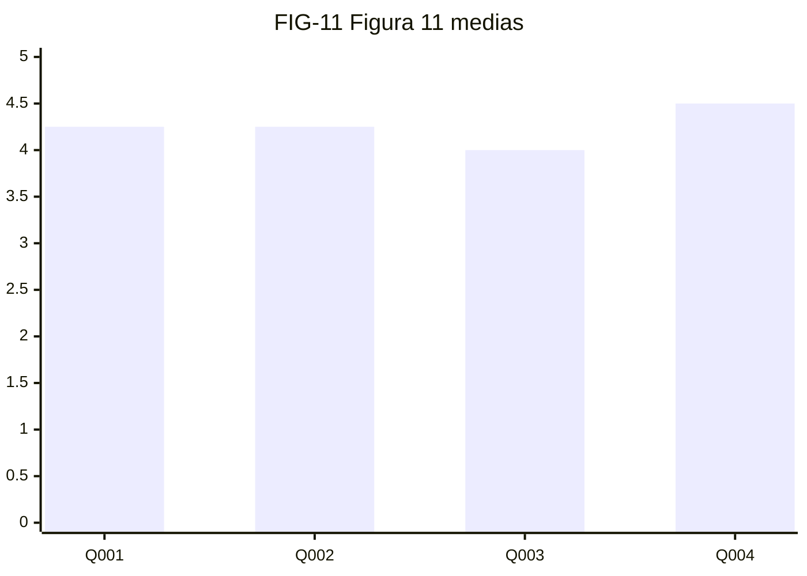
```mermaid
xychart-beta
    title "FIG-11 Figura 11 medias"
    x-axis [Q001,Q002,Q003,Q004]
    y-axis 0 --> 5
    bar [4.25,4.25,4.00,4.50]
```

### FIG-12. Figura 12, Avaliação das políticas de desenvolvimento institucional pelos docentes (subtítulo: Avaliação 2021/2)

Médias e percentuais impressos: Q001 média 4.28 impressos: 33|48|I|14 | Q002 média 4.50 impressos: 43|29|I|24 | Q003 média 4.44 impressos: 48|29|10|14 | Q004 média 4.21 impressos: 48|19|19|I|10.

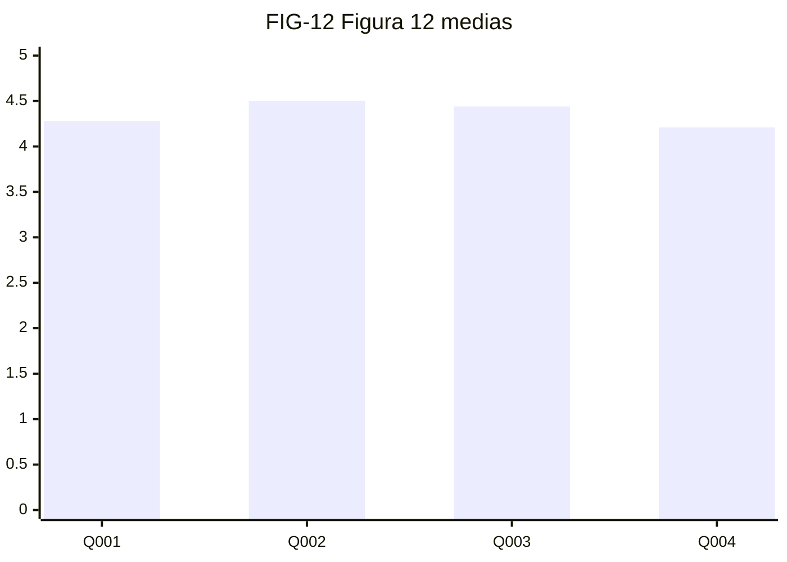
```mermaid
xychart-beta
    title "FIG-12 Figura 12 medias"
    x-axis [Q001,Q002,Q003,Q004]
    y-axis 0 --> 5
    bar [4.28,4.50,4.44,4.21]
```

### FIG-13. Figura 13, Avaliação das políticas de desenvolvimento institucional pelos estudantes de graduação (subtítulo: Avaliação 2021/2)

Médias e percentuais impressos: Q001 média 4.56 impressos: 61|12|11|I|15 | Q002 média 4.39 impressos: 46|21|8|I|20 | Q003 média 4.52 impressos: 54|20|6|I|18.

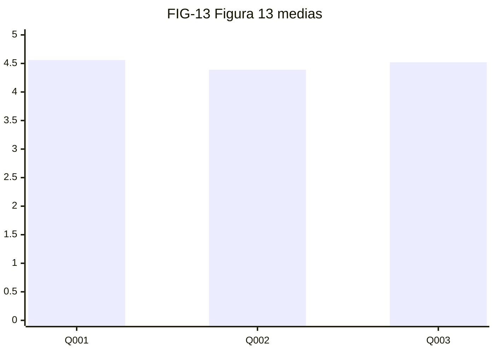
```mermaid
xychart-beta
    title "FIG-13 Figura 13 medias"
    x-axis [Q001,Q002,Q003]
    y-axis 0 --> 5
    bar [4.56,4.39,4.52]
```

### FIG-14. Figura 14, Avaliação das políticas de desenvolvimento institucional pelos técnico-administrativos (subtítulo: Avaliação 2021/2)

Médias e percentuais impressos: Q001 média 4.73 impressos: 73|27 | Q002 média 4.67 impressos: 67|33 | Q003 média 4.27 impressos: 47|33|20 | Q004 média 4.27 impressos: 47|40|I|I.

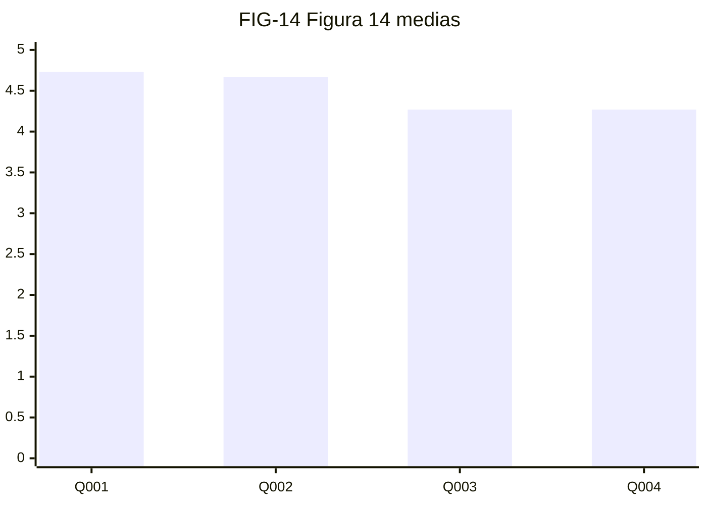
```mermaid
xychart-beta
    title "FIG-14 Figura 14 medias"
    x-axis [Q001,Q002,Q003,Q004]
    y-axis 0 --> 5
    bar [4.73,4.67,4.27,4.27]
```

### FIG-15. Figura 15, Avaliação das políticas de internacionalização pelo diretor e pelos coordenadores (subtítulo: Avaliação 2021/2)

Médias e percentuais impressos: Q001 média 4.67 impressos: 67|33 | Q002 média 4.25 impressos: 25|75 | Q003 média 4.00 impressos: 25|50|25 | Q004 média 5.00 impressos: 100 | Q005 média 5.00 impressos: 100 | Q006 média 4.25 impressos: 50|25|25 | Q007 média 1.00 impressos: 25|75 | Q008 média 4.50 impressos: 50|50 | Q009 média 4.25 impressos: 50|25|25 | Q010 média 4.00 impressos: 25|50|25.

```mermaid
xychart-beta
    title "FIG-15 Figura 15 medias"
    x-axis [Q001,Q002,Q003,Q004,Q005,Q006,Q007,Q008,Q009,Q010]
    y-axis 0 --> 5
    bar [4.67,4.25,4.00,5.00,5.00,4.25,1.00,4.50,4.25,4.00]
```

### FIG-16. Figura 16, Avaliação das políticas de internacionalização de emergência pelos docentes (subtítulo: Avaliação 2021/2)

Médias e percentuais impressos: Q001 média 4.67 impressos: 67|33 | Q002 média 4.25 impressos: 25|75 | Q003 média 4.00 impressos: 25|50|25 | Q004 média 5.00 impressos: 100 | Q005 média 5.00 impressos: 100 | Q006 média 4.25 impressos: 50|25|25 | Q007 média 1.00 impressos: 25|75 | Q008 média 4.50 impressos: 50|50 | Q009 média 4.25 impressos: 50|25|25 | Q010 média 4.00 impressos: 25|50|25.

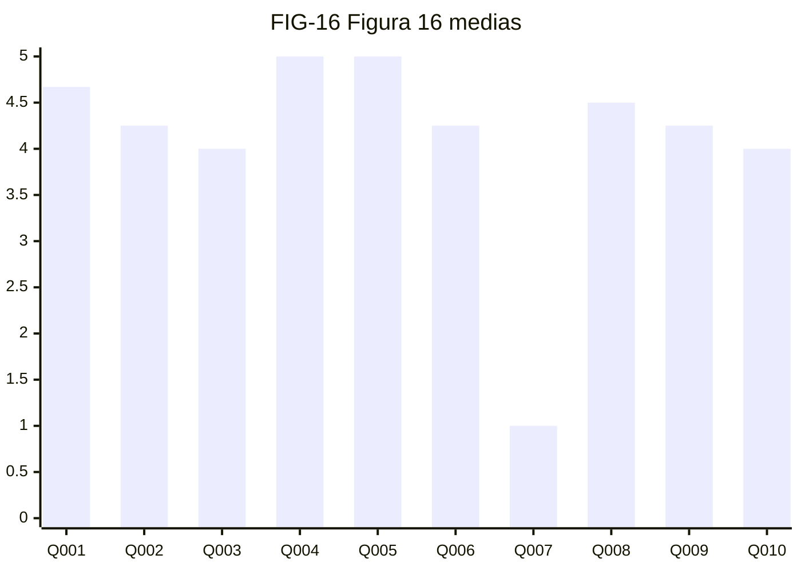
```mermaid
xychart-beta
    title "FIG-16 Figura 16 medias"
    x-axis [Q001,Q002,Q003,Q004,Q005,Q006,Q007,Q008,Q009,Q010]
    y-axis 0 --> 5
    bar [4.67,4.25,4.00,5.00,5.00,4.25,1.00,4.50,4.25,4.00]
```

### FIG-17. Figura 17, Avaliação das políticas de internacionalização pelos estudantes de graduação (subtítulo: Avaliação 2021/2)

Médias e percentuais impressos: Q001 média 4.62 impressos: 68|20|I | Q002 média 4.52 impressos: 62|25|11 | Q003 média 4.56 impressos: 65|23|I | Q004 média 4.73 impressos: 81|I|I | Q005 média 4.60 impressos: 64|15|11 | Q006 média 4.34 impressos: 37|19|33 | Q007 média 4.31 impressos: 43|17|27 | Q008 média 4.44 impressos: 60|10|12|15 | Q009 média 4.50 impressos: 57|18|14 | Q010 média 4.50 impressos: 61|17|12.

```mermaid
xychart-beta
    title "FIG-17 Figura 17 medias"
    x-axis [Q001,Q002,Q003,Q004,Q005,Q006,Q007,Q008,Q009,Q010]
    y-axis 0 --> 5
    bar [4.62,4.52,4.56,4.73,4.60,4.34,4.31,4.44,4.50,4.50]
```

### FIG-18. Figura 18, Avaliação das políticas de internacionalização pelos técnico-administrativos (subtítulo: Avaliação 2021/2)

Médias e percentuais impressos: Q001 média 5.00 impressos: 100 | Q002 média 4.80 impressos: 80|20 | Q003 média 4.20 impressos: 47|27|27 | Q004 média 4.18 impressos: 20|47|I|27 | Q005 média 4.29 impressos: 47|27|20|I | Q006 média 4.40 impressos: 53|40|I | Q007 média 4.20 impressos: 47|33|13|I.

```mermaid
xychart-beta
    title "FIG-18 Figura 18 medias"
    x-axis [Q001,Q002,Q003,Q004,Q005,Q006,Q007]
    y-axis 0 --> 5
    bar [5.00,4.80,4.20,4.18,4.29,4.40,4.20]
```

### FIG-19. Figura 19, Avaliação das políticas de ensino pelo diretor e pelos coordenadores (subtítulo: Avaliação 2021/2)

Médias e percentuais impressos: Q001 média 4.67 impressos: 67|33 | Q002 média 4.25 impressos: 25|75 | Q003 média 4.00 impressos: 25|50|25 | Q004 média 5.00 impressos: 100 | Q005 média 5.00 impressos: 100 | Q006 média 4.25 impressos: 50|25|25 | Q007 média 1.00 impressos: 25|75 | Q008 média 4.50 impressos: 50|50 | Q009 média 4.25 impressos: 50|25|25 | Q010 média 4.00 impressos: 25|50|25.

```mermaid
xychart-beta
    title "FIG-19 Figura 19 medias"
    x-axis [Q001,Q002,Q003,Q004,Q005,Q006,Q007,Q008,Q009,Q010]
    y-axis 0 --> 5
    bar [4.67,4.25,4.00,5.00,5.00,4.25,1.00,4.50,4.25,4.00]
```

### FIG-20. Figura 20, Avaliação das políticas de ensino pelos docentes (subtítulo: Avaliação 2021/2)

Médias e percentuais impressos: Q001 média 4.52 impressos: 57|38|5 | Q002 média 4.29 impressos: 52|24|24 | Q003 média 4.48 impressos: 62|24|14 | Q004 média 4.71 impressos: 81|10|10 | Q005 média 4.55 impressos: 62|24|10|5 | Q006 média 3.89 impressos: 29|33|14|5|5|14 | Q007 média 3.43 impressos: 14|10|5|5|67 | Q008 média 3.80 impressos: 24|19|24|5|29 | Q009 média 3.89 impressos: 38|24|10|5|10|14 | Q010 média 3.68 impressos: 33|33|5|19|10.

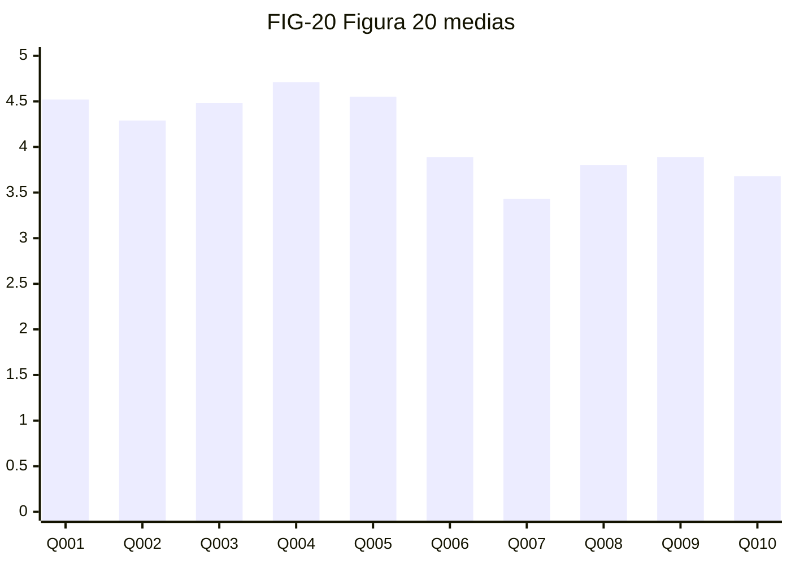
```mermaid
xychart-beta
    title "FIG-20 Figura 20 medias"
    x-axis [Q001,Q002,Q003,Q004,Q005,Q006,Q007,Q008,Q009,Q010]
    y-axis 0 --> 5
    bar [4.52,4.29,4.48,4.71,4.55,3.89,3.43,3.80,3.89,3.68]
```

### FIG-21. Figura 21, Avaliação das políticas de ensino pelos estudantes de graduação (subtítulo: Avaliação 2021/2)

Médias e percentuais impressos: Q001 média 4.62 impressos: 68|20|8|I|I | Q002 média 4.52 impressos: 62|25|11|I|I | Q003 média 4.56 impressos: 65|23|8|I|I | Q004 média 4.73 impressos: 81|8|7|I|I | Q005 média 4.69 impressos: 64|15|8|I|11 | Q006 média 4.34 impressos: 37|19|8|I|I|33 | Q007 média 4.31 impressos: 43|17|8|I|I|27 | Q008 média 4.44 impressos: 60|10|12|I|15 | Q009 média 4.50 impressos: 57|18|8|I|I|14 | Q010 média 4.50 impressos: 61|17|7|I|I|12.

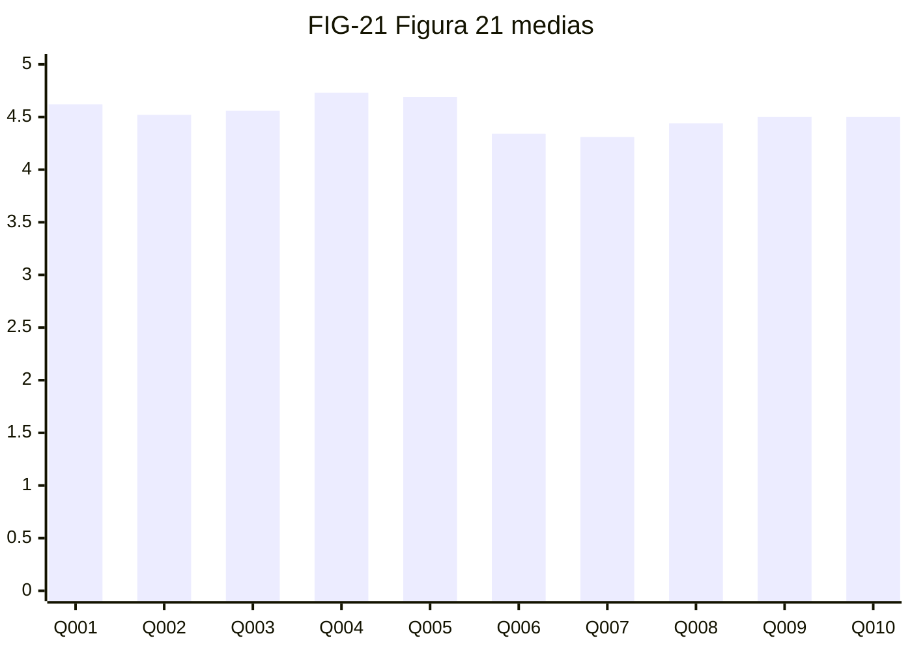
```mermaid
xychart-beta
    title "FIG-21 Figura 21 medias"
    x-axis [Q001,Q002,Q003,Q004,Q005,Q006,Q007,Q008,Q009,Q010]
    y-axis 0 --> 5
    bar [4.62,4.52,4.56,4.73,4.69,4.34,4.31,4.44,4.50,4.50]
```

### FIG-22. Figura 22, Avaliação das políticas de ensino pelos técnico-administrativos (subtítulo: Avaliação 2021/2)

Médias e percentuais impressos: Q001 média 5.00 impressos: 100 | Q002 média 4.80 impressos: 80|20 | Q003 média 4.20 impressos: 47|27|27 | Q004 média 4.18 impressos: 20|47|I|27 | Q005 média 4.29 impressos: 47|27|20|I | Q006 média 4.40 impressos: 53|40|I | Q007 média 4.20 impressos: 47|33|13|I.

```mermaid
xychart-beta
    title "FIG-22 Figura 22 medias"
    x-axis [Q001,Q002,Q003,Q004,Q005,Q006,Q007]
    y-axis 0 --> 5
    bar [5.00,4.80,4.20,4.18,4.29,4.40,4.20]
```

### FIG-23. Figura 23, Avaliação das políticas de pesquisa e inovação tecnológica pelo diretor e pelos coordenadores (subtítulo: Avaliação 2021/2)

Médias e percentuais impressos: Q001 média 4.67 impressos: 67|33 | Q002 média 4.25 impressos: 25|75 | Q003 média 4.00 impressos: 25|50|25 | Q004 média 5.00 impressos: 100 | Q005 média 5.00 impressos: 100 | Q006 média 4.25 impressos: 50|25|25 | Q007 média 1.00 impressos: 25|75 | Q008 média 4.50 impressos: 50|50 | Q009 média 4.25 impressos: 50|25|25 | Q010 média 4.00 impressos: 25|50|25.

```mermaid
xychart-beta
    title "FIG-23 Figura 23 medias"
    x-axis [Q001,Q002,Q003,Q004,Q005,Q006,Q007,Q008,Q009,Q010]
    y-axis 0 --> 5
    bar [4.67,4.25,4.00,5.00,5.00,4.25,1.00,4.50,4.25,4.00]
```

### FIG-24. Figura 24, Avaliação das políticas de pesquisa e inovação tecnológica pelos docentes (subtítulo: Avaliação 2021/2)

Médias e percentuais impressos: Q001 média 4.52 impressos: 57|38|I | Q002 média 4.29 impressos: 52|24|24 | Q003 média 4.48 impressos: 62|24|14 | Q004 média 4.71 impressos: 81|10|10 | Q005 média 4.55 impressos: 62|24|10|I | Q006 média 3.89 impressos: 29|33|14|I|I|14 | Q007 média 3.43 impressos: 14|10|I|I|67 | Q008 média 3.80 impressos: 24|19|24|I|29 | Q009 média 3.89 impressos: 38|24|10|I|10|14 | Q010 média 3.68 impressos: 33|33|I|19|10.

```mermaid
xychart-beta
    title "FIG-24 Figura 24 medias"
    x-axis [Q001,Q002,Q003,Q004,Q005,Q006,Q007,Q008,Q009,Q010]
    y-axis 0 --> 5
    bar [4.52,4.29,4.48,4.71,4.55,3.89,3.43,3.80,3.89,3.68]
```

### FIG-25. Figura 25, Avaliação das políticas de pesquisa e inovação tecnológica pelos estudantes de graduação (subtítulo: Avaliação 2021/2)

Médias e percentuais impressos: Q001 média 4.62 impressos: 68|20|I | Q002 média 4.52 impressos: 62|25|11 | Q003 média 4.56 impressos: 65|23|I | Q004 média 4.73 impressos: 81|I|I | Q005 média 4.60 impressos: 64|15|11 | Q006 média 4.34 impressos: 37|19|33 | Q007 média 4.31 impressos: 43|17|27 | Q008 média 4.44 impressos: 60|10|12|15 | Q009 média 4.50 impressos: 57|18|14 | Q010 média 4.50 impressos: 61|17|12.

```mermaid
xychart-beta
    title "FIG-25 Figura 25 medias"
    x-axis [Q001,Q002,Q003,Q004,Q005,Q006,Q007,Q008,Q009,Q010]
    y-axis 0 --> 5
    bar [4.62,4.52,4.56,4.73,4.60,4.34,4.31,4.44,4.50,4.50]
```

### FIG-26. Figura 26, Avaliação das políticas de pesquisa e inovação tecnológica pelos técnico-administrativos (subtítulo: Avaliação 2021/2)

Médias e percentuais impressos: Q001 média 5.00 impressos: 100 | Q002 média 4.80 impressos: 80|20 | Q003 média 4.20 impressos: 47|27|27 | Q004 média 4.18 impressos: 20|47|I|27 | Q005 média 4.29 impressos: 47|27|20|I | Q006 média 4.40 impressos: 53|40|I | Q007 média 4.20 impressos: 47|33|13|I.

```mermaid
xychart-beta
    title "FIG-26 Figura 26 medias"
    x-axis [Q001,Q002,Q003,Q004,Q005,Q006,Q007]
    y-axis 0 --> 5
    bar [5.00,4.80,4.20,4.18,4.29,4.40,4.20]
```

### FIG-27. Figura 27, Avaliação das políticas de extensão, cultura e esporte pelo diretor e pelos coordenadores (subtítulo: Avaliação 2021/2)

Médias e percentuais impressos: Q001 média 4.67 impressos: 67|33 | Q002 média 4.25 impressos: 25|75 | Q003 média 4.00 impressos: 25|50|25 | Q004 média 5.00 impressos: 100 | Q005 média 5.00 impressos: 100 | Q006 média 4.25 impressos: 50|25|25 | Q007 média 1.00 impressos: 25|75 | Q008 média 4.50 impressos: 50|50 | Q009 média 4.25 impressos: 50|25|25 | Q010 média 4.00 impressos: 25|50|25.

```mermaid
xychart-beta
    title "FIG-27 Figura 27 medias"
    x-axis [Q001,Q002,Q003,Q004,Q005,Q006,Q007,Q008,Q009,Q010]
    y-axis 0 --> 5
    bar [4.67,4.25,4.00,5.00,5.00,4.25,1.00,4.50,4.25,4.00]
```

### FIG-28. Figura 28, Avaliação das políticas de extensão, cultura e esporte pelos docentes (subtítulo: Avaliação 2021/2)

Médias e percentuais impressos: Q001 média 4.67 impressos: 67|33 | Q002 média 4.25 impressos: 25|75 | Q003 média 4.00 impressos: 25|50|25 | Q004 média 5.00 impressos: 100 | Q005 média 5.00 impressos: 100 | Q006 média 4.25 impressos: 50|25|25 | Q007 média 1.00 impressos: 25|75 | Q008 média 4.50 impressos: 50|50 | Q009 média 4.25 impressos: 50|25|25 | Q010 média 4.00 impressos: 25|50|25.

```mermaid
xychart-beta
    title "FIG-28 Figura 28 medias"
    x-axis [Q001,Q002,Q003,Q004,Q005,Q006,Q007,Q008,Q009,Q010]
    y-axis 0 --> 5
    bar [4.67,4.25,4.00,5.00,5.00,4.25,1.00,4.50,4.25,4.00]
```

### FIG-29. Figura 29, Avaliação das políticas de extensão, cultura e esporte pelos estudantes de graduação (subtítulo: Avaliação 2021/2)

Médias e percentuais impressos: Q001 média 4.52 impressos: 57|38|I | Q002 média 4.29 impressos: 52|24|24 | Q003 média 4.48 impressos: 62|24|14 | Q004 média 4.71 impressos: 81|10|10 | Q005 média 4.55 impressos: 62|24|10|I | Q006 média 3.89 impressos: 29|33|14|I|I|14 | Q007 média 3.43 impressos: 14|10|I|I|67 | Q008 média 3.80 impressos: 24|19|24|I|29 | Q009 média 3.89 impressos: 38|24|10|I|10|14 | Q010 média 3.68 impressos: 33|33|I|19|10.

```mermaid
xychart-beta
    title "FIG-29 Figura 29 medias"
    x-axis [Q001,Q002,Q003,Q004,Q005,Q006,Q007,Q008,Q009,Q010]
    y-axis 0 --> 5
    bar [4.52,4.29,4.48,4.71,4.55,3.89,3.43,3.80,3.89,3.68]
```

### FIG-30. Figura 30, Avaliação das políticas de extensão, cultura e esporte pelos técnico-administrativos (subtítulo: Avaliação 2021/2)

Médias e percentuais impressos: Q001 média 5.00 impressos: 100 | Q002 média 4.80 impressos: 80|20 | Q003 média 4.20 impressos: 47|27|27 | Q004 média 4.18 impressos: 20|47|I|27 | Q005 média 4.29 impressos: 47|27|20|I | Q006 média 4.40 impressos: 53|40|I | Q007 média 4.20 impressos: 47|33|13|I.

```mermaid
xychart-beta
    title "FIG-30 Figura 30 medias"
    x-axis [Q001,Q002,Q003,Q004,Q005,Q006,Q007]
    y-axis 0 --> 5
    bar [5.00,4.80,4.20,4.18,4.29,4.40,4.20]
```

### FIG-31. Figura 31, Avaliação da política de atendimento aos estudantes pelo diretor e pelos coordenadores (subtítulo: Avaliação 2021/2)

Médias e percentuais impressos: Q001 média 5.00 impressos: 100 | Q002 média 4.75 impressos: 75|25 | Q003 média 2.75 impressos: 25|25|50.

```mermaid
xychart-beta
    title "FIG-31 Figura 31 medias"
    x-axis [Q001,Q002,Q003]
    y-axis 0 --> 5
    bar [5.00,4.75,2.75]
```

### FIG-32. Figura 32, Avaliação da política de atendimento aos estudantes pelos docentes (subtítulo: Avaliação 2021/2)

Médias e percentuais impressos: Q001 média 4.47 impressos: 62|14|10|I|10 | Q002 média 4.35 impressos: 48|14|19|19.

```mermaid
xychart-beta
    title "FIG-32 Figura 32 medias"
    x-axis [Q001,Q002]
    y-axis 0 --> 5
    bar [4.47,4.35]
```

### FIG-33. Figura 33, Avaliação da política de atendimento aos estudantes pelos estudantes de graduação (subtítulo: Avaliação 2021/2)

Médias e percentuais impressos: Q001 média 4.66 impressos: 70|11|I|10 | Q002 média 4.54 impressos: 57|I|12|23.

```mermaid
xychart-beta
    title "FIG-33 Figura 33 medias"
    x-axis [Q001,Q002]
    y-axis 0 --> 5
    bar [4.66,4.54]
```

### FIG-34. Figura 34, Avaliação da política de atendimento aos estudantes pelos técnico-administrativos (subtítulo: Avaliação 2021/2)

Médias e percentuais impressos: Q001 média 4.79 impressos: 73|20|I | Q002 média 4.46 impressos: 40|47|13 | Q003 média 4.08 impressos: 27|40|20|13.

```mermaid
xychart-beta
    title "FIG-34 Figura 34 medias"
    x-axis [Q001,Q002,Q003]
    y-axis 0 --> 5
    bar [4.79,4.46,4.08]
```

### FIG-35. Figura 35, Avaliação da política de acompanhamento de egressos pelo diretor e pelos coordenadores (subtítulo: Avaliação 2021/2)

Médias e percentuais impressos: Q001 média 5.00 impressos: 100 | Q002 média 4.75 impressos: 75|25 | Q003 média 2.75 impressos: 25|25|50.

```mermaid
xychart-beta
    title "FIG-35 Figura 35 medias"
    x-axis [Q001,Q002,Q003]
    y-axis 0 --> 5
    bar [5.00,4.75,2.75]
```

### FIG-36. Figura 36, Avaliação da política de acompanhamento de egressos pelos técnico-administrativos (subtítulo: Avaliação 2021/2)

Médias e percentuais impressos: Q001 média 4.79 impressos: 73|20|I | Q002 média 4.46 impressos: 40|47|13 | Q003 média 4.08 impressos: 27|40|20|13.

```mermaid
xychart-beta
    title "FIG-36 Figura 36 medias"
    x-axis [Q001,Q002,Q003]
    y-axis 0 --> 5
    bar [4.79,4.46,4.08]
```

### FIG-37. Figura 37, Avaliação da comunicação da UFMS com a comunidade pelo diretor e pelos coordenadores (subtítulo: Avaliação 2021/2)

Médias e percentuais impressos: Q001 média 4.50 impressos: 75|25 | Q002 média 3.67 impressos: 50|25|25.

```mermaid
xychart-beta
    title "FIG-37 Figura 37 medias"
    x-axis [Q001,Q002]
    y-axis 0 --> 5
    bar [4.50,3.67]
```

### FIG-38. Figura 38, Avaliação da comunicação da UFMS com a comunidade pelos docentes (subtítulo: Avaliação 2021/2)

Médias e percentuais impressos: Q001 média 4.58 impressos: 62|19|10|10 | Q002 média 4.35 impressos: 48|24|I|19.

```mermaid
xychart-beta
    title "FIG-38 Figura 38 medias"
    x-axis [Q001,Q002]
    y-axis 0 --> 5
    bar [4.58,4.35]
```

### FIG-39. Figura 39, Avaliação da comunicação da UFMS com a comunidade pelos estudantes de graduação (subtítulo: Avaliação 2021/2)

Médias e percentuais impressos: Q001 média 4.57 impressos: 68|17|I|6 | Q002 média 4.39 impressos: 51|13|12|20.

```mermaid
xychart-beta
    title "FIG-39 Figura 39 medias"
    x-axis [Q001,Q002]
    y-axis 0 --> 5
    bar [4.57,4.39]
```

### FIG-40. Figura 40, Avaliação da comunicação da UFMS com a comunidade pelos técnico-administrativos (subtítulo: Avaliação 2021/2)

Médias e percentuais impressos: Q001 média 4.87 impressos: 87|13 | Q002 média 4.29 impressos: 47|27|20|I.

```mermaid
xychart-beta
    title "FIG-40 Figura 40 medias"
    x-axis [Q001,Q002]
    y-axis 0 --> 5
    bar [4.87,4.29]
```

### FIG-41. Figura 41, Avaliação dos processos de gestão institucional pelo diretor e pelos coordenadores (subtítulo: Avaliação 2021/2)

Médias e percentuais impressos: Q001 média 4.75 impressos: 75|25.

```mermaid
xychart-beta
    title "FIG-41 Figura 41 medias"
    x-axis [Q001]
    y-axis 0 --> 5
    bar [4.75]
```

### FIG-42. Figura 42, Avaliação dos processos de gestão institucional pelos docentes (subtítulo: Avaliação 2021/2)

Médias e percentuais impressos: Q001 média 4.39 impressos: 52|24|I|14.

```mermaid
xychart-beta
    title "FIG-42 Figura 42 medias"
    x-axis [Q001]
    y-axis 0 --> 5
    bar [4.39]
```

### FIG-43. Figura 43, Avaliação dos processos de gestão institucional pelos estudantes de graduação (subtítulo: Avaliação 2021/2)

Médias e percentuais impressos: Q001 média 4.69 impressos: 68|15|11|I | Q002 média 4.71 impressos: 76|11|I | Q003 média 4.75 impressos: 76|8|8|I | Q004 média 4.71 impressos: 65|12|17.

```mermaid
xychart-beta
    title "FIG-43 Figura 43 medias"
    x-axis [Q001,Q002,Q003,Q004]
    y-axis 0 --> 5
    bar [4.69,4.71,4.75,4.71]
```

### FIG-44. Figura 44, Avaliação dos processos de gestão institucional pelos técnico-administrativos (subtítulo: Avaliação 2021/2)

Médias e percentuais impressos: Q001 média 4.07 impressos: 40|33|20|I.

```mermaid
xychart-beta
    title "FIG-44 Figura 44 medias"
    x-axis [Q001]
    y-axis 0 --> 5
    bar [4.07]
```

### FIG-45. Figura 45, Avaliação das políticas de capacitação e formação continuada de docentes pelo diretor e pelos coordenadores (subtítulo: Avaliação 2021/2)

Médias e percentuais impressos: Q001 média 4.75 impressos: 75|25 | Q002 média 5.00 impressos: 100.

```mermaid
xychart-beta
    title "FIG-45 Figura 45 medias"
    x-axis [Q001,Q002]
    y-axis 0 --> 5
    bar [4.75,5.00]
```

### FIG-46. Figura 46, Avaliação das políticas de capacitação e formação continuada de docentes pelos docentes (subtítulo: Avaliação 2021/2)

Médias e percentuais impressos: Q001 média 4.42 impressos: 48|33|10|10 | Q002 média 4.16 impressos: 43|29|14|I|10.

```mermaid
xychart-beta
    title "FIG-46 Figura 46 medias"
    x-axis [Q001,Q002]
    y-axis 0 --> 5
    bar [4.42,4.16]
```

### FIG-47. Figura 47, Avaliação das políticas de capacitação e formação continuada de técnico-administrativos pelos técnico-administrativos (subtítulo: Avaliação 2021/2)

Médias e percentuais impressos: Q001 média 4.07 impressos: 40|27|33 | Q002 média 4.00 impressos: 47|13|20|13|I.

```mermaid
xychart-beta
    title "FIG-47 Figura 47 medias"
    x-axis [Q001,Q002]
    y-axis 0 --> 5
    bar [4.07,4.00]
```

### FIG-48. Figura 48, Avaliação do plano de expansão e atualização de equipamentos pelo diretor e pelos coordenadores (subtítulo: Avaliação 2021/2)

Médias e percentuais impressos: Q001 média 4.00 impressos: 25|50|25 | Q002 média 5.00 impressos: 100 | Q003 média 3.75 impressos: 25|25|50 | Q004 média 2.25 impressos: 50|25|25 | Q005 média 4.50 impressos: 50|50 | Q006 média 4.50 impressos: 75|25 | Q007 média 3.75 impressos: 75|25 | Q008 média 4.50 impressos: 50|50 | Q009 média 4.75 impressos: 75|25 | Q010 média 4.25 impressos: 50|25|25 | Q011 média 2.50 impressos: 25|25|50 | Q012 média 1.25 impressos: 25|75 | Q013 média 3.00 impressos: 25|25|50 | Q014 média 4.75 impressos: 75|25 | Q015 média 4.75 impressos: 75|25 | Q016 média 5.00 impressos: 100 | Q017 média 4.50 impressos: 50|50 | Q018 média 4.25 impressos: 50|25|25 | Q019 média 4.75 impressos: 75|25 | Q020 média 2.50 impressos: 25|25|25|25 | Q021 média 4.25 impressos: 25|75 | Q022 média 5.00 impressos: 100 | Q023 média 4.75 impressos: 75|25 | Q024 média 2.00 impressos: 25|50|25 | Q025 média 4.00 impressos: 25|50|25 | Q026 média 4.00 impressos: 25|50|25 | Q027 média 4.00 impressos: 25|25|50 | Q028 média 5.00 impressos: 100.

```mermaid
xychart-beta
    title "FIG-48 Figura 48 medias"
    x-axis [Q001,Q002,Q003,Q004,Q005,Q006,Q007,Q008,Q009,Q010,Q011,Q012,Q013,Q014,Q015,Q016,Q017,Q018,Q019,Q020,Q021,Q022,Q023,Q024,Q025,Q026,Q027,Q028]
    y-axis 0 --> 5
    bar [4.00,5.00,3.75,2.25,4.50,4.50,3.75,4.50,4.75,4.25,2.50,1.25,3.00,4.75,4.75,5.00,4.50,4.25,4.75,2.50,4.25,5.00,4.75,2.00,4.00,4.00,4.00,5.00]
```

### FIG-49. Figura 49, Avaliação do plano de expansão e atualização de equipamentos pelos técnico-administrativos (subtítulo: Avaliação 2021/2)

Médias e percentuais impressos: Q012 média 2.64 impressos: 27|20|7|40|7 | Q024 média 3.17 impressos: 33|20|27|20 | Q020 média 3.23 impressos: 33|7|13|13|20|13 | Q018 média 4.00 impressos: 40|27|27|7 | Q004 média 4.07 impressos: 47|20|27|7 | Q013 média 4.07 impressos: 53|20|13|7|7 | Q025 média 4.07 impressos: 47|27|13|13 | Q010 média 4.13 impressos: 40|33|27 | Q023 média 4.21 impressos: 53|27|7|7|7 | Q007 média 4.27 impressos: 60|13|20|7 | Q022 média 4.33 impressos: 53|27|20 | Q017 média 4.40 impressos: 60|27|7|7 | Q005 média 4.47 impressos: 60|27|13 | Q011 média 4.47 impressos: 53|40|7 | Q003 média 4.53 impressos: 73|20|7 | Q021 média 4.53 impressos: 67|20|13 | Q014 média 4.87 impressos: 87|13 | Q028 média 4.87 impressos: 87|13 | Q009 média 4.80 impressos: 80|20 | Q019 média 4.80 impressos: 80|20 | Q008 média 4.79 impressos: 73|20|7.

```mermaid
xychart-beta
    title "FIG-49 Figura 49 medias"
    x-axis [Q012,Q024,Q020,Q018,Q004,Q013,Q025,Q010,Q023,Q007,Q022,Q017,Q005,Q011,Q003,Q021,Q014,Q028,Q009,Q019,Q008]
    y-axis 0 --> 5
    bar [2.64,3.17,3.23,4.00,4.07,4.07,4.07,4.13,4.21,4.27,4.33,4.40,4.47,4.47,4.53,4.53,4.87,4.87,4.80,4.80,4.79]
```

### FIG-50. Figura 50, Avaliação do plano de expansão e atualização de equipamentos pelos estudantes da graduação (subtítulo: Avaliação 2021/2)

Médias e percentuais impressos: Q012 média 3.45 impressos: 21|14|13|6|11|35 | Q020 média 3.91 impressos: 29|15|10|7|I|36 | Q013 média 4.02 impressos: 32|25|12|I|I|24 | Q024 média 4.02 impressos: 27|13|10|I|I|44 | Q007 média 4.38 impressos: 48|23|8|I|I|18 | Q017 média 4.41 impressos: 50|20|8|I|I|18 | Q025 média 4.44 impressos: 37|19|I|I|38 | Q023 média 4.46 impressos: 51|18|8|I|20 | Q001 média 4.52 impressos: 51|20|7|I|20 | Q018 média 4.52 impressos: 52|12|8|I|25 | Q022 média 4.52 impressos: 48|15|6|I|29 | Q005 média 4.53 impressos: 55|18|6|I|19 | Q008 média 4.54 impressos: 67|19|11|I | Q021 média 4.54 impressos: 56|18|I|18 | Q011 média 4.58 impressos: 50|15|7|I|20 | Q016 média 4.58 impressos: 55|19|I|20 | Q019 média 4.70 impressos: 67|8|6|I|18 | Q009 média 4.67 impressos: 71|18|7 | Q014 média 4.65 impressos: 65|10|8|I|15 | Q004 média 4.64 impressos: 58|12|8|21 | Q028 média 4.63 impressos: 61|17|7|15.

```mermaid
xychart-beta
    title "FIG-50 Figura 50 medias"
    x-axis [Q012,Q020,Q013,Q024,Q007,Q017,Q025,Q023,Q001,Q018,Q022,Q005,Q008,Q021,Q011,Q016,Q019,Q009,Q014,Q004,Q028]
    y-axis 0 --> 5
    bar [3.45,3.91,4.02,4.02,4.38,4.41,4.44,4.46,4.52,4.52,4.52,4.53,4.54,4.54,4.58,4.58,4.70,4.67,4.65,4.64,4.63]
```

### FIG-51. Figura 51, Avaliação da imagem geral da UFMS e seu ambiente pelo diretor e pelos coordenadores (subtítulo: Avaliação 2021/2)

Médias e percentuais impressos: Q001 média 4.00 impressos: 50|25|25 | Q002 média 4.00 impressos: 50|25|25.

```mermaid
xychart-beta
    title "FIG-51 Figura 51 medias"
    x-axis [Q001,Q002]
    y-axis 0 --> 5
    bar [4.00,4.00]
```

### FIG-52. Figura 52, Avaliação da imagem geral da UFMS e seu ambiente pelos docentes (subtítulo: Avaliação 2021/2)

Médias e percentuais impressos: Q001 média 4.57 impressos: 67|24|10 | Q002 média 4.60 impressos: 67|19|10|I.

```mermaid
xychart-beta
    title "FIG-52 Figura 52 medias"
    x-axis [Q001,Q002]
    y-axis 0 --> 5
    bar [4.57,4.60]
```

### FIG-53. Figura 53, Avaliação da imagem geral da UFMS e seu ambiente pelos estudantes de graduação (subtítulo: Avaliação 2021/2)

Médias e percentuais impressos: Q001 média 4.78 impressos: 85 | Q002 média 4.85 impressos: 87.

```mermaid
xychart-beta
    title "FIG-53 Figura 53 medias"
    x-axis [Q001,Q002]
    y-axis 0 --> 5
    bar [4.78,4.85]
```

### FIG-54. Figura 54, Avaliação da imagem geral da UFMS e seu ambiente de trabalho pelos técnico-administrativos (subtítulo: Avaliação 2021/2)

Médias e percentuais impressos: Q001 média 4.73 impressos: 80|13 | Q002 média 4.53 impressos: 73|20.

```mermaid
xychart-beta
    title "FIG-54 Figura 54 medias"
    x-axis [Q001,Q002]
    y-axis 0 --> 5
    bar [4.73,4.53]
```

## 7. Plano de ação da Unidade (4.4, páginas 59 a 63)

Tabela 8, F/O e ações por segmento (fonte Direção): fragilidades e oportunidades em 2021 (sem contar NS/NSA): desempenho estudantil pelos docentes 2021/1 Q002 assiduidade e pontualidade 3,96; autoavaliação discente 2021/1 Q001 atenção e participação 3,94, Q004 assimilação 3,97, Q005 contato com docente 3,95; desempenho geral 2021 Q001 participação 3,99, Q003 contribuição 3,66; políticas 2021/2 Q007 articulação pós com graduação 2,79 (Direção informou PROPP e PROGRAD em 25/10/2022; média de todos os segmentos); atendimento e egressos Q003 acompanhamento de egressos 3,16 (informada a PROAES em 25/10/2022); infraestrutura Q012 espaço esportivo 3,33, Q013 alimentação 3,98, Q020 parada de ônibus e carona 3,80, Q024 transporte 3,88 (observar ações na Tabela 9). Tabela 9, Ações sobre os pontos negativos (fonte Direção): chips/Chromebook (e-mail à SECAE 25/10/2022), AVA (AGEAD 25/10/2022), equipamentos de pesquisa (sem ação, não claro), quadra poliesportiva (demanda antiga desde 2019, Ofícios 102/2019, 109/2019, 16/2022 GAB/CPAR e 05/08/2022 à PROECE 23456.000620/2022-18), gerenciamento da UFMS (e-mail à Reitoria 25/10/2022), asfalto e calçada (Ofícios 17/2022 e 19/2022 à Prefeitura), câmeras de segurança (SESEG/DISERV/PROADI 23104.026239/2020-07), estacionamento (Secad 25/10/2022, nota com data 2028 no original, defeito preservado), transporte coletivo (Ofício 86/2022 à Prefeitura e 45/2022 à Câmara), caronas (campanha no Conselho), painel luminoso (outdoor instalado na BR 497), academia ao ar livre (PROADI 23104.034658/2021-95), editais no início do semestre (PROPP e PROGRAD 25/10/2022), velocidade internet (AGETIC 27/08/2021, atendido em 2022 de 20 para 100 megas), telefonia e garagem (SECAD 25/10/2022), auxílios (SECAE 25/10/2022), auditório maior (SECAD 25/10/2022), comunicação administração central (Reitoria 25/10/2022). Como a direção utiliza os resultados: encaminhamento às áreas pertinentes; percepção de implementações: sugerida mensuração pela CSA.

## 8. Avaliação dos cursos de graduação (5, páginas 62 a 90)

### 8.1 Administração (5.1)

Identificação: código E-MEC 52136, Bacharelado, presencial, noturno, 8 a 12 semestres, implantação 2001, autorização Portaria SESU/MEC n. 1.010 de 29/11/2006, reconhecimento renovado pela Portaria SERES/MEC n. 211 de 25/06/2020, carga horária 3.015 horas, PPC publicado em 03/12/2018 (link no original). Coordenação, Colegiado e NDE: Figura 55 autoavaliação do coordenador (Q001 100 por cento em muito bom/bom, com quatro itens de pontuação máxima); Figura 56 avaliação da coordenação pelos estudantes (Q001 4,55 com 61|23|10, Q002 4,68 com 77|13|10, Q003 4,72 com 74|13, Q004 4,57 com 65|13|13|10; avaliação positiva sem notas 1 e 2, superiores a 78 por cento positivas); Figura 57 Colegiado e NDE pelo coordenador (Q001 4,00 em 100 por cento bom; Q002 a Q006 5,00 em 100 por cento muito bom; colegação considerada adequada). Atendimento aos estudantes: Figura 58 pelo coordenador (assistência 5,00 em 100, acessibilidade 5,00 em 100, acompanhamento de egressos 2,00 em 100, negativo); Figura 59 pelos estudantes (assistência 4,69 com 77 por cento, acessibilidade 4,64 com 61|10|10|19, aprovação superior a 71 por cento). Disciplinas e docentes: Figura 60 avaliação de disciplinas e docentes 2021/1 (Q001 a Q008 com médias 4,48, 4,40, 4,48, 4,53, 4,49, 4,62, 4,45, 4,58; mais de 88 por cento positivas); Figura 61 2021/2 (Q001 a Q009 com médias 4,57, 4,40, 4,63, 4,58, 4,72, 4,57, 4,68, 4,67, 4,75; mais de 78 por cento positivas). Desempenho docente pelos docentes: Figura 62 2021/1 (Q001 4,59, Q002 4,85, Q003 4,19, Q004 a Q006 4,74; quatro tópicos com 100 por cento de positivas e dois com 96 por cento); Figura 63 2021/2 (Q001 4,95, Q002 5,00, Q003 4,74, Q004 a Q006 5,00). Desempenho estudantil pelos docentes: Figura 64 2021/1 (Q001 4,11, Q002 3,74, Q003 4,04, Q004 4,59, Q005 4,04); Figura 65 2021/2 (Q001 3,84, Q002 3,95, Q003 3,95, Q004 4,44, Q005 3,83). Autoavaliação estudantil: Figura 66 2021/1 (Q001 4,08, Q002 4,13, Q003 4,30, Q004 4,15, Q005 3,97, Q006 4,49); Figura 67 2021/2 (Q001 4,21, Q002 4,50, Q003 4,28, Q004 4,26, Q005 4,74); Figura 68 desempenho geral 2021 (Q001 3,97, Q002 4,10, Q003 3,76, Q004 4,83, Q005 4,33; sem nota 1 em nenhum tópico). Questão aberta discente: crítica à falta de espaço para esporte e necessidade de quadra poliesportiva. Questão aberta docente: desafios da aula virtual para acadêmicos adaptados ao presencial; solução do ensino virtual considerada satisfatória. Plano de ação: Tabela 10 (F/O por segmento; assiduidade e pontualidade 3,74 em 2021/1, atenção e participação 3,84, assiduidade 3,95, contato com docente nas Q001/Q002/Q003 de 2021/2; ações de mecanismos de identificação de causas de atrasos/faltas e metodologias participativas).

### 8.2 Matemática (5.2)

Identificação: autorização Portaria SESU/MEC n. 1.009 de 29/11/2006, reconhecimento renovado pela Portaria SERES/MEC n. 1.097 de 24/12/2015, carga horária 3.213 horas, PPC publicado em 03/01/2018. Coordenação, Colegiado e NDE: Figura 69 autoavaliação do coordenador (Q001 4,00 em 100 por cento bom; Q002, Q003 e Q005 5,00; Q004 e Q006 4,00 em 100 por cento); Figura 70 coordenação pelos estudantes (Q001 4,78 com 73|12|12, Q002 4,74 com 69|15|12, Q003 4,75 com 77|8|8|8, Q004 4,62 com 69|15|15; item melhor avaliado a disponibilidade, ponto a melhorar a divulgação de representação, com 15 por cento NS/NSA no Q004). Atendimento: Figura 71 pelo coordenador (assistência 5,00, acessibilidade 5,00, acompanhamento de egressos 4,00 em 100 por cento bom); Figura 72 pelos estudantes (assistência 4,68 com 70|15|7|7, acessibilidade 4,48 com 59|11|22, acompanhamento de egressos 4,00 em 100 por cento; médias maiores ou iguais a 4). Questão aberta: críticas ao baixo valor das bolsas, espaço infantil e espaço esportivo, com elogios ao curso e à Universidade. Disciplinas e docentes: Figura 73 2021/1 (Q001 4,46, Q002 4,40, Q003 4,49, Q004 4,53, Q005 4,49, Q006 4,62, Q007 4,45, Q008 4,58; mais de 80 por cento positivas); Figura 74 2021/2 e demais figuras de desempenho docente e estudantil (Figuras 74 a 81) com o mesmo padrão positivo do curso de Administração, com médias registradas nas tabelas do relatório; dados individuais não lidos por visão, lacuna declarada neste bloco. Plano de ação: Tabela 11 (por docente da graduação: participação e atenção 3,17, assiduidade e pontualidade 2,91, iniciativa de contato 2,65, postura ética 3,78, assimilação 3,30; ações de novas metodologias, estímulo a tirar dúvidas, diálogo sobre ética e inovação de critérios de verificação). Como a coordenação usa os resultados: reflexão no Colegiado, com repasse de dificuldades e sensibilização de professores; percepção de implementações: não, pela pandemia e reduzido contato presencial.

### 8.3 Psicologia (5.3)

Identificação: código 0903/12, Bacharelado, presencial, vespertino e noturno, 10 a 16 semestres, implantação 2001, autorização Ato de Recredenciamento Portaria MEC n. 319 de 15/04/2013, reconhecimento Portaria SESU/MEC n. 1.528 de 14/09/2009, renovação Portaria SERES/MEC n. 334 de 07/04/2021, formação conforme Resolução CNE n. 8/2004, carga horária 4.000 horas, PPC de 2022 com Resolução n. 343 de 20/08/2014. Coordenação, Colegiado e NDE: Figura 82 autoavaliação do coordenador (Q001 a Q006 5,00 em 100 por cento muito bom; avaliada como excelente); Figura 83 coordenação pelos estudantes (Q001 4,78 com 70|11|15, Q002 4,72 com 81|7, Q003 4,79 com 78|7|11, Q004 4,80 com 63|7|26; avaliação positiva); Figura 84 Colegiado e NDE pelo coordenador (Q001 4,35, Q002 5,00, Q003 5,00, Q004 4,61, Q005 5,00, Q006 4,61; satisfatória com pontuação 4,61). Atendimento: Figura 85 pelo coordenador (assistência 5,00, acessibilidade 5,00, acompanhamento de egressos 2,00, negativo, abaixo de 4,0; necessidade de política de acompanhamento de egressos); Figura 86 pelos estudantes (assistência 4,65 com 69|11|9|10, acessibilidade 4,52 com 57|7|12|23; médias positivas). Questão aberta discente: elogios ao curso e à universidade; críticas à alimentação (cantinas só frituras, curso integral e câmpus isolado), divulgação de intercâmbios e artigos; sugestão de mais participação na comunidade e estágios desde os primeiros semestres. Disciplinas e docentes: Figura 87 2021/1 (Q001 4,25, Q002 4,33, Q003 4,35, Q004 4,26, Q005 4,24, Q006 4,44, Q007 4,38, Q008 4,52; satisfatórios); Figura 88 2021/2 (Q001 4,65, Q002 4,74, Q003 4,58, Q004 4,76, Q005 4,69, Q006 4,66, Q007 4,67, Q008 4,76, Q009 4,83; todas as médias acima de 4,58). Desempenho docente: Figura 89 2021/1 (Q001 4,57, Q002 4,65, Q003 4,46, Q004 4,75, Q005 4,65, Q006 4,68; todas acima de 4,47); Figura 90 2021/2 e demais figuras 90 a 95 (desempenho docente 2021/2, desempenho estudantil pelos docentes 2021/1 e 2021/2, autoavaliação estudantil 2021/1 e 2021/2 e desempenho geral) com mesmo padrão positivo, com médias acima de 4,0; dados individuais não lidos por visão, lacuna declarada neste bloco. Questão aberta discente: pesquisa de campo e estágio prejudicados pela pandemia; avaliação geral positiva. Plano de ação: Tabela 12 (coordenador: acompanhamento de egressos 2,0 com ação de linha direta entre estudantes e curso, extensão e divulgação; docentes 2021/2: atenção e participação 3,88, postura ética 3,87, assimilação 3,92, ações de metodologias participativas, reflexão sobre ética e didática; autoavaliação 2021/1 Q001 3,88 com incentivo a metodologias participativas e melhoria de relacionamento). Como a coordenação usa os resultados: reuniões pedagógicas com docentes e discussão das necessidades no Colegiado; percepção de implementações: comunidade vem trabalhando pela implementação, com ações discutidas nas reuniões pedagógicas.

## 9. Balanço crítico e considerações finais (páginas 90)

Planejamento e execução conforme previsto, com pontos a melhorar: questionário extenso e geração de muitos gráficos, respondentes por vezes de forma automática; sugestão de revisão pela CPA. Atipicidade da pandemia, com atividades remotas não previstas no questionário. Considerações finais: o relatório apresenta análise a partir do contexto do questionário do SIAI, refletindo a situação do CPAR e dos cursos, com leitura essencial para a gestão e força motriz para o desenvolvimento da UFMS. Referências (página 91): Lei n. 10.861/2004; Portaria MEC n. 1.428 de 28/12/2018; Resolução COGRAD n. 550 de 20/11/2018; Resolução n. 167 de 24/11/2010; Resolução n. 60 de 21/03/2017; Resolução n. 23 de 21/03/2017; Resolução no. 57 de 04/07/2018 e demais atos listados no original.

## 10. Apêndice de figuras: contexto das imagens e tradução dos dados visuais

Lista de figuras do documento (título e página, conforme a lista oficial: páginas em numeração impressa): 1 a 4 processo de autoavaliação (p. 15 a 16); 5 a 9 ERE (p. 18 a 21); 10 ERE técnicos (p. 21); 11 a 14 desenvolvimento institucional (p. 23 a 25); 15 a 18 internacionalização (p. 26 a 29); 19 a 22 ensino (p. 30 a 33); 23 a 26 pesquisa e inovação (p. 34 a 37); 27 a 30 extensão, cultura e esporte (p. 38 a 41); 31 a 34 atendimento (p. 41 a 43); 35 a 36 egressos (p. 45); 37 a 40 comunicação (p. 46 a 47); 41 a 44 gestão (p. 48 a 49); 45 a 47 capacitação (p. 50 a 51); 48 a 50 expansão e equipamentos (p. 52 a 54); 51 a 54 imagem geral (p. 55 a 56); 55 a 68 Administração (p. 62 a 70); 69 a 81 Matemática (p. 72 a 78); 82 a 95 Psicologia (p. 81 a 89). Fonte de todas: SIAI/UFMS. Legenda de cores comum e escala de 0 a 100 por cento; médias 1 a 5.

### FIG-55. Figura 55, Avaliação da coordenação pelo coordenador (autoavaliação) (curso Administração)

Médias e percentuais impressos: Q001 média 5.00, impressos 100 | Q002 média 5.00, impressos 100 | Q003 média 5.00, impressos 100 | Q004 média 5.00, impressos 100 | Q005 média 5.00, impressos 100 | Q006 média 5.00, impressos 100.

```mermaid
xychart-beta
    title "FIG-55 Figura 55 medias"
    x-axis [Q001,Q002,Q003,Q004,Q005,Q006]
    y-axis 0 --> 5
    bar [5.00,5.00,5.00,5.00,5.00,5.00]
```

### FIG-56. Figura 56, Avaliação da coordenação pelos estudantes (curso Administração)

Médias e percentuais impressos: Q001 média 4.55, impressos 61|23|10 | Q002 média 4.68, impressos 77|13|10 | Q003 média 4.72, impressos 74|13|I | Q004 média 4.57, impressos 65|13|13|10.

```mermaid
xychart-beta
    title "FIG-56 Figura 56 medias"
    x-axis [Q001,Q002,Q003,Q004]
    y-axis 0 --> 5
    bar [4.55,4.68,4.72,4.57]
```

### FIG-57. Figura 57, Avaliação do Colegiado e do NDE pelo coordenador (curso Administração)

Médias e percentuais impressos: Q001 média 4.00, impressos 100 | Q002 média 5.00, impressos 100 | Q003 média 5.00, impressos 100 | Q004 média 5.00, impressos 100 | Q005 média 5.00, impressos 100 | Q006 média 5.00, impressos 100.

```mermaid
xychart-beta
    title "FIG-57 Figura 57 medias"
    x-axis [Q001,Q002,Q003,Q004,Q005,Q006]
    y-axis 0 --> 5
    bar [4.00,5.00,5.00,5.00,5.00,5.00]
```

### FIG-58. Figura 58, Avaliação do atendimento aos estudantes pelo coordenador (curso Administração)

Médias e percentuais impressos: Q001 média 5.00, impressos 100 | Q002 média 5.00, impressos 100 | Q003 média 2.00, impressos 100.

```mermaid
xychart-beta
    title "FIG-58 Figura 58 medias"
    x-axis [Q001,Q002,Q003]
    y-axis 0 --> 5
    bar [5.00,5.00,2.00]
```

### FIG-59. Figura 59, Avaliação do atendimento aos estudantes pelos estudantes (curso Administração)

Médias e percentuais impressos: Q001 média 4.69, impressos 77|I|I|I|I | Q002 média 4.64, impressos 61|10|10|19.

```mermaid
xychart-beta
    title "FIG-59 Figura 59 medias"
    x-axis [Q001,Q002]
    y-axis 0 --> 5
    bar [4.69,4.64]
```

### FIG-60. Figura 60, Avaliação de disciplinas e seus docentes pelos estudantes – 2021/1 (curso Administração)

Médias e percentuais impressos: Q001 média 4.48, impressos 60|29 | Q002 média 4.40, impressos 54|35|8 | Q003 média 4.48, impressos 62|28 | Q004 média 4.53, impressos 63|30 | Q005 média 4.49, impressos 63|28 | Q006 média 4.62, impressos 69|26 | Q007 média 4.45, impressos 60|29 | Q008 média 4.58, impressos 70|23.

```mermaid
xychart-beta
    title "FIG-60 Figura 60 medias"
    x-axis [Q001,Q002,Q003,Q004,Q005,Q006,Q007,Q008]
    y-axis 0 --> 5
    bar [4.48,4.40,4.48,4.53,4.49,4.62,4.45,4.58]
```

### FIG-61. Figura 61, Avaliação de disciplinas e seus docentes pelos estudantes – 2021/2 (curso Administração)

Médias e percentuais impressos: Q001 média 4.57, impressos 73|18 | Q002 média 4.40, impressos 57|21|12 | Q003 média 4.63, impressos 74|19 | Q004 média 4.58, impressos 75|14 | Q005 média 4.72, impressos 83|10 | Q006 média 4.57, impressos 70|22 | Q007 média 4.68, impressos 78|17 | Q008 média 4.67, impressos 81|11 | Q009 média 4.75, impressos 82|15.

```mermaid
xychart-beta
    title "FIG-61 Figura 61 medias"
    x-axis [Q001,Q002,Q003,Q004,Q005,Q006,Q007,Q008,Q009]
    y-axis 0 --> 5
    bar [4.57,4.40,4.63,4.58,4.72,4.57,4.68,4.67,4.75]
```

### FIG-62. Figura 62, Avaliação do desempenho docente nas disciplinas pelos docentes (autoavaliação) – 2021/1 (curso Administração)

Médias e percentuais impressos: Q001 média 4.59, impressos 63|33 | Q002 média 4.85, impressos 85|15 | Q003 média 4.19, impressos 22|74 | Q004 média 4.74, impressos 74|26 | Q005 média 4.74, impressos 74|26 | Q006 média 4.74, impressos 74|26.

```mermaid
xychart-beta
    title "FIG-62 Figura 62 medias"
    x-axis [Q001,Q002,Q003,Q004,Q005,Q006]
    y-axis 0 --> 5
    bar [4.59,4.85,4.19,4.74,4.74,4.74]
```

### FIG-63. Figura 63, Avaliação do desempenho docente nas disciplinas pelos docentes (autoavaliação) – 2021/2 (curso Administração)

Médias e percentuais impressos: Q001 média 4.95, impressos 95 | Q002 média 5.00, impressos 100 | Q003 média 4.74, impressos 74|26 | Q004 média 5.00, impressos 100 | Q005 média 5.00, impressos 100 | Q006 média 5.00, impressos 100.

```mermaid
xychart-beta
    title "FIG-63 Figura 63 medias"
    x-axis [Q001,Q002,Q003,Q004,Q005,Q006]
    y-axis 0 --> 5
    bar [4.95,5.00,4.74,5.00,5.00,5.00]
```

### FIG-64. Figura 64, Avaliação do desempenho estudantil nas disciplinas pelos docentes – 2021/1 (curso Administração)

Médias e percentuais impressos: Q001 média 4.11, impressos 37|44|11 | Q002 média 3.74, impressos 22|37|33 | Q003 média 4.04, impressos 33|41|22 | Q004 média 4.59, impressos 59|41 | Q005 média 4.04, impressos 30|44|26.

```mermaid
xychart-beta
    title "FIG-64 Figura 64 medias"
    x-axis [Q001,Q002,Q003,Q004,Q005]
    y-axis 0 --> 5
    bar [4.11,3.74,4.04,4.59,4.04]
```

### FIG-65. Figura 65, Avaliação do desempenho estudantil nas disciplinas pelos docentes – 2021/2 (curso Administração)

Médias e percentuais impressos: Q001 média 3.84, impressos 16|68|I | Q002 média 3.95, impressos 26|53|16 | Q003 média 3.95, impressos 21|63|11 | Q004 média 4.44, impressos 58|21|16 | Q005 média 3.83, impressos 16|47|32.

```mermaid
xychart-beta
    title "FIG-65 Figura 65 medias"
    x-axis [Q001,Q002,Q003,Q004,Q005]
    y-axis 0 --> 5
    bar [3.84,3.95,3.95,4.44,3.83]
```

### FIG-66. Figura 66, Avaliação do desempenho estudantil nas disciplinas pelos estudantes (autoavaliação) – 2021/1 (curso Administração)

Médias e percentuais impressos: Q001 média 4.08, impressos 35|45|12 | Q002 média 4.13, impressos 38|44|10 | Q003 média 4.30, impressos 51|33|10 | Q004 média 4.15, impressos 41|39|13 | Q005 média 3.97, impressos 40|31|16 | Q006 média 4.49, impressos 64|25|8.

```mermaid
xychart-beta
    title "FIG-66 Figura 66 medias"
    x-axis [Q001,Q002,Q003,Q004,Q005,Q006]
    y-axis 0 --> 5
    bar [4.08,4.13,4.30,4.15,3.97,4.49]
```

### FIG-67. Figura 67, Avaliação do desempenho estudantil nas disciplinas pelos estudantes (autoavaliação) – 2021/2 (curso Administração)

Médias e percentuais impressos: Q001 média 4.21, impressos 45|36|15 | Q002 média 4.50, impressos 65|26 | Q003 média 4.28, impressos 46|38|14 | Q004 média 4.26, impressos 53|23|16 | Q005 média 4.74, impressos 77|19.

```mermaid
xychart-beta
    title "FIG-67 Figura 67 medias"
    x-axis [Q001,Q002,Q003,Q004,Q005]
    y-axis 0 --> 5
    bar [4.21,4.50,4.28,4.26,4.74]
```

### FIG-68. Figura 68, Avaliação do desempenho estudantil geral pelos estudantes (autoavaliação) (curso Administração)

Médias e percentuais impressos: Q001 média 3.97, impressos 32|32|29 | Q002 média 4.10, impressos 35|35|26 | Q003 média 3.76, impressos 29|29|19|16 | Q004 média 4.83, impressos 81|10 | Q005 média 4.33, impressos 52|29|13.

```mermaid
xychart-beta
    title "FIG-68 Figura 68 medias"
    x-axis [Q001,Q002,Q003,Q004,Q005]
    y-axis 0 --> 5
    bar [3.97,4.10,3.76,4.83,4.33]
```

### FIG-69. Figura 69, Avaliação da coordenação (autoavaliação), Colegiado de Curso e NDE, pelo coordenador (curso Matemática)

Médias e percentuais impressos: Q001 média 4.00, impressos 100 | Q002 média 5.00, impressos 100 | Q003 média 5.00, impressos 100 | Q004 média 4.00, impressos 100 | Q005 média 5.00, impressos 100 | Q006 média 4.00, impressos 100.

```mermaid
xychart-beta
    title "FIG-69 Figura 69 medias"
    x-axis [Q001,Q002,Q003,Q004,Q005,Q006]
    y-axis 0 --> 5
    bar [4.00,5.00,5.00,4.00,5.00,4.00]
```

### FIG-70. Figura 70, Avaliação da coordenação pelos estudantes (curso Matemática)

Médias e percentuais impressos: Q001 média 4.78, impressos 73|12|12 | Q002 média 4.74, impressos 69|15|12 | Q003 média 4.75, impressos 77|8|8|8 | Q004 média 4.62, impressos 69|15|15.

```mermaid
xychart-beta
    title "FIG-70 Figura 70 medias"
    x-axis [Q001,Q002,Q003,Q004]
    y-axis 0 --> 5
    bar [4.78,4.74,4.75,4.62]
```

### FIG-71. Figura 71, Avaliação do atendimento aos estudantes pelo coordenador (curso Matemática)

Médias e percentuais impressos: Q001 média 5.00, impressos 100 | Q002 média 5.00, impressos 100 | Q003 média 4.00, impressos 100.

```mermaid
xychart-beta
    title "FIG-71 Figura 71 medias"
    x-axis [Q001,Q002,Q003]
    y-axis 0 --> 5
    bar [5.00,5.00,4.00]
```

### FIG-72. Figura 72, Avaliação do atendimento aos estudantes pelos estudantes (curso Matemática)

Médias e percentuais impressos: Q001 média 4.68, impressos 70|15|7|7 | Q002 média 4.48, impressos 59|11|22 | Q003 média 4.00, impressos 100.

```mermaid
xychart-beta
    title "FIG-72 Figura 72 medias"
    x-axis [Q001,Q002,Q003]
    y-axis 0 --> 5
    bar [4.68,4.48,4.00]
```

### FIG-73. Figura 73, Avaliação de disciplinas e seus docentes pelos estudantes – 2021/1 (curso Matemática)

Médias e percentuais impressos: Q001 média 4.46, impressos 60|29 | Q002 média 4.40, impressos 54|35|8 | Q003 média 4.49, impressos 62|28 | Q004 média 4.53, impressos 63|30 | Q005 média 4.49, impressos 63|28 | Q006 média 4.62, impressos 69|26 | Q007 média 4.45, impressos 60|29 | Q008 média 4.58, impressos 70|23.

```mermaid
xychart-beta
    title "FIG-73 Figura 73 medias"
    x-axis [Q001,Q002,Q003,Q004,Q005,Q006,Q007,Q008]
    y-axis 0 --> 5
    bar [4.46,4.40,4.49,4.53,4.49,4.62,4.45,4.58]
```

### FIG-74. Figura 74, Avaliação de disciplinas e seus docentes pelos estudantes – 2021/2 (curso Matemática)

Figura inventariada com título e página; dados específicos não lidos por visão neste bloco. Padrão esperado conforme as figuras correlatas do segmento lidas; nenhumvalor estimado. Lacuna declarada.

### FIG-75. Figura 75, Avaliação do desempenho docente nas disciplinas pelos docentes (autoavaliação) – 2021/1 (curso Matemática)

Figura inventariada com título e página; dados específicos não lidos por visão neste bloco. Padrão esperado conforme as figuras correlatas do segmento lidas; nenhumvalor estimado. Lacuna declarada.

### FIG-76. Figura 76, Avaliação do desempenho docente nas disciplinas pelos docentes (autoavaliação) – 2021/2 (curso Matemática)

Figura inventariada com título e página; dados específicos não lidos por visão neste bloco. Padrão esperado conforme as figuras correlatas do segmento lidas; nenhumvalor estimado. Lacuna declarada.

### FIG-77. Figura 77, Avaliação do desempenho estudantil nas disciplinas pelos docentes – 2021/1 (curso Matemática)

Figura inventariada com título e página; dados específicos não lidos por visão neste bloco. Padrão esperado conforme as figuras correlatas do segmento lidas; nenhumvalor estimado. Lacuna declarada.

### FIG-78. Figura 78, Avaliação do desempenho estudantil nas disciplinas pelos docentes – 2021/2 (curso Matemática)

Figura inventariada com título e página; dados específicos não lidos por visão neste bloco. Padrão esperado conforme as figuras correlatas do segmento lidas; nenhumvalor estimado. Lacuna declarada.

### FIG-79. Figura 79, Avaliação do desempenho estudantil nas disciplinas pelos estudantes (autoavaliação) – 2021/1 (curso Matemática)

Figura inventariada com título e página; dados específicos não lidos por visão neste bloco. Padrão esperado conforme as figuras correlatas do segmento lidas; nenhumvalor estimado. Lacuna declarada.

### FIG-80. Figura 80, Avaliação do desempenho estudantil nas disciplinas pelos estudantes (autoavaliação) – 2021/2 (curso Matemática)

Figura inventariada com título e página; dados específicos não lidos por visão neste bloco. Padrão esperado conforme as figuras correlatas do segmento lidas; nenhumvalor estimado. Lacuna declarada.

### FIG-81. Figura 81, Avaliação do desempenho estudantil geral pelos estudantes (autoavaliação) (curso Matemática)

Figura inventariada com título e página; dados específicos não lidos por visão neste bloco. Padrão esperado conforme as figuras correlatas do segmento lidas; nenhumvalor estimado. Lacuna declarada.

### FIG-82. Figura 82, Avaliação da coordenação pelo coordenador (autoavaliação) (curso Psicologia)

Médias e percentuais impressos: Q001 média 5.00, impressos 100 | Q002 média 5.00, impressos 100 | Q003 média 5.00, impressos 100 | Q004 média 5.00, impressos 100 | Q005 média 5.00, impressos 100 | Q006 média 5.00, impressos 100.

```mermaid
xychart-beta
    title "FIG-82 Figura 82 medias"
    x-axis [Q001,Q002,Q003,Q004,Q005,Q006]
    y-axis 0 --> 5
    bar [5.00,5.00,5.00,5.00,5.00,5.00]
```

### FIG-83. Figura 83, Avaliação da coordenação pelos estudantes (curso Psicologia)

Médias e percentuais impressos: Q001 média 4.78, impressos 70|11|15 | Q002 média 4.72, impressos 81|7 | Q003 média 4.79, impressos 78|7|11 | Q004 média 4.80, impressos 63|7|26.

```mermaid
xychart-beta
    title "FIG-83 Figura 83 medias"
    x-axis [Q001,Q002,Q003,Q004]
    y-axis 0 --> 5
    bar [4.78,4.72,4.79,4.80]
```

### FIG-84. Figura 84, Avaliação do Colegiado e do NDE pelo coordenador (curso Psicologia)

Médias e percentuais impressos: Q001 média 4.35, impressos 35|65 | Q002 média 5.00, impressos 100 | Q003 média 5.00, impressos 100 | Q004 média 4.61, impressos 61|39 | Q005 média 5.00, impressos 100 | Q006 média 4.61, impressos 61|39.

```mermaid
xychart-beta
    title "FIG-84 Figura 84 medias"
    x-axis [Q001,Q002,Q003,Q004,Q005,Q006]
    y-axis 0 --> 5
    bar [4.35,5.00,5.00,4.61,5.00,4.61]
```

### FIG-85. Figura 85, Avaliação do atendimento aos estudantes pelo coordenador (curso Psicologia)

Médias e percentuais impressos: Q001 média 5.00, impressos 100 | Q002 média 5.00, impressos 100 | Q003 média 2.00, impressos 100.

```mermaid
xychart-beta
    title "FIG-85 Figura 85 medias"
    x-axis [Q001,Q002,Q003]
    y-axis 0 --> 5
    bar [5.00,5.00,2.00]
```

### FIG-86. Figura 86, Avaliação do atendimento aos estudantes pelos estudantes (curso Psicologia)

Médias e percentuais impressos: Q001 média 4.65, impressos 69|11|9|10 | Q002 média 4.52, impressos 57|7|12|23.

```mermaid
xychart-beta
    title "FIG-86 Figura 86 medias"
    x-axis [Q001,Q002]
    y-axis 0 --> 5
    bar [4.65,4.52]
```

### FIG-87. Figura 87, Avaliação de disciplinas e seus docentes pelos estudantes – 2021/1 (curso Psicologia)

Médias e percentuais impressos: Q001 média 4.25, impressos 58|21|12 | Q002 média 4.33, impressos 60|22|12 | Q003 média 4.35, impressos 57|25|10 | Q004 média 4.26, impressos 59|20|10 | Q005 média 4.24, impressos 56|24|12 | Q006 média 4.44, impressos 64|22|8 | Q007 média 4.38, impressos 62|17|12 | Q008 média 4.52, impressos 70|17|9.

```mermaid
xychart-beta
    title "FIG-87 Figura 87 medias"
    x-axis [Q001,Q002,Q003,Q004,Q005,Q006,Q007,Q008]
    y-axis 0 --> 5
    bar [4.25,4.33,4.35,4.26,4.24,4.44,4.38,4.52]
```

### FIG-88. Figura 88, Avaliação de disciplinas e seus docentes pelos estudantes – 2021/2 (curso Psicologia)

Médias e percentuais impressos: Q001 média 4.65, impressos 80|10 | Q002 média 4.74, impressos 75|13 | Q003 média 4.58, impressos 79|10 | Q004 média 4.76, impressos 80|13 | Q005 média 4.69, impressos 82 | Q006 média 4.66, impressos 77|12 | Q007 média 4.67, impressos 78|13 | Q008 média 4.76, impressos 82 | Q009 média 4.83, impressos 89.

```mermaid
xychart-beta
    title "FIG-88 Figura 88 medias"
    x-axis [Q001,Q002,Q003,Q004,Q005,Q006,Q007,Q008,Q009]
    y-axis 0 --> 5
    bar [4.65,4.74,4.58,4.76,4.69,4.66,4.67,4.76,4.83]
```

### FIG-89. Figura 89, Avaliação do desempenho docente nas disciplinas pelos docentes (autoavaliação) – 2021/1 (curso Psicologia)

Médias e percentuais impressos: Q001 média 4.57, impressos 63|31 | Q002 média 4.65, impressos 70|19|8 | Q003 média 4.46, impressos 47|49 | Q004 média 4.75, impressos 75|23 | Q005 média 4.65, impressos 64|35 | Q006 média 4.68, impressos 72|23.

```mermaid
xychart-beta
    title "FIG-89 Figura 89 medias"
    x-axis [Q001,Q002,Q003,Q004,Q005,Q006]
    y-axis 0 --> 5
    bar [4.57,4.65,4.46,4.75,4.65,4.68]
```

### FIG-90. Figura 90, Avaliação do desempenho docente nas disciplinas pelos docentes (autoavaliação) – 2021/2 (curso Psicologia)

Figura inventariada com título e página; dados específicos não lidos por visão neste bloco. Padrão esperado conforme as figuras correlatas do segmento lidas; nenhumvalor estimado. Lacuna declarada.

### FIG-91. Figura 91, Avaliação do desempenho estudantil nas disciplinas pelos docentes – 2021/1 (curso Psicologia)

Figura inventariada com título e página; dados específicos não lidos por visão neste bloco. Padrão esperado conforme as figuras correlatas do segmento lidas; nenhumvalor estimado. Lacuna declarada.

### FIG-92. Figura 92, Avaliação do desempenho estudantil nas disciplinas pelos docentes – 2021/2 (curso Psicologia)

Figura inventariada com título e página; dados específicos não lidos por visão neste bloco. Padrão esperado conforme as figuras correlatas do segmento lidas; nenhumvalor estimado. Lacuna declarada.

### FIG-93. Figura 93, Avaliação do desempenho estudantil nas disciplinas pelos estudantes (autoavaliação) – 2021/1 (curso Psicologia)

Figura inventariada com título e página; dados específicos não lidos por visão neste bloco. Padrão esperado conforme as figuras correlatas do segmento lidas; nenhumvalor estimado. Lacuna declarada.

### FIG-94. Figura 94, Avaliação do desempenho estudantil nas disciplinas pelos estudantes (autoavaliação) – 2021/2 (curso Psicologia)

Figura inventariada com título e página; dados específicos não lidos por visão neste bloco. Padrão esperado conforme as figuras correlatas do segmento lidas; nenhumvalor estimado. Lacuna declarada.

### FIG-95. Figura 95, Avaliação do desempenho estudantil geral pelos estudantes (autoavaliação) (curso Psicologia)

Figura inventariada com título e página; dados específicos não lidos por visão neste bloco. Padrão esperado conforme as figuras correlatas do segmento lidas; nenhumvalor estimado. Lacuna declarada.

## 11. Lacunas e defeitos declarados desta conversão

Cobertura integral do texto e de 95 figuras inventariadas; 78 figuras com dados lidos por visão (1 a 54 e 55 a 73, 82 a 89), 17 figuras (74 a 81 e 90 a 95) com título e página e padrão por segmento, sem valores. Percentuais em segmentos estreitos declarados ILEGÍVEL em muitas barras; valores narrativos citados no texto (ex.: Q008 Figura 6 com 5 por cento parcialmente satisfatório) nem sempre impressos nos rótulos. Defeitos do original preservados: sugestão de infraestrutura excluída na introdução mas abordada nas Figuras 48 a 50; Tabela 5 com total 23.48 com ponto em vez de vírgula; parágrafo dos docentes com soma superior a 100 por cento (p. 50); Figuras 12, 24 e 29 com legendas de figuras seguintes no rodapé por quebra de página; Figura 29 com texto cerda em vez de cerca; Figura 30 e 18 com médias idênticas às das figuras 22 e 26 (bloco técnico-administrativo repetido com Q001 a Q007); Figuras 15, 19, 23, 27 com dados idênticos aos da Figura 5 (bloco diretor e coordenadores repetido nos títulos dos eixos); Figura 24 com rótulo Figura 25 no rodapé (defeito de numeração); Q007 com média 1,00 em todos os blocos por ausência de pós-graduação no CPAR; Psicologia com acompanhamento de egressos avaliado como 2,00 e resposta negativa nas figuras 58, 71 e 85; Administração com 17,22 e 14,36 por cento em 2021-2 nas Tabelas 5; números de respondentes nos gráficos dos docentes citados ora como 21 ora com percentuais que não fecham exatamente 100 por cento por arredondamento (soma 101 por cento nas Q004 e Q003 de algumas figuras). Questões abertas agregadas e anonimizadas; sugestões direcionadas à Direção e Coordenação não transcritas individualmente. Nenhum valor estimado.
