# FONTE PRIMÁRIA ESTRUTURADA — Relatório de Autoavaliação Setorial 2022 do CPAR/UFMS

> **Arquivo fonte**: `Relatorio_CSA_CPAR_2022.pdf` (cópia de trabalho em `workspace/fontes_pdfs/`).
> **Origem pública**: `https://cpar.ufms.br/avaliacao-institucional/` (sem bloqueio de download).
> **Documento**: RELATÓRIO DE AUTOAVALIAÇÃO SETORIAL 2022, CPAR/UFMS, Campo Grande MS, Março de 2023. Aprovado pela Resolução n. 469-CAS/CPAR/UFMS, de 07/03/2023, do Conselho do Câmpus de Paranaíba (Processo n. 23456.000822/2022-51, SEI 3897772, assinada pelo presidente Wesley Ricardo de Souza Freitas em 07/03/2023; Anexo SEI 3897810, Boletim n. 8001 de 08/03/2023, p. 127 a 190). 64 páginas de PDF (numeração SEI de pg. 127 a 190; paginação impressa 1 a 63). Produtor iText 5.3.1, criação 08/03/2023.
> **Método de conversão**: download direto + extração de texto por página (pymupdf, 156.614 caracteres, `workspace/fonte2022_texto.txt`) + conferência por visão das páginas críticas de tabelas (páginas PDF 1, 2, 20 e 21). Documento sem figuras: todas as séries de resultados são tabelas numéricas, sem gráficos embutidos (135 imagens embutidas correspondem a logotipos e ornamentos repetidos, sem dados).
> **Data da conversão**: 09 set 2026. **Cobertura**: integral do texto (páginas 1 a 64), 43 tabelas numeradas e 10 quadros transcritos pelos títulos e conteúdo.
> **Relação com a série analítica**: este arquivo é a fonte primária estruturada; o arquivo analítico `RSA_2022_CPAR.md` permanece preservado e tem função diferente.
> **Convenção de tabelas**: escala avaliativa de 5 (Concordo totalmente) a 1 (Discordo totalmente), além de NA (não se aplica), NQR (não quero responder) e NSR/NRS (não sei responder, grafado NRS em 2022). Cada tabela recebe bloco de contexto (número, título verbatim, página, fonte) + linhas por item (Média e percentuais 5/4/3/2/1/NA) + texto fiel de análise + diagrama mermaid das médias. Nenhum valor foi estimado; valores impressos com uma casa decimal (68,1) transcritos como impressos.

## Sumário do documento fonte

1 INTRODUÇÃO (p. 8). 2 PROCESSO DE AVALIAÇÃO INSTITUCIONAL (p. 8): 2.1 O processo na Unidade; 2.2 Percepção sobre o processo (Tabelas 2 e 3). 3 UNIDADE SETORIAL (p. 11): 3.1 Dados gerais (Quadro 1, Tabela 4, planejamento); 3.2.1 Percepção da comunidade (3.2.1.1 desenvolvimento institucional, Tabelas 5 e 6; 3.2.1.2 capacitação, Tabelas 7 e 8; 3.2.1.3 desempenho do servidor, Tabelas 9 e 10; 3.2.1.4 ensino, Tabelas 11 e 12; acompanhamento de egressos, Tabelas 13 e 14; atendimento, Tabela 15; 3.3.1.6 comunicação, Tabela 16; 3.3.1.7 infraestrutura, Tabela 17/57; 3.3.1.8 imagem geral, Tabelas 18 e 19; 3.3.1.9 questão aberta geral). 3.4 Gestão da Unidade e avaliação interna (3.4.1 plano de ação: Quadro 2, Quadro 1/3, Quadro 4). 4 AVALIAÇÃO DOS CURSOS DE GRADUAÇÃO (p. 30): 4.1 Administração (Tabelas 20 a 27, Quadros 5 e 6, avaliações externas, colegiado e NDE, corpo docente); 4.2 Matemática (Tabelas 28 a 35, Quadros 7 e 8); 4.3 Psicologia (Tabelas 36 a 43, Quadros 9 e 10). 5 BALANÇO CRÍTICO (p. 61). Referências (p. 63).

## Lista de Tabelas do documento

Tabela 1: Adesão dos segmentos (p. 9). Tabela 2: Processo de autoavaliação pelos Estudantes (p. 10). Tabela 3: Processo pelos servidores (p. 10). Tabela 4: Auxílios recebidos em 2022 (p. 12). Tabela 5: Desenvolvimento institucional pelos Estudantes (p. 13). Tabela 6: Desenvolvimento pelos servidores (p. 13). Tabela 7: Capacitação pelos professores, coordenadores e diretor (p. 14). Tabela 8: Capacitação pelos técnicos (p. 15). Tabela 9: Autoavaliação de Professores, coordenadores e diretor (p. 15). Tabela 10: Autoavaliação técnico-administrativos (p. 16). Tabela 11: Ensino pelos professores, coordenadores e diretor (p. 17). Tabela 12: Ensino pelos técnicos (p. 18). Tabela 13: Acompanhamento de egressos pelo diretor e coordenadores (p. 19). Tabela 14 (numerada 4 no original): Atendimento pelos professores (p. 19). Tabela 15: Atendimento pelos técnicos (p. 20). Tabela 16: Comunicação pelos servidores (p. 20). Tabela 17/57: Infraestrutura física pela comunidade (p. 21; cabeçalho impresso como Tabela 57). Tabela 18: Imagem geral pelos Estudantes (p. 22). Tabela 19: Imagem geral pelos Servidores (p. 22). Tabela 20: Coordenação pelo coordenador, Administração (p. 30). Tabela 21/61: Coordenação pelos estudantes, Administração (p. 31; cabeçalho impresso como Tabela 61). Tabela 22: Disciplinas e professores pelos Estudantes, Administração (p. 32). Tabela 23: Professores quanto ao próprio desempenho, Administração (p. 33). Tabela 24/74: Desempenho próprio nas disciplinas, Administração (p. 34; cabeçalho impresso como Tabela 74). Tabela 25/85: Desempenho nas demais atividades, Administração (p. 35; cabeçalho impresso como Tabela 85). Tabela 26: Desempenho dos Estudantes pelos professores, Administração (p. 35). Tabela 27: Infraestrutura do curso, Administração (p. 36). Tabela 28: Coordenação pelo coordenador, Matemática (p. 42). Tabela 29 (numerada 9 no corpo): Coordenação pelos estudantes, Matemática (p. 43). Tabela 30/100: Disciplinas e professores, Matemática (p. 44; cabeçalho impresso como Tabela 100). Tabela 31: Professores quanto ao próprio desempenho, Matemática (p. 45). Tabela 32/112: Desempenho próprio, Matemática (p. 46; cabeçalho impresso como Tabela 112). Tabela 33/123: Demais atividades, Matemática (p. 46; cabeçalho impresso como Tabela 123). Tabela 34: Desempenho pelos professores, Matemática (p. 47). Tabela 35/135: Infraestrutura do curso, Matemática (p. 48; cabeçalho impresso como Tabela 135). Tabela 36/146: Coordenação pelo coordenador, Psicologia (p. 52; cabeçalho impresso como Tabela 146). Tabela 37: Coordenação pelos estudantes, Psicologia (p. 53). Tabela 38: Disciplinas e professores, Psicologia (p. 54). Tabela 39/3915: Professores quanto ao próprio desempenho, Psicologia (p. 55; cabeçalho impresso como Tabela 3915). Tabela 40: Desempenho próprio, Psicologia (p. 56). Tabela 41/161: Demais atividades, Psicologia (p. 56; cabeçalho impresso como Tabela 161). Tabela 42: Desempenho pelos professores, Psicologia (p. 57). Tabela 43: Infraestrutura do curso, Psicologia (p. 58).

## Lista de Quadros do documento

Quadro 1: Informações sobre a UAS e seus cursos (p. 11). Quadro 2: Ações propostas pela direção em 2021 e situação atual (p. 23 a 26). Quadro 1/3: Fragilidades e oportunidades de 2022 e ações (p. 26 a 30; cabeçalho impresso como Quadro 1). Quadro 4: Ações da Direção para fragilidades de 2021 (p. 29 a 30). Quadro 5: Ações da coordenação de Administração para fragilidades de 2021 (p. 37). Quadro 6: Fragilidades e oportunidades de 2022, Administração (p. 40 a 41). Quadro 7: Ações da coordenação de Matemática para fragilidades de 2021 (p. 49). Quadro 8: Fragilidades e oportunidades de 2022, Matemática (p. 50 a 52). Quadro 9: Ações da coordenação de Psicologia para fragilidades de 2021 (p. 59). Quadro 10: Fragilidades e oportunidades de 2022, Psicologia (p. 60 a 61).

---

## 1. Rosto, resolução e composição (páginas 1 a 3)

Página 1: Resolução n. 469-CAS/CPAR/UFMS, de 07/03/2023, do Conselho do Câmpus de Paranaíba, aprova o Relatório de Autoavaliação Setorial de 2022 (Processo n. 23456.000822/2022-51, SEI 3897772, CRC 03E78038). Presidente Wesley Ricardo de Souza Freitas. Referência SEI 3897772, pg. 1, Boletim n. 8001. Página 2: capa com logotipo da UFMS, Câmpus de Paranaíba, RELATÓRIO DE AUTOAVALIAÇÃO SETORIAL 2022, Campo Grande MS, Março de 2023 (Anexo SEI 3897810, pg. 2, defeito preservado: local Campo Grande para relatório do CPAR). Página 3: diretor Wesley Ricardo de Souza Freitas; Comissão Setorial de Avaliação pela Portaria n. 13-CPAR/UFMS de 15/02/2023 (docentes Ana Izabel Passarella Teixeira, Camila Bellini Colussi Macedo, Ricardo José dos Santos; técnicos Anahi Souto Vieira e Anderson da Silva Nascimento; estudantes Augusto Gonçalves da Silva, Érica Vitória Palhares Supriano e Mariaine Honorata Freitas Campos).

## 2. Introdução e processo (páginas 8 a 10)

Introdução idêntica em estrutura à de 2021 (Lei n. 10.861/2004; Nota Técnica n. 65/2014 do INEP com 5 eixos; subsídio ao RAAI e ao MEC; uso no planejamento). Processo coordenado pela CSA sob a CPA, com CSA constituída pela Portaria n. 107-GAB/CPAR/UFMS de 28/11/2022 (texto cortado no original, lacuna declarada). Primeira avaliação 2022-1 voltada a estudantes, professores, coordenadores, diretor e técnicos; segunda 2022-2 de 24/10 a 11/11/2022 voltada a estudantes e professores. Critérios de fragilidade (1+2), oportunidade (3) e bem avaliado (4+5). Escala de 5 a 1 com NA/NQR/NRS (não sei responder grafado NRS em 2022). Dados mais acessíveis pela mudança de gráficos para tabelas; dificuldade na elaboração pela troca da comissão, com apenas um integrante anterior.

Tabela 1, Adesão, fonte SIAI/AGETIC: 2022-1 diretor 1/1 (100), coordenadores 3/3 (100), professores 22/29 (75,86), estudantes 202/520 (38,84), com Administração 96/213 (45,07), Psicologia 70/198 (35,35), Matemática 36/109 (33,03), técnicos 18/18 (100), total 246/462 (53,24). 2022-2 professores 24/29 (82,76), estudantes 128/398 (32,16), com Administração 74/160 (46,25), Psicologia 36/171 (21,08), Matemática 18/67 (28,87), total 177/427 (41,45). 2022-1 e 2022-2 sem diretor, coordenadores e técnicos.

## 3. Percepção sobre o processo (páginas 10 a 11)

Tabela 2, Processo pelos Estudantes: Q1 média 4,53 (68,32/21,78/6,93/0,99/1,98/0,00); Q2 4,18 (43,56/12,87/9,90/1,98/5,45/26,24); Q3 4,56 (65,84/22,28/6,44/2,48/0,00/2,97). Q1 meios de comunicação: 90 por cento muito bons ou bons, 7 satisfatórios, 1 não satisfatório, 2 não soube. Q2 divulgação de resultados e melhorias: 56 muito bom ou bom, 10 satisfatório, 7 não concordam, 26 não quis opinar; necessidade de melhorar a divulgação das melhorias. Q3 compreensão: 88 muito fácil e fácil, 6 compreendem, 3 não compreendem, 3 não quis opinar.

Tabela 3, Processo pelos servidores: Q1 4,33 (33,33/66,67/0/0/0/0); Q2 1,33 (0/0/0/33,33/66,67/0); Q3 3,00 (0/66,67/0/0/33,33/0). Q1 bem avaliado com 100 por cento muito bom e bom. Q2 fragilidade na divulgação de resultados e melhorias: 67 discordam totalmente e 33 discordam parcialmente. Q3 oportunidade de melhoria na compreensão: 66 concordam parcialmente e 33 discordam parcialmente. Necessidade de melhorar a divulgação e rever as questões.

## 4. Unidade setorial (páginas 11 a 22)

Em 2022 o CPAR ofereceu três cursos presenciais de graduação: Administração bacharelado, Matemática licenciatura e Psicologia bacharelado. Quadro 1 com links das páginas dos cursos. Planejamento 2022-2023 (PDI 2020-2024, PDU 2020-2024): implantação do curso de Medicina Veterinária concluída; construção do bloco dos laboratórios do curso de MV em construção até 2024; mestrado em Empreendedorismo e Inovação multicâmpus em avaliação até o fim de 2023.

Tabela 4, Auxílios em 2022, fonte SISGBA/UFMS (BOLSAS.UFMS.BR): permanência 12/34/10 = 56; emergencial 0/0/1 = 1; moradia 3/2/24 = 29; alimentação 7/9/25 = 41; creche 2/1/0 = 3; PCD 0/0/3 = 3; iniciação científica interna 1/1/3 = 5; iniciação em desenvolvimento tecnológico e inovação interna 5/0/0 = 5; extensão 0/0/5 = 5; monitoria 3/0/3 = 6; ensino 1/2/2 = 5; monitoria de ensino 3/0/3 = 6; PIBID 0/15/0 = 15; PIBIC/PIBITI 1/0/2 = 3; pró-estágio 1/0/0 = 1; residência pedagógica 0/23/0 = 23.

Tabela 5, Desenvolvimento institucional pelos Estudantes: Q1 4,44 (59,76/18,7/10,57/2,85/0,81/7,32); Q2 4,40 (52,44/23,17/10,57/3,25/0,00/10,16); Q3 4,47 (60,16/20,33/10,57/2,85/0,00/6,10). Todos bem avaliados com médias acima de 4,4; 246 discentes.

Tabela 6, Desenvolvimento pelos servidores: Q1 3,00 (0/33,33/33,33/33,33/0/0); Q2 3,33 (0/66,67/0/33,33/0/0); Q3 3,00 (0/33,33/33,33/33,33/0/0); Q4 3,67 (0/66,67/33,33/0/0/0). Oportunidade de melhoria em todo o bloco, com médias de 3,00 a 3,67; dois pontos fortes na produção artística, cultural e esportiva (67 concordam, 33 concordam parcialmente); articulação missão/visão/valores e ações afirmativas divididas em terços.

Tabela 7, Capacitação pelos professores, coordenadores e diretor: Q1 4,36 (53,85/26,92/11,54/3,85/0,00/3,85); Q2 4,46 (57,69/26,92/3,85/0,00/3,85/7,69). Ponto forte com mais de 80 por cento; 12 concordam, 4 discordam parcialmente e 4 não souberam em Q1; em Q2, 4 concordam, 4 discordam totalmente e 8 não souberam.

Tabela 8, Capacitação pelos técnicos: Q1 4,06 (44,44/22,22/27,78/5,56/0/0); Q2 4,17 (50,00/16,67/33,33/0/0/0). Ponto forte: 67 concordam totalmente e parcialmente, 28 concordam, 6 discordam em Q1; em Q2, 67 concordam totalmente e parcialmente e 33 concordam.

Tabela 9, Autoavaliação de Professores, coordenadores e diretor: Q1 4,68 (72,73/22,73/4,55/0/0/0); Q2 4,86 (86,36/13,64/0/0/0/0); Q3 4,59 (59,09/40,91/0/0/0/0); Q4 4,86 (86,36/13,64/0/0/0/0); Q5 5,00 (100/0/0/0/0/0); Q6 5,00 (100/0/0/0/0/0); Q7 4,68 (72,73/22,73/4,55/0/0/0). Q1 atualização e participação: 95 concordam totalmente ou parcialmente, 5 concordam. Q2 e-mail e canais: 100 concordam totalmente ou parcialmente. Q3 documentos PDI/PDU/PPI: 100 concordam. Q4 contribuição à UFMS e Q5 postura ética: 100 concordam. Q7 colegiados: 95 concordam.

Tabela 10, Autoavaliação técnico-administrativos: Q1 4,78 (83,33/11,11/5,56/0/0/0); Q2 4,94 (94,44/5,56/0/0/0/0); Q3 4,44 (50,00/44,44/5,56/0/0/0); Q4 4,83 (83,33/16,67/0/0/0/0); Q5 4,94 (94,44/5,56/0/0/0/0). Ponto forte com médias 4,44 a 4,94; 6 concordam e 6 têm conhecimento dos documentos.

Tabela 11, Ensino pelos professores, coordenadores e diretor: Q1 4,33 (33,33/66,67/0/0/0/0); Q2 3,33 (0/33,33/66,67/0/0/0); Q3 4,00 (33,33/33,33/33,33/0/0/0); Q4 5,00 (100/0/0/0/0/0); Q5 4,33 (33,33/66,67/0/0/0/0); Q6 4,00 (0/66,67/0/0/0/33,33); Q7 3,00 (0/33,33/0/33,33/0/33,33); Q8 4,00 (33,33/33,33/33,33/0/0/0); Q9 4,00 (0/100/0/0/0/0); Q10 4,00 (33,33/33,33/33,33/0/0/0). Pontos fortes Q1, Q2, Q3, Q4, Q5, Q6, Q8, Q9, Q10; Q7 oportunidade de melhora na articulação pós com graduação. Q1 disciplinas adequadas, Q2 experiências inovadoras, Q3 pensamento crítico, Q4 biblioteca/AVA/TICs, Q5 programas de ensino/pesquisa/extensão, Q6 infraestrutura, Q7 pós com graduação, Q8 internacionalização, Q9 publicação e eventos, Q10 cultura e esporte.

Tabela 12, Ensino pelos técnicos: Q1 4,78 (77,78/22,22/0/0/0/0); Q2 4,83 (83,33/16,67/0/0/0/0); Q3 4,67 (72,22/22,22/5,56/0/0/0); Q4 4,46 (44,44/16,67/11,11/0/0/27,78); Q5 4,56 (66,67/22,22/11,11/0/0/0); Q6 4,61 (72,22/16,67/11,11/0/0/0); Q7 4,61 (66,67/27,78/5,56/0/0/0). Q1 a Q7 pontos fortes. Q1 biblioteca/AVA/TICs, Q2 programas de ensino/pesquisa/extensão, Q3 infraestrutura, Q4 pós com graduação, Q5 internacionalização, Q6 publicação e eventos, Q7 cultura e esporte.

Tabela 13, Egressos pelo diretor e coordenadores: Q1 5,00 (100/0/0/0/0/5,00, com defeito de impressão, soma 105); Q2 5,00 (mesmo defeito); Q3 2,67 (0/33,33/33,33/33,33/33,33/0, com soma 133, defeito preservado, média 2,67). Q1 assistência e Q2 acessibilidade pontos fortes; Q3 acompanhamento de egressos frágil.

Tabela 14 (numerada 4 no original), Atendimento pelos professores: Q1 4,48 (68,1/9,09/13,6/4,55/0,00/4,55, com uma casa decimal no original, valores conferidos por visão); Q2 4,78 (72,7/0,00/9,09/0,00/0,00/18,18). Pontos fortes em assistência e acessibilidade; mais da metade com nota 5 (68,18 e 72,73 por cento no texto, com arredondamento de 68,1 e 72,7 da tabela).

Tabela 15, Atendimento pelos técnicos: Q1 4,72 (77,78/16,67/5,56/0/0/0); Q2 4,35 (55,56/16,67/22,2/0/0/5,56, com 22,2 com uma casa no original); Q3 4,18 (44,44/22,22/27,7/0/0/5,56, com 27,7 com uma casa). Pontos fortes. Defeito preservado: parágrafo de análise repete 68,18 e 72,73 por cento dos professores, que não conferem com a Tabela 15.

Tabela 16, Comunicação pelos servidores: Q1 4,33 (33,33/66,67/0/0/0/0); Q2 4,00 (0/66,67/0/0/0/33,33). Q1 divulgação e Q2 ouvidoria pontos fortes para a maior parte da comunidade.

Tabela 17/57, Infraestrutura física pela comunidade: Salas de aula 4,43 (60,49/24,39/10,73/2,93/0,49/0,98); Salas de Professores 4,71 (57,56/10,24/4,88/0,49/0,00/26,8); Salas administrativas 4,63 (54,63/16,10/5,37/0,49/0,00/23,4); Auditórios 4,46 (60,98/21,46/8,29/2,44/1,46/5,37); Instalações sanitárias 4,39 (60,00/22,93/12,20/3,90/0,49/0,49); Laboratórios de Informática 4,65 (65,37/17,56/6,34/0,49/0,00/10,2); Internet 4,05 (50,73/19,02/17,56/7,32/4,39/0,98); AVA 4,56 (67,80/22,44/7,32/0,98/0,98/0,49); E-mail 4,66 (74,63/15,12/6,83/0,98/0,49/1,95); Laboratórios e práticas 4,43 (53,66/20,98/8,29/0,49/13,1 parcial no original); Convivência 4,39 (54,63/27,32/9,27/3,41/0,49/4,88); Esportivos 2,77 (20,49/6,83/12,20/10,73/27,3/22,4); Alimentação 3,60 (34,63/17,07/20,00/10,24/10,2/7,80); Biblioteca 4,72 (79,51/14,15/3,90/1,95/0,00/0,49); Acervo 4,50 (65,37/17,56/9,76/2,93/0,49/3,90); Segurança 4,52 (68,78/19,51/4,88/3,90/1,46/1,46); Iluminação 4,21 (55,12/20,98/14,15/6,34/2,44/0,98); Acessibilidade 4,47 (61,46/17,56/10,73/2,93/0,49/6,83); Limpeza 4,74 (78,05/17,07/3,90/0,49/0,00/0,49); Parada de ônibus 3,63 (31,22/15,12/12,20/6,83/11,2/23,4); Estacionamento 4,37 (58,54/19,51/15,12/2,44/0,98/3,41); Bicicletário 4,41 (51,22/17,56/9,76/2,44/0,98/18,0); Vias internas 4,47 (61,46/18,05/10,73/1,95/0,98/6,83); Transporte 3,40 (25,85/9,27/5,37/5,37/15,6/38,5); Telefonia 4,06 (37,07/14,15/6,34/4,39/5,85/32,2); SISCAD 4,63 (73,66/15,61/7,80/1,95/0,00/0,98); SIGPOS 4,66 (39,02/8,78/2,93/0,98/0,00/48,2); Secretaria Acadêmica 4,60 (65,85/13,17/10,73/0,49/0,00/9,76). Bem avaliada, exceto esportivos (2,66 no texto, 2,77 na tabela, defeito preservado), alimentação (3,56 no texto, 3,60 na tabela), parada (3,46 no texto, 3,63 na tabela) e transporte (3,29 no texto, 3,40 na tabela). Sem locais esportivos nem RU, com cantina e copa; sem transporte coletivo na cidade, com ponto de carona amiga, a pé ou de bicicleta.

Tabela 18, Imagem geral pelos Estudantes: Q1 4,77 (82,67/12,87/3,47/0,50/0,50/0,00); Q2 4,83 (86,14/10,40/2,48/0,50/0,00/0,50). Q1 recomendo a UFMS para estudar e Q2 prestígio e contribuição ao MS e ao Brasil, pontos fortes.

Tabela 19, Imagem geral pelos Servidores: Q1 3,67 (33,33/0,00/66,67/0/0/0); Q2 4,00 (33,33/33,33/33,33/0/0/0). Q1 oportunidade de melhora (66,7 não concordam nem discordam); Q2 todos concordam com o prestígio.

Questão aberta geral: positivos com profissionais de excelência e melhor universidade da região; negativos com falta de esporte, quadra e convivência, iluminação externa, estacionamento, internet, transporte e RU; câmpus pequeno com expansão necessária; transporte como realidade da cidade.

## 5. Gestão da Unidade e plano de ação (páginas 23 a 30)

Quadro 2, Ações da direção em 2021 e situação: Q7 pós com graduação (informado à PROPP e PROGRAD em 25/10/2022, em andamento; vinculação de docentes a stricto sensu remoto; II turma do MBA em Gestão Estratégica de Organizações em andamento e III em abertura; estudos de novos MBAs em Matemática, Psicologia e Medicina Veterinária em 03/03/23; jornalzinho ACONTECEU mensal no site; grupos de pesquisa no site); mestrado em Empreendedorismo e Inovação aprovado pela Resolução n. 225-COUN/UFMS de 29/09/2022, multicâmpus CPAQ, CPNV e CPAR, em avaliação na CAPES; Q3 egressos (informado à PROAES em 25/10/2022, em andamento; política pela Resolução n. 89-COUN/UFMS de 09/04/2021 com site egressos.ufms.br; questionário de Administração no site; esforço das coordenações até 2024); esportivo (demanda antiga desde 2019, Ofícios 102/2019, 109/2019 e 16/2022, solicitação à PROECE em 05/08/2022 23456.000620/2022-18, promessa do Reitor em 01/03/23, prazo 2024); alimentação (SECAE com estudo de viabilidade em 2023, parceria com RU da UEMS e empresários, prazo 2024); parada de ônibus (ponto em frente à guarita em 2023, encaminhada); transporte (Ofício 86/2022 à Prefeitura e 45/2022 à Câmara, novo ofício em 2023, em andamento).

Quadro 1/3, Fragilidades e oportunidades de 2022: desenvolvimento institucional pelos servidores Q1 3,00, Q2 3,33 e Q3 3,00, todas oportunidade (AGECOM, comissão de sustentabilidade 2022-2024, comissão de acessibilidade, agosto lilás e setembro amarelo); Q4 3,67 oportunidade (comissão de Cultura pela Portaria n. 86-GAB/CPAR de 21/10/2022); ensino Q2 3,33 e Q7 3,00 oportunidades (AGEAD, metodologias ativas, MBA, mestrado); egressos Q3 2,67 fragilidade; infraestrutura esportivo 2,77 fragilidade, alimentação 3,60, parada 3,63 e transporte 3,40 oportunidades; imagem geral Q1 3,67 oportunidade (pesquisa de satisfação). Quadro 4, Ações para fragilidades de 2021: RU, quadra e convivência (SECAE, UEMS, empresários); transporte (novo ofício). Uso dos resultados: comissões de Cultura, Sustentabilidade e Acessibilidade, demandas à Prefeitura e Reitoria; percepção por visitas às salas e reuniões.

## 6. Curso de Administração (páginas 30 a 42)

Identificação: código E-MEC 52136, Bacharel, presencial, noturno, 8 a 12 semestres, implantação 2001, autorização Portaria SESU/MEC n. 1.010 de 29/11/2006, renovação Portaria SERES/MEC n. 211 de 25/06/2020, carga horária 3.015 horas.

Tabela 20, Coordenação pelo coordenador: Q1 4,00 (25/50/25/0/0/0); Q2 4,75 (75/25/0/0/0/0); Q3 3,75 (25/50/0/25/0/0); Q4 a Q6 5,00 (100). Oportunidade em Q3 (propor melhorias a partir da avaliação).

Tabela 21/61, Coordenação pelos estudantes: Q1 4,64 (68,32/13,37/8,42/0,00/0,50/9,41); Q2 4,62 (71,78/15,35/8,42/1,49/0,00/2,97); Q3 4,71 (74,26/16,83/3,96/0,99/0,00/3,96); Q4 4,57 (67,33/16,34/7,43/0,99/1,49/6,44). Percepção muito favorável, acima de 4,5, com mais de 80 por cento em 5 ou 4.

Tabela 22, Disciplinas e professores: Q1 4,60 (73,23/15,32/5,99/2,31/1,36/1,79); Q2 4,57 (68,92/14,93/6,67/2,72/1,05/1,14); Q3 4,65 (74,55/15,68/4,83/1,19/1,36/2,39); Q4 4,65 (77,35/9,92/5,88/1,76/1,67/3,42); Q5 4,61 (75,60/13,62/6,03/1,86/1,86/1,03); Q6 4,74 (80,66/13,04/3,35/1,15/0,76/1,04); Q7 4,77 (81,23/10,34/3,73/0,52/0,92/3,26); Q8 4,81 (87,13/7,75/2,51/0,89/0,89/0,85). Excelente desempenho, acima de 4,5, com mais de 80 por cento em 5 ou 4.

Tabela 23, Professores quanto ao próprio desempenho: Q1 4,92 (89,82/7,91/0/0/0/2,27); Q2 4,84 (80,79/10,72/2,25/0/0/6,25); Q3 4,85 (83,05/14,12/0/0/0/2,82); Q4 4,89 (88,14/10,73/0/0/0/1,13); Q5 4,89 (87,57/11,30/0/0/0/1,13); Q6 4,95 (94,35/3,95/0,56/0/0/1,13); Q7 4,92 (89,82/7,91/0/0/0/2,27); Q8 4,84 (80,79/10,72/2,25/0/0/6,25). Coerência entre discentes e docentes, acima de 4,5. Defeito preservado: texto remete à tabela 23 para corroborar a tabela 23.

Tabela 24/74, Desempenho próprio nas disciplinas: Q1 4,33 (53,24/29,10/12,91/2,70/0,80/1,26); Q2 4,37 (53,84/31,82/9,52/3,55/0,28/0,99); Q3 4,43 (59,31/26,21/10,47/2,06/0,87/1,08); Q4 4,25 (48,51/32,61/12,70/3,47/1,52/1,19); Q5 4,26 (56,42/17,93/12,39/5,80/2,65/4,82); Q6 4,83 (87,22/8,38/2,36/0,73/0,41/0,91). Muito satisfatória, acima de 4,2, com mais de 70 por cento em 5 ou 4. Q1 atenção, Q2 assiduidade, Q3 assimilação, Q4 contato, Q5 relacionamento, Q6 com média máxima no original sem legenda completa, lacuna declarada.

Tabela 25/85, Demais atividades: Q1 3,76 (34,65/23,76/27,23/7,43/5,45/1,48); Q2 4,04 (40,59/26,24/23,76/3,47/1,98/3,96); Q3 3,71 (33,66/19,31/27,23/10,40/4,46/4,94); Q4 4,77 (82,67/11,39/5,94/0/0/0); Q5 4,37 (59,90/22,77/13,86/1,49/1,98/0,00). Oportunidades em Q1 participação e Q3 contribuição.

Tabela 26, Desempenho pelos professores: Q1 4,16 (42,37/32,77/21,47/1,69/0,56/1,14); Q2 4,09 (38,98/33,90/22,03/3,39/0,56/1,14); Q3 4,18 (51,41/24,29/15,25/5,65/2,26/1,14); Q4 4,67 (70,06/24,86/3,95/0/0/1,13); Q5 4,15 (33,33/46,33/13,56/1,69/0,56/4,53). Coerência com a autoavaliação, acima de 4, com mais de 70 por cento em 5 ou 4. Q1 atenção, Q2 assiduidade, Q3 contato, Q4 ética, Q5 assimilação.

Tabela 27, Infraestrutura do curso: Informática 4,66 (66,67/17,89/6,10/0,41/0,00/8,93); Internet 4,04 (50,00/19,11/18,29/7,32/4,47/0,81); AVA 4,60 (69,11/20,73/6,50/0,81/0,81/2,04); Práticas 4,43 (53,66/22,36/7,72/2,85/0,81/12,60); Biblioteca 4,72 (79,67/14,23/3,66/2,03/0,00/0,41); Acervo 4,52 (65,85/18,70/8,54/2,85/0,41/3,65). Muito satisfatória, acima de 4, com ao menos 70 por cento em 5 ou 4; internet com mais de 30 por cento em 1, 2 ou 3.

Questão aberta: positivos com papel da Universidade; negativos com iluminação, conservação e transporte; sugestões com internet, esporte e carteiras confortáveis. Quadro 5 com ações de 2021; Quadro 6 com fragilidades de 2022 (desenvolvimento institucional Q3 3,75; demais atividades Q1 3,76 e Q3 3,71). Externas: ENADE 2022 sem nota até o segundo semestre de 2023, sem fragilidades identificadas, com melhoria contínua; percepção positiva com participação e contato; colegiado muito atuante; corpo docente com planos e atendimento individualizado.

## 7. Curso de Matemática (páginas 42 a 52)

Identificação: código E-MEC 52139, código 0904, Licenciatura, presencial, noturno com sábado de manhã e à tarde, 8 a 12 semestres, implantação 2001 pela Resolução COUN n. 207 de 13/07/2001, autorização Portaria SESU/MEC n. 1.009 de 29/11/2006, renovação Portaria SERES/MEC n. 1.097 de 24/12/2015, carga horária 3.213 horas, PPC de 03/01/2018.

Tabela 28, Coordenação pelo coordenador: Q1 3,00 (0/0/100/0/0/0); Q2 4,00 (0/100/0/0/0/0); Q3 2,00 (0/0/0/100/0/0); Q4 a Q6 5,00 (100). Necessidade de melhorar divulgação (Q1) e propostas de melhoria (Q3).

Tabela 29 (numerada 9 no corpo), Coordenação pelos estudantes: Q1 4,67 (69,44/13,89/8,33/0/0/8,33); Q2 4,66 (72,22/16,67/8,33/0/0/2,78); Q3 4,66 (72,22/16,67/8,33/0/0/2,78); Q4 4,64 (66,67/16,67/8,33/0/0/8,33). Positiva inclusive na divulgação apontada como não satisfatória pelo coordenador.

Tabela 30/100, Disciplinas e professores: Q1 4,78 (88,79/0,86/10,34/0/0/0); Q2 4,62 (72,20/16,60/7,88/0/1,24/2,07); Q3 4,60 (69,29/11,62/11,20/0/0,83/7,05); Q4 4,79 (87,07/3,45/8,62/0/0/0,86); Q5 4,59 (67,63/24,90/4,15/0,83/1,24/1,24); Q6 4,65 (73,67/19,05/6,16/0/0,84/0,28); Q7 4,66 (78,45/8,62/12,93/0/0/0); Q8 4,68 (80,08/7,05/8,71/1,24/0,83/2,07).

Tabela 31, Professores quanto ao próprio desempenho: Q1 4,86 (85,71/14,29/0/0/0/0); Q2 4,86 (86,36/13,64/0/0/0/0); Q3 4,29 (47,62/33,33/19,05/0/0/0); Q4 4,86 (86,36/13,64/0/0/0/0); Q5 4,98 (97,67/2,33/0/0/0/0); Q6 4,84 (83,72/16,28/0/0/0/0); Q7 4,91 (90,70/9,30/0/0/0/0); Q8 4,93 (95,35/2,33/2,33/0/0/0). Bem avaliadas em todos os itens.

Tabela 32/112, Desempenho próprio: Q1 4,10 (50,21/17,43/25,73/3,73/2,49/0,41); Q2 4,35 (59,48/17,24/12,07/6,90/0,00/4,31); Q3 4,09 (50,00/22,41/13,79/13,79/0,00/0,00); Q4 4,24 (58,82/16,53/15,69/4,20/3,64/1,12); Q5 4,06 (45,10/29,41/12,32/10,64/1,68/0,84); Q6 4,16 (52,70/19,09/16,60/4,56/3,73/3,32). Maioria concorda. Q1 atenção, Q2 assiduidade, Q3 assimilação, Q4 contato, Q5 relacionamento, Q6 sem legenda completa no original, lacuna declarada.

Tabela 33/123, Demais atividades: Q1 3,69 (36,11/11,11/38,89/5,56/5,56/2,78); Q2 3,89 (38,89/22,22/27,78/2,78/5,56/2,78); Q3 3,22 (19,44/16,67/30,56/8,33/13,89/11,11); Q4 4,58 (69,44/19,44/11,11/0/0/0); Q5 4,19 (52,78/25,00/16,67/0/5,56/0). Necessidade de melhorar participação (Q1), TICs (Q2) e contribuição (Q3).

Tabela 34, Desempenho pelos professores: Q1 3,88 (32,56/27,91/34,88/4,65/0/0); Q2 3,81 (25,58/34,88/34,88/4,65/0/0); Q3 3,77 (32,56/32,56/23,26/2,33/9,30/0); Q4 4,28 (37,21/53,49/9,30/0/0/0); Q5 3,98 (20,93/60,47/13,95/4,65/0/0). Desempenho positivo apesar de médias 3 a 4. Q1 atenção, Q2 assiduidade, Q3 contato, Q4 ética, Q5 assimilação.

Tabela 35/135, Infraestrutura do curso: Informática 4,60 (69,44/16,67/11,11/0/0/2,78); Internet 3,89 (47,22/22,22/13,89/5,56/11,11/0); AVA 4,28 (55,56/27,78/11,11/0/5,56/0); Práticas 4,50 (61,11/13,89/11,11/2,78/0/11,11); Biblioteca 4,72 (80,56/11,11/8,33/0/0/0); Acervo 4,48 (63,89/13,89/8,33/5,56/0/8,33). Internet com menor média, citada nas abertas.

Questão aberta: sugestões com iluminação do estacionamento de motos, silêncio na biblioteca, trocador de bebê, carteiras confortáveis, mapa do câmpus, quadra coberta e internet; positivos com servidores acolhedores. Quadro 7 com ações de 2021; Quadro 8 com fragilidades de 2022 (coordenação Q1, participação Q1 3,22, atenção 3,88, assiduidade 3,81, contato 3,77, assimilação 3,98, internet 3,89). Mobilização Ser universitário com psicóloga e assistente social; reuniões didáticas sobre PPC, evasão, pandemia e desempenho.

## 8. Curso de Psicologia (páginas 52 a 61)

Identificação: código E-MEC 52141, Bacharel, presencial, vespertino, noturno e sábado, 10 a 15 semestres, implantação 2001, recredenciamento Portaria MEC n. 319 de 15/04/2013, reconhecimento Portaria SESU/MEC n. 1.528 de 14/09/2009, renovação Portaria SERES/MEC n. 334 de 07/04/2021, formação pela Resolução CNE n. 8/2004, carga horária 4.000 horas.

Tabela 36/146, Coordenação pelo coordenador: Q1 4,00 (0/100/0/0/0/0); Q2 a Q6 5,00 (100). Satisfatória, pontos fortes.

Tabela 37, Coordenação pelos estudantes: Q1 4,54 (61,43/10,00/11,43/0,00/1,43/15,71); Q2 4,54 (67,14/12,86/8,57/4,29/0,00/7,14, com 4,2 com uma casa no original); Q3 4,75 (72,86/14,29/4,29/0/0/8,57); Q4 4,50 (65,71/14,29/5,71/2,86/2,86/8,57). Satisfatória, pontos fortes, com percepção semelhante à do coordenador.

Tabela 38, Disciplinas e professores: Q1 4,58 (68,33/21,67/2,50/3,75/0,83, sem NA impressa); Q2 4,71 (81,25/9,17/4,17/0,83/2,08); Q3 4,74 (78,33/12,08/4,17/0,83/0,42); Q4 4,77 (80,00/9,17/1,25/1,67/1,25); Q5 4,60 (76,25/10,42/5,83/4,17/1,25); Q6 4,73 (78,75/14,58/3,33/1,25/0,42); Q7 4,74 (77,92/14,17/1,67/1,25/0,83); Q8 4,84 (90,83/5,00/2,08/1,25/0,83). Satisfatória acima de 4, com relacionamento em 4,84 e planos de ensino em 4,58. Defeito preservado: cabeçalho com Q1 Q1 e colunas sem NA.

Tabela 39/3915, Professores quanto ao próprio desempenho: Q1 4,94 (88,57/5,71/0/0/0/5,71); Q2 5,00 (82,86/0,00/0/0/0/17,14); Q3 5,00 (100/0/0/0/0/0); Q4 4,89 (88,57/11,43/0/0/0/0); Q5 4,74 (74,29/25,71/0/0/0/0); Q6 5,00 (100/0/0/0/0/0). Pontos fortes, 5 no máximo.

Questão aberta: positivos com didática, conhecimento e relacionamento; negativos com prazos, e-mails, aulas online e carga acumulada; sugestões ao serviço-escola (material, salas, geladeira).

Tabela 40, Desempenho próprio: Q1 4,18 (48,33/28,53/16,45/4,37/1,80/4,18, com NA igual à média no original); Q2 4,48 (59,64/31,36/5,66/2,57/0,26/4,48); Q3 4,19 (48,84/28,79/15,94/3,34/2,31/4,19); Q4 4,15 (58,61/14,14/9,51/8,48/5,91/4,15); Q5 4,87 (92,54/3,60/1,03/1,54/0,77/4,87); Q6 4,18 (idêntica à Q1, defeito de repetição preservado). Acima de 4, com relacionamento em 4,87. Q1 atenção, Q2 assiduidade, Q3 assimilação, Q4 contato, Q5 relacionamento, Q6 sem legenda completa, lacuna declarada.

Tabela 41/161, Demais atividades: Q1 3,70 (34,29/24,29/25,71/8,57/7,14/0,00); Q2 4,06 (40,00/28,57/20,00/2,86/2,86/5,71); Q3 3,85 (42,86/15,71/24,29/10,00/4,29/2,86); Q4 4,81 (88,57/4,29/7,14/0/0/0); Q5 4,64 (75,71/14,29/8,57/1,43/0/0). Oportunidades em Q1 participação e Q3 contribuição. Q1 participação, Q2 TICs, Q3 contribuição, Q4 ética, Q5 e-mail.

Tabela 42, Desempenho pelos professores: Q1 4,29 (57,14/14,29/28,57/0/0/0); Q2 4,20 (54,29/11,43/34,29/0/0/0); Q3 4,51 (68,57/17,14/11,43/2,86/0/0); Q4 4,89 (94,29/0,00/5,71/0/0/0); Q5 4,31 (42,86/22,86/17,14/0/0/17,14). Acima de 4, com assiduidade em 4,20 como menor. Q1 atenção, Q2 assiduidade, Q3 contato, Q4 ética, Q5 assimilação.

Tabela 43, Infraestrutura do curso: Informática 4,75 (70,00/18,57/0,00/1,43/0,00/10,00); Internet 4,35 (57,14/24,29/11,43/5,71/0,00/1,43); AVA 4,61 (70,00/20,00/7,14/1,43/0,00/1,43); Práticas 4,31 (48,57/20,00/10,00/4,29/1,43/15,71); Biblioteca 4,74 (80,00/12,86/4,29/1,43/0,00/1,43); Acervo 4,47 (64,29/20,00/8,57/2,86/1,43/2,86). Positiva acima de 4, com informática em 4,75 e práticas em 4,31.

Quadro 9 com ações de 2021 (postura ética, assimilação, atenção 2021/1, rodas de conversa); Quadro 10 com fragilidades de 2022 (participação Q1 3,70 e contribuição Q3 3,85). Percepção positiva com indicadores antes fracos agora fortes, divulgação em rodas de conversa; uso para melhorias com docentes. Externas: sem avaliação em 2022, sem previsão, com novo PPC em construção.

## 9. Balanço crítico e referências (páginas 61 a 63)

Adesão estudantil maior que em 2021, mas abaixo de 40 por cento, com necessidade de divulgação, sensibilização e clareza das questões; mudança de gráficos para tabelas com melhor visualização. Infraestrutura com acessibilidade bem avaliada e egressos sem política permanente como fragilidade; esportivo como fragilidade; participação e contribuição como oportunidades gerais; pós com graduação sem articulação; ações afirmativas como gargalo. Sugestões com iluminação do estacionamento de motos, silêncio na biblioteca e demais itens do balanço. Referências: Resolução n. 167 de 24/11/2010; Resolução n. 60 de 21/03/2017; Resolução n. 78 de 22/09/2011 e demais atos do original (texto cortado no final do PDF, lacuna declarada).

## 10. Apêndice de tabelas: contexto quantitativo e tradução em mermaid

Padrão das Tabelas 2 a 43: escala de 5 a 1 com NA/NQR/NSR; o mermaid traduz as médias na ordem Q1 a Qn. Fonte de todas: SIAI/AGETIC ou coordenações, conforme cada bloco.

### TAB-01. Tabela 1, Adesão em 2022 (p. 9)

2022-1: diretor 100, coordenadores 100, professores 75,86, estudantes 38,84 (Administração 45,07, Psicologia 35,35, Matemática 33,03), técnicos 100, total 53,24. 2022-2: professores 82,76, estudantes 32,16 (Administração 46,25, Psicologia 21,08, Matemática 28,87), total 41,45.

```mermaid
xychart-beta
    title "TAB-01 Adesao 2022-1 vs 2022-2"
    x-axis [Prof, Est, Adm, Psi, Mat]
    y-axis 0 --> 100
    bar [75.86, 38.84, 45.07, 35.35, 33.03]
    bar [82.76, 32.16, 46.25, 21.08, 28.87]
```

### TAB-02. Tabela 2, Processo pelos Estudantes (p. 10)

Q1 4,53, Q2 4,18, Q3 4,56.

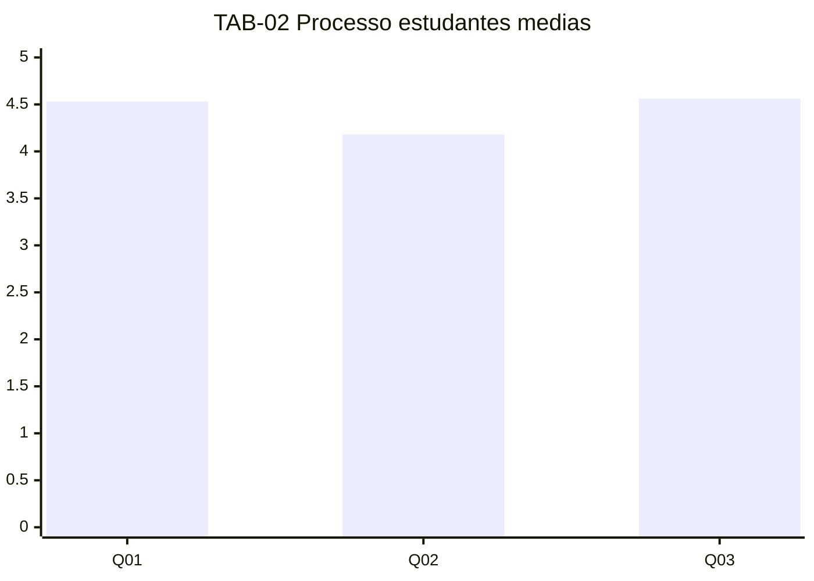
```mermaid
xychart-beta
    title "TAB-02 Processo estudantes medias"
    x-axis [Q01, Q02, Q03]
    y-axis 0 --> 5
    bar [4.53, 4.18, 4.56]
```

### TAB-03. Tabela 3, Processo pelos servidores (p. 10)

Q1 4,33, Q2 1,33, Q3 3,00. Q2 fragilidade na divulgação de melhorias.

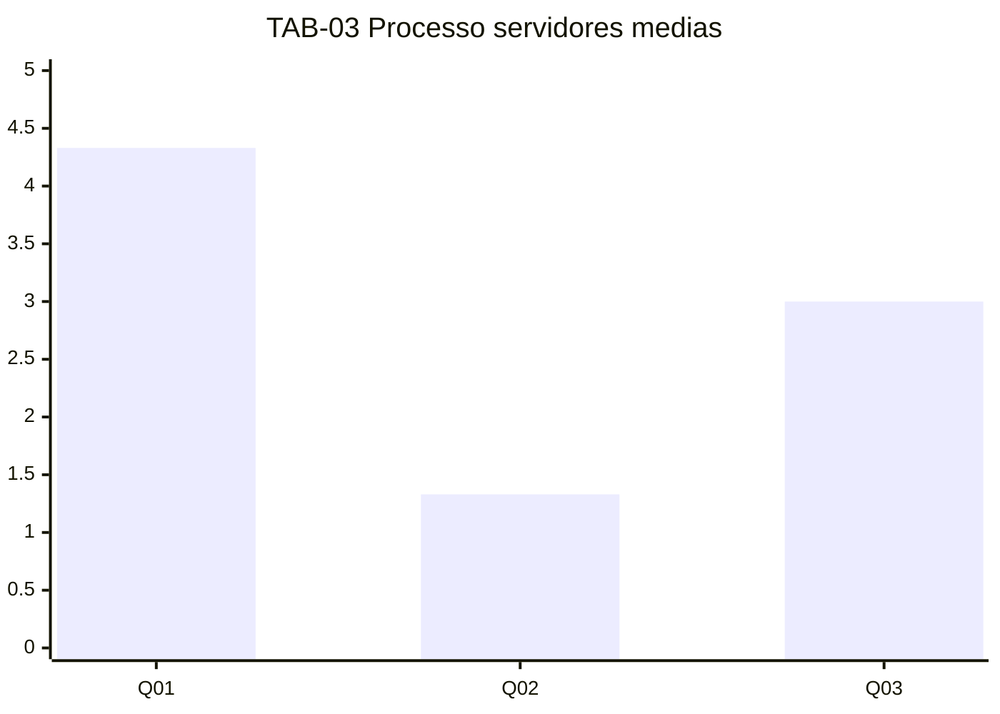
```mermaid
xychart-beta
    title "TAB-03 Processo servidores medias"
    x-axis [Q01, Q02, Q03]
    y-axis 0 --> 5
    bar [4.33, 1.33, 3.00]
```

### TAB-05. Tabela 5, Desenvolvimento pelos Estudantes (p. 13)

Q1 4,44, Q2 4,40, Q3 4,47.

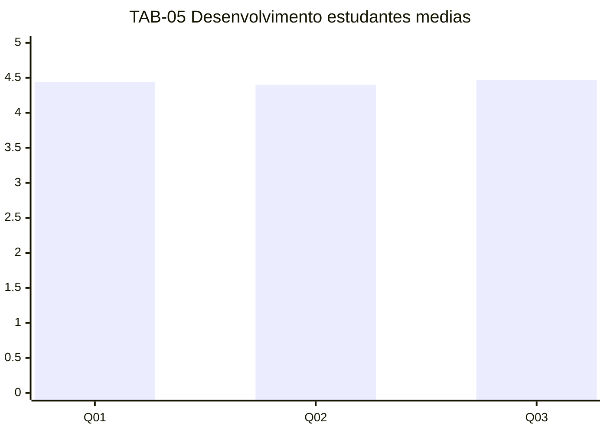
```mermaid
xychart-beta
    title "TAB-05 Desenvolvimento estudantes medias"
    x-axis [Q01, Q02, Q03]
    y-axis 0 --> 5
    bar [4.44, 4.40, 4.47]
```

### TAB-06. Tabela 6, Desenvolvimento pelos servidores (p. 13)

Q1 3,00, Q2 3,33, Q3 3,00, Q4 3,67. Oportunidade em todo o bloco.

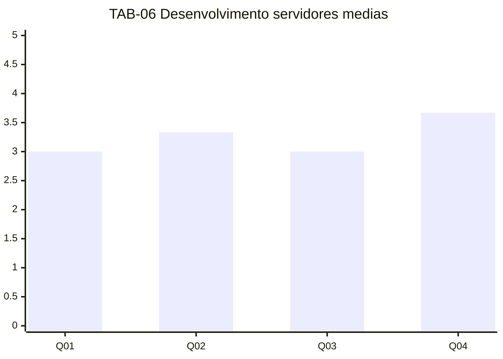
```mermaid
xychart-beta
    title "TAB-06 Desenvolvimento servidores medias"
    x-axis [Q01, Q02, Q03, Q04]
    y-axis 0 --> 5
    bar [3.00, 3.33, 3.00, 3.67]
```

### TAB-07. Tabela 7, Capacitação pelos professores (p. 14)

Q1 4,36, Q2 4,46.

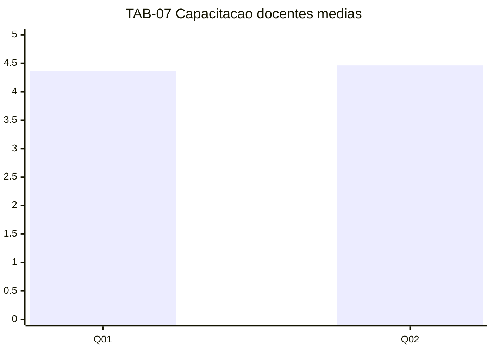
```mermaid
xychart-beta
    title "TAB-07 Capacitacao docentes medias"
    x-axis [Q01, Q02]
    y-axis 0 --> 5
    bar [4.36, 4.46]
```

### TAB-08. Tabela 8, Capacitação pelos técnicos (p. 15)

Q1 4,06, Q2 4,17.

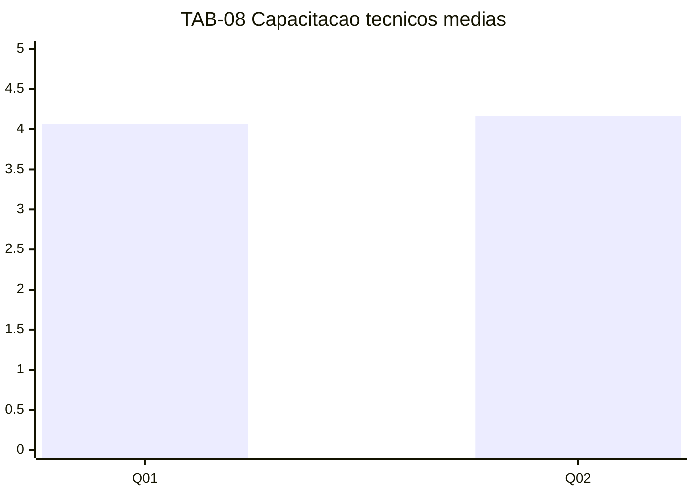
```mermaid
xychart-beta
    title "TAB-08 Capacitacao tecnicos medias"
    x-axis [Q01, Q02]
    y-axis 0 --> 5
    bar [4.06, 4.17]
```

### TAB-09. Tabela 9, Autoavaliação de Professores (p. 15)

Q1 4,68, Q2 4,86, Q3 4,59, Q4 4,86, Q5 5,00, Q6 5,00, Q7 4,68.

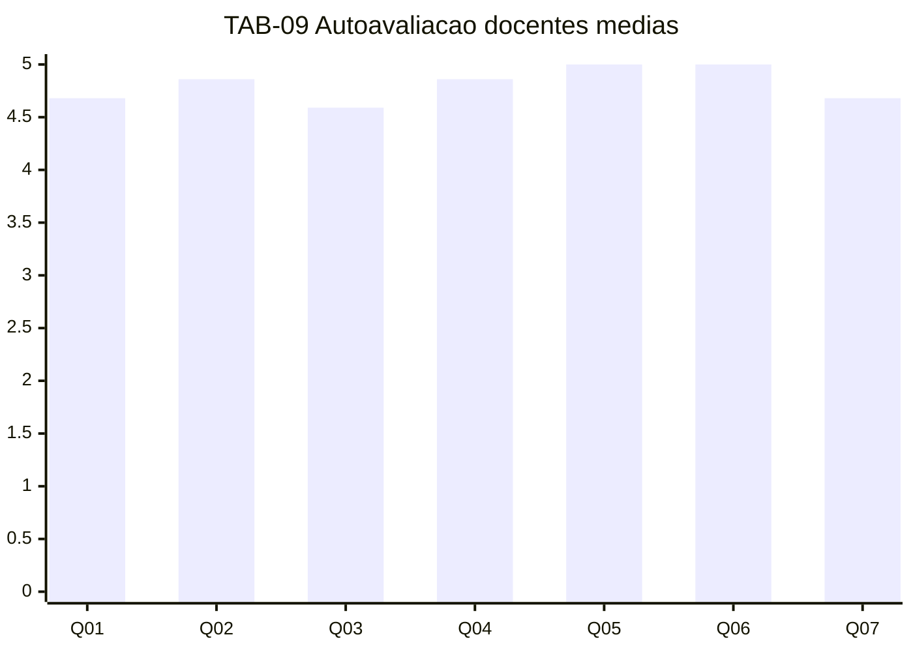
```mermaid
xychart-beta
    title "TAB-09 Autoavaliacao docentes medias"
    x-axis [Q01, Q02, Q03, Q04, Q05, Q06, Q07]
    y-axis 0 --> 5
    bar [4.68, 4.86, 4.59, 4.86, 5.00, 5.00, 4.68]
```

### TAB-10. Tabela 10, Autoavaliação técnicos (p. 16)

Q1 4,78, Q2 4,94, Q3 4,44, Q4 4,83, Q5 4,94.

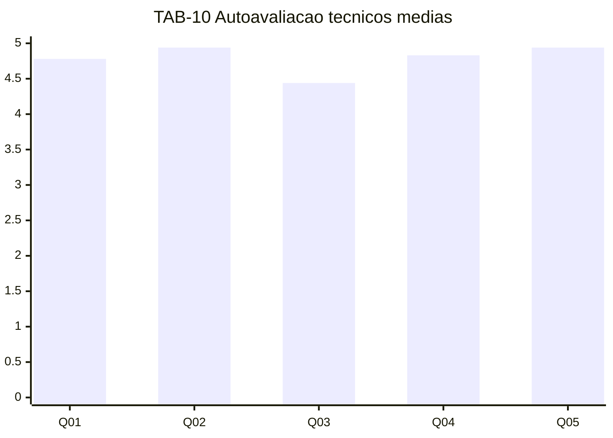
```mermaid
xychart-beta
    title "TAB-10 Autoavaliacao tecnicos medias"
    x-axis [Q01, Q02, Q03, Q04, Q05]
    y-axis 0 --> 5
    bar [4.78, 4.94, 4.44, 4.83, 4.94]
```

### TAB-11. Tabela 11, Ensino pelos professores (p. 17)

Q1 4,33, Q2 3,33, Q3 4,00, Q4 5,00, Q5 4,33, Q6 4,00, Q7 3,00, Q8 4,00, Q9 4,00, Q10 4,00.

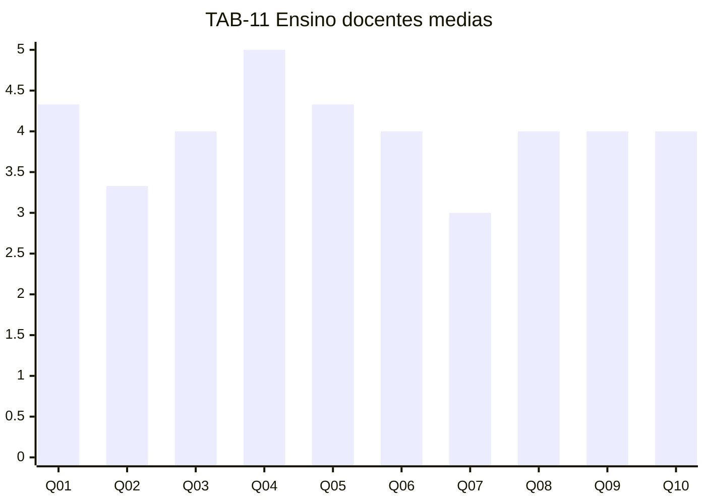
```mermaid
xychart-beta
    title "TAB-11 Ensino docentes medias"
    x-axis [Q01, Q02, Q03, Q04, Q05, Q06, Q07, Q08, Q09, Q10]
    y-axis 0 --> 5
    bar [4.33, 3.33, 4.00, 5.00, 4.33, 4.00, 3.00, 4.00, 4.00, 4.00]
```

### TAB-12. Tabela 12, Ensino pelos técnicos (p. 18)

Q1 4,78, Q2 4,83, Q3 4,67, Q4 4,46, Q5 4,56, Q6 4,61, Q7 4,61.

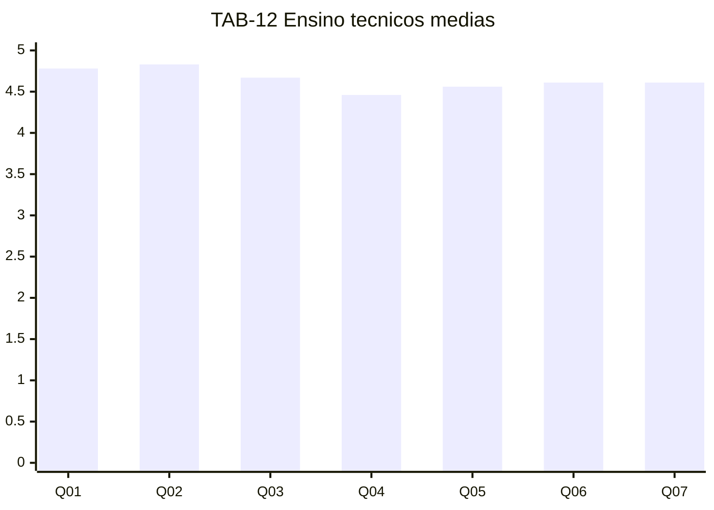
```mermaid
xychart-beta
    title "TAB-12 Ensino tecnicos medias"
    x-axis [Q01, Q02, Q03, Q04, Q05, Q06, Q07]
    y-axis 0 --> 5
    bar [4.78, 4.83, 4.67, 4.46, 4.56, 4.61, 4.61]
```

### TAB-13. Tabela 13, Egressos pelo diretor e coordenadores (p. 19)

Q1 5,00, Q2 5,00, Q3 2,67. Q3 frágil.

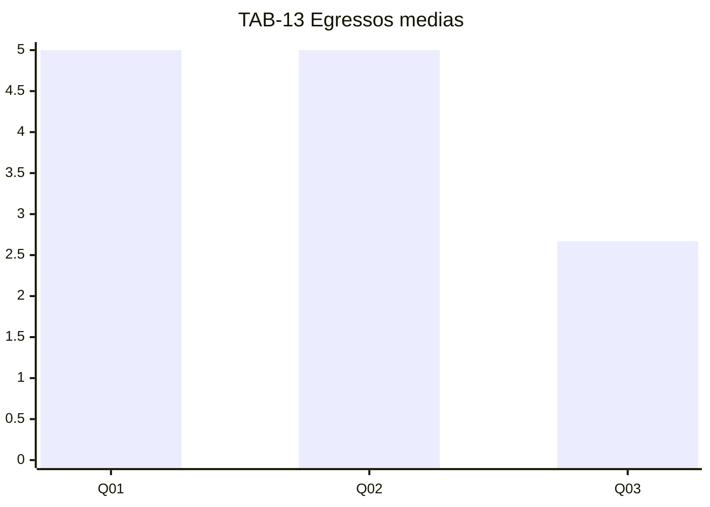
```mermaid
xychart-beta
    title "TAB-13 Egressos medias"
    x-axis [Q01, Q02, Q03]
    y-axis 0 --> 5
    bar [5.00, 5.00, 2.67]
```

### TAB-14. Tabela 14, Atendimento pelos professores (p. 19)

Q1 4,48, Q2 4,78.

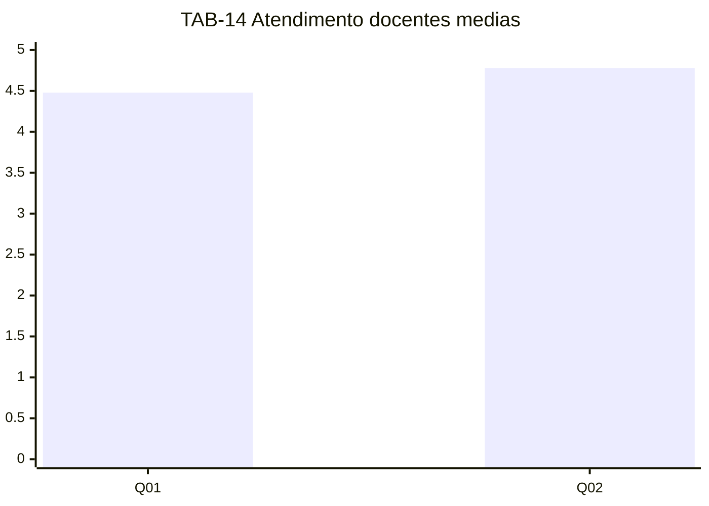
```mermaid
xychart-beta
    title "TAB-14 Atendimento docentes medias"
    x-axis [Q01, Q02]
    y-axis 0 --> 5
    bar [4.48, 4.78]
```

### TAB-15. Tabela 15, Atendimento pelos técnicos (p. 20)

Q1 4,72, Q2 4,35, Q3 4,18.

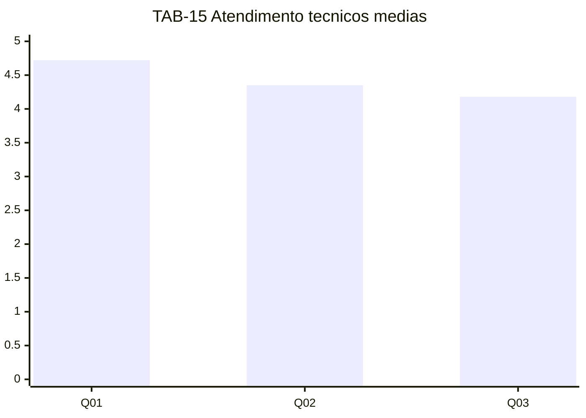
```mermaid
xychart-beta
    title "TAB-15 Atendimento tecnicos medias"
    x-axis [Q01, Q02, Q03]
    y-axis 0 --> 5
    bar [4.72, 4.35, 4.18]
```

### TAB-16. Tabela 16, Comunicação pelos servidores (p. 20)

Q1 4,33, Q2 4,00.

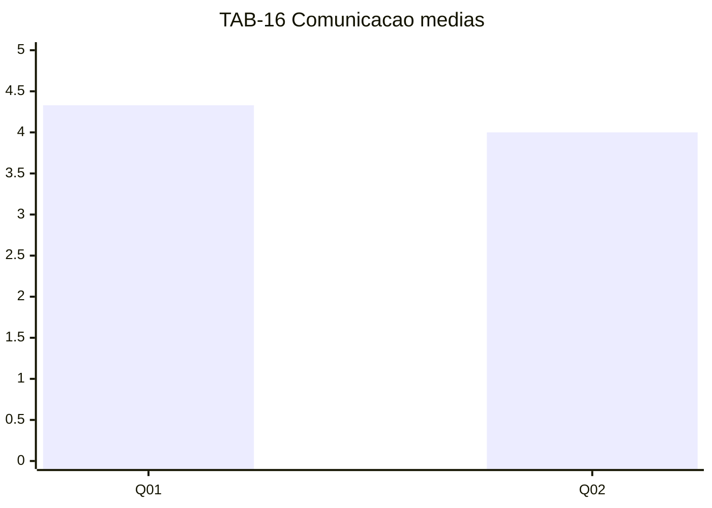
```mermaid
xychart-beta
    title "TAB-16 Comunicacao medias"
    x-axis [Q01, Q02]
    y-axis 0 --> 5
    bar [4.33, 4.00]
```

### TAB-18. Tabela 18, Imagem geral pelos Estudantes (p. 22)

Q1 4,77, Q2 4,83.

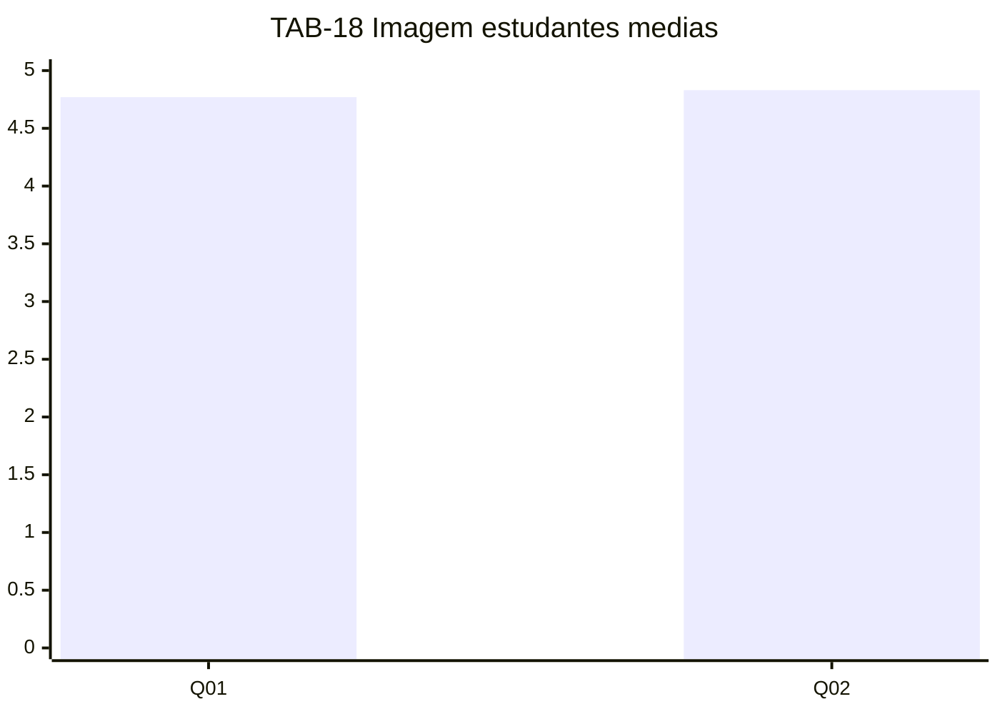
```mermaid
xychart-beta
    title "TAB-18 Imagem estudantes medias"
    x-axis [Q01, Q02]
    y-axis 0 --> 5
    bar [4.77, 4.83]
```

### TAB-19. Tabela 19, Imagem geral pelos Servidores (p. 22)

Q1 3,67, Q2 4,00.

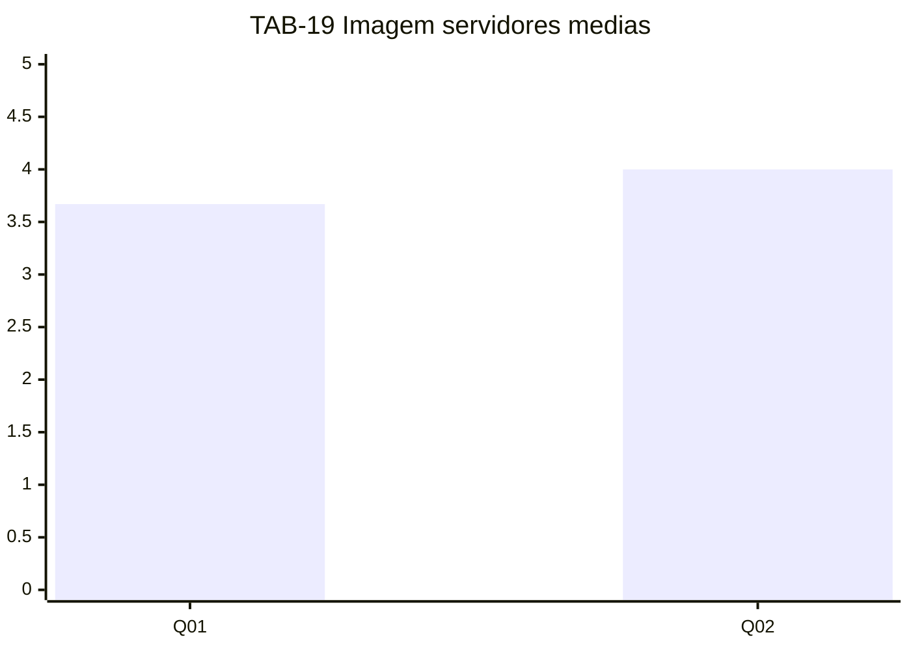
```mermaid
xychart-beta
    title "TAB-19 Imagem servidores medias"
    x-axis [Q01, Q02]
    y-axis 0 --> 5
    bar [3.67, 4.00]
```

## 11. Lacunas e defeitos declarados desta conversão

Cobertura integral do texto e das 43 tabelas numeradas (mais Tabela 4 de auxílios como Tabela 4). Documento sem figuras: nenhum gráfico embutido, com tabelas como única série quantitativa, sem necessidade de visão sobre gráficos. Defeitos do original preservados: capa com Campo Grande para relatório do CPAR; Tabela 4 de auxílios sem numeração própria na lista; Tabela 13 com soma 105 e Q3 com soma 133; Tabela 14 numerada 4 e Tabela 21 numerada 61 no cabeçalho; Tabela 24 numerada 74, Tabela 25 numerada 85, Tabela 30 numerada 100, Tabela 32 numerada 112, Tabela 33 numerada 123, Tabela 35 numerada 135, Tabela 36 numerada 146, Tabela 39 numerada 3915, Tabela 41 numerada 161 e Tabela 57 para infraestrutura; Tabela 38 com cabeçalho Q1 Q1 e sem coluna NA; Tabela 40 com NA igual à média e Q6 idêntica à Q1; Tabela 29 numerada 9 no corpo; divergências texto versus tabela em esportivos (2,66/2,77), alimentação (3,56/3,60), parada (3,46/3,63) e transporte (3,29/3,40); parágrafo de técnicos com percentuais dos professores; remissão da tabela 23 para a tabela 23; Porto forte e servido no original; criação de comissão em 2024 com plano para 2023; e-mail de 25/10/2028; questões Q6 de autoavaliação sem legenda completa. Nenhum valor estimado.

