# FONTE PRIMÁRIA ESTRUTURADA — Relatório de Autoavaliação Setorial 2023 do CPAR/UFMS

> **Arquivo fonte**: `Relatorio CSA 2023 - CPAR final.pdf`, Google Drive, ID `1TLNSaCY-RPkV7mF0xFIt9kPOlF08E7tM` (visualização permitida, download restrito).
> **Documento**: RELATÓRIO DE AUTOAVALIAÇÃO SETORIAL 2023, CPAR/UFMS, Paranaíba MS, Fevereiro de 2024. 78 páginas. Diretor Prof. Wesley Ricardo de Souza Freitas. CSA pela Portaria n. 118-CPAR/UFMS, de 18/09/2023 (docentes Anahi Souto Vieira, Ana Izabel Passarella Teixeira, Camila Bellini Colussi Macedo, Ricardo José dos Santos; técnicos Anderson da Silva Nascimento e Nathan Rodrigues Batista; estudantes Augusto Gonçalves da Silva, Érica Vitória Palhares Supriano, Mariaine Honorata Freitas Campos e Thalia Eduarda Alves do Nascimento). Funcionamento pela Resolução COUN n. 57 de 13/06/2017.
> **Método de conversão**: viewer via DOM acessível em janelas de 2 a 4 páginas (sessão limpa, input aria-label A página está, SENT por janela, sleep 8s), com transcrição das tabelas numéricas e dos textos de análise. Documento sem figuras de gráficos: todas as séries quantitativas são tabelas, sem imagens a traduzir (padrão iniciado em 2022 e mantido em 2023).
> **Data da conversão**: 09 set 2026. **Cobertura**: integral das 78 páginas por janelas (1 a 78), 51 tabelas e 11 quadros transcritos pelos títulos, valores e análises.
> **Relação com a série analítica**: este arquivo é a fonte primária estruturada; o arquivo analítico `RSA_2023_CPAR.md` permanece preservado e tem função diferente.
> **Convenção de tabelas**: escala de 5 (Concordo totalmente) a 1 (Discordo totalmente), além de NA, NQR e NSR/NSA. Cada tabela recebe bloco de contexto (número, título verbatim, página, fonte) + linhas por item (Média e percentuais) + texto fiel de análise + diagrama mermaid das médias. Nenhum valor foi estimado.

## Sumário do documento fonte

1 INTRODUÇÃO (p. 9). 2 PROCESSO DE AVALIAÇÃO INSTITUCIONAL (p. 9): 2.1 O processo na Unidade (Tabela 1); 2.2 Percepção sobre o processo (Tabelas 2 e 3). 3 UNIDADE SETORIAL (p. 12): 3.1 Dados gerais (Quadro 1, Tabela 4, planejamento 2023-2024); 3.2.1 Percepção (3.2.1.1 desenvolvimento, Tabelas 5 e 6; 3.2.1.2 capacitação, Tabelas 7 e 8; 3.2.1.3 desempenho, Tabelas 9 e 10; 3.2.1.4 ensino, Tabelas 11 e 12; atendimento e egressos, Tabelas 13 a 15; comunicação, Tabela 16; infraestrutura, Tabela 17; imagem geral, Tabelas 18 e 19; questão aberta geral); 3.4 Gestão e plano de ação (Quadros 2 a 4). 4 AVALIAÇÃO DOS CURSOS (p. 35): 4.1 Administração (Tabelas 20 a 27, Quadros 5 e 6, externas, colegiado, corpo docente); 4.2 Matemática (Tabelas 28 a 35, Quadros 7 e 8, externas, colegiado, corpo docente); 4.3 Medicina Veterinária (Tabelas 36 a 43, Quadro 09, externas, colegiado, corpo docente, 8 docentes e 2 técnicos); 4.4 Psicologia (Tabelas 44 a 51, Quadros 10 e 11, externas, colegiado, corpo docente). 5 BALANÇO CRÍTICO (p. 76). 6 CONSIDERAÇÕES FINAIS (p. 76). 7 REFERÊNCIAS (p. 77).

## Lista de Tabelas do documento

Tabela 1: Adesão em 2023 (p. 10). Tabela 2: Processo pelos Estudantes (p. 11). Tabela 3: Processo pelos servidores (p. 12). Tabela 4: Auxílios em 2022 (p. 13; cabeçalho com 2022, conteúdo do relatório 2023). Tabela 5: Desenvolvimento pelos Estudantes (p. 14). Tabela 6: Desenvolvimento pelos servidores (p. 14). Tabela 7: Capacitação pelos professores, coordenadores e diretor (p. 15). Tabela 8: Capacitação pelos técnicos (p. 15). Tabela 9: Autoavaliação de Professores, coordenadores e diretor (p. 16). Tabela 10: Autoavaliação técnico-administrativos (p. 17). Tabela 11: Ensino pelos professores, coordenadores e diretor (p. 18). Tabela 12: Ensino pelos técnicos (p. 19). Tabela 13: Egressos pelo diretor e coordenadores (p. 20). Tabela 14: Atendimento pelos professores (p. 20). Tabela 15: Atendimento pelos técnicos (p. 21). Tabela 16: Comunicação pelos servidores (p. 21). Tabela 17: Infraestrutura pela comunidade (p. 22 a 23). Tabela 18: Imagem geral pelos Estudantes (p. 23). Tabela 19: Imagem geral pelos Servidores (p. 24). Tabela 20: Coordenação pelo coordenador, Administração (p. 35). Tabela 21: Coordenação pelos estudantes, Administração (p. 36). Tabela 22: Disciplinas e professores, Administração (p. 37). Tabela 23: Professores quanto ao próprio desempenho, Administração (p. 38). Tabela 24: Desempenho próprio, Administração (p. 39). Tabela 25: Demais atividades, Administração (p. 39). Tabela 26: Desempenho pelos professores, Administração (p. 40). Tabela 27: Infraestrutura do curso, Administração (p. 41). Tabela 28: Coordenação pelo coordenador, Matemática (p. 46). Tabela 29: Coordenação pelos estudantes, Matemática (p. 47). Tabela 30: Disciplinas e professores, Matemática (p. 48). Tabela 31: Professores quanto ao próprio desempenho, Matemática (p. 48). Tabela 32: Desempenho próprio, Matemática (p. 49). Tabela 33: Demais atividades, Matemática (p. 50). Tabela 34: Desempenho pelos professores, Matemática (p. 50 a 51). Tabela 35: Infraestrutura do curso, Matemática (p. 51). Tabela 36: Coordenação pelo coordenador, Medicina Veterinária (p. 57). Tabela 37: Coordenação pelos estudantes, Medicina Veterinária (p. 58). Tabela 38: Disciplinas e professores, Medicina Veterinária (p. 59). Tabela 39: Professores quanto ao próprio desempenho, Medicina Veterinária (p. 59 a 60). Tabela 40: Desempenho próprio, Medicina Veterinária (p. 60). Tabela 41: Demais atividades, Medicina Veterinária (p. 61). Tabela 42: Desempenho pelos professores, Medicina Veterinária (p. 61). Tabela 43: Infraestrutura do curso, Medicina Veterinária (p. 62). Tabela 44: Coordenação pelo coordenador, Psicologia (p. 66). Tabela 45: Coordenação pelos estudantes, Psicologia (p. 67). Tabela 46: Disciplinas e professores, Psicologia (p. 68). Tabela 47: Professores quanto ao próprio desempenho, Psicologia (p. 69). Tabela 48: Desempenho próprio, Psicologia (p. 70). Tabela 49: Demais atividades, Psicologia (p. 70). Tabela 50: Desempenho pelos professores, Psicologia (p. 71). Tabela 51: Infraestrutura do curso, Psicologia (p. 72).

## Lista de Quadros do documento

Quadro 1: Informações sobre a UAS e seus cursos (p. 12). Quadro 2: Ações da direção em 2022 e situação (p. 25 a 26). Quadro 3: Fragilidades e oportunidades de 2022 (p. 26 a 29). Quadro 4: Ações para questões abertas da unidade (p. 33 a 34). Quadro 5: Ações da coordenação de Administração para 2021 (p. 42). Quadro 6: Fragilidades e oportunidades de 2023, Administração (p. 43 a 44). Quadro 7: Ações da coordenação de Matemática para 2022 (p. 53 a 54). Quadro 8: Fragilidades e oportunidades de 2022, Matemática (p. 55). Quadro 09: Fragilidades e oportunidades de 2023, Medicina Veterinária (p. 63 a 64). Quadro 10: Ações da coordenação de Psicologia para 2022 (p. 73). Quadro 11: Fragilidades e oportunidades de 2023, Psicologia (p. 74).

---

## 1. Rosto, composição e processo (páginas 1 a 12)

Página 1: capa com Câmpus de Paranaíba, RELATÓRIO DE AUTOAVALIAÇÃO SETORIAL 2023, Paranaíba MS, Fevereiro de 2024. Página 2: diretor Wesley Ricardo de Souza Freitas; CSA pela Portaria n. 118-CPAR/UFMS de 18/09/2023, composição acima. Funcionamento pela Resolução COUN n. 57 de 13/06/2017; relatórios por e-mail, site da UAS e Diavi, Facebook e Instagram; reuniões com direção, coordenações, professores e estudantes; devolutivas de NDEs e direção.

Processo 2023: primeira etapa referente a 2022-2 de 01 a 30/06/2023 para todos os segmentos (estudantes, professores, coordenadores, diretores e técnicos); disciplinas desvinculadas, aplicadas pelas coordenações em 09/2023; questionários no SIAI. Critérios MEC sem NS/NA: 1+2 fragilidade, 3 oportunidade, 4+5 bem avaliado. Escala 5 a 1 com NA/NQR/NSR. Divulgação dos resultados de 2022 em salas com sensibilização; mais de 50 por cento dos alunos sem enxergar a importância.

Tabela 1, Adesão em 2023, fonte SIAI/AGETIC (texto com ano 2022 no título da seção, defeito preservado): diretor 1/1 (100); coordenadores 4/4 (100); professores 24/32 (75); estudantes 211/475 (44,42), com Administração 98/177 (55,37), Matemática 21/73 (28,77), Medicina Veterinária 15/39 (38,46), Psicologia 77/186 (41,40); técnicos 18/18 (100); total 258/530 (48,67). Primeira adesão com Medicina Veterinária; total 48,67 como pico pós-pandemia.

Tabela 2, Processo pelos Estudantes: Q1 4,32 (54,98/24,64/12,8/3,32/1,42/2,84); Q2 3,90 (35,55/18,48/13,74/4,27/7,11/20,85); Q3 4,25 (51,18/25,12/15,64/2,84/1,9/3,32). Q1 meios 79,62 muito bons ou bons, 16,12 satisfatórios, 1,42 não satisfatório, 2,84 sem opinião. Q2 divulgação 54,03 muito bom ou bom, 18,01 satisfatório, 7,11 não concordam, 20,85 sem opinião; atenção aos 20,85 sem opinião. Q3 compreensão 76,3 muito fácil e fácil, 18,48 compreendem, 1,9 não compreendem, 3,32 sem opinião.

Tabela 3, Processo pelos servidores: Q1 4,39 (66,67/11,11/16,67/5,56/0/0); Q2 4,72 (77,78/16,67/5,56/0/0/0); Q3 4,39 (61,11/22,22/11,11/5,56/0/0). Q1 meios 77,7 muito bom e bom, 22,16 satisfatórios. Q2 divulgação 94,3 muito bom ou bom, 5,56 satisfatório. Q3 compreensão 83,3 muito fácil e fácil, 16,66 compreendem. Melhora ante 1,33 em 2022 na divulgação entre servidores.

## 2. Unidade setorial (páginas 12 a 24)

Texto da seção 3.1 repete em 2022 três cursos (Administração, Matemática e Psicologia), copiado do ano anterior; Quadro 1 e Tabela 1 confirmam 4 cursos com Medicina Veterinária. Divergência preservada. Quadro 1 com links das páginas dos cursos.

Tabela 4, Auxílios (cabeçalho com 2022, fonte SISGBA/UFMS), ordem Adm, Psico, Mat, Med Vet: permanência 4/36/8/3 = 51; emergencial 0/1/0/1 = 2; moradia 0/27/1/0 = 28; alimentação 4/19/7/4 = 34; creche 1/0/1/0 = 2; PCD 1/3/0/0 = 4; PIBIC/PIBITI 0/2/0/1 = 3; extensão 1/7/0/0 = 8; monitoria 0/0/0/0 = 0.

Planejamento 2023-2024 (PDI e PDU 2020-2024): jornal ACONTECEU em andamento; anatomia animal para 1/2024; quadra aguardando reitoria (não realizado); MV concluída; bloco de laboratórios em obra até 2024; mestrado multicâmpus NÃO APROVADO pela CAPES, nova submissão em 2024.

Tabela 5, Desenvolvimento pelos Estudantes: Q1 4,18 (45,02/27,49/14,69/5,21/0,95/6,63); Q2 3,93 (34,6/28,91/20,38/7,58/1,9/6,63); Q3 4,12 (4,08/27,01/18,48/4,74/1,42/4,24, com 4,08 impresso na coluna 5 no original, defeito preservado). Bem avaliados acima de 3,9; 211 discentes.

Tabela 6, Desenvolvimento pelos servidores: Q1 4,35 (44,44/38,89/11,11/0/0/5,56); Q2 4,44 (55,56/33,33/11,11/0/0/0); Q3 4,17 (38,89/38,89/22,22/0/0/0); Q4 3,94 (33,33/33,33/27,78/5,56/0/0). Oportunidade no bloco (3,94 a 4,44); fortes em ODS e cultura; articulação missão/visão com média 4,17.

Tabela 7, Capacitação pelos professores, coordenadores e diretor: Q1 5,00 (100); Q2 5,00 (100). Unanimidade em incentivo e qualificação.

Tabela 8, Capacitação pelos técnicos: Q1 3,33 (27,78/22,22/22,22/11,1/16,67/0); Q2 3,41 (22,22/27,78/16,67/22,22/5,56/5,56). Q1 com 50 concordam totalmente e parcialmente, 33,3 concordam, 16,67 discordam; Q2 com 50 concordam totalmente e parcialmente, 38,89 concordam, 5,56 discordam totalmente, 5,56 sem opinião.

Tabela 9, Autoavaliação de Professores, coordenadores e diretor (texto com variação de 4,59 a 5, defeito preservado ante o intervalo real 4,46 a 4,96): Q1 4,71 (79,11/12,5/8,33/0/0/0); Q2 4,88 (87,5/12,5/0/0/0/0); Q3 4,46 (50,00/45,83/4,17/0/0/0); Q4 4,83 (83,33/16,67/0/0/0/0); Q5 4,96 (95,83/4,17/0/0/0/0); Q6 4,92 (91,67/8,33/0/0/0/0). Q1 atualização, Q2 e-mail, Q3 documentos, Q4 contribuição, Q5 ética, Q6 orientação.

Tabela 10, Autoavaliação técnicos: Q1 4,83 (83,33/16,67/0/0/0/0); Q2 5,00 (100); Q3 4,56 (61,11/33,33/5,56/0/0/0); Q4 4,89 (88,89/11,11/0/0/0/0); Q5 4,89 (88/89/11,11/0/0/0/0, com 88389 impresso no original, defeito preservado). Ponto forte com 4,56 a 5.

Tabela 11, Ensino pelos professores, coordenadores e diretor: Q1 4,61 (67,86/25,00/7,14/0/0/0); Q2 4,48 (55,17/37,93/6,90/0/0/0); Q3 4,52 (58,62/34,48/6,90/0/0/0); Q4 4,59 (75,86/13,79/3,45/6,90/0/0); Q5 4,76 (79,31/17,24/3,45/0/0/0); Q6 3,11 (17,24/20,69/24,14/24,14/10,34/3,45); Q7 3,82 (20,69/17,24/10,34/10,34/0/41,38); Q8 4,10 (27,59/31,03/6,90/6,90/0/27,59); Q9 3,96 (41,38/27,59/10,34/6,90/6,90/6,90); Q10 3,79 (44,83/17,24/13,79/10,34/10,34/3,45). Fortes Q1, Q2, Q3, Q4, Q5 e Q8; oportunidades em infraestrutura (Q6), pós com graduação (Q7), publicação (Q9) e cultura (Q10).

Tabela 12, Ensino pelos técnicos: Q1 4,61 (72,22/22,22/0/5,56/0/0); Q2 4,29 (50,00/22,22/22,22/0/0/5,56); Q3 3,24 (16,67/27,78/22,22/16,67/11,11/5,56); Q4 3,46 (11,11/33,33/11,11/11,11/5,56/27,78); Q5 3,81 (27,78/27,78/22,22/11,11/0/11,11); Q6 3,94 (38,89/22,22/27,78/0/5,56/5,56); Q7 3,89 (44,44/16,67/22,22/16,67/0/0). Fortes Q1 e Q2; oportunidades Q3 a Q7. MBA em Gestão Estratégica na terceira turma; MBA em Agronegócio com Medicina Veterinária para 2024; AGINOVA com editais de mobilidade; tradução de artigos com pouca adesão; comissão de cultura com SEMANA MAIS ESPORTE e academia ao ar livre.

Tabela 13, Egressos pelo diretor e coordenadores: Q1 4,25 (40/20/20/0/0/20); Q2 4,00 (20/40/20/0/0/20); Q3 3,25 (20/0/40/20/0/20). Q1 assistência e Q2 acessibilidade como fortes; Q3 oportunidade em acompanhamento de egressos, com Res. 89/2021 e questionário de Administração.

Tabela 14, Atendimento pelos professores: Q1 4,39 (50,00/33,33/12,50/0/0/4,17); Q2 4,00 (33,33/37,50/12,50/4,17/4,17/8,33). Pontos fortes em assistência e acessibilidade.

Tabela 15, Atendimento pelos técnicos: Q1 4,56 (61,11/33,33/5,56/0/0/0); Q2 3,06 (11,11/22,22/33,33/27,78/5,56/0); Q3 3,24 (11,11/27,78/33,33/16,67/5,56/5,56). Forte em assistência; oportunidades em acessibilidade (prédio com 15 anos, Libras e assistência social) e egressos.

Tabela 16, Comunicação pelos servidores: Q1 4,33 (48,94/31,91/12,77/2,13/0/4,26); Q2 4,45 (44,68/14,89/8,51/2,13/0/29,79). Pontos fortes em divulgação e ouvidoria.

Tabela 17, Infraestrutura pela comunidade: Salas de aula 3,46 (23,64/27,91/25,58/15,12/6,98/0,78); Professores 4,17 (36,82/22,48/8,53/4,26/2,33/25,58); Administrativas 3,96 (27,91/28,29/13,57/4,65/2,71/22,87); Auditórios 3,34 (24,42/25,19/21,71/14,73/12,79/1,16); Sanitárias 3,48 (23,26/32,17/21,71/13,57/8,53/0,78); Informática 4,05 (39,92/29,07/14,34/5,04/3,49/8,14); Internet 3,24 (22,48/22,87/23,64/14,73/14,73/1,55); AVA 4,35 (57,36/22,09/9,69/3,10/2,71/5,04); E-mail 4,43 (61,63/24,42/10,85/1,55/1,55/0); Práticas 3,38 (22,09/23,64/21,71/8,91/12,40/11,24); Convivência 3,38 (27,13/20,16/26,74/13,18/11,63/1,16); Esportivos 1,70 (6,59/2,33/6,20/9,69/54,26/20,93); Alimentação 2,53 (11,63/10,08/22,48/17,44/29,46/8,91); Biblioteca 4,36 (56,98/27,13/10,47/1,94/2,33/1,16); Acervo 4,06 (42,25/26,74/15,89/5,04/3,49/6,59); Segurança 3,66 (31,01/25,58/22,87/10,85/6,59/3,10); Iluminação 3,35 (21,32/26,74/25,58/14,73/10,08/1,55); Acessibilidade 3,55 (27,13/24,03/22,48/10,47/8,53/7,36); Limpeza 4,00 (43,02/29,46/17,05/5,81/4,65/0); Parada 3,67 (33,72/18,60/17,83/5,81/10,85/13,18); Estacionamento 3,84 (36,43/26,36/20,16/10,08/3,88/3,10); Bicicletário 3,62 (29,07/20,54/20,93/7,75/8,53/13,18); Vias 3,75 (29,46/28,29/20,16/6,20/6,59/9,30); Transporte 2,61 (10,08/8,14/16,28/6,20/23,64/35,66); Telefonia 3,38 (19,77/12,02/17,83/6,20/10,08/34,11); SISCAD 4,32 (55,04/26,36/8,53/5,04/1,94/3,10); SIGPOS 4,11 (19,77/10,47/6,59/1,55/1,94/59,69); Secretaria 4,37 (56,98/22,09/8,14/2,71/3,10/6,98). Texto com parada 3,46 onde a tabela traz 3,67, defeito preservado. Sem esportivos nem RU, com cantina fechada e copa; sem transporte coletivo, com ponto de carona.

Tabela 18, Imagem geral pelos Estudantes (texto com servidores no original, contexto de estudantes): Q1 3,83 (22,22/44,44/27,78/5,56/0/0); Q2 4,50 (55,56/38,89/5,56/0/0/0). Prestígio forte; ambiente de estudo como oportunidade.

Tabela 19, Imagem geral pelos Servidores: Q1 3,67 (33,33/0/66,67/0/0/0); Q2 4,00 (33,33/33,33/33,33/0/0/0). Oportunidade em recomendar como local de trabalho; prestígio unânime.

Questão aberta geral: egressos como convidados; burocracia na qualificação; manutenção de ar, tomadas, cadeiras ergonômicas, portas, auditório, esporte, câmeras, alimentação, almoxarifado, brinquedoteca, informática, rede elétrica para Veterinária, estacionamento, ciclovia, moradia, sala de descanso, copa, centros acadêmicos, acústica da clínica, lousas, papelaria, energia solar, HDMI, filtros solares, acessibilidade para PCDs e obesos. Pessoal: técnicos, terceirizados, pedagogo, 30h, substitutos para pós-doutorado, transporte, psicólogo para prontuários, docentes em Psicologia.

Quadros 2 a 4: egressos realizada; esporte aguardando 2024; salas para 45 alunos; administrativas adaptadas; auditório para 300; internet em evolução; 40 máquinas; clínica com acústica; laboratório de MV; sem convivência; esportivos aguardando; alimentação com SECAE e cantina em 2024; segurança, iluminação, acessibilidade, parada, estacionamento com cobertura, bicicletário, transporte, telefonia, imagem com AGECOM e PROGEP. Uso pela direção com acolhimento e apoio das pró-reitorias; percepção com comunicação a melhorar por reuniões, e-mails e redes.
## 3. Curso de Administração (páginas 35 a 45)

Identificação: código E-MEC 52136, Bacharel, presencial, noturno, 8 a 12 semestres, implantação 2001, autorização Portaria SESU/MEC n. 1.010 de 29/11/2006, renovação Portaria SERES/MEC n. 211 de 25/06/2020, carga horária 3.015 horas. Perfil do bacharel com atuação no mercado, autoafirmação e exercício profissional.

Tabela 20, Coordenação pelo coordenador: Q1 a Q6 5,00 (100). Todos os itens com média 5, com aperfeiçoamento contínuo da gestão.

Tabela 21, Coordenação pelos estudantes: Q1 4,55 (62,56/18,01/8,06/1,42/0,47/9,48); Q2 4,46 (62,56/22,27/10,90/2,37/0,47/1,42); Q3 4,66 (74,41/15,64/5,69/1,42/0,47/2,37); Q4 4,36 (52,13/17,54/9,95/3,79/1,42/15,17). Percepção muito favorável acima de 4,3, com mais de 80 por cento em 5 ou 4 exceto Q4.

Tabela 22, Disciplinas e professores: Q1 4,50 (71,13/9,86/13,38/1,41/2,11/2,11); Q2 4,41 (61,27/21,13/11,27/2,82/1,41/2,11); Q3 4,45 (67,61/13,38/6,34/2,11/4,93/5,63); Q4 4,55 (71,13/16,90/4,23/1,41/3,52/2,82); Q5 4,48 (71,83/9,15/14,08/0/3,52/1,41); Q6 4,71 (83,80/6,34/4,93/2,11/1,41/1,41); Q7 4,78 (79,58/8,45/4,93/0,70/0/6,34); Q8 4,69 (80,99/8,45/7,04/0/2,11/1,41). Excelente desempenho acima de 4,4, com mais de 80 por cento em 5 ou 4.

Tabela 23, Professores quanto ao próprio desempenho: Q1 4,82 (85,71/10,71/3,57/0/0/0); Q2 5,00 (100); Q3 4,93 (92,86/7,14/0/0/0/0); Q4 5,00 (100); Q5 5,00 (100); Q6 5,00 (100); Q7 4,82 (85,71/10,71/3,57/0/0/0); Q8 5,00 (100). Coerência com discentes, acima de 4,8. Defeito preservado: enunciado com Q1 a Q6, tabela com 8 linhas sem enunciado de Q7 e Q8.

Questão aberta: positivos com competências; negativos com cronograma e ementa em casos isolados; sugestões com recursos didáticos.

Tabela 24, Desempenho próprio: Q1 4,29 (58,45/18,31/14,79/4,23/2,11/2,11); Q2 4,33 (52,82/30,28/12,68/0,70/2,11/1,41); Q3 4,43 (62,68/20,42/11,97/4,23/0/0,70); Q4 4,20 (55,63/19,01/14,79/6,34/2,82/1,41); Q5 4,30 (58,45/19,72/14,79/5,63/0,70/0,70); Q6 4,84 (86,62/8,45/3,52/0/0/1,40). Muito satisfatória acima de 4,1, com mais de 75 por cento em 5 ou 4.

Tabela 25, Demais atividades: Q1 3,73 (30,61/24,49/32,65/6,12/4,08/2,04); Q2 3,67 (26,53/27,55/30,61/9,18/3,06/3,06); Q3 3,68 (27,55/29,59/25,51/15,31/1,02/1,02); Q4 4,59 (70,41/21,43/5,10/3,06/0/0); Q5 4,18 (56,12/17,35/18,37/5,10/3,06/0). Três oportunidades em participação (3,73), TICs (3,67) e contribuição (3,68). Defeito preservado: texto repete o enunciado de contribuição no segundo e no terceiro item.

Tabela 26, Desempenho pelos professores: Q1 4,57 (60,71/35,71/3,57/0/0/0); Q2 4,36 (39,29/57,14/3,57/0/0/0); Q3 4,39 (50,00/39,29/10,71/0/0/0); Q4 4,79 (78,57/21,43/0/0/0/0); Q5 4,46 (57,14/32,14/10,71/0/0/0). Coerência acima de 4, com mais de 85 por cento em 5 ou 4.

Tabela 27, Infraestrutura do curso: Informática 4,14 (41,41/26,26/13,13/5,05/2,02/12,12); Internet 3,16 (21,21/21,21/22,22/14,14/17,17/4,04); AVA 4,37 (60,61/22,22/12,12/4,04/1,01/0); Práticas 3,81 (33,33/24,24/19,19/5,05/7,07/11,11); Biblioteca 4,45 (61,62/23,23/12,12/1,01/1,01/1,01); Acervo 4,09 (43,43/25,25/14,14/9,09/1,01/7,07). Oportunidades em internet e práticas.

Questão aberta geral: positivos com papel da universidade; negativos com iluminação, jardins, esporte, transporte, cantina; sugestões com internet, quadra, descanso, copa, limpeza. Quadro 5 com ações de 2021 (melhorias 3,75, participação 3,76, contribuição 3,71); Quadro 6 com oportunidades de 2023 (participação 3,73, TICs 3,67, contribuição 3,68, internet 3,16, práticas 3,81). Externas: sem in loco; ENADE 2025; Guia nota 4 satisfatória; colegiado atuante; PADOC com limitação de alunos-trabalhadores.

## 4. Curso de Matemática (páginas 46 a 56)

Identificação: código E-MEC 52139, código 0904, Licenciatura, presencial, noturno com sábado, 8 a 12 semestres, implantação 2001 pela Resolução COUN n. 207 de 13/07/2001, autorização Portaria SESU/MEC n. 1.009 de 29/11/2006, renovação Portaria SERES/MEC n. 1.097 de 24/12/2015, carga horária 3.213 horas, PPC de 03/01/2018.

Tabela 28, Coordenação pelo coordenador: Q1 3,00 (0/0/100/0/0/0); Q2 4,00 (0/100/0/0/0/0); Q3 3,00 (0/0/100/0/0/0); Q4 a Q6 5,00 (100). Divulgação (Q1) e melhorias (Q3) como baixas.

Tabela 29, Coordenação pelos estudantes: Q1 4,63 (61,90/23,81/4,76/0/0/9,52); Q2 4,63 (66,67/14,29/9,52/0/0/9,52); Q3 4,47 (66,67/9,52/9,52/0/4,76/9,52); Q4 4,40 (38,10/23,81/9,52/0/0/28,57). Positiva inclusive na divulgação apontada como não satisfatória, com pouca diferença da avaliação anterior.

Tabela 30, Disciplinas e professores: Q1 4,85 (96,30/0/0/0/3,70/0); Q2 4,81 (92,59/3,70/0/0/3,70/0); Q3 4,78 (92,59/0/3,70/0/3,70/0); Q4 4,74 (88,89/3,70/3,70/0/3,70/0); Q5 4,78 (88,89/7,41/0/0/3,70/0); Q6 4,81 (92,59/3,70/0/0/3,70/0); Q7 4,85 (92,59/3,70/0/3,70/0/0); Q8 4,96 (96,30/3,70/0/0/0/0). Bem avaliados, acima da avaliação anterior.

Tabela 31, Professores quanto ao próprio desempenho: Q1 4,64 (63,64/36,36/0/0/0/0); Q2 5,00 (100); Q3 5,00 (100); Q4 5,00 (100); Q5 5,00 (100); Q6 5,00 (100); Q7 4,64 (63,64/36,36/0/0/0/0); Q8 5,00 (100). Profissionalismo e dedicação. Defeito preservado: enunciado com Q1 a Q6, tabela com 8 linhas.

Questão aberta: competência profissional, com opiniões pessoais. Tabela 32, Desempenho próprio: Q1 4,70 (88,89/0/3,70/7,41/0/0); Q2 4,74 (88,89/3,70/0/7,41/0/0); Q3 4,85 (92,59/0/7,41/0/0/0); Q4 4,85 (85,19/14,81/0/0/0/0); Q5 4,70 (88,89/0/3,70/7,41/0/0); Q6 5,00 (100). Melhora ante a avaliação anterior.

Tabela 33, Demais atividades: Q1 3,70 (23,81/38,10/19,05/9,52/4,76/4,76); Q2 3,65 (33,33/23,81/19,05/9,52/9,52/4,76); Q3 3,62 (19,05/52,38/9,52/9,52/9,52/0); Q4 4,67 (76,19/19,05/0/4,76/0/0); Q5 4,48 (66,67/19,05/9,52/4,76/0/0). Necessidade em participação, TICs e contribuição, sem grandes alterações.

Tabela 34, Desempenho pelos professores: Q1 4,36 (36,36/63,64/0/0/0/0); Q2 4,09 (27,27/54,55/18,18/0/0/0); Q3 4,45 (45,45/54,55/0/0/0/0); Q4 5,00 (100); Q5 4,00 (0/100/0/0/0/0). Satisfatório entre 4 e 5.

Tabela 35, Infraestrutura do curso: Informática 4,10 (38,10/47,62/0/0/0/4,76); Internet 3,89 (47,22/22,22/13,89/5,56/11,11/0); AVA 4,05 (47,62/23,81/14,29/0/9,52/0); Práticas 3,79 (23,81/42,86/4,76/19,05/0/9,52); Biblioteca 4,38 (61,90/23,81/9,52/0/4,76/0); Acervo 4,33 (57,14/28,57/9,52/0/4,76/0). Menores em internet e práticas.

Questão aberta geral com 10 sugestões (cadeiras, lousas, docentes, técnico de manutenção, esporte, som, multimídia, iluminação, RU e cantina, acessibilidade; recorrentes 1, 5 e 9). Ser universitário com psicóloga e assistente social; reuniões didáticas sobre PPC, evasão e pandemia. Quadro 7 com ações de 2022; Quadro 8 com oportunidades (coordenação 3,0, participação 3,70, TICs 3,65, contribuição 3,62, internet 3,89, práticas 3,79). Defeito preservado no Quadro 8: fragmento "Acesso à internet no câmpus urso" por quebra de linha do original. Externas: sem avaliação em 2023, sem in loco, ENADE 2024; recorrência em desempenho por falta de interesse e período remoto; colegiado mensal; NDE semestral com PPC de 01/2023; PIBID premiado no INTEGRA 2023.

## 5. Curso de Medicina Veterinária (páginas 57 a 65, primeiro ano na série)

Primeira participação do curso na autoavaliação. Identificação: código E-MEC 1260587, Bacharel, presencial, matutino, vespertino e sábado, 10 a 15 semestres, implantação 2023, autorização Portaria MEC n. 646 de 30/10/2014, curso recém-criado, carga horária 4.087 horas. Criado em 2022, início em 2023; prédio definitivo em construção e fazenda escola em implantação.

Tabela 36, Coordenação pelo coordenador: Q1 a Q6 5,00, com percentuais Q1 (100,00/25,00/0/0/0/0), Q2 (100,00/25,00/0/0/0/0), Q3 (100,00/0/25,00/0/0/0), Q4 a Q6 (100/0/0/0/0/0). Satisfatória. Defeito preservado: percentuais somam mais de 100 por cento.

Tabela 37, Coordenação pelos estudantes: Q1 4,69 (73,33/0/13,33/0/0/0); Q2 4,07 (40,00/33,33/20,00/6,67/0/0); Q3 4,73 (73,33/26,67/0/0/0/0); Q4 4,00 (53,33/13,33/6,67/13,3/6,67/0). Pontos fortes. Defeito preservado: percentuais somam menos de 100 por cento (Q1 com 86,66).

Tabela 38, Disciplinas e professores: Q1 4,67 (77,78/11,11/11,11/0/0/0); Q2 5,00 (100,0/0/0/0/0/0); Q3 4,89 (88,89/11,11/0/0/0/0); Q4 5,00 (100,0/0/0/0/0/0); Q5 5,00 (100,0/0/0/0/0/0); Q6 5,00 (100,0/0/0/0/0/0); Q7 5,00 (100,0/0/0/0/0/0); Q8 4,50 (50,00/50,00/0/0/0/0). Bastante satisfatória acima de 4.

Tabela 39, Professores quanto ao próprio desempenho: Q1 4,75 (75,00/25,00/0/0/0/0); Q2 5,00 (100,0/0/0/0/0/0); Q3 4,25 (25,00/75,00/0/0/0/0); Q4 5,00 (100,0/0/0/0/0/0); Q5 5,00 (100,0/0/0/0/0/0); Q6 5,00 (100,0/0/0/0/0/0). Satisfatória acima de 4. Questão aberta sem comentários dos alunos.

Tabela 40, Desempenho próprio: Q1 5,00 (100); Q2 4,50 (50/50/0/0/0/0); Q3 4,50 (50/50/0/0/0/0); Q4 4,00 (0/100/0/0/0/0); Q5 5,00 (100); Q6 5,00 (100). Acima de 4 pontos.

Tabela 41, Demais atividades: Q1 3,87 (26,67/46,67/13,33/13,33/0/0); Q2 3,47 (13,33/26,67/53,33/6,67/0/0); Q3 4,13 (33,33/46,67/20/0/0/0); Q4 4,67 (73,33/20/6,67/0/0/0); Q5 4,53 (60,00/33,33/6,67/0/0/0). Oportunidades em participação (3,87) e TICs (3,47).

Tabela 42, Desempenho pelos professores: Q1 4,25 (25/75/0/0/0/0); Q2 3,25 (25/0/50/25,0/0/0); Q3 3,50 (25/0/75/0/0/0); Q4 4,50 (50/50/0/0/0/0%); Q5 2,75 (0%/0%/75,00/25,0/0/0). Preocupação com assimilação (2,75) como fragilidade.

Tabela 43, Infraestrutura do curso: Informática 4,15 (46,67/20,0/6,67/13,33/0/13,33); Internet 3,80 (26,67/46,67/13,33/6,67/6,67/0,0); AVA 4,09 (40,00/13,33/13,33/0/6,67/26,67); Práticas 2,67 (13,33/20,00/20,00/13,33/33,33/0,0); Biblioteca 4,27 (46,67/33,33/20,00/0/0/0); Acervo 3,40 (33,33/26,67/6,67/13,33/20,00/0). Fragilidade em práticas (2,67) por laboratórios provisórios. Defeito preservado: texto cita "espaços para alimentação (2,27)", item inexistente na tabela.

Questões abertas gerais: carteiras, quadra, cantina como outros cursos; falta de livros, material de prática, laboratórios específicos, fazenda escola e prédio em construção. Quadro 09 com oportunidades de 2023 (participação 3,87, TICs 3,47, assiduidade 3,25, contato 3,50, assimilação 2,75 como fragilidade, práticas 2,67 como fragilidade, internet 3,80, acervo 3,40). Coordenação com relatório de transição e portfólio; infraestrutura como prova da urgência do prédio definitivo. Corpo docente com 8 docentes e 2 técnicos, suficiente para o primeiro ano; necessidade urgente em 2024 de técnico de laboratório e docente de Patologia Geral e Especial, mais 6 áreas em 2025; mais 3 técnicos com o prédio novo. Externas: não se aplica. Colegiado e NDE satisfatórios.

## 6. Curso de Psicologia (páginas 66 a 75)

Identificação: código E-MEC 52141, Bacharel, presencial, vespertino, noturno e sábado, 10 a 15 semestres, implantação 2001, recredenciamento Portaria MEC n. 319 de 15/04/2013, reconhecimento Portaria SESU/MEC n. 1.528 de 14/09/2009, renovação Portaria SERES/MEC n. 334 de 7/4/2021, formação pela Resolução CNE n. 8/2004, carga horária 4.000 horas. Em 2023 com novo PPC implantado.

Tabela 44, Coordenação pelo coordenador: Q1 4,00 (0/100/0/0/0/0); Q2 a Q6 5,00 (100). Satisfatória, sem mudanças. Defeito preservado: texto remete à Tabela 43 onde o contexto é a Tabela 44.

Tabela 45, Coordenação pelos estudantes: Q1 4,54 (58,44/20,78/5,19/1,30/1,30/12,99); Q2 4,36 (58,44/22,08/16,88/2,60/0/0); Q3 4,76 (77,92/14,29/2,60/1,30/0/3,90); Q4 4,50 (57,14/19,48/5,19/2,60/1,30/14,29). Satisfatória, sem alterações, com coerência entre coordenador e estudantes. Defeito preservado: texto remete à Tabela 44 onde o contexto é a Tabela 45; texto da Tabela 46 remete à Tabela 45.

Tabela 46, Disciplinas e professores: Q1 4,43 (67,91/12,69/10,45/4,48/2,24/2,24); Q2 4,52 (69,40/13,43/6,72/2,24/2,99/5,22); Q3 4,46 (70,15/11,19/8,96/3,73/2,99/2,99); Q4 4,62 (76,87/10,45/6,72/1,49/2,24/2,24); Q5 4,42 (70,90/11,19/7,46/5,22/3,73/1,49); Q6 4,75 (83,58/5,97/5,22/0,75/1,49/2,99); Q7 4,88 (78,36/3,73/1,49/0/0,75/15,67); Q8 4,73 (85,82/4,48/5,22/0,75/2,24/1,49). Bastante satisfatória acima de 4, com variação de 0,11 ante a anterior; disponibilidade em 4,88 e didática em 4,42.

Tabela 47, Professores quanto ao próprio desempenho: Q1 a Q6 5,00 (100). Pontos fortes, índice máximo. Defeito preservado: texto remete à Tabela 46 onde o contexto é a Tabela 47. Questão aberta: positivos com didática, relacionamento e recursos diversos; negativos com organização, provas e relatos pessoais.

Tabela 48, Desempenho próprio: Q1 4,57 (73,13/9,70/11,94/0,75/1,49/2,99); Q2 4,46 (65,67/19,40/10,45/1,49/2,24/0,75); Q3 4,70 (74,63/20,90/1,49/0/1,49/1,49); Q4 4,39 (58,96/23,13/12,69/0,75/2,24/2,24); Q5 4,69 (71,64/18,66/2,24/0/1,49/5,97); Q6 4,86 (91,79/1,49/3,73/0,75/0,75/1,49). Acima de 4, com relacionamento em 4,86. Defeito preservado: texto remete à Tabela 47 onde o contexto é a Tabela 48.

Tabela 49, Demais atividades: Q1 4,17 (41,56/35,06/20,78/0/1,30/1,30); Q2 3,86 (31,17/33,77/19,48/2,60/6,49/6,49); Q3 4,00 (35,06/38,96/16,88/5,19/2,60/1,30); Q4 4,81 (81,82/16,88/1,30/0/0/0); Q5 4,32 (61,04/19,48/12,99/3,90/2,60/0). Oportunidade em TICs (3,86) com queda ante 4,06; participação e contribuição antes oportunidades agora acima de 4.

Tabela 50, Desempenho pelos professores: Q1 5,00 (100); Q2 4,82 (81,82/18,18/0/0/0/0); Q3 4,73 (72,73/27,27/0/0/0/0); Q4 5,00 (100); Q5 5,00 (100). Acima de 4, com 3 itens em 5 e variação de 0,47 para mais.

Tabela 51, Infraestrutura do curso: Informática 3,97 (41,56/27,27/15,58/6,49/5,19/3,90); Internet 3,04 (23,38/16,88/19,48/20,78/19,48/0); AVA 4,35 (61,04/24,68/6,49/3,90/3,90/0); Práticas 3,08 (15,58/18,18/27,27/6,49/18,18/14,29); Biblioteca 4,25 (51,95/29,87/9,09/5,19/2,60/1,30); Acervo 3,99 (35,06/27,27/23,38/2,60/2,60/9,09). Queda média de 0,76; AVA e biblioteca acima de 4; informática, internet, práticas e acervo em 3.

Questões abertas com contagens: quadra 45, RU 40, transporte 24, cadeiras 21, internet 18, computadores 14, bolsas 14, professores 14, Atlética 12, DCE/CA 11, anfiteatro 11, ar 11, limpeza 11, estacionamento 10, iluminação 10, salas 8, calçadas 8, asfalto 7, eventos 7, convivência 7, tomadas 6, pró-reitorias 6, psicólogo e técnicos 6, micro-ondas 5, segurança 5, verdes 5, cantina cardápio 4 e horário 3, descanso 4, cultura 4, whatsapp 4, bicicletário 4, Serviço Escola 4, sofás 4, livros 3, câmeras 3, brinquedoteca 2, ciclovia 2, avaliação semestral 2, laboratório 2, acessibilidade 2, lazer 2. Quadro 10 com ações de 2022 (whatsapp com líderes); Quadro 11 com oportunidades de 2023 (TICs 3,86, informática 3,87, internet 3,04, práticas 3,08, acervo 3,99). Defeito preservado: Quadro 11 com informática 3,87 onde a Tabela 51 traz 3,97. Comunidade percebeu implementações; divulgação em rodas de conversa. Externas: sem avaliação em 2023, sem previsão, novo PPC implantado. Colegiado e NDE satisfatórios; corpo docente satisfatório com PADOC adequados.

## 7. Balanço crítico e considerações finais (páginas 76 a 77)

Balanço com autoavaliação do planejamento (texto com ano 2022 no primeiro parágrafo, defeito preservado). Adesão estudantil no mesmo patamar do ano anterior, abaixo de 50 por cento apesar de salas, reuniões e sensibilização; problema na sensibilização dos estudantes; divulgar conquistas e melhorias. Questões com pouca clareza geram desinteresse; escala com 3,0 bom e 2,9 melhoria questionada; sugestão de adequado/inadequado e precisa/não precisa de melhorias.

Considerações: capacitação nota máxima entre docentes e oportunidade entre técnicos; ética e orientação como fortes; egressos de 2,67 para 3,24 (fragilidade para oportunidade); esportivos em 1,70 como menor item (ante 2,77), com reitoria sinalizando espaço nos câmpus do interior; ensino com infraestrutura de oportunidade; alimentação em 2,57 no texto (tabela com 2,53, divergência preservada) por cantina fechada e curso integral; transporte por falta de coletivo; 15 oportunidades e 3 fragilidades em 28 itens; cursos com ações de participação e correção; Veterinária com assimilação (2,75) e práticas (2,67); sugestões em infraestrutura, internet, informática, carteiras, convivência, alimentação e esporte. Referências com Lei n. 10.861/2004 e atos do SINAES no padrão da série.
## 8. Apêndice de tabelas: contexto quantitativo e tradução em mermaid

Padrão das Tabelas 1 a 51: escala de 5 (Concordo totalmente) a 1 (Discordo totalmente), com NA/NQR/NSR/NSA. O mermaid traduz as médias na ordem Q1 a Qn. Fonte de todas: SIAI/AGETIC ou coordenações. Nenhum valor estimado.

### TAB-01. Tabela 1, Adesão em 2023 (p. 10)

Diretor 1/1 (100); coordenadores 4/4 (100); professores 24/32 (75); estudantes 211/475 (44,42), com Administração 98/177 (55,37), Matemática 21/73 (28,77), Medicina Veterinária 15/39 (38,46), Psicologia 77/186 (41,40); técnicos 18/18 (100); total 258/530 (48,67).

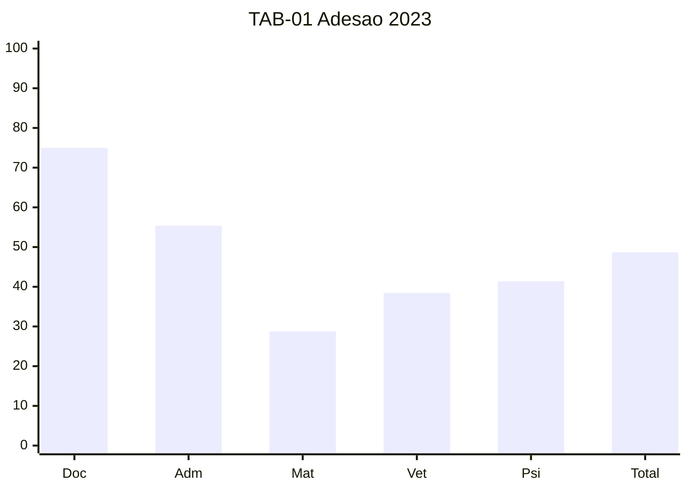
```mermaid
xychart-beta
    title "TAB-01 Adesao 2023"
    x-axis [Doc, Adm, Mat, Vet, Psi, Total]
    y-axis 0 --> 100
    bar [75.00, 55.37, 28.77, 38.46, 41.40, 48.67]
```

### TAB-02. Tabela 2, Processo pelos Estudantes (p. 11)

Q1 4,32 (54,98/24,64/12,8/3,32/1,42/2,84); Q2 3,90 (35,55/18,48/13,74/4,27/7,11/20,85); Q3 4,25 (51,18/25,12/15,64/2,84/1,9/3,32).

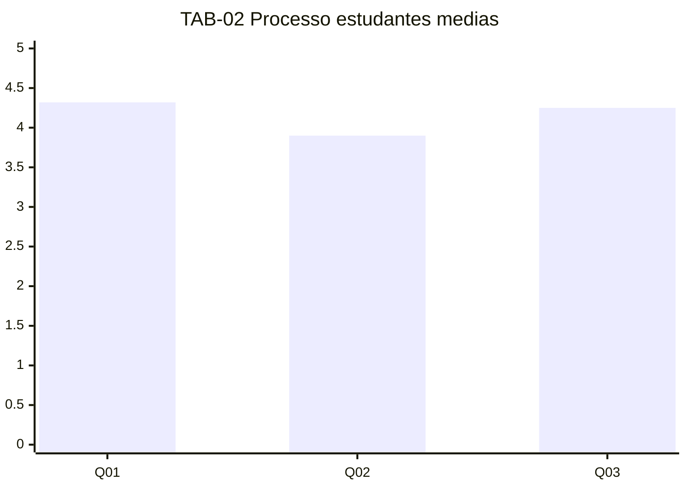
```mermaid
xychart-beta
    title "TAB-02 Processo estudantes medias"
    x-axis [Q01, Q02, Q03]
    y-axis 0 --> 5
    bar [4.32, 3.90, 4.25]
```

### TAB-03. Tabela 3, Processo pelos servidores (p. 12)

Q1 4,39 (66,67/11,11/16,67/5,56/0/0); Q2 4,72 (77,78/16,67/5,56/0/0/0); Q3 4,39 (61,11/22,22/11,11/5,56/0/0).

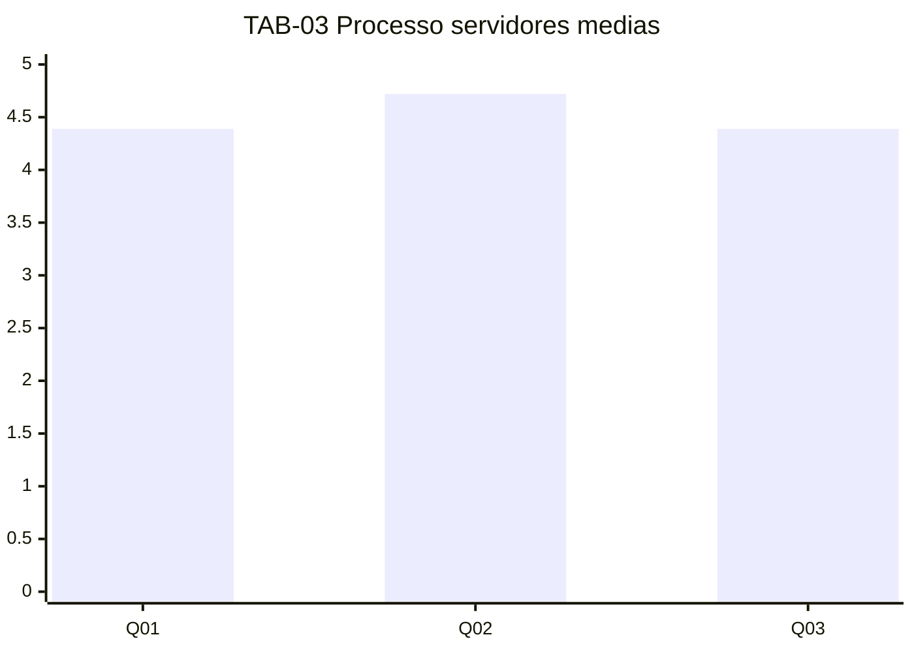
```mermaid
xychart-beta
    title "TAB-03 Processo servidores medias"
    x-axis [Q01, Q02, Q03]
    y-axis 0 --> 5
    bar [4.39, 4.72, 4.39]
```

### TAB-04. Tabela 4, Auxílios em 2022 (p. 13)

Ordem Adm, Psico, Mat, Med Vet. Permanência 4/36/8/3 = 51; emergencial 0/1/0/1 = 2; moradia 0/27/1/0 = 28; alimentação 4/19/7/4 = 34; creche 1/0/1/0 = 2; PCD 1/3/0/0 = 4; PIBIC/PIBITI 0/2/0/1 = 3; extensão 1/7/0/0 = 8; monitoria 0/0/0/0 = 0. Sem mermaid (contagens por curso).

### TAB-05. Tabela 5, Desenvolvimento pelos Estudantes (p. 14)

Q1 4,18 (45,02/27,49/14,69/5,21/0,95/6,63); Q2 3,93 (34,6/28,91/20,38/7,58/1,9/6,63); Q3 4,12 (4,08/27,01/18,48/4,74/1,42/4,24; defeito com 4,08 na coluna 5).

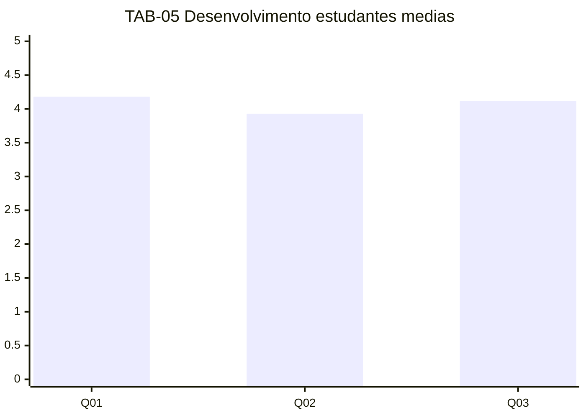
```mermaid
xychart-beta
    title "TAB-05 Desenvolvimento estudantes medias"
    x-axis [Q01, Q02, Q03]
    y-axis 0 --> 5
    bar [4.18, 3.93, 4.12]
```

### TAB-06. Tabela 6, Desenvolvimento pelos servidores (p. 14)

Q1 4,35 (44,44/38,89/11,11/0/0/5,56); Q2 4,44 (55,56/33,33/11,11/0/0/0); Q3 4,17 (38,89/38,89/22,22/0/0/0); Q4 3,94 (33,33/33,33/27,78/5,56/0/0).

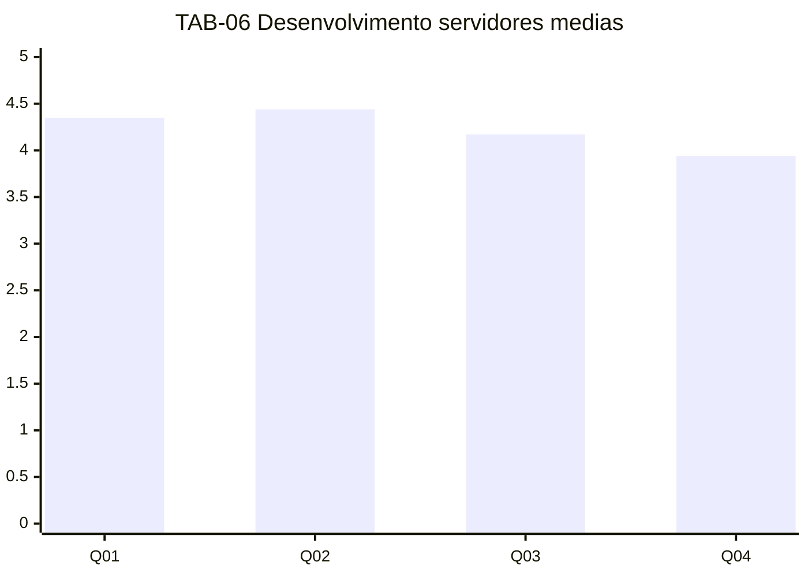
```mermaid
xychart-beta
    title "TAB-06 Desenvolvimento servidores medias"
    x-axis [Q01, Q02, Q03, Q04]
    y-axis 0 --> 5
    bar [4.35, 4.44, 4.17, 3.94]
```

### TAB-07. Tabela 7, Capacitação pelos professores, coordenadores e diretor (p. 15)

Q1 5,00 (100); Q2 5,00 (100). Unanimidade.

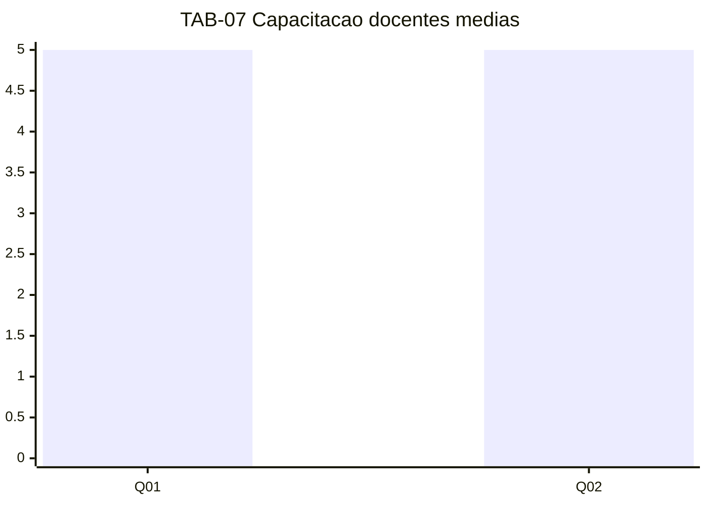
```mermaid
xychart-beta
    title "TAB-07 Capacitacao docentes medias"
    x-axis [Q01, Q02]
    y-axis 0 --> 5
    bar [5.00, 5.00]
```

### TAB-08. Tabela 8, Capacitação pelos técnicos (p. 15)

Q1 3,33 (27,78/22,22/22,22/11,1/16,67/0); Q2 3,41 (22,22/27,78/16,67/22,22/5,56/5,56).

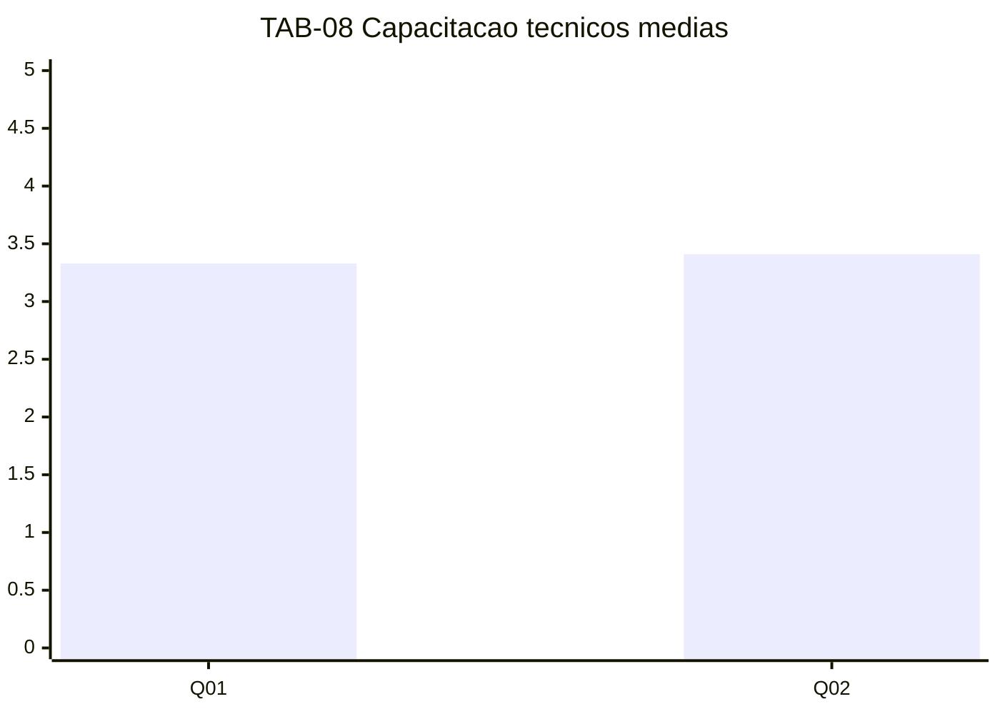
```mermaid
xychart-beta
    title "TAB-08 Capacitacao tecnicos medias"
    x-axis [Q01, Q02]
    y-axis 0 --> 5
    bar [3.33, 3.41]
```

### TAB-09. Tabela 9, Autoavaliação Professores, coordenadores e diretor (p. 16)

Q1 4,71 (79,11/12,5/8,33/0/0/0); Q2 4,88 (87,5/12,5/0/0/0/0); Q3 4,46 (50,00/45,83/4,17/0/0/0); Q4 4,83 (83,33/16,67/0/0/0/0); Q5 4,96 (95,83/4,17/0/0/0/0); Q6 4,92 (91,67/8,33/0/0/0/0). Defeito: texto com variação de 4,59 a 5 ante o intervalo real 4,46 a 4,96.

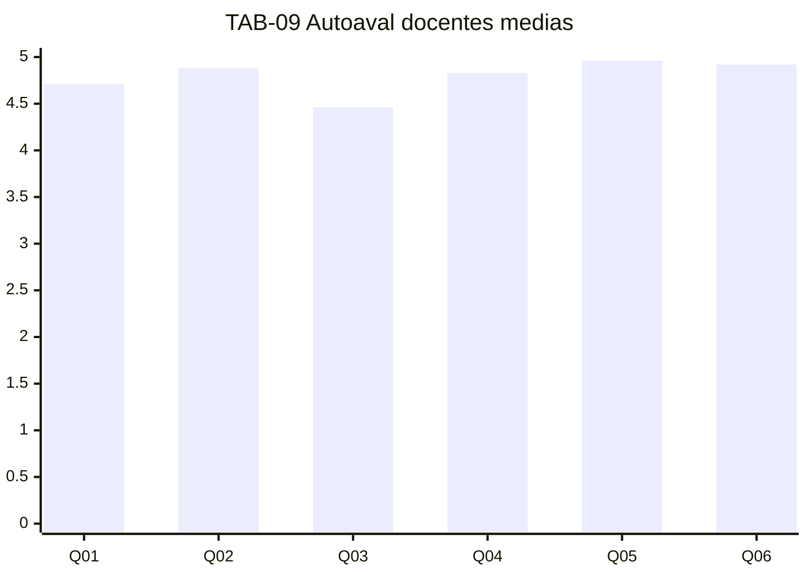
```mermaid
xychart-beta
    title "TAB-09 Autoaval docentes medias"
    x-axis [Q01, Q02, Q03, Q04, Q05, Q06]
    y-axis 0 --> 5
    bar [4.71, 4.88, 4.46, 4.83, 4.96, 4.92]
```

### TAB-10. Tabela 10, Autoavaliação técnico-administrativos (p. 17)

Q1 4,83 (83,33/16,67/0/0/0/0); Q2 5,00 (100); Q3 4,56 (61,11/33,33/5,56/0/0/0); Q4 4,89 (88,89/11,11/0/0/0/0); Q5 4,89 (88389/11,11/0/0/0/0; defeito com 88389 impresso).

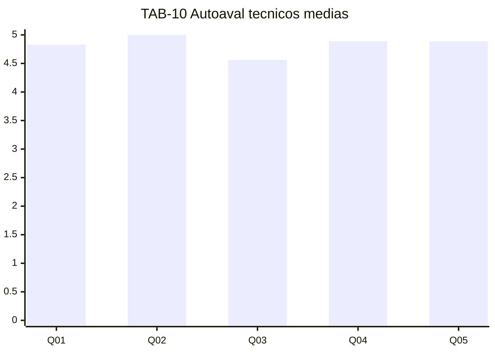
```mermaid
xychart-beta
    title "TAB-10 Autoaval tecnicos medias"
    x-axis [Q01, Q02, Q03, Q04, Q05]
    y-axis 0 --> 5
    bar [4.83, 5.00, 4.56, 4.89, 4.89]
```

### TAB-11. Tabela 11, Ensino pelos professores, coordenadores e diretor (p. 18)

Q1 4,61; Q2 4,48; Q3 4,52; Q4 4,59; Q5 4,76; Q6 3,11; Q7 3,82; Q8 4,10; Q9 3,96; Q10 3,79 (percentuais na seção 2).

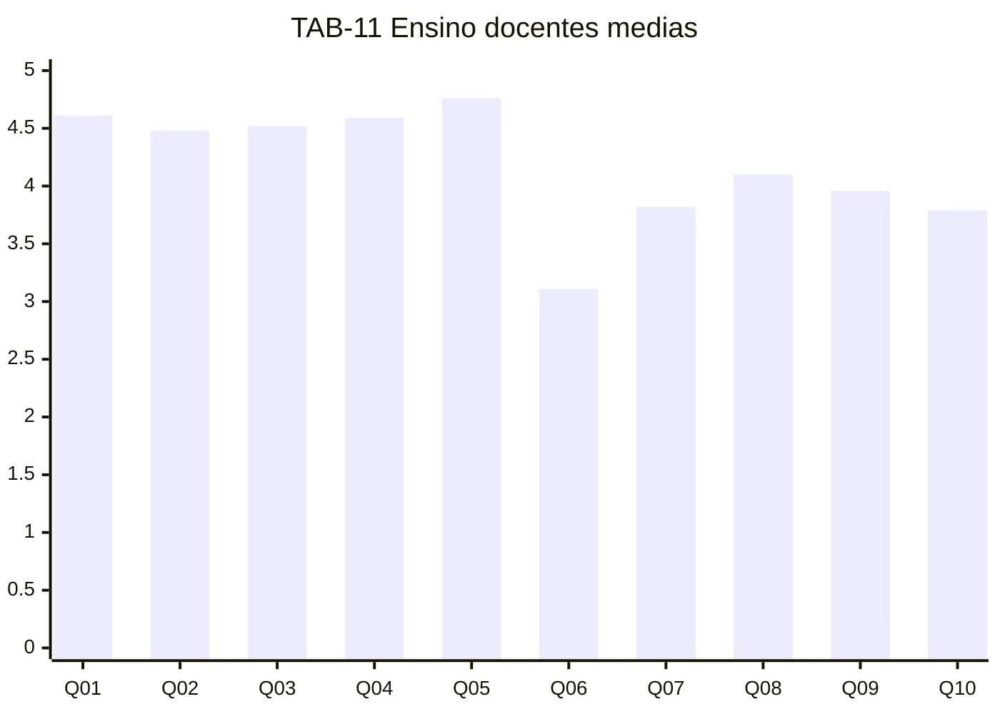
```mermaid
xychart-beta
    title "TAB-11 Ensino docentes medias"
    x-axis [Q01, Q02, Q03, Q04, Q05, Q06, Q07, Q08, Q09, Q10]
    y-axis 0 --> 5
    bar [4.61, 4.48, 4.52, 4.59, 4.76, 3.11, 3.82, 4.10, 3.96, 3.79]
```

### TAB-12. Tabela 12, Ensino pelos técnicos (p. 19)

Q1 4,61; Q2 4,29; Q3 3,24; Q4 3,46; Q5 3,81; Q6 3,94; Q7 3,89 (percentuais na seção 2).

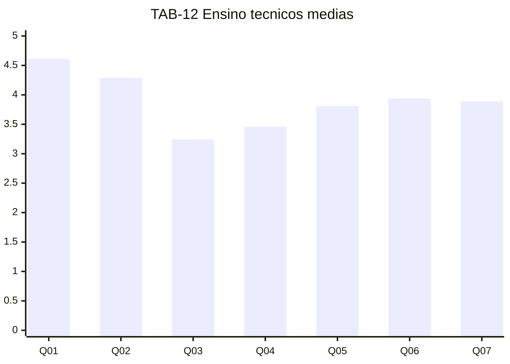
```mermaid
xychart-beta
    title "TAB-12 Ensino tecnicos medias"
    x-axis [Q01, Q02, Q03, Q04, Q05, Q06, Q07]
    y-axis 0 --> 5
    bar [4.61, 4.29, 3.24, 3.46, 3.81, 3.94, 3.89]
```

### TAB-13. Tabela 13, Egressos pelo diretor e coordenadores (p. 20)

Q1 4,25 (40/20/20/0/0/20); Q2 4,00 (20/40/20/0/0/20); Q3 3,25 (20/0/40/20/0/20).

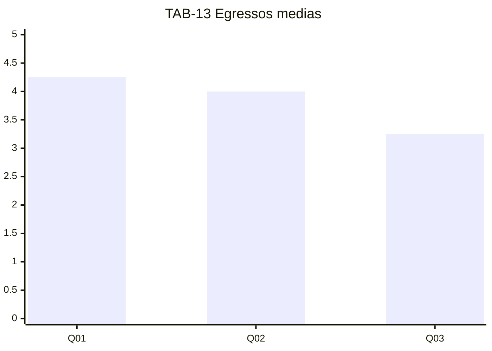
```mermaid
xychart-beta
    title "TAB-13 Egressos medias"
    x-axis [Q01, Q02, Q03]
    y-axis 0 --> 5
    bar [4.25, 4.00, 3.25]
```

### TAB-14. Tabela 14, Atendimento pelos professores (p. 20)

Q1 4,39 (50,00/33,33/12,50/0/0/4,17); Q2 4,00 (33,33/37,50/12,50/4,17/4,17/8,33).

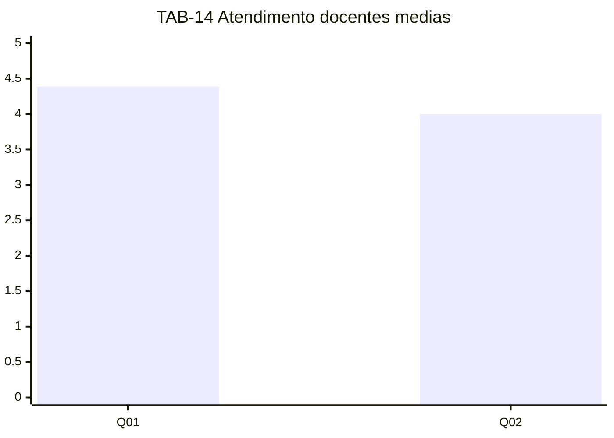
```mermaid
xychart-beta
    title "TAB-14 Atendimento docentes medias"
    x-axis [Q01, Q02]
    y-axis 0 --> 5
    bar [4.39, 4.00]
```

### TAB-15. Tabela 15, Atendimento pelos técnicos (p. 21)

Q1 4,56 (61,11/33,33/5,56/0/0/0); Q2 3,06 (11,11/22,22/33,33/27,78/5,56/0); Q3 3,24 (11,11/27,78/33,33/16,67/5,56/5,56).

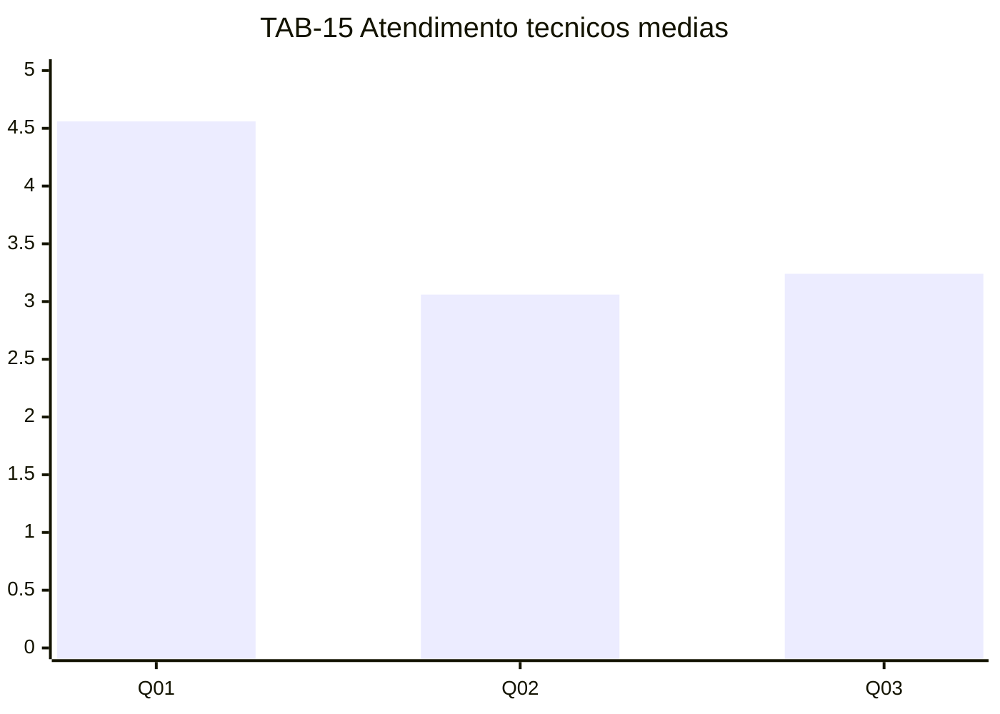
```mermaid
xychart-beta
    title "TAB-15 Atendimento tecnicos medias"
    x-axis [Q01, Q02, Q03]
    y-axis 0 --> 5
    bar [4.56, 3.06, 3.24]
```

### TAB-16. Tabela 16, Comunicação pelos servidores (p. 21)

Q1 4,33 (48,94/31,91/12,77/2,13/0/4,26); Q2 4,45 (44,68/14,89/8,51/2,13/0/29,79).

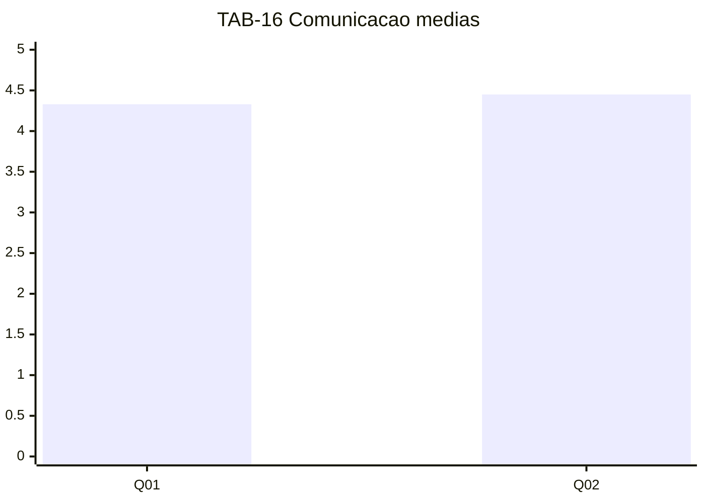
```mermaid
xychart-beta
    title "TAB-16 Comunicacao medias"
    x-axis [Q01, Q02]
    y-axis 0 --> 5
    bar [4.33, 4.45]
```

### TAB-17. Tabela 17, Infraestrutura pela comunidade (p. 22 a 23)

Salas de aula 3,46; Professores 4,17; Administrativas 3,96; Auditórios 3,34; Sanitárias 3,48; Informática 4,05; Internet 3,24; AVA 4,35; E-mail 4,43; Práticas 3,38; Convivência 3,38; Esportivos 1,70; Alimentação 2,53; Biblioteca 4,36; Acervo 4,06; Segurança 3,66; Iluminação 3,35; Acessibilidade 3,55; Limpeza 4,00; Parada 3,67; Estacionamento 3,84; Bicicletário 3,62; Vias 3,75; Transporte 2,61; Telefonia 3,38; SISCAD 4,32; SIGPOS 4,11; Secretaria 4,37 (percentuais na seção 2). Defeito: texto com parada 3,46 ante 3,67 da tabela.

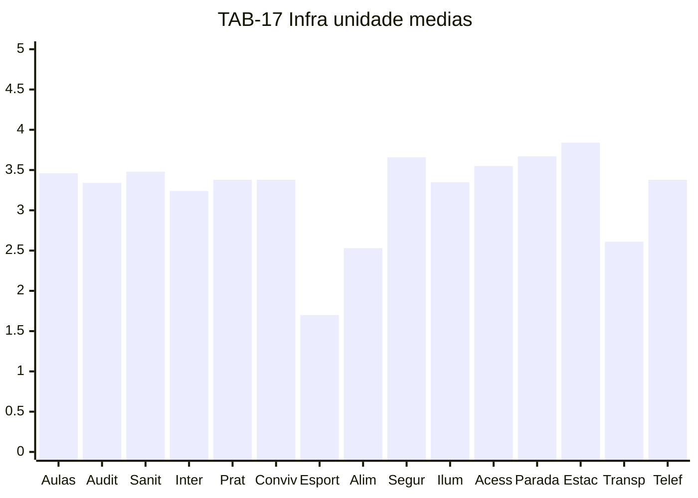
```mermaid
xychart-beta
    title "TAB-17 Infra unidade medias"
    x-axis [Aulas, Audit, Sanit, Inter, Prat, Conviv, Esport, Alim, Segur, Ilum, Acess, Parada, Estac, Transp, Telef]
    y-axis 0 --> 5
    bar [3.46, 3.34, 3.48, 3.24, 3.38, 3.38, 1.70, 2.53, 3.66, 3.35, 3.55, 3.67, 3.84, 2.61, 3.38]
```

### TAB-18. Tabela 18, Imagem geral pelos Estudantes (p. 23)

Q1 3,83 (22,22/44,44/27,78/5,56/0/0); Q2 4,50 (55,56/38,89/5,56/0/0/0). Defeito: texto com servidores em contexto de estudantes.

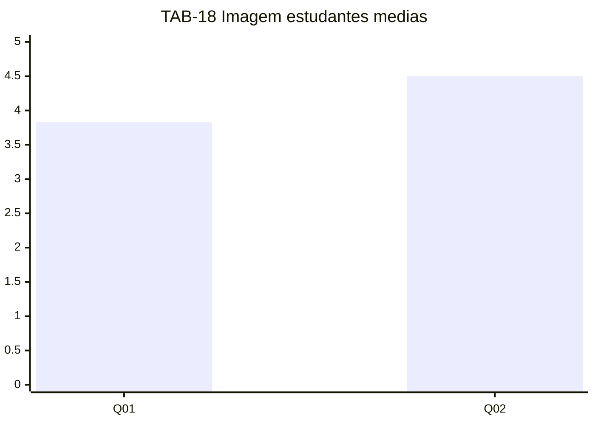
```mermaid
xychart-beta
    title "TAB-18 Imagem estudantes medias"
    x-axis [Q01, Q02]
    y-axis 0 --> 5
    bar [3.83, 4.50]
```

### TAB-19. Tabela 19, Imagem geral pelos Servidores (p. 24)

Q1 3,67 (33,33/0/66,67/0/0/0); Q2 4,00 (33,33/33,33/33,33/0/0/0).

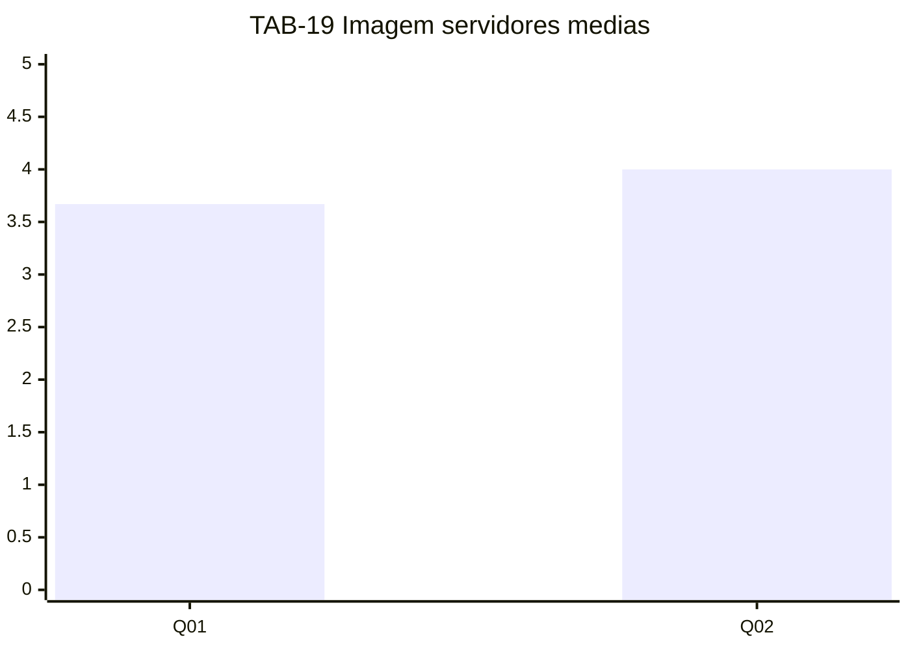
```mermaid
xychart-beta
    title "TAB-19 Imagem servidores medias"
    x-axis [Q01, Q02]
    y-axis 0 --> 5
    bar [3.67, 4.00]
```

### TAB-20. Tabela 20, Coordenação pelo coordenador, Administração (p. 35)

Q1 a Q6 5,00 (100).

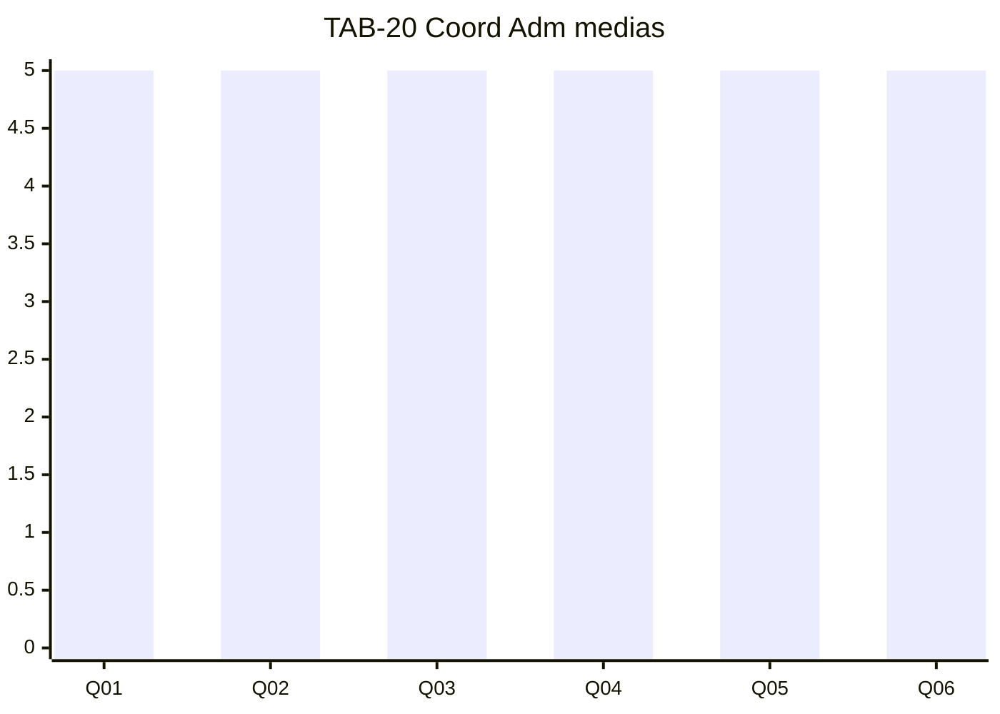
```mermaid
xychart-beta
    title "TAB-20 Coord Adm medias"
    x-axis [Q01, Q02, Q03, Q04, Q05, Q06]
    y-axis 0 --> 5
    bar [5.00, 5.00, 5.00, 5.00, 5.00, 5.00]
```

### TAB-21. Tabela 21, Coordenação pelos estudantes, Administração (p. 36)

Q1 4,55 (62,56/18,01/8,06/1,42/0,47/9,48); Q2 4,46 (62,56/22,27/10,90/2,37/0,47/1,42); Q3 4,66 (74,41/15,64/5,69/1,42/0,47/2,37); Q4 4,36 (52,13/17,54/9,95/3,79/1,42/15,17).

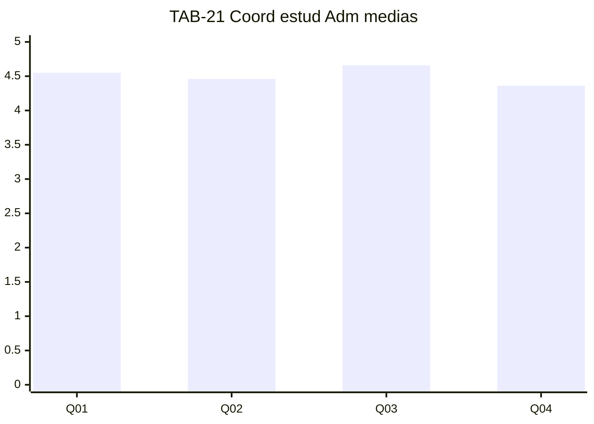
```mermaid
xychart-beta
    title "TAB-21 Coord estud Adm medias"
    x-axis [Q01, Q02, Q03, Q04]
    y-axis 0 --> 5
    bar [4.55, 4.46, 4.66, 4.36]
```

### TAB-22. Tabela 22, Disciplinas e professores, Administração (p. 37)

Q1 4,50; Q2 4,41; Q3 4,45; Q4 4,55; Q5 4,48; Q6 4,71; Q7 4,78; Q8 4,69 (percentuais na seção 3).

```mermaid
xychart-beta
    title "TAB-22 Disciplinas Adm medias"
    x-axis [Q01, Q02, Q03, Q04, Q05, Q06, Q07, Q08]
    y-axis 0 --> 5
    bar [4.50, 4.41, 4.45, 4.55, 4.48, 4.71, 4.78, 4.69]
```

### TAB-23. Tabela 23, Professores quanto ao próprio desempenho, Administração (p. 38)

Q1 4,82; Q2 5,00; Q3 4,93; Q4 5,00; Q5 5,00; Q6 5,00; Q7 4,82; Q8 5,00 (percentuais na seção 3). Defeito: enunciado com Q1 a Q6, tabela com 8 linhas.

```mermaid
xychart-beta
    title "TAB-23 Desempenho docente Adm medias"
    x-axis [Q01, Q02, Q03, Q04, Q05, Q06, Q07, Q08]
    y-axis 0 --> 5
    bar [4.82, 5.00, 4.93, 5.00, 5.00, 5.00, 4.82, 5.00]
```

### TAB-24. Tabela 24, Desempenho próprio, Administração (p. 39)

Q1 4,29; Q2 4,33; Q3 4,43; Q4 4,20; Q5 4,30; Q6 4,84 (percentuais na seção 3).

```mermaid
xychart-beta
    title "TAB-24 Desempenho proprio Adm medias"
    x-axis [Q01, Q02, Q03, Q04, Q05, Q06]
    y-axis 0 --> 5
    bar [4.29, 4.33, 4.43, 4.20, 4.30, 4.84]
```

### TAB-25. Tabela 25, Demais atividades, Administração (p. 39)

Q1 3,73; Q2 3,67; Q3 3,68; Q4 4,59; Q5 4,18 (percentuais na seção 3). Defeito: texto repete o enunciado de contribuição no segundo e no terceiro item.

```mermaid
xychart-beta
    title "TAB-25 Demais atividades Adm medias"
    x-axis [Q01, Q02, Q03, Q04, Q05]
    y-axis 0 --> 5
    bar [3.73, 3.67, 3.68, 4.59, 4.18]
```

### TAB-26. Tabela 26, Desempenho pelos professores, Administração (p. 40)

Q1 4,57; Q2 4,36; Q3 4,39; Q4 4,79; Q5 4,46 (percentuais na seção 3).

```mermaid
xychart-beta
    title "TAB-26 Desempenho docente Adm medias"
    x-axis [Q01, Q02, Q03, Q04, Q05]
    y-axis 0 --> 5
    bar [4.57, 4.36, 4.39, 4.79, 4.46]
```

### TAB-27. Tabela 27, Infraestrutura do curso, Administração (p. 41)

Informática 4,14; Internet 3,16; AVA 4,37; Práticas 3,81; Biblioteca 4,45; Acervo 4,09 (percentuais na seção 3).

```mermaid
xychart-beta
    title "TAB-27 Infra Adm medias"
    x-axis [Info, Net, AVA, Prat, Bib, Acervo]
    y-axis 0 --> 5
    bar [4.14, 3.16, 4.37, 3.81, 4.45, 4.09]
```

### TAB-28. Tabela 28, Coordenação pelo coordenador, Matemática (p. 46)

Q1 3,00 (0/0/100/0/0/0); Q2 4,00 (0/100/0/0/0/0); Q3 3,00 (0/0/100/0/0/0); Q4 a Q6 5,00 (100).

```mermaid
xychart-beta
    title "TAB-28 Coord Mat medias"
    x-axis [Q01, Q02, Q03, Q04, Q05, Q06]
    y-axis 0 --> 5
    bar [3.00, 4.00, 3.00, 5.00, 5.00, 5.00]
```

### TAB-29. Tabela 29, Coordenação pelos estudantes, Matemática (p. 47)

Q1 4,63 (61,90/23,81/4,76/0/0/9,52); Q2 4,63 (66,67/14,29/9,52/0/0/9,52); Q3 4,47 (66,67/9,52/9,52/0/4,76/9,52); Q4 4,40 (38,10/23,81/9,52/0/0/28,57).

```mermaid
xychart-beta
    title "TAB-29 Coord estud Mat medias"
    x-axis [Q01, Q02, Q03, Q04]
    y-axis 0 --> 5
    bar [4.63, 4.63, 4.47, 4.40]
```

### TAB-30. Tabela 30, Disciplinas e professores, Matemática (p. 48)

Q1 4,85; Q2 4,81; Q3 4,78; Q4 4,74; Q5 4,78; Q6 4,81; Q7 4,85; Q8 4,96 (percentuais na seção 4).

```mermaid
xychart-beta
    title "TAB-30 Disciplinas Mat medias"
    x-axis [Q01, Q02, Q03, Q04, Q05, Q06, Q07, Q08]
    y-axis 0 --> 5
    bar [4.85, 4.81, 4.78, 4.74, 4.78, 4.81, 4.85, 4.96]
```

### TAB-31. Tabela 31, Professores quanto ao próprio desempenho, Matemática (p. 48 a 49)

Q1 4,64 (63,64/36,36/0/0/0/0); Q2 5,00 (100); Q3 5,00 (100); Q4 5,00 (100); Q5 5,00 (100); Q6 5,00 (100); Q7 4,64 (63,64/36,36/0/0/0/0); Q8 5,00 (100). Defeito: enunciado com Q1 a Q6, tabela com 8 linhas.

```mermaid
xychart-beta
    title "TAB-31 Desempenho docente Mat medias"
    x-axis [Q01, Q02, Q03, Q04, Q05, Q06, Q07, Q08]
    y-axis 0 --> 5
    bar [4.64, 5.00, 5.00, 5.00, 5.00, 5.00, 4.64, 5.00]
```

### TAB-32. Tabela 32, Desempenho próprio, Matemática (p. 49)

Q1 4,70 (88,89/0/3,70/7,41/0/0); Q2 4,74 (88,89/3,70/0/7,41/0/0); Q3 4,85 (92,59/0/7,41/0/0/0); Q4 4,85 (85,19/14,81/0/0/0/0); Q5 4,70 (88,89/0/3,70/7,41/0/0); Q6 5,00 (100).

```mermaid
xychart-beta
    title "TAB-32 Desempenho proprio Mat medias"
    x-axis [Q01, Q02, Q03, Q04, Q05, Q06]
    y-axis 0 --> 5
    bar [4.70, 4.74, 4.85, 4.85, 4.70, 5.00]
```

### TAB-33. Tabela 33, Demais atividades, Matemática (p. 50)

Q1 3,70; Q2 3,65; Q3 3,62; Q4 4,67; Q5 4,48 (percentuais na seção 4).

```mermaid
xychart-beta
    title "TAB-33 Demais atividades Mat medias"
    x-axis [Q01, Q02, Q03, Q04, Q05]
    y-axis 0 --> 5
    bar [3.70, 3.65, 3.62, 4.67, 4.48]
```

### TAB-34. Tabela 34, Desempenho pelos professores, Matemática (p. 50 a 51)

Q1 4,36 (36,36/63,64/0/0/0/0); Q2 4,09 (27,27/54,55/18,18/0/0/0); Q3 4,45 (45,45/54,55/0/0/0/0); Q4 5,00 (100); Q5 4,00 (0/100/0/0/0/0).

```mermaid
xychart-beta
    title "TAB-34 Desempenho docente Mat medias"
    x-axis [Q01, Q02, Q03, Q04, Q05]
    y-axis 0 --> 5
    bar [4.36, 4.09, 4.45, 5.00, 4.00]
```

### TAB-35. Tabela 35, Infraestrutura do curso, Matemática (p. 51)

Informática 4,10; Internet 3,89; AVA 4,05; Práticas 3,79; Biblioteca 4,38; Acervo 4,33 (percentuais na seção 4).

```mermaid
xychart-beta
    title "TAB-35 Infra Mat medias"
    x-axis [Info, Net, AVA, Prat, Bib, Acervo]
    y-axis 0 --> 5
    bar [4.10, 3.89, 4.05, 3.79, 4.38, 4.33]
```

### TAB-36. Tabela 36, Coordenação pelo coordenador, Medicina Veterinária (p. 57)

Q1 a Q6 5,00, com percentuais Q1 (100,00/25,00/0/0/0/0), Q2 (100,00/25,00/0/0/0/0), Q3 (100,00/0/25,00/0/0/0), Q4 a Q6 (100/0/0/0/0/0). Defeito: percentuais somam mais de 100 por cento.

```mermaid
xychart-beta
    title "TAB-36 Coord Vet medias"
    x-axis [Q01, Q02, Q03, Q04, Q05, Q06]
    y-axis 0 --> 5
    bar [5.00, 5.00, 5.00, 5.00, 5.00, 5.00]
```

### TAB-37. Tabela 37, Coordenação pelos estudantes, Medicina Veterinária (p. 58)

Q1 4,69 (73,33/0/13,33/0/0/0); Q2 4,07 (40,00/33,33/20,00/6,67/0/0); Q3 4,73 (73,33/26,67/0/0/0/0); Q4 4,00 (53,33/13,33/6,67/13,3/6,67/0). Defeito: percentuais somam menos de 100 por cento (Q1 com 86,66).

```mermaid
xychart-beta
    title "TAB-37 Coord estud Vet medias"
    x-axis [Q01, Q02, Q03, Q04]
    y-axis 0 --> 5
    bar [4.69, 4.07, 4.73, 4.00]
```

### TAB-38. Tabela 38, Disciplinas e professores, Medicina Veterinária (p. 59)

Q1 4,67 (77,78/11,11/11,11/0/0/0); Q2 5,00 (100,0/0/0/0/0/0); Q3 4,89 (88,89/11,11/0/0/0/0); Q4 5,00 (100,0/0/0/0/0/0); Q5 5,00 (100,0/0/0/0/0/0); Q6 5,00 (100,0/0/0/0/0/0); Q7 5,00 (100,0/0/0/0/0/0); Q8 4,50 (50,00/50,00/0/0/0/0).

```mermaid
xychart-beta
    title "TAB-38 Disciplinas Vet medias"
    x-axis [Q01, Q02, Q03, Q04, Q05, Q06, Q07, Q08]
    y-axis 0 --> 5
    bar [4.67, 5.00, 4.89, 5.00, 5.00, 5.00, 5.00, 4.50]
```

### TAB-39. Tabela 39, Professores quanto ao próprio desempenho, Medicina Veterinária (p. 59 a 60)

Q1 4,75 (75,00/25,00/0/0/0/0); Q2 5,00 (100,0/0/0/0/0/0); Q3 4,25 (25,00/75,00/0/0/0/0); Q4 5,00 (100,0/0/0/0/0/0); Q5 5,00 (100,0/0/0/0/0/0); Q6 5,00 (100,0/0/0/0/0/0).

```mermaid
xychart-beta
    title "TAB-39 Desempenho docente Vet medias"
    x-axis [Q01, Q02, Q03, Q04, Q05, Q06]
    y-axis 0 --> 5
    bar [4.75, 5.00, 4.25, 5.00, 5.00, 5.00]
```

### TAB-40. Tabela 40, Desempenho próprio, Medicina Veterinária (p. 60)

Q1 5,00 (100); Q2 4,50 (50/50/0/0/0/0); Q3 4,50 (50/50/0/0/0/0); Q4 4,00 (0/100/0/0/0/0); Q5 5,00 (100); Q6 5,00 (100).

```mermaid
xychart-beta
    title "TAB-40 Desempenho proprio Vet medias"
    x-axis [Q01, Q02, Q03, Q04, Q05, Q06]
    y-axis 0 --> 5
    bar [5.00, 4.50, 4.50, 4.00, 5.00, 5.00]
```

### TAB-41. Tabela 41, Demais atividades, Medicina Veterinária (p. 61)

Q1 3,87 (26,67/46,67/13,33/13,33/0/0); Q2 3,47 (13,33/26,67/53,33/6,67/0/0); Q3 4,13 (33,33/46,67/20/0/0/0); Q4 4,67 (73,33/20/6,67/0/0/0); Q5 4,53 (60,00/33,33/6,67/0/0/0).

```mermaid
xychart-beta
    title "TAB-41 Demais atividades Vet medias"
    x-axis [Q01, Q02, Q03, Q04, Q05]
    y-axis 0 --> 5
    bar [3.87, 3.47, 4.13, 4.67, 4.53]
```

### TAB-42. Tabela 42, Desempenho pelos professores, Medicina Veterinária (p. 61)

Q1 4,25 (25/75/0/0/0/0); Q2 3,25 (25/0/50/25,0/0/0); Q3 3,50 (25/0/75/0/0/0); Q4 4,50 (50/50/0/0/0/0%); Q5 2,75 (0%/0%/75,00/25,0/0/0).

```mermaid
xychart-beta
    title "TAB-42 Desempenho docente Vet medias"
    x-axis [Q01, Q02, Q03, Q04, Q05]
    y-axis 0 --> 5
    bar [4.25, 3.25, 3.50, 4.50, 2.75]
```

### TAB-43. Tabela 43, Infraestrutura do curso, Medicina Veterinária (p. 62)

Informática 4,15 (46,67/20,0/6,67/13,33/0/13,33); Internet 3,80 (26,67/46,67/13,33/6,67/6,67/0,0); AVA 4,09 (40,00/13,33/13,33/0/6,67/26,67); Práticas 2,67 (13,33/20,00/20,00/13,33/33,33/0,0); Biblioteca 4,27 (46,67/33,33/20,00/0/0/0); Acervo 3,40 (33,33/26,67/6,67/13,33/20,00/0).

```mermaid
xychart-beta
    title "TAB-43 Infra Vet medias"
    x-axis [Info, Net, AVA, Prat, Bib, Acervo]
    y-axis 0 --> 5
    bar [4.15, 3.80, 4.09, 2.67, 4.27, 3.40]
```

### TAB-44. Tabela 44, Coordenação pelo coordenador, Psicologia (p. 66)

Q1 4,00 (0/100/0/0/0/0); Q2 a Q6 5,00 (100). Defeito: texto remete à Tabela 43 onde o contexto é a Tabela 44.

```mermaid
xychart-beta
    title "TAB-44 Coord Psi medias"
    x-axis [Q01, Q02, Q03, Q04, Q05, Q06]
    y-axis 0 --> 5
    bar [4.00, 5.00, 5.00, 5.00, 5.00, 5.00]
```

### TAB-45. Tabela 45, Coordenação pelos estudantes, Psicologia (p. 67)

Q1 4,54 (58,44/20,78/5,19/1,30/1,30/12,99); Q2 4,36 (58,44/22,08/16,88/2,60/0/0); Q3 4,76 (77,92/14,29/2,60/1,30/0/3,90); Q4 4,50 (57,14/19,48/5,19/2,60/1,30/14,29). Defeito: texto remete à Tabela 44 onde o contexto é a Tabela 45; texto da Tabela 46 remete à Tabela 45.

```mermaid
xychart-beta
    title "TAB-45 Coord estud Psi medias"
    x-axis [Q01, Q02, Q03, Q04]
    y-axis 0 --> 5
    bar [4.54, 4.36, 4.76, 4.50]
```

### TAB-46. Tabela 46, Disciplinas e professores, Psicologia (p. 68)

Q1 4,43 (67,91/12,69/10,45/4,48/2,24/2,24); Q2 4,52 (69,40/13,43/6,72/2,24/2,99/5,22); Q3 4,46 (70,15/11,19/8,96/3,73/2,99/2,99); Q4 4,62 (76,87/10,45/6,72/1,49/2,24/2,24); Q5 4,42 (70,90/11,19/7,46/5,22/3,73/1,49); Q6 4,75 (83,58/5,97/5,22/0,75/1,49/2,99); Q7 4,88 (78,36/3,73/1,49/0/0,75/15,67); Q8 4,73 (85,82/4,48/5,22/0,75/2,24/1,49).

```mermaid
xychart-beta
    title "TAB-46 Disciplinas Psi medias"
    x-axis [Q01, Q02, Q03, Q04, Q05, Q06, Q07, Q08]
    y-axis 0 --> 5
    bar [4.43, 4.52, 4.46, 4.62, 4.42, 4.75, 4.88, 4.73]
```

### TAB-47. Tabela 47, Professores quanto ao próprio desempenho, Psicologia (p. 69)

Q1 a Q6 5,00 (100). Defeito: texto remete à Tabela 46 onde o contexto é a Tabela 47.

```mermaid
xychart-beta
    title "TAB-47 Desempenho docente Psi medias"
    x-axis [Q01, Q02, Q03, Q04, Q05, Q06]
    y-axis 0 --> 5
    bar [5.00, 5.00, 5.00, 5.00, 5.00, 5.00]
```

### TAB-48. Tabela 48, Desempenho próprio, Psicologia (p. 70)

Q1 4,57 (73,13/9,70/11,94/0,75/1,49/2,99); Q2 4,46 (65,67/19,40/10,45/1,49/2,24/0,75); Q3 4,70 (74,63/20,90/1,49/0/1,49/1,49); Q4 4,39 (58,96/23,13/12,69/0,75/2,24/2,24); Q5 4,69 (71,64/18,66/2,24/0/1,49/5,97); Q6 4,86 (91,79/1,49/3,73/0,75/0,75/1,49). Defeito: texto remete à Tabela 47 onde o contexto é a Tabela 48.

```mermaid
xychart-beta
    title "TAB-48 Desempenho proprio Psi medias"
    x-axis [Q01, Q02, Q03, Q04, Q05, Q06]
    y-axis 0 --> 5
    bar [4.57, 4.46, 4.70, 4.39, 4.69, 4.86]
```

### TAB-49. Tabela 49, Demais atividades, Psicologia (p. 70 a 71)

Q1 4,17 (41,56/35,06/20,78/0/1,30/1,30); Q2 3,86 (31,17/33,77/19,48/2,60/6,49/6,49); Q3 4,00 (35,06/38,96/16,88/5,19/2,60/1,30); Q4 4,81 (81,82/16,88/1,30/0/0/0); Q5 4,32 (61,04/19,48/12,99/3,90/2,60/0).

```mermaid
xychart-beta
    title "TAB-49 Demais atividades Psi medias"
    x-axis [Q01, Q02, Q03, Q04, Q05]
    y-axis 0 --> 5
    bar [4.17, 3.86, 4.00, 4.81, 4.32]
```

### TAB-50. Tabela 50, Desempenho pelos professores, Psicologia (p. 71)

Q1 5,00 (100); Q2 4,82 (81,82/18,18/0/0/0/0); Q3 4,73 (72,73/27,27/0/0/0/0); Q4 5,00 (100); Q5 5,00 (100).

```mermaid
xychart-beta
    title "TAB-50 Desempenho docente Psi medias"
    x-axis [Q01, Q02, Q03, Q04, Q05]
    y-axis 0 --> 5
    bar [5.00, 4.82, 4.73, 5.00, 5.00]
```

### TAB-51. Tabela 51, Infraestrutura do curso, Psicologia (p. 72)

Informática 3,97 (41,56/27,27/15,58/6,49/5,19/3,90); Internet 3,04 (23,38/16,88/19,48/20,78/19,48/0); AVA 4,35 (61,04/24,68/6,49/3,90/3,90/0); Práticas 3,08 (15,58/18,18/27,27/6,49/18,18/14,29); Biblioteca 4,25 (51,95/29,87/9,09/5,19/2,60/1,30); Acervo 3,99 (35,06/27,27/23,38/2,60/2,60/9,09).

```mermaid
xychart-beta
    title "TAB-51 Infra Psi medias"
    x-axis [Info, Net, AVA, Prat, Bib, Acervo]
    y-axis 0 --> 5
    bar [3.97, 3.04, 4.35, 3.08, 4.25, 3.99]
```

## 9. Lacunas e defeitos declarados desta conversão

Cobertura integral das 78 páginas por janelas e das 51 tabelas e 11 quadros, sem lacunas de valores: todas as Tabelas 1 a 51 com médias e percentuais transcritos. Tabela 47 de Psicologia capturada na rodada final de conferência (p. 69, Q1 a Q6 em 5,00). Documento sem figuras de gráficos: tabelas como única série quantitativa. Defeitos do original preservados: seção 2.1 com ano 2022 no título da Tabela 1 de 2023; texto com três cursos onde o Quadro 1 confirma quatro; Tabela 4 com 2022 no cabeçalho; Tabela 5 com 4,08 na coluna 5 de Q3; Tabela 9 com variação de 4,59 a 5 ante o intervalo real 4,46 a 4,96; Tabela 10 com 88389; Tabela 17 com parada 3,46 no texto ante 3,67 na tabela; Tabela 18 com servidores no texto em contexto de estudantes; Tabelas 23 e 31 com enunciado de Q1 a Q6 e 8 linhas; Tabela 25 com Q2/Q3 repetidos; Tabelas 36 e 37 com percentuais que não somam 100; Tabela 43 com menção a alimentação 2,27 inexistente; Tabelas 44, 45, 46, 47 e 48 com remissões trocadas ao número anterior; Quadro 8 de Matemática com fragmento por quebra de linha; Quadro 11 de Psicologia com informática 3,87 ante 3,97 da Tabela 51; considerações com alimentação 2,57 ante 2,53 da Tabela 17; balanço com ano 2022 no primeiro parágrafo. Nenhum valor estimado.
