# FONTE PRIMÁRIA ESTRUTURADA — Relatório de Autoavaliação Setorial 2024 do CPAR/UFMS

> **Arquivo fonte**: `Relatorio_de_Autoavaliacao_Setorial_2024.docx`, base de conhecimento (392.685 bytes, extração integral de 4.798 linhas). Conferência pelo viewer do Drive, ID `1gpStnKHQcyIGrrWFndyRNrH01YPab4_j` (visualização permitida, 104 páginas).
> **Documento**: RELATÓRIO DE AUTOAVALIAÇÃO SETORIAL 2024, CPAR/UFMS, Paranaíba MS, Abril de 2026. 104 páginas. Diretora Andreia Cristina Ribeiro. CSA pela Portaria n. 20-CPAR/UFMS, de 16/03/2026 (docentes Raildo Santos de Lima presidente, Ana Luiza Bossolani Martins, Dalton de Sousa, Francisco Rosa, Gabriel Luis Pereira Nolasco, Silvia Maria Bonassi; técnica Crislen Daniele dos Santos Rodrigues da Silva; estudantes Érica Vitória Palhares Supriano e Luzinete do Carmo Oliveira). Funcionamento pela Resolução COUN n. 57 de 13/06/2017.
> **Método de conversão**: extração integral do docx (texto, tabelas numéricas e análises), com conferência de pontos críticos pelo viewer via DOM acessível. Documento sem figuras de gráficos: todas as séries quantitativas são tabelas, sem imagens a traduzir (padrão iniciado em 2022 e mantido em 2024).
> **Data da conversão**: 09 set 2026. **Cobertura**: integral das 104 páginas, 51 tabelas e 11 quadros transcritos pelos títulos, valores e análises.
> **Relação com a série analítica**: este arquivo é a fonte primária estruturada; o arquivo analítico `RSA_2024_CPAR.md` permanece preservado e tem função diferente.
> **Convenção de tabelas**: escala de 5 (Concordo totalmente) a 1 (Discordo totalmente), além de NA, NQR e NSR/NSA. Cada tabela recebe bloco de contexto (número, título verbatim, página, fonte) + linhas por item (Média e percentuais) + texto fiel de análise + diagrama mermaid das médias. Nenhum valor foi estimado. Feedback negativo sempre anonimizado (o original já anonimiza críticas e nomeia apenas elogios, padrão mantido).

## Sumário do documento fonte

1 INTRODUÇÃO (p. 9). 2 PROCESSO DE AVALIAÇÃO INSTITUCIONAL (p. 9): 2.1 O processo na Unidade (Tabela 1); 2.2 Percepção sobre o processo (Tabelas 2 e 3). 3 UNIDADE SETORIAL (p. 14): 3.1 Dados gerais (Quadro 1, Tabela 4, planejamento 2024-2025); 3.2.1 Percepção (desenvolvimento Tabelas 5 e 6; capacitação Tabelas 7 e 8; desempenho Tabelas 9 e 10; ensino Tabelas 11 e 12; atendimento e egressos Tabelas 13 a 15; comunicação Tabela 16; infraestrutura Tabela 17; imagem geral Tabelas 18 e 19; questão aberta geral); 3.3 Gestão e plano de ação (Quadros 2 a 4). 4 AVALIAÇÃO DOS CURSOS (p. 45): 4.1 Administração (Tabelas 20 a 27, Quadros 5 e 6, externas, colegiado, corpo docente); 4.2 Matemática (Tabelas 28 a 35, Quadros 7 e 8, externas, colegiado, corpo docente); 4.3 Medicina Veterinária (Tabelas 36 a 43, Quadro 9, externas, colegiado, corpo docente, 10 docentes); 4.4 Psicologia (Tabelas 44 a 51, Quadros 10 e 11, externas, colegiado, corpo docente). 5 BALANÇO CRÍTICO (p. 99). 6 CONSIDERAÇÕES FINAIS (p. 101). 7 REFERÊNCIAS (p. 103).

## Lista de Tabelas do documento

Tabela 1: Adesão em 2024 (p. 11). Tabela 2: Processo pelos Estudantes (p. 11). Tabela 3: Processo pelos servidores (p. 13). Tabela 4: Auxílios em 2024 (p. 14). Tabela 5: Desenvolvimento pelos Estudantes (p. 16). Tabela 6: Desenvolvimento pelos servidores (p. 17). Tabela 7: Capacitação pelos professores, coordenadores e diretor (p. 19). Tabela 8: Capacitação pelos técnicos (p. 19). Tabela 9: Autoavaliação Professores, coordenadores e diretor (p. 20). Tabela 10: Autoavaliação dos técnico-administrativos no corpo, com título de docentes na lista (p. 21; divergência preservada). Tabela 11: Ensino pelos professores, coordenadores e diretor (p. 22). Tabela 12: Ensino pelos técnicos (p. 23). Tabela 13: Egressos pelo diretor e coordenadores (p. 25; lista com "Tabela 13 13", defeito preservado). Tabela 14: Atendimento pelos professores (p. 25). Tabela 15: Atendimento pelos técnicos (p. 26). Tabela 16: Comunicação pelos servidores (p. 27). Tabela 17: Infraestrutura pela comunidade (p. 27). Tabela 18: Imagem geral pelos Estudantes (p. 29). Tabela 19: Imagem geral pelos Servidores (p. 29). Tabela 20: Coordenação pelo coordenador, Administração (p. 45). Tabela 21: Coordenação pelos estudantes, Administração (p. 46). Tabela 22: Disciplinas e professores, Administração (p. 47). Tabela 23: Professores quanto ao próprio desempenho, Administração (p. 48). Tabela 24: Desempenho próprio, Administração (p. 49). Tabela 25: Demais atividades, Administração (p. 50). Tabela 26: Desempenho pelos professores, Administração (p. 51). Tabela 27: Infraestrutura do curso, Administração (p. 52). Tabela 28: Coordenação pelo coordenador, Matemática (p. 58). Tabela 29: Coordenação pelos estudantes, Matemática (p. 59). Tabela 30: Disciplinas e professores, Matemática (p. 60). Tabela 31: Professores quanto ao próprio desempenho, Matemática (p. 61). Tabela 32: Desempenho próprio, Matemática (p. 63). Tabela 33: Demais atividades, Matemática (p. 64). Tabela 34: Desempenho pelos professores, Matemática (p. 64). Tabela 35: Infraestrutura do curso, Matemática (p. 65). Tabela 36: Coordenação pelo coordenador, Medicina Veterinária (p. 73). Tabela 37: Coordenação pelos estudantes, Medicina Veterinária (p. 74). Tabela 38: Disciplinas e professores, Medicina Veterinária (p. 75). Tabela 39: Professores quanto ao próprio desempenho, Medicina Veterinária (p. 76). Tabela 40: Desempenho próprio, Medicina Veterinária (p. 78). Tabela 41: Demais atividades, Medicina Veterinária (p. 78). Tabela 42: Desempenho pelos professores, Medicina Veterinária (p. 80). Tabela 43: Infraestrutura do curso, Medicina Veterinária (p. 80). Tabela 44: Coordenação pelo coordenador, Psicologia (p. 86). Tabela 45: Coordenação pelos estudantes, Psicologia (p. 87). Tabela 46: Disciplinas e professores, Psicologia (p. 88). Tabela 47: Professores quanto ao próprio desempenho, Psicologia (p. 89). Tabela 48: Desempenho próprio, Psicologia (p. 91). Tabela 49: Demais atividades, Psicologia (p. 91). Tabela 50: Desempenho pelos professores, Psicologia (p. 92). Tabela 51: Infraestrutura do curso, Psicologia (p. 93).

## Lista de Quadros do documento

Quadro 1: Informações sobre a UAS e seus cursos (p. 14). Quadro 2: Ações da direção em 2024 e situação (p. 33). Quadro 3: Fragilidades e oportunidades de 2023 (p. 35; título com 2023, conteúdo e situação com 2024, divergência preservada). Quadro 4: Ações para questões abertas da unidade, com resumo de 85 respostas (p. 42). Quadro 5: Ações da coordenação de Administração para 2024 (p. 54). Quadro 6: Fragilidades e oportunidades de 2024, Administração (p. 55). Quadro 7: Ações da coordenação de Matemática para 2024 (p. 68). Quadro 8: Fragilidades e oportunidades de 2024, Matemática (p. 70; texto introdutório com 2022, defeito preservado). Quadro 9: Fragilidades e oportunidades de 2023, Medicina Veterinária (p. 82; título com 2023). Quadro 10: Ações da coordenação de Psicologia para 2023 (p. 95). Quadro 11: Fragilidades e oportunidades de 2023, Psicologia (p. 96; título com 2023, valores divergentes da Tabela 51, defeito preservado).

---

## 1. Rosto, composição e processo (páginas 1 a 13)

Página 1: capa com Câmpus de Paranaíba, RELATÓRIO DE AUTOAVALIAÇÃO SETORIAL 2024, Paranaíba MS, Abril de 2026 (capa datada de 2026 para ano base 2024, divergência preservada). Página 2: diretora Andreia Cristina Ribeiro; CSA pela Portaria n. 20-CPAR/UFMS de 16/03/2026, composição acima (retorno de Andreia à direção e nova CSA presidida por Raildo). Funcionamento pela Resolução COUN n. 57 de 13/06/2017; relatórios por e-mail, site da UAS e Diavi, Facebook e Instagram; reuniões com direção, coordenações, professores e estudantes; devolutivas de NDEs e direção.

Processo 2024: primeira etapa referente a 2024-1 de 03/06 a 22/07/2024 para todos os segmentos (estudantes, professores, coordenadores, diretores e técnicos); segunda etapa referente a 2024-2 de 21/10 a 11/11/2024 para estudantes e professores; questionários no SIAI. Critérios MEC sem NS/NA: 1+2 fragilidade, 3 oportunidade, 4+5 bem avaliado. Escala 5 a 1 com NA/NQR/NSR. Sensibilização com IA inédita (vídeos explicativos, imagens temáticas, posts), ponto positivo do ciclo. Greve docente nacional abr-jun (~70 dias) como causa da baixa adesão, com reprogramação.

Tabela 1, Adesão em 2024, fonte SIAI/AGETIC. 2024-1: diretor 1/1 (100); coordenadores 4/2 (50); professores 32/13 (40,6); estudantes 453/111 (24,5), com Administração 169/72 (42,6), Matemática 47/11 (23,4), Medicina Veterinária 72/19 (26,39), Psicologia 165/9 (5,45); técnicos 18/9 (50); total 508/136 (26,77). 2024-2: diretor traço; coordenadores traço; professores 36/25 (64,4); estudantes 410/95 (23,2), com Administração 145/41 (28,28), Matemática 36/8 (22,22), Medicina Veterinária 72/21 (29,17), Psicologia 157/25 (15,92); total 446/120 (26,91). Ponto mais baixo pós-pandemia, com Psicologia 5,45 por cento em 2024-1.

Tabela 2, Processo pelos Estudantes: Q1 4,15 (49,55/23,42/13,51/5,41/3,60/4,50); Q2 3,56 (21,62/19,82/18,92/5,41/8,11/26,13); Q3 4,15 (45,95/27,03/17,12/4,50/1,80/3,60). Comunicação com 72,97 em 5 ou 4 (IA valorada); divulgação com 41,44 em 5 ou 4 e 26,13 de NSR como ponto crítico; compreensão com 72,98 em muito fácil ou fácil.

Tabela 3, Processo pelos servidores: Q1 4,52 (64,00/32,00/0/0/4,00/0); Q2 4,29 (56,00/28,00/4,00/0/8,00/4,00); Q3 4,68 (72,00/24,00/4,00/0/0/0). Comunicação com 96,00 de aprovação; divulgação com 84,00 positivas e 8,00 de discordância total; compreensão com 96,00 em muito fácil ou fácil, maior média do bloco.

## 2. Unidade setorial (páginas 14 a 44)

Em 2024 o CPAR ofereceu quatro cursos presenciais de graduação: Administração bacharelado, Matemática licenciatura, Medicina Veterinária e Psicologia bacharelado (texto corrigido ante 2023, que repetia três). Quadro 1 com links das páginas dos cursos.

Tabela 4, Auxílios em 2024, fonte SISGBA/BOLSAS.UFMS.BR, ordem Adm, Psico, Mat, Med Vet: permanência 2/22/1/17 = 41; emergencial 0/5/0/3 = 8; moradia 0/9/0/4 = 13; alimentação 1/11/1/12 = 25; creche 0/0/0/0 = 0; PCD 0/2/0/0 = 2; PIBIC/PIBITI 0/1/0/3 = 4; extensão 0/6/0/0 = 6; monitoria 0/0/0/0 = 0.

Planejamento 2024-2025 (PDI-PPI 2025-2030 e PDU 2025-2030, Res. CAS 827/2025 e Res. 369/2024): estudos para Biotecnologia, Civil, Educação Física e pós (Residência em Med Vet, Especialização em Matemática, MBA) até dez/2025; consolidação da Med Vet; Bloco 4 com labs até 2o semestre/2025 com mobiliário, climatização e subestação; poliesportivo com quadra coberta em obra até 2o semestre/2025; LABCRIE até dez/2025; Hub Pantanal PIME em execução; PPCs para 15 semanas até out/2025; taxa de sucesso e monitoria em 2025; SINAES/ENADE em jun-out/2025; egressos Sou Egresso em ago-dez/2025; coleta seletiva, extensão sustentabilidade, acessibilidade, Informativo CPAR, Você na UFMS, ingresso e auxílios.

Tabela 5, Desenvolvimento pelos Estudantes: Q1 4,31 (48,65/22,52/16,22/0,90/0,90/10,81); Q2 4,22 (43,24/25,23/15,32/1,80/1,80/12,61); Q3 4,39 (53,15/23,42/11,71/1,80/0,90/9,01). Articulação 71,17 em 5 ou 4; ODS 68,47; afirmativas 76,57 como maior.

Tabela 6, Desenvolvimento pelos servidores: Q1 4,56 (60,00/36,00/4,00/0/0/0); Q2 4,71 (72,00/20,00/4,00/0/0/4,00); Q3 4,54 (56,00/36,00/4,00/0/0/4,00); Q4 4,56 (60,00/36,00/4,00/0/0/0). ODS em 4,71 como maior média do bloco; 96,00 em articulação e cultura.

Tabela 7, Capacitação pelos professores, coordenadores e diretor: Q1 4,38 (62,50/25,00/6,25/0/6,25/0); Q2 4,25 (56,25/25,00/12,50/0/6,25/0). Incentivo com 87,50 positivas; qualificação com 81,25 e 6,25 de discordância total.

Tabela 8, Capacitação pelos técnicos: Q1 2,89 (0/33,33/33,33/22,22/11,11/0); Q2 3,50 (11,11/22,22/22,22/11,11/0/33,33). Q1 como menor média do relatório e nova fragilidade; Q2 com 33,33 de abstenção. Assimetria com docentes como achado central.

Tabela 9, Autoavaliação de Professores, coordenadores e diretor (base ~13 respondentes): Q1 4,77 (76,92/23,08/0/0/0/0); Q2 4,92 (92,31/7,69/0/0/0/0); Q3 4,62 (61,54/38,46/0/0/0/0); Q4 4,77 (76,92/23,08/0/0/0/0); Q5 5,00 (100); Q6 5,00 (100). Tudo em 4 ou 5, sem abstenção; documentos (Q3) como menor; ética e orientação unânimes.

Tabela 10, Autoavaliação dos técnico-administrativos (título da lista com docentes, corpo com técnicos, divergência preservada): Q1 4,78 (77,78/22,22/0/0/0/0); Q2 4,89 (88,89/11,11/0/0/0/0); Q3 4,22 (44,44/33,33/22,22/0/0/0); Q4 4,89 (88,89/11,11/0/0/0/0); Q5 4,89 (88,89/11,11/0/0/0/0). Documentos (Q3) como menor, com 22,22 em 3.

Tabela 11, Ensino pelos professores, coordenadores e diretor: Q1 4,67 (73,33/20,00/6,67/0/0/0); Q2 4,31 (37,50/56,25/6,25/0/0/0); Q3 4,50 (50,00/50,00/0/0/0/0); Q4 4,63 (75,00/12,50/12,50/0/0/0); Q5 4,81 (81,25/18,75/0/0/0/0); Q6 3,44 (18,75/31,25/37,50/0/12,50/0); Q7 3,29 (12,50/6,25/12,50/6,25/6,25/56,25); Q8 4,09 (18,75/37,50/12,50/0/0/31,25); Q9 4,69 (81,25/6,25/12,50/0/0/0); Q10 4,38 (62,50/12,50/25,00/0/0/0). Oito itens acima de 4, com Q5 em 4,81; infraestrutura (Q6) como menor com 12,50 de discordância total; pós com graduação (Q7) com 56,25 de abstenção.

Tabela 12, Ensino pelos técnicos: Q1 4,75 (66,67/22,22/0/0/0/11,11); Q2 4,67 (66,67/33,33/0/0/0/0); Q3 3,00 (11,11/22,22/22,22/44,44/0/0); Q4 4,33 (11,11/22,22/0/0/0/66,67); Q5 4,71 (55,56/22,22/0/0/0/22,22); Q6 4,25 (44,44/22,22/22,22/0/0/11,11); Q7 4,00 (44,44/11,11/44,44/0/0/0). Seis itens acima de 4; infraestrutura (Q3) com 44,44 de discordância, convergente com docentes.

Tabela 13, Egressos pelo diretor e coordenadores (lista com "Tabela 13 13", defeito preservado): Q1 4,00 (33,33/0/33,33/0/0/33,33); Q2 4,21 (37,50/31,25/18,75/0/0/12,50); Q3 4,67 (62,50/31,25/0/0/0/6,25). Egressos em 4,67 com 93,75 positivas; assistência em 4,00 com 33,33 de abstenção.

Tabela 14, Atendimento pelos professores (ordem trocada: Q1 egressos, Q2 acessibilidade, Q3 assistência): Q1 4,00 (33,33/0/33,33/0/0/33,33); Q2 4,21 (37,50/31,25/18,75/0/0/12,50); Q3 4,67 (62,50/31,25/0/0/0/6,25). Assistência em 4,67; egressos com 33,33 de abstenção e desinformação docente.

Tabela 15, Atendimento pelos técnicos: Q1 4,00 (22,22/33,33/22,22/0/0/22,22); Q2 4,00 (33,33/33,33/11,11/11,11/0/11,11); Q3 4,75 (66,67/22,22/0/0/0/11,11). Assistência em 4,75; egressos e acessibilidade em 4,00.

Tabela 16, Comunicação pelos servidores: Q1 4,58 (68,00/20,00/4,00/4,00/0/4,00); Q2 4,53 (44,00/16,00/8,00/0/0/32,00). Divulgação com 88,00; ouvidoria com 60,00 e 32,00 de abstenção.

Tabela 17, Infraestrutura pela comunidade: Salas de aula 3,60 (22,79/32,35/33,09/5,15/6,62/0); Professores 4,22 (34,56/15,44/7,35/4,41/1,47/36,76); Administrativas 3,92 (22,79/23,53/15,44/2,94/2,21/33,09); Auditórios 3,60 (25,00/33,09/23,53/9,56/7,35/1,47); Sanitárias 3,24 (14,71/27,21/32,35/16,91/8,09/0,74); Informática 4,13 (39,71/32,35/15,44/0,74/3,68/8,09); Internet 3,44 (24,26/30,15/24,26/8,09/13,24/0); AVA 4,32 (52,94/22,79/11,76/1,47/2,94/8,09); E-mail 4,43 (62,50/20,59/9,56/2,21/2,21/2,94); Práticas 3,47 (22,06/27,21/19,12/6,62/11,76/13,24); Convivência 3,18 (18,38/25,74/27,21/9,56/17,65/1,47); Esportivos 1,46 (3,68/2,21/3,68/5,88/60,29/24,26); Alimentação 2,50 (10,29/11,03/19,12/22,79/27,21/9,56); Biblioteca 3,96 (41,91/27,21/17,65/11,03/2,21/0); Acervo 3,93 (34,56/30,15/13,97/4,41/5,88/11,03); Segurança 4,02 (40,44/26,47/21,32/6,62/1,47/3,68); Iluminação 3,03 (16,91/20,59/27,94/16,18/17,65/0,74); Acessibilidade 3,64 (27,21/22,06/23,53/5,15/8,09/13,97); Limpeza 3,80 (32,35/36,03/16,91/6,62/7,35/0,74); Parada 3,73 (30,15/24,26/11,76/5,88/9,56/18,38); Estacionamento 3,97 (36,76/36,76/14,71/3,68/5,88/2,21); Bicicletário 3,67 (27,94/24,26/17,65/8,09/7,35/14,71); Vias 3,71 (22,06/36,76/13,97/6,62/6,62/13,97); Transporte 2,91 (9,56/11,76/12,50/5,15/15,44/45,59); Telefonia 3,52 (19,85/11,03/11,76/6,62/7,35/43,38); SISCAD 4,42 (60,29/22,79/10,29/1,47/2,21/2,94); SIGPOS 4,32 (25,00/5,88/5,15/1,47/1,47/61,03); Secretaria 4,08 (44,12/14,71/15,44/2,21/5,88/17,65). Digital e serviços acima de 4; esportivos em 1,46 com 60,29 de discordância total como menor do relatório; alimentação 2,50; transporte 2,91; iluminação 3,03; sanitárias 3,24.

Tabela 18, Imagem geral pelos Estudantes: Q1 4,41 (63,96/19,82/10,81/3,60/1,80/0); Q2 4,53 (70,27/16,22/8,11/3,60/0,90/0,90). Recomendar com 83,78; prestígio com 86,49.

Tabela 19, Imagem geral pelos Servidores: Q1 4,36 (60,00/28,00/4,00/4,00/4,00/0); Q2 4,76 (80,00/16,00/4,00/0/0/0). Recomendar com 88,00; prestígio com 96,00 em 4,76.

Questão aberta geral: UFMS como excelência e melhor da região; quadra como demanda mais recorrente; RU com cantina insuficiente; iluminação como segurança; manutenção com forro, goteiras, mofo e serviço-escola; salas com carteiras, ar, tomadas, giz, lousas e data-shows; informática com poucos computadores e internet instável, com Chromebooks e solar; auditório insuficiente; biblioteca até 17h e acervo de Veterinária; Veterinária com bloco, fazenda, labs, cirúrgico, imagem e clínica; terceirizados com sobrecarga e vigilância, com 4 guardas; TAEs com licenças de saúde mental; pedagogo, substitutos, Psicologia, prontuários, 30h; convivência sem copa, vestiário, almoxarifado, CAs, Atlética e brinquedoteca; transporte sem coletivo e calçadas, com bicicletário e ciclovia; câmeras, banheiros, acústica, bebedouros, papelaria, animais, Atlética, Psicologia 51h para 68h, auxílios; editais com demora e calouros; crítica à gestão ("desastrosa", ausente, "abandono"), registrada como clima sem atribuição nominal.

Quadro 2, fragilidades 2024: egressos (2,67 em 2022, 3,25/3,24 em 2023) realizada com SECAC/COAC em 2025; esportivos 1,46 (1,70 em 2023, piora) em execução até 2o semestre/2025; alimentação 2,50 (2,53 em 2023) em andamento para 2025-2026; transporte 2,91 (2,61 em 2023, melhora) contínuo; capacitação TAEs 2,89 encaminhada em 2025. Quadro 3, acompanhamento 2023 com valores do ciclo e situação em 2024 (divulgação, ODS, cultura, capacitação, infraestrutura, MBA, AGINOVA, tradução, egressos, acessibilidade, salas, auditório 300, internet, 40 máquinas, clínica, MV, convivência, esporte, copa/RU, segurança, iluminação, acessibilidade, parada, estacionamento, bicicletário, transporte, telefonia, imagem). Quadro 4, questões abertas com 85 respostas (quadra 54/63,5, RU 41/48,2, iluminação 27/31,8, carteiras 15/17,6, convivência 14/16,5, banheiros/limpeza/estacionamento 10/11,8, manutenção 9/10,6, auditório/Vet/biblioteca 7/8,2). Uso pela direção com pró-reitorias; percepção com CSA por reuniões, e-mails e redes.
## 3. Curso de Administração (páginas 45 a 57)

Identificação: código E-MEC 52136, Bacharel, presencial, noturno, 8 a 12 semestres, implantação 2001, autorização Portaria SESU/MEC n. 1.010 de 29/11/2006, renovação Portaria SERES/MEC n. 211 de 25/06/2020, carga horária 3.016 horas (3.015 em 2023, variação de 1 hora preservada).

Tabela 20, Coordenação pelo coordenador: Q1 a Q6 5,00 (100). Autoavaliação como uma perspectiva, a complementar pelos demais segmentos.

Tabela 21, Coordenação pelos estudantes: Q1 4,39 (62,16/11,71/9,01/6,31/1,80/9,01); Q2 4,40 (65,77/13,51/10,81/5,41/1,80/2,70); Q3 4,48 (69,37/7,21/9,01/5,41/1,80/7,21); Q4 4,19 (50,45/11,71/9,01/6,31/4,50/18,02). Positivas de 4,19 a 4,48, abaixo da autoavaliação; disponibilidade (Q3) como maior; representação (Q4) como menor com 18,02 de abstenção.

Tabela 22, Disciplinas e professores: Q1 4,50 (69,00/18,11/6,74/2,11/2,95/1,10); Q2 4,53 (71,36/16,51/6,32/2,27/2,61/0,93); Q3 4,60 (75,32/12,64/5,39/2,53/2,11/2,02); Q4 4,46 (70,60/14,15/6,15/3,20/4,13/1,77); Q5 4,48 (72,11/13,90/6,40/2,70/4,13/0,76); Q6 4,63 (79,87/10,03/4,47/1,35/3,37/0,93); Q7 4,72 (80,03/9,52/4,38/0,42/1,77/3,88); Q8 4,75 (85,17/8,68/2,70/0,84/2,19/0,42). Altamente satisfatórias de 4,46 a 4,75; relacionamento (Q8) como maior; prazos (Q4) como menor.

Tabela 23, Professores quanto ao próprio desempenho: Q1 4,89 (89,34/9,84/0,82/0/0/0); Q2 4,91 (90,98/9,02/0/0/0/0); Q3 4,82 (81,97/18,03/0/0/0/0); Q4 4,84 (83,61/16,39/0/0/0/0); Q5 4,92 (95,08/1,64/3,28/0/0/0); Q6 4,99 (99,18/0,82/0/0/0/0). Excepcionalmente elevadas de 4,82 a 4,99; relacionamento (Q6) quase perfeito; sem discordância total.

Questão aberta de disciplinas: positivos com competências; negativos com cronograma e ementa em casos isolados; sugestões com recursos didáticos.

Tabela 24, Desempenho próprio: Q1 4,42 (59,22/26,62/10,61/1,43/1,26/0,84); Q2 4,40 (58,38/26,37/11,29/1,35/1,68/0,93); Q3 4,50 (63,86/24,60/8,85/0,51/1,43/0,76); Q4 4,22 (49,79/28,98/15,08/2,53/2,61/1,01); Q5 4,32 (59,22/19,04/10,70/4,63/2,95/3,45); Q6 4,81 (87,53/7,08/3,88/0,08/1,01/0,42). Satisfatórias de 4,22 a 4,81; relacionamento (Q6) como maior; contato com docente (Q4) como menor. Defeito preservado: texto com "A questão alcançou média 4,50" sem número da questão (contexto de Q3).

Tabela 25, Demais atividades: Q1 3,91 (42,34/21,62/22,52/6,31/5,41/1,80); Q2 3,77 (27,93/31,53/25,23/5,41/4,50/5,41); Q3 3,82 (36,94/24,32/22,52/6,31/6,31/3,60); Q4 4,69 (80,18/12,61/5,41/0/1,80/0); Q5 4,31 (58,56/20,72/15,32/3,60/1,80/0). Heterogêneas de 3,77 a 4,69; ética (Q4) como maior; TICs (Q2) como menor com 27,93 de concordância total.

Tabela 26, Desempenho pelos professores: Q1 4,00 (35,25/38,52/18,03/7,38/0,82/0); Q2 3,82 (22,95/45,08/23,77/7,38/0,82/0); Q3 4,00 (44,26/28,69/13,11/10,66/3,28/0); Q4 4,56 (68,03/20,49/10,66/0,82/0/0); Q5 3,97 (31,15/40,98/22,95/3,28/1,64/0). Mais críticas que autoavaliações, de 3,82 a 4,56; ética (Q4) como maior; assiduidade (Q2) como menor com 22,95 de concordância total ante 4,40 dos estudantes.

Tabela 27, Infraestrutura do curso: Informática 4,38 (48,00/36,00/12,00/0/0/4,00); Internet 4,00 (24,00/52,00/24,00/0/0/0); AVA 4,89 (68,00/8,00/0/0/0/24,00); Práticas 3,36 (8,00/32,00/36,00/8,00/4,00/12,00); Biblioteca 4,52 (64,00/28,00/4,00/4,00/0/0); Acervo 4,17 (44,00/28,00/12,00/8,00/0/8,00). AVA como maior com 24,00 de não aplicabilidade; práticas como menor com 8,00 de concordância total.

Questão aberta geral: elogios nominais preservados apenas no positivo (Prof. Weslei Maique Oliveira Lopes com didática "magnífica" e "perfeita"; Prof. Richardson Coimbra Borges atencioso; Prof. Carlos Rodrigues da Silva disponível e rigoroso; Prof. Dalton de Sousa simpático com exemplos práticos). Críticas anonimizadas: um docente com seis registros (cronograma, plano, orientações, materiais, SISCAD, grade); outro com três registros (didática confusa); terceiro misto (conteúdo excessivo, provas, disponibilidade). Resposta discursiva de um docente sobre reprovação por frequência; demandas do coordenador (iluminação, quadra, RU, copa docente, auditório).

Quadro 5, ações de 2024 (melhorias 5,00 como O, participação 3,74, contribuição 3,74); Quadro 6, oportunidades de 2024 (participação 3,74, TICs 3,78, contribuição 3,74, internet 3,28, práticas 3,61). Defeito preservado: Quadro 5 com melhorias 5,00 classificada como O; texto introdutório do Quadro 6 com "2023" onde o contexto é 2024. Percepção com comunidade ouvida e cientificada. Externas: sem in loco; ENADE 2025; Guia nota 4; colegiado extremamente participativo com PPC; PADOC com distribuição e atendimento.

## 4. Curso de Matemática (páginas 58 a 71)

Identificação: código E-MEC 52139, código 0904, Licenciatura, presencial, noturno com sábado, 8 a 12 semestres, implantação 2001 pela Resolução COUN n. 207 de 13/07/2001, autorização Portaria SESU/MEC n. 1.009 de 29/11/2006, renovação Portaria SERES/MEC n. 1.097 de 24/12/2015, carga horária 3.213 horas, PPC de 03/01/2018.

Tabela 28, Coordenação pelo coordenador: Q1 3,00 (0/0/100/0/0/0); Q2 4,00 (0/100/0/0/0/0); Q3 3,00 (0/0/100/0/0/0); Q4 a Q6 5,00 (100). Gestão e colegiado/NDE no máximo; divulgação (Q1) e melhorias (Q3) neutras.

Tabela 29, Coordenação pelos estudantes: Q1 4,63 (61,90/23,81/4,76/0/0/9,52); Q2 4,63 (66,67/14,29/9,52/0/0/9,52); Q3 4,47 (66,67/9,52/9,52/0/4,76/9,52); Q4 4,40 (38,10/23,81/9,52/0/0/28,57). Positivas de 4,40 a 4,63; representação (Q4) com 28,57 de abstenção; divergência com Q1 do coordenador (3,00 ante 4,63) como autocrítica.

Tabela 30, Disciplinas e professores: Q1 4,48 (67,96/18,60/6,33/2,92/2,92/1,27); Q2 4,51 (72,15/14,12/7,30/3,02/2,63/0,78); Q3 4,59 (75,75/12,27/4,67/3,51/2,14/1,66); Q4 4,49 (71,57/13,92/6,23/3,60/3,31/1,36); Q5 4,42 (70,01/13,92/6,82/3,89/4,48/0,88); Q6 4,62 (78,19/11,68/4,19/2,34/2,63/0,97); Q7 4,69 (78,38/7,98/5,84/1,17/1,66/4,97); Q8 4,73 (84,81/7,98/3,31/1,36/2,14/0,39). Positivas de 4,42 a 4,73; relacionamento (Q8) como maior; didática (Q5) como menor com maior discordância total.

Tabela 31, Professores quanto ao próprio desempenho: Q1 4,84 (89,47/5,26/5,26/0/0/0); Q2 4,95 (94,74/5,26/0/0/0/0); Q3 4,95 (94,74/5,26/0/0/0/0); Q4 4,68 (68,42/31,58/0/0/0/0); Q5 4,95 (94,74/5,26/0/0/0/0); Q6 5,00 (100). Mais elevadas do ciclo, de 4,68 a 5,00; relacionamento unânime; assiduidade (Q4) com 31,58 em 4.

Questão aberta de disciplinas: competência profissional, com opiniões pessoais.

Tabela 32, Desempenho próprio: Q1 4,46 (60,46/27,07/10,37/0,88/0,70/0,53); Q2 4,38 (57,12/26,54/13,71/1,05/1,05/0,53); Q3 4,56 (65,91/24,78/7,73/0,35/0,70/0,53); Q4 4,24 (48,68/32,16/14,41/1,93/2,11/0,70); Q5 4,39 (63,27/17,75/9,31/4,04/2,81/2,81); Q6 4,84 (88,93/7,38/2,46/0/0,88/0,35). Positivas de 4,24 a 4,84; contato com docente (Q4) como menor. Defeito preservado: texto com "pela segunda vez consecutiva (cf. Tabela 28)" onde o contexto é outra tabela.

Tabela 33, Demais atividades: Q1 3,73 (45,45/9,09/27,27/9,09/9,09/0); Q2 3,80 (54,55/0/18,18/0/18,18/9,09); Q3 3,82 (54,55/9,09/18,18/0/18,18/0); Q4 4,45 (81,82/0/9,09/0/9,09/0); Q5 4,00 (54,55/9,09/27,27/0/9,09/0). Mais baixo do ciclo, de 3,73 a 4,45; ética (Q4) como exceção; participação (Q1) como menor.

Tabela 34, Desempenho pelos professores: Q1 3,62 (18,92/43,24/18,92/18,92/0/0); Q2 3,68 (18,92/37,84/35,14/8,11/0/0); Q3 3,57 (21,62/45,95/5,41/21,62/5,41/0); Q4 4,51 (64,86/21,62/13,51/0/0/0); Q5 3,62 (18,92/32,43/40,54/8,11/0/0). Heterogêneas de 3,57 a 4,51; ética (Q4) como maior; contato (Q3) como menor com 27,03 de discordância.

Tabela 35, Infraestrutura do curso: Informática 3,30 (18,18/27,27/27,27/0/18,18/0); Internet 3,18 (18,18/27,27/27,27/9,09/18,18/0); AVA 4,18 (54,55/27,27/9,09/0/9,09/0); Práticas 3,20 (9,09/36,36/27,27/0/18,18/0); Biblioteca 3,55 (27,27/27,27/27,27/9,09/9,09/0); Acervo 3,89 (36,36/18,18/18,18/0/9,09/9,09). Internet e práticas como menores.

Questão aberta geral: elogios nominais preservados apenas no positivo (Prof. Luiz Fernando de Souza Freitas preciso; Prof. Thiago Donda Rodrigues em três registros; Prof. Magno Pinheiro de Almeida didático e pontual; Prof. Darbi Masson Suficier equilibrado; Prof.a Tatiana Bertoldi Carlos em dois registros de Álgebra). Docentes com cansaço discente e turma de dois trabalhadores. Sugestões: carteiras, iluminação, sanitários, LEM, internet, RU e cantina, tênis de mesa, quadra, EaD. Quadro 7 com ações de 2024 (divulgação, melhorias, metodologias, assiduidade, contato, assimilação, participação, TICs, contribuição; Ser universitário; reuniões didáticas). Quadro 8 com oportunidades de 2024 (coordenação 3,0, participação 3,70, TICs 3,65, contribuição 3,62, internet 3,89, práticas 3,79). Defeito preservado: texto introdutório do Quadro 8 com "2022" e valores de 2023 onde o contexto é 2024; fragmento por quebra de linha. Externas: sem avaliação em 2023, sem in loco, ENADE 2024 sem resultado; colegiado extremamente participativo; PIBID premiado no INTEGRA 2023.
## 5. Curso de Medicina Veterinária (páginas 73 a 84)

Identificação: código E-MEC 1260587, Bacharel, presencial, matutino, vespertino e sábado, 10 a 15 semestres, implantação 2023, autorização Portaria MEC n. 646 de 30/10/2014, curso recém-criado, carga horária 4.087 horas. Criado em 2022, início em 2023; prédio definitivo em construção e fazenda escola em implantação.

Tabela 36, Coordenação pelo coordenador: Q1 a Q6 5,00 (100). Unanimidade sem dispersão (respondente único); Q3 como declaração de peso para curso em consolidação até 2028; governança funcional.

Tabela 37, Coordenação pelos estudantes: Q1 4,28 (63,16/10,53/5,26/15,79/0/5,26); Q2 4,47 (73,68/5,26/15,79/5,26/0/0); Q3 4,58 (78,95/5,26/10,53/5,26/0/0); Q4 4,35 (57,89/15,79/5,26/10,53/0/5,26). Positivas de 4,28 a 4,58; disponibilidade (Q3) como maior; divulgação (Q1) como menor com 15,79 de discordância parcial.

Tabela 38, Disciplinas e professores: Q1 4,44 (57,68/31,74/5,12/2,05/1,71/1,71); Q2 4,57 (67,92/21,84/5,46/2,39/0,68/1,71); Q3 4,66 (78,16/12,29/3,07/4,10/0,68/1,71); Q4 4,47 (71,33/12,29/7,85/4,44/2,73/1,37); Q5 4,43 (60,75/25,94/7,51/2,73/1,71/1,37); Q6 4,72 (80,20/13,31/4,44/1,02/0,68/0,34); Q7 4,73 (80,89/11,60/6,83/0/0,34/0,34); Q8 4,84 (86,69/11,95/0,34/0,34/0,68/0). Mais elevado entre docentes, de 4,43 a 4,84; relacionamento (Q8) como maior; didática (Q5) e plano (Q1) como menores.

Tabela 39, Professores quanto ao próprio desempenho: Q1 5,00 (100); Q2 4,92 (92,31/7,69/0/0/0/0); Q3 4,85 (84,62/15,38/0/0/0/0); Q4 4,92 (92,31/7,69/0/0/0/0); Q5 5,00 (100); Q6 5,00 (100). Elevadas de 4,85 a 5,00; plano, disponibilidade e relacionamento no máximo; didática (Q3) com 15,38 em 4.

Questão aberta de disciplinas: elogios nominais preservados apenas no positivo (Prof. Gustavo Gomes de Oliveira maior volume; Prof.a Adriana Caroprezo Morini descontraída; Prof. Francisco Rosa dinâmico com duas críticas de reposição e gabaritos; Prof.a Ana Izabel Passarella Teixeira positiva com aula cansativa). Críticas anonimizadas: um docente com cinco registros (ritmo, dinâmica, slides); outro com quatro registros (clareza, domínio, transições, materiais).

Tabela 40, Desempenho próprio: Q1 4,46 (58,23/30,38/10,76/0,63/0/0); Q2 4,50 (67,09/15,82/17,09/0/0/0); Q3 4,66 (77,22/12,03/10,76/0/0/0); Q4 4,04 (41,14/23,42/34,18/0,63/0,63/0); Q5 4,42 (71,52/3,16/21,52/3,80/0/0); Q6 4,77 (82,28/12,03/5,70/0/0/0). Relacionamento (Q6) como maior; contato (Q4) como menor com 34,18 em 3. Defeito preservado: enunciado com Q1 a Q5, tabela com 6 linhas.

Tabela 41, Demais atividades: Q1 4,68 (73,68/21,05/5,26/0/0/0); Q2 4,17 (36,84/36,84/21,05/0/0/5,26); Q3 4,56 (68,42/10,53/15,79/0/0/5,26); Q4 4,95 (94,74/5,26/0/0/0/0); Q5 4,63 (73,68/21,05/0/5,26/0/0). Superior a Administração, de 4,17 a 4,95; ética (Q4) como maior; TICs (Q2) como menor. Defeito preservado: texto com "Tabela 33 (Administração)" onde o contexto é outro curso.

Tabela 42, Desempenho pelos professores: Q1 3,46 (15,38/23,08/53,85/7,69/0/0); Q2 2,85 (7,69/7,69/46,15/38,46/0/0); Q3 3,00 (7,69/15,38/53,85/15,38/7,69/0); Q4 3,69 (23,08/23,08/53,85/0/0/0); Q5 3,31 (7,69/15,38/76,92/0/0/0). Preocupação sistemática abaixo de bem avaliado; assiduidade (Q2) como única fragilidade com 38,46 em 2; assimilação (Q5) com 76,92 em 3.

Tabela 43, Infraestrutura do curso: Informática 4,47 (50,00/30,00/15,00/0/0/5,00); Internet 3,60 (25,00/40,00/10,00/20,00/5,00/0); AVA 3,80 (25,00/20,00/25,00/0/5,00/25,00); Práticas 3,45 (25,00/35,00/20,00/0/20,00/0); Biblioteca 3,95 (40,00/25,00/25,00/10,00/0/0); Acervo 3,56 (20,00/40,00/15,00/0/15,00/10,00). Positiva com práticas em 3,45 por labs provisórios; cantina fechada.

Questões abertas gerais: elogios nominais preservados apenas no positivo (Prof. Gustavo Gomes de Oliveira maior volume; Prof.a Saura Nayane de Souza casos clínicos; Prof. Francisco Rosa dinâmico; Prof.a Ana Izabel Passarella Teixeira e Prof.a Jocely Gomes de Souza materiais visuais). Críticas anonimizadas: um docente com quatro ou mais registros (slides, ritmo); outro com quatro registros (clareza, transições, materiais); terceiro isolado; reposições; docentes com rotina de estudos e tutoria. Greve de 10/05/2024 como condicionante. Quadro 9 com valores de 2023 (participação 4,68 O, TICs 4,17 O, assiduidade 3,68 O, contato 3,57 O, assimilação 3,62 F, práticas 3,47 F, internet 3,58 O, acervo 3,47 O). Defeito preservado: Quadro 9 com assimilação 3,62 classificada como F. Comunidade ouvida e cientificada; infraestrutura como prova da urgência do prédio. Corpo docente de 8 para 10 docentes, técnico adicional contratado; 7 áreas e 3 técnicos pendentes. Externas: não se aplica. Colegiado extremamente participativo.

## 6. Curso de Psicologia (páginas 86 a 98)

Identificação: código E-MEC 52141, Bacharel, presencial, vespertino, noturno e sábado, 10 a 15 semestres, implantação 2001, recredenciamento Portaria MEC n. 319 de 15/04/2013, reconhecimento Portaria SESU/MEC n. 1.528 de 14/09/2009, renovação Portaria SERES/MEC n. 334 de 7/4/2021, formação pela Resolução CNE n. 8/2004, carga horária 4.000 horas.

Tabela 44, Coordenação pelo coordenador: Q1 4,00 (0/100/0/0/0/0); Q2 a Q6 5,00 (100). Defeito preservado: texto com "índice de excelência absoluta, média 5,00 e 100 por cento em todos" e "Q1 a Q6" onde Q1 é 4,00; Q1 a Q4 com descrições trocadas ante o enunciado.

Tabela 45, Coordenação pelos estudantes: Q1 3,60 (11,11/11,11/33,33/0/0/44,44); Q2 3,63 (22,22/44,44/0/11,11/11,11/11,11); Q3 4,00 (44,44/11,11/22,22/11,11/0/11,11); Q4 4,40 (22,22/33,33/0/0/0/44,44). Crítica e heterogênea de 3,60 a 4,40; Q1 e Q4 com 44,44 de abstenção; divergência máxima com autoavaliação.

Tabela 46, Disciplinas e professores: Q1 4,39 (65,36/15,03/10,46/2,61/3,92/2,61); Q2 4,48 (69,28/16,99/4,58/3,92/3,27/1,96); Q3 4,61 (74,51/8,50/7,84/2,61/1,31/5,23); Q4 4,63 (77,78/9,80/3,27/1,31/3,92/3,92); Q5 4,43 (73,20/11,76/4,58/3,27/6,54/0,65); Q6 4,45 (76,47/5,23/7,19/1,96/7,19/1,96); Q7 4,75 (79,08/11,76/1,96/0/1,96/5,23); Q8 4,70 (84,31/7,19/3,92/1,31/2,61/0,65). Positivas de 4,39 a 4,75; disponibilidade (Q7) como maior; plano (Q1) e didática (Q5) como menores, com assiduidade em 7,19 de discordância total.

Tabela 47, Professores quanto ao próprio desempenho: Q1 a Q6 5,00 (100). Índice máximo em todos.

Questão aberta de disciplinas: positivos com articulação, domínio, vídeos, visitas, pontualidade e orientação; negativos anonimizados em quatro eixos (slides sem explicação com cinco respondentes; ausências com quatro; constrangimento com dois; avaliações incoerentes com três); sugestões com AVA, slides, regularidade e dificuldade.

Tabela 48, Desempenho próprio: Q1 4,46 (58,82/26,14/12,42/0,65/0/1,96); Q2 4,41 (54,25/32,68/9,15/1,31/0,65/1,96); Q3 4,59 (67,32/21,57/9,15/0/0/1,96); Q4 4,34 (52,29/32,03/8,50/2,61/1,96/2,61); Q5 4,39 (63,40/18,30/8,50/4,58/2,61/2,61); Q6 4,96 (96,73/0/1,96/0/0/1,31). Relacionamento (Q6) como maior do ciclo com 96,73; contato (Q5) e assimilação (Q4) como menores. Defeito preservado: texto com "O item de menor média foi Q4 (assimilação, 4,34), seguido de Q5 (contato, 4,39)" onde Q4 é contato e Q5 é assimilação pelos enunciados impressos.

Tabela 49, Demais atividades: Q1 3,78 (22,22/33,33/44,44/0/0/0); Q2 2,75 (0/11,11/55,56/11,11/11,11/11,11); Q3 2,88 (11,11/11,11/33,33/22,22/11,11/11,11); Q4 4,89 (88,89/11,11/0/0/0/0); Q5 4,22 (55,56/11,11/33,33/0/0/0). Polarizadas de 2,75 a 4,89; ética (Q4) como maior; TICs (Q2) e contribuição (Q3) como fragilidades mais acentuadas.

Tabela 50, Desempenho pelos professores (N=4, indicativo): Q1 3,25 (25,00/25,00/0/50,00/0/0); Q2 3,50 (25,00/0/75,00/0/0/0); Q3 3,25 (25,00/25,00/0/50,00/0/0); Q4 4,75 (75,00/25,00/0/0/0/0); Q5 3,50 (25,00/0/75,00/0/0/0). Ética (Q4) como maior; atenção e contato (Q1/Q3) com metade em 2.

Tabela 51, Infraestrutura do curso: Informática 3,37 (33,33/33,33/0/11,11/11,11/11,11); Internet 3,22 (11,11/33,33/33,33/11,11/11,11/0); AVA 4,43 (44,44/44,44/11,11/0/0/0); Biblioteca 3,89 (44,44/33,33/0/11,11/11,11/0); Práticas 2,80 (11,11/0/22,22/11,11/11,11/44,44); Acervo 4,13 (55,56/11,11/11,11/0/11,11/11,11). AVA, biblioteca e acervo bem avaliados; internet como oportunidade; práticas em 2,80 com 44,44 de NA como mais crítico.

Questões abertas gerais: elogios nominais preservados apenas no positivo (Prof.a Luana Grasiele Luca maior volume; Prof.a Jassonia Lima Vasconcelos Pacini em cinco registros; Prof.a Raquel Silva Barretto em três; Prof. Vinicius Santos Ferreira articulado; Prof.a Cintia Carvalho em dois; Prof. Gilson Gomes Coelho em dois; Prof. Thiago de Sousa Bagatin com visitas). Críticas anonimizadas: uma docente com oito registros (slides, ausências, plano, correções); um docente com cinco registros (didática, referências, provas, trabalhadores) com dois elogios em orientação; outra docente com três registros (comunicação) com domínio; Antropologia em dois dias. Questão 1 com 68h ante 51h e infraestrutura (transporte, calçadas, iluminação, RU, quadra, carteiras, lousas, sanitários). Quadro 10 com ações de 2023 (whatsapp); Quadro 11 com valores de 2023 e divergentes da Tabela 51 (TICs 3,77 O, informática 4,07 O, internet 3,32 O, práticas 3,50 O, acervo 3,88 O). Comunidade percebeu implementações; divulgação em rodas de conversa. Externas: sem avaliação em 2024, sem previsão. Colegiado e NDE satisfatórios; corpo docente satisfatório com PADOC adequados.

## 7. Balanço crítico e considerações finais (páginas 99 a 102)

Balanço com meta-avaliação: greve de ~70 dias como causa da baixa adesão; IA como inovação com comunicação positiva; 2024-2 com superação de 50 por cento como marco (leitura ampliada da comunidade, divergente da Tabela 1 com 26,91 total; manter Tabela 1 como ponto oficial). Participação estudantil como desafio estrutural com 26,13 de NSR em divulgação; visibilizar conquistas; egressos de fragilidade para oportunidade.

Considerações: greve e IA com 50 por cento inédito; imagem com 83,78 dos estudantes e 88 dos servidores; ética e digital (comunicação 4,43, SISCAD 4,42, AVA 4,32, SIGPOS 4,32) como fortes; esportivos 1,46 com 60,29, alimentação 2,50, transporte 2,91 e capacitação TAEs 2,89 como fragilidades; assimetria em capacitação. Referências com Lei n. 10.861/2004 e atos do SINAES no padrão da série.
## 8. Apêndice de tabelas: contexto quantitativo e tradução em mermaid

Padrão das Tabelas 1 a 51: escala de 5 (Concordo totalmente) a 1 (Discordo totalmente), com NA/NQR/NSR/NSA. O mermaid traduz as médias na ordem Q1 a Qn. Fonte de todas: SIAI/AGETIC ou coordenações. Nenhum valor estimado.

### TAB-01. Tabela 1, Adesão em 2024 (p. 11)

2024-1: diretor 100; coordenadores 50; professores 40,6; estudantes 24,5 (Administração 42,6, Matemática 23,4, Medicina Veterinária 26,39, Psicologia 5,45); técnicos 50; total 26,77. 2024-2: professores 64,4; estudantes 23,2 (Administração 28,28, Matemática 22,22, Medicina Veterinária 29,17, Psicologia 15,92); total 26,91.

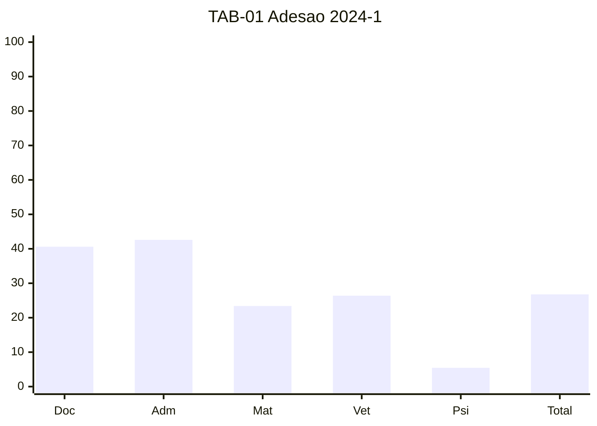
```mermaid
xychart-beta
    title "TAB-01 Adesao 2024-1"
    x-axis [Doc, Adm, Mat, Vet, Psi, Total]
    y-axis 0 --> 100
    bar [40.60, 42.60, 23.40, 26.39, 5.45, 26.77]
```

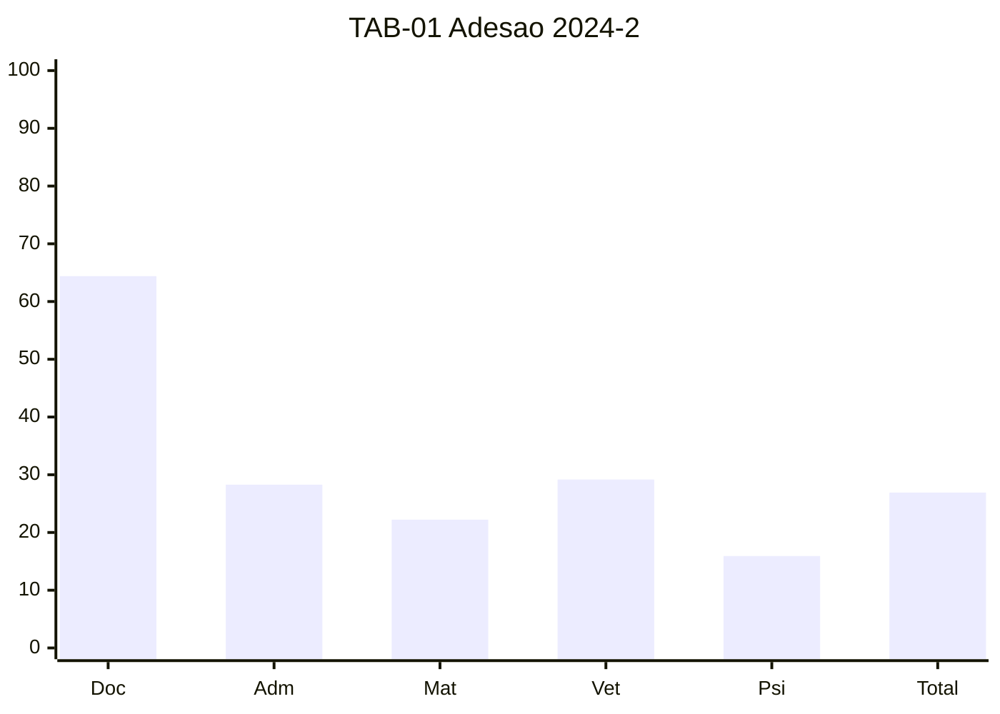
```mermaid
xychart-beta
    title "TAB-01 Adesao 2024-2"
    x-axis [Doc, Adm, Mat, Vet, Psi, Total]
    y-axis 0 --> 100
    bar [64.40, 28.28, 22.22, 29.17, 15.92, 26.91]
```

### TAB-02. Tabela 2, Processo pelos Estudantes (p. 11)

Q1 4,15; Q2 3,56; Q3 4,15 (percentuais na seção 1).

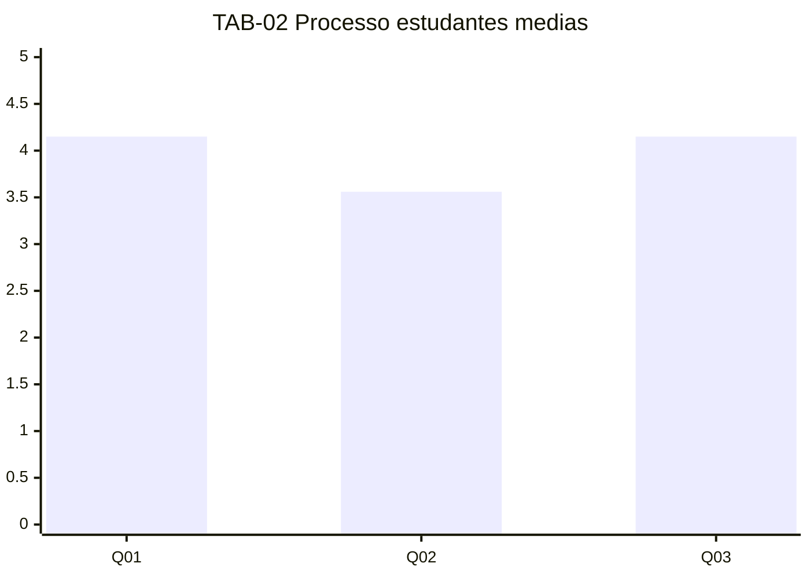
```mermaid
xychart-beta
    title "TAB-02 Processo estudantes medias"
    x-axis [Q01, Q02, Q03]
    y-axis 0 --> 5
    bar [4.15, 3.56, 4.15]
```

### TAB-03. Tabela 3, Processo pelos servidores (p. 13)

Q1 4,52; Q2 4,29; Q3 4,68 (percentuais na seção 1).

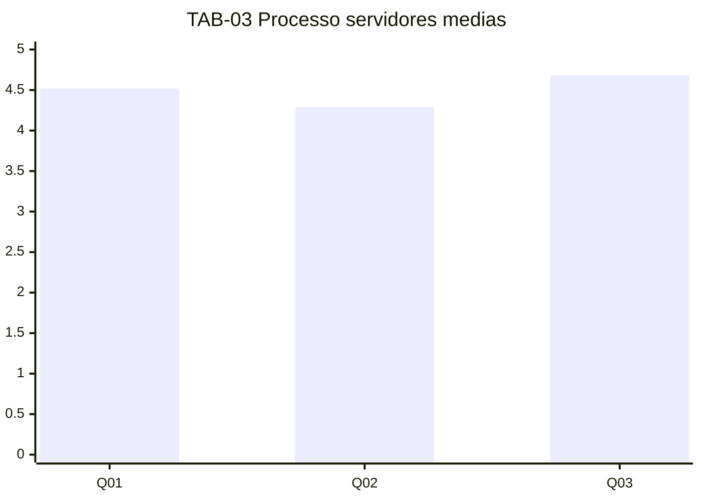
```mermaid
xychart-beta
    title "TAB-03 Processo servidores medias"
    x-axis [Q01, Q02, Q03]
    y-axis 0 --> 5
    bar [4.52, 4.29, 4.68]
```

### TAB-04. Tabela 4, Auxílios em 2024 (p. 14)

Ordem Adm, Psico, Mat, Med Vet. Permanência 2/22/1/17 = 41; emergencial 0/5/0/3 = 8; moradia 0/9/0/4 = 13; alimentação 1/11/1/12 = 25; creche 0/0/0/0 = 0; PCD 0/2/0/0 = 2; PIBIC/PIBITI 0/1/0/3 = 4; extensão 0/6/0/0 = 6; monitoria 0/0/0/0 = 0. Sem mermaid (contagens por curso).

### TAB-05. Tabela 5, Desenvolvimento pelos Estudantes (p. 16)

Q1 4,31; Q2 4,22; Q3 4,39 (percentuais na seção 2).

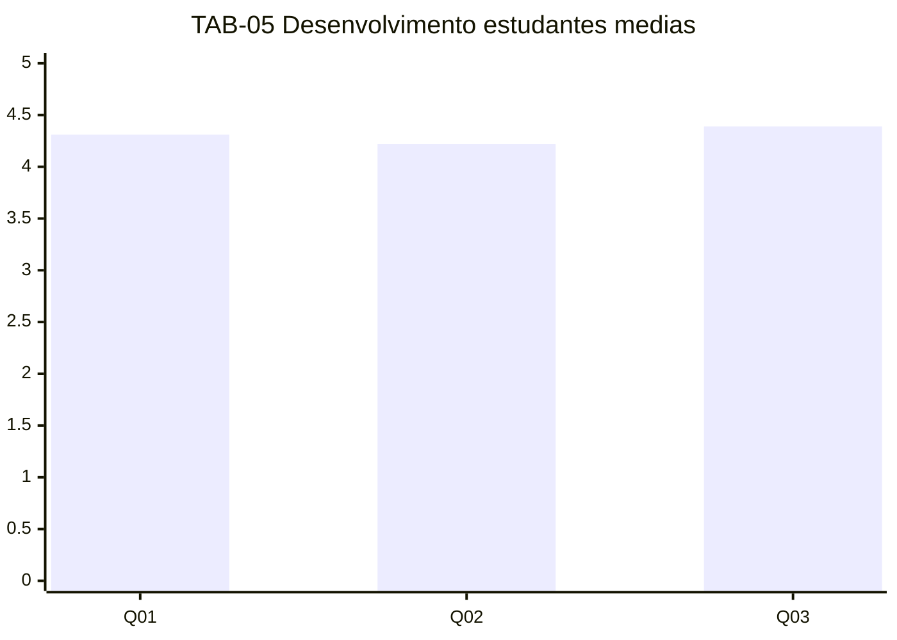
```mermaid
xychart-beta
    title "TAB-05 Desenvolvimento estudantes medias"
    x-axis [Q01, Q02, Q03]
    y-axis 0 --> 5
    bar [4.31, 4.22, 4.39]
```

### TAB-06. Tabela 6, Desenvolvimento pelos servidores (p. 17)

Q1 4,56; Q2 4,71; Q3 4,54; Q4 4,56 (percentuais na seção 2).

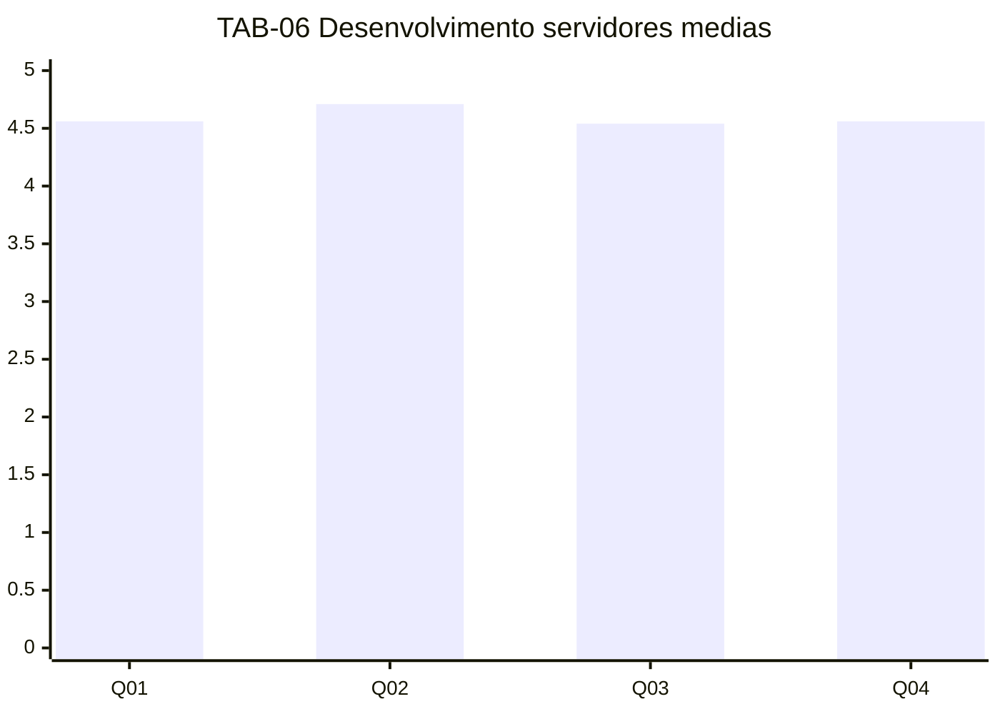
```mermaid
xychart-beta
    title "TAB-06 Desenvolvimento servidores medias"
    x-axis [Q01, Q02, Q03, Q04]
    y-axis 0 --> 5
    bar [4.56, 4.71, 4.54, 4.56]
```

### TAB-07. Tabela 7, Capacitação pelos professores, coordenadores e diretor (p. 19)

Q1 4,38; Q2 4,25 (percentuais na seção 2).

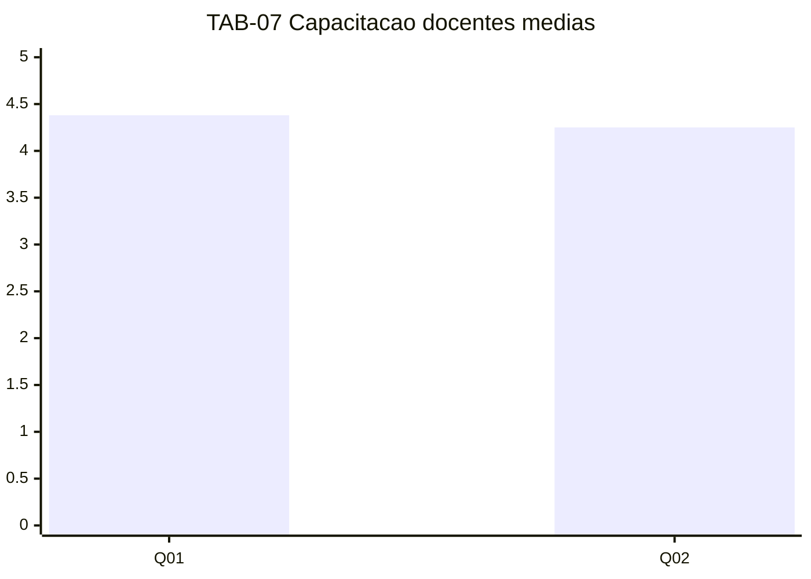
```mermaid
xychart-beta
    title "TAB-07 Capacitacao docentes medias"
    x-axis [Q01, Q02]
    y-axis 0 --> 5
    bar [4.38, 4.25]
```

### TAB-08. Tabela 8, Capacitação pelos técnicos (p. 19)

Q1 2,89; Q2 3,50 (percentuais na seção 2). Q1 como menor média do relatório.

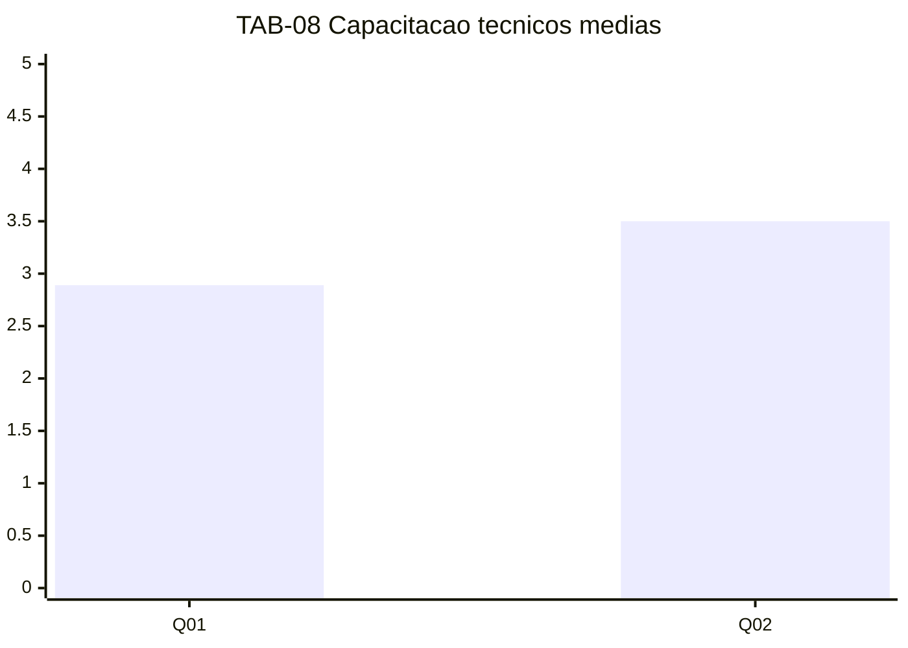
```mermaid
xychart-beta
    title "TAB-08 Capacitacao tecnicos medias"
    x-axis [Q01, Q02]
    y-axis 0 --> 5
    bar [2.89, 3.50]
```

### TAB-09. Tabela 9, Autoavaliação Professores, coordenadores e diretor (p. 20)

Q1 4,77; Q2 4,92; Q3 4,62; Q4 4,77; Q5 5,00; Q6 5,00 (percentuais na seção 2).

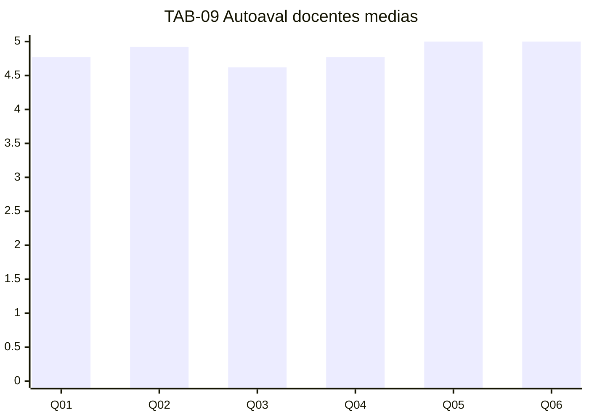
```mermaid
xychart-beta
    title "TAB-09 Autoaval docentes medias"
    x-axis [Q01, Q02, Q03, Q04, Q05, Q06]
    y-axis 0 --> 5
    bar [4.77, 4.92, 4.62, 4.77, 5.00, 5.00]
```

### TAB-10. Tabela 10, Autoavaliação dos técnico-administrativos (p. 21)

Q1 4,78; Q2 4,89; Q3 4,22; Q4 4,89; Q5 4,89 (percentuais na seção 2). Divergência: título da lista com docentes.

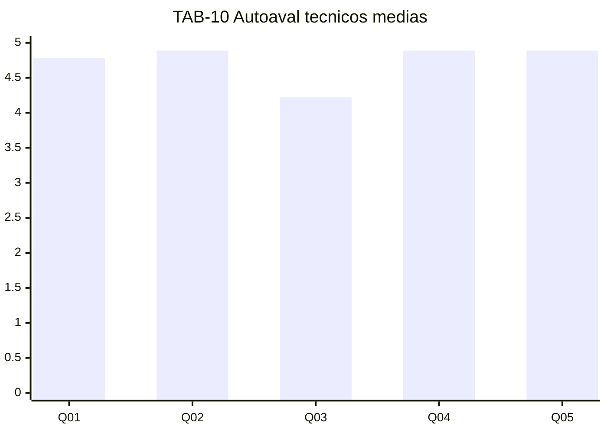
```mermaid
xychart-beta
    title "TAB-10 Autoaval tecnicos medias"
    x-axis [Q01, Q02, Q03, Q04, Q05]
    y-axis 0 --> 5
    bar [4.78, 4.89, 4.22, 4.89, 4.89]
```

### TAB-11. Tabela 11, Ensino pelos professores, coordenadores e diretor (p. 22)

Q1 4,67; Q2 4,31; Q3 4,50; Q4 4,63; Q5 4,81; Q6 3,44; Q7 3,29; Q8 4,09; Q9 4,69; Q10 4,38 (percentuais na seção 2).

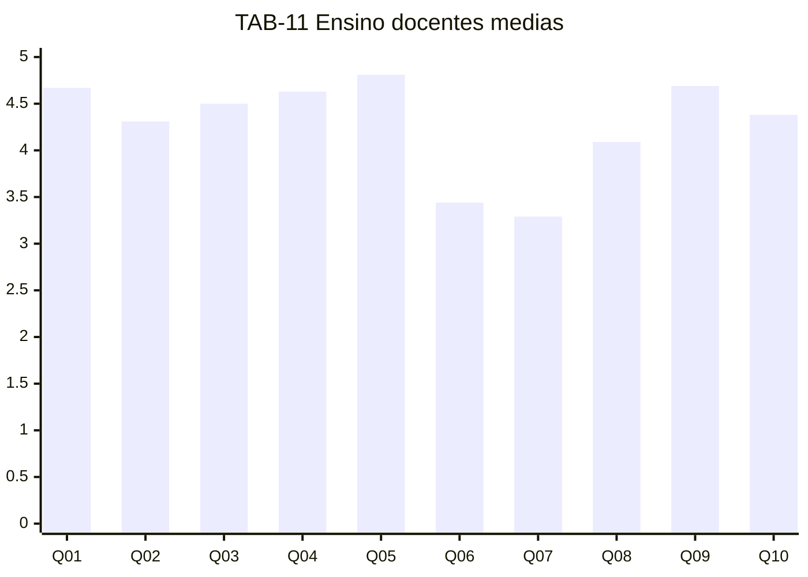
```mermaid
xychart-beta
    title "TAB-11 Ensino docentes medias"
    x-axis [Q01, Q02, Q03, Q04, Q05, Q06, Q07, Q08, Q09, Q10]
    y-axis 0 --> 5
    bar [4.67, 4.31, 4.50, 4.63, 4.81, 3.44, 3.29, 4.09, 4.69, 4.38]
```

### TAB-12. Tabela 12, Ensino pelos técnicos (p. 23)

Q1 4,75; Q2 4,67; Q3 3,00; Q4 4,33; Q5 4,71; Q6 4,25; Q7 4,00 (percentuais na seção 2).

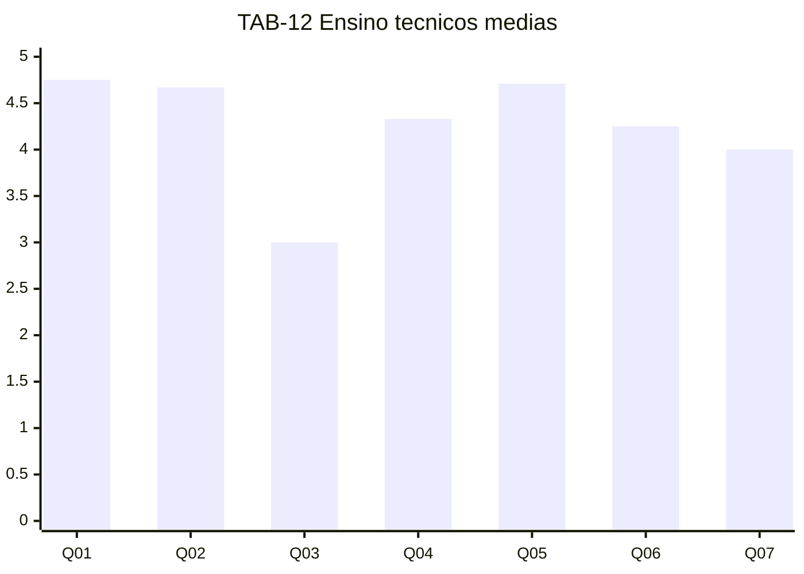
```mermaid
xychart-beta
    title "TAB-12 Ensino tecnicos medias"
    x-axis [Q01, Q02, Q03, Q04, Q05, Q06, Q07]
    y-axis 0 --> 5
    bar [4.75, 4.67, 3.00, 4.33, 4.71, 4.25, 4.00]
```

### TAB-13. Tabela 13, Egressos pelo diretor e coordenadores (p. 25)

Q1 4,00; Q2 4,21; Q3 4,67 (percentuais na seção 2). Lista com "Tabela 13 13".

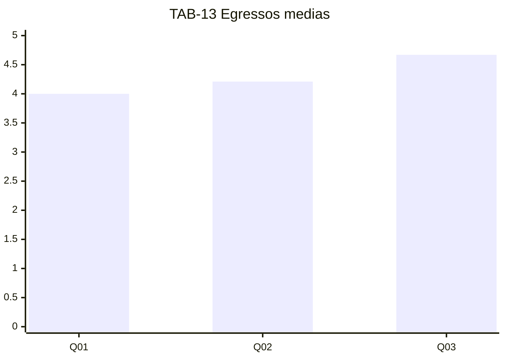
```mermaid
xychart-beta
    title "TAB-13 Egressos medias"
    x-axis [Q01, Q02, Q03]
    y-axis 0 --> 5
    bar [4.00, 4.21, 4.67]
```

### TAB-14. Tabela 14, Atendimento pelos professores (p. 25)

Q1 4,00; Q2 4,21; Q3 4,67 (percentuais na seção 2; ordem trocada).

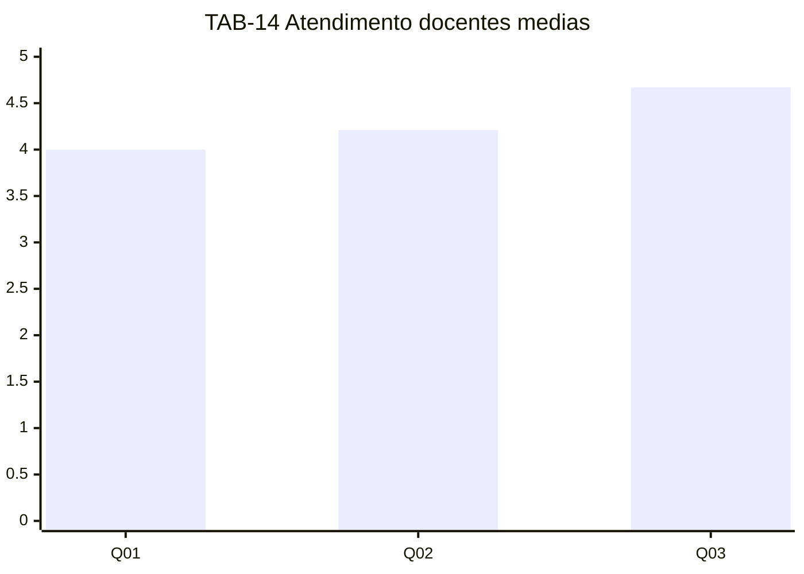
```mermaid
xychart-beta
    title "TAB-14 Atendimento docentes medias"
    x-axis [Q01, Q02, Q03]
    y-axis 0 --> 5
    bar [4.00, 4.21, 4.67]
```

### TAB-15. Tabela 15, Atendimento pelos técnicos (p. 26)

Q1 4,00; Q2 4,00; Q3 4,75 (percentuais na seção 2).

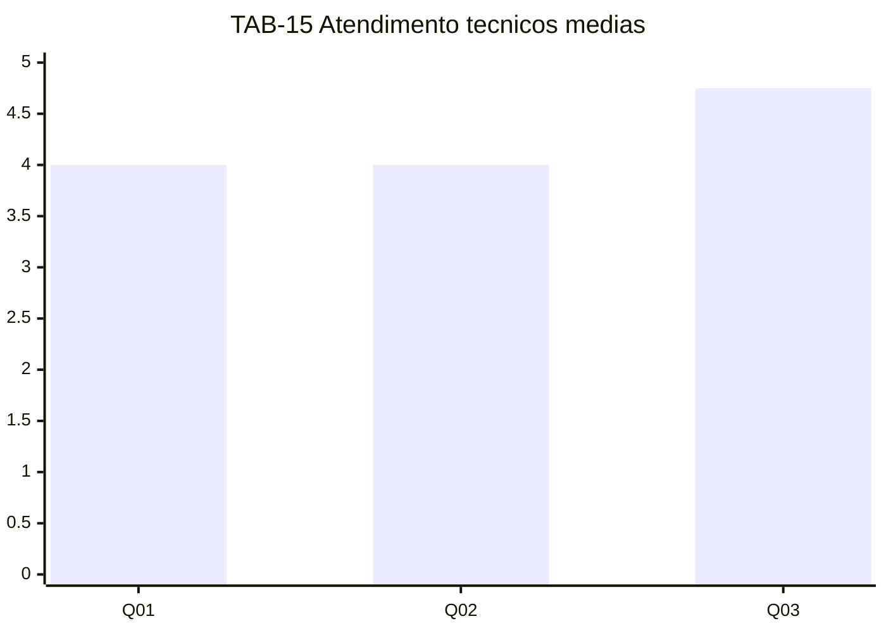
```mermaid
xychart-beta
    title "TAB-15 Atendimento tecnicos medias"
    x-axis [Q01, Q02, Q03]
    y-axis 0 --> 5
    bar [4.00, 4.00, 4.75]
```

### TAB-16. Tabela 16, Comunicação pelos servidores (p. 27)

Q1 4,58; Q2 4,53 (percentuais na seção 2).

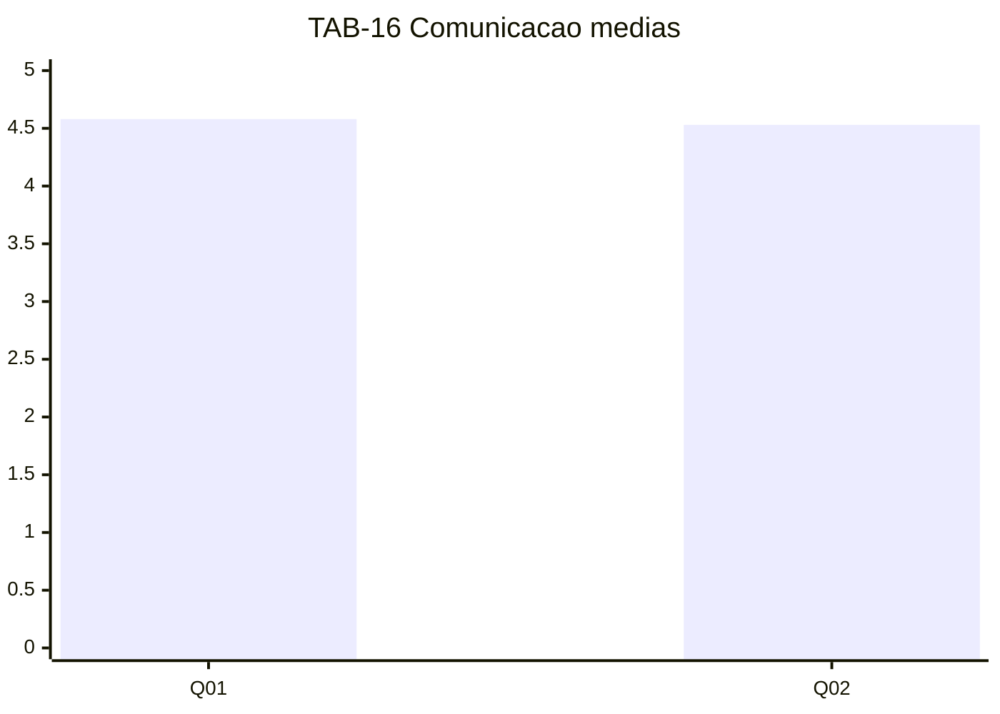
```mermaid
xychart-beta
    title "TAB-16 Comunicacao medias"
    x-axis [Q01, Q02]
    y-axis 0 --> 5
    bar [4.58, 4.53]
```

### TAB-17. Tabela 17, Infraestrutura pela comunidade (p. 27)

Salas de aula 3,60; Professores 4,22; Administrativas 3,92; Auditórios 3,60; Sanitárias 3,24; Informática 4,13; Internet 3,44; AVA 4,32; E-mail 4,43; Práticas 3,47; Convivência 3,18; Esportivos 1,46; Alimentação 2,50; Biblioteca 3,96; Acervo 3,93; Segurança 4,02; Iluminação 3,03; Acessibilidade 3,64; Limpeza 3,80; Parada 3,73; Estacionamento 3,97; Bicicletário 3,67; Vias 3,71; Transporte 2,91; Telefonia 3,52; SISCAD 4,42; SIGPOS 4,32; Secretaria 4,08 (percentuais na seção 2).

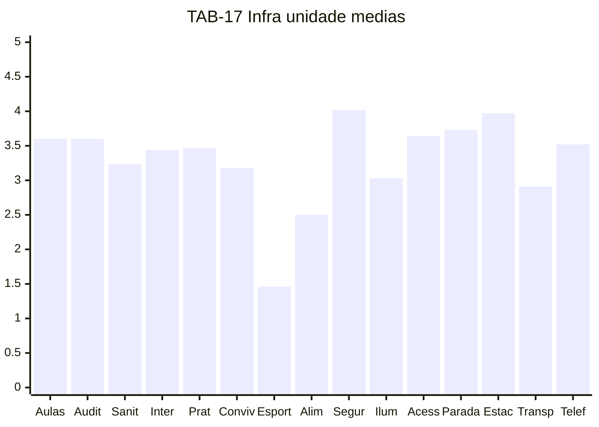
```mermaid
xychart-beta
    title "TAB-17 Infra unidade medias"
    x-axis [Aulas, Audit, Sanit, Inter, Prat, Conviv, Esport, Alim, Segur, Ilum, Acess, Parada, Estac, Transp, Telef]
    y-axis 0 --> 5
    bar [3.60, 3.60, 3.24, 3.44, 3.47, 3.18, 1.46, 2.50, 4.02, 3.03, 3.64, 3.73, 3.97, 2.91, 3.52]
```

### TAB-18. Tabela 18, Imagem geral pelos Estudantes (p. 29)

Q1 4,41; Q2 4,53 (percentuais na seção 2).

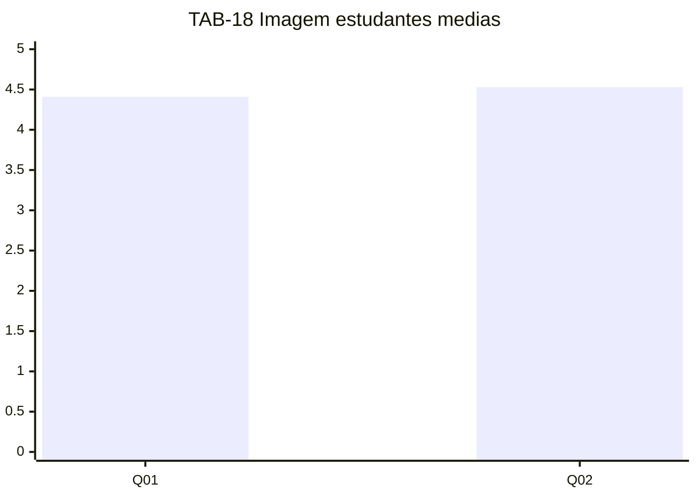
```mermaid
xychart-beta
    title "TAB-18 Imagem estudantes medias"
    x-axis [Q01, Q02]
    y-axis 0 --> 5
    bar [4.41, 4.53]
```

### TAB-19. Tabela 19, Imagem geral pelos Servidores (p. 29)

Q1 4,36; Q2 4,76 (percentuais na seção 2).

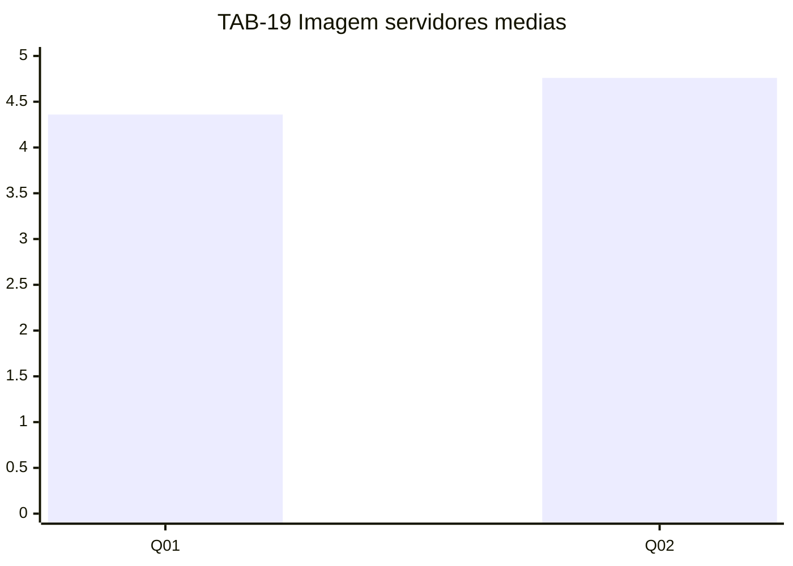
```mermaid
xychart-beta
    title "TAB-19 Imagem servidores medias"
    x-axis [Q01, Q02]
    y-axis 0 --> 5
    bar [4.36, 4.76]
```

### TAB-20. Tabela 20, Coordenação pelo coordenador, Administração (p. 45)

Q1 a Q6 5,00 (100).

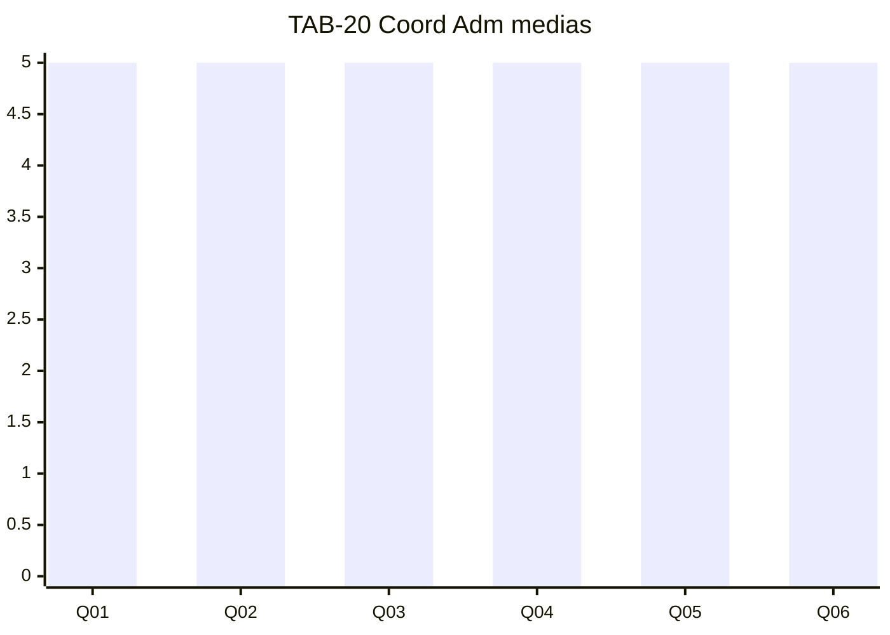
```mermaid
xychart-beta
    title "TAB-20 Coord Adm medias"
    x-axis [Q01, Q02, Q03, Q04, Q05, Q06]
    y-axis 0 --> 5
    bar [5.00, 5.00, 5.00, 5.00, 5.00, 5.00]
```

### TAB-21. Tabela 21, Coordenação pelos estudantes, Administração (p. 46)

Q1 4,39; Q2 4,40; Q3 4,48; Q4 4,19 (percentuais na seção 3).

```mermaid
xychart-beta
    title "TAB-21 Coord estud Adm medias"
    x-axis [Q01, Q02, Q03, Q04]
    y-axis 0 --> 5
    bar [4.39, 4.40, 4.48, 4.19]
```

### TAB-22. Tabela 22, Disciplinas e professores, Administração (p. 47)

Q1 4,50; Q2 4,53; Q3 4,60; Q4 4,46; Q5 4,48; Q6 4,63; Q7 4,72; Q8 4,75 (percentuais na seção 3).

```mermaid
xychart-beta
    title "TAB-22 Disciplinas Adm medias"
    x-axis [Q01, Q02, Q03, Q04, Q05, Q06, Q07, Q08]
    y-axis 0 --> 5
    bar [4.50, 4.53, 4.60, 4.46, 4.48, 4.63, 4.72, 4.75]
```

### TAB-23. Tabela 23, Professores quanto ao próprio desempenho, Administração (p. 48)

Q1 4,89; Q2 4,91; Q3 4,82; Q4 4,84; Q5 4,92; Q6 4,99 (percentuais na seção 3).

```mermaid
xychart-beta
    title "TAB-23 Desempenho docente Adm medias"
    x-axis [Q01, Q02, Q03, Q04, Q05, Q06]
    y-axis 0 --> 5
    bar [4.89, 4.91, 4.82, 4.84, 4.92, 4.99]
```

### TAB-24. Tabela 24, Desempenho próprio, Administração (p. 49)

Q1 4,42; Q2 4,40; Q3 4,50; Q4 4,22; Q5 4,32; Q6 4,81 (percentuais na seção 3).

```mermaid
xychart-beta
    title "TAB-24 Desempenho proprio Adm medias"
    x-axis [Q01, Q02, Q03, Q04, Q05, Q06]
    y-axis 0 --> 5
    bar [4.42, 4.40, 4.50, 4.22, 4.32, 4.81]
```

### TAB-25. Tabela 25, Demais atividades, Administração (p. 50)

Q1 3,91; Q2 3,77; Q3 3,82; Q4 4,69; Q5 4,31 (percentuais na seção 3).

```mermaid
xychart-beta
    title "TAB-25 Demais atividades Adm medias"
    x-axis [Q01, Q02, Q03, Q04, Q05]
    y-axis 0 --> 5
    bar [3.91, 3.77, 3.82, 4.69, 4.31]
```

### TAB-26. Tabela 26, Desempenho pelos professores, Administração (p. 51)

Q1 4,00; Q2 3,82; Q3 4,00; Q4 4,56; Q5 3,97 (percentuais na seção 3).

```mermaid
xychart-beta
    title "TAB-26 Desempenho docente Adm medias"
    x-axis [Q01, Q02, Q03, Q04, Q05]
    y-axis 0 --> 5
    bar [4.00, 3.82, 4.00, 4.56, 3.97]
```

### TAB-27. Tabela 27, Infraestrutura do curso, Administração (p. 52)

Informática 4,38; Internet 4,00; AVA 4,89; Práticas 3,36; Biblioteca 4,52; Acervo 4,17 (percentuais na seção 3).

```mermaid
xychart-beta
    title "TAB-27 Infra Adm medias"
    x-axis [Info, Net, AVA, Prat, Bib, Acervo]
    y-axis 0 --> 5
    bar [4.38, 4.00, 4.89, 3.36, 4.52, 4.17]
```

### TAB-28. Tabela 28, Coordenação pelo coordenador, Matemática (p. 58)

Q1 3,00; Q2 4,00; Q3 3,00; Q4 a Q6 5,00 (percentuais na seção 4).

```mermaid
xychart-beta
    title "TAB-28 Coord Mat medias"
    x-axis [Q01, Q02, Q03, Q04, Q05, Q06]
    y-axis 0 --> 5
    bar [3.00, 4.00, 3.00, 5.00, 5.00, 5.00]
```

### TAB-29. Tabela 29, Coordenação pelos estudantes, Matemática (p. 59)

Q1 4,63; Q2 4,63; Q3 4,47; Q4 4,40 (percentuais na seção 4).

```mermaid
xychart-beta
    title "TAB-29 Coord estud Mat medias"
    x-axis [Q01, Q02, Q03, Q04]
    y-axis 0 --> 5
    bar [4.63, 4.63, 4.47, 4.40]
```

### TAB-30. Tabela 30, Disciplinas e professores, Matemática (p. 60)

Q1 4,48; Q2 4,51; Q3 4,59; Q4 4,49; Q5 4,42; Q6 4,62; Q7 4,69; Q8 4,73 (percentuais na seção 4).

```mermaid
xychart-beta
    title "TAB-30 Disciplinas Mat medias"
    x-axis [Q01, Q02, Q03, Q04, Q05, Q06, Q07, Q08]
    y-axis 0 --> 5
    bar [4.48, 4.51, 4.59, 4.49, 4.42, 4.62, 4.69, 4.73]
```

### TAB-31. Tabela 31, Professores quanto ao próprio desempenho, Matemática (p. 61)

Q1 4,84; Q2 4,95; Q3 4,95; Q4 4,68; Q5 4,95; Q6 5,00 (percentuais na seção 4).

```mermaid
xychart-beta
    title "TAB-31 Desempenho docente Mat medias"
    x-axis [Q01, Q02, Q03, Q04, Q05, Q06]
    y-axis 0 --> 5
    bar [4.84, 4.95, 4.95, 4.68, 4.95, 5.00]
```

### TAB-32. Tabela 32, Desempenho próprio, Matemática (p. 63)

Q1 4,46; Q2 4,38; Q3 4,56; Q4 4,24; Q5 4,39; Q6 4,84 (percentuais na seção 4).

```mermaid
xychart-beta
    title "TAB-32 Desempenho proprio Mat medias"
    x-axis [Q01, Q02, Q03, Q04, Q05, Q06]
    y-axis 0 --> 5
    bar [4.46, 4.38, 4.56, 4.24, 4.39, 4.84]
```

### TAB-33. Tabela 33, Demais atividades, Matemática (p. 64)

Q1 3,73; Q2 3,80; Q3 3,82; Q4 4,45; Q5 4,00 (percentuais na seção 4).

```mermaid
xychart-beta
    title "TAB-33 Demais atividades Mat medias"
    x-axis [Q01, Q02, Q03, Q04, Q05]
    y-axis 0 --> 5
    bar [3.73, 3.80, 3.82, 4.45, 4.00]
```

### TAB-34. Tabela 34, Desempenho pelos professores, Matemática (p. 64)

Q1 3,62; Q2 3,68; Q3 3,57; Q4 4,51; Q5 3,62 (percentuais na seção 4).

```mermaid
xychart-beta
    title "TAB-34 Desempenho docente Mat medias"
    x-axis [Q01, Q02, Q03, Q04, Q05]
    y-axis 0 --> 5
    bar [3.62, 3.68, 3.57, 4.51, 3.62]
```

### TAB-35. Tabela 35, Infraestrutura do curso, Matemática (p. 65)

Informática 3,30; Internet 3,18; AVA 4,18; Práticas 3,20; Biblioteca 3,55; Acervo 3,89 (percentuais na seção 4).

```mermaid
xychart-beta
    title "TAB-35 Infra Mat medias"
    x-axis [Info, Net, AVA, Prat, Bib, Acervo]
    y-axis 0 --> 5
    bar [3.30, 3.18, 4.18, 3.20, 3.55, 3.89]
```

### TAB-36. Tabela 36, Coordenação pelo coordenador, Medicina Veterinária (p. 73)

Q1 a Q6 5,00 (100).

```mermaid
xychart-beta
    title "TAB-36 Coord Vet medias"
    x-axis [Q01, Q02, Q03, Q04, Q05, Q06]
    y-axis 0 --> 5
    bar [5.00, 5.00, 5.00, 5.00, 5.00, 5.00]
```

### TAB-37. Tabela 37, Coordenação pelos estudantes, Medicina Veterinária (p. 74)

Q1 4,28; Q2 4,47; Q3 4,58; Q4 4,35 (percentuais na seção 5).

```mermaid
xychart-beta
    title "TAB-37 Coord estud Vet medias"
    x-axis [Q01, Q02, Q03, Q04]
    y-axis 0 --> 5
    bar [4.28, 4.47, 4.58, 4.35]
```

### TAB-38. Tabela 38, Disciplinas e professores, Medicina Veterinária (p. 75)

Q1 4,44; Q2 4,57; Q3 4,66; Q4 4,47; Q5 4,43; Q6 4,72; Q7 4,73; Q8 4,84 (percentuais na seção 5).

```mermaid
xychart-beta
    title "TAB-38 Disciplinas Vet medias"
    x-axis [Q01, Q02, Q03, Q04, Q05, Q06, Q07, Q08]
    y-axis 0 --> 5
    bar [4.44, 4.57, 4.66, 4.47, 4.43, 4.72, 4.73, 4.84]
```

### TAB-39. Tabela 39, Professores quanto ao próprio desempenho, Medicina Veterinária (p. 76)

Q1 5,00; Q2 4,92; Q3 4,85; Q4 4,92; Q5 5,00; Q6 5,00 (percentuais na seção 5).

```mermaid
xychart-beta
    title "TAB-39 Desempenho docente Vet medias"
    x-axis [Q01, Q02, Q03, Q04, Q05, Q06]
    y-axis 0 --> 5
    bar [5.00, 4.92, 4.85, 4.92, 5.00, 5.00]
```

### TAB-40. Tabela 40, Desempenho próprio, Medicina Veterinária (p. 78)

Q1 4,46; Q2 4,50; Q3 4,66; Q4 4,04; Q5 4,42; Q6 4,77 (percentuais na seção 5; enunciado com Q1 a Q5, tabela com 6 linhas).

```mermaid
xychart-beta
    title "TAB-40 Desempenho proprio Vet medias"
    x-axis [Q01, Q02, Q03, Q04, Q05, Q06]
    y-axis 0 --> 5
    bar [4.46, 4.50, 4.66, 4.04, 4.42, 4.77]
```

### TAB-41. Tabela 41, Demais atividades, Medicina Veterinária (p. 78)

Q1 4,68; Q2 4,17; Q3 4,56; Q4 4,95; Q5 4,63 (percentuais na seção 5).

```mermaid
xychart-beta
    title "TAB-41 Demais atividades Vet medias"
    x-axis [Q01, Q02, Q03, Q04, Q05]
    y-axis 0 --> 5
    bar [4.68, 4.17, 4.56, 4.95, 4.63]
```

### TAB-42. Tabela 42, Desempenho pelos professores, Medicina Veterinária (p. 80)

Q1 3,46; Q2 2,85; Q3 3,00; Q4 3,69; Q5 3,31 (percentuais na seção 5). Q2 como única fragilidade do grupo.

```mermaid
xychart-beta
    title "TAB-42 Desempenho docente Vet medias"
    x-axis [Q01, Q02, Q03, Q04, Q05]
    y-axis 0 --> 5
    bar [3.46, 2.85, 3.00, 3.69, 3.31]
```

### TAB-43. Tabela 43, Infraestrutura do curso, Medicina Veterinária (p. 80)

Informática 4,47; Internet 3,60; AVA 3,80; Práticas 3,45; Biblioteca 3,95; Acervo 3,56 (percentuais na seção 5).

```mermaid
xychart-beta
    title "TAB-43 Infra Vet medias"
    x-axis [Info, Net, AVA, Prat, Bib, Acervo]
    y-axis 0 --> 5
    bar [4.47, 3.60, 3.80, 3.45, 3.95, 3.56]
```

### TAB-44. Tabela 44, Coordenação pelo coordenador, Psicologia (p. 86)

Q1 4,00; Q2 a Q6 5,00 (percentuais na seção 6; descrições de Q1 a Q4 trocadas no texto).

```mermaid
xychart-beta
    title "TAB-44 Coord Psi medias"
    x-axis [Q01, Q02, Q03, Q04, Q05, Q06]
    y-axis 0 --> 5
    bar [4.00, 5.00, 5.00, 5.00, 5.00, 5.00]
```

### TAB-45. Tabela 45, Coordenação pelos estudantes, Psicologia (p. 87)

Q1 3,60; Q2 3,63; Q3 4,00; Q4 4,40 (percentuais na seção 6; Q1 e Q4 com 44,44 de abstenção).

```mermaid
xychart-beta
    title "TAB-45 Coord estud Psi medias"
    x-axis [Q01, Q02, Q03, Q04]
    y-axis 0 --> 5
    bar [3.60, 3.63, 4.00, 4.40]
```

### TAB-46. Tabela 46, Disciplinas e professores, Psicologia (p. 88)

Q1 4,39; Q2 4,48; Q3 4,61; Q4 4,63; Q5 4,43; Q6 4,45; Q7 4,75; Q8 4,70 (percentuais na seção 6).

```mermaid
xychart-beta
    title "TAB-46 Disciplinas Psi medias"
    x-axis [Q01, Q02, Q03, Q04, Q05, Q06, Q07, Q08]
    y-axis 0 --> 5
    bar [4.39, 4.48, 4.61, 4.63, 4.43, 4.45, 4.75, 4.70]
```

### TAB-47. Tabela 47, Professores quanto ao próprio desempenho, Psicologia (p. 89)

Q1 a Q6 5,00 (100).

```mermaid
xychart-beta
    title "TAB-47 Desempenho docente Psi medias"
    x-axis [Q01, Q02, Q03, Q04, Q05, Q06]
    y-axis 0 --> 5
    bar [5.00, 5.00, 5.00, 5.00, 5.00, 5.00]
```

### TAB-48. Tabela 48, Desempenho próprio, Psicologia (p. 91)

Q1 4,46; Q2 4,41; Q3 4,59; Q4 4,34; Q5 4,39; Q6 4,96 (percentuais na seção 6; Q4 contato e Q5 assimilação pelos enunciados).

```mermaid
xychart-beta
    title "TAB-48 Desempenho proprio Psi medias"
    x-axis [Q01, Q02, Q03, Q04, Q05, Q06]
    y-axis 0 --> 5
    bar [4.46, 4.41, 4.59, 4.34, 4.39, 4.96]
```

### TAB-49. Tabela 49, Demais atividades, Psicologia (p. 91)

Q1 3,78; Q2 2,75; Q3 2,88; Q4 4,89; Q5 4,22 (percentuais na seção 6). Q2 e Q3 como fragilidades mais acentuadas.

```mermaid
xychart-beta
    title "TAB-49 Demais atividades Psi medias"
    x-axis [Q01, Q02, Q03, Q04, Q05]
    y-axis 0 --> 5
    bar [3.78, 2.75, 2.88, 4.89, 4.22]
```

### TAB-50. Tabela 50, Desempenho pelos professores, Psicologia (p. 92)

Q1 3,25; Q2 3,50; Q3 3,25; Q4 4,75; Q5 3,50, com N=4 indicativo (percentuais na seção 6).

```mermaid
xychart-beta
    title "TAB-50 Desempenho docente Psi medias"
    x-axis [Q01, Q02, Q03, Q04, Q05]
    y-axis 0 --> 5
    bar [3.25, 3.50, 3.25, 4.75, 3.50]
```

### TAB-51. Tabela 51, Infraestrutura do curso, Psicologia (p. 93)

Informática 3,37; Internet 3,22; AVA 4,43; Práticas 2,80; Biblioteca 3,89; Acervo 4,13 (percentuais na seção 6). Práticas com 44,44 de NA.

```mermaid
xychart-beta
    title "TAB-51 Infra Psi medias"
    x-axis [Info, Net, AVA, Prat, Bib, Acervo]
    y-axis 0 --> 5
    bar [3.37, 3.22, 4.43, 2.80, 3.89, 4.13]
```

## 9. Lacunas e defeitos declarados desta conversão

Cobertura integral das 104 páginas, 51 tabelas e 11 quadros, sem lacunas de valores: todas as Tabelas 1 a 51 com médias e percentuais transcritos. Documento sem figuras de gráficos: tabelas como única série quantitativa. Defeitos do original preservados: capa com abril de 2026 para ano base 2024; lista com Tabela 10 de docentes onde o corpo é de técnicos; lista com "Tabela 13 13"; Tabela 14 com ordem trocada (Q1 egressos, Q3 assistência); Tabela 24 com questão sem número (contexto de Q3); Tabela 32 com remissão à Tabela 28; Tabela 40 com enunciado de Q1 a Q5 e 6 linhas; Tabela 41 com remissão à Tabela 33; Tabela 44 com excelência absoluta onde Q1 é 4,00 e descrições de Q1 a Q4 trocadas; Tabela 48 com Q4/Q5 trocados no texto; Quadro 3 com título de 2023 e situação em 2024; Quadro 5 com melhorias 5,00 como O; Quadro 6 com texto de 2023; Quadro 8 com texto de 2022 e valores de 2023 com fragmento por quebra de linha; Quadro 9 com assimilação 3,62 como F e valores de 2023; Quadro 11 com título de 2023 e valores divergentes da Tabela 51; balanço com 50 por cento onde a Tabela 1 traz 26,91; Administração com 3.016 horas ante 3.015 em 2023. Nenhum valor estimado. Feedback negativo anonimizado; nomes apenas em elogios.
