# FONTE PRIMÁRIA ESTRUTURADA — Relatório de Autoavaliação Setorial 2025 do CPAR/UFMS

> **Arquivo fonte**: `Relatorio_de_Autoavaliacao_Setorial_2025.docx`, base de conhecimento (2.605.681 bytes, extração integral de 5.074 linhas). Conferência pelo viewer do Drive, ID `1uAM_wzI309jkHC2i2hh2Lz984I4vEIOU` (visualização permitida, 145 páginas).
> **Documento**: RELATÓRIO DE AUTOAVALIAÇÃO SETORIAL 2025, CPAR/UFMS, Paranaíba MS, Abril de 2026. 145 páginas. Diretora Andreia Cristina Ribeiro. CSA pela Portaria n. 20-CPAR/UFMS, de 16/03/2026 (docentes Raildo Santos de Lima presidente, Ana Luiza Bossolani Martins, Dalton de Sousa, Francisco Rosa, Gabriel Luis Pereira Nolasco, Silvia Maria Bonassi; técnica Crislen Daniele dos Santos Rodrigues da Silva; estudantes Érica Vitória Palhares Supriano e Luzinete do Carmo Oliveira). Funcionamento sob coordenação geral da CPA/UFMS.
> **Método de conversão**: extração integral do docx (texto, tabelas numéricas e análises). Documento com 25 figuras vetoriais (EMF) + 1 logotipo (PNG): as figuras são descritas em bloco de contexto com os valores da narrativa que as acompanha; o ambiente não renderiza EMF, fato declarado, sem estimativa de valores. Tabelas transcritas com médias e percentuais.
> **Data da conversão**: 09 set 2026. **Cobertura**: integral das 145 páginas, 57 tabelas, 25 figuras e 8 quadros.
> **Relação com a série analítica**: este arquivo é a fonte primária estruturada; o arquivo analítico `RSA_2025_CPAR.md` permanece preservado e tem função diferente.
> **Convenção**: escala de 5 (Concordo totalmente) a 1 (Discordo totalmente), além de NA, NQR e NSR/NRS. Cada tabela recebe bloco de contexto + valores + análise fiel + mermaid das médias. Nenhum valor estimado. Feedback negativo anonimizado (o original já anonimiza críticas e nomeia apenas elogios, padrão mantido).

## Sumário do documento fonte

1 INTRODUÇÃO (p. 9). 2 PROCESSO DE AVALIAÇÃO INSTITUCIONAL (p. 11): 2.1 O processo na Unidade (Tabela 1, Quadro 1 Plano da CSA); 2.2 Percepção sobre o processo (Tabelas 2 e 3). 3 UNIDADE SETORIAL (p. 18): 3.1 Dados gerais (Tabela 4 cursos, Tabela 5 auxílios, Figuras 1 a 10, total/ingressantes/egressos/docentes/técnicos); 3.2 Planejamento (Bloco 4, TI, acessibilidade, Quadro 2 acompanhamento com 27 ações); 3.3 Percepção (desenvolvimento Tabelas 6 e 7; capacitação Tabelas 8 e 9; desempenho Tabelas 10 e 11; ensino Tabelas 12 e 13; atendimento Tabelas 14 a 16; comunicação Tabelas 17 e 18; infraestrutura Tabela 19 com 29 itens; imagem Tabelas 20 e 21; questão aberta); 3.4 Gestão (Quadro 3 plano SMART da direção com 6 ações, Quadro 4 discursivas). 4 CURSOS PRESENCIAIS (p. 56): 4.1 Administração (indicadores Figuras 11 a 14, Tabelas 22 a 30, Quadro 5 com 6 ações, externas, colegiado, corpo docente com 7 doutores DE e PPC Res. 1.321/2025); 4.2 Matemática (Figuras 15 a 18, Tabelas 31 a 39, Quadro 6 com 6 ações, 6 docentes DE doutores, PPC Res. 1.328/2025); 4.3 Medicina Veterinária (Figuras 19 a 21, Tabelas 40 a 48, Quadro 7 com 6 ações, 10 docentes DE, Edital 108/2025, PPC Res. 1.320/2025); 4.4 Psicologia (Figuras 22 a 25, Tabelas 49 a 57, Quadro 8 com 6 ações, PPC Res. 1.323/2025, diplomação 77,49, evasão 4,53). 5 BALANÇO CRÍTICO (p. 137). 6 CONSIDERAÇÕES FINAIS (p. 142). 7 REFERÊNCIAS (p. 145).

## Lista de Tabelas do documento

Tabela 1: Adesão em 2025 (p. 13). Tabela 2: Processo pelos Estudantes (p. 14). Tabela 3: Processo pelos servidores (p. 15). Tabela 4: Cursos oferecidos (p. 18). Tabela 5: Auxílios em 2025 (p. 19). Tabela 6: Desenvolvimento pelos Estudantes (p. 30). Tabela 7: Desenvolvimento pelos servidores (p. 31). Tabela 8: Capacitação pelos professores e gestores (p. 32). Tabela 9: Capacitação pelos técnicos (p. 33). Tabela 10: Autoavaliação docentes e gestores (p. 34). Tabela 11: Autoavaliação técnicos (p. 35). Tabela 12: Ensino pelos professores e diretor, 11 itens (p. 37). Tabela 13: Ensino pelos técnicos (p. 39). Tabela 14: Atendimento pelos diretores e coordenadores (p. 40). Tabela 15: Atendimento pelos professores (p. 41). Tabela 16: Atendimento pelos técnicos (p. 42). Tabela 17: Comunicação pelos servidores (p. 43). Tabela 18: Comunicação pelos Estudantes (p. 43). Tabela 19: Infraestrutura pela comunidade, 29 itens (p. 45). Tabela 20: Imagem pelos Estudantes (p. 46). Tabela 21: Imagem pelos Servidores (p. 47). Tabela 22: Coordenação pelo coordenador, Administração (p. 59). Tabela 23: Colegiado e NDE, Administração (p. 60). Tabela 24: Coordenação pelos estudantes, Administração (p. 61). Tabela 25: Professores quanto ao próprio desempenho, Administração (p. 62). Tabela 26: Disciplinas e professores, Administração (p. 63). Tabela 27: Desempenho próprio, Administração, 7 itens (p. 65). Tabela 28: Demais atividades, Administração (p. 66). Tabela 29: Desempenho pelos professores, Administração (p. 67). Tabela 30: Infraestrutura, Administração, 8 itens (p. 68). Tabela 31: Coordenação pelo coordenador, Matemática (p. 79). Tabela 32: Colegiado e NDE, Matemática (p. 80). Tabela 33: Coordenação pelos estudantes, Matemática (p. 81). Tabela 34: Professores quanto ao próprio desempenho, Matemática (p. 82). Tabela 35: Disciplinas e professores, Matemática (p. 83). Tabela 36: Desempenho próprio, Matemática, 7 itens (p. 85). Tabela 37: Demais atividades, Matemática (p. 86). Tabela 38: Desempenho pelos professores, Matemática (p. 87). Tabela 39: Infraestrutura, Matemática, 8 itens (p. 88). Tabela 40: Coordenação pelo coordenador, Medicina Veterinária (p. 99). Tabela 41: Colegiado e NDE, Medicina Veterinária (p. 100). Tabela 42: Coordenação pelos estudantes, Medicina Veterinária (p. 101). Tabela 43: Professores quanto ao próprio desempenho, Medicina Veterinária (p. 102). Tabela 44: Disciplinas e professores, Medicina Veterinária (p. 103). Tabela 45: Desempenho próprio, Medicina Veterinária, 7 itens (p. 105). Tabela 46: Demais atividades, Medicina Veterinária (p. 106). Tabela 47: Desempenho pelos professores, Medicina Veterinária (p. 107). Tabela 48: Infraestrutura, Medicina Veterinária, 8 itens (p. 108). Tabela 49: Coordenação pelo coordenador, Psicologia (p. 119). Tabela 50: Colegiado e NDE, Psicologia, com NDE em 4,00 (p. 120). Tabela 51: Coordenação pelos estudantes, Psicologia (p. 121). Tabela 52: Professores quanto ao próprio desempenho, Psicologia (p. 122). Tabela 53: Disciplinas e professores, Psicologia (p. 123). Tabela 54: Desempenho próprio, Psicologia, 7 itens (p. 125). Tabela 55: Demais atividades, Psicologia (p. 126). Tabela 56: Desempenho pelos professores, Psicologia (p. 127). Tabela 57: Infraestrutura, Psicologia, 8 itens (p. 128).

## Lista de Figuras do documento

Figura 1: Total de alunos de graduação, 573 (p. 19). Figura 2: Alunos por gênero (p. 20). Figura 3: Ingressantes 2025 e gênero, 166 (109F/57M) (p. 20). Figura 4: Ingresso por modalidade (p. 20). Figura 5: Histórico de ingressantes (p. 21). Figura 6: Histórico de egressos por curso (p. 22). Figura 7: Egressos por modalidade (p. 22). Figura 8: Total de docentes, 41 (38 DE, 1 40h, 2 20h) (p. 23). Figura 9: Docentes por classe (p. 24). Figura 10: Técnicos, 20 (p. 24). Figuras 11 a 14: Administração, 3 anos, modalidade, gênero, egressos 18 (p. 57 a 58). Figuras 15 a 18: Matemática, egressos 4 (p. 77 a 78). Figuras 19 a 21: Medicina Veterinária, sem egressos até 2028 (p. 97 a 98). Figuras 22 a 25: Psicologia, egressos 22 (p. 117 a 119).

## Lista de Quadros do documento

Quadro 1: Plano de Ação da CSA 2025, 4 ações SMART (p. 15). Quadro 2: Acompanhamento dos Planos, 27 ações (11 concluídas, 12 em andamento, 4 não iniciadas) (p. 27). Quadro 3: Plano SMART da direção, 6 ações (p. 49). Quadro 4: Ações sobre discursivas (p. 53). Quadro 5: Administração, 6 ações SMART (p. 70). Quadro 6: Matemática, 6 ações SMART (p. 89). Quadro 7: Medicina Veterinária, 6 ações SMART (p. 110). Quadro 8: Psicologia, 6 ações SMART (p. 130).

---

## 1. Rosto, composição e processo (páginas 1 a 17)

Capa com Campus de Paranaíba, RELATÓRIO DE AUTOAVALIAÇÃO SETORIAL 2025, Paranaíba MS, Abril de 2026 (capa datada de 2026 para ano base 2025, divergência preservada). Diretora Andreia Cristina Ribeiro; CSA pela Portaria n. 20-CPAR/UFMS de 16/03/2026, composição acima. Modelo novo em 2025: Tabelas com Nº/Questão, análises por item, planos SMART com prioridade P1 a P5, Figuras de indicadores por curso, acompanhamento consolidado do ciclo anterior.

Processo 2025: 1a etapa de 10/06 a 10/07/2025 para todos (estudantes, docentes, coordenadores, diretores, técnicos); 2a etapa de 21/10 a 14/11/2025 só disciplinas (discentes e docentes); SIAI com acesso individualizado. Critérios MEC sem NS/NA: 1+2 fragilidade, 3 oportunidade, 4+5 bem avaliado. Escala 5 a 1 com NA/NQR/NRS.

Tabela 1, Adesão em 2025, fonte SIAI/AGETIC. 2025-1: diretora 1/1 (100,0); coords grad 4/4 (100,0); coords pós traço; professores 32/30 (93,8); estudantes 519/153 (29,5), com Administração 181/58 (32,04), Matemática 53/9 (16,98), Medicina Veterinária 115/39 (33,91), Psicologia 170/47 (27,65); pós traço; técnicos 20/17 (85,0); total 546/205 (33,59). 2025-2: coords 2025-2 com 100,0 sem absolutos (defeito: coluna sem Total/Participantes); professores 38/34 (89,5); estudantes 473/119 (25,2), com Administração 150/40 (26,67), Matemática 46/13 (28,26), Medicina Veterinária 109/25 (22,94), Psicologia 157/25 (15,92); total 511/153 (29,54). Docentes com salto de 40,6 para 93,8; discentes como fragilidade estrutural, com Mat 16,98 como mínimo histórico.

Tabela 2, Processo pelos Estudantes: Q1 4,27 (52,94/24,84/11,76/3,92/2,61/3,92); Q2 3,61 (26,14/16,34/15,03/2,61/11,11/28,76); Q3 4,53 (64,71/16,99/7,84/1,96/1,31/7,19). Comunicação positiva; divulgação com 28,76 de NSR como ponto crítico; compreensão como maior.

Tabela 3, Processo pelos servidores: Q1 4,76 (78,85/15,38/3,85/0/0/1,92); Q2 4,40 (53,85/11,54/13,46/3,85/0/17,31); Q3 4,73 (80,77/11,54/1,92/3,85/0/1,92). Comunicação como maior; divulgação como menor com 17,31 de NSR.

Quadro 1, Plano da CSA 2025 com 4 ações SMART: adesão discente 1a etapa (meta 35 por cento, P2, mar-out/2026); adesão em disciplinas (meta 35 por cento, P2, out-nov/2026); dados de coordenadores na 2a etapa (P3, até out/2026, SEI com CPA/DIAVI); informe sintético semestral de devolutiva (P2, fev e ago/2026).
## 2. Unidade setorial: dados, planejamento e percepção (páginas 18 a 48)

Em 2025 o CPAR ofereceu 4 cursos presenciais: Administração, Matemática Licenciatura, Medicina Veterinária e Psicologia. Tabela 4, Cursos oferecidos, com turno, entrada e vagas: Administração noturno 1o 50; Matemática noturno 1o 40; Medicina Veterinária integral (M/V) 1o 40; Psicologia integral (V/N) 1o 40; com sites.

Tabela 5, Auxílios em 2025, fonte AGINOVA/PROAES/PROECE/PROGRAD/PROPP/SISGBA, ordem Adm, Mat, Vet, Psi: permanência 2/1/20/30 = 63; emergencial traço/1/5/1 = 8; moradia traço/traço/4/25 = 29; alimentação 2/2/17/22 = 43; transporte 1/3/4/1 = 9; creche traço/1/1/traço = 2; eventos traço/3/13/21 = 37; projetos acadêmicos traço/1/5/13 = 19; PCD traço/traço/traço/2 = 2; apoio pedagógico traço/traço/traço/1 = 1; PIBIC/PIBITI traço/traço/5/2 = 7; PIBID traço/21/traço/traço = 21; extensão 1/1/1/9 = 12; monitoria traço/traço/traço/traço = 0; artista traço/traço/traço/2 = 2; mobilidade internacional 1/traço/traço/traço = 1; psicológico 1/1/7/12 = 21.

Figuras 1 a 10 (bloco de contexto visual): Figura 1, Total de alunos de graduação, 573 (p. 19, fonte Números UFMS); Figura 2, Alunos por gênero (distribuição visual, lacuna declarada para percentuais); Figura 3, Ingressantes 2025 e gênero, 166 (109F 65,66, 57M 34,34); Figura 4, Ingresso por modalidade (Vestibular maior, SISU, Quero Ser UFMS, PASSE, transferência e portador; distribuição visual, lacuna declarada); Figura 5, Histórico de ingressantes (recuperação desde 2023, pico comparável a 2023; série visual, lacuna declarada); Figura 6, Histórico de egressos por curso (Adm e Psi concentram; Mat 34,78 diplomação; Vet sem egressos até 2028); Figura 7, Egressos por modalidade (ampla e cotas equilibradas; Outros Ingressos em alta; série visual, lacuna declarada); Figura 8, Total de docentes, 41 (38 DE, 1 40h, 2 20h); Figura 9, Docentes por classe (distribuição visual, lacuna declarada); Figura 10, Técnicos, 20. Egressos 2025: 44 (reflexo tardio da pandemia; Adm 18, Mat 4, Psi 22, Vet 0). Ambiente sem renderização EMF declarado; nenhum valor visual estimado.

Planejamento 2025-2026 (PDI/PPI e PDU 2025-2030): Bloco 4 com contêineres FIEMS 2022, obra em andamento, fazenda com cercamento 2024 e guarita/energia/nascentes 2025, conclusão 2025-2026; TI com Eduroam, notebooks, estúdio Bloco 2, 15 câmeras IP até 2023, pendências Bloco 4 e videoconferência, 2025-2026; acessibilidade com piso 35, portas 15, banheiros 25, calçada 25 por cento, progressiva 2025-2027.

Quadro 2, Acompanhamento dos Planos, 27 ações: direção 11 (1 concluída, 8 em andamento, 2 não iniciadas; transporte sem registro); Administração 3 (2/1/0); Matemática 4 (3/1/0); Psicologia 4 (3/1/0); Veterinária 5 (2/1/2; sem quadro formal anterior); CSA 0 (lacuna como fragilidade, sanada em 2025); totais 27 (11/12/4, 85 por cento iniciadas). Análise com progresso parcialmente satisfatório, sem prazos no modelo 2024; egressos de 2,67 para oportunidade como resultado mensurável; 3 recomendações (total/responsável/prazo/indicador, plano próprio da CSA, monitoramento semestral).

Tabela 6, Desenvolvimento pelos Estudantes: Q1 4,43 (54,25/24,84/8,50/1,31/1,31/9,80); Q2 4,39 (52,94/24,84/7,84/1,96/1,96/10,46); Q3 4,38 (56,21/18,95/9,15/2,61/2,61/10,46); Q4 4,15 (49,02/19,61/13,07/1,31/6,54/10,46). Homogêneas bem avaliadas de 4,15 a 4,43; conhecimento da missão (Q4) como menor com 6,54 de discordância total.

Tabela 7, Desenvolvimento pelos servidores: Q1 4,51 (63,46/23,08/9,62/1,92/0/1,92); Q2 4,67 (73,08/19,23/3,85/1,92/0/1,92); Q3 4,53 (67,31/11,54/13,46/1,92/0/5,77); Q4 4,42 (61,54/26,92/5,77/3,85/1,92/0). ODS em 4,67 como maior sem discordância total; identidade mais robusta que estudantes.

Tabela 8, Capacitação pelos professores e gestores: Q1 4,33 (57,14/25,71/2,86/2,86/5,71/5,71); Q2 4,47 (62,86/17,14/5,71/2,86/2,86/8,57). Positivas; incentivo com 5,71 de discordância total; assimetria com técnicos (2,89 em 2024).

Tabela 9, Capacitação pelos técnicos: Q1 3,88 (41,18/23,53/23,53/5,88/5,88/0); Q2 4,00 (47,06/11,76/29,41/0/5,88/5,88). Q1 como oportunidade com 11,76 de discordância (ante fragilidade 2,89 em 2024, evolução insuficiente); Q2 bem avaliado com 29,41 em 3.

Tabela 10, Autoavaliação docentes e gestores: Q1 4,87 (86,67/13,33/0/0/0/0); Q2 4,93 (93,33/6,67/0/0/0/0); Q3 4,60 (63,33/33,33/3,33/0/0/0); Q4 4,90 (90,00/10,00/0/0/0/0); Q5 5,00 (100); Q6 5,00 (100). Mais elevado até o momento, de 4,60 a 5,00; documentos (Q3) como único heterogêneo.

Tabela 11, Autoavaliação técnicos: Q1 4,59 (64,71/29,41/5,88/0/0/0); Q2 4,88 (88,24/11,76/0/0/0/0); Q3 4,35 (58,82/17,65/23,53/0/0/0); Q4 4,94 (94,12/5,88/0/0/0/0); Q5 4,88 (88,24/11,76/0/0/0/0). Contribuição (Q4) como maior; documentos (Q3) como menor com 23,53 em 3.

Tabela 12, Ensino pelos professores e diretor, 11 itens: Q1 4,65 (70,59/23,53/5,88/0/0/0); Q2 4,60 (68,57/25,71/2,86/2,86/0/0); Q3 4,63 (68,57/28,57/0/2,86/0/0); Q4 4,46 (71,43/11,43/11,43/2,86/2,86/0); Q5 4,38 (65,71/14,29/8,57/5,71/2,86/2,86); Q6 3,83 (45,71/17,14/14,29/20,00/2,86/0); Q7 4,00 (20,00/2,86/8,57/5,71/0/62,86); Q8 3,64 (28,57/8,57/8,57/8,57/8,57/37,14); Q9 4,00 (48,57/11,43/28,57/5,71/2,86/2,86); Q10 3,96 (53,33/6,67/16,67/10,00/6,67/6,67); Q11 4,21 (61,76/11,76/14,71/8,82/2,94/0). Clivagem curricular/estrutural; infraestrutura (Q6) com 22,86 de discordância; pós (Q7) com 62,86 e internacionalização (Q8) com 37,14 de NA.

Tabela 13, Ensino pelos técnicos: Q1 4,69 (76,47/11,76/0/5,88/0/5,88); Q2 5,00 (94,12/0/0/0/0/5,88); Q3 4,35 (64,71/11,76/17,65/5,88/0/0); Q4 4,00 (29,41/5,88/17,65/5,88/0/41,18); Q5 4,27 (52,94/11,76/17,65/5,88/0/11,76); Q6 4,53 (64,71/23,53/11,76/0/0/0); Q7 4,71 (70,59/29,41/0/0/0/0). Programas (Q2) no máximo; infraestrutura (Q3) com 17,65 em 3; pós (Q4) com 41,18 de NA.

Tabela 14, Atendimento pelos diretores e coordenadores: Q1 3,80 (60,00/0/20,00/0/20,00/0); Q2 4,40 (60,00/20,00/20,00/20,00/0/0,00); Q3 4,80 (80,00/20,00/0/0/0/0). Assistência em 4,80; egressos em 3,80 bipartido; acessibilidade heterogênea. Defeito preservado: Q2 com percentuais que somam mais de 100.

Tabela 15, Atendimento pelos professores, 2 itens: Q1 4,12 (26,67/13,33/13,33/3,33/0/43,33); Q2 4,41 (60,00/13,33/10,00/6,67/0/10,00). Assistência positiva; acessibilidade com 43,33 de NA.

Tabela 16, Atendimento pelos técnicos: Q1 3,56 (35,29/11,76/23,53/17,65/5,88/5,88); Q2 3,82 (41,18/17,65/29,41/5,88/5,88/0); Q3 4,71 (76,47/17,65/5,88/0/0/0). Assistência positiva; egressos como mais crítico (3,56); acessibilidade dispersa.

Tabela 17, Comunicação pelos servidores: Q1 4,60 (73,08/19,23/3,85/1,92/1,92/0); Q2 4,59 (53,85/9,62/5,77/0/1,92/28,85). Divulgação sem NA; ouvidoria com 28,85 de NA.

Tabela 18, Comunicação pelos Estudantes: Q1 4,65 (71,90/11,76/9,15/0/0,65/6,54); Q2 4,41 (48,37/15,69/7,84/2,61/1,31/24,18). Divulgação acima de servidores; ouvidoria com 24,18 de NA e 3,92 de discordância.

Tabela 19, Infraestrutura pela comunidade, 29 itens: 1 Aulas 3,84 (31,71/35,61/20,00/7,80/3,90/0,98); 2 Professores 4,40 (43,90/21,46/5,37/2,93/0,98/25,37); 3 Administrativas 4,20 (33,66/25,85/9,76/2,44/1,46/26,83); 4 Auditórios 3,73 (31,71/31,22/19,51/9,76/6,34/1,46); 5 Sanitárias 3,42 (21,95/30,73/24,39/12,20/10,24/0,49); 6 Informática 4,34 (49,76/28,29/7,80/3,41/1,46/9,27); 7 Internet 3,49 (24,88/28,78/24,88/12,20/8,78/0,49); 8 AVA 4,52 (62,44/17,56/6,83/1,46/1,95/9,76); 9 E-mail 4,69 (75,12/17,56/2,93/0,49/1,46/2,44); 10 Práticas 3,68 (26,83/25,85/20,98/4,39/8,29/13,66); 11 Convivência 3,51 (29,27/25,37/24,39/8,29/12,20/0,49); 12 Esportivos 1,87 (6,34/3,41/9,27/10,24/44,88/25,85); 13 Alimentação 2,78 (13,66/11,22/26,83/16,10/20,98/11,22); 14 Biblioteca 4,42 (60,49/24,39/9,76/2,44/1,46/1,46); 15 Acervo 4,05 (43,41/21,95/16,10/3,90/4,88/9,76); 16 Segurança 4,23 (51,22/26,34/13,66/3,41/2,93/2,44); 17 Iluminação 3,84 (37,07/25,37/22,93/7,80/4,88/1,95); 18 Acessibilidade 4,03 (34,63/24,88/14,63/5,85/1,95/18,05); 19 Limpeza 4,26 (53,17/28,78/10,24/3,41/3,41/0,98); 20 Parada 3,81 (31,71/16,10/11,22/3,90/8,78/28,29); 21 Estacionamento 4,15 (46,34/26,34/16,10/5,85/1,46/3,90); 22 Bicicletário 3,99 (33,66/26,83/14,63/6,34/2,44/16,10); 23 Vias 4,13 (39,02/30,24/11,22/4,39/2,44/12,68); 24 Telefonia 4,51 (58,82/21,57/11,76/0/0/7,84); 25 SISCAD 4,62 (71,71/17,07/6,83/1,46/0,49/2,44); 26 SIGPOS 4,81 (37,50/4,17/2,08/0/0/56,25); 27 Secretaria 4,54 (62,29/20,00/5,71/3,43/0/8,57); 28 Transporte 3,88 (25,85/20,49/13,66/4,39/3,90/31,71); 29 Secretaria qualidade 4,89 (83,33/10,00/0/0/0/6,67). Esportivos como menor do relatório; digitais e secretaria no polo de excelência. Defeito preservado: texto com 55,12 de discordância em esportivos onde as categorias somam 55,12 (10,24+44,88), consistente; itens 27 e 29 ambos de secretaria (atendimento e qualidade).

Tabela 20, Imagem pelos Estudantes: Q1 4,64 (71,24/21,57/3,27/2,61/0/1,31); Q2 4,68 (75,82/17,65/3,92/1,96/0/0,65). Sem discordância total; prestígio acima de recomendação.

Tabela 21, Imagem pelos Servidores: Q1 4,60 (76,92/13,46/5,77/0/3,85/0); Q2 4,69 (78,85/13,46/5,77/1,92/0/0). Prestígio como maior; recomendação com 3,85 de discordância total.

Questão aberta geral: técnicos com convivência, autonomia, comunicação central, 30h/PGD, biblioteca e registro anti-ODS (anonimizados por segmento, sem nomes); coordenador com gargalos e obras. Quadro 3, plano SMART da direção com 6 ações (esporte P1 até 2o sem/2026 meta 3,0; alimentação P2 projeto até jun/2025 e provisória até ago/2025; internet/clima P2 parecer até mar/2025; retenção/evasão P1 monitoria e SISCAD; Veterinária P1 Bloco 4 e clínica; comunicação P2 SIAI e ouvidoria itinerante). Quadro 4, discursivas (internet 6, clima 5, auditório 7, limpeza 10, convivência 5, Veterinária, autonomia 1). Uso pela direção com pró-reitorias; percepção com obra visível, redário, rede, retenção entre docentes, Bloco 4 e ouvidoria itinerante, com RU como única sem resposta estrutural.
## 3. Curso de Administração (páginas 56 a 74)

Identificação: código E-MEC 52136, Bacharel, presencial, noturno, 8 a 12 semestres, implantação 2001, autorização Portaria SESU/MEC n. 1.010 de 29/11/2006, renovação Portaria SERES/MEC n. 211 de 25/06/2020, carga horária 3.000 horas (3.016 em 2024, 3.015 em 2023; variações preservadas). Egressos 2025: 18.

Figuras 11 a 14 (bloco de contexto visual): Figura 11, Estudantes por ano 3 anos; Figura 12, Ativos por modalidade; Figura 13, Por gênero; Figura 14, Egressos por ano. Séries visuais sem valores na narrativa, lacuna declarada para números, sem estimativa.

Tabela 22, Coordenação pelo coordenador: Q1 a Q4 5,00 (100). Compromisso declarado como referência para cotejo.

Tabela 23, Colegiado e NDE pelo coordenador: Q1 e Q2 5,00 (100). Governança regular.

Tabela 24, Coordenação pelos estudantes: Q1 4,73 (70,69/12,07/3,45/1,72/0/12,07); Q2 4,54 (68,97/18,97/3,45/1,72/3,45/3,45); Q3 4,70 (75,86/13,79/5,17/1,72/0/3,45); Q4 4,43 (50,00/18,97/6,90/1,72/1,72/20,69). Bem avaliadas de 4,43 a 4,73; documentos e disponibilidade convergem com autoavaliação; representação com 20,69 de NA.

Tabela 25, Professores quanto ao próprio desempenho: Q1 4,88 (88,30/11,70/0/0/0/0); Q2 4,91 (89,36/6,38/1,06/0/0/3,19); Q3 4,87 (86,87/13,13/0/0/0/0); Q4 4,93 (92,93/7,07/0/0/0/0); Q5 4,95 (93,43/5,05/0/0/0/1,52); Q6 4,98 (98,48/1,52/0/0/0/0). Mais elevado até o momento, de 4,88 a 4,98; relacionamento como maior; plano com maior em 4.

Tabela 26, Disciplinas e professores: Q1 4,54 (69,68/16,95/5,46/2,82/2,07/3,01); Q2 4,51 (65,73/21,47/3,95/2,26/2,82/3,77); Q3 4,60 (72,50/14,31/6,40/1,51/1,69/3,58); Q4 4,57 (69,87/17,51/3,01/1,51/3,20/4,90); Q5 4,63 (76,08/10,92/5,46/2,45/1,69/3,39); Q6 4,76 (78,72/10,92/2,82/0,94/0,75/5,84); Q7 4,69 (80,04/8,66/4,52/1,69/1,69/3,39); Q8 4,57 (72,50/14,12/5,46/1,69/2,82/3,39). Positivas de 4,51 a 4,76; disponibilidade como maior; plano com 4,89 de discordância; domínio com maior insatisfação substantiva.

Questão discursiva de disciplinas: positivo nominal preservado (Prof. Dalton mais elogiado, com didática, exemplos, cordialidade; outros com clareza e disponibilidade; melhora progressiva de um docente). Negativos anonimizados em quatro eixos (slides com oito registros; prazos com cinco; critérios com quatro; grosseria com dois; compartilhamento isolado). Sugestões com exemplos, diálogo, prazos e EAD.

Tabela 27, Desempenho próprio, 7 itens: Q1 4,41 (49,53/40,11/5,65/0/1,51/3,20); Q2 4,29 (47,65/33,90/12,24/1,69/1,32/3,20); Q3 4,42 (53,48/32,77/9,79/0,56/0,56/2,82); Q4 4,41 (55,93/31,26/5,84/2,26/1,88/2,82); Q5 4,24 (51,75/28,07/7,89/3,51/4,68/4,09); Q6 4,41 (58,73/21,69/10,05/4,23/0,53/4,76); Q7 4,77 (80,23/14,50/2,07/0,19/0,75/2,26). Positivas de 4,24 a 4,77; relacionamento (Q7) como maior; contato (Q5) com maior discordância. Defeito preservado: Q6 e Q7 ambos de relacionamento com enunciados distintos.

Tabela 28, Demais atividades: Q1 4,00 (41,38/29,31/17,24/6,90/3,45/1,72); Q2 4,23 (43,10/34,48/17,24/1,72/0/3,45); Q3 3,73 (32,76/24,14/25,86/8,62/5,17/3,45); Q4 4,89 (87,93/10,34/0/0/0/1,72); Q5 4,35 (63,79/17,24/10,34/1,72/5,17/1,72). Ética como maior; contribuição (Q3) como menor na fronteira de oportunidade.

Tabela 29, Desempenho pelos professores: Q1 4,47 (50,00/47,22/2,78/0/0/0); Q2 4,19 (27,78/63,89/8,33/0/0/0); Q3 4,42 (58,33/33,33/0/8,33/0/0); Q4 4,67 (75,00/19,44/2,78/2,78/0/0); Q5 4,42 (44,44/52,78/2,78/0/0/0). Positivas homogêneas de 4,19 a 4,67; ética como maior; assiduidade como menor em 4. Defeito preservado: enunciado com "a ulas" por quebra.

Tabela 30, Infraestrutura, 8 itens: Informática 4,26 (40,68/32,20/6,78/3,39/1,69/15,25); Internet 3,26 (13,56/30,51/35,59/5,08/13,56/1,69); AVA 4,76 (77,97/16,95/3,39/0/0/1,69); Práticas 3,98 (35,59/27,12/13,56/1,69/6,78/15,25); Biblioteca 4,42 (52,54/32,20/11,86/0/0/3,39); Acervo 4,39 (50,85/22,03/10,17/3,39/0/13,56); Sanitárias 3,24 (18,64/32,20/20,34/8,47/18,64/1,69); Aulas 3,96 (37,29/35,59/8,47/13,56/1,69/3,39). AVA como maior; sanitárias e internet como críticas; aulas e práticas na fronteira.

Questão discursiva geral: positivos com campus e Prof. Dalton; negativos com banheiros (dez), quadra (seis), internet (quatro), RU e convivência, auditório, ar, informática, estacionamento; sugestões com reforma, quadra, RU, internet, sofás, ar, acessibilidade. Coordenador e docentes sem contribuições substantivas (três brancos, um incompleto).

Quadro 5, Administração com 6 ações SMART (participação 26,67 P2; documentos P1 concluído; vivência P2; extraclasse P2; retenção P1; pesquisa/MBA P3). Externas: sem INEP em 2025. Colegiado extremamente participativo com PPC. Corpo docente com 7 efetivos DE doutores (100 por cento), PPC Res. 1.321/2025 como 12a reformulação.

## 4. Curso de Matemática (páginas 76 a 94)

Identificação: código E-MEC 52139, código 0904, Licenciatura, presencial, noturno com sábado, 8 a 12 semestres, implantação 2001 pela Resolução COUN n. 207 de 13/07/2001 (texto com Resolução CAEN n. 207, variação preservada), autorização Portaria SESU/MEC n. 1.009 de 29/11/2006, renovação Portaria SERES/MEC n. 1.097 de 24/12/2015, carga horária 3.213 horas, PPC Resolução n. 1.328-Cograd/UFMS de 08/12/2025. Egressos 2025: 4.

Figuras 15 a 18 (bloco de contexto visual): Figura 15, Estudantes por ano 3 anos; Figura 16, Ativos por modalidade; Figura 17, Por gênero; Figura 18, Egressos por ano. Séries visuais sem valores na narrativa, lacuna declarada para números.

Tabela 31, Coordenação pelo coordenador: Q1 4,00 (0/100/0/0/0/0); Q2 4,00 (0/100/0/0/0/0); Q3 3,00 (0/0/100/0/0/0); Q4 4,00 (0/100/0/0/0/0). Único item de coordenador fora da faixa positiva em todo o relatório (Q3).

Tabela 32, Colegiado e NDE pelo coordenador: Q1 e Q2 4,00 (0/100/0/0/0/0). Fragilidade processual, não estrutural.

Tabela 33, Coordenação pelos estudantes: Q1 3,33 (22,22/22,22/0/0/22,22/33,33); Q2 3,89 (44,44/11,11/33,33/11,11/0/0); Q3 3,33 (22,22/11,11/11,11/11,11/11,11/33,33); Q4 2,83 (11,11/11,11/22,22/0/22,22/33,33). Críticas com 33,33 de NA em Q1/Q3/Q4; representação (Q4) como fragilidade formal; oportunidades como único bem avaliado (Q2).

Tabela 34, Professores quanto ao próprio desempenho: Q1 4,93 (93,33/6,67/0/0/0/0); Q2 4,78 (77,78/22,22/0/0/0/0); Q3 5,00 (100); Q4 4,94 (94,44/5,56/0/0/0/0); Q5 4,94 (93,94/6,06/0/0/0/0); Q6 4,97 (96,97/3,03/0/0/0/0). Didática no máximo singular; prazos como menor.

Tabela 35, Disciplinas e professores: Q1 4,49 (66,92/13,08/5,38/1,54/4,62/8,46); Q2 4,37 (66,15/14,62/7,69/0/7,69/3,85); Q3 4,55 (77,69/6,15/5,38/1,54/5,38/3,85); Q4 4,55 (72,31/7,69/5,38/2,31/3,85/8,46); Q5 4,61 (78,46/8,46/5,38/0/4,62/3,08); Q6 4,56 (70,00/6,92/3,85/0,77/5,38/13,08); Q7 4,69 (80,77/7,69/2,31/0,77/3,85/4,62); Q8 4,59 (79,23/5,38/1,54/0,77/6,92/6,15). Positivas de 4,37 a 4,69; relacionamento como maior; bibliografia como menor com 7,69 de discordância total.

Questão discursiva de disciplinas: positivo com uma docente (expertise, didática, programa, complementos) e dois docentes EAD; negativos anonimizados em cinco eixos (ritmo com três; listas com quatro; presença com dois; EAD sem interação com dois; frustração com um); sugestões com acompanhamento, avaliação, devolutiva, EAD e estágio.

Tabela 36, Desempenho próprio, 7 itens: Q1 4,20 (46,92/29,23/13,08/1,54/3,85/5,38); Q2 4,29 (41,54/35,38/3,85/3,08/2,31/13,85); Q3 4,35 (61,54/15,38/7,69/1,54/6,15/7,69); Q4 4,09 (47,69/26,15/9,23/6,92/5,38/4,62); Q5 3,80 (35,19/24,07/9,26/1,85/12,96/16,67); Q6 4,01 (56,58/11,84/7,89/0/15,79/7,89); Q7 4,87 (79,23/12,31/0/0/0/8,46). Mais crítico do relatório; contato (Q5) como menor com 12,96 de discordância total e 16,67 de NA; relacionamento (Q7) como maior.

Tabela 37, Demais atividades: Q1 4,22 (55,56/11,11/33,33/0/0/0); Q2 4,00 (55,56/0/22,22/0/11,11/11,11); Q3 3,71 (22,22/22,22/22,22/11,11/0/22,22); Q4 4,89 (88,89/11,11/0/0/0/0); Q5 4,00 (44,44/11,11/44,44/0/0/0). Ética unânime; contribuição (Q3) como oportunidade; e-mail com 44,44 em 3.

Tabela 38, Desempenho pelos professores: Q1 3,88 (18,18/57,58/18,18/6,06/0/0); Q2 3,73 (21,21/36,36/36,36/6,06/0/0); Q3 4,12 (51,52/18,18/21,21/9,09/0/0); Q4 4,76 (75,76/24,24/0/0/0/0); Q5 3,76 (12,12/63,64/18,18/0/6,06/0). Crítico com três abaixo de 4; assiduidade como menor; ética como maior. Defeito preservado: enunciado com "a ulas".

Tabela 39, Infraestrutura, 8 itens: Informática 4,00 (30,00/30,00/10,00/10,00/0/20,00); Internet 3,70 (40,00/10,00/30,00/20,00/0/0); AVA 4,70 (70,00/30,00/0/0/0/0); Práticas 3,88 (40,00/10,00/20,00/0/10,00/20,00); Biblioteca 4,30 (60,00/20,00/10,00/10,00/0/0); Acervo 4,25 (40,00/30,00/0/10,00/0/20,00); Sanitárias 2,70 (20,00/20,00/0/30,00/30,00/0); Aulas 3,30 (20,00/40,00/10,00/10,00/20,00/0). AVA sem discordância; sanitárias como fragilidade grave com 60,00; aulas com 30,00.

Questão discursiva geral: sem apontamentos. Quadro 6, Matemática com 6 ações SMART (SIAI P1; representação P1; engajamento/evasão 14,73 P1 executado; didática P2; comunicação P1; sanitárias/aulas/internet P2). Colegiado extremamente participativo. Corpo docente com 6 efetivos DE doutores; PPC Res. 1.328/2025.
## 5. Curso de Medicina Veterinária (páginas 97 a 115)

Identificação: código E-MEC 1260587, Bacharel, presencial, matutino, vespertino e sábado, 10 a 15 semestres, implantação 2023, autorização Portaria MEC n. 646 de 30/10/2014, curso recém-criado, carga horária 4.105 horas (4.087 em 2023-2024, variação preservada). Criado em 2022, início em 2023; prédio em construção e fazenda em implantação; sem egressos até 2028.

Figuras 19 a 21 (bloco de contexto visual): Figura 19, Estudantes por ano 3 anos; Figura 20, Ativos por modalidade; Figura 21, Por gênero. Séries visuais sem valores na narrativa, lacuna declarada para números.

Tabela 40, Coordenação pelo coordenador: Q1 a Q4 5,00 (100). Gestão proativa declarada, coerente com ampliação de pessoal em 2024.

Tabela 41, Colegiado e NDE pelo coordenador: Q1 e Q2 5,00 (100). Governança regular em fase crítica.

Tabela 42, Coordenação pelos estudantes: Q1 4,42 (51,28/23,08/5,13/5,13/0/15,38); Q2 4,35 (58,97/17,95/12,82/2,56/2,56/5,13); Q3 4,63 (74,36/15,38/2,56/5,13/0/2,56); Q4 4,41 (41,03/17,95/7,69/2,56/0/30,77). Mais positivo entre cursos, de 4,35 a 4,63; disponibilidade como maior; representação com 30,77 de NA.

Tabela 43, Professores quanto ao próprio desempenho: Q1 4,95 (95,00/5,00/0/0/0/0); Q2 4,90 (90,00/10,00/0/0/0/0); Q3 4,90 (90,24/9,76/0/0/0/0); Q4 4,93 (92,68/7,32/0/0/0/0); Q5 5,00 (100); Q6 4,98 (97,56/2,44/0/0/0/0). Excepcionalmente elevadas de 4,90 a 5,00; disponibilidade no máximo.

Tabela 44, Disciplinas e professores: Q1 4,55 (73,26/12,83/7,39/1,74/2,83/1,96); Q2 4,51 (73,70/13,04/5,87/3,48/3,26/0,65); Q3 4,65 (78,48/13,26/3,48/0,87/3,04/0,87); Q4 4,34 (68,04/13,48/8,26/2,39/7,17/0,65); Q5 4,59 (81,09/6,30/5,00/4,13/3,04/0,43); Q6 4,70 (80,43/9,78/4,13/1,30/1,74/2,61); Q7 4,69 (83,26/7,83/5,22/0,87/2,39/0,43); Q8 4,57 (76,52/10,00/6,52/2,61/2,83/1,52). Bem avaliadas de 4,34 a 4,70; disponibilidade e relacionamento lideram; prazos como menor com 9,56 de discordância.

Questão discursiva de disciplinas: positivos com quatro docentes (didática, domínio, paciência, materiais); negativos anonimizados em cinco eixos (incoerência com dois; slides com três; domínio com erros; prazos com um; horário/reposições; material sem citação; infraestrutura com dois); sugestões com perfil do curso, interação, visitas, materiais e labs.

Tabela 45, Desempenho próprio, 7 itens: Q1 4,25 (53,91/20,87/20,43/3,26/0,87/0,65); Q2 4,39 (59,78/21,96/11,74/3,70/0,87/1,96); Q3 4,33 (56,09/27,61/8,26/5,22/1,52/1,30); Q4 4,09 (45,00/30,43/12,39/7,61/2,83/1,74); Q5 4,01 (53,01/15,41/12,03/9,77/6,77/3,01); Q6 4,52 (72,16/12,37/4,12/0/6,19/5,15); Q7 4,98 (98,48/1,30/0,22/0/0/0). Heterogêneas; relacionamento (Q7) no máximo; contato (Q5) e assimilação (Q4) com maiores discordâncias. Defeito preservado: Q6 e Q7 ambos de relacionamento.

Tabela 46, Demais atividades: Q1 4,33 (53,85/30,77/10,26/5,13/0/0); Q2 3,77 (30,77/23,08/23,08/10,26/2,56/10,26); Q3 3,89 (35,90/30,77/12,82/5,13/7,69/7,69); Q4 4,85 (87,18/10,26/2,56/0/0/0); Q5 4,49 (69,23/15,38/10,26/5,13/0/0). Ética como maior; TICs como menor; contribuição como oportunidade.

Tabela 47, Desempenho pelos professores: Q1 3,32 (4,88/46,34/26,83/19,51/2,44/0); Q2 3,39 (9,76/39,02/34,15/14,63/2,44/0); Q3 3,44 (21,95/36,59/7,32/31,71/2,44/0); Q4 4,12 (51,22/21,95/14,63/12,20/0/0); Q5 3,51 (14,63/36,59/34,15/14,63/0/0). Mais crítico do relatório; quatro abaixo de 4; contato com 31,71 em 2. Defeito preservado: enunciado com "a ulas".

Tabela 48, Infraestrutura, 8 itens: Informática 4,31 (47,50/27,50/10,00/5,00/0/10,00); Internet 3,15 (22,50/22,50/15,00/27,50/12,50/0); AVA 3,97 (37,50/12,50/10,00/7,50/5,00/27,50); Práticas 3,18 (17,50/25,00/27,50/12,50/15,00/2,50); Biblioteca 4,13 (47,50/27,50/17,50/5,00/2,50/0); Acervo 3,49 (27,50/20,00/22,50/2,50/15,00/12,50); Sanitárias 3,45 (15,00/25,00/52,50/5,00/2,50/0); Aulas 3,75 (27,50/32,50/30,00/7,50/2,50/0). Mais crítica entre cursos; internet como pior com 40,00; práticas como fragilidade sensível; AVA com 27,50 de NA.

Questão discursiva geral: coordenador com gargalos e obras; docentes com baixo engajamento (celular, conversas, presença por falta; empatia; carga horária); convergência quanti-quali registrada. Quadro 7, Veterinária com 6 ações SMART (labs P1; internet P1 executado; engajamento P1; didática P2; TICs P2; acervo P2). Defeito preservado: título com "Veretinária". Externas: sem INEP em 2025. Colegiado e NDE estratégicos com PPC Res. 1.320/2025. Corpo docente com 10 efetivos DE (ante 8 em 2023), Edital 108/2025 com 3 vagas e 6 áreas pendentes; 3 técnicos e 1 veterinária mais redistribuição.

## 6. Curso de Psicologia (páginas 117 a 135)

Identificação: código E-MEC 52141, Bacharel, presencial, vespertino, noturno e sábado, 10 a 15 semestres, implantação 2001, recredenciamento Portaria MEC n. 319 de 15/04/2013, reconhecimento Portaria SESU/MEC n. 1.528 de 14/09/2009, renovação Portaria SERES/MEC n. 334 de 7/4/2021, formação pela Resolução CNE n. 8/2004, carga horária 4.000 horas. Egressos 2025: 22.

Figuras 22 a 25 (bloco de contexto visual): Figura 22, Estudantes por ano 3 anos; Figura 23, Ativos por modalidade; Figura 24, Por gênero; Figura 25, Egressos por ano. Séries visuais sem valores na narrativa, lacuna declarada para números.

Tabela 49, Coordenação pelo coordenador: Q1 a Q4 5,00 (100). Verificação prioritária com discentes nas tabelas seguintes.

Tabela 50, Colegiado e NDE pelo coordenador: Q1 5,00 (100); Q2 4,00 (0/100/0/0/0/0). Único curso com avaliações distintas; NDE com margem de aprimoramento.

Tabela 51, Coordenação pelos estudantes: Q1 4,42 (53,19/10,64/6,38/4,26/2,13/23,40); Q2 4,24 (59,57/17,02/10,64/6,38/4,26/2,13); Q3 4,70 (76,60/6,38/6,38/0/2,13/8,51); Q4 4,35 (51,06/14,89/6,38/2,13/4,26/21,28). Positivas de 4,24 a 4,70; disponibilidade como maior; oportunidades com 10,64 de discordância; Q1/Q4 com 23,40/21,28 de NA.

Tabela 52, Professores quanto ao próprio desempenho: Q1 4,97 (97,37/2,63/0/0/0/0); Q2 4,94 (89,47/0/2,63/0/0/7,89); Q3 4,86 (85,71/14,29/0/0/0/0); Q4 4,92 (91,67/8,33/0/0/0/0); Q5 4,96 (92,86/3,57/0/0/0/3,57); Q6 4,98 (97,62/2,38/0/0/0/0). Elevadas homogêneas de 4,86 a 4,98; relacionamento e plano lideram; didática como único heterogêneo.

Tabela 53, Disciplinas e professores: Q1 4,57 (75,27/11,17/6,41/0,92/3,85/2,38); Q2 4,61 (78,21/9,89/7,14/1,65/2,38/0,73); Q3 4,81 (87,55/4,21/2,20/1,47/1,47/3,11); Q4 4,64 (79,67/8,24/3,85/2,01/3,11/3,11); Q5 4,79 (87,36/7,69/1,83/0,37/2,20/0,55); Q6 4,73 (79,12/1,83/4,95/0,92/2,38/10,81); Q7 4,67 (82,97/6,96/4,95/0,92/3,30/0,92); Q8 4,70 (83,33/8,06/2,38/1,47/3,11/1,65). Mais elevado entre cursos, de 4,57 a 4,81; coerência como maior; plano como menor; disponibilidade com 10,81 de NA.

Questão discursiva de disciplinas: positivo nominal preservado (Prof. Gilson didática e acolhimento; Profa. Ana Luísa clareza; dois docentes excelência; estágio diverso). Negativos anonimizados em três situações (saída de docente sem comunicação; EAD sem ao vivo; WhatsApp sem AVA; estágio excessivo). Sugestões com avaliações, estágio, AVA e ao vivo.

Tabela 54, Desempenho próprio, 7 itens: Q1 4,39 (56,59/23,81/14,65/0,92/0,73/3,30); Q2 4,14 (45,60/30,77/12,27/3,66/4,21/3,48); Q3 4,48 (59,16/28,02/8,06/0,18/1,28/3,30); Q4 4,39 (58,61/22,53/9,34/2,38/2,38/4,76); Q5 4,19 (60,28/12,54/11,15/2,79/8,36/4,88); Q6 4,24 (57,14/9,65/10,04/6,56/4,25/12,36); Q7 4,84 (89,56/4,58/1,10/0,37/1,83/2,56). Equilibradas de 4,14 a 4,84; relacionamento (Q7) como maior; extraclasse como menor com 7,87 de discordância; contato com 11,15. Defeito preservado: Q6 e Q7 ambos de relacionamento.

Tabela 55, Demais atividades: Q1 3,94 (40,43/31,91/12,77/10,64/4,26/0); Q2 3,97 (31,91/29,79/14,89/0/6,38/17,02); Q3 3,59 (23,40/38,30/17,02/10,64/8,51/2,13); Q4 4,85 (87,23/10,64/2,13/0/0/0); Q5 4,66 (78,72/12,77/6,38/0/2,13/0). Maior concentração de oportunidades; contribuição (Q3) como mais crítico com 19,15; ética e e-mail como sólidos (e-mail como melhor entre cursos).

Tabela 56, Desempenho pelos professores: Q1 4,37 (47,62/42,86/8,33/1,19/0/0); Q2 4,40 (55,95/30,95/10,71/2,38/0/0); Q3 4,43 (70,24/10,71/10,71/8,33/0/0); Q4 4,94 (96,43/1,19/2,38/0/0/0); Q5 4,58 (63,10/33,33/2,38/1,19/0/0). Melhor perfil entre cursos, de 4,37 a 4,94; ética como excelência; atenção como único com 8,33 em 2. Defeito preservado: enunciado com "a ulas".

Tabela 57, Infraestrutura, 8 itens: Informática 4,29 (45,75/29,41/8,50/3,92/1,31/11,11); Internet 3,26 (16,99/28,76/27,45/15,03/11,11/0,65); AVA 4,45 (60,78/18,95/7,84/1,96/2,61/7,84); Práticas 3,68 (27,45/26,14/19,61/5,23/8,50/13,07); Biblioteca 4,38 (56,86/27,45/10,46/2,61/1,31/1,31); Acervo 4,07 (42,48/22,22/14,38/3,27/5,23/12,42); Sanitárias 3,24 (16,99/28,76/28,10/12,42/13,07/0,65); Aulas 3,77 (30,07/35,29/18,95/9,80/4,58/1,31). AVA e biblioteca lideram; sanitárias como menor com 25,49; práticas com serviço-escola; internet e aulas abaixo de 4.

Questão discursiva geral: docentes com celular, TEA (quatro idênticos, PROAES/PROGRAD) e horário noturno. Quadro 8, Psicologia com 6 ações SMART (serviço-escola P1; internet P2; EAD/AVA P1; contribuição P2; TEA P1; extraclasse/NDE P2). Externas: sem INEP em 2025. Colegiado pleno com PPC Res. 1.323/2025; NDE em 4 com Ação 6. Corpo docente majoritariamente doutores DE (2022 com 14 efetivos, 13 doutores, 11 formados em Psi); diplomação 77,49 e evasão 4,53.

## 7. Balanço crítico e considerações finais (páginas 137 a 144)

Balanço com marco qualitativo (modelo novo, postura sistemática): docentes 40,6 para 93,8 e técnicos 85,0; discentes 29,5/25,2 como fragilidade estrutural com Mat 16,98; análises válidas não universais com triangulação; sensibilização direta em 2026. Fortes: ética transversal; digitais (SISCAD 4,62, AVA, comunicação 4,69); secretaria 4,89; docentes elevados, com Psicologia e Matemática. Fragilidades transversais: sanitárias 2,70 a 3,45; internet 3,15 a 3,70; contribuição 3,59 a 3,89. Por curso: Matemática crítico (evasão 14,73, engajamento 3,73-3,88, comunicação, representação 2,83); Veterinária infra (seis de oito abaixo de 4, duas fragilidades) e engajamento mais crítico; Administração com pandemia e integração; Psicologia com serviço-escola, EAD e TEA. Ações 2024 com 85 por cento iniciadas (11/12/4 de 27); direção com PROADI/AGETIC/Reitoria; Mat/Psi com didáticas e psicossocial; Veterinária de 8 para 10 docentes; não iniciadas em licitação/concurso/transporte/auditório. Autocrítica com metas/prazos e SMART com 2 reuniões; PPCs de 08/12/2025 como janela (Colegiado/NDE em 2026, com Mat/Vet). CPAR em 2026 com forças (41 docentes, 20 técnicos, 4 cursos, 500+ alunos, evasão Vet 1,29) e mapa preciso.

Considerações: leitura mais abrangente (205/153 respondentes); amadurecimento com 93,8 docentes e ética identitária; discentes 29,5/25,2 como limitação política com advocacy (PROADI/AGETIC/Reitoria, com Vet até 2028); gradiente (Psi consolidado, Adm médio, Vet urgente, Mat emergência); PPCs dez/2025 como oportunidade; compromisso com ciclo 2026 (fragilidade como hipótese, forte como recurso; 41/20/4/500+). Referências com Lei n. 10.861/2004 e atos do SINAES no padrão da série.
## 8. Apêndice de tabelas: contexto quantitativo e tradução em mermaid

Padrão das Tabelas 1 a 57: escala de 5 (Concordo totalmente) a 1 (Discordo totalmente), com NA/NQR/NSR/NRS. O mermaid traduz as médias na ordem dos itens. Fonte de todas: SIAI/AGETIC ou coordenações. Nenhum valor estimado.

### TAB-01. Tabela 1, Adesão em 2025 (p. 13)

2025-1: diretora 100,0; coords 100,0; professores 93,8; estudantes 29,5 (Administração 32,04, Matemática 16,98, Medicina Veterinária 33,91, Psicologia 27,65); técnicos 85,0; total 33,59. 2025-2: professores 89,5; estudantes 25,2 (Administração 26,67, Matemática 28,26, Medicina Veterinária 22,94, Psicologia 15,92); total 29,54. Defeito: coords 2025-2 sem absolutos.

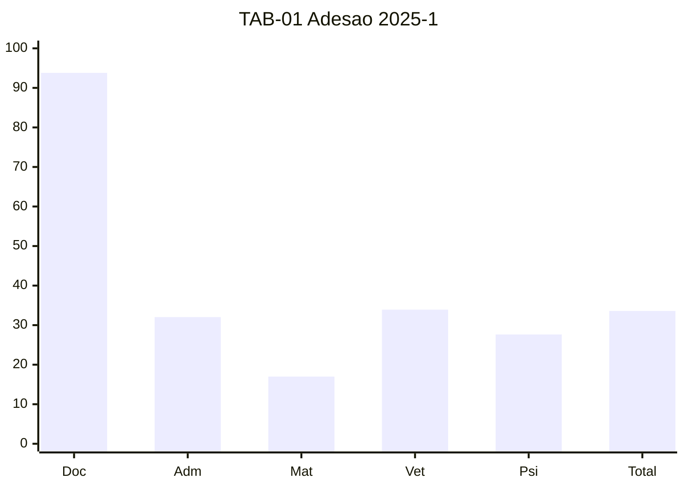
```mermaid
xychart-beta
    title "TAB-01 Adesao 2025-1"
    x-axis [Doc, Adm, Mat, Vet, Psi, Total]
    y-axis 0 --> 100
    bar [93.80, 32.04, 16.98, 33.91, 27.65, 33.59]
```

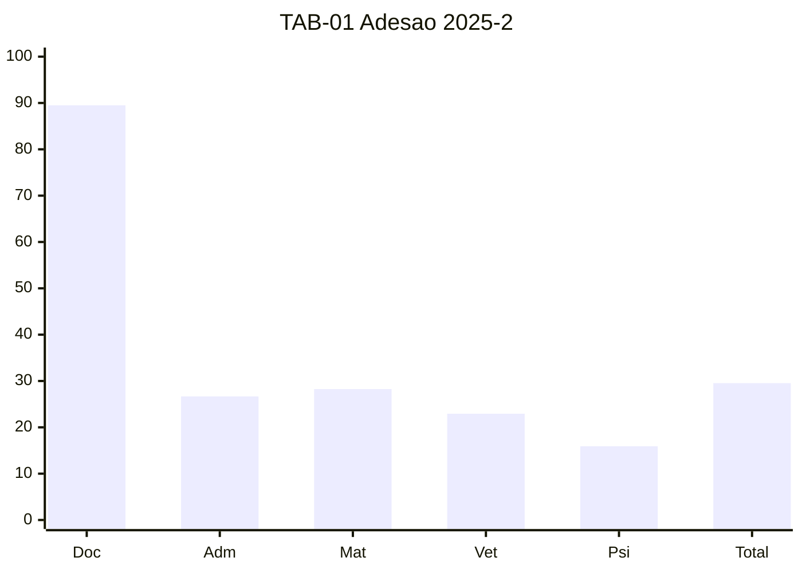
```mermaid
xychart-beta
    title "TAB-01 Adesao 2025-2"
    x-axis [Doc, Adm, Mat, Vet, Psi, Total]
    y-axis 0 --> 100
    bar [89.50, 26.67, 28.26, 22.94, 15.92, 29.54]
```

### TAB-02. Tabela 2, Processo pelos Estudantes (p. 14)

Q1 4,27; Q2 3,61; Q3 4,53 (percentuais na seção 1).

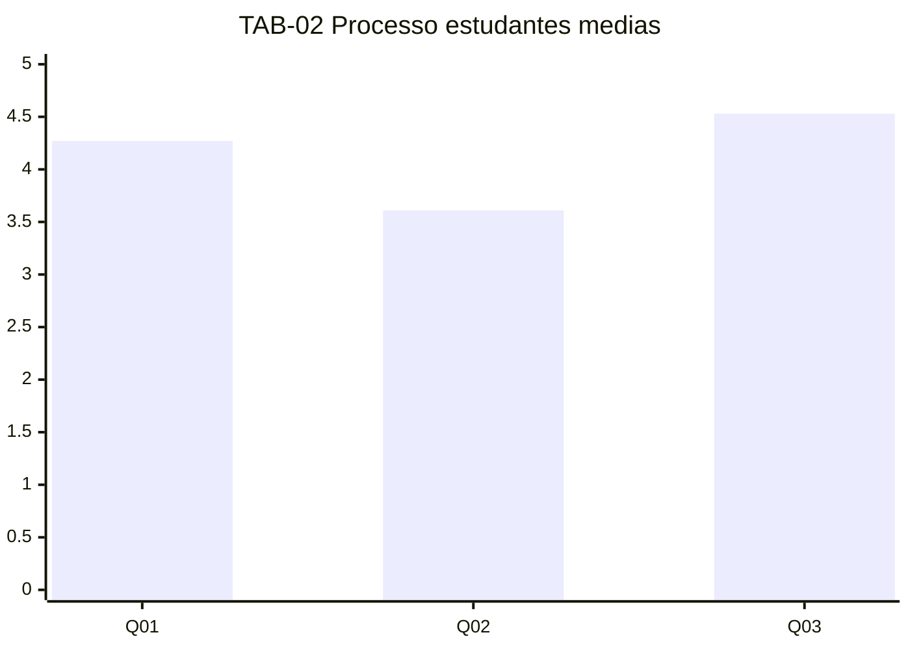
```mermaid
xychart-beta
    title "TAB-02 Processo estudantes medias"
    x-axis [Q01, Q02, Q03]
    y-axis 0 --> 5
    bar [4.27, 3.61, 4.53]
```

### TAB-03. Tabela 3, Processo pelos servidores (p. 15)

Q1 4,76; Q2 4,40; Q3 4,73 (percentuais na seção 1).

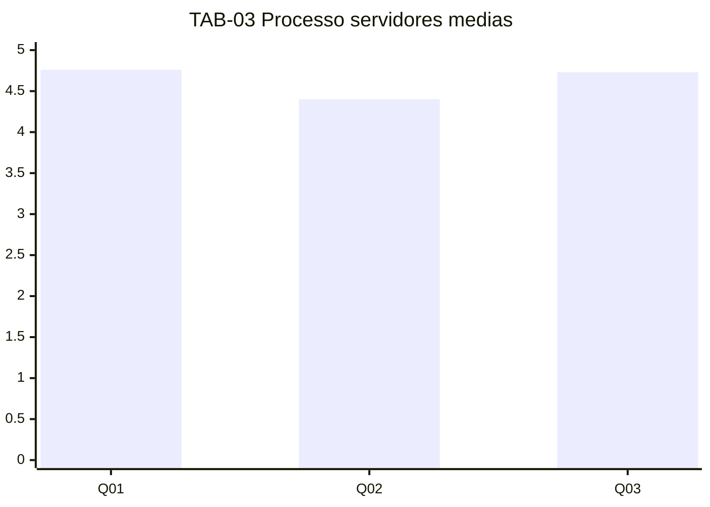
```mermaid
xychart-beta
    title "TAB-03 Processo servidores medias"
    x-axis [Q01, Q02, Q03]
    y-axis 0 --> 5
    bar [4.76, 4.40, 4.73]
```

### TAB-04. Tabela 4, Cursos oferecidos (p. 18)

Administração noturno 50; Matemática noturno 40; Medicina Veterinária integral 40; Psicologia integral 40. Sem mermaid (vagas por curso).

### TAB-05. Tabela 5, Auxílios em 2025 (p. 19)

Ordem Adm, Mat, Vet, Psi. Permanência 2/1/20/30 = 63; emergencial traço/1/5/1 = 8; moradia traço/traço/4/25 = 29; alimentação 2/2/17/22 = 43; transporte 1/3/4/1 = 9; creche traço/1/1/traço = 2; eventos traço/3/13/21 = 37; projetos traço/1/5/13 = 19; PCD traço/traço/traço/2 = 2; pedagógico traço/traço/traço/1 = 1; PIBIC/PIBITI traço/traço/5/2 = 7; PIBID traço/21/traço/traço = 21; extensão 1/1/1/9 = 12; monitoria 0; artista traço/traço/traço/2 = 2; mobilidade 1/traço/traço/traço = 1; psicológico 1/1/7/12 = 21. Sem mermaid (contagens por curso).

### TAB-06. Tabela 6, Desenvolvimento pelos Estudantes (p. 30)

Q1 4,43; Q2 4,39; Q3 4,38; Q4 4,15 (percentuais na seção 2).

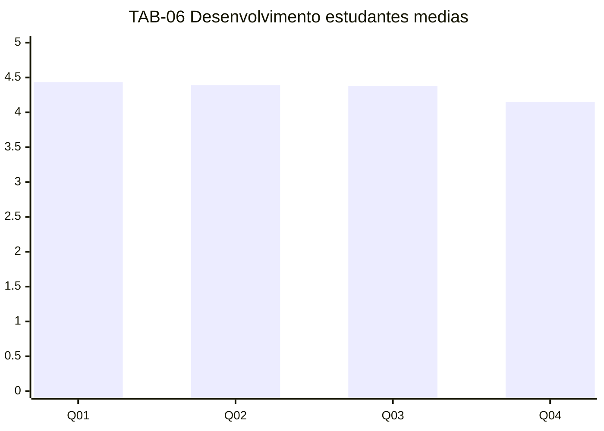
```mermaid
xychart-beta
    title "TAB-06 Desenvolvimento estudantes medias"
    x-axis [Q01, Q02, Q03, Q04]
    y-axis 0 --> 5
    bar [4.43, 4.39, 4.38, 4.15]
```

### TAB-07. Tabela 7, Desenvolvimento pelos servidores (p. 31)

Q1 4,51; Q2 4,67; Q3 4,53; Q4 4,42 (percentuais na seção 2).

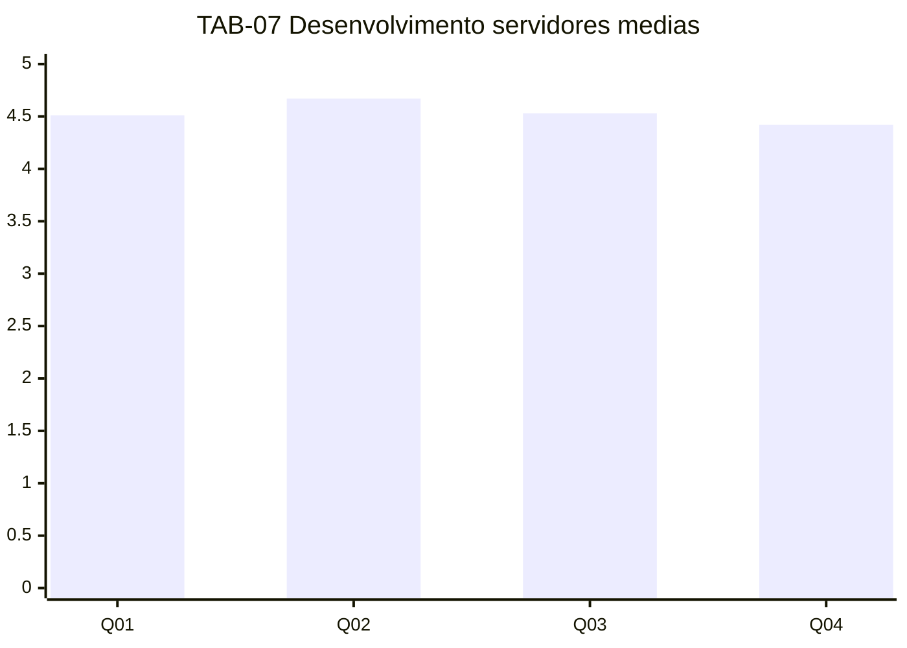
```mermaid
xychart-beta
    title "TAB-07 Desenvolvimento servidores medias"
    x-axis [Q01, Q02, Q03, Q04]
    y-axis 0 --> 5
    bar [4.51, 4.67, 4.53, 4.42]
```

### TAB-08. Tabela 8, Capacitação pelos professores e gestores (p. 32)

Q1 4,33; Q2 4,47 (percentuais na seção 2).

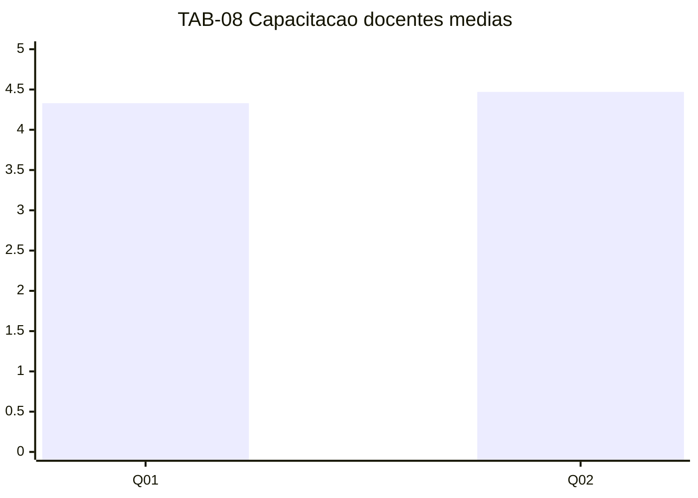
```mermaid
xychart-beta
    title "TAB-08 Capacitacao docentes medias"
    x-axis [Q01, Q02]
    y-axis 0 --> 5
    bar [4.33, 4.47]
```

### TAB-09. Tabela 9, Capacitação pelos técnicos (p. 33)

Q1 3,88; Q2 4,00 (percentuais na seção 2).

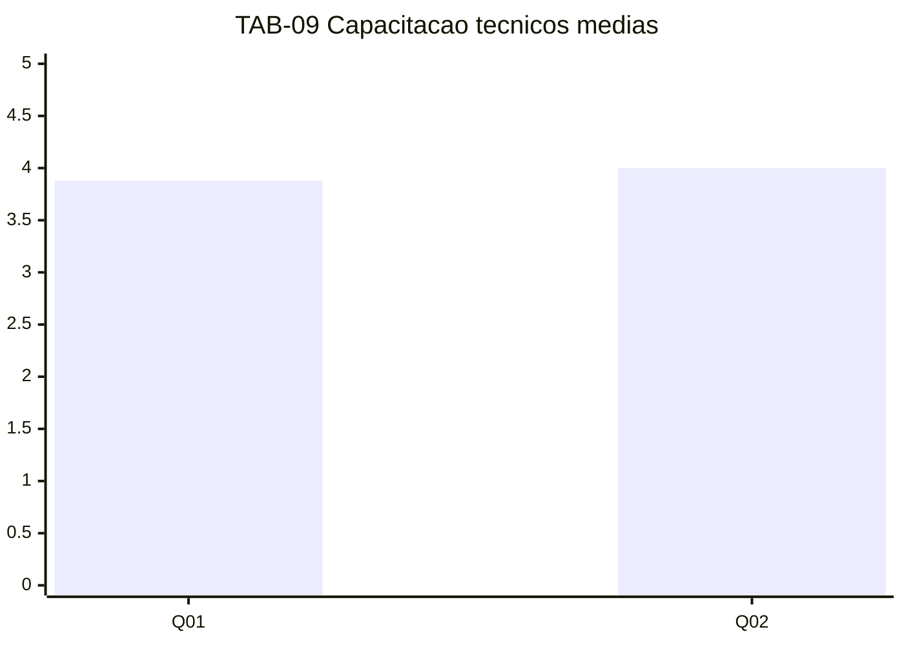
```mermaid
xychart-beta
    title "TAB-09 Capacitacao tecnicos medias"
    x-axis [Q01, Q02]
    y-axis 0 --> 5
    bar [3.88, 4.00]
```

### TAB-10. Tabela 10, Autoavaliação docentes e gestores (p. 34)

Q1 4,87; Q2 4,93; Q3 4,60; Q4 4,90; Q5 5,00; Q6 5,00 (percentuais na seção 2).

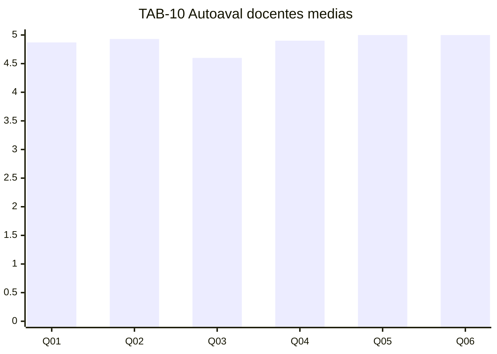
```mermaid
xychart-beta
    title "TAB-10 Autoaval docentes medias"
    x-axis [Q01, Q02, Q03, Q04, Q05, Q06]
    y-axis 0 --> 5
    bar [4.87, 4.93, 4.60, 4.90, 5.00, 5.00]
```

### TAB-11. Tabela 11, Autoavaliação técnicos (p. 35)

Q1 4,59; Q2 4,88; Q3 4,35; Q4 4,94; Q5 4,88 (percentuais na seção 2).

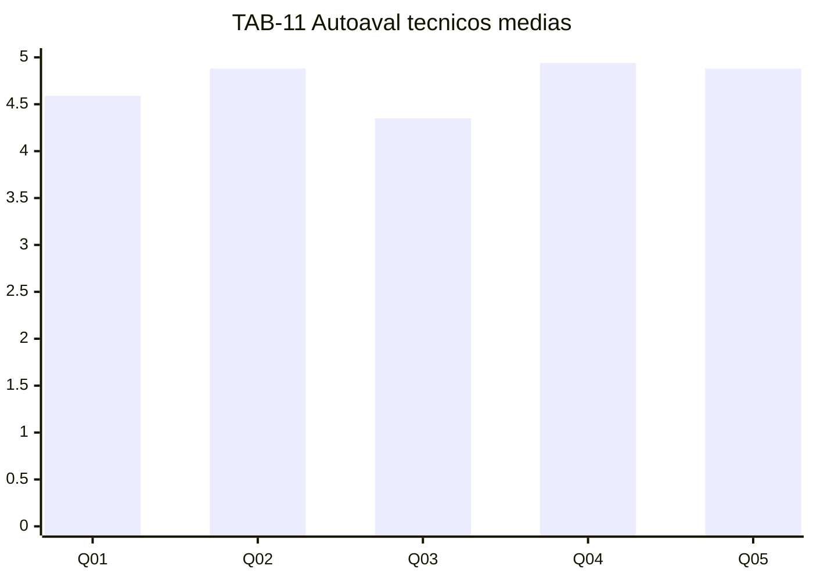
```mermaid
xychart-beta
    title "TAB-11 Autoaval tecnicos medias"
    x-axis [Q01, Q02, Q03, Q04, Q05]
    y-axis 0 --> 5
    bar [4.59, 4.88, 4.35, 4.94, 4.88]
```

### TAB-12. Tabela 12, Ensino pelos professores e diretor, 11 itens (p. 37)

Q1 4,65; Q2 4,60; Q3 4,63; Q4 4,46; Q5 4,38; Q6 3,83; Q7 4,00; Q8 3,64; Q9 4,00; Q10 3,96; Q11 4,21 (percentuais na seção 2).

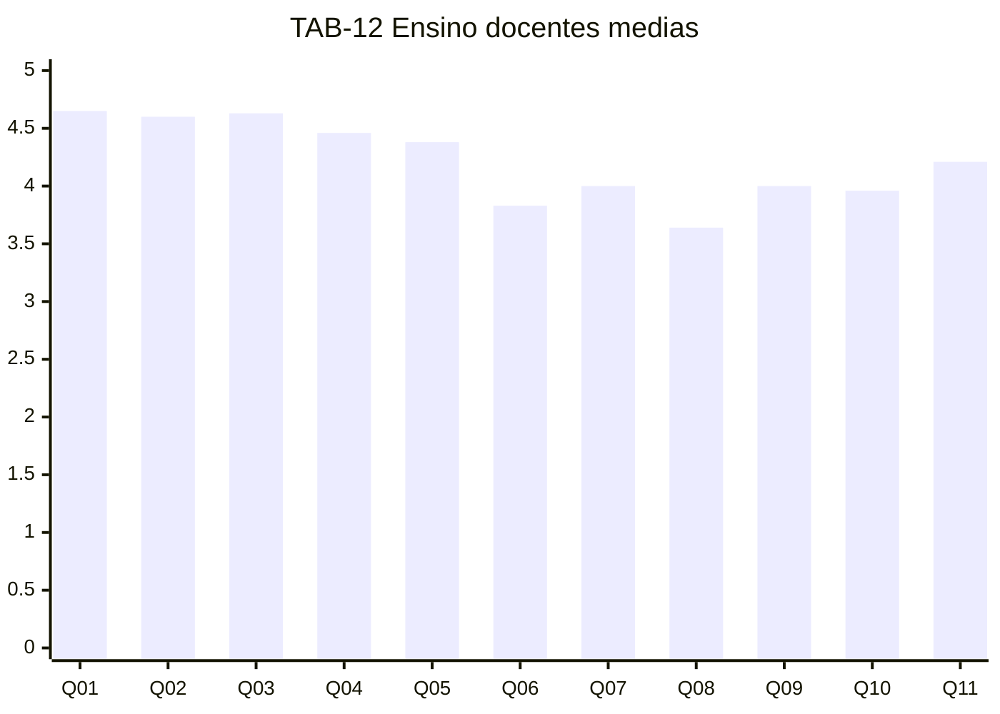
```mermaid
xychart-beta
    title "TAB-12 Ensino docentes medias"
    x-axis [Q01, Q02, Q03, Q04, Q05, Q06, Q07, Q08, Q09, Q10, Q11]
    y-axis 0 --> 5
    bar [4.65, 4.60, 4.63, 4.46, 4.38, 3.83, 4.00, 3.64, 4.00, 3.96, 4.21]
```

### TAB-13. Tabela 13, Ensino pelos técnicos (p. 39)

Q1 4,69; Q2 5,00; Q3 4,35; Q4 4,00; Q5 4,27; Q6 4,53; Q7 4,71 (percentuais na seção 2).

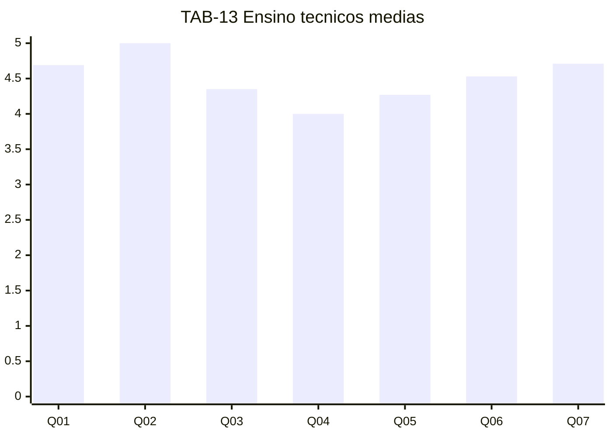
```mermaid
xychart-beta
    title "TAB-13 Ensino tecnicos medias"
    x-axis [Q01, Q02, Q03, Q04, Q05, Q06, Q07]
    y-axis 0 --> 5
    bar [4.69, 5.00, 4.35, 4.00, 4.27, 4.53, 4.71]
```

### TAB-14. Tabela 14, Atendimento pelos diretores e coordenadores (p. 40)

Q1 3,80; Q2 4,40; Q3 4,80 (percentuais na seção 2; Q2 soma mais de 100, defeito preservado).

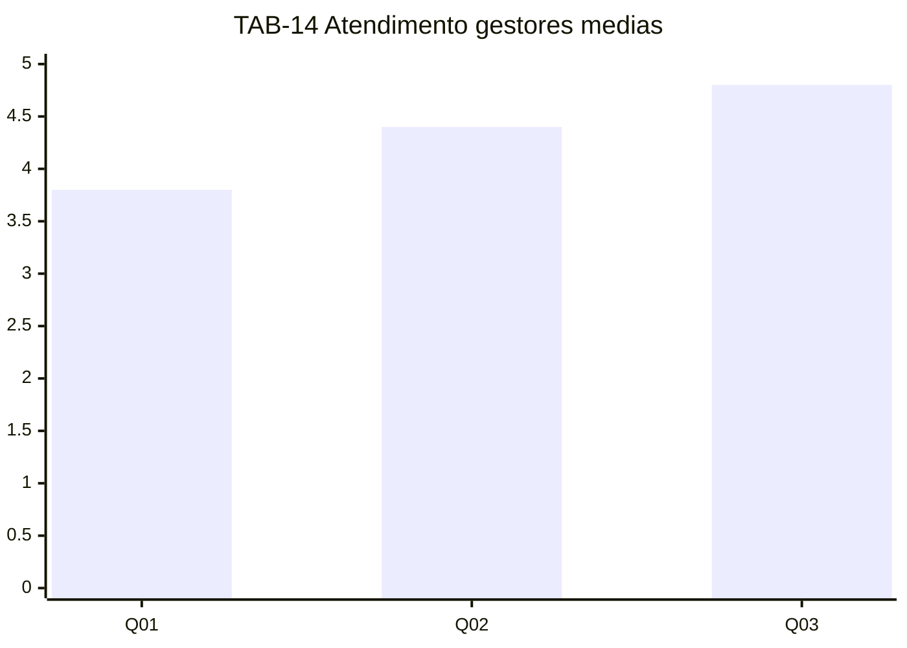
```mermaid
xychart-beta
    title "TAB-14 Atendimento gestores medias"
    x-axis [Q01, Q02, Q03]
    y-axis 0 --> 5
    bar [3.80, 4.40, 4.80]
```

### TAB-15. Tabela 15, Atendimento pelos professores (p. 41)

Q1 4,12; Q2 4,41 (percentuais na seção 2).

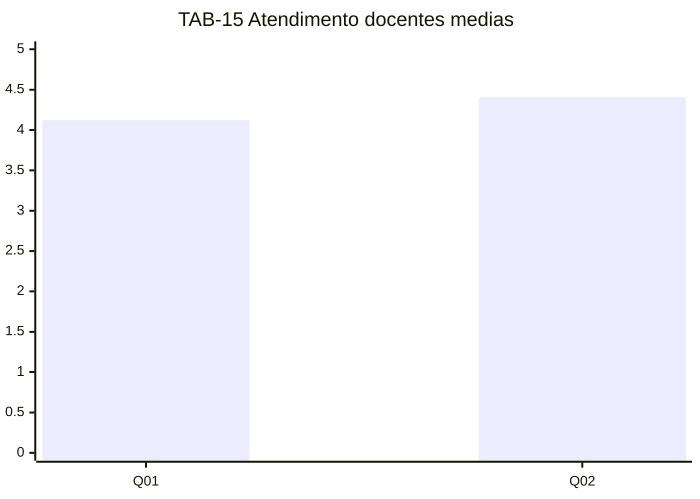
```mermaid
xychart-beta
    title "TAB-15 Atendimento docentes medias"
    x-axis [Q01, Q02]
    y-axis 0 --> 5
    bar [4.12, 4.41]
```

### TAB-16. Tabela 16, Atendimento pelos técnicos (p. 42)

Q1 3,56; Q2 3,82; Q3 4,71 (percentuais na seção 2).

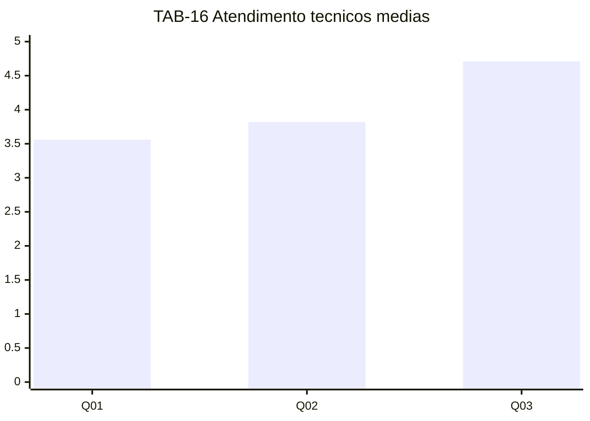
```mermaid
xychart-beta
    title "TAB-16 Atendimento tecnicos medias"
    x-axis [Q01, Q02, Q03]
    y-axis 0 --> 5
    bar [3.56, 3.82, 4.71]
```

### TAB-17. Tabela 17, Comunicação pelos servidores (p. 43)

Q1 4,60; Q2 4,59 (percentuais na seção 2).

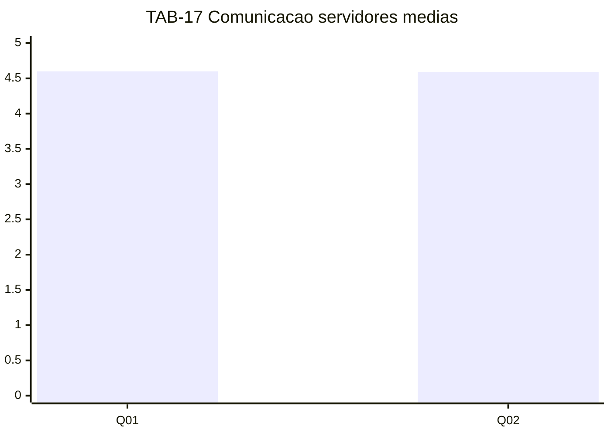
```mermaid
xychart-beta
    title "TAB-17 Comunicacao servidores medias"
    x-axis [Q01, Q02]
    y-axis 0 --> 5
    bar [4.60, 4.59]
```

### TAB-18. Tabela 18, Comunicação pelos Estudantes (p. 43)

Q1 4,65; Q2 4,41 (percentuais na seção 2).

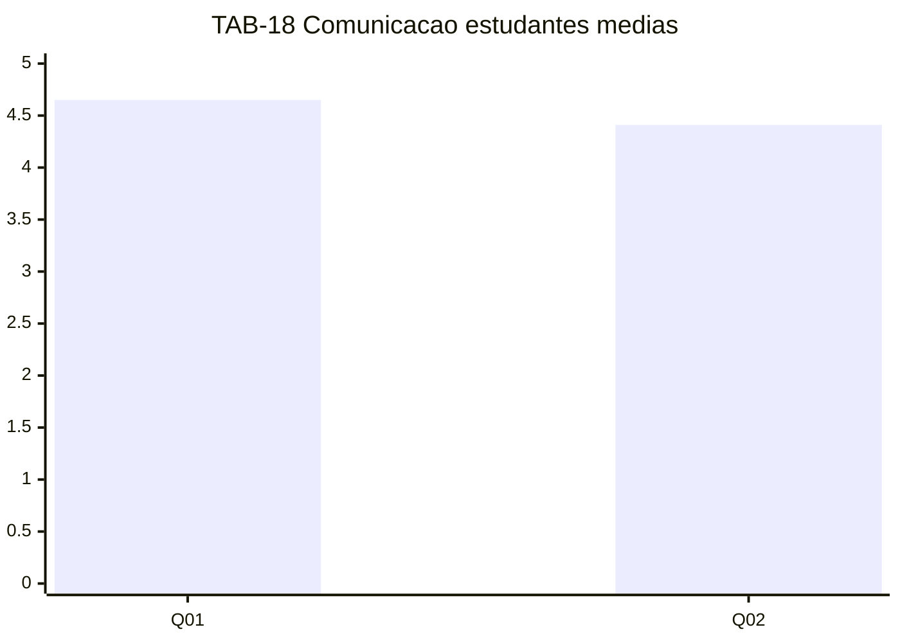
```mermaid
xychart-beta
    title "TAB-18 Comunicacao estudantes medias"
    x-axis [Q01, Q02]
    y-axis 0 --> 5
    bar [4.65, 4.41]
```

### TAB-19. Tabela 19, Infraestrutura pela comunidade, 29 itens (p. 45)

Aulas 3,84; Professores 4,40; Administrativas 4,20; Auditórios 3,73; Sanitárias 3,42; Informática 4,34; Internet 3,49; AVA 4,52; E-mail 4,69; Práticas 3,68; Convivência 3,51; Esportivos 1,87; Alimentação 2,78; Biblioteca 4,42; Acervo 4,05; Segurança 4,23; Iluminação 3,84; Acessibilidade 4,03; Limpeza 4,26; Parada 3,81; Estacionamento 4,15; Bicicletário 3,99; Vias 4,13; Telefonia 4,51; SISCAD 4,62; SIGPOS 4,81; Secretaria 4,54; Transporte 3,88; Secretaria qualidade 4,89 (percentuais na seção 2).

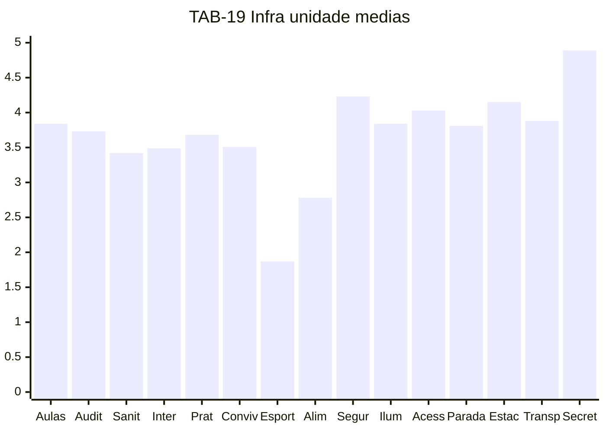
```mermaid
xychart-beta
    title "TAB-19 Infra unidade medias"
    x-axis [Aulas, Audit, Sanit, Inter, Prat, Conviv, Esport, Alim, Segur, Ilum, Acess, Parada, Estac, Transp, Secret]
    y-axis 0 --> 5
    bar [3.84, 3.73, 3.42, 3.49, 3.68, 3.51, 1.87, 2.78, 4.23, 3.84, 4.03, 3.81, 4.15, 3.88, 4.89]
```

### TAB-20. Tabela 20, Imagem pelos Estudantes (p. 46)

Q1 4,64; Q2 4,68 (percentuais na seção 2).

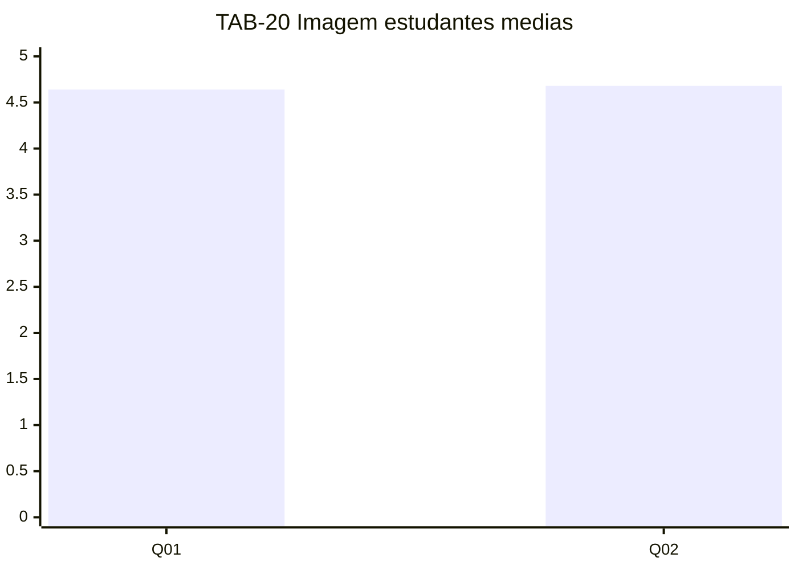
```mermaid
xychart-beta
    title "TAB-20 Imagem estudantes medias"
    x-axis [Q01, Q02]
    y-axis 0 --> 5
    bar [4.64, 4.68]
```

### TAB-21. Tabela 21, Imagem pelos Servidores (p. 47)

Q1 4,60; Q2 4,69 (percentuais na seção 2).

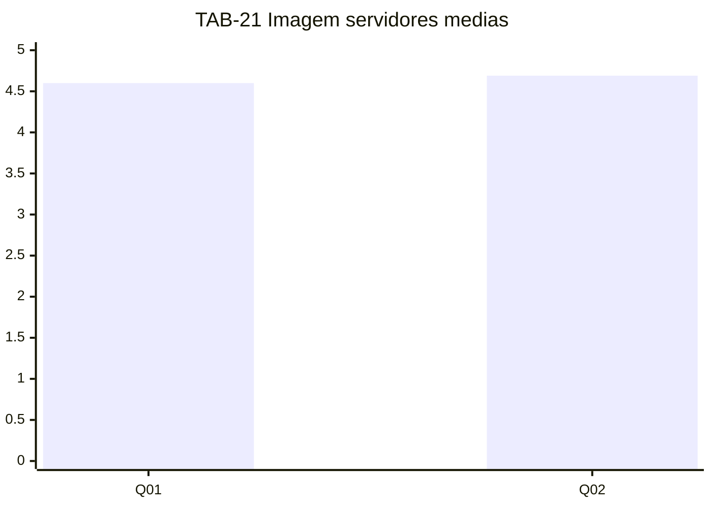
```mermaid
xychart-beta
    title "TAB-21 Imagem servidores medias"
    x-axis [Q01, Q02]
    y-axis 0 --> 5
    bar [4.60, 4.69]
```

### TAB-22. Tabela 22, Coordenação pelo coordenador, Administração (p. 59)

Q1 a Q4 5,00 (100).

```mermaid
xychart-beta
    title "TAB-22 Coord Adm medias"
    x-axis [Q01, Q02, Q03, Q04]
    y-axis 0 --> 5
    bar [5.00, 5.00, 5.00, 5.00]
```

### TAB-23. Tabela 23, Colegiado e NDE, Administração (p. 60)

Q1 e Q2 5,00 (100).

```mermaid
xychart-beta
    title "TAB-23 Coleg NDE Adm medias"
    x-axis [Q01, Q02]
    y-axis 0 --> 5
    bar [5.00, 5.00]
```

### TAB-24. Tabela 24, Coordenação pelos estudantes, Administração (p. 61)

Q1 4,73; Q2 4,54; Q3 4,70; Q4 4,43 (percentuais na seção 3).

```mermaid
xychart-beta
    title "TAB-24 Coord estud Adm medias"
    x-axis [Q01, Q02, Q03, Q04]
    y-axis 0 --> 5
    bar [4.73, 4.54, 4.70, 4.43]
```

### TAB-25. Tabela 25, Professores quanto ao próprio desempenho, Administração (p. 62)

Q1 4,88; Q2 4,91; Q3 4,87; Q4 4,93; Q5 4,95; Q6 4,98 (percentuais na seção 3).

```mermaid
xychart-beta
    title "TAB-25 Desempenho docente Adm medias"
    x-axis [Q01, Q02, Q03, Q04, Q05, Q06]
    y-axis 0 --> 5
    bar [4.88, 4.91, 4.87, 4.93, 4.95, 4.98]
```

### TAB-26. Tabela 26, Disciplinas e professores, Administração (p. 63)

Q1 4,54; Q2 4,51; Q3 4,60; Q4 4,57; Q5 4,63; Q6 4,76; Q7 4,69; Q8 4,57 (percentuais na seção 3).

```mermaid
xychart-beta
    title "TAB-26 Disciplinas Adm medias"
    x-axis [Q01, Q02, Q03, Q04, Q05, Q06, Q07, Q08]
    y-axis 0 --> 5
    bar [4.54, 4.51, 4.60, 4.57, 4.63, 4.76, 4.69, 4.57]
```

### TAB-27. Tabela 27, Desempenho próprio, Administração, 7 itens (p. 65)

Q1 4,41; Q2 4,29; Q3 4,42; Q4 4,41; Q5 4,24; Q6 4,41; Q7 4,77 (percentuais na seção 3; Q6 e Q7 de relacionamento).

```mermaid
xychart-beta
    title "TAB-27 Desempenho proprio Adm medias"
    x-axis [Q01, Q02, Q03, Q04, Q05, Q06, Q07]
    y-axis 0 --> 5
    bar [4.41, 4.29, 4.42, 4.41, 4.24, 4.41, 4.77]
```

### TAB-28. Tabela 28, Demais atividades, Administração (p. 66)

Q1 4,00; Q2 4,23; Q3 3,73; Q4 4,89; Q5 4,35 (percentuais na seção 3).

```mermaid
xychart-beta
    title "TAB-28 Demais atividades Adm medias"
    x-axis [Q01, Q02, Q03, Q04, Q05]
    y-axis 0 --> 5
    bar [4.00, 4.23, 3.73, 4.89, 4.35]
```

### TAB-29. Tabela 29, Desempenho pelos professores, Administração (p. 67)

Q1 4,47; Q2 4,19; Q3 4,42; Q4 4,67; Q5 4,42 (percentuais na seção 3).

```mermaid
xychart-beta
    title "TAB-29 Desempenho docente Adm medias"
    x-axis [Q01, Q02, Q03, Q04, Q05]
    y-axis 0 --> 5
    bar [4.47, 4.19, 4.42, 4.67, 4.42]
```

### TAB-30. Tabela 30, Infraestrutura, Administração, 8 itens (p. 68)

Informática 4,26; Internet 3,26; AVA 4,76; Práticas 3,98; Biblioteca 4,42; Acervo 4,39; Sanitárias 3,24; Aulas 3,96 (percentuais na seção 3).

```mermaid
xychart-beta
    title "TAB-30 Infra Adm medias"
    x-axis [Info, Net, AVA, Prat, Bib, Acervo, Sanit, Aulas]
    y-axis 0 --> 5
    bar [4.26, 3.26, 4.76, 3.98, 4.42, 4.39, 3.24, 3.96]
```

### TAB-31. Tabela 31, Coordenação pelo coordenador, Matemática (p. 79)

Q1 4,00; Q2 4,00; Q3 3,00; Q4 4,00 (percentuais na seção 4).

```mermaid
xychart-beta
    title "TAB-31 Coord Mat medias"
    x-axis [Q01, Q02, Q03, Q04]
    y-axis 0 --> 5
    bar [4.00, 4.00, 3.00, 4.00]
```

### TAB-32. Tabela 32, Colegiado e NDE, Matemática (p. 80)

Q1 e Q2 4,00 (0/100/0/0/0/0).

```mermaid
xychart-beta
    title "TAB-32 Coleg NDE Mat medias"
    x-axis [Q01, Q02]
    y-axis 0 --> 5
    bar [4.00, 4.00]
```

### TAB-33. Tabela 33, Coordenação pelos estudantes, Matemática (p. 81)

Q1 3,33; Q2 3,89; Q3 3,33; Q4 2,83 (percentuais na seção 4; Q4 fragilidade formal).

```mermaid
xychart-beta
    title "TAB-33 Coord estud Mat medias"
    x-axis [Q01, Q02, Q03, Q04]
    y-axis 0 --> 5
    bar [3.33, 3.89, 3.33, 2.83]
```

### TAB-34. Tabela 34, Professores quanto ao próprio desempenho, Matemática (p. 82)

Q1 4,93; Q2 4,78; Q3 5,00; Q4 4,94; Q5 4,94; Q6 4,97 (percentuais na seção 4).

```mermaid
xychart-beta
    title "TAB-34 Desempenho docente Mat medias"
    x-axis [Q01, Q02, Q03, Q04, Q05, Q06]
    y-axis 0 --> 5
    bar [4.93, 4.78, 5.00, 4.94, 4.94, 4.97]
```

### TAB-35. Tabela 35, Disciplinas e professores, Matemática (p. 83)

Q1 4,49; Q2 4,37; Q3 4,55; Q4 4,55; Q5 4,61; Q6 4,56; Q7 4,69; Q8 4,59 (percentuais na seção 4).

```mermaid
xychart-beta
    title "TAB-35 Disciplinas Mat medias"
    x-axis [Q01, Q02, Q03, Q04, Q05, Q06, Q07, Q08]
    y-axis 0 --> 5
    bar [4.49, 4.37, 4.55, 4.55, 4.61, 4.56, 4.69, 4.59]
```

### TAB-36. Tabela 36, Desempenho próprio, Matemática, 7 itens (p. 85)

Q1 4,20; Q2 4,29; Q3 4,35; Q4 4,09; Q5 3,80; Q6 4,01; Q7 4,87 (percentuais na seção 4).

```mermaid
xychart-beta
    title "TAB-36 Desempenho proprio Mat medias"
    x-axis [Q01, Q02, Q03, Q04, Q05, Q06, Q07]
    y-axis 0 --> 5
    bar [4.20, 4.29, 4.35, 4.09, 3.80, 4.01, 4.87]
```

### TAB-37. Tabela 37, Demais atividades, Matemática (p. 86)

Q1 4,22; Q2 4,00; Q3 3,71; Q4 4,89; Q5 4,00 (percentuais na seção 4).

```mermaid
xychart-beta
    title "TAB-37 Demais atividades Mat medias"
    x-axis [Q01, Q02, Q03, Q04, Q05]
    y-axis 0 --> 5
    bar [4.22, 4.00, 3.71, 4.89, 4.00]
```

### TAB-38. Tabela 38, Desempenho pelos professores, Matemática (p. 87)

Q1 3,88; Q2 3,73; Q3 4,12; Q4 4,76; Q5 3,76 (percentuais na seção 4).

```mermaid
xychart-beta
    title "TAB-38 Desempenho docente Mat medias"
    x-axis [Q01, Q02, Q03, Q04, Q05]
    y-axis 0 --> 5
    bar [3.88, 3.73, 4.12, 4.76, 3.76]
```

### TAB-39. Tabela 39, Infraestrutura, Matemática, 8 itens (p. 88)

Informática 4,00; Internet 3,70; AVA 4,70; Práticas 3,88; Biblioteca 4,30; Acervo 4,25; Sanitárias 2,70; Aulas 3,30 (percentuais na seção 4).

```mermaid
xychart-beta
    title "TAB-39 Infra Mat medias"
    x-axis [Info, Net, AVA, Prat, Bib, Acervo, Sanit, Aulas]
    y-axis 0 --> 5
    bar [4.00, 3.70, 4.70, 3.88, 4.30, 4.25, 2.70, 3.30]
```

### TAB-40. Tabela 40, Coordenação pelo coordenador, Medicina Veterinária (p. 99)

Q1 a Q4 5,00 (100).

```mermaid
xychart-beta
    title "TAB-40 Coord Vet medias"
    x-axis [Q01, Q02, Q03, Q04]
    y-axis 0 --> 5
    bar [5.00, 5.00, 5.00, 5.00]
```

### TAB-41. Tabela 41, Colegiado e NDE, Medicina Veterinária (p. 100)

Q1 e Q2 5,00 (100).

```mermaid
xychart-beta
    title "TAB-41 Coleg NDE Vet medias"
    x-axis [Q01, Q02]
    y-axis 0 --> 5
    bar [5.00, 5.00]
```

### TAB-42. Tabela 42, Coordenação pelos estudantes, Medicina Veterinária (p. 101)

Q1 4,42; Q2 4,35; Q3 4,63; Q4 4,41 (percentuais na seção 5).

```mermaid
xychart-beta
    title "TAB-42 Coord estud Vet medias"
    x-axis [Q01, Q02, Q03, Q04]
    y-axis 0 --> 5
    bar [4.42, 4.35, 4.63, 4.41]
```

### TAB-43. Tabela 43, Professores quanto ao próprio desempenho, Medicina Veterinária (p. 102)

Q1 4,95; Q2 4,90; Q3 4,90; Q4 4,93; Q5 5,00; Q6 4,98 (percentuais na seção 5).

```mermaid
xychart-beta
    title "TAB-43 Desempenho docente Vet medias"
    x-axis [Q01, Q02, Q03, Q04, Q05, Q06]
    y-axis 0 --> 5
    bar [4.95, 4.90, 4.90, 4.93, 5.00, 4.98]
```

### TAB-44. Tabela 44, Disciplinas e professores, Medicina Veterinária (p. 103)

Q1 4,55; Q2 4,51; Q3 4,65; Q4 4,34; Q5 4,59; Q6 4,70; Q7 4,69; Q8 4,57 (percentuais na seção 5).

```mermaid
xychart-beta
    title "TAB-44 Disciplinas Vet medias"
    x-axis [Q01, Q02, Q03, Q04, Q05, Q06, Q07, Q08]
    y-axis 0 --> 5
    bar [4.55, 4.51, 4.65, 4.34, 4.59, 4.70, 4.69, 4.57]
```

### TAB-45. Tabela 45, Desempenho próprio, Medicina Veterinária, 7 itens (p. 105)

Q1 4,25; Q2 4,39; Q3 4,33; Q4 4,09; Q5 4,01; Q6 4,52; Q7 4,98 (percentuais na seção 5; Q6 e Q7 de relacionamento).

```mermaid
xychart-beta
    title "TAB-45 Desempenho proprio Vet medias"
    x-axis [Q01, Q02, Q03, Q04, Q05, Q06, Q07]
    y-axis 0 --> 5
    bar [4.25, 4.39, 4.33, 4.09, 4.01, 4.52, 4.98]
```

### TAB-46. Tabela 46, Demais atividades, Medicina Veterinária (p. 106)

Q1 4,33; Q2 3,77; Q3 3,89; Q4 4,85; Q5 4,49 (percentuais na seção 5).

```mermaid
xychart-beta
    title "TAB-46 Demais atividades Vet medias"
    x-axis [Q01, Q02, Q03, Q04, Q05]
    y-axis 0 --> 5
    bar [4.33, 3.77, 3.89, 4.85, 4.49]
```

### TAB-47. Tabela 47, Desempenho pelos professores, Medicina Veterinária (p. 107)

Q1 3,32; Q2 3,39; Q3 3,44; Q4 4,12; Q5 3,51 (percentuais na seção 5; mais crítico do relatório).

```mermaid
xychart-beta
    title "TAB-47 Desempenho docente Vet medias"
    x-axis [Q01, Q02, Q03, Q04, Q05]
    y-axis 0 --> 5
    bar [3.32, 3.39, 3.44, 4.12, 3.51]
```

### TAB-48. Tabela 48, Infraestrutura, Medicina Veterinária, 8 itens (p. 108)

Informática 4,31; Internet 3,15; AVA 3,97; Práticas 3,18; Biblioteca 4,13; Acervo 3,49; Sanitárias 3,45; Aulas 3,75 (percentuais na seção 5).

```mermaid
xychart-beta
    title "TAB-48 Infra Vet medias"
    x-axis [Info, Net, AVA, Prat, Bib, Acervo, Sanit, Aulas]
    y-axis 0 --> 5
    bar [4.31, 3.15, 3.97, 3.18, 4.13, 3.49, 3.45, 3.75]
```

### TAB-49. Tabela 49, Coordenação pelo coordenador, Psicologia (p. 119)

Q1 a Q4 5,00 (100).

```mermaid
xychart-beta
    title "TAB-49 Coord Psi medias"
    x-axis [Q01, Q02, Q03, Q04]
    y-axis 0 --> 5
    bar [5.00, 5.00, 5.00, 5.00]
```

### TAB-50. Tabela 50, Colegiado e NDE, Psicologia, com NDE em 4,00 (p. 120)

Q1 5,00 (100); Q2 4,00 (0/100/0/0/0/0).

```mermaid
xychart-beta
    title "TAB-50 Coleg NDE Psi medias"
    x-axis [Coleg, NDE]
    y-axis 0 --> 5
    bar [5.00, 4.00]
```

### TAB-51. Tabela 51, Coordenação pelos estudantes, Psicologia (p. 121)

Q1 4,42; Q2 4,24; Q3 4,70; Q4 4,35 (percentuais na seção 6).

```mermaid
xychart-beta
    title "TAB-51 Coord estud Psi medias"
    x-axis [Q01, Q02, Q03, Q04]
    y-axis 0 --> 5
    bar [4.42, 4.24, 4.70, 4.35]
```

### TAB-52. Tabela 52, Professores quanto ao próprio desempenho, Psicologia (p. 122)

Q1 4,97; Q2 4,94; Q3 4,86; Q4 4,92; Q5 4,96; Q6 4,98 (percentuais na seção 6).

```mermaid
xychart-beta
    title "TAB-52 Desempenho docente Psi medias"
    x-axis [Q01, Q02, Q03, Q04, Q05, Q06]
    y-axis 0 --> 5
    bar [4.97, 4.94, 4.86, 4.92, 4.96, 4.98]
```

### TAB-53. Tabela 53, Disciplinas e professores, Psicologia (p. 123)

Q1 4,57; Q2 4,61; Q3 4,81; Q4 4,64; Q5 4,79; Q6 4,73; Q7 4,67; Q8 4,70 (percentuais na seção 6).

```mermaid
xychart-beta
    title "TAB-53 Disciplinas Psi medias"
    x-axis [Q01, Q02, Q03, Q04, Q05, Q06, Q07, Q08]
    y-axis 0 --> 5
    bar [4.57, 4.61, 4.81, 4.64, 4.79, 4.73, 4.67, 4.70]
```

### TAB-54. Tabela 54, Desempenho próprio, Psicologia, 7 itens (p. 125)

Q1 4,39; Q2 4,14; Q3 4,48; Q4 4,39; Q5 4,19; Q6 4,24; Q7 4,84 (percentuais na seção 6; Q6 e Q7 de relacionamento).

```mermaid
xychart-beta
    title "TAB-54 Desempenho proprio Psi medias"
    x-axis [Q01, Q02, Q03, Q04, Q05, Q06, Q07]
    y-axis 0 --> 5
    bar [4.39, 4.14, 4.48, 4.39, 4.19, 4.24, 4.84]
```

### TAB-55. Tabela 55, Demais atividades, Psicologia (p. 126)

Q1 3,94; Q2 3,97; Q3 3,59; Q4 4,85; Q5 4,66 (percentuais na seção 6; Q3 mais crítico do segmento).

```mermaid
xychart-beta
    title "TAB-55 Demais atividades Psi medias"
    x-axis [Q01, Q02, Q03, Q04, Q05]
    y-axis 0 --> 5
    bar [3.94, 3.97, 3.59, 4.85, 4.66]
```

### TAB-56. Tabela 56, Desempenho pelos professores, Psicologia (p. 127)

Q1 4,37; Q2 4,40; Q3 4,43; Q4 4,94; Q5 4,58 (percentuais na seção 6; melhor perfil entre cursos).

```mermaid
xychart-beta
    title "TAB-56 Desempenho docente Psi medias"
    x-axis [Q01, Q02, Q03, Q04, Q05]
    y-axis 0 --> 5
    bar [4.37, 4.40, 4.43, 4.94, 4.58]
```

### TAB-57. Tabela 57, Infraestrutura, Psicologia, 8 itens (p. 128)

Informática 4,29; Internet 3,26; AVA 4,45; Práticas 3,68; Biblioteca 4,38; Acervo 4,07; Sanitárias 3,24; Aulas 3,77 (percentuais na seção 6).

```mermaid
xychart-beta
    title "TAB-57 Infra Psi medias"
    x-axis [Info, Net, AVA, Prat, Bib, Acervo, Sanit, Aulas]
    y-axis 0 --> 5
    bar [4.29, 3.26, 4.45, 3.68, 4.38, 4.07, 3.24, 3.77]
```

## 9. Lacunas e defeitos declarados desta conversão

Cobertura integral das 145 páginas, 57 tabelas, 25 figuras e 8 quadros, sem lacunas de valores tabulares: todas as Tabelas 1 a 57 com médias e percentuais transcritos. Lacunas declaradas apenas para números internos das figuras vetoriais EMF (distribuições visuais sem valores na narrativa: Figuras 2, 4, 5, 7, 9, 11 a 13, 15 a 17, 19 a 21, 22 a 24), sem estimativa. Defeitos do original preservados: capa com abril de 2026 para ano base 2025; coords 2025-2 sem absolutos; Tabela 12 com 11 itens; Tabelas 27, 36, 45 e 54 com 7 itens e duplo relacionamento; Tabela 14 com Q2 acima de 100; Tabela 19 com 55,12 consistente e duplo item de secretaria; Tabelas 29, 38, 47 e 56 com "a ulas"; Tabelas 30, 39, 48 e 57 com 8 itens; curso com CAEN ante COUN e 3.000/3.016/3.015 horas; Veterinária com 4.105 ante 4.087 e "Veretinária"; Psicologia com NDE em 4,00. Nenhum valor estimado. Feedback negativo anonimizado; nomes apenas em elogios. Visão aplicada: logotipo identificado como institucional sem dados; EMF não renderizável declarado.
